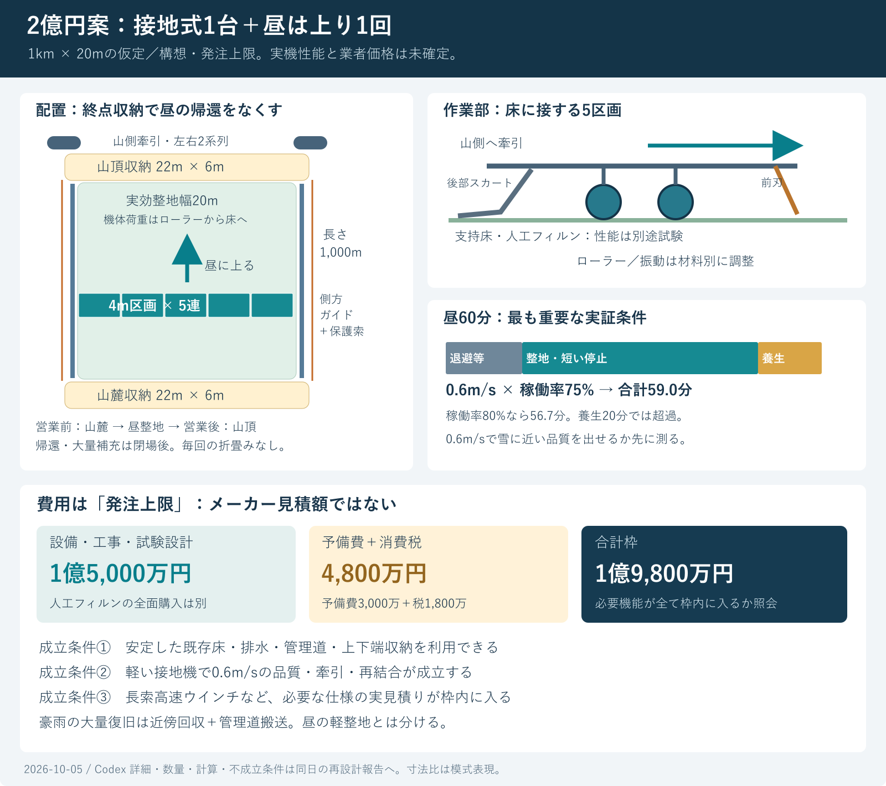

# 2億円以内を目指す整地設備の再設計

> **2026-10-06追記**：材料が新雪の圧雪と同じ滑走感を出すかを、[原点監査](GPT回答_原点監査_雪の結晶構造と砂泥化懸念_20261006.md)で再検証した。現行鉱物粒床の雪状構造・低摩擦・エッジ応答は未実証。本設備案は材料の合格後に検討する条件付き構想であり、設備の予算計算を材料の完成根拠にしない。

2026-10-05／Codex。依頼者の「そこまで高いのか。2億以内に抑える方法を徹底的に考えて」への回答。

**提案は、幅20mの接地式整地機を1台だけ設置し、昼は山麓から山頂への1回で終える方式である。重い橋形の機械を吊る2kmの構造レールと、3〜5台の重複設備を外す。発注枠1億5,000万円、予備費3,000万円、消費税1,800万円、合計1億9,800万円を上限として設計する。これは達成済みの見積額ではなく、各社に可否を回答してもらう発注上限である。**

前回の7.54〜9.04億円は、未見積りの単価に、12〜16tの橋形機械・多数の機械・連続支持桁を組み合わせた仮計算だった。その価格が必要最低額である根拠はない。今回、市販の軽量整地用具と斜面の牽引施工を確認し、荷重の受け方と1日の工程から組み直した。前回価格を市場価格として扱わない。

今回の成果は、構成図、60分の工程、牽引力、必要な材料・機器・施工重機、費用枠、材料購入を含める場合の限界、試験条件、照会仕様、再計算コードまでである。製品完成・材料性能・工事受注価格は未確定。

## 1. 範囲と固定する条件

| 項目 | 今回の扱い |
|---|---|
| 予算 | 暫定的に設備・必要な限定土木・搬入設置・設計試験・予備費・消費税込み2億円。人工フィルンの全面購入費は別。範囲の回答待ちなので第9章に素材込みの場合も計算 |
| 寸法 | **斜面に沿う長さ1,000m、実効整地幅20m、最大30°は比較用の仮定。依頼者が指定した現場寸法ではない**。初期模型は直線・一定幅。曲線や大きい縦断変化は追加設計。Claudeの土木計画の幅40mとは別 |
| 営業 | 回覧板の9〜17時、4〜5時間ごと保守を使用。昼13〜14時を1回閉鎖する工程例 |
| 昼閉鎖 | 依頼者が回答した約60分。人の退避、機械の出入り、材料の再結合、品質確認を含む |
| 材料性能 | 気温30℃以上・表面約50℃、新雪の圧雪に近い抵抗とエッジの抜け、人体への影響、冬の接続と排水を維持。費用のため合格基準を緩めない |
| 現地条件 | 安定した既存ゲレンデ、管理道と電源の利用、上下端の収納用地、主要排水の再利用が前提。山林からの新規造成、擁壁群、新リフト、用地購入、建物は今回の枠外 |
| 現状 | 実見積り0件、実機試験0件。この文書の費用枠を価格証拠に引用しない |

上記の現地条件に合わない場所で必要な工事は、予算から除外して着工するのではなく、配置変更・工法変更・施工面積の段階化の対象とする。現場調査後の必須工事が枠内に入ることが着工条件。

## 2. 高額化した構造を変える

| 前回案の費用要因 | 今回の変更 | 守ること・確認すること |
|---|---|---|
| 12〜16tの全幅機械を両側で支持 | 4m幅の接地モジュール5連。約4tを設計の出発点にする | 4tは製作図から積算する目標。湿った床の支持力、沈下、ローラー荷重配分を測る |
| レール2km＋連続支持桁＋多数基礎 | 両側に低い誘導ガイドと保護された索路。自重はローラーから床へ伝える | ガイドは横ずれ案内を担う。曲線・ねじれ・局部横力の支持は省略できない |
| 60分達成のため3〜5台 | 日中は1台が1kmを上る1回だけ。帰還は閉場後 | 朝の開始位置を山麓、昼の終了位置を山頂に固定する運用が必要 |
| 日ごとの片持ち展開・折畳み | 上下端に全幅の収納区画 | 毎回折らない。輸送・修理時だけ4m単位で分割。収納用地がない場所では別設計 |
| 毎回大量の材料を山麓から搬送 | 昼は凹凸の局所補修。大量の回収物は閉場後に管理道で戻す | 2億円案の昼用機に、大量運搬能力を持たせたことにはしない |
| 完全無人を初号機から狙う | 自動走行・同期制御＋閉鎖確認をする監督者 | 無人で人が混在する営業は想定しない。停止・制動・人の排除は削減対象にしない |

前回の単機1km案でも、レール・連続支持桁・基礎等6項目は仮係数込み約1.71億円だった。まずこの荷重経路を変えることが、数％の値引きより効く。**ただし旧案1.71億円と新案ガイド枠1,200万円の差を「実現した節約額」として計上してはいけない。両方とも見積り未取得で、担当機能も違う。**

## 3. 構成と必要数量

### 3.1 作業機

- 実効幅20m。約4m×5区画。作業機外形は概ね幅22m×前後3〜4mを設計開始値とする。工具の重なりで未処理の筋を作らない。
- 前方に高さを変えられる刃・小容量の材料溜まり、中央に地形へ追従するローラーと選択式振動機、後方に交換式の仕上げスカート。各モジュールで切削量を調節する。
- 全機の材料保持量は通常0.3m³を計算の出発点とする。過負荷時は刃を上げ、回収物を溜め続けない。断面積や許容の溝深さは材料試験で決める。
- 4m区画の上下追従を許す一方、前後方向のずれ・蛇行は水平面のトラスと連結部で抑える。「柔らかい鎖でつなぐだけ」にはしない。
- 中央条件の作業機抵抗37.2kNを、幅20mに一様に分布させて両端で引く単純模型では、平面内曲げは約93kN·m。深さ1mの平面トラスでも弦材軸力は約93kNの桁になる。軽量化しても部材・座屈・ピン疲労の設計は必要。
- 材料接触部は耐摩耗の交換刃、腐食条件に合う鋼・ステンレス、交換可能な弾性スカートを候補とする。接触材からの摩耗粉・油漏れを材料試験に含める。全鋼材を高価なステンレスにする仕様にはしない。
- 夜間に下り仕上げを行えるよう、反対側の刃・スカートを切替式にするか、区画ごとに工具を反転する。昼に全幅機械を180°回す工程は置かない。

### 3.2 ガイド・索・収納

| 部位 | 設計開始数量・能力 | 数量の注意 |
|---|---|---|
| 作業機 | 接地式20m幅1台、5区画、総質量目標4t | 含水材料の0.54tは機体4tと別 |
| 側方案内 | 両側各1,000m、計2,000m | 地面に沿う案内。高架の荷重支持レールではない。段差・凍上の調整を含む |
| 主牽引 | 山側左右2系列、各50kN級・連続0.6m/sの照会仕様 | 50kNと0.6m/sを同時に満たすこと。間欠・最内層だけの表示を採用しない |
| 電動機 | 各45kWを照会開始値、計90kW | 駆動効率75%なら50kN×0.6m/sで各40kW。振動機などは別負荷 |
| 主索 | 各1,100m程度、計2,200m | 索端、余巻、端部まで含め現地で確定。索質量2kg/mは計算仮定。径・構成・破断荷重は未選定 |
| 巻取り | 大容量ドラム＋整列巻き、または牽引キャプスタン＋保管巻取り | 太い索1kmを小型市販ドラムに巻けると仮定しない。外層の速度・牽引力・発熱も回答対象 |
| 収納区画 | 上下端各22m×6m程度、計264m² | 営業中の滑走線、退出路、リフト動線の外。凍上・積雪除去・排水を考慮 |
| 夜間帰還 | 上側から制御して下げる。平坦部・抵抗の大きい部分は補助牽引／収納用駆動で引く | 重力だけで全区間戻れると仮定しない。補助索を日中の滑走面へ残さない |
| 給電 | 側方の保護された給電または電池＋充電 | 全面を横切る電線・索を営業中に残さない。主駆動90kWの瞬時電力と受電容量を照合 |

左右の索は外周の保護された経路に配置し、左右位置・張力・工具荷重を監視する。片側の索切断・片側停止で機械が旋回しないよう、独立した保持と停止機構、連結部、案内逸脱止めまで一体で設計する。通常運転50kN級という値を、片側故障時の十分な保持能力と読み替えない。

太い索の長い巻取りは、軽量作業機に変えても残る費用要因である。例えば径24mm・1,100mの索は外径から算出する体積だけで約0.50m³となる。巻き隙間・芯胴・端部余裕は別。索質量を2kg/mとすれば1本2.2tであり、山側の基礎にはドラム・駆動機の重量も加わる。径24mmは容量感を示す例で、強度選定済みの径ではない。

収納・作業幅とガイド・柵・排水を合わせ、用地幅は20mより広い。幅24m程度を最初の配置検討に使い、現場の法面や安全離隔で増える分も測量する。

## 4. 60分を守る工程

**営業9〜17時で昼1回という運用なら、昼の空荷帰還は不要になる。** 朝は機械を山麓に収納し、昼に上りながら整地し、山頂の区画に収納する。閉場後に大量補充・上方への材料戻し・必要な複数回の施工を行い、翌朝までに下りの軽仕上げ等を終えて山麓へ戻す。夜間は営業しないが保守作業は必要で、照明・人件費は維持費に含む。

計算式は「閉鎖時間＝1,000m÷速度÷稼働率÷60＋退避等12分＋最終部分の養生時間」。稼働率には刃の調整・短い停止を含め、別に退出・収納等を12分取る。

| 速度 | 稼働率 | 走行・短い停止 | 退避・出入り・確認 | 養生 | 合計 | 判断 |
|---|---:|---:|---:|---:|---:|---|
| 0.2m/s | 75% | 111.1分 | 12分 | 10分 | 133.1分 | 1km昼運用には足りない |
| 0.4m/s | 75% | 55.6分 | 12分 | 10分 | 77.6分 | 同上 |
| 0.5m/s | 75% | 44.4分 | 12分 | 10分 | 66.4分 | 同上 |
| **0.6m/s** | **75%** | **37.0分** | **12分** | **10分** | **59.0分** | 成立境界に近い設計条件 |
| 0.6m/s | 80% | 34.7分 | 12分 | 10分 | 56.7分 | 運用目標。余裕3.3分 |
| 0.6m/s | 65% | 42.7分 | 12分 | 10分 | 64.7分 | 停止が増えると超過 |
| 0.6m/s | 75% | 37.0分 | 12分 | 20分 | 69.0分 | 素材の再結合が遅いと超過 |

12分の内訳例は、退避確認4分、収納から作業位置まで3分、終端収納3分、連続測定結果の確認2分。すべて未実測の工程目標である。2分で全線の人手検査ができるという意味ではない。走行中の厚さ・平坦性・荷重記録と終端の代表確認を組み合わせ、必要な検査が収まるか実測する。

最低速度は稼働率75%・養生10分で約0.585m/s。**0.6m/sは2.16km/hだが、低速だから材料が仕上がるとは限らない。** 多孔粒の潰れ、振動密度分離、接点再形成、スカート後のせん断強度まで、この速度で確認する。転圧回数を増やして解決するなら昼工程を再計算する。

午前にも山頂から山麓へ戻す工程を昼に押し込む、1日に何度も60分整地する、昼に大量搬送する、幅40mを20m機で2往復する条件は、この59分に含まれない。

## 5. 牽引力・圧力の設計範囲

上り抵抗は、機体重量の斜面成分と転がり等の抵抗、保持材料の斜面成分と滑り抵抗、工具の切削抵抗を足す。レール走行機の小さい抵抗係数を、接地機へ流用しない。

中央条件：機体4,000kg、斜面30°、接地抵抗係数0.15、保持0.3m³×湿潤かさ密度1,800kg/m³、材料の滑り係数0.4、工具抵抗8kN。機体抵抗は約37.2kN。さらに各索1,000m×2kg/mの斜面成分と案内抵抗を加え、左右1本当たり約28.9kN。1.5倍の設計検討用係数で約43.4kNになる。

**この1.5は便宜上の荷重増幅で、法令・規格が求める索の安全率や実機の安全証明ではない。** 索の構成、曲げ寿命、停止時の衝撃、巻胴径、独立保持系、左右の偏荷重、アンカーの地盤耐力は専門設計の対象。

| 条件 | 計算結果／意味 |
|---|---|
| 中央の1側牽引力 | 28.9kN、荷重増幅後43.4kN。50kN級へ照会する理由 |
| 中央の電力 | 0.6m/s、効率75%なら1側約23.1kW、増幅後約34.7kW |
| 厳しい条件 | 機体6t、接地抵抗0.3、保持1m³、材料摩擦0.6、工具20kNでは1側51.7kN、増幅後77.5kN。基本仕様を超える |
| 過負荷対策 | 刃を上げる・保持量を減らす・停止して別搬送。速度を落としても静的な必要牽引力は減らない |
| 片側故障 | 残る側と保持系で全機の斜面荷重・索・停止衝撃を受ける。RFQでは100kN級を検討開始値とするが、十分性と索の選定は別途計算 |
| 平面内強度 | 約93kN·mの単純平面曲げ模型。工具の片当たり・ねじれ・引掛かりも設計する |

4tの機体の法線荷重は30°で約34.0kN。これが幅20mのローラー1列に全部かかる理想化では、接触長0.03／0.05／0.10mに対し平均圧力は約56.6／34.0／17.0kPa。複数列に荷重が分散すれば1列の圧力は低下する。接触長は勝手に設定できず、沈下・粒子破砕・弾性と連動する。

したがって「4tで50kPaを保証」とはしない。必要な転圧状態は材料側から同定し、軽量機で得られなければ、狭幅の加圧輪・局部加振・工具形状・材料配合を再検討する。単に重くすると索・モーター・基礎費が戻るため、1km製作の前に判定する。

### 5.1 深い溝を埋めるための材料収支

保持量0.3m³でどんな溝でも直せるわけではない。例えば幅4m×長さ5mに深さ20mmの一様な欠損があれば、必要量は0.4m³で、近くから回収できなければ1回の保持量を超える。全線を同じ高さへ上げる仕事と、隣の盛上がりを溝へ戻す仕事も違う。

進行位置xの保持量を「初期保持量＋そこまでに削り取った量−そこまでに穴へ入れた量」で管理し、どの位置でも負にならず、装置容量を超えないかを確認する。超過分の放置・計算上の削除、足りない材料の無償生成は認めない。事前測定した欠損分布に合わせ、夜間に近傍へ補充しておくか、保持容量を増やす比較を行う。

中央の機重・抵抗を固定すれば、検討用1.5倍を掛けた左右張力が各50kN以内となる保持量の計算限界は約0.89m³。これは実機の容量保証ではなく、0.3m³から0.7〜0.8m³へ増やす余地を調べるための値である。保持容器、工具抵抗、左右偏り、変動荷重まで再評価し、増量で稼働率75%を割らないことも確認する。重い湿潤材料で何m³も抱えるブルドーザー運転へ戻せば、軽量・高速・低費用の前提が崩れる。

## 6. 公開情報で裏付けられる部分

公開価格は以下の機器・資材そのものの目安であり、人工フィルン・30°・50℃・20m幅の完成設備価格ではない。外貨換算150／170円は感度計算用で、現在の為替相場ではない。

| 一次資料 | 確認できた内容 | 今回使えること／使えないこと |
|---|---|---|
| [Yellowstone Track Systems 84″ Ginzugroomer](https://yellowstonetrack.com/product/84-ginzugroomer-copy/) | メーカー表示は6,710米ドルから。84インチは翼端幅、締固め箱は60インチ＝1.524m。重量欄500lb | 軽い交換刃・マット式の整地用具に、公開された価格水準がある。新素材への適合、実効質量、各オプションは別確認 |
| 同上の数量比較 | 14個で箱幅合計21.336m、各境界約103mmを重ねると20m。価格合計93,940米ドル、仮換算約1,409〜1,597万円 | 20m工具一式を最初から数千万円〜億と決める必要はない。輸送、輸入、接続フレーム、振動、改造、制御、税は含まない。購入推奨やそのまま連結できる証明ではない |
| [LaRue Trail-Planeメーカー説明](https://wmlarue-enterprises.com/Trail%20Plane/grommers1.html) | 刃の前で余剰雪を受けて低い場所に配り、後ろのパンで仕上げる構成 | ユーザー提案に近い機能を簡素な牽引具で実装する先例。天然雪での速度説明を人工フィルンの保証に転用しない |
| [Bunyan 斜面施工](https://www.bunyanusa.com/slope/) | ウインチでスクリードと余剰材料を斜面上方へ引く | 上方牽引と床に接する工具という荷重経路の先例。コンクリートでは複数工程を使い、人工雪の1回仕上げを証明しない |
| [長浜リース・ウインチ仕様](https://www.nagahama-lease.com/products/cat08/pdf/05/08.pdf) | 5t機は3層目12m/min、25mm索300m、11kW、機重1,800kgというカタログ例 | 既製品の能力は確認できる。一方、今回の0.6m/s＝36m/min・1km索をこの機種が満たすわけではない。安価な既製5t機で代用済みと扱わない |
| [西海砕石・2026年10月価格表](https://saikai-saiseki.com/imgs/pricelist/pricelist-tanka.pdf) | 40〜20mm砕石の工場渡し表示4,050円/m³、旧長崎市内配達5,200円/m³ | 仮に2ha×厚さ0.2m＝4,000m³なら工場渡し表示だけで1,620万円。税の扱い、遠隔地運賃、山中小運搬、敷均し、フィルター、排水管、地盤対策は別確認 |
| [グランスノー奥伊吹・導入公表](https://www.okuibuki.co.jp/news/3207/) | 圧雪車2台で総額1億円との導入記事 | 専用設備案と比較する過去の購入事例。2026年の納入価格でも人工フィルン対応価格でもなく、2台同額とも限らない |

公開情報は「軽い工具で整地する設計を検討する価値」と「既製牽引装置を適当に選ぶと速度・索容量が足りないこと」の両方を示す。今回の専用機製作費はまだ裏付けられていない。

## 7. 1億9,800万円の発注枠

単位は万円。各行は現場経費・設計負担等を含めて業者に提示する**税抜き上限**。安く買えると判明した実単価ではない。別途一律の「諸経費」を足して二重計上しない。

| 発注区分 | 税抜き上限 | この枠で要求する範囲 |
|---|---:|---|
| 調査・材料／機械実証・実施設計 | 1,500 | 現地調査、4m工具試験、全幅短区間試験、荷重・停止・排水設計 |
| 20m接地式整地機1台 | 2,200 | 5区画、平面トラス、工具、振動、スカート、反転機能、予備摩耗部品 |
| 山側牽引2系列・索・帰還補助 | 2,400 | 同時50kN級×0.6m/s、45kW級×2、長索、整列巻き、独立保持、夜間の補助牽引 |
| 制御・検知・閉鎖設備 | 800 | 左右同期、張力、位置、過負荷、停止、人の退避確認、ゲート |
| 側方ガイド・索カバー・保護柵 | 1,200 | 2,000m一式。平均上限6,000円/m。ガイド基部の局部整形・固定を含む |
| 上下端収納・牽引基礎 | 1,000 | 収納264m²程度、牽引基礎、アンカー、終端装置。地盤耐力不足なら配置変更 |
| 既存床補修・限定排水・回収・敷均し | 4,200 | 下記の内訳枠。人工フィルンそのものの全量購入は別 |
| 電源・給電 | 700 | 現地引込条件と最大負荷を確認。遠距離の新規送電線を無条件に含めた額ではない |
| 搬入・組立・施工重機・総合試運転 | 1,000 | 運送、現地の重機、設置、左右同期・故障時試験、引渡し調整 |
| **契約対象の合計** | **15,000** | 予備費を最初から使い切った契約をしない |
| **予備費** | **3,000** | 基本枠の20%。未確定な土木・改造等への備え |
| **消費税10%** | **1,800** | 基本枠と予備費の全額に掛ける保守的な資金枠 |
| **総額** | **19,800** | 上限2億円まで別に200万円の余白 |

標準税率10%は[国税庁 No.6303](https://www.nta.go.jp/taxes/shiraberu/taxanswer/shohi/6303.htm)を参照。個別取引の課税・免税や控除を利用して予算を安く見せていない。

土木4,200万円の割当ては、既存床の局部補修900万円、排水補修・必要なフィルター等2,000万円、粒子回収設備500万円、材料敷均し800万円。2haで合計2,100円/m²であり、**全面新規造成の単価には使えない**。人工フィルンを支える斜面構造、分離・ろ過・排水、必要な保持構造が既存床とこの補修で満たせるかを最初に調査する。

機器発注時は「上限の総額だけ」ではなく、索・巻取り・保持・制御・基礎の内外を明記した同一仕様で比較する。機械製作、索・ウインチ、土木の専門業者の見積りを統合する責任者を置く。分離発注によって責任の隙間を作る節約はしない。

### 7.1 枠を超えたときの修正順

1. 終端収納位置を既存平場に移す。長索の曲がり・支柱・大基礎を減らす。
2. 標準化できる4m工具、刃、軸受、減速機、インバータを増やし、交換単位を揃える。
3. 左右ガイドを連続レールから局部案内・保護索路にできるか比較する。横力・逸脱保持・索保護は残す。1,200万円枠を700万円にできれば税込550万円の差だが、これは価格が確認された削減額ではない。
4. 管理道経由の補充と、既存排水の活用範囲を増やす。ただし透水・粒子流出・凍上の適合調査で裏付ける。
5. 面積を段階化する。速度0.4m/sで品質が良い場合、75%稼働・養生10分・諸工程12分なら60分内の長さは684m。1kmを無理に5台へ増設する前に、初期営業長を比較する。

素材性能、危険停止、牽引保持、排水の役割を削って帳尻を合わせない。前回の3〜5台・全面支持桁・自動折畳みをすべて残したまま2億円に下げる見積根拠は見つかっていない。

## 8. 施工機械・工事と雨後の復旧

常設の重い圧雪車を日常整地に使わない構成でも、施工・災害復旧には重機を借りる。日中用の小さい整地機に全用途を押し込まない。

| 作業 | 機械・体制の候補 | 条件 |
|---|---|---|
| 測量・基礎確認 | 測量器、地盤試験、必要箇所の小型試錐 | 土木費の最初の判定に使用 |
| ガイド・側溝・局部床工 | 0.1〜0.25m³級バックホウ、小型運搬車、締固め機 | 30°斜面でカタログ上の登坂能力だけを根拠に走らせない。管理道から施工可能か計画 |
| 主アンカー・収納 | 必要に応じて削孔機、コンクリート機器 | 地質と引抜き荷重で決定。数を先に固定しない |
| モジュール据付 | トラッククレーン又は管理道からの吊込み、5区画の運搬車 | 吊上げ能力は作業半径と区画重量で選ぶ。便宜上「何tクレーン」と確定しない |
| 床材敷均し | ローダー、小型運搬車、低速の本機 | 使用材料の荷重・飛散・分級を管理 |
| 豪雨後 | 管理道側のローダー／ダンプ／容器搬送を短期手配 | 回収した粒を検査・必要なら洗浄分級して戻す。借用料金・所要時間は現地見積り |

### 8.1 全量が山麓へ落ちたら、軽整地機だけでは早く戻せない

例として移動100m³、捕捉90%、捕捉物の健全率80%なら、戻せる72m³、廃棄・再処理18m³、流出10m³、補充28m³。0.3m³ずつ平均500mを戻し、上り0.6m/s・稼働75%、空荷下り0.8m/s、積み下ろし4分という仮定でも、240往復・運搬だけ約132時間になる。空荷下りがこの速度で可能という点も未検証で、132時間は保証値ではない。

これは軽量化の代償である。**通常の60分整地と、台風による大量移動の復旧を同じ能力にしないことが予算を下げる条件。** 雨後の簡易保守を実現する設計は「山麓まで流れてもすぐ戻せる」ではなく、「まず流出・長距離移動を小さくし、近傍で捕捉して短距離で戻す」となる。

### 8.2 具体化する排水・捕捉

- 側部から回収できる交換容器、材料を通す部分と雨水を逃がす部分を分けた沈砂・ろ過設備、管理道側の点検口を設ける。滑走面に露出した横断突起は置かない。
- 区間ごとの必要な有効捕捉容積は、設計雨量で移動すると実測・校正した粒子容積から決める。例えば移動6m³、余裕1.5倍なら9m³。移動100m³なら150m³が必要で、同じ500万円枠で収まると仮定しない。
- 雨水流量と粒子の移動量は別に計算する。雨量50mm/h×集水面積（水平投影）2ha×流出係数0.3なら雨水は300m³/hという感度例だが、実際の集水域・雨量・流出係数・目詰まり時の越流を設計する。斜面に沿った施工面積をそのまま降雨の投影面積として使わない。
- 回収物に泥、葉、細粒、油が混ざると、単に押し固めても元の配合と透水性には戻らない。粒度・含水・摩耗・汚染・せん断・摩擦・透水を確認し、健全分だけ戻す。
- 冬は上面を雪が覆っても、下の粒層と天然雪の間に水・油の連続面を作らない。ガイド・捕捉設備の排水口を積雪で閉塞させない。油圧を使う場合は漏洩検知・受けを設ける。雪の定着を機械構造だけで保証しない。

豪雨後も60分復旧を必須とするなら、許容移動量、局部捕捉量、健全率、再結合時間を追加の設計条件として逆算する。未定義の台風に対する即時復旧を今回の予算で保証したとは扱わない。

## 9. 人工フィルンの購入も2億円に含める場合

主案1億9,800万円には、全面の人工フィルン購入費は入っていない。材料輸送・加工・表面処理等が購入費の外なら、それらも追加になる。下の20円/kg等は**見積りが取れた価格ではない**。

| 量の仮定 | 乾燥かさ密度 | 質量 | 税抜20円/kgの場合、素材だけ | 主案＋素材の税込合計 |
|---|---:|---:|---:|---:|
| 全幅0.3m＝6,000m³ | 500kg/m³ | 3,000t | 6,000万円 | 2億6,400万円 |
| 同上 | 1,500kg/m³ | 9,000t | 1億8,000万円 | 3億9,600万円 |
| 4m幅0.8m＋残16m幅0.3m＝8,000m³ | 500kg/m³ | 4,000t | 8,000万円 | 2億8,600万円 |
| 同上 | 1,500kg/m³ | 12,000t | 2億4,000万円 | 4億6,200万円 |

500kg/m³は軽量候補の感度条件で、現行の寒水石がその密度で施工できるという意味ではない。0.8mも必要性が実証された厚さではなく、Claudeの暫定計算との比較を残すための条件。

[Claudeの寒水石価格調査](../施工計画/寒水石0.4〜0.6mm価格調査_2026-10-05.md)では、小口で約58円/kg・税込・送料別を確認している。大口10〜20円/kgは希望・成立条件であり契約価格ではない。本報告では小口価格をそのまま大量購入単価にも、未取得の大口割引にも置き換えない。

素材込みを目指し、さらに設備・土木を1億円、予備費2,500万円に絞れたと仮定すると、素材に残る税抜き枠は約5,682万円。この追加の1億円案自体も未見積りである。

| 材料量 | 密度500kg/m³の場合の上限単価 | 密度1,500kg/m³の場合の上限単価 |
|---|---:|---:|
| 6,000m³ | 18.94円/kg | 6.31円/kg |
| 8,000m³ | 14.20円/kg | 4.73円/kg |

単価は運賃・加工等まで含めた税抜きの枠として使う。寒水石の全量8,000m³を敷く方式では、大幅な材料費変更が必要になる。

素材込みの具体的な進め方は、(a)短い営業区間から始める、(b)高機能な表層と安価な支持層を分ける、(c)形状と接点で密度を下げる、の三つを比較する。**(b)(c)は深いカービング・支持層露出・分離・排水・摩耗を試験して採否を決める。予算に合わせて厚さや密度を変更して合格にしない。**

例えば上記の素材枠5,682万円、平均厚さ0.4m、密度1,500kg/m³、税抜20円/kgという未取得の供給条件なら、素材量から許される面積は約4,735m²、幅20mなら約237m。1km完成と混同しないが、素材込み2億円の段階整備を検討する面積の境界にはなる。

## 10. 長期費用と別案の比較

| 案 | 評価 |
|---|---|
| 接地式20m×1台＋昼1回上り | 本報告の主案。2億円の発注枠を設定でき、速度と接地品質を先に試験できる |
| 接地式＋連続ガイドを局部化 | 土木削減の追加候補。横力、索保護、位置精度、冬の凍上で判定 |
| 狭幅10m×1台で1kmを2走行 | 0.6m/s・75%なら施工だけ74.1分。日中60分の代案にならない |
| 短区間へ分割して複数台 | 速度が出ない場合の比較案。中間収納・機械・制御が増えるので、現段階では2億円主案に採らない |
| 既存圧雪車・委託整地 | 初期費用と実作業単価の比較基準。ユーザーの希望に従い日常方式の主案にはしない。災害時の借用は残す |
| 幅40m | 20m機の2走行では60分条件を満たさない。40m機または2台、材料量、土木を別積算 |
| 自動折畳みを維持 | 収納用地のない場合だけ比較。5区画を支えながら折る機構・ロック・安全動作の費用と時間が戻る |

長期費用は初期予算と別に見る。割引率5%、10年、残価0という比較用の仮定で、税抜き1億／1.5億／1.8億の資本費年額は約1,295／1,943／2,331万円。維持管理300／600／1,000万円/年という未見積りの感度条件を足す。1.5億を使い、維持600万円なら約2,543万円/年の桁になる。1億9,800万円を払えば長期的にも最安と確定したわけではない。

機械同士を比較するときは、どちらにも必要な造成・材料費を差額から外し、牽引機・ガイド・収納等の追加投資と、人件費・電力・索と工具の交換・点検・復旧・夜間保守の差で比べる。比較先が既存設備や安い委託なら、専用機の初期費用をさらに抑える必要がある。実作業時間と年間稼働日、電力契約、交換周期を取得してから判断する。

## 11. 1kmを発注する前に、小さく判定する

調査・実証・設計1,500万円枠の内訳上限を、資料・測量・一次設計150万円、4m幅工具試験300万円、20m幅×100m程度の全幅実証600万円、実施設計・照査450万円に分ける。これも委託価格の確認前であり、各段階の発注枠。

この実証費は、既存の安定した試験斜面を利用する計測・調整・試験施工等の枠である。全幅機体は2,200万円の製作枠を段階的に執行し、検証できた区画・部品を本機へ引き継ぐ。独立した試験機1台を600万円で追加製作できるという意味ではない。100m全長を新素材で厚く全面造成する場合は、その材料・施工費を別数量で照合する。走行・同期の試験区間と、実材料を敷く品質評価区間を区別し、短い品質試験だけで1kmの材料収支を合格にしない。

保存直前に追加された[Claudeの20°・高さ10mの実験施設試算](../施工計画/実験施設_20度10m_費用試算_2026-10-05.md)は、新規の支持構造・材料等を含む別施設で、盛土案でも税込約3,500〜5,400万円という仮試算である。その施設を今回の1,500万円枠で新設できるとは扱わない。新設施設が必要なら、既存斜面の借用・実材料の試験面積・本設に残す設備を再配置して総枠を照合する。

1. **現場と収納**：既存排水・支持床の適合、上下端の収納、管理道、電力を測り、限定土木4,200万円枠に何を含められるか数量化する。
2. **4m工具**：0.2／0.4／0.6／0.8m/s、荷重・振動・保持量を変え、表面50℃、乾燥・湿潤で牽引力、沈下、破砕、分級、平坦性、接点回復時間を測る。先に机上模型と材料候補を絞り、実証はその入力を同定するために行う。
3. **全幅短区間**：20mの左右同期、モジュール境界、ねじれ、溝補修、片側の過負荷・停止、収納を確認。索1kmの重量・弾性・巻取り挙動は、100m実証とは別の計算と負荷試験で補う。
4. **材料性能**：圧雪した新雪の対照を用い、滑走抵抗とその変動、エッジの食付き／解放、表層の崩れ、摩耗粉・皮膚接触を比較する。50℃の材料温度と熱傷・摩擦損傷は別項目。冬は雪とのせん断接続、融水排出、再凍結を確認する。
5. **昼の合格条件**：必要な品質で0.6m/sを連続維持でき、稼働率80%を目標、75%を下回らず、最終施工部分の必要養生が10分以内、退避・出入り・確認が12分以内であること。境界条件の59分だけに頼らず、実測の遅れを含めて60分以内を確認する。
6. **価格の合格条件**：必要機能を網羅した見積合計が税抜1.5億以下を基本とし、未確定工事・変更を含めても税抜1.8億以内。予備費を二重に使わない。

不合格時の設計変更先も決めておく。速度0.4m/sなら営業長684m以下への段階化、養生が長ければ短時間で再形成する材料系へ戻る、牽引力過大なら切削・保持量・運搬方法を変更する。結果を良くするために未測定係数を下げることはしない。

## 12. Claudeへの検証・回答依頼

1. 前回の7.54〜9.04億円を必要額とした記述があれば訂正し、本報告の1.98億円も「予算枠」と表記する。メーカー見積りとの区別を維持する。
2. 9〜17時・昼1回・朝山麓／昼後山頂収納の工程を検証し、帰還が日中に不要という条件が現地運用に合うかを確認する。
3. 20m接地式の水平面剛性、4mモジュールの追従と境界、支持力、索切断時の保持を独立照査する。4tで所要品質が得られると決めつけない。
4. HBG-5／HBG-6等について、0.6m/s・再開まで10分で接点と滑走品質を回復できる材料／できない材料を区別する。VTの瞬時80%埋戻しを質量・時間・工程に置き換える。
5. 土木4,200万円枠を、現場の既存機能と必要工事に分けて数量照合する。全面新規造成、幅40m、擁壁工事をこの枠に紛れ込ませない。
6. 原材料込み2億円なら第9章の単価限界・営業面積・層構成を再検討する。0.8mや密度を費用都合で改変して成立としない。
7. 豪雨後の捕捉容量・健全率・近傍回収・管理道搬送を比較し、通常整地と大量復旧の所要時間を分ける。
8. 見積照会は[今回の発注条件](見積照会条件_2億円上限案_20261005.md)を使用し、範囲別価格・適合可否・例外を回答させる。業者への送信は本作業では実施していない。

本報告の掲載はClaudeへの共有であり、Claudeが読んで承認したという意味ではない。

## 13. 再現用ファイル

- [入力JSON](../バーチャル試験/budget_200m_inputs_20261005.json)
- [Python標準ライブラリだけの計算コード](../バーチャル試験/budget_200m_20261005.py)
- [全結果JSON](../バーチャル試験/budget_200m_results_20261005.json)：工程140条件、牽引81条件、予算、材料単価限界、質量収支、長期費用。
- [検査記録](../バーチャル試験/budget_200m_validation_20261005.json)：算術・リンク・図版の確認と、未実証項目の区別。
- [見積照会条件](見積照会条件_2億円上限案_20261005.md)
- [構成図SVG](図版_2億円案_20261005/01_配置と予算.svg)・[図版生成コード](図版_2億円案_20261005/build_diagram.mjs)

計算は時間、力、金額、質量保存の整合確認であって、雪の感触・安全性・雨後回復の実証ではない。資料取得日・再計算日：2026-10-05。
