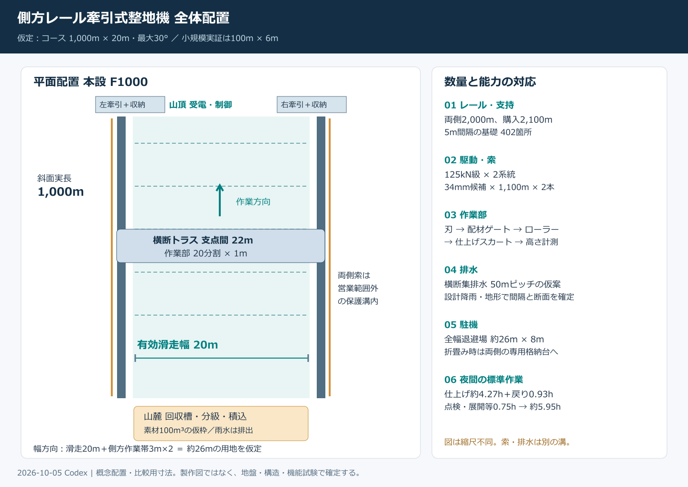
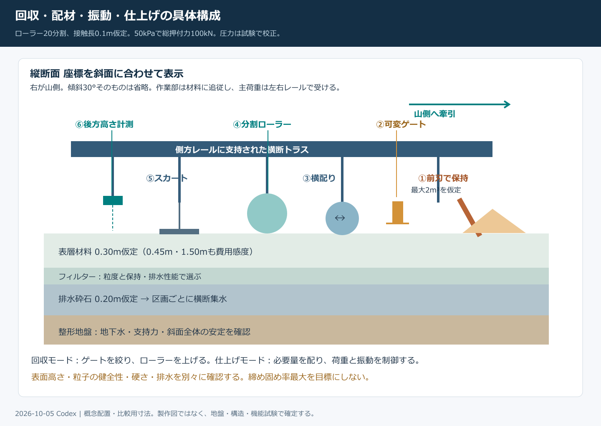
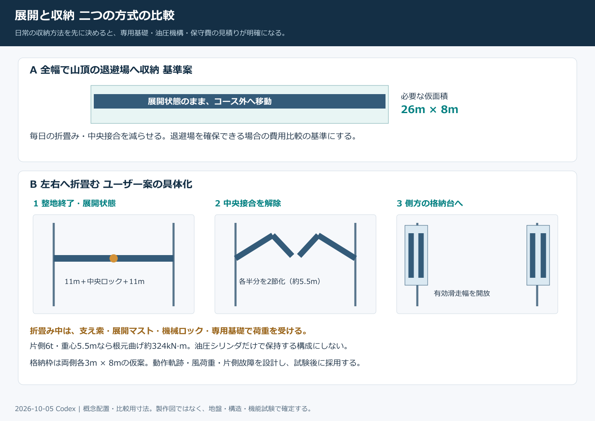
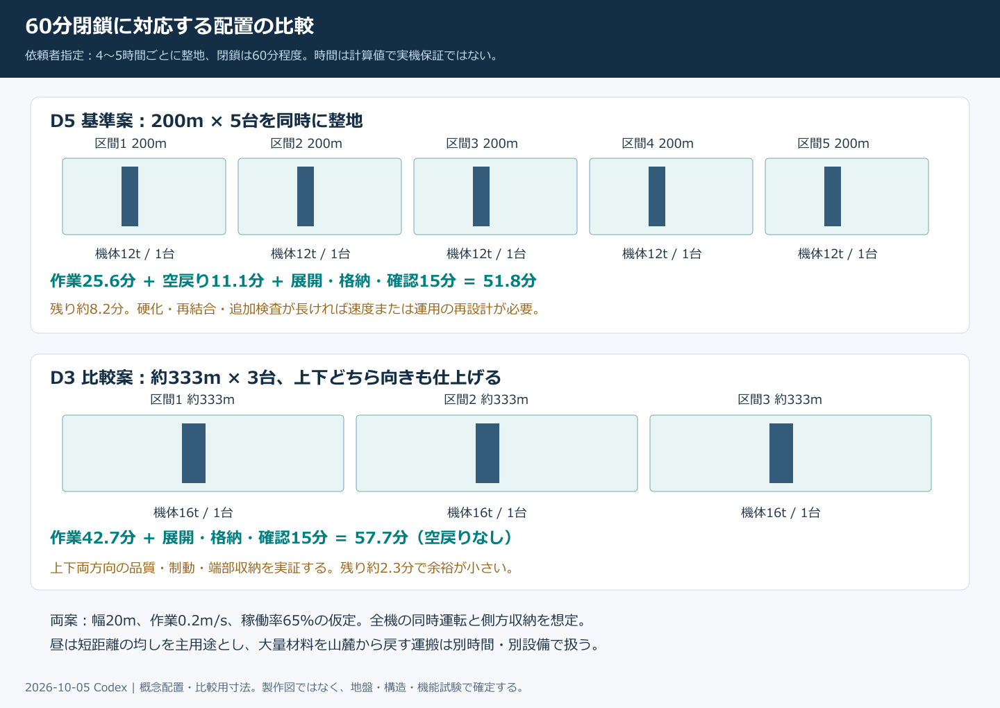

# レール式整地設備の概念設計と数量費用試算

作成：Codex／2026-10-05。宛先：依頼者・Claude・機械設備と土木の見積担当者。

## 1 今回の到達点と選択案

**最新条件：依頼者から、日中の閉鎖時間は60分程度との回答を得た。4〜5時間ごとの整地に合わせ、D5（200m×5台）とD3（約333m×3台・双方向仕上げ）を第8.5節で追加した。F1000の約6時間・1台案は費用と能力の比較基準であり、60分運用の推奨仕様ではない。**

60分案の中央仮予算は、D5約9.04億円、D3約7.54億円。全機の折畳み、土木、0.30m表層の敷均しを含み、材料購入は別。双方とも実見積りではない。

依頼者の「両側レール、山側牽引、前刃で材料を戻す、振動ローラーとスカートで均一にする」案を、構成図、数量表、機器の照会能力、施工機械、運転時間、費用比較まで具体化した。**次に製作会社・土木会社へ同じ条件で相見積りを依頼できる概念設計**である。製作図・施工承認図ではなく、引用した市販機をそのまま購入すれば成立するという意味でもない。

推奨する比較の順番は、(1)材料と1m幅の作業モジュール、(2)100m×6mの実証、(3)実測値と見積りを反映した本設判断。1kmを最初から造る前提に固定しない。全幅退避方式を費用の基準とし、依頼者の折畳み方式を独立した追加案として数量化する。日常整地を自動化し、大量流下後の復旧は短い区間での捕捉と別搬送を組み合わせる。

今回の主な結果：

- 本設仮案は有効幅20m、支点間22m、機体12t、前刃保持2m³。30°・材料の湿潤かさ密度1,800kg/m³で機体側牽引力約106kN、長い索の自重を加えた山側張力は片側約80kN。照会する駆動枠は125kN級×2系統。
- 1kmの通常仕上げは約5.95時間。これは配材が近傍にあり、1回で仕上がる場合。大量の材料運搬・接点再形成・営業前の品質確認は別時間。
- 100m×6mの設備・土木・表層敷均しは中央仮予算約5,090万円、本設1km×20mは約4.35億円。どちらも**表層材料の購入、折畳みオプション、土地、取付道路、リフト等は別**。単価は全て未見積りの予算仮置きであり、市場実勢価格ではない。
- したがって前報の「年間純削減500万円なら追加投資上限3,355万円」は機械一式の価格ではない。今回の1km全面新設案の中央専用設備額は約2.92億円で、安いと判断できる条件にはまだ達していない。値下げの焦点は連続したレール支持構造、対象区間の長さ、折畳みの有無、既設設備の利用である。下記で削減目標を数値化した。

条件の数値は次の4種に分ける。**資料値**はメーカーの公表値、**仮定**は今回の比較条件、**計算**はその仮定からの結果、**確認項目**は物理試験または専門設計で確定するもの。未測定の材料特性・価格・故障率を実績として扱わない。

関連資料：
- [前報 機械案の成立条件と長期費用](GPT回答_側方レール牽引式自動整地機の成立条件と長期費用_20261005.md)
- [材料側の独立監査と50℃対応案](GPT回答_50℃対応の雪状結晶素材と圧雪再現の再設計_20261005.md)
- [数量 単価 金額の全明細](../バーチャル試験/rail_groomer_preliminary_costs_20261005.md)
- [変更可能な試算入力JSON](../バーチャル試験/rail_groomer_preliminary_inputs_20261005.json)
- [再計算Python](../バーチャル試験/rail_groomer_preliminary_20261005.py)／[計算結果JSON](../バーチャル試験/rail_groomer_preliminary_results_20261005.json)

## 2 設計の共通条件

現地の長さ・幅・曲線・縦断・地盤・受電条件は未指定のため、次の2条件を置く。回覧板でClaudeが追加した20°・厚さ1.5mの案、およびVT11の集中ゾーン0.8m案は把握したが、本設の確定条件としては採らず、20°の力学感度と0.30／0.45／1.50mの数量感度を併記した。

|項目|実証 P100|本設比較 F1000|扱い|
|---|---:|---:|---|
|斜面に沿う長さ|100m|1,000m|水平投影長ではない|
|有効滑走幅|6m|20m|初期案は直線・一定幅|
|レール支点間|8m|22m|滑走幅＋左右各1m|
|最大斜度|30°|30°|20°も再計算|
|本体質量|3t|12t|索の質量は別。詳細設計で更新|
|保持できる前方の材料量|0.6m³|2m³|運転中の上限仮定|
|材料の湿潤かさ密度|500～1,800kg/m³|同左|結晶骨格の真密度と混同しない|
|施工厚さ|0.30m|0.30m|厚さの性能保証ではない|
|排水砕石厚さ|0.20m|0.20m|透水・凍結・地盤条件で見直す|
|作業速度／戻り速度|0.10／0.30m/s|同左|停止・配材を含め作業稼働率65%|
|価格基準|2026-10-05時点の仮予算|同左|税別、見積未取得|
|年間稼働|150日|150日|損益感度用、実営業日数ではない|

曲線・急な幅変化・凸型の縦断変化は、左右台車の距離とトラスのねじれを変える。直線機をそのまま適用せず、固定幅の区画分割、伸縮部、台車の旋回自由度、線路切替を個別設計する。30°は百分率勾配約57.7%であり、30%勾配とは違う。

## 3 構図と収納

### 3.1 全体配置

山側には左右独立の牽引装置と索収納、受電・制御、点検場所を設ける。側方の牽引索は滑走範囲外の保護溝に入れ、排水溝と共用しない。支持材・索受けは凍結と土砂で固着しない構造にする。滑走幅20mに左右各3mの設備作業帯を足した約26mを用地検討の出発点にする。これは防護設備の離隔が確定した値ではない。

横断排水は50m間隔の数量仮定で20列。機械レールは、排水と交差しても盛り土のダムを作らない。滑走面には露出した鋼材・横桟・索を残さない。

### 3.2 作業部

機体前端から、前刃と側板、可変の下部ゲート、横配り部、分割ローラー、仕上げスカート、仕上がり計測の順とする。

1. 前刃は、浅い乱れを集める位置と大量回収用の位置を切り替える。深い掘削や硬化層の破砕を常用しない。
2. 下部ゲートは0～80mm程度の可変開度を照会する。粒径・付着・架橋で必要開度が変わるため、寸法は流動試験で確定。密閉して材料を保持する機能と、少量を落とす機能を両立させる。
3. 横配りは低速オーガまたはパドルを比較する。軟らかい多孔粒が壊れるならオーガを使わず、分割ゲートと低せん断の配材方式へ替える。
4. ローラーは幅1mを基本に本設20分割。直径250～350mm、上下ストローク約150mmを照会の仮範囲とし、荷重センサー・加速度計・温度計を付ける。振動0Hzを含む10～40Hzの探索から始め、粒子破壊を伴う設定を除く。
5. スカートは長さ0.4～0.6m程度の分割押さえ板。摩耗部を交換でき、ローラーの後ろで粒子を引きずり過ぎない角度に調整する。
6. 前後の地形計測を同一座標へ変換し、配材誤差を次のゲート指令へ戻す。反射・粉じん・水滴で光学計測が欠けた時は、未確認のまま自動継続しない。

上記寸法・周波数は試験範囲であり、完成品の仕様ではない。Bunyanにはウインチでスクリードと余剰コンクリートを上向きに移す実例がある。GOMACOにはトラス・レール走行とオーガ、円筒、後部仕上げ部の構成がある。**これらは機構の先例であり、人工雪粒の回復性能の証明ではない。** [Bunyan](https://www.bunyanusa.com/slope/)、[GOMACO](https://www.gomaco.com/resources/c450.html)

### 3.3 折畳み方式

- **基準A 全幅退避**：営業前に全幅のままコース外の専用場所へ移す。仮の退避場所は本設26m×8m、実証12m×6m。中央継手を毎日開閉しないため、機構と保守を抑えやすい。
- **追加B 左右折畳み**：22mを左右11mずつ、さらに各半分を約5.5mの2節にする。作業後に中央ロックを外し、各節を側方へ折り込み、両側各3m×8mの格納台へ収める。作業中は中央と各節の継手を機械的に固定して荷重を伝える。

折畳み中の片側質量6t、重心が根元から5.5mなら曲げモーメントは約324kN·m。2mの反力間隔だけで受ける場合、約162kNの反力対が必要になる。油圧だけに保持を任せず、展開マストと支え索、格納台、アウトリガー、専用基礎、機械ロックで支える。実際の反力は自重位置・動作角度で変わる。図は動作の概念であり、干渉・索の経路・支持荷重の解析は未完了。

毎晩折り畳むなら、ピン摩耗、中央継手のガタ、索とホースの疲労、着氷を寿命計算に入れる。折畳みは「自動整地」に必須ではないため、費用表では追加額を分離した。

## 4 力学と機器能力

### 4.1 牽引力

前刃が材料を床上で滑らせて押すモデルとする。材料をバケットへ完全に持ち上げる方式では重量支持と抵抗を計算し直す。

    F機体 = M機械 g(sinβ + c転がり cosβ)
            + M材料 g(sinβ + μ材料 cosβ) + F作業部
    F山側 片側 = F機体 / 2 + m索 L g sinβ + F索受け損失

今回の仮定は転がり係数0.02、材料摩擦係数0.4、作業部抵抗5／15kN、索受け損失片側0.5／2kN。索は側方ローラーで支持し、全長が斜面に沿って繰り出された状態で山側張力を評価する。詰まり、凍結、偏荷重、動的停止はこの準静的式とは別の荷重ケース。

|計算項目|P100|F1000|
|---|---:|---:|
|前方材料の質量 1,800kg/m³|1.08t|3.60t|
|機械を登坂させる力|15.2kN|60.9kN|
|材料を移動させる力|9.0kN|29.9kN|
|作業部を加えた機体側合計|29.2kN|105.8kN|
|片側の索の重力成分|0.55kN|25.0kN|
|山側の張力 片側|15.7kN|79.9kN|
|機体側荷重だけを1.5倍にした感度 片側|22.9kN|106.3kN|
|照会するウインチの連続牽引枠|25kN×2|125kN×2|

1.5倍は荷重感度であり、必要な設計安全係数を決めた値ではない。1基が止まっても他方が全荷重を引いてよい、という運用にはしない。

F1000で20°・湿潤密度1,800・μ0.4なら片側約60.5kN、30°・密度500なら約69.1kN。材料が軽くても本体と長い索の荷重は残る。密度500～1,800、μ0.2～0.6、20～30°の感度は結果JSONに全12条件を収録した。

### 4.2 索と収納

候補照会はP100で16mm×110m×2本、F1000で34mm×1,100m×2本。公表されたB種IWRC系ロープ表には、16mmの破断荷重173kN・概算1.13kg/m、34mmの破断荷重782kN・概算5.09kg/mがある。最終的な構成・めっき・端末・シーブとの組合せはメーカーに選定を依頼する。 [メーカー規格表](https://www.wirerope.co.jp/assets/pdf/products/jis/IWRC_6x36_class.pdf)

仮に端末効率0.9、破断荷重との比5で候補を絞ると31.1kN／140.8kNとなり、上記の25／125kN枠を上回る。ただし法規・用途・疲労・曲げ・腐食・動的制動を含めた許容荷重を認定したものではない。索とドラムの径比もメーカーの条件で決める。 [東京製綱 技術資料](https://www.tokyorope.co.jp/product/wirerope/data.html)

本設の索2本は合計約11.2tになる。索収納を小さな付属箱として扱わない。34mm×1,100mを1本収める仮のドラムは、芯径1.02m、幅1.2m、充填率0.75なら外径約1.57m。一定トルクの巻取りドラムでは最外層の牽引力が初層の約65%になる。**最外層で要求張力を出せる大型ドラム方式**と、**牽引部と低張力の索収納を分ける方式**を相見積りする。34mmの任意の索を、市販の小型通過式ウインチへ通せるわけではない。

牽引点の直接反力125kNと、180°折返しシーブの最大約250kN反力は区別する。地盤アンカーの長さ・本数・基礎寸法は、地盤調査とメーカーの荷重表から設計する。今回の基礎体積は予算上の数量だけで、アンカー耐力の保証ではない。

### 4.3 レールとトラス

本設の支持鋼梁は両側2,000m×40kg/m＝80t、レールは予備を含む2,100m×37kg/m＝77.7tを数量の仮定とした。実証は支持梁5t、レール4.62t。鋼材の呼び方と標準断面は公表資料を照合して発注する。 [日本製鉄 レール資料](https://www-zam.nipponsteel.com/product/construction/handbook/pdf/4-1.pdf)

基礎ピッチ5mでは本設402箇所、実証42箇所。レール1本だけで5mを渡す設計ではなく、支持梁・締結・支承を含めて輪荷重を受ける。例として25kNの集中荷重、5m単純支持、たわみ3mm以下なら、鋼E=200GPaで必要な断面二次モーメントは約1.09×10⁻⁴m⁴になる。40kg/mの仮数量でその性能が得られるかは断面を選んで照合する。

横断トラスは2列の鋼製トラス、せい約1.8～2.0mを検討枠にする。22mの等価単純梁、均等荷重5kN/m、たわみ10mm以下ならI≧約0.00763m⁴。これだけでは折畳み継手、ねじれ、片側詰まり、疲労の設計にならない。完成面±10mmを求める場合、トラスたわみに10mm全てを使い切らず、たわみ補正と計測誤差の配分を決める。

P100は捕捉台車4組、F1000は8組を仮定。横ガイドと上下の脱輪防止を設ける。鋼の線膨張係数12×10⁻⁶/K、温度差60Kの仮定なら1kmで自由伸縮0.72m。伸縮継手・固定点・接続部の乗越しを設計し、長尺レールを両端だけで拘束しない。

### 4.4 ローラー反力と制動

本設は1m幅×20、接触長0.1mの仮定で接触面積2m²。面圧50kPaなら押付け100kNで、12t機体の斜面法線方向の自重約102kNとほぼ同じ。100kPaまで押す試験では差約98kNをレール側の引抜き反力として受ける。実証は50kPaでも30kNに対し自重法線成分25.5kNであり、浮上りを無視できない。片側だけ押す場合のねじり、振動による動的反力は別途加える。

本設が材料を持たず0.30m/sで降りると、機体と繰り出される索による制動発熱の上限側計算は約32.6kW、1回の位置エネルギーは約23.3kWh。運転用制動はこの熱を連続処理できる回生／抵抗器を選び、保持用ブレーキに滑らせ続ける運転をさせない。2系統合計で少なくともこの熱量に余裕を持つ能力を見積条件に入れる。停止距離と索の弾性エネルギーは動的解析で追加する。

## 5 電源と自動制御

山側の主牽引はP100で5.5kW×2、本設22kW×2を照会枠に置く。本設の通常張力・速度では約21.3kWの入力計算だが、125kN枠の出力、発熱、加減速、同時運転に余裕を取る。受電容量は主駆動に充電器・制御・制動装置・補助動力を加えた負荷表から決める。

本体作業部には電池を置く案を基準にする。1kmの長い移動給電ケーブルを仮設する案との比較が目的である。作業部の平均電力を実証2kW、本設6kW、ピーク8／25kWと仮定すると、作業中の必要電力量は約0.85／25.6kWh。放電可能80%なら約1.1／32.1kWhが最低計算量となる。試験の繰返し・劣化・余裕を含む照会枠を15／80kWhに置いた。製品重量・電池管理・表面50℃時のセル温度・充電条件で修正する。

本設の電力は、上り・作業部・補助電源を合わせ約77kWh/回の仮計算。下降の回生を値引きしていない。充電損失・空調・照明・受電設備の固定料金は未積算で、運用費への追加項目である。

自動制御には左右の直接位置、索張力、車輪速度、ゲート位置、材料量、ローラー荷重、振動、前後高さを用いる。巻取り回転数だけでは索伸びを補正できない。左右ずれ・荷重上昇・脱輪予兆・障害物・計測欠測で停止する。停止閾値は試験で決め、一般PLCのソフトだけに停止を依存させず、独立した保持機構と停止系を持つ。

営業中は機械と利用者の同時進入を認めない初期仕様とする。完全無人運転の実証前は監視者を置く。後述の年間費用では「本設2時間/日の作業者拘束」を自動化後の仮定にしており、全時間監視する場合の追加額も示した。

## 6 必要な部材と材料の指定

|系統|本設の必要量または候補|材質と確認条件|
|---|---|---|
|レール|37kg/m級を数量仮定、購入2,100m|輪荷重・継手・凍結・防食から正式選定。価格は37kg/mの仮質量で計算|
|支持鋼梁|80t仮定|溶接構造用鋼等、腐食代と防食。40kg/mは重量予算で断面確定値ではない|
|基礎|402箇所×0.4m³＝160.8m³仮定|鉄筋コンクリート、地盤支持・凍上・滑動・引抜きで寸法変更|
|締結と支承|402組|軌間調整、伸縮許容、点検交換可能な構造|
|保護設備|両側2,000m|索受け・カバー・防護を見積枠に含める。スキーで衝突しない離隔を確定|
|本体|トラス鋼材6tを仮定、完成機体12t|残り約6tに台車・工具・駆動・電池・配線等を割当。部品重量で再積上げ|
|牽引索|34mm候補、計2,200m|破断荷重だけでなく曲げ疲労、端末、腐食、巻取り互換性|
|ウインチ|125kN級×2、主電動機22kW×2を照会|全使用長での力と速度、制動熱、連続定格、同期、停電保持|
|作業モジュール|20組×1m|可変刃、ゲート、低せん断配材、分割ローラー、スカート、上下追従|
|接触する交換部品|ステンレスの平滑ローラー、UHMWPE等の交換刃を比較|鋭角をなくす。摩耗片の発生量・混入・回収・50℃での寸法変化を評価|
|電池|80kWhを照会|候補は産業用LFP等。遮熱、電池管理、充電、低温性能を個別確認|
|排水砕石|0.2m×20,000m²＝4,000m³|粒度、耐久性、凍結と目詰まり後の透水性。0.1m/sを既得性能として置かない|
|フィルター|20,000m²|素材粒と地盤土の両方の流出を防ぎ、目詰まりで水を溜めない|
|側溝と横断集水|側溝2,000m、横断400m|設計降雨と集水地形、下流能力で断面を決める|
|回収設備|有効材料枠100m³仮定|水を排出し素材を捕捉する。分級、泥分判定、残渣回収へ接続|

食品用途で使われる樹脂やステンレスというだけでは、スキーで削った粉じんや長期間の屋外暴露の安全を保証しない。油圧配管・潤滑箇所は材料側から隔離し、受け皿と漏れ検知を設ける。「生分解性の油だから天然雪との界面へ漏れてもよい」という条件にはしない。

### 表層の人工雪材料

装置はHBG-5、HBG-6、結晶化PVA／セルロース系の多孔粒、半結晶性樹脂の多孔粒を交換して比較できるようにする。現在は配合と性能が確定していないので、材料を特定の製品名で大量購入する指示は出さない。

材料供給者へは、真密度と別に乾燥・湿潤かさ密度、粒度分布、粒形、圧縮回復、剪断抵抗、繰返し破砕率、50℃保持時の変化、濡れた後の再結合、溶出、粉じん・摩耗片、冬の凍結融解と界面剪断を提出項目とする。安全性の結論は配合・ロット・暴露条件まで対象を特定して出す。

## 7 施工に必要な重機と工事順序

日常整地に大型の圧雪車を使わない案でも、初期の基礎・排水・組立には施工機械が必要になる。下表は**工程計画用の仮日額で、レンタル市場価格を取得した表ではない**。運転者・燃料込みの資源枠として置き、数量明細の施工単価と運送揚重費に含まれる内数とする。総額へ再加算しない。

|機械|実証の台数×日数×仮日額|実証資源枠|本設の台数×日数×仮日額|本設資源枠|
|---|---|---:|---|---:|
|油圧ショベル|1台×15日×8万円|120万円|2台×40日×12万円|960万円|
|ホイールローダ|1台×6日×6万円|36万円|1台×30日×9万円|270万円|
|ダンプ|2台×10日×6万円|120万円|4台×40日×9万円|1,440万円|
|移動式クレーン|1台×3日×12万円|36万円|1台×8日×18万円|144万円|
|基礎掘削またはアンカー機|1台×3日×8万円|24万円|1台×10日×18万円|180万円|
|下地の締固め機|1台×3日×2万円|6万円|1台×10日×4万円|40万円|
|計 内数|—|342万円|—|3,034万円|

実証では0.25～0.5m³級ショベル、0.4～1m³級ローダ、4tダンプを候補とする。本設は0.5～0.8m³級ショベル、1～2m³級ローダ、10tダンプを比較する。運搬車は管理道から各区画へ供給し、30°の滑走斜面を一般ダンプが自由走行する前提にはしない。

機種を決める参考として、Kobelco SK135SR-7は0.5m³級の候補系列であり、タダノGR-250Nの25tは3.5m作業半径等の所定条件での能力である。最大揚程・最大半径で25tを吊れる意味ではない。5.5m程度の輸送分割・1回の吊荷目標2t以下を検討し、実際の半径、吊具、アウトリガー、地耐力で25～50t級等を選定する。 [Kobelco](https://www.kobelco-kenki.co.jp/products/excavator/hydraulic/sk135sr-7-sk135srlc-7)、[Tadano](https://www.tadano.com/japan/products/rt/gr-250n/)

施工順序は、測量と地盤調査 → 取付・作業足場 → 下流の排水と捕捉設備 → 地盤整形と基礎 → 排水層・フィルター → レールと受電 → 機体組立 → 材料の敷設 → 無負荷・負荷・故障停止試験 → 滑走面の比較測定。排水出口を最後に造る工程にはしない。

本設402基の基礎を1班10基/日で施工すると約40班日、2班なら約20日になる。これは掘削・据付の数量割算であり、養生、雨天、岩盤、試験、資材待ちを含む工期ではない。土木6～12週、製作3～6か月を照会時の仮工程とし、現場条件と納期回答で変更する。

## 8 日常運転と豪雨 台風後の復旧

### 8.1 通常整地の処理能力

計算は作業速度0.1m/s、作業稼働率65%、戻り0.3m/s、準備0.75時間。

|項目|P100|F1000|
|---|---:|---:|
|作業走行 停止時間を含む|0.43時間|4.27時間|
|戻り|0.09時間|0.93時間|
|準備・点検等 仮定|0.75時間|0.75時間|
|合計|1.27時間|5.95時間|
|10mmを全面補充する時の瞬間配材量 ゆるい状態|27m³/h|90m³/h|

本設で全面を10mm補充するなら、仕上がり材積200m³、ゆるい状態で250m³となる。**2m³の保持量だけで全面を供給することはできない。** 日常整地は、近くに残る山と溝を短距離で均す場合と、材料がコース外へ失われ補充する場合を分ける。表面地形の差分だけでなく、投入・回収・排出質量を計量する。

ゲート開度だけで仕上がり高さは決まらない。たとえば完成/ゆるみのかさ密度比1.25なら、40mmの完成厚さには50mm相当のゆるい材料が必要になる。振動、湿り、粒子の破壊でこの比率が変わるため、毎回の材質状態に合わせて補正する。

初期の性能確認目標は、基準面に対する誤差95%点で±10mm、20mmを超える未補修の段差を残さないこととする。これは提案値であり、天然圧雪の滑走感の合格基準そのものではない。均一な高さと、雪に似た硬さ・横支持・エッジ解放は別々に測る。

### 8.2 100m³が移動した場合の収支

同じゆるみ状態の材積を基準に、流下100m³、捕捉率90%、捕捉後の健全再利用率80%という未測定の仮定を置く。

|行先|材積|
|---|---:|
|捕捉して再利用|72m³|
|捕捉したが泥等で除外|18m³|
|捕捉できなかった分|10m³|
|補充が必要な合計|28m³|

捕捉率90%は環境流出として許容する目標ではなく、収支の感度例である。実運用では系外排出を計測し、粒子の捕捉設計を見直す。ふるいを通過しただけで粒子や結合膜が健全と判断しない。

72m³を1回2m³ずつ、平均500m上へ、上り速度0.1m/s・運搬稼働率80%、空戻り0.3m/s、積込み0.1時間で戻すと、1往復約2.30時間×36回＝約82.8時間。最後の仕上げを加えると約88.7時間。粒子の乾燥、補修、接点の再形成、流出28m³の補充は含まない。

|平均の上方運搬距離|72m³の運搬時間 同じ装置|
|---:|---:|
|50m|約11.5時間|
|250m|約43.2時間|
|500m|約82.8時間|
|1,000m|約161.9時間|

平均500m条件で8時間枠は運搬だけなら6m³、16時間枠で5.95時間の仕上げも行うなら8m³が計算上限。後者でも検査や材料再生の時間は別である。したがって「流れたものを全部下で集めて、一晩で同じ整地機が戻す」を一般仕様にはしない。

### 8.3 復旧を短くする構成

**まず流下距離を減らす。** 50m程度の区画ごとに横断排水と側方の材料捕捉を検討し、全てを山麓へ集めない。粒止めを滑走面に露出させず、埋設構造による水のせき止めも避ける。侵食試験で区画間の移動量を測って間隔を決める。

**大量流下時は搬送能力を別に確保する。** 選択肢は、管理道上の積込・ダンプ供給、または固定式の急傾斜対応搬送設備。たとえば72m³を4時間で戻すには18m³/h、余裕込みの照会枠は20m³/hとなる。湿潤密度1,800なら36t/h。高低差500m、全体効率0.65なら重力分だけで約75.5kWとなり、ベルト・ローラーの抵抗等を加えた駆動選定が必要。単純な平ベルトを30°へ延ばす仕様ではなく、桟付き・ポケット式等の適否と粒子破損をメーカーへ確認する。

本報告の費用合計には、この長距離専用搬送機や災害時の外部重機出動を入れていない。見積依頼書で別項目にした。確定していない設備の価格を小さい一式額に隠していない。

### 8.4 排水と冬季の接続

本設の斜面面積20,000m²に100mm/hが降る上限側の集水計算は約556L/s。200mm/hなら約1,111L/s。水平投影面積を使わない保守的な計算で、流域外からの流入は別加算。50m区画なら100mm/hで約27.8L/s/区画となる。これらは設計降雨の選定や側溝断面の決定を済ませた値ではない。

100m³の回収槽を水で満たすだけなら、本設の100mm/h相当で3分で埋まる。**素材の貯留容量と雨水の流下能力を分離**し、捕捉部・越流路・下流側溝まで連続して流せるようにする。土砂や氷で一部が閉塞した場合も確認する。

冬は表面と天然雪の粗い接触・機械的な噛合いを残し、締め過ぎで鏡面や水膜を作らない。雪との界面、人工材料内部、地盤境界の3箇所を別々に排水・剪断評価する。冬の閉鎖後にレールと索受けを除氷しないで動かす仕様にしない。天然雪の下での支持と滑動、凍上後の軌間は別の季節条件として検査する。

### 8.5 依頼者指定の60分閉鎖に合わせた構成

作業中に追加された[Claude VT11](../バーチャル試験/VT第11弾_カービングの深い溝と4〜5時間ごとの保守_2026-10-05.md)と回覧板に、4〜5時間ごとの保守が記載された。依頼者への確認では「60分程度」の閉鎖が指定されたため、次の2系統を具体化した。

|項目|D5 基準比較|D3 機械数を減らす比較|
|---|---|---|
|分担|200m×5台、幅20m|約333m×3台、幅20m|
|機体質量の仮定|12t/台|16t/台 両方向工具の増分を仮置き|
|整地|山側向きに整地して空戻り|上下両方向に整地、次回は逆方向|
|作業速度|0.2m/s、稼働率65%|同左|
|空戻り|0.3m/s|閉鎖中の空戻りをなくす|
|展開・格納・立入確認|15分/区間、全機並行の仮定|同左|
|計算閉鎖時間|約51.8分|約57.7分|
|60分との差|約8.2分|約2.3分|
|駆動照会枠|100kN級×2/台、30kW×2/台|125kN級×2/台、37kW×2/台|
|候補索|30mm×220m×2/台|34mm×約366.7m×2/台|
|片側張力の準静的計算|約58.8kN|約73.4kN|
|工具数量|20組/台|40組/台を仮置き 前後へ同等工具を配置|
|電池の照会枠|15kWh/台|30kWh/台|
|収納|全機を側方へ折畳み|各区間の両端に側方収納場所を確保|

定格主電動機の合計はD5で300kW、D3で222kW。通常負荷と定格負荷を区別し、充電を含む同時負荷、分散駆動点への配電幹線、受電増強を別見積りする。1台用の受電設備で足りる前提にしない。

D5は上り整地という依頼者案を維持し、単純な時間比較の基準にする。D3は夜間に山側への本格回収を行い、昼は近傍の凹凸を双方向に均す案。D3では下向き整地時に粒子を流し過ぎないこと、前後の工具、制動熱、両端の収納を試験する。機械数は減るが、未検証の工程が増え、時間の余裕も小さい。D5の整地品質を先に校正した後に比較する。

15分は実測ではなく、機械設計に課す目標。全体の準備0.75時間のうち残り0.50時間は閉鎖前後の隔離された場所で行う仮定とした。危険な展開・格納を営業中に実行する意味ではない。材料の再結合・養生は0分として計算しているため、必要なら加算する。D5でも8分以上の追加時間が必要になれば60分を超える。始業前・13時頃・17時以降の整備配置は、実測した品質回復時間で決める。

作業0.1m/sで空戻りを同じ閉鎖内に行うと、30／60／120分枠に必要な並行台数は21／7／3台。0.2m/sなら13／5／2台。これは一律幅・同時運転・15分固定作業・養生0分という条件での下限側台数で、敷地全体の最適解を保証しない。直列の区間を複数台で処理しても、利用者は途中を通れないので、全コースを同じ時間に閉鎖する。

この追加案は材料が近傍に残る通常整地を対象とする。集中ゾーンの深い溝、大量の流下、工具破損がある日は同じ時間を保証しない。作業速度0.2m/sでの配材・硬さ・粒子破損を物理試験で確かめることが、60分仕様の成立条件となる。

## 9 費用の内訳と比較

**全単価は設計者の予算仮置きで、メーカーの回答・実勢価格・落札単価ではない。** 低／中央／高は各単価を同時に置換したシナリオで、信頼区間でも見積精度の保証でもない。地盤・アクセス次第では高側も超える。

購入・製作・施工の直接費に、現場管理・一般管理等15%、その小計に不確定分25%を順に加えた。倍率は1.4375。設計は独立した直接費項目に含む。材料購入費は別表のため、この合計には未算入。

### 実証 100m × 6m

|項目|低 万円|中央 万円|高 万円|
|---|---:|---:|---:|
|専用の機械 レール 基礎 制御等|2,309.2|4,241.5|8,027.4|
|共通土木 排水等|401.9|796.4|1,681.9|
|表層敷均し 材料購入別|25.9|51.8|103.5|
|上記合計|2,737.0|5,089.7|9,812.8|
|折畳み方式の追加額|359.4|718.8|1,437.5|

### 本設比較 1000m × 20m

|項目|低 万円|中央 万円|高 万円|
|---|---:|---:|---:|
|専用の機械 レール 基礎 制御等|16,367.7|29,240.5|54,972.2|
|共通土木 排水等|6,713.1|12,506.3|25,012.5|
|表層敷均し 材料購入別|862.5|1,725.0|3,450.0|
|上記合計|23,943.3|43,471.7|83,434.7|
|折畳み方式の追加額|1,437.5|2,875.0|6,468.8|

### 60分運用の追加試算

全機の折畳みを追加し、設計・測量は共有、支持線路はコース全長で計上した。各機の牽引、工具、制御、基礎アンカー、組立を台数分計上。D3には反対側終端の収納場所も追加した。詳細は数量明細と結果JSONを参照。

|項目|D5 中央|D3 中央|
|---|---:|---:|
|専用設備 折畳み含む|76,216.8万円|61,087.4万円|
|共通土木|12,506.3万円|12,549.4万円|
|表層敷均し 購入別|1,725.0万円|1,725.0万円|
|合計 材料購入別|90,448.1万円|75,361.8万円|

D5の材料購入別総額は低4.73億／中央9.04億／高18.13億円、D3は低4.06億／中央7.54億／高14.76億円。単価が全て未見積りなので幅が大きい。単純に安価と判定せず、レール支持と複数の専用機を分けて価格回答を取り、既製機構の採用・対象区間・日中の整地範囲を比較する。

両案の年間費は1日2回・150日、各機1時間/回の監視、D5保守900万円/年、D3保守1,150万円/年、6年目更新2,000／2,400万円という仮定。年間運用費は約1,479／1,529万円、専用設備の初期費と更新を含む10年8%の年換算は約1.30／1.09億円。材料・共通土木・営業を1時間止める影響は別。折畳みの保守実績は未取得で、保守枠を保証する値ではない。D3の電力は空戻り分を残した保守的な仮計算で、双方向の実負荷から更新する。

### 材料購入費を分けた理由

試算の表層厚さ0.30mでは実証180m³、本設6,000m³。購入額は乾燥かさ密度×施工材積×円/kgで置く。牽引用の湿潤かさ密度とは区別する。

|本設 0.30mの仮条件|必要乾燥質量|20円/kg|50円/kg|100円/kg|
|---|---:|---:|---:|---:|
|乾燥かさ密度500kg/m³|3,000t|6,000万円|1.5億円|3.0億円|
|乾燥かさ密度1,500kg/m³|9,000t|1.8億円|4.5億円|9.0億円|

この20／50／100円/kgは購入可能な相場ではなく、材料開発の価格目標を比較する仮入力。多孔粒を作る加工費、結合剤、輸送、予備分、再生・廃棄を含んだ納入単価で置き換える必要がある。

乾燥密度500・20円/kg・厚さ0.30mを仮に満たすなら、全幅退避方式の中央総額は実証約5,270万円、本設約4.95億円。折畳み中央追加額を足すと約5,988万円／約5.23億円となる。この材料条件の達成を確認したわけではない。

本設の厚さを0.45mにすると9,000m³、1.50mなら30,000m³。密度1,500kg/m³の質量はそれぞれ13,500t、45,000tとなる。コース幅を指定しないまま「1kmで何万t」と比較しない。厚さ変更では材料だけでなく敷設費、地盤荷重、側方保持、排水も再見積りする。

VT11の「集中ゾーン0.8m＋その他0.3m」を数量に反映すると、20m幅のうち集中幅4mなら8,000m³、8mなら10,000m³になる。前者は0.30m一様案から2,000m³増、中央の敷均し費575万円増。乾燥密度500・20円/kgという同じ仮定で材料購入費は8,000万円となる。D5はこれらを含め中央約9.90億円、D3約8.39億円。厚さ0.8mを安全・滑走性能の確定値として追認する意味ではない。

VT11のコードは14時間・1万本で、8時間営業とは異なる。また保守時に掘れ量を80%減らし、ゆるい材料を消す処理で、運搬・質量保存・再結合時間を解いていない。格子依存も報告されている。今回の整地機の能力証明として使わず、8時間営業と実測回復率で再計算を依頼する。

### 費用に含まないもの

土地、リフト・営業施設、新設の管理道や長距離受電線、大規模伐採・法面補強、岩盤掘削、深い杭・アンカー、既存設備撤去、許認可に伴う条件追加、豪雨専用の長距離搬送、長期の実証・認証費、事業資金調達、税、物価変動は別。表の機体試運転費だけで材料の全試験を終えられるとは見込まない。候補地が決まれば別項目を追加し、値をゼロのまま隠さない。

### 削減余地を見積りで確かめる項目

本設のレール材、支持梁、一般基礎、据付、締結、側方ガードの中央直接費は合計約1億1,861万円で、一般管理と不確定分を加えると約1億7,050万円。ここが専用設備費の大きな部分を占める。鋼梁支持、連続コンクリート支持、既設構造利用を同じ変位・荷重条件で比較する。

既設コースで既に使える排水・基礎があれば新設数量を減らせるが、検査せず「既設だから無料」と扱わない。1km全体ではなく保守回数の多い短い直線区画に限定すれば線路数量は減る。一方、設計・制御等の固定費は比例して減らない。100m実証費を単に10倍して本設費にしない。

## 10 長期費用と採算条件

10年、割引率8%、期末費用として年金現価係数は6.7101。共通土木と材料は同じコースを整備する比較対象にも必要とし、機械方式の比較では重複計上しない。実際に共通でない土木項目は差額へ戻す。

本設の仮年間費用は、150日、作業拘束2時間/日、3,500円/時、電力30円/kWh、保守650万円/年で約790万円/年。さらに6年目に索・電池等の更新1,500万円を仮置きした。2時間/日は自動化が成立した後の想定。通常運転約5.95時間を全て監視するなら約207万円/年を追加する。折畳み固有の保守費、電力基本料、充電損失等は別途更新する。

専用設備の中央初期費約2.924億円、運用費、6年目更新を10年間で評価すると、現在価値は約3.55億円、年換算費は約5,288万円となる。共通土木・材料費を除いた機械設備だけの値である。

    レール方式を選べる初期費の上限
    ＝ 実際に回避できる重機の初期費
       ＋ (重機の年間費 − レールの年間費) × 6.7101
       ＋ 重機更新費の現在価値 − レール更新費の現在価値

冬用の圧雪車を保有し続けるなら、その購入費全額を削減額に入れない。夏の人件費・燃料・整備・更新時期への影響など、実際に減る費用を比べる。

本設中央案で、比較対象の重機初期費・更新差を0とした場合、避けられる重機年間費が約5,288万円/年以上ないと10年比較は逆転しない。前報の「純年間削減500万円」なら上限約3,355万円という値はそのまま正しいが、今回の設備費の仮積算はその約8.7倍になる。安価に成立させるには、全長支持構造の大幅な簡素化、既設利用、対象区間限定、複数用途、実際の保守費削減が必要になる。

実証は営業採算だけで決める設備ではなく、材料と機械の不確実性を減らす開発費である。まず1m幅の工具試験と短い牽引試験で材料破損・配材・圧力を測り、100mの設備費を投入する条件を決める。

## 11 素材の回復と機械の合格を分ける

|確認項目|試験条件の提案|次へ進む判断|
|---|---|---|
|配材|乾燥・濡れ・50℃、複数粒度、開度と速度を変更|詰まり・分級・破壊率を記録し、必要量を再現して供給できる|
|高さ|前後測量、1回・複数回、中央継手付近|提案の高さ誤差と段差を満たす。工具を細分化して補正|
|雪に似た硬さ|既存の新雪圧雪を同じ測定器で基準化、温度・湿りも記録|HV・Sf等と走行時の解放・抵抗を比較。E-vib等の1指標を雪の代用にしない|
|粒子と結合|整地前後の粒度・形状・結合回復、複数回の繰返し|高く押せば合格としない。破損率・再利用率が維持される|
|夏の接触|表面50℃、直射・乾燥・湿潤、スキー接触と転倒接触|摩擦・熱・擦過・溶出・粉じんを材料別に評価|
|降雨|排水を詰まらせる泥分も入れた侵食試験、全量計量|捕捉と再利用を分離して測り、復旧時間と必要補充を確定|
|冬の界面|天然雪、融雪水、再凍結、人工材料の継目・端部|溜水・油分による弱い界面を作らず、固着と排水が両立|
|駆動と故障|偏荷重、片側停止、停電、索異常、センサー欠測|保持・停止・復旧が設計通り。人を入れた滑走はその後|
|折畳み|展開角度別の反力、中央接合、繰返しと着氷|変形・ガタ・誤接合を検知して運転を止められる|

BOMAGの公表資料は振動ドラムの力と変位から剛性を評価する例を示している。これを使う着想は有用だが、その数値を人工雪のHV・Sfや滑走感へ直接変換しない。 [BOMAG TERRAMETER](https://www.bomag.com/gb-en/technologies/overview/terrameter/)

HBG-6の炭酸塩接点、HBG-5の膜、PVA系骨格は回復機構が異なる。平らに均せても化学的な接点が戻るとは限らない。再結合に水・ガス・養生が必要なら、その設備・時間・残留成分も見積りへ追加する。今回の機械試算を、人体安全や新雪と同じ滑走感の実証に置き換えない。

## 12 具体的に見積担当へ渡す資料

[見積照会仕様書](見積照会仕様書_レール式整地設備_20261005.md)を別添した。発注書ではなく、同じ性能条件で金額・除外事項・代替案を比較するための原稿である。メーカーへの送信や発注は行っていない。

確認する相手と範囲：

1. 機械製作会社：100m実証と1km本設、全幅退避と折畳み、機体重量、配材・押付け能力、日次保守、故障時救出。
2. 牽引・索メーカー：使用長全域の力・速度・索選定・収納、下降制動、端末、同期、独立保持。既製品の適合可否を回答してもらう。
3. 土木・構造設計者：軌間とたわみ、輪荷重と引抜き、地盤・雪・風・温度・排水、支持方式の比較。
4. 材料供給・試験側：製造可能な粒の性能と納入価格、必要厚さ、雨後の再利用率、ローラーで壊れない範囲。
5. 現地運営者：実際の保守時間と回避できる費用、日常回収量、立入隔離、駐機場所と管理道。

所在地・測量図・斜度分布・曲線・幅変化・地盤・降雨・積雪・凍結深・電源位置・既設資産が埋まれば、本報告の数量と単価を更新できる。未回答のものは条件欄に「未定」と残し、勝手に平地・良好地盤・既設電源へ置換しない。

## 13 計算の再現と検証

入力JSONとPythonを同じフォルダに置いて、次を実行する。

    python rail_groomer_preliminary_20261005.py
    python rail_groomer_preliminary_20261005.py 自分の条件.json

出力は結果JSONと数量費用のMarkdown。入力の単価、寸法、密度、斜度、稼働率を変えられる。ただし長さや幅の変更時に、機体質量・台車・トラス・索径・ウインチを自動的に正しく選び直すプログラムではない。幾何形状と能力の適合を別途確認して入力する。図は固定したP100/F1000の説明であり、入力変更で自動更新しない。

[計算照合の記録](../バーチャル試験/rail_groomer_preliminary_validation_20261005.json)も添付した。

今回実行した確認は、捕捉量の収支、運搬回数、402基の数量、100mm/h集水量、牽引力の下限、単価シナリオの順序、候補索の単純な強度比較、図の描画確認。有限要素解析、離散要素法、実機試験、材料試験、メーカーの仕様承認は行っていない。

図のSVGと[生成スクリプト](図版_レール整地機_20261005/build_diagrams_20261005.mjs)も同じGitHubに置いた。PNGはSVGの閲覧用画像。ローカルの作業コピーは公開内容を照合した後に削除し、GitHubを共有の保管先とする。

## 14 Claudeへの独立検証依頼

- **最新の依頼者回答は昼の閉鎖60分程度。D5/D3の速度・展開収納・養生・価格を独立照合する。VT11の瞬時80%回復を整地機の実測能力と扱わず、8時間営業で質量保存と所要時間を入れ直す。**

- 牽引力に機体・材料・長い索・索受け損失が別々に入っているか照合する。前報の10m³・機体5tと今回の2m³・機体12tを同一条件の訂正として混ぜない。
- 折畳み時の片持ち状態、接合順序、地盤の反力、動作軌跡を反証し、成立させる支持構造を提案する。完成状態のトラス強度だけで終わらせない。
- 1kmの索自重・収納容積・巻層による牽引低下・下降制動を含む駆動案を再検討する。ストランドジャッキは把持とストロークを反復するため、定格力だけで作業速度を判断しない。 [Enerpac](https://www.enerpac.co.jp/products/hlt/StrandJacks/index.html)
- 各単価は全て仮置きである。価格の裏付けが得られた項目だけ資料値へ昇格し、予算削減のために根拠なく値を小さくしない。
- 全面の0.30m床厚を確定しない。VT9・VT10の摩耗／斜面条件と、今回の幅20m・面積20,000m²の質量を照合する。
- 大量回収の82.8時間と、通常整地5.95時間を混同しない。短い区画への捕捉で実際の運搬距離が減るか、物量保存付きで再計算する。
- 技術的に採用する構成と、実際に採算が合う長さ・幅・保守頻度を別々に答える。報告書への掲載は受領・検証済みを意味しない。回答はGitHubへ保存し、回覧板へ追記する。

## 15 出典の使い方

リンク先は2026-10-05に参照したメーカー一次資料。BunyanとGOMACOは機構の先例、ロープ表は単純比較の資料、Tokyo Ropeは索選定上の留意点、Kobelco・Tadanoは施工機械の候補例、BOMAGは計測の先例、Enerpacはジャッキの機構の確認に用いた。人工雪への適合、価格、発明の新規性、権利関係を証明する資料としては使っていない。
