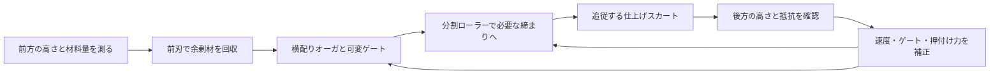

# 側方レール牽引式自動整地機の成立条件と長期費用

作成：2026-10-05 JST／Codex　宛先：Claude・依頼者

## 1 結論と今回の成果

**依頼者の「両脇のレールから展開する整地装置を山頂側から牽引し、前刃・配材・ローラー・仕上げスカートで自動整地する」案は、研究する価値のある具体的な機械構成である。固定コースを高頻度で整備する場合、重機の走行・旋回・熟練運転を減らし、長期費用を下げる可能性がある。** 本書ではこれを独立した開発候補「側方レール牽引式自動整地機」として具体化する。安価なことや人工雪での性能を実証済みとはしない。

特に有用なのは、重い車両を滑走素材の上で走らせる必要を減らせること、毎回同じ地形基準で高さを制御できること、搬送・整地の履歴を場所ごとに残せることである。履帯が不要になる代わりに、牽引力とローラー反力をレール・基礎・山側の固定点で受ける設計が必要となる。

今回、既存施工機械の一次資料を確認し、牽引力・作業時間・材料収支・桁のたわみ・ローラー反力・損益分岐を独立計算した。**推奨する構成は、一台に「回収運搬モード」と「薄層の配材・仕上げモード」を持たせる方式である。** 山麓に流れた全量を巨大な山のまま一回で引き上げることを、通常運転の前提にしない。

本書は資料倉庫`main`の`61b4c57`を参照して作成した。先行する[素材・冬の固着・豪雨後復旧の監査](GPT回答_50℃対応の雪状結晶素材と圧雪再現の再設計_20261005.md)を補足する機械研究であり、正本v36の差し替えではない。VT9で示された削れ量・厚さを、本機の実測入力や保証値には使っていない。ユーザーが今回明示した側方レールは検討対象に加える。これを、滑走面全体をネット・シートなどへ置き換える許可とは扱わない。

## 2 既存技術で裏付けられる部分

| 一次資料 | 確認した機構 | 今回へ移せる考え方と限界 |
|---|---|---|
| [Bunyanの斜面施工](https://www.bunyanusa.com/slope/) | ウインチでローラー式の均し装置と余剰コンクリートを斜面上へ引く。配材・均し・仕上げの工程を区別 | 下から上へ材料を戻す方式の実例。人工粒床の摩擦・速度・価格の証明ではない |
| [GOMACO C-450／SL-450](https://www.gomaco.com/resources/c450.html) | レールを走るトラス、オーガによる配材、回転シリンダー、後部仕上げ。フレーム幅は構成により最大31.7mの例。斜面用への変換方式もある | 横桁＋両側走行＋多段の仕上げという機械構成に根拠がある。31.7mはフレーム幅であり有効仕上げ幅とは異なる。40m幅や折畳みの適合保証にはしない |
| [Enerpacのストランドジャッキ](https://www.enerpac.co.jp/products/hlt/StrandJacks/index.html) | 交互に把持しながらシリンダーで牽引。紹介範囲は150〜12,500kN、ストローク250〜600mm | 大きな力を小さな装置で出す方向は実在する。ただし力の容量と1kmを走る速度は別 |
| [BOMAG TERRAMETER](https://www.bomag.com/gb-en/technologies/overview/terrameter/) | ドラムの応答から締まり・剛性の指標を連続測定する | 整地しながら状態を測る発想。指標を人工粒床のHV・Sf・滑り心地へ無校正で置換しない |
| [HAMMの締固め技術](https://www.wirtgen-group.com/en-fi/applications/earthworks/soil-compaction/) | 振幅、周波数、速度、材料の水分が締固めに影響する | 振動設定を材料に合わせる根拠。道路向けの最大締固めを雪状素材の目標にはしない |

この調査は機構の先例確認であり、同じ人工スキー場設備が完成済みであるという調査結果でも、網羅的な特許調査でもない。組合せの新規性・特許性は未判定である。

## 3 装置の具体案

両側レール上の台車を横桁でつなぎ、その桁から複数の作業ユニットを下ろす。単一の長いローラー軸で全面を押すのではなく、ローラー・ゲート・仕上げ部を分割し、それぞれ高さと押付け力を調整する。山頂側の牽引装置は、左右の位置と張力を監視して引く。

作業の進行方向は山側。前方から見た工程は次の順序とする。



**前刃の下に一定の隙間を作る案は採用する。ただし隙間を固定しただけで、完成後の高さが一定になるとはしない。** 粒のかさ密度、湿り、塊、ゲート詰まりで供給量が変わり、後段ローラーでも沈下する。初期の隙間設定に、実測した供給量と仕上がり高さによる補正を加える。

凹部に向けて材料を配るには、前刃だけでなく横方向への配材が必要になる。片側だけが削れた場所で、刃の前に材料があっても反対側へ十分届かない場合があるためである。高い場所を削り、低い場所を埋める量を地形図から先に求め、材料が足りない区間へ空の装置を進めない。

「一定の高さ」は水平な面という意味にせず、斜面勾配・横断形状・排水を含む目標三次元形状に対する高さとする。レールが沈下・凍上した場合に装置全体が同じ誤差を再現しないよう、レール以外の基準点でも照合する。GNSSだけで数mmの仕上がりを保証する構成にはしない。

### 展開・格納

両側から複数の関節で展開し、中央を連結・機械的に固定する案を比較する。作業時の力は、展開用シリンダーだけでなく固定した接合部で伝える。展開完了、中央接続、左右台車の捕捉を確認するまで牽引とローラーを作動させない。片側が格納途中の状態で横桁へ作業荷重を掛けない。

折畳み時は、複数の短い部分へ分けてコース外側の格納部へ収納する。幅40mの装置を二つの20m片持ち翼にして簡単に折り上げられる、とは仮定しない。関節数が増えると、ガタ、汚れ、摩耗、制御、開閉に要する時間が増す。

空間が許せば、営業範囲外の端部へ完成形のまま退避する方式も費用比較に残す。依頼者の折畳み案を主たる比較対象としつつ、毎回の折畳みを減らすことで保守費を下げられるかを調べる。いずれも営業中に滑走空間へ桁・ロープ・ローラーを残さない。

### 二つの運転モード

| モード | 前刃・配材 | ローラー・後部 | 用途 |
|---|---|---|---|
| 回収運搬 | こぼれを抑えて一定量を保持。必要区間へ移送して排出 | 高負荷の締固めを止め、必要に応じて持ち上げる | 山麓・局所堆積からの戻し、豪雨後 |
| 配材・仕上げ | 少量の材料を前に保持し、凹部へ計量供給 | 各区画を目標応答へ締め、最後に形状を整える | 日常整備、回収後の最終整地 |

原則として同じ装置を切り替えて使う。別々の重機を必須にする提案ではない。大量運搬が多い現場では、側方レール上の独立した搬送台車を追加する枝も比較するが、その分の初期費用と保守を加える。

## 4 材料が不足すれば、隙間だけでは埋まらない

装置が持つ材料の体積を、同じかさ密度に換算して管理する。

`次区間の保持量＝現在の保持量＋拾った量−充填した量−こぼれた量`

幅20m・長さ1kmで平均5mm分の不足がある例なら、必要量は100m³。前刃が保持できる量を10m³と仮定し、途中の拾い上げ・補給がなければ、100m進んだ時点で空になり、残り90m³分を埋められない。最低でも10回分の供給が要る。これは粒子流動の予測ではなく、体積保存の計算である。

前刃に巨大な山を抱えさせれば往復を減らせるが、牽引・桁・基礎の負荷が増す。したがって長いコースでは、山麓一か所だけに集める方式に加え、区間内で回収・配り直せる方式を比較する。雨で泥や微粉が混ざった材料は分級・検査してから戻す。失った結合剤や潤滑表面は、平坦化では復元されない。

締固め前後の密度も収支に入れる。例えば完成かさ密度／投入時かさ密度＝1.25を仮定すると、完成後40mm必要な場所には、投入時50mm相当が必要となる。幅20m、速度0.1m/s、完成後の不足10mmを連続して埋める場合、投入時換算で約90m³/hの供給能力が必要になる。これをゲート幅だけで保証せず、実材料の閉塞・付着・流量を確認する。

## 5 牽引力とローラー反力の計算

以下は概念を絞るための仮定であり、部材・ロープ・基礎の製作用設計値ではない。荷重係数、疲労、衝撃、地盤、制動、局所詰まりは別途必要である。

### 素材を斜面上へ押す力

斜面30°、幅20m、前方の材料山を高さ0.5m・長さ2mの三角断面とすると10m³。湿潤かさ密度を500／1,800kg/m³、材料塊の滑り抵抗係数を0.3／0.5、装置質量を5t、レール走行抵抗係数を0.02、作業部抵抗を20kNと仮定する。

`F＝M材料 g(sinβ＋μ材料 cosβ)＋M装置 g(sinβ＋c走行 cosβ)＋F作業部`

| 湿潤かさ密度の仮定 | 保持する材料質量 | 合計牽引力（μ0.3〜0.5） | 速度0.1m/s・伝達効率75％での牽引動力 |
|---|---:|---:|---:|
| 500kg/m³ | 5t | 約82.6〜91.1kN | 約11.0〜12.2kW |
| 1,800kg/m³ | 18t | 約179.5〜210.1kN | 約23.9〜28.0kW |

動力は牽引部分だけで、振動、ローラー回転、横配り、油圧、制御、空運転を含まない。抵抗係数はスキー板の摩擦係数とは別である。単純モデルに1.5を掛けた感度もコードへ記録したが、必要な設計安全率を1.5と決めたわけではない。

材料を持ち上げて台車へ載せれば、地面上を引きずる抵抗を減らせる可能性がある。ただし位置エネルギー、車輪荷重、レール基礎、姿勢安定は残る。重い材料ほど、機械側だけを軽くしても牽引負担の削減には限界がある。

### 軽い装置でも、強く押すならレールに反力が要る

装置5tの30°斜面に対する自重法線成分は約42.5kN。幅20mで接触長さ0.10m、合計接触面積2m²と仮定した場合、平均押付け圧力50kPaには100kNの反力が必要になる。

この例では差の約57.5kNが、装置をレールから浮かせる方向に働く。捕捉車輪・台車・レール取付け・基礎へ引抜き荷重が伝わる。普通の車輪をレールに載せただけでは対応できない。50kPaを材料に必要な圧力と決めたわけではなく、能動的に押す装置では重量が消えても反力は消えない、という計算例である。

## 6 「空気を抜く」の目標を雪の応答に合わせる

**目標は空隙ゼロや最大密度ではなく、圧雪した新雪と同じ荷重応答、エッジ抵抗、滑り、排水を作ることである。** 過度の振動・押付けで多孔粒の枝や孔を潰すと、硬い床、微粉、排水不良へ近づく可能性がある。湿った床では、押し込むことで水圧が上がる状態も区別する。

ローラーは押付け力、振幅、周波数、回転速度、前進速度を別に設定する。正確な設定値は対象粒のデータから定める。BOMAGやHAMMの技術は測定・制御の原理の参考になるが、道路材料での指標や「高密度」を、そのまま人工雪の完成条件にはしない。

自動制御は、①前後の高さ、②各ユニットの荷重と変位、③機械の牽引抵抗、④温度・水分、⑤検査用の貫入・横支持を組み合わせる。ローラー応答だけでHV・Sfや人体の滑走感を推定する場合は、別の受入試験との対応を先に作る。高さが揃っても強度が戻らなければ再開判定を出さない。

最後のスカートは、追従して小さな凹凸を消し、狙った表面形状を作る部品とする。薄いスカートで深い床まで圧密できるとは扱わない。表面を密閉するほど擦り付けて、冬の雪の噛み合い・排水路を失わせない。

HBG-6の炭酸塩接点、HBG-5のPVA膜、新案の結晶骨格粒は再形成機構が異なる。本機で均し・締固めをしても、壊れた化学的接点が即座に復元するとは限らない。接点処理を追加する枝は、反応時間・残留物・費用を別工程として計上する。

## 7 幅・距離・牽引方式が機械規模を決める

### 幅40mは、幅10mの機械を横に伸ばすだけではない

単純支持の等価梁に一様荷重qがある例では、中央たわみは `δ＝5qB⁴/(384EI)`。同じq・EIなら、幅を2倍にするとたわみは16倍、10→40mなら256倍となる。

q＝2kN/m、E＝200GPa、たわみ上限10mmという同じ仮定で必要な等価断面二次モーメントは、幅10mで0.000130、20mで0.00208、40mで0.0333m⁴。これは必要な剛性の感度であり、トラス高さ・鋼材断面・折畳み関節の寸法を設計した結果ではない。実際にはねじり、振動、局所荷重、中央連結部のガタも加わる。

全幅に分割ローラーを並べる案と、桁上を小幅の作業ヘッドが横移動する案を比較する。後者は作業部の同時荷重を減らせる一方、全面を処理する時間が増す。両脇だけで支持するという条件を守ったまま比較し、中央に固定レールを追加して問題が解決したことにはしない。

最初の概念比較は幅5〜10m程度の区間モデルで、折畳み・接合・配材・荷重制御を確かめ、20／40mへ拡張する力学を別に解く。この寸法は探索案で、製作発注や実証計画の承認ではない。

### 長距離移動は、連続牽引とジャッキを比較する

ストランドジャッキは大きな力を出せるが、ストロークと把持切替えを含む一周期の時間で平均速度が決まる。仮に0.5m進む周期が30／60／120秒なら、速度は60／30／15m/h。1kmには、他の停止を除いても約16.7／33.3／66.7時間となる。これはEnerpac製品の実速度ではなく、ジャッキを選ぶ前の必要条件を示す計算である。

長距離の日常運転には、左右同期の電動ウインチ／キャプスタンによる連続牽引を主比較案とし、ジャッキは展開・高さ調整・保持や大荷重の低速回収へ使い分ける案を検討する。高速な連続ジャッキ方式が提案されるなら、平均速度・連続定格・寿命を同じ条件で比較する。

両端位置は、巻取り量や油圧シリンダーの行程だけで判断しない。例えばロープの軸剛性EA＝20MN、左右張力差20kN、長さ1kmを仮定すると、伸び差は `ΔT L/(EA)＝1m`。実ロープの選定値ではないが、左右台車の実位置を直接測る必要性が分かる。

レールも温度と地盤で動く。鋼材の線膨張係数12×10⁻⁶/K、温度差60Kの仮定なら、自由伸びは1kmで0.72m、50mで36mm。伸縮、曲線、勾配変化、不同沈下に対応しつつ、車輪が通れる継手と位置基準を作る。コース幅が変わる場所では桁の幅調整も必要になり、直線・一定幅の設備より費用が増す。

### 全面一回の作業時間

1km区間、実作業の稼働率60％、戻り速度0.3m/s、展開・格納等を合わせて0.5時間という仮定で比較する。稼働率は短い停止をまとめた仮定で、補給・接点養生・故障時間を網羅した実測値ではない。

| 作業速度の仮定 | 上り整地 | 戻り＋展開等 | 合計 |
|---|---:|---:|---:|
| 0.05m/s | 9.26h | 1.43h | 10.69h |
| 0.10m/s | 4.63h | 1.43h | 6.06h |
| 0.20m/s | 2.31h | 1.43h | 3.74h |

材料が各区間で足りていて、必要性能を一回で得られる場合の時間である。大量の往復輸送が必要なら第4節の収支から回数を追加する。「自動だから夜のうちに必ず終わる」とはしない。

## 8 長期的に安いかを判定する

**長期費用の比較対象は、実際に省ける重機費・作業時間である。** 冬用のピステンを残す必要があるなら、その車両の購入費全額を本機の便益として二重計上しない。既存車両の夏の追加運転を減らすケースと、専用重機を新規購入せずに済むケースを分ける。

比較式は、同じ期間・割引率・稼働日数で

`費用差＝追加初期費用＋運転維持費差の現在価値＋更新費差の現在価値−残存価値差の現在価値`

とする。従来資料と同じ10年・年8％、年間差額一定、更新・残存価値差をいったん0と置いた場合の年金現価係数は6.7101。レール機の電力、人手、摩耗部品、レール点検、冬季保守、点検停止などを差し引いた**純年間削減額**から、許容できる追加初期費用を逆算すると次のとおり。

| 純年間削減額の仮定 | 許容できる追加初期費用 |
|---|---:|
| 100万円/年 | 約671万円 |
| 300万円/年 | 約2,013万円 |
| 500万円/年 | 約3,355万円 |
| 1,000万円/年 | 約6,710万円 |

これは見積価格ではない。年間削減額を実際に達成できるかを調べるための設備予算上限である。長期感度として15年・4％もコードへ収録した。年数だけ伸ばして、途中の交換費や腐食・故障を省略しない。

レール基礎は距離に比例して増える。例として、**片側レール1m当たりのレール・基礎・施工を含む費用を仮に3万円**と置くと、両側100mで600万円、両側1kmで6,000万円となる。市場価格を調べて得た単価ではない。コードでは1／3／6万円/mを純粋な感度として比較した。1kmの6,000万円という仮定では、レール分だけでも10年8％で年間約894万円の純削減が必要であり、機械本体・牽引・制御・設計費はさらに別となる。

見積りの項目は、①調査・地盤と基礎、②レール・継手・排水、③横桁・折畳み・格納、④牽引・制動・電源、⑤刃・オーガ・ローラー・スカート、⑥計測・制御、⑦設計・検証、⑧冬季対策と非常時回収、とする。運転費には清掃、泥分離、部品交換、材料の補修、有人監視、休止損失を含める。無人化は人件費ゼロという意味にしない。

| 条件 | 費用が下がる方向 | 費用が上がる方向 |
|---|---|---|
| コース形状 | 直線、一定幅、安定した地盤 | 曲線、幅変化、不同沈下、排水横断 |
| 使用頻度 | 毎日・反復・同じ整備 | 低頻度、他コースとの共用が難しい |
| 材料移動 | 区間内の少量再配分 | 山麓から全量を長距離輸送 |
| 整地結果 | 一回で目標の応答へ戻る | 繰返し走行や長い接点養生が必要 |
| 重機の扱い | 専用車購入を回避できる | 冬のため既存車を維持し続ける |
| 格納 | 端部退避または単純な展開 | 大幅員で多数関節、狭い格納部 |

現段階の判断は、**短い専用コース・高頻度整備から見積り比較を始めるのが合理的で、1km・40m幅へ一律に安価と結論づける根拠はまだない**、となる。大型化を諦める判断ではなく、年間削減額と距離当たり工事費の許容範囲を先に決める判断である。

## 9 冬・故障・不均一荷重を含む設計条件

冬は天然雪を残すという素材側の目的を維持する。レール際に融雪水が溜まる段差を作らず、継手・排水・台車を凍結や埋雪から回復できる構造を比較する。自然雪が厚い季節も動かすなら、その雪厚を含む作業高さ・台車の露出・付加荷重を別仕様にする。人工素材の薄い層を均す機械を、そのまま深雪の圧雪機と見なさない。

片側の刃だけが硬い塊に当たる場合、左右の牽引がずれる場合、停電・ロープ損傷・台車脱線・折畳みロック不成立の場合を設計荷重と停止条件に含める。停止時に斜面を滑落しない機械的保持と、センサー異常時に作動を継続しない制御が必要である。停止・保持を油圧や通常制御一系統だけに依存させない。

側方の装置・ロープ・格納部は利用者が入る滑走範囲と分離する。作業区画に人が入ったときの停止を含める。これらは本案の具体的な故障経路への対応であり、今回の計算だけで安全性を認証したことにはならない。

## 10 次にClaudeが検証する内容

1. 同梱コードを独立実行し、牽引力、ローラー反力、材料収支、時間、損益分岐を照合する。未測定値を「成立する入力」に変更して成功率を出さない。
2. 本機を、従来ピステンの代替候補として比較表へ追加する。初期対象は幅・長さを明示した区間とし、幅5〜10／20／40m、長さ100／1,000mの拡張に必要な剛性・基礎・工費を分ける。
3. 全幅ローラーと横移動ヘッド、毎回折畳みと端部退避、連続ウインチとジャッキ、刃で押す運搬と保持台車による運搬を比較する。両側支持という条件を勝手に中央固定レールへ変更しない。
4. 初期地形、余剰・不足量、含水時の材料質量、前刃の保持量から、全区間の収支を組む。「一回で上へ引けば全面が埋まる」を入力として与えない。
5. 高さと雪らしい荷重応答を両方満たす制御を設計する。振動・圧密で粒の孔を潰していないか、接点・潤滑が回復するか、排水と冬の固着を損ねないかを別に判定する。
6. 現地寸法・地形が未指定なら変数として残し、見積依頼用の機能仕様と費用上限を出す。メーカーへ連絡・発注したことにしない。見積りや実機試験は今回実施していない。
7. 結果はこのGitHubへ保存し、採用／修正／保留と理由を回覧板へ返す。次の正本で素材と保守機械の組合せを更新する場合も、正本を一つに保つ。

今回の成果区分は、既存技術の確認、機械構成の提案、条件付きの工学計算と費用逆算である。新素材・本機の製造、実運転、構造の適合判定、実見積りは未実施である。

## 付録 計算コードと結果

[実行したPythonコード](../バーチャル試験/rail_groomer_screening_20261005.py)／[計算結果JSON](../バーチャル試験/rail_groomer_screening_20261005.json)。Python標準ライブラリのみ。以下にも同じコードを収録する。

<!-- RAIL_CODE_START -->
```python
"""Rail-guided artificial-snow groomer: conditional engineering screening.
All geometry, friction, speed, price and material inputs are assumptions.
Not a structural design, equipment rating, DEM, quote or physical validation.
Python standard library only. Writes a sibling JSON result.
"""
import json
import math
from pathlib import Path

G = 9.81
BETA = math.radians(30)


def annuity(years, rate):
    return (1 - (1 + rate) ** (-years)) / rate


def traction(width, wet_density, sliding_mu):
    # Triangular carried wedge: 0.5 m high, 2 m long; not a blade rating.
    volume = 0.5 * width * 0.5 * 2
    mass = volume * wet_density
    frame_mass = 250 * width  # kg/m of width, assumed for this sensitivity only
    rolling_coefficient = 0.02
    tool_drag = 1000 * width  # N, excludes a jam or severe excavation
    material = mass * G * (math.sin(BETA) + sliding_mu * math.cos(BETA))
    frame = frame_mass * G * (math.sin(BETA) + rolling_coefficient * math.cos(BETA))
    total = material + frame + tool_drag
    return dict(width_m=width, wet_density_kg_m3_assumed=wet_density,
                sliding_mu_assumed=sliding_mu, material_volume_m3=volume,
                material_mass_t=mass / 1000, frame_mass_t_assumed=frame_mass / 1000,
                tool_drag_kN_assumed=tool_drag / 1000, force_kN=total / 1000,
                force_kN_with_illustrative_1p5_multiplier=total * 1.5 / 1000,
                traction_power_kW_at_0p1m_s_eff0p75=total * 0.1 / 0.75 / 1000)


def calculate():
    data = dict(
        evidence="conditional arithmetic; no field validation or supplier quote",
        repository_context_revision="61b4c57",
        traction=[traction(b, rho, mu) for b in (10, 20, 40)
                  for rho in (500, 1800) for mu in (0.3, 0.5)],
        pass_time=[], beam_stiffness=[], roller_reaction=[],
        jack_cycle=[], capital_budget=[], rail_installation_sensitivity=[],
    )
    for length in (100, 1000):
        for speed in (0.05, 0.1, 0.2):
            working_h = length / speed / 0.6 / 3600
            return_h = length / 0.3 / 3600
            data["pass_time"].append(dict(length_m=length, working_speed_m_s_assumed=speed,
                work_utilization_assumed=0.6, working_h=working_h,
                return_h_at_0p3m_s=return_h, setup_h_assumed=0.5,
                total_h_single_material_sufficient_pass=working_h + return_h + 0.5))
    for width in (10, 20, 40):
        # Simply supported equivalent beam, UDL 2 kN/m, E=200 GPa, delta=10mm.
        # Same UDL across widths isolates span sensitivity; no hinge/torsion design.
        inertia = 5 * 2000 * width**4 / (384 * 200e9 * 0.01)
        data["beam_stiffness"].append(dict(span_m=width, udl_N_m_assumed=2000,
            deflection_limit_m_assumed=0.01, equivalent_I_m4_required=inertia))
    frame_normal = 5000 * G * math.cos(BETA)
    for pressure_kPa in (20, 50, 100):
        roller = pressure_kPa * 1000 * 20 * 0.10
        data["roller_reaction"].append(dict(pressure_kPa_assumed=pressure_kPa,
            total_contact_area_m2_assumed=2, normal_frame_weight_kN=frame_normal / 1000,
            roller_reaction_kN=roller / 1000,
            total_rail_hold_down_kN_before_factors=max(0, roller-frame_normal) / 1000))
    for cycle_s in (30, 60, 120):
        speed_m_h = 0.5 / cycle_s * 3600
        data["jack_cycle"].append(dict(stroke_m_assumed=0.5, complete_cycle_s_assumed=cycle_s,
            mean_speed_m_h=speed_m_h, hours_for_1km_without_other_stops=1000/speed_m_h))
    for years, rate in ((10, 0.08), (15, 0.04)):
        for annual_saving in (1e6, 3e6, 5e6, 10e6):
            data["capital_budget"].append(dict(years=years, discount_rate=rate,
                NET_annual_saving_yen_assumed=annual_saving,
                allowed_ADDITIONAL_initial_cost_yen=annuity(years, rate)*annual_saving))
    for length in (100, 1000):
        for unit_cost in (10000, 30000, 60000):
            data["rail_installation_sensitivity"].append(dict(course_length_m=length,
                installed_cost_per_single_rail_m_yen_assumed=unit_cost,
                two_rails_cost_yen=2 * length * unit_cost))
    data["installed_rail_only_annual_saving_needed_10y8pct_at_60million"] = 60e6/annuity(10, .08)
    data["feed_example"] = dict(final_fill_depth_m_assumed=0.01,
        final_over_loose_density_assumed=1.25, width_m_assumed=20, speed_m_s_assumed=0.1,
        loose_feed_m3_h=20*0.1*0.01*1.25*3600,
        loose_depth_m_required_for_0p04m_final=0.04*1.25)
    # A conservation ledger, not a particle-flow simulation.
    inventory, filled, deficit = 10.0, 0.0, 0.0
    for _ in range(100):
        need = 20 * 10 * 0.005
        delivered = min(inventory, need)
        inventory -= delivered
        filled += delivered
        deficit += need - delivered
    assert math.isclose(10, filled + inventory)
    assert math.isclose(100, filled + deficit)
    data["one_pass_inventory_example"] = dict(course_length_m=1000, width_m=20,
        uniform_deficit_m=0.005, initial_pile_m3=10, refill_along_course_m3=0,
        filled_m3=filled, remaining_deficit_m3=deficit,
        replenishment_loads_at_least=math.ceil((filled+deficit)/10))
    data["long_rail_and_rope"] = dict(steel_expansion_coefficient_assumed_per_K=12e-6,
        rail_expansion_1km_delta60K_m=12e-6*1000*60,
        rail_expansion_50m_delta60K_m=12e-6*50*60,
        rope_EA_N_assumed=20e6, tension_difference_N_assumed=20000,
        differential_stretch_at_1km_m=20000*1000/20e6)
    return data


if __name__ == "__main__":
    result = calculate()
    out = Path(__file__).with_suffix(".json")
    out.write_text(json.dumps(result, ensure_ascii=False, indent=2)+"\n", encoding="utf-8")
    central = next(x for x in result["traction"] if x["width_m"]==20
                   and x["wet_density_kg_m3_assumed"]==1800 and x["sliding_mu_assumed"]==0.3)
    print("Conditional rail-groomer screening complete; no physical validation.")
    print("20m heavy-grain example traction kN:", round(central["force_kN"], 2))
    print("10-year 8% annuity factor:", round(annuity(10, .08), 6))
    print("JSON:", out.name)
```
<!-- RAIL_CODE_END -->
