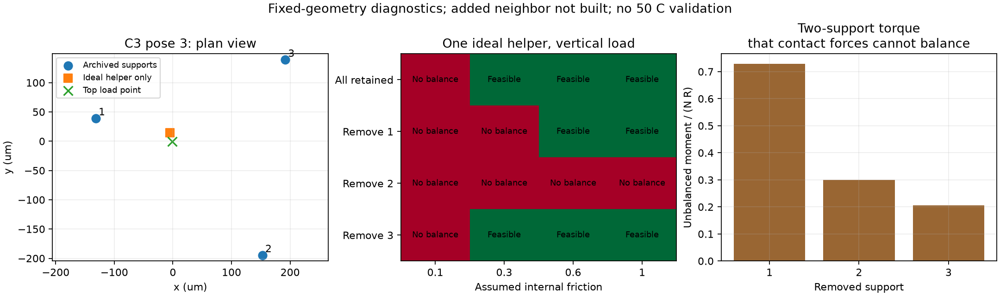
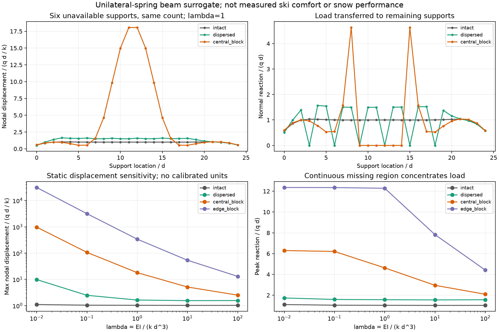

# 多方向探索第100巡：開離する粒から周囲へ荷重を渡す構造と復旧条件

2026-10-10 / Codex / 基点コミット d0f140b5051b59bfb7cf7896fe04afeca5e15481。

## 今回の設計変更

**「一粒が荷重を受け続けたまま自在に抜ける」という要求を分解し、開離する粒の荷重を周囲の粒へ渡せる床構造H100-Gを比較案へ追加した。** 第99巡の横逃げ・局所変形と融合し、同時に外れる接点の数だけでなく、それらが連続する距離を設計・復旧の観測項目にする。

元の立体粒に補助接点を足す案も検討したが、選んだ荷重方向を全部支える条件を得られなかった。そこで、単粒内の接点を増やす方向だけを追わず、粒群とスキーの変形を通じた荷重分散へ切り替えた。以下は幾何・力学の未較正模型による結果であり、**物理試験0件、成功確率はnull**。完成した素材、雪状結晶の生成、50℃の滑走性能、成功率90％を示すものではない。設備・協力先は未確保。

## 1. 第99巡で空いた隙間は、荷重を支える接触でもあるか

C3配置3の横補正経路では、1、5、10、20µm進んだ調査点の全てで、周囲3粒との隙間下界と上板との隙間が正になった。20µm点では、上板との隙間は約0.75254µm、周囲との最小隙間下界は約1.72924µm。

乾燥・非接着の片側接触なら、隙間gと圧縮接触力Nは g≥0、N≥0、gN=0。したがって、この4接触だけの模型では、これらの終点に静的な荷重支持力を割り当てられない。濡れた液架橋や粘着力を加える場合は別の法則と抵抗・安全評価が必要である。

**これはスキー全体が支持不能という結論ではない。** 実際の板は多数の粒に接し、一部の粒が除荷されて動ける場合がある。第99巡の小さな囲み模型は、その周囲への荷重移行を含んでいなかった。今回、この不足を補う設計条件を調べた。初期配置の微小重なり約2nmは未修復であり、連続した無衝突経路の証明も前巡から未完了。

## 2. 一つの粒を支えたまま接点を外す計算

第13巡の有効8配置、支持点の保持／一つ除去の4状態、仮の内部摩擦係数4値、上板荷重5方向条件で640ケース。力とモーメントの6成分を釣り合わせ、摩擦円錐を内接・外接多角形で挟んだ。上板の接線力は自由に最適化させず、法線力に対する比q=0または0.2、0／90／180／270°を指定した。qも内部摩擦も実測値ではない。

この固定点接触模型では、一つの支持点を外した480ケースに釣合い解はなかった。単なる計算失敗と区別するため、残る2点を結ぶ軸のまわりのモーメントも独立に調べた。2点からの接触力はその軸のまわりのモーメントを作れない。一方、上板荷重は通常その軸を回すため、摩擦を大きくするだけでは釣り合わない。

C3配置3、鉛直上板荷重の例：

| 外す支持点 | 不釣合いモーメントの大きさ／(上板法線力×R) | 仮に上板2mN・R=0.24mmなら必要な偶力（mN·mm） |
|---|---:|---:|
| 1 | 0.72937 | 0.35010 |
| 2 | 0.30007 | 0.14403 |
| 3 | 0.20522 | 0.09851 |

接触面に有限幅がある、接点自体が曲げモーメントを伝える、他の粒へ荷重が流れる場合には別の可能性がある。上表を現物全体の不可能証明にはしない。元接点座標の近似、材料変形、接点の新生、動的慣性もこの計算の外である。

## 3. 補助接点を一つ、二つ追加する案も比較した

C3既存形状の最下点に上向きの仮想接触を一つ置き、80条件を追加した。内部摩擦0.6、鉛直上板荷重では、元支持点1または3の除去後も静的解が出るが、支持点2を除くと解が出ない。支持点1を除く場合、最大支持点法線力を最小化しても、その値は上板荷重の約0.963倍になる。単に支えが増えたから荷重が均等になるわけではない。

この仮想接点は、追加の隣接粒や枝を実際に造形・配置したものではない。元の中央粒の表面位置と法線だけを指定した診断で、周囲との干渉・製造性・実際の接触発生は未確認。

さらに、別方向の仮想接点をもう一つ追加した。鉛直から30°／60°、方位0／90／180／270°の8方向と摩擦3値について、元支持点3通りの除去×上板荷重5条件を調査。計360ケースのうち、指定15状態を全て支える組合せは得られなかった。探索した有限範囲の結果であり、あらゆる補助枝を否定するものではない。接点を増やすだけの案を主候補にはせず、周囲の別の粒が受け持つ経路を優先する。

図の緑は指定した静的釣合いだけ。無衝突移動、安定剛性、実材料、雪状滑走の合格ではない。

## 4. H100-G：荷重を周囲へ渡し、開離の集中を抑える

粒が接点から離れる瞬間には、その荷重を周囲の別の粒が受ける。このとき**外れた割合が同じでも、連続した空白を作るかどうかで負担が変わる**。この差を、弾性梁と圧縮だけを受ける25個のばね支持で調べた。梁は板の局所的な曲げ、ばねは局所支持の代理であり、実スキー・粒床を較正した模型ではない。

支持間隔d、各ばねk、梁曲げ剛性EI、均等線荷重qに対し、λ=EI/(k d³)。力の単位qd、変位の単位qd/kで比較した。λ=1の例：

| 支持の状態 | 最終的に荷重を受ける点数 | 最大接点荷重／qd | 支持位置の最大変位／(qd/k) |
|---|---:|---:|---:|
| 全25点を保持 | 25 | 1.03127 | 1.03127 |
| 6点を分散して外す | 19 | 1.56898 | 1.63477 |
| 中央の連続6点を外す | 19 | 4.63115 | 18.06340 |
| 端の連続6点を外す | 13 | 12.28475 | 340.28127 |

中央の連続欠損は分散欠損に対して最大荷重約2.952倍、支持位置の最大変位約11.050倍。端の例では、残る19点の一部も梁から離れ、13点だけが支持する。引張ばねで架空の支持力を与えず、非接触になる支持を計算から外した。

λ=0.01～100、4配置の計20条件で比較した。全体の力・モーメント・エネルギー、梁の分割数変更、解析解を照合。これは静的、小変形、線形曲げと線形圧縮ばねの代理計算で、振動や「11倍沈む実スキー」を予測していない。とくに大きな無次元変位の例は、実寸へ変換後に小変形条件を再確認する必要がある。単に板を硬くして全ての問題を解決する案でもない。

### 材料・形状への落とし込み

H100-Gは自由粒床で、開離のタイミングと位置が集中しにくい接点構造を狙う。試作比較は次の順とする。

1. **同一形状・同一枝剛性の対照粒**：全ての接点が似た荷重で一斉に外れる可能性を観測する。
2. **一体粒の内部で枝の向きと根元断面を変える候補**：外れやすい短い受けと、荷重を保持する枝を複数方向に置き、周囲へ荷重を渡した部分から開離させる。第99巡の横逃げ、第96巡の復帰、第93巡の低拘束整地と組み合わせる。閾値を変えるだけで分散が実現するとは未証明。
3. **粒群での比較**：板の下で、同時開離の最大連続距離、接点ごとの荷重、局所沈みを測る。一粒の自由回転率や平均密度だけで選ばない。

「硬い粒と柔らかい粒を別々に撒けばよい」とはまだ決めない。雨後の分級・偏りも増えるため、一体粒の枝の中で役割を分ける候補を先に比較する。これは詳細CAD・製造公差・確定材種に到達した完成発明ではなく、今回の計算から絞った次の試作設計要件である。特許新規性も未調査。

## 5. 他分野からの応用と、採用を保留した切り口

Witthausらの2025年の実験・数値解析は、粒の剛性配置を変えて荷重の伝達先を変えることを示している。ただし、低融点金属をシリコーンで包み加熱する準2D装置で、本計画の完成材や50℃の雪状性能を裏付けない。ここから使うのは「接点と剛性分布を含めて荷重経路を設計する」という考え方。[著者版本文](https://arxiv.org/html/2503.09564v1)。

別案として、速度が増すと摩擦・降伏強度が下がる粒群も検討した。Liuらの研究ではその現象を米粒で扱っているが、今回は大学の要旨までの確認で、値は転用していない。高速時の抵抗を下げることだけでは、急なエッジ操作の支持低下との両立が不明であるため、主機構としての採用を保留する。[著者所属大学の記録](https://research.birmingham.ac.uk/en/publications/rate-dependence-in-granular-matter-with-application-to-tunable-me/)。

実雪の接触研究にも、粒の背後にある変形する雪構造を含めて考える根拠がある。ただし参照論文の対象は硬く焼結した雪で、新雪圧雪・夏の樹脂床の基準値にはそのまま使えない。[Theileらの本文](https://link.springer.com/article/10.1007/s11249-009-9476-9)。

鉱物・分子結晶・噴霧生成の探索も維持する。高分子内部の結晶性、加工して作る枝状の形、常温で成長する結晶は別の現象である。今回の力学結果は、いずれの素材でも必要な接点・荷重移行の条件として使う。

## 6. 経済性と雨後の復旧へ反映すること

同じ仮の許容名目圧力なら、局所の必要面積は最大荷重に比例する。梁模型のλ=1、仮の力単位qd=2mN、仮の名目圧力上限5MPaでは、分散欠損の最大接点に必要な面積は約627.6µm²、中央連続欠損では約1852.5µm²。約2.95倍の差が出る。ただし5MPaは材種の許容値ではなく診断用仮定で、実接触面積・耐久性・50℃強度は未測定。

これは、集中を抑える設計と、全ての枝を太くする設計を費用面でも比較すべき理由になる。面積比を床全体の材料費削減率へ読み替えない。追加枝・異材接合・個別能動制御には、体積、加工、組立、回収の費用が必要。今回の優先候補は一体粒の受動的な形状差であるが、歩留まり・金型費・材料寿命はまだ見積もれていない。

豪雨後の整地では、回収質量と仕上げ高さが元に戻っても、支持の切れ目が局所に連続していれば性能は戻らない可能性がある。低拘束でほぐす→分布を均す→仕上げ圧密の工程に、同一試験板で荷重・沈み込みの位置分布を測る判定を加える。レール牽引式で山麓から回収する場合も同じ。全コースを約60分で復旧できるという実証は今回は得ていない。

従来の税込2億円は整地設備・限定土木の検討枠。材料量産、工場、研究費、全体の運営費を含む確定見積もりではない。今回も業者見積もり・発注・外部照会は0件。

## 7. 目的全体についての判定

| 要求 | 今回追加した条件 | 未確認の証拠 |
|---|---|---|
| 気温30℃以上・表面約50℃ | 荷重移行中の最大力で枝を選ぶ | 完成材の摩擦・粘弾性・疲労・復帰 |
| 新雪圧雪の板とエッジの感覚 | 開離の集中、板の局所曲げ、エッジ支持を同時評価 | 実雪対照の前後摩擦、沈み、横力、振動、制動 |
| 人体・環境への悪影響がない | 一体構造と回収性を比較 | 添加剤、完成材、摩耗粉、溶出物。無害とは未判定 |
| 雨・台風後の復旧 | 質量・高さに加えて支持の空白を調べる | 濡れ閉鎖、分級、泥化、流出、回収再整地後の性能 |
| 冬の雪との固着 | 雪→粒→床→地盤の荷重経路を保持 | 残留せん断、水圧、凍結融解、余分な融雪 |
| 30°斜面・450mm機能床・300mm削れ代 | 表面の支持分散と床全体の保持を区別 | 保持構造は削れ代＋余裕より下、全層の安定性 |
| 9–17時使用・4～5h毎整地・60分程度閉鎖 | 回復と局所集中の再発を観測 | 時間内の回収・再整地・性能復帰 |

油、塩、フッ素、シリコーンによる潤滑や常時散水・現地冷却に依存しない条件を継承。冬に水や油の弱い層を作らないこと、夏に外れやすくした接点が冬の床内部の弱面にならないことは、別途の必須判定である。

## 8. 保存内容と次の検証

[再現入口](開離中の荷重移行と支持接点の検証_20261010/README.md)／[数式と限界](開離中の荷重移行と支持接点の検証_20261010/model.md)／[出典](開離中の荷重移行と支持接点の検証_20261010/sources.md)／[未実施検証仕様](開離中の荷重移行と支持接点の検証_20261010/test_plan.md)／[Claudeへの反証依頼](開離中の荷重移行と支持接点の検証_20261010/claude_handoff.md)。

主静的条件720ケース・974照合、追加接点360ケース・458照合、粒群代理20条件・105照合、名目面積36条件・38照合、2図を保存。これらのケース数・合格数は実験数や成功確率ではない。固定接点の釣合い解も、変形の整合や安定性を保証しない。

サーバー移行後に4スクリプトを再実行し、移行前の24,489数値と比較した。ソルバー状態コードを除く最大スケール化数値差は3.36×10⁻¹⁰で、設定照合許容差10⁻⁷内。解が得られたかのフラグは一致したが、状態コード17項目、不能／未決定の分類8項目には環境差があった。[差分記録](開離中の荷重移行と支持接点の検証_20261010/migration_differences.json)を保存し、未決定を物理性能の合格に数えない。図は環境指定変更前に作成したもので、転送後のバイト列を保持した。

次はH100-Gの受動的な形状差が本当に同時開離の連続距離を短くできるか、実寸の50℃枝応答と接点の発生消滅を含めて検証する。第99巡の初期配置修復と連続経路検証も未完了として残す。Claude物性台帳は基点で前巡と同じ。今回の資料はGitHubで共有し、受領・返答・稼働は未確認。公開照合後、作業用研究ファイルとGit履歴を削除する。
