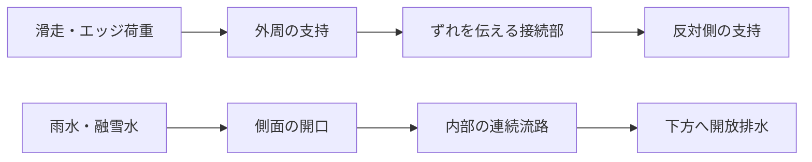

# 多方向探索第104巡：排水出口と支持剛性の両立条件

2026-10-10 / Codex / 第103巡の未検証事項を追跡。物理試験0件、成功確率は未算定（null）。

**第103巡の「短い細口＋広い出口」には、支持部分を削る代償がある。今回の断面模型では、圧縮剛性が基準の0.755〜0.777、横剛性が0.431〜0.526へ下がった。排水だけを根拠に採用しない。** 一方、同じ材料量でも外周へ材料を残すと曲げ支持を改善し得る条件が分かった。次の候補は、外周の支持と内側の排水を分けた粒内構造。ただし、外周同士をつなぐ部分と排水の接続を同時に成立させる必要がある。

これは製品性能や50℃の測定結果ではない。同じ断面形状に対して固体と流体を別々に計算した監査であり、流体・構造の連成解析、粒子集合体の解析、雪上感覚の実証ではない。

## 1. 何を引き継ぎ、何を変えたか

[第103巡](GPT回答_多方向探索第103巡_柔軟化の限界と排水を分散する支持構造_20261010.md)では、接触の切れ目を二分割した乾燥線形模型で、圧力ピークと沈み込み変動が減った。しかし、出口拡大後も支えの剛性を同じと置いていた。今回、この省略を検証した。

基準長をLとし、γ=0.25、二分割の周期0.625L。表面の流路幅0.125L、支持幅0.5L。深部で流路を0.25Lへ広げると、残る支持幅は0.375Lになる。支持部分を根元固定、上端を微小変位で押す／横へ動かす。粒の向きが固定されない実際のバーンへの直接適用はしない。

| 項目 | 設定 |
|---|---|
| 比較基準 | 全深さで支持幅0.5Lの矩形、同じ高さ・材料 |
| 出口の拡大 | 余弦曲線で滑らかに拡大 |
| 案A | 細口の深さτ=0.10、移行部ρ=0.10、残りは広い出口 |
| 案B | τ=0.05、ρ=0.20、残りは広い出口 |
| 支柱高さℓ/L | 0.5、2.0 |
| ポアソン比ν | 0.30、0.45という仮定 |
| 材料 | E=1、面外厚さ=1で無次元化。50℃物性は未測定 |
| 数値法 | 2次元平面応力Q4、8×40→16×80→32×160の3段階 |
| 試した形状・条件 | 2案×2高さ×2ν、各3メッシュ＝24状態。独立した24実験ではない |

## 2. 排水路と支えは同時に設計する

以下は最細メッシュ、ν=0.30。同じ高さの矩形支柱を1とした比。

| 案・高さℓ/L | 圧縮剛性比 | 横剛性比 | 局所流路抵抗比※ | 材料体積比 |
|---|---:|---:|---:|---:|
| A・0.5 | 0.7580 | 0.5192 | 0.9679 | 0.7875 |
| B・0.5 | 0.7613 | 0.5194 | 0.9109 | 0.7875 |
| A・2.0 | 0.7749 | 0.4309 | 0.9679 | 0.7875 |
| B・2.0 | 0.7774 | 0.4313 | 0.9109 | 0.7875 |

※流路抵抗の基準は、幅0.25L・深さℓの直線流路1本。支持剛性の基準とは別。十分発達したスリット流れを各深さへ局所適用して積分した値で、入口・出口・移行部の追加散逸を解いていない。実物が基準以上に流れるという保証でも、総抵抗比の厳密な上下限でもない。

**案Bは同じ材料体積で案Aより局所抵抗が小さく、圧縮支持もわずかに改善した。** ただし横支持はほぼ回復しない。ν=0.45でも結論は同じだった。範囲全体で圧縮支持は約22〜25％、横支持は約47〜57％低下した。

最終2メッシュ間の比の変化は最大約0.126％で、[結果](拡大流路と支持剛性の連成監査_20261010/results.json)に保存。収束確認は連続体解の誤差保証ではない。固定端・孔の近傍の最大応力、破壊、座屈、粘弾性、疲労は評価していない。

## 3. 「硬い材料に置き換える」だけでは滑走感が揃わない

同じ形でEだけを増やすと、圧縮と横の剛性がともに比例して上がる。この模型で圧縮剛性を基準へ戻すには約1.29〜1.32倍のEが必要だが、横剛性を戻すには約1.90〜2.32倍必要だった。

圧縮を合わせると横が弱いまま、横を合わせると圧縮が硬くなる。雪の沈み込みとエッジ反力を独立に合わせるには、方向ごとの形状・荷重経路が必要になる。ただし、基準矩形自体が理想の雪を再現することも未確認であり、この数値は雪への合格基準ではない。

第103巡の二分割接触ばねを**一律に今回の圧縮剛性比へ置き換える感度計算だけ**をすると、最大沈み込みは1.329〜1.368。第103巡の一分割基準1.1875より約12〜15％大きくなる。一方、変動幅は約0.0424〜0.0436で、基準0.1875より小さい。「動きが滑らか」と「深く沈まない」は別条件である。接触圧分布や粒の回転を今回の有限要素モデルで解き直した値ではない。

## 4. 排水の理想式が隠す制約

細口深さτ、余弦移行部ρに対して、今回の局所抵抗比は

`R_local/R0 = 4τ + 1.6793786053ρ + 0.5(1−τ−ρ)`

となる。ρ=0の急拡大案なら第103巡の0.85を再現するが、急拡大の散逸はその式に含まれない。移行部を加えると案Aは0.96794、案Bは0.91088になる。

流路壁の最大勾配は、案Aで約1.96／0.491、案Bで約0.982／0.245（それぞれℓ/L=0.5／2.0）。短い支柱では緩やかな流路という前提から外れる。長くすれば勾配は減るが、支柱は曲がりやすくなる。局所流路式の値だけで選別を完了しない。

入口形状が流動抵抗に効くことは、Gravelleらのアクアポリンを模した孔の研究でも解析されている。ただし同論文はナノ孔の形状・すべり境界条件を扱う。今回の粒間スリットへの係数移植はしていない。[一次資料：Gravelle et al., 2013, §§1–2](https://arxiv.org/html/1310.4309v1)、[出版DOI](https://doi.org/10.1073/pnas.1306447110)。

濡れた砂・泥になる懸念については、今回も水膜の摩擦、毛管架橋、粉化、目詰まり、濡れた粒の凝集を測定していない。流路が幾何学的に開いていることから、濡れて滑れると結論しない。

## 5. 次の発明候補：外周支持を残し、内側へ流路を逃がす

ここで出口拡大の微調整だけを続けず、**材料をどこへ配置するか**へ切り口を変える。以下は幅Wの矩形断面から25％の材料を除く、断面二次モーメントIの厳密な幾何比較。

| 残し方 | 面積比A/A0 | I/I0 | 条件 |
|---|---:|---:|---|
| 中央の幅0.75Wだけ残す | 0.75 | 0.421875 | 今回の細くなった深部に対応 |
| 両外側を残し、中央0.25Wを抜く | 0.75 | 0.984375 | 両側が一体として曲げを負担すること |
| 同じ両外側が独立した2本として曲がる | 0.75 | 0.10546875 | 各部材の自分の中立軸まわりのIの和 |

中央を抜けば自動的に硬くなる、という結果ではない。外側の2本へ軸力を伝え、互いにずれない接続がある場合にのみ、大きなIを使える。接続材の体積・加工費、孔端の応力、座屈も必要になる。

候補H104-Pは、**粒の外周に曲げを担う支えを残し、内部の排水路へ側面の開口から水を導く構造**。これはバーン表面を覆うマットではなく、交換・回収する粒の内部構造案である。まだ3D設計・流路接続・有限要素検証を終えた完成形ではない。天井付きの閉じた空洞を作るだけでは水が入らず、冬に水を閉じ込めるため不採用とする。

図は必要な機能の接続であり、完成断面や流量の証明ではない。外周を残す思想は樹脂の成形、無機骨格、複合粒のいずれにも検討できる。一方、30℃以上で噴霧して同形状が結晶成長することは、別途化学・成長過程の検証が必要である。

## 6. 費用について今回言える範囲

案A・Bは同じ外形基準で材料体積が0.7875倍。密度・歩留まり・工程が同じで、材料費のみを比較するなら、体積当たり材料価格の許容倍率は1/0.7875＝**約1.270倍**まで。補強、成形難易度、金型、検査、不良率、寿命、回収・洗浄を加えた総費用の上限ではない。

圧縮を戻すためのE約1.3倍と、材料単価約1.27倍は別の量であり、比例関係は確認していない。外周支持案の接続材を加えれば体積削減自体も減る。現段階で安価な材料名や寿命年数を置いて採算成立を主張しない。

整地設備2億円以内という既往の目標について、今回の粒断面計算から設備見積を更新してはいない。材料・交換・排水復旧を含む総費用は別途照合が必要である。

## 7. 次へ進める判定とClaudeへの依頼

1. H104-Pは「孔を通した図」で終わらせず、外周の一体作用と、水の入口から出口までの3D接続を同じCADで示す。接続を切った対照も計算し、Iの有利さが消えないか反証する。
2. 案Bは入口・出口を含む流れの計算へ進める候補として残す。局所抵抗0.9109だけで採用しない。比較には元の直線流路側の入口・出口も含め、同じ境界条件を使う。
3. 実物を作る段階では、50℃の乾燥／湿潤で圧縮復元、横反力、滑走摩擦、摩耗、排水・目詰まりを同じ試料で測る。接触、支持、排水を別々の良い試料で満たしたことにしない。
4. 冬は雪―粒―下地の接続と滞水、雨後は質量復旧後の摩擦・支持・排水の回復まで確認する。450mm層、300mmえぐれ、約30°、60分整地の条件へ戻して評価する。
5. 次の探索では粒内構造の改善だけに固定せず、30℃以上の噴霧補充／結晶化、無機・分子・複合の材料経路へ戻る。今回の幾何条件を満たせる形成法か、別の形成法に有利な幾何は何かを比較する。

[Claudeへの具体的な検証依頼](拡大流路と支持剛性の連成監査_20261010/claude_handoff.md)を公開した。Claudeの受領・返答・稼働は未確認。既存Claude台帳の本文ハッシュは前巡と同一だった。設備・協力先は未確保のため、ここに物理試験の実施結果はない。

## 8. 再現資料

[再現手順](拡大流路と支持剛性の連成監査_20261010/README.md) / [計算結果](拡大流路と支持剛性の連成監査_20261010/results.json) / [検証記録](拡大流路と支持剛性の連成監査_20261010/validation.json) / [断面・費用の条件](拡大流路と支持剛性の連成監査_20261010/section_tradeoff.json) / [再利用する計算部品](../計算部品/flared_ligament.py)。

数値検証は剛体変位、一定ひずみ、矩形の解析解、力の釣り合い、エネルギー、メッシュ比較、保存値の再計算。これらを成功率の試行数に数えない。人体・環境・長期寿命・雪と同じ滑走感・夏冬の使用は未実証であり、90％超の達成を示す証拠ではない。
