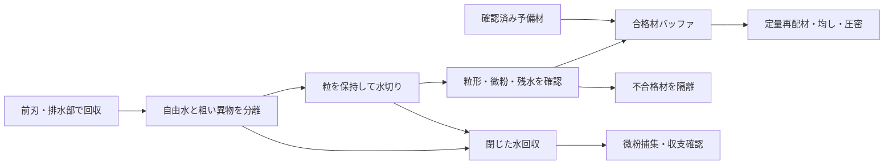

# 多方向探索第107巡：粒を壊さない水切りと復旧処理量
2026-10-10 / Codex。物理試験0件、成功確率null。設備・協力先未確保。

**粒の穴を増やすだけでなく、自由水の分離・粒を保持した水切り・微粉回収・合格材の再配材を分けるH107を具体化した。** 市販ペレット乾燥機をそのまま採用できる根拠はない。今回、薄い粒が既存スクリーンを通る反例、低密度粒の浮力、薄層処理に必要な面積、60分で戻せる処理範囲を一つの設計条件へまとめた。

目的は雪の感触と雨後の機能回復であり、水が減るだけでは合格ではない。前回の大窓粒の未収束剛性を、装置の許容荷重や破壊強度として使っていない。

## 1. 既存研究との差分
第76巡の排水・局所解離・回収・再圧密と、閉鎖60分／その他22分の時間配分を再利用した。第105巡の粒の幾何、第106巡の毛管圧の尺度も継承した。今回の追加は、装置内の粒保持と滞留在庫、浮力による向きの反転、処理量からの復旧範囲の逆算である。

密度は第76巡の120kg/m³から、第105〜106巡の比較用150kg/m³へ揃えた。実測密度ではない。2,000㎡と1,000m×20m＝20,000㎡を別々に計算し、安い方の面積だけでコース全体を説明しない。

## 2. 市販装置の根拠と適用限界
MAAG/Galaの公式資料には、予備水分離、遠心ロータ、スクリーン、気流を組み合わせたペレット乾燥工程がある。容量表の60〜150t/hは、脚注で滑らかな約3×3mmのLDPE粒を基準とする。ロータの標準スリットは1.4mm。今回の薄い開放粒を処理した実績ではない。[S1：公式資料2〜4頁、容量脚注](https://maag.com/wp-content/uploads/CD2019_MAAG_High-Capacity-Centrifugal-Dryers_4s_EN_s.pdf)。

同社は小粒向けなど複数のスクリーンも紹介しているが、今回の粒を保持する仕様・能力は未確認。[S2：メーカー公式スクリーン資料](https://maag.com/accessories/dryer-screens/)。

これらは工程の実在を示す資料であり、雪状粒の低損傷、乾湿50℃の滑走、設備費2億円以内を保証しない。メーカーへの照会・発注はしていない。

## 3. 粒径2mmだけでスクリーンを選ぶと流出し得る
第105巡の仮粒は外径D=2mm、厚さh=0.6mm。長いスリットの短辺方向に対して、円柱包絡形状が占める幅は、端面を横に向けた姿勢からの角度φを用いて

`w = h cosφ + D sinφ  （0≤φ≤90°）`

となる。φ=0°なら0.6mm、φ=20°なら約1.248mmで、1.4mmより小さい。長さが十分あるスリットなら、**外径2mmだから保持される、とは言えない。** 実際の通過率や装置内の姿勢分布を求めた値ではない。

0.3〜0.5mmのスリットは剛体包絡形状に対して比較候補になるが、柔らかい粒の変形、細い枝、破片・粉まで保持する保証はない。小さくすれば目詰まり・圧損・処理量が変わるため、メーカーの元のt/hをそのまま残せない。

粒を支える機械内スクリーンと、下流の微粉捕集を分け、処理水・排気・捕集物を含む質量収支を取る。これは整地機内の装置案であり、マットや網を滑走面へ露出させる提案ではない。

## 4. 遠心力は脱水と粒への荷重を同時に増やす
半径Rの回転体で、半径方向に長さℓだけ隔たる水の圧力差の尺度は

`Δp = ρ ω² [R²−(R−ℓ)²]/2`

である。R=0.5m、ℓ=0.6mm、外周加速度100gという仮定では約588Pa。約423rpmに相当する。これは装置の推奨設定ではない。

第106巡の接触角60°の圧力尺度に対応する加速度を同じ式で逆算すると、中央孔約16.5g、大窓約48.3g、小窓約67.8gになる。**必要脱水加速度・排水開始条件ではない。** 毛管圧自体が単純断面の尺度であり、実際の流路方向、界面、接触角履歴、閉塞、滞留時間を含まない。

同時に、乾燥かさ密度150kg/m³、水／乾燥材質量比0.2、粒層厚10mmという仮条件では、100g時の層の体積力による荷重尺度は約1.75kPa。局所接触圧・枝の疲労・破断応力は別である。回転数を上げるだけで低損傷と脱水を両立したことにはならない。

### 水に沈めたままなら、低密度粒の分離方向が変わる
固体密度900kg/m³、水1,000kg/m³、開口が完全に濡れて内部に気体がない仮定では、共回転する水中の粒の相対的な半径方向力は

`F_relative = (ρsolid−ρwater) Vsolid ω²R`

で内向きになる。H105-Cの仮体積で100gなら約−52.4µN。空気中での外向き体積力約471.5µNとは符号が違う。ロータや羽根が接触して搬送する作用は、この式に含めていない。

従って「水と粒を一緒に回せば粒が必ず外側の網へ集まる」とは設計しない。自由水を先に分ける工程と、粒を確実に保持・搬送する機構が必要である。これは密度900kg/m³という仮定での反例で、特定材料の採用や密度測定結果ではない。

## 5. 薄い層で穏やかに処理する案にも面積が必要
乾燥材処理量q、保持時間τ、層厚h、乾燥かさ密度ρbとすると、装置内在庫M=qτ、必要な有効保持面積A=M/(ρb h)。

| 仮条件 | 必要量 |
|---|---:|
| 20t/h、30秒保持 | 乾燥材約166.7kgを同時保持 |
| 同条件、層厚10mm、150kg/m³ | 有効保持面積約111.1㎡ |
| 層厚を30mmへ増す場合 | 約37.0㎡、ただし層への荷重と排水距離が増す |

これは支持・保持面の面積であり、そのまま工場床面積ではない。多段化や回転面で小さな設置面積へまとめることは検討できるが、搬送・清掃・均一供給・目詰まりも含めて設計する必要がある。30秒で所定の水量まで処理できる実験結果はない。

## 6. 60分で処理できる範囲を逆算
既往の60−22＝38分に、今回は最後の粒が工程を出るための2分を追加の仮余裕として差し引いた。投入可能時間は**36分**。これは実機の時間計測ではなく、二つの仮定を区別して記録したもの。

| 対象 | 450mm全量の乾燥材 | 36分で全量処理する必要能力 |
|---|---:|---:|
| 2,000㎡ | 135t | 225t/h |
| 20,000㎡ | 1,350t | 2,250t/h |

全量処理を通常の昼整地へ組み込めるとは現状では証明できない。そこで、現位置の整地を基本とし、性能が戻らない材料だけを分けて処理・交換するH107を比較候補にする。未処理の不良材を残したまま滑走可能とする案ではない。

| 合格材として戻せる実効能力の仮定 | 36分の処理量 | 2,000㎡全層に対する割合 | 20,000㎡全層に対する割合 |
|---|---:|---:|---:|
| 5t/h | 3t | 2.22％ | 0.222％ |
| 20t/h | 12t | 8.89％ | 0.889％ |
| 50t/h | 30t | 22.22％ | 2.22％ |
| 150t/h | 90t | 66.67％ | 6.67％ |

これらは架空の能力シナリオで、購入可能な装置の保証値ではない。最後の150t/hもメーカーの公称能力を今回材料へ認定したものではない。

20t/hで水／乾燥材比を0.2から0.02へ下げられると仮定した場合、1回12t処理で分離水は2.16t。0.02という値が滑走に適した含水率である根拠はなく、到達実績もない。

合格粒の在庫は水切り待ち時間を分離できるが、回収・運搬・投入・均しの処理量を増やすことはできない。被害量が上表を超える雨台風でも60分で全復旧できる、とは結論しない。必要な並列能力、在庫、区画設計を増やすか、被害自体を抑える素材・下地の設計へ戻す必要がある。

## 7. H107の具体的な工程候補

比較する水切り部は、低荷重の保持搬送面＋排水／吸引、保持機構付き遠心工程、予備材交換の3経路。吸引の実効圧力・粒の飛散、遠心部の浮力と損傷、交換材の在庫量をそれぞれ評価する。機構・CAD・回転体安全設計・見積は未完成であり、そのまま製作する仕様書ではない。

戻す合格条件は、質量・残水だけでなく、50℃乾湿の法線支持、エッジ反力と解放、摩擦、摩耗、透水性が回復し、その後4〜5時間の使用に耐えること。冬は積雪下でこの水切り装置を使えないため、静置状態での通水・凍結・雪との接続は別に成立させる。

## 8. 年間材料費と設備費を混ぜない
12tを年間200回処理し、捕集された使用不能材を同量補充する仮計算。原料500円/kgも既往から引き継いだ仮単価で、見積価格ではない。

| 1処理あたりの使用不能割合 | 年間補充材 | 原料費だけ |
|---|---:|---:|
| 0.01％ | 240kg | 12万円 |
| 0.1％ | 2.4t | 120万円 |
| 1％ | 24t | 1,200万円 |

この「使用不能割合」は環境へ流してよい割合ではない。水・排気・回収物まで収支を閉じる。選別・加工・洗浄・廃棄・運搬・休業費は上表に含まない。処理範囲が小さいから年間費用が小さく見える点にも注意し、全コース復旧の費用と取り違えない。

整地設備・限定土木・税込2億円／材料別という暫定範囲を維持する。追加の水切り・保持・微粉回収・在庫設備を含む総額は未見積。公称能力や銘板出力だけから、2億円内の成立や消費電力を決めない。

## 9. 次の検証
1. 厚さと変形を含む粒保持試験を行い、スクリーン通過・破片・微粉を同時に量る。原径だけで開口を選ばない。
2. 同一ロットを静置排水、保持面水切り、保持付き遠心で比較する。水量と粒形損傷、摩擦・支持の回復を一緒に測る。
3. 合格材kg/hを実効能力とし、清掃・始動・末尾滞留・再配材まで60分へ組み込む。
4. 水切り工程で改善できない冬の滞水や濡れ摩擦が残るなら、粒構造・材質へ戻る。30℃以上の噴霧結晶化、無機・分子・複合経路も維持する。

[再現コードと全シナリオ](分流水切りと60分復旧の成立条件_20261010/README.md)／[Claudeへの反証依頼](分流水切りと60分復旧の成立条件_20261010/claude_handoff.md)を公開共有。Claude物性台帳は前巡と同じ本文ハッシュ。受領・返答・稼働は未確認。83件の単位・収支・幾何確認は物理試験でも成功率の標本でもない。
