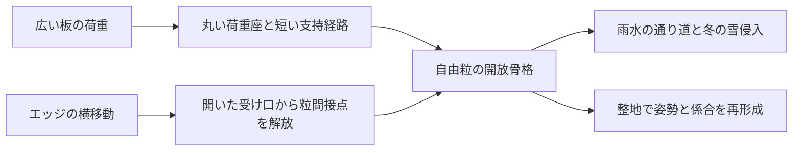

# 多方向探索 第108巡：滑走中の変形仕事とエッジ解放を分ける
2026-10-10 / Codex。開始時 main: 7322fdb0de096915f156bcb8f3a165be07e66262。

**成果は、粒床の沈み込み・除荷・変形仕事を同じ荷重収支で比較し、「低抵抗になったが硬い床に変わった」を識別したこと。H108は直進支持と横解放を分ける候補設計で、完成材料でも実証済みの発明でもない。物理試験0件、成功確率null。** 設備・協力先未確保、照会・購入0件。数値整合チェックは成功率ではない。

[計算一式](滑走方向の変形仕事と横解放の分離_20261010/README.md)／[式と適用範囲](滑走方向の変形仕事と横解放の分離_20261010/model.md)／[Claudeへの検証依頼](滑走方向の変形仕事と横解放の分離_20261010/claude_handoff.md)

## 1. 雪の摩擦係数を材料表面の係数へ流用しない
実雪の野外研究には、融点付近の整地直後の新雪でスキーの全体摩擦係数0.060±0.008という観測がある。同じ研究でも含水条件で大きく変わるため、この値を全ての新雪圧雪の目標値にはしない。これは滑走全体から推定した抵抗であり、接触面だけの材料係数ではない。[Wolfspergerら2021、Results](https://www.frontiersin.org/journals/mechanical-engineering/articles/10.3389/fmech.2021.728722/full)

別の実験研究を含む博士論文の公式要旨は、整地雪でも圧密・掘り起こしが抵抗へ寄与し、永久変形だけでなく弾性・粘弾性変形も観測したと報告する。今回読んだ範囲は公開要旨で、全論文の構成則を再現したものではない。[KIT、2024](https://publikationen.bibliothek.kit.edu/1000172164)

したがって「実雪の全体係数を人工材の表面係数に設定し、さらに粒の変形抵抗を加える」のは二重計上になる。逆に、表面材だけの摩擦測定から粒床全体の滑走を保証することもできない。

第71巡は接点数・圧力・横運動の仕事、第84巡は沈み込みと横破壊の開始値を扱った。今回は前後に移動する荷重による**法線方向の載荷・除荷の差**を追加した。エッジ横切削の継続抵抗は依然別問題である。

## 2. 同じ荷重で比べると、抵抗を減らす操作で沈み込みも変わる
これは三角形の押込み履歴を受ける独立支持点の仮模型。実際のスキー形状や粒配置は未計測。共通仮定は法線荷重700N、2本を合わせた幅0.12m、押込み側長さ0.15m、戻り側0.65m、速度10m/s。圧力/変位の支持係数K=20MPa/mは仮値で、樹脂の弾性率でも第84巡の雪硬さHでもない。

rは一支持点の除荷時の回復変位/最大変位、fは同じ載荷Kを持つ支持点のうち残留変形を生む面積割合。どちらも入力仮定であり、材料の実測復元率・成功率ではない。残りの支持点は理想弾性とする。

| 仮応答 | K（MPa/m） | f | r | 沈み込み | 変形抵抗だけ | 変形抵抗係数 |
|---|---:|---:|---:|---:|---:|---:|
| 全支持点が残留変形 | 20 | 1 | 0.2 | 2.083mm | 4.167N | 0.005952 |
| 残留変形する点を限定 | 20 | 0.25 | 0.2 | 0.871mm | 0.182N | 0.000260 |
| 同上、沈み込みを戻す補正 | 8.358 | 0.25 | 0.2 | 2.083mm | 0.435N | 0.000622 |
| 全て理想弾性という極限 | 20 | 1 | 1 | 0.729mm | 0N | 0 |

2行目の低抵抗化は、沈み込みが約58%浅くなる変化を伴う。3行目はKを約58%下げて深さを揃えた比較で、実物の枝寸法や材種がこのKを達成するという予測ではない。

さらに表面だけの係数を仮に0.06とすると、1行目と3行目の合計は約0.06595と0.06062。**変形抵抗部分は約90%減っても、合計抵抗の減少は約8.1%に留まる。** 速度が8.1%増すという意味ではなく、同一条件で仮定した抵抗の比にすぎない。ここで0.06は感度計算用の仮値で、上の実雪観測から材料界面へ移した値ではない。水橋・微粉・摩耗・温度依存は別途必要。

理想弾性で変形損失0になっても、表面摩擦・衝突・振動が0にはならず、雪の崩れ方や転倒時の感覚も一致しない。低損失一辺倒のゴム状床を合格にしない。

## 3. 粒径と板全体の沈み込みを混ぜると設計を誤る
模型の式は、λ=f(1-r)、C=a+b(1-λ)として、

- δ=2N/(WK C)
- 変形抵抗係数 μ_def=δλ/C
- 単位新規面積あたりの損失=Kδ²λ/2、抵抗=W×この損失

となる。同じr=0.2、f=1でも、仮にa=150mm、b=650mm、δ=3mmならμ_def=0.00857。一方、局所接触のa=b=2mm、δ=0.1mmなら0.03333となる。短い距離で繰り返す変形は、小さな変位でも抵抗になり得る。

この2例は別の指定履歴であり、同じ実物の予測でも、単純加算してよい2成分でもない。**2mm粒の間隔へ、板全体の2〜6mmの沈み込みをそのまま入れない。** 同じ変形仕事をミクロ・マクロで二度数えない。実物の局所変位、粒の入替わり、板のたわみを分けて測る必要がある。

243仮条件の全結果を残し、適用目安を外れる大きな傾きも削除しない。指定した速度は仕事率への換算にだけ使い、粘弾性・速度依存を計算したと称さない。

## 4. 次の構造案 H108：広い載荷と局所横解放を分ける
比較する方向は3つ。下記に実測K、r、fを割り当てていない。表の仮数値と具体材料を一対一対応させない。

| 方向 | 具体的な変更 | 利点の仮説 | 同時に反証する点 |
|---|---|---|---|
| A：粒全体を柔らかくする | 一体の薄枝・低剛性根元 | 深い沈み込みを作りやすい | 毎回の変形仕事、50℃クリープ、雨後の泥状沈下 |
| B：戻る枝を増やす | 弾性支持を増やし接点解放を減らす | 形状損失を抑える可能性 | 浅い沈み込み、跳ね返り、雪らしく削れない床 |
| C：支持座と横解放部を分ける | 開放環粒の上下の丸い荷重座、短い法線支持経路、外側の開いた横方向の受け・逃げ口 | 広い板の直進荷重を受けつつ、エッジ下では粒間接点が外れる | 姿勢が変われば機能が混ざる、座が砂状の硬い接点になる、横変形で支持座まで潰れる |

CをH108の優先比較案とする。H105/106の環と支柱、H99/101の逃げ経路・力の連続受渡し、H107の保持水切りを融合する**設計仮説**で、新規性・特許性は未調査。破壊させるのは主に粒間の係合とし、材料そのものを毎回砕く設計を避ける。ただし係合の解除も摩耗・引っ掛かりを起こし得る。

図は実現機構の検証済みCADではない。自由粒なので板の進行方向に常時整列するとは仮定しない。三軸姿勢を含む接触解析で、直進荷重から横解放部へ流れる力も次に閉じる。垂直と水平の機能分離ができないなら、Cを採用せずA/Bおよび分子結晶・鉱物・複合材へ戻す。

## 5. 50℃・結晶・冬・復旧・費用を同じ判定へ残す
今回の模型は幾何と仕事の診断で、50℃での材料物性を持たない。分子結晶、雪状の外形、雪状の滑走感は別々の合格項目。環粒を成形しても雪のような結晶成長を実現したことにはならず、30℃以上で噴霧して補充する形成経路も維持する。

- 夏：新雪圧雪の対照と同じ板・荷重・速度で、法線載荷/除荷仕事、深さ、直進抵抗、エッジの開始力と継続切削仕事、振動を組で比較する。単一の係数だけで雪感を判定しない。
- 冬：雪→粒→床の接続、粒自身の抜け、凍結融解と排水を確認。夏に低摩擦な支持座が冬の連続弱面にならないかを独立確認する。
- 雨後：回収量・残水だけでなく、K・除荷履歴・横解放・摩擦の同時復帰が必要。H107の分流で未処理域を全復旧と呼ばない。
- 安全：原料名だけでは人体・環境への無害性を保証できない。完成粒・添加物・摩耗物・排水を対象にする。油・塩・フッ素・シリコーン潤滑は使わず、固形パラフィンの例外は未回答のまま。
- 床：450mm・300mm削れ代を保持。定着材は削れ代＋余裕より下。露出したマットやネットで滑走する案へ置き換えない。

費用はまだ見積ではない。第107巡と同じ仮処理量12t/回×年200回、材料500円/kgを使い、捕集され再利用できない率が**もし**1%から0.1%へ減るなら、材料損失費差は年1,080万円。実際にH108で減る証拠はない。3年・割引なし・他費用差0の上限なら、全層への追加加工単価の余地は2,000㎡床（仮135t）で240円/kg、20,000㎡床（仮1,350t）で24円/kg。両面積とも処理量12t/回を据え置いた比較で、大コース全層を毎回処理する計算ではない。この余地から工場・選別・検査・洗浄・交換作業等を払うため、許容売価や購入見積ではない。約60分の閉鎖、設備等2億円枠と材料費を別々に照合する。

## 6. 次の反証
1. 同じ沈み込みを揃えた後も、直進損失と横切削応答を両立できるか。Kを下げる補正が横支持や50℃クリープを悪化させないか。
2. H108-Cの粒姿勢・接触交換によって局所変形の距離が短くなり、今回の低抵抗仮説を打ち消さないか。
3. 戻る仕事が板の推進へ戻るのか、振動・衝突・摩耗へ逃げるのか。模型が省いた項を閉じる。
4. 実測の全体抵抗から接触面係数を逆算するとき、圧密・掘削・水橋を二重に数えていないか。
5. Claudeのv3全結果・元コード・入力を共有し、未較正の通過割合や15%予測を実物成功率へ転用していないか。

Claude物性台帳のLF SHA256は054c9388de3be3bd251c395059a9e02c9d3b336885236683ba3f528ff819d71fで前巡から不変。公開共有は行うが、受領・返答・稼働は未確認。今回の進捗を全目的の達成としない。
