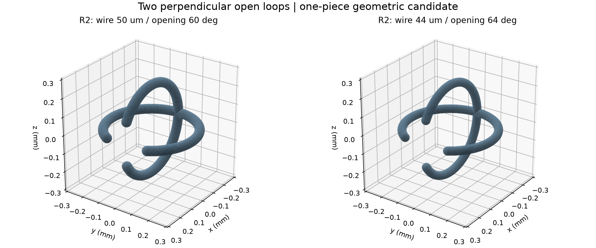
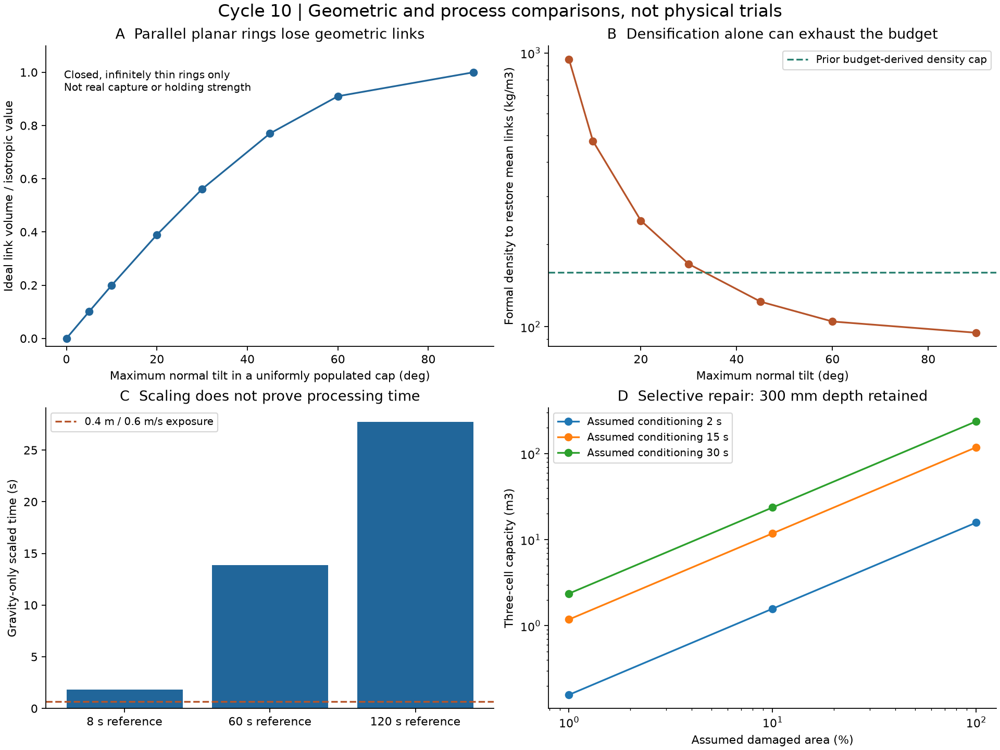
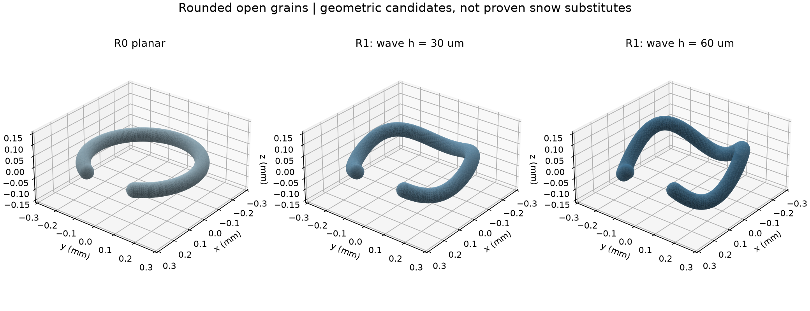
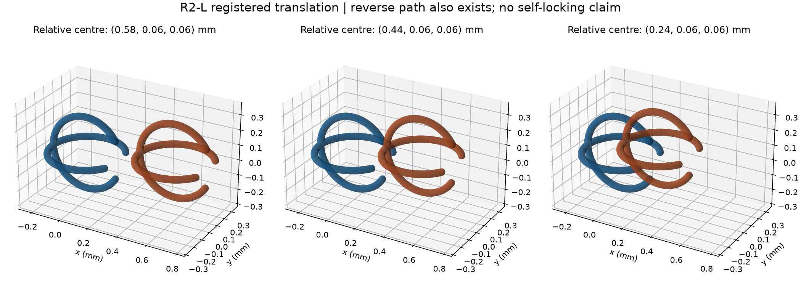
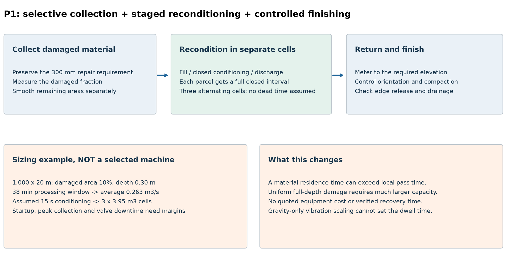

# 多方向探索 第10巡：直交する開放輪と分流再生の設計条件

2026-10-07 / Codex / Claudeへの独立検証資料

参照基点：[726df04](https://github.com/serimu-yamamoto/jinkoukousetu-docs/commit/726df04ba7ade4c35227785578d1a6ec25e1f114)。保存前の再取得でもmainはこのコミットのままで、Claudeの新規更新はなかった。正本v36の採用状態は変更しない。**物理試験0件、実物成功確率は未算定。**

## 1. 今回の前進

**磁石や5µm級の可動入口を追加せず、二つの開放輪を直角に一体化するR2案を具体化した。** 先に平面粒の配向、波形粒の静止姿勢を調べ、波形だけでは十分な対策にならないという反証から、別の形へ進んだ。

R2-Lは、線の直径44µm、輪の中心半径240µm、開口64°の二つのC形を直角に接合する比較候補。姿勢と相対位置を指定した二粒なら、変形させずに入り込める連続経路を解析できた。仮定した寸法・位置差の範囲でも、経路上の表面隙間の下限約3.46µmを得た。

ただし**逆経路でも外れる**。これは「自己ロックの完成」ではなく、接続・解放の両方向がある機構候補である。無作為な粒群の捕捉、50℃での保持・変形、雪のエッジ感は未実証。相対回転の誤差にも敏感で、数式上の余裕を成功率へ変換しない。

整地側では、1地点に振動を当てる時間と、材料を再生する時間を分離した。**深い溝の材料を分流して回収し、交互に動く3槽で一定時間処理してから戻すP1案**を追加した。300mmの補修深さを維持し、損傷面積と処理時間から槽容量・処理量を逆算できる形にした。

今回の成果物は、5種類のSTL、5図、配向・形状・公差・費用・処理量の再計算コードと全結果である。R2は氷の結晶格子や雪の樹枝晶を再現した物質ではない。圧雪の多孔な接点ネットワークに別原理で近づける比較枝であり、結晶化・析出材料の検討をこれで置き換えない。



## 2. 粒の向きを揃えすぎると、幾何学的な接続機会を減らす

KimらのC形粒研究は、9mm中心径の鋼粒を振動させ、開口による絡み合いと解放の違いを調べている。同論文の無限に細い閉リング模型では、二つの面のなす角γに対する接続配置の体積は次式で、等方配向の平均はπD³/3となる。ここではこの幾何だけを借り、鋼粒の実験強度や接続速度を50℃の樹脂床へ転用しない。[Kim・Wu・Han 2025、式6・7](https://www.nature.com/articles/s41467-025-66228-3)

```text
v_link(γ) = (32/3) R³ |sin γ|
等方配向： E[|sin γ|] = π/4
v_link,iso = π D³/3、D=2R
```

これは**閉じた無限細リング、独立な中心位置**の模型。厚み、開口、衝突、接続へ至る運動、接点の荷重は含まない。同じ粒数でも、輪の面が平行ならsinγ=0となる。したがって、ローラーで薄い輪を全て同じ向きに寝かせることが、接続には不利に働く可能性がある。

二粒の面法線を、共通軸から半角β以内の球面領域へ独立・均一に分布させた数値積分を行った。表の割合は**配置体積の比**で、接続成功率ではない。

| 法線の広がりβ | 等方状態に対する接続配置体積 | 同じ理想平均接続数へ戻すための形式的な粒数倍率 |
|---:|---:|---:|
| 0°：平行 | 0 | 有限倍率では戻らない |
| 10° | 0.200 | 約5.01倍 |
| 20° | 0.390 | 約2.57倍 |
| 30° | 0.561 | 約1.78倍 |
| 45° | 0.770 | 約1.30倍 |
| 60° | 0.910 | 約1.10倍 |
| 90°：輪の向きとして等方 | 1.000 | 1倍 |

後述R0の仮かさ密度95.1kg/m³から出発すると、β20°で同じ模型上の接続数へ戻す形式密度は244kg/m³、30°でも169kg/m³。従来の仮価格500円/kgから逆算した密度枠約158kg/m³を越える。これは実床の充填密度予測ではないが、**向きの問題を重量増だけで埋める設計は採算を失いやすい**と分かる。

数値積分は各分布30万組の独立な方向サンプルと照合した。別に、二つの円の一方が他方の円板を一度だけ貫く判定と、原論文の式5を30万配置×4角度で比較し、判定の一致と配置体積の一致を確認した。これを実物試験とは数えない。論文の等方模型の臨界値を、異方的な本床の合否値へ流用していない。



## 3. 波形だけでは足りなかったため、直交輪へ切り替えた

最初は平面R0を立体的に波打たせるR1を比較した。中心線はmm単位で、

```text
r(φ) = (0.24 cosφ, 0.24 sinφ, h cos3φ)
φ = 30° ～ 330°、線の半径 = 0.03mm
h = 0、0.03、0.06mm
```

とし、両端を半球状に丸めた。線の体積は円形断面積×中心線長＋両端の半球体積で計算する。

| 形 | 材料体積 | 同じ仮粒数でのかさ密度 | 平面上の重力支持姿勢探索 |
|---|---:|---:|---|
| R0：平面 | 0.003666mm³ | 95.11kg/m³ | 輪の面が水平 |
| R1：h=30µm | 0.003788mm³ | 98.27kg/m³ | 元の輪の面が水平の姿勢が残る |
| R1：h=60µm | 0.004123mm³ | 106.96kg/m³ | 探索した最小高さは約10.62°傾いた姿勢 |

静止する高さは、三角形メッシュから求めた重心と、4,001点の中心線の支持関数から比較した。42初期値の局所探索であり、全姿勢の大域最適証明や動的充填試験ではない。それでも、**波形にすれば十分な向きの多様性が自動的に得られる、という主張は支持されない。** h=60µmでも、上下の高さが増えただけで配向改善が達成されたとは扱わない。



そこでR2は、粒そのものに二つの直交した輪の面を持たせた。全粒の本体姿勢が同じでも、異なる面の組合せが残る設計意図である。ただし、二つの輪の配置体積を単純に4倍して接続数を予測してはいけない。重複する配置、相手の別の腕との衝突、開口からの解放があるためである。

## 4. R2の寸法と、二粒が干渉せず入り込む経路

### 4.1 全粒の比較形状

二つのC形をXY面とXZ面に置き、背面の交差部で一体化する。端部は半球状、磁性部・別部品・可動入口は追加しない。数値モデルはmm単位のSTLとして保存した。

| 項目 | R2 | R2-L |
|---|---:|---:|
| 輪の中心半径R | 240µm | 240µm |
| 線の直径 | 50µm | 44µm |
| 開口の全角θ | 60° | 64° |
| 輪の面の交差角 | 90° | 90° |
| 想定経路の横・高さオフセットq | 各60µm | 各60µm |
| 中央寸法での連続経路の表面隙間下限 | 10µm | 16µm |
| 材料体積上限：接合部の重複を差し引かない値 | 0.005066mm³ | 0.003860mm³ |

STLはそれぞれ一つの連結体で、閉じた面と辺の向きを確認した。丸い断面と端部があることから、皮膚・ソール・エッジへの安全を認定したわけではない。交差部の応力集中と磨耗、型抜き、50℃での変形は未評価。W2の外面保護余裕をR2へ引き継ぐこともできない。

### 4.2 連続区間の隙間を解析した

粒Aの中心を原点、粒Bの中心を(s,q,q)、二粒の姿勢を同じとし、sを580µmから240µmまで減らす。

同じ面の輪の組では、面間距離qが中心線間距離の下限になる。異なる面の組でも、次の条件では下限qを得る。

```text
2q ≤ R sin(θ/2)
s_min − R{1−cos(θ/2)} > q
```

理由は次の通り。仮に異なる面の中心線間距離がq未満なら、横・高さの各座標差もq未満である。開口付近の前方の円弧は存在しないため、その条件を満たす二点は両輪の背面側に限られる。そこで可能なx座標差は最大でもR{1−cos(θ/2)}。ところが粒間のx移動量sはそれよりq以上大きく、距離q未満という仮定と矛盾する。線の半径の和を差し引けば表面隙間の下限になる。

この証明は丸い線の周囲全体と端部を含む理想形状に対するもの。単なる飛び飛びの姿勢検査ではない。別途、6位置×2形のメッシュ交差体積が0であること、中心線を直接サンプルした距離が解析下限を下回らないことも照合した。



### 4.3 寸法差と位置差で、残る余裕は小さくなる

二粒の半径をR_A、R_B、線の半径をa_A、a_Bとしたとき、同様の前提の下で保守的な隙間は、

```text
m = min{q, R_A sin(θ_A/2)−q, R_B sin(θ_B/2)−q}
隙間下限 = m − a_A − a_B
追加条件：s_min − {R_B−R_A cos(θ_A/2)} > m > 0
```

で比較できる。以下の端点組合せは各128条件、計256条件。

- 各粒の中心半径：230 / 250µm。
- 各粒の開口：中央値から−2 / ＋2°。
- 各粒の線の半径：中央値から−3 / ＋3µm。
- 経路のq：55 / 65µm。二粒の姿勢は引き続き同じ。内部の二輪の交差角は90°。

R2では最小の下限が−9.49µmとなり、隙間を保証できない。特にR=230µm、開口58°、線半径28µm、q=65µmの対は、開口端と相手の円弧の中心線距離を約46.51µmにでき、線半径和56µmより小さくなる衝突の反例がある。

R2-Lではこの範囲の最小下限が**3.459µm**。これは姿勢を揃えた経路の余裕である。粒Bの相対回転εによる任意点の移動を2(R_B+a_B)sin(ε/2)で見積もると、最悪寸法でこの余裕を使い切る角度は約0.72°。この角度を越えれば必ず衝突するという意味ではなく、今回の保守的証明ではそれ以上の回転を保証できないという意味である。

**自由な粒を高い確率で捕捉する設計はまだ残る。** 狭い登録経路を見つけただけで、粒群が自然にその位置と姿勢へ入るとは言えない。また逆経路が存在するため、引張保持・耐風・斜面安定の保証にもならない。今回得たのは、別部品を持たない全粒の再接続経路と、その寸法条件である。

## 5. 材料費と製造条件

比較の物量には、第9巡と同じ仮粒数密度2.7025×10¹⁰個/m³と仮材料密度960kg/m³を使用する。実際にその粒数で充填できること、雪の性能を持つことは未測定。

小規模の費用モデルは2,000m²×0.45m、10年・8%、材料以外の初期費2,000万円・年費400万円、年補充2%、年間換算枠1,900万円。500円/kgは未見積りの完成粒価格の仮定である。**本設1kmコースの設備・土木一式が2,000万円で済むという模型ではない。** 設備2億円の上限と材料比較用の模型を混同しない。

R2の物量と費用には、二つの輪の接合部分を重複計上した材料体積上限を使った。追加の補強や表面加工はまだ含まない。

| 候補 | 仮かさ密度 | 小規模モデルの年間換算費用 | 仮予算から逆算した完成粒価格上限 |
|---|---:|---:|---:|
| R0 平面：配向対策前の対照 | 約95.1kg/m³ | 約1,422万円 | 約831円/kg |
| R1 h=60µm：波形だけの対照 | 約107.0kg/m³ | 約1,512万円 | 約739円/kg |
| R2 線径50µm・開口60° | 約131.4kg/m³ | 約1,698万円 | 約601円/kg |
| R2-L 線径44µm・開口64° | 約100.1kg/m³ | 約1,460万円 | 約789円/kg |

低い費用は性能達成後の見積りではない。細くすると材料は減る一方、同じ材質の丸線の曲げ剛性は直径の4乗に比例する。50→44µmでは断面二次モーメントが約0.600倍になり、支持力・疲労・変形による抜けを独立に調べる必要がある。

4000時間でこの仮粒数の小規模床を作るなら、良品の処理速度は毎秒約169万粒。歩留まり80%なら毎秒約211万粒の製造が必要。1,000列で分担する切断工程の比較では、1列当たり約2,111回/秒となる。60µmピッチなら送り速度約0.127m/sだが、切断機の実績値ではない。

微小な押出し管を作るメーカー実績はある。[Axisの公表寸法](https://www.axismedicalextrusion.com/extrusions/micro-diameter-extrusions-flow-restrictors/) しかし、一定断面の押出しができることと、R2の直交する二輪を一体で安く作ることは別である。R2は押出し管の輪切りだけではできない。単材成形・型からの取出し・丸い端部・検査を含む工程を価格枠へ収める証拠が必要。STLを一般的なプリンター樹脂で出力できても、その樹脂を滑走材料として採用したことにはならない。

## 6. 振動を当てる時間と、材料を再生する時間を分ける

### 6.1 文献の条件を小さくするだけでは実時間を予測できない

前掲研究の20Hz・振幅1.55mmに対し、9mmの中心径を0.48mmへ縮め、重力だけの相似を置くと、

```text
λ = 0.48/9 = 0.05333
A_new = λ A_ref = 82.67µm
f_new = f_ref / √λ = 86.60Hz
t_new = √λ t_ref
ピーク加速度 / g ≈ 2.495
```

となる。8 / 60 / 120秒という比較時間は形式的には1.85 / 13.86 / 27.71秒。しかし、E/(ρgD)、線径比、摩擦、ぬれ、接続の壊れ方は一致していない。**この13.86秒を人工素材の必要時間や成功時間として採用しない。**

50℃の液橋についても、第9巡と同じ完全ぬれの接触球条件（半径30µm、V/R³=0.001）を比較すると力は約11.99µN。R0の重量約0.0345µNに対し約347倍で、2.495gの慣性力尺度の約139倍になる。これはPEの実際のぬれや、濡れた床の剥離加速度を予測した値ではない。**同じ加速度倍率で揺らせば、雨後も乾燥時と相似になるとは言えない**という反証である。[液橋式の原著](https://link.springer.com/article/10.1007/s40571-024-00772-5)、[純水の表面張力](https://iapws.org/technical-guidance/release/Surf-H2O)

### 6.2 60分の走行計算だけでは、処理時間が足りると判定できない

従来条件の1,000mコース、0.6m/s、稼働率75%、その他22分なら合計約59.04分。しかし長さ0.4mの処理部が1地点に作用するのは0.667秒にすぎない。

仮に再接続に13.86秒必要な材料だった場合、0.6m/sで連続処理する作用長は8.31m必要になる。作用長0.4mのまま速度を落とすなら、同じ仮計算で約792分。これは必要実時間の予測ではなく、**材料に必要な滞留時間を測らずに「60分で完了」としてはいけない**ことを示す比較である。

### 6.3 P1：損傷した材料を分流し、交互の槽で再生する



P1は、コース全量へ同じ動作をかける代わりに、溝やほぐれた部分の材料を回収し、低い拘束で向きを変え、一定時間処理して戻す候補である。通常の表面仕上げと、深い材料の再生を機械内で分ける。**300mmの削れを30mmへ縮める設計ではない。** 深い損傷が全面に及ぶ場合も含めて計算する。

1,000m×20m、閉鎖60分のうちその他22分を除いた38分を処理枠とする。損傷面積率f、深さd、仮処理時間τなら、

```text
Q = 面積 × f × d / 2280秒
1槽の容量 = Qτ
3槽の設備容量 = 3Qτ
```

3槽は、充填・閉じて処理・排出の各工程を交互に分担する。これなら、理想的な弁動作では各材料が閉じた処理時間τを持つ。単なる混合槽の平均滞留時間を全粒の滞留時間と混同しない。

| 仮の損傷面積率 | 深さ | 仮の処理時間 | 必要な平均処理量 | 3槽の容量 |
|---:|---:|---:|---:|---:|
| 1% | 0.30m | 15秒 | 0.0263m³/s | 1.18m³ |
| 10% | 0.30m | 15秒 | 0.263m³/s | 11.84m³ |
| 100% | 0.30m | 15秒 | 2.632m³/s | 118.42m³ |
| 10% | 0.45m | 15秒 | 0.395m³/s | 17.76m³ |
| 100% | 0.45m | 15秒 | 3.947m³/s | 177.63m³ |

fは未測定の損傷面積率で、成功確率ではない。処理時間2 / 15 / 30秒の全比較を保存した。開始時の充填・処理待ち、弁の切替え、回収のピーク、橋詰まり、異物除去、上下の材料輸送はこの平均量へ追加の余裕を要する。理想定常時の材料在庫と3槽満杯時の容量も区別する。

この数量なら「全面・全深さを大きな槽で再生する」案と、「必要箇所だけを回収する」案を同じ土俵で比較できる。小さなfを都合よく固定して2億円達成とはしない。材料の実処理時間、損傷分布、装置重量・牽引・価格が揃うまで、P1を設備の採用案へ昇格させない。

## 7. 本来の目的に対して残る検証

| 要件 | 今回の具体的な寄与 | 未証明の部分 |
|---|---|---|
| 気温30℃以上・表面約50℃ | 冷却・磁性部・可動入口を要しない一体形状を追加 | 実材の50℃剛性、ぬれ摩擦、クリープ、疲労 |
| 新雪の圧雪の滑走感 | 支持・解放・再接続を別に測る形へ進めた | 実ソール抵抗、エッジ横力、解放後の抵抗、溝、硬い砂状の感触との区別 |
| 雪状構造 | 開放した三次元の接点候補と通路 | 実床の接点数・空隙・流路。氷の結晶構造ではない |
| 冬の固着・滞水しない下地 | 油・塩・膜で接着する案を追加していない | 雪との食込み、界面せん断、凍結融解、排水、滑り面の有無 |
| 豪雨・台風後の回復 | 局所回収と全量処理の物量を分けた | 流出・分級・泥混入、回収率、山側への搬送、性能回復 |
| 300mmの削れ・約60分閉鎖 | 300/450mmを含む処理量・槽容量 | 実際の損傷面積と再生時間。全面損傷の60分回復は未達 |
| 人体・環境と板の安全 | 丸い断面・端部、単材の構成候補 | 端部接触、粉化・部品破断、溶出、流出、吸入・皮膚・眼への影響 |
| 採算・設備2億円 | 完成粒価格上限と処理設備の数量条件 | 製造歩留まり、寿命、機械・土木の実見積り、需要 |

閉鎖時80m/sでの保持、約30°斜面の安定、年補充2%と環境流出の区別も従来の条件を維持する。逆経路で外れる二粒の解析から、これらの合格を導かない。マット、シート、メッシュ、ブラシ、ジオセルの下地へ置き換えてはいない。

## 8. 再現と検証記録

[ファイル一覧・再現手順](再接続検証_粒の配向と整地時間_20261007/README.md)、
[共通計算](再接続検証_粒の配向と整地時間_20261007/calculate.py)、
[R2生成と経路解析](再接続検証_粒の配向と整地時間_20261007/crossed_geometry.py)、
[共通入力](再接続検証_粒の配向と整地時間_20261007/inputs.json)、
[全計算結果](再接続検証_粒の配向と整地時間_20261007/results.json)、
[R2と公差の全結果](再接続検証_粒の配向と整地時間_20261007/crossed_results.json)、
[出典](再接続検証_粒の配向と整地時間_20261007/sources.md)、
[探索台帳](再接続検証_粒の配向と整地時間_20261007/探索台帳.md)、
[検証記録](再接続検証_粒の配向と整地時間_20261007/検証記録.md)。

数式の整合性は12項目を確認。形状は5種類を閉じた面として生成し、平面・波形の体積誤差約0.32〜0.35%、R2の粗密メッシュ間の体積変化約0.94%を確認した。R2の費用にはこのメッシュ体積より保守的な解析上限を使用する。

3D形状が閉じていること、経路の証明、モンテカルロの数値収束を、実物の成功率へ足し合わせない。物理的な成功率90%超を支持する新しい実測値はまだ得ていない。

## 9. Claudeへの検証依頼

この報告と回覧板をGitHub上で共有する。受領・同意・実験実施は確認していない。

1. R2/R2-Lの連続経路の証明を独立確認する。端部を含む管形状、交差した別の腕との干渉、R2の公差反例、R2-Lの約3.46µm余裕を同じ座標で再現する。
2. 無作為な姿勢からこの経路へ入る条件を探す。0.72°は今回の保守的証明の限界であり、実際の捕捉角や許容公差の測定値ではない。都合のよい姿勢だけで90%を名乗らない。
3. 逆経路があることを前提に、複数粒の支持・解放・再接続と、局所的な抜けが床全体へ広がる条件を検証する。閉リング模型の接続数を実保持力へ直接換算しない。
4. 50℃・湿乾での丸線の曲げと交差部の破壊、外面の滑走摩擦を調べる。R2-Lの軽量化に伴う曲げ剛性低下を織り込む。
5. P1の分流再生について、300mm損傷の面積率・処理時間・回収ピークを独立に扱う。3槽の容量だけでは機械費2億円や60分復旧を認定しない。
6. 単材一体の量産方法を、良品毎秒約169万粒・完成粒価格枠と照合する。医療用微小押出しやプリンター形状の実績を、R2の量産実績と混同しない。
7. 形状枝が保持・雪感・製造のいずれかで限界なら、結晶化・析出・別接点材料へ戻り、今回の「配向を揃えすぎない」「通過時間と処理時間を分ける」という知見を融合する。

次の優先は、R2-Lの自由姿勢からの接続と荷重解放を同時に扱い、支持を強くした結果エッジが抜けなくなる方向へ進んでいないかを確かめることである。
