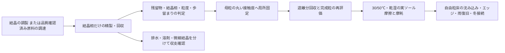

# 多方向探索 第111巡：結晶の精製と固定順序から残留物と費用を減らす
2026-10-10 / Codex。開始時 main: 88d4b41d0772a49c914ca7d576c34f76cbbc1c80。

**H110の微細結晶を接触部へ保持する案を、製造後の純度・洗浄損失・再生水まで検査した。今回の設計改善H111は「結晶相を先に精製・評価し、合格した相だけを母粒の接触部へ固定し、完成粒を再評価する」という順序である。条件付き計算では、完成粒全量の洗浄に比べて扱う水量を減らせる。ただし精製方法も固定方法も実証しておらず、雪の滑走感が得られたという成果ではない。**

[計算・資料一式](結晶精製の選択性と洗浄順序_20261010/README.md)／[Claudeへの検証依頼](結晶精製の選択性と洗浄順序_20261010/claude_handoff.md)。

47件の数式・収支・再計算確認、実物試験0件、成功確率null。設備・協力先は未確保。15％予測の実物試行母数は未確認で、今回の条件計算から90％超へ変更しない。

## 1. なぜ滑走材の研究で精製を調べるのか
雪らしい外形、結晶格子、滑走感は別である。接触部へ結晶を保持しても、製造由来の成分が雨で溶け出す、結晶自身が洗浄・摩擦で外れる、母粒に水が滞留するなら、夏と冬をつなぐ材料にならない。今回は「結晶が得られた」「中性にした」という工程記録を、屋外へ敷ける品質の証拠にしていないかを監査した。

既存台帳の第37巡の溶媒・大量洗浄評価、反応晶析と局部再生の理想段洗浄式、第110巡の結晶在庫を再利用した。新たに調べた点は、**不純物を除きながら有用結晶をどれだけ残せるか、そして精製を固定の前後どちらで行うか**である。旧計算の再実行だけを新しい発明とはしていない。

## 2. 特許の投入量は製品残留量ではない
[US12221403B2・Example 2-2](https://patents.google.com/patent/US12221403B2/en)には、メタノール・水・NaOHを用いる原料調製、冷却した酸側への晶析、pH7への調整、ろ過・乾燥が記載されている。明記されたNaOH 5.7gに対し回収結晶は36.0gであり、最終pH調整のNaOH量は記載値から決められない。

計算用の丸めた式量NaOH=40、Na=23g/molなら、記載投入分のNaは3.2775g、回収結晶1kgに対する工程投入量換算は約91.0gになる。**これは製品中に91.0g/kg残っているという意味ではない。** ろ液へ移る割合、追加投入、対イオン、製品残留量は未確認。結果JSONのNaCl相当量も帳簿上の換算にすぎず、NaClがその量生成・残留したという分析ではない。

したがって、pH7、白色結晶、ろ過済みという記録だけで、脱塩、溶剤除去、冬の接続、人体・環境適合を済ませたとは扱わない。母液と製品を別々に測って収支を閉じる。工場の低温・溶剤工程を、30℃以上での現場噴霧形成へ読み替えない。

## 3. 洗浄水の濃度ではなく、残った製品1kgあたりで判定する
一定の交換可能液量Hに洗浄水を加え、同量を排出する模型とした。洗浄量をD=追加水量/H、不純物の見かけ透過率をs、結晶側の見かけ透過率をp、入口水の不純物濃度/初期濃度をbとする。すべて今回の仮入力であり、LLや実フィルターの測定値ではない。

- 不純物濃度比：c=b/s+(1−b/s)exp(−sD)（s>0）。
- 結晶の残存質量比：y=exp(−pD)。
- 結晶1kgあたりの不純物比：q=c/y。

Hは交換可能な液相の量で、固相込みのタンク容量ではない。濃度と透過率もこの液相基準で定義する。メーカーの装置仕様をそのまま結晶スラリーへ代入していない。

清浄水ならq=exp[−(s−p)D]となる。結晶まで多く流出する場合、濃度cだけを見て洗浄完了とする計算は純度を過大評価する。メーカーの一次資料も、不純物と製品双方の保持・濃度、回収収支を測る考え方を示す。ただし生体分子向けの資料であり、本結晶の膜選定・保持率を保証しない。[Merck/Millipore UF/DF技術資料 pp.6–7](https://www.merckmillipore.com/deepweb/assets/sigmaaldrich/product/documents/264/166/an2700en-ms.pdf)

以下のq≤0.001は比較用の「1,000分の1」目標であり、健康・環境の許容残留量ではない。初期残留量自体が不明なので、この比だけで適合判定しない。

## 4. 洗浄回数より、分離の選択性が材料損失を決める
前巡の仮基準、仕上がり135tのうち結晶1.35tを使う。結晶1.35tを洗浄後に確保し、投入結晶1kgあたり保液0.5L、結晶価格2,000円/kgと仮置きした。水・排水・乾燥・検査・設備費は未取得。

| 不純物透過率s | 結晶透過率p | 必要D | 結晶歩留まり | 損失結晶 | 洗浄水 | 損失補充分だけの材料費 |
|---:|---:|---:|---:|---:|---:|---:|
| 1 | 0.001 | 6.915 | 99.31％ | 9.37kg | 4.70m³ | 約1.87万円 |
| 1 | 0.01 | 6.978 | 93.26％ | 97.56kg | 5.05m³ | 約19.51万円 |
| 0.5 | 0.001 | 13.843 | 98.63％ | 18.82kg | 9.47m³ | 約3.76万円 |
| 0.5 | 0.01 | 14.097 | 86.85％ | 204.38kg | 10.96m³ | 約40.88万円 |

同じ1,000分の1の診断目標でも、結晶を保持できなければコストが増える。表は一度の精製工程の感度計算で、年額でも見積でもない。損失結晶の再回収は見込んでいない。

清浄水模型では、診断目標q≤0.001と歩留まり99％以上を両立する条件は **p/s≤0.001453**。これは「結晶の透過を、不純物の透過に対して十分小さくする必要がある」という分離性能の条件であり、成功率99％ではない。実際の吸着・溶解・凝集・破砕・膜詰まりがあれば、この式だけで歩留まりは決まらない。

## 5. 水の再利用には、洗い続けても改善しない場合がある
入口水に汚れがあれば、液中濃度cはb/sへ近づく。一方、結晶の損失が続けば製品基準qは途中から増え得る。

例としてs=1、p=0.01、b=0.0009では、qの最小はD≈11.607で約0.001021。D=30では約0.001215へ増える。この仮例は診断目標0.001に届かない。水量追加ではなく、入口水を精製する、結晶保持を改善する、別の分離手段へ変更する対象になる。[式・仮定・解析範囲](結晶精製の選択性と洗浄順序_20261010/model.md)

**循環水であること自体を低コスト・無排水の証明にしない。** 不純物は濃縮排水・処理残渣・製品等のどこかへ移る。微細結晶の捕集と溶けた成分の除去を、同じ装置で達成できるとも仮定しない。

## 6. H111：結晶の品質を先に判定し、接触部へ後から固定する

品質確認済み原料の供給元・仕様書は未確保。図は調達や試作の実績ではない。固定工程が新たな残留物を持ち込めるため、精製済み結晶でも完成粒を再評価する。固定剤なしの機械的保持と裏側のみの固定を比較し、保持構造だけのUB対照を残す。

水量の順序比較を、**製品損失ゼロ、D=10という別の共通仮定**で行うと次のとおり。

| 精製する対象 | 質量 | 仮の保液 | 洗浄水 |
|---|---:|---:|---:|
| 固定前の結晶相 | 1,350kg | 0.5L/kg | 6.75m³ |
| 固定後の完成粒全量 | 135,000kg | 0.2L/kg | 270m³ |

この設定では40倍差が出るが、実必要水量や総費用40分の1の証明ではない。保液・透過率・固相の形態が異なるため、両工程が同じ純度へ到達するとも未確認。完成粒の方が結晶を保持しやすい可能性や、固定後に必要となる最終すすぎも比較に含める。表4の歩留まり補正済み水量と混同しない。

同じ総洗浄水10Hを使う理想模型では、1回の一括洗浄は不純物濃度比0.09091、5段洗浄は0.004115、連続置換は0.00004540。すべて製品損失なし、清浄水、理想混合の基準値。連続装置を最安と選定した結果ではない。

## 7. 目的へ戻すための判定順序と方向転換
H111は製造工程の改善仮説である。LL/C8を本命に固定せず、次の順で必要証拠を集める。

1. 精製前後の結晶相・形態、溶解成分・溶剤、回収各流の質量を測る。結晶の分子構造が残っていても、表面形態や摩擦は同じとはしない。
2. 第110巡のU0未処理、UB保持構造のみ、U1結晶保持、U2組成違いの対照を維持し、30/50℃・乾燥/規定湿潤/湿潤後乾燥で実スキー底面との摩擦、摩耗、移着を比較する。
3. 良い接触面が得られてから、自由粒床の沈み込み、エッジの切り始め・支持・抜け、荷重除去後の復帰を新雪圧雪対照で比較する。小片の摩擦だけで砂感・泥化懸念を解消したとはしない。
4. 雨・台風後は高さだけでなく、粒度・配合・結晶保持量・摩擦の復帰を確認する。流失物を斜面上方へ運べても、溶出や微粉化で失った組成は整地だけで戻らない。約60分の現地整地に工場精製を含めない。
5. 冬は雪→粒→床の力伝達、融解排水、滞水と弱面を測る。夏の低摩擦を冬の接続へ自動的に転用しない。

未実施の[確認仕様](結晶精製の選択性と洗浄順序_20261010/test_plan.json)を残した。発注・購入・第三者への照会は行っていない。

洗浄模型を細分化しても、実際のs、p、保液、初期残留物がなければ、これ以上の最適化は根拠が増えない。**この方向の数値精密化は新測定が得られるまで保留し、次は50℃での滑走接触と粒床の非線形な崩れ・復帰の両立へ戻る。** 分子結晶・鉱物・複合材・30℃以上の噴霧形成の別経路も閉じない。

50℃・人体/環境適合・冬接続は未検証。450mm床、300mm削れ代、約30°斜面、表面マット/ネット/ジオセル禁止、4〜5時間ごとの整地と約60分閉鎖を維持。油・塩・フッ素・シリコーン潤滑を採用しない。固形パラフィン例外は未回答。整地設備等2億円の暫定区分を変えておらず、今回の材料補充費だけで全体予算内とは判定しない。

Claude物性台帳のLF SHA256は054c9388de3be3bd251c395059a9e02c9d3b336885236683ba3f528ff819d71fで不変。GitHubで検証依頼を共有するが、Claudeの受領・返答・稼働は未確認。
