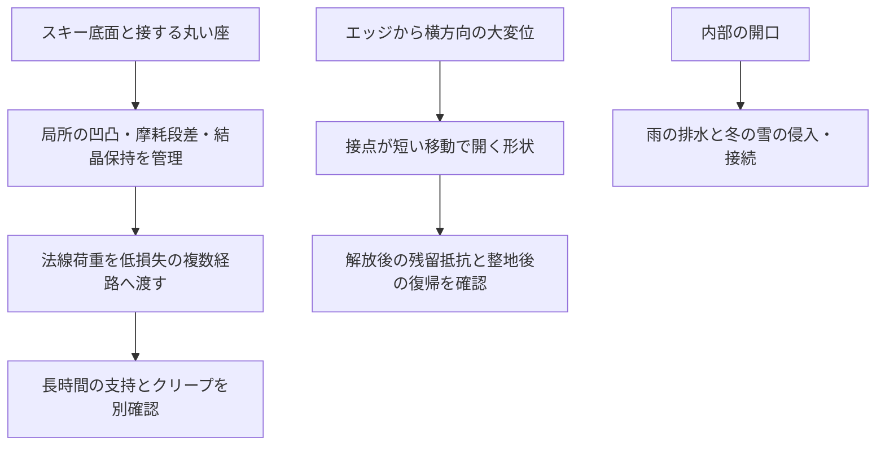

# 多方向探索 第112巡：滑走速度で変わる抵抗と雪らしい解放の分離
2026-10-10 / Codex。開始時main: e2496d299a0b37bc4f935bd2d2285e2959b3df23。

**今回は製造工程から滑走感へ戻り、材料の変形が遅れて戻ることで生じる抵抗を、滑走速度と接触部の凹凸の時間尺度に接続した。H112は、低損失の接触座・法線支持と、エッジで短く開く幾何構造を分け、さらに長時間荷重時の変形を別に制限する案。低い摩擦値を出す実材が完成したのではなく、静的な硬さだけでは選べなかった条件を具体化した。**

[計算・根拠](滑走速度と接触変形の時間尺度_20261010/README.md)／[Claudeへの検証依頼](滑走速度と接触変形の時間尺度_20261010/claude_handoff.md)。

4種類の仮の応答×4速度×3凹凸間隔×2振幅比の96条件。独立の時間領域計算も含む122件の数値確認を実施した。物理試験0件、成功確率null。設備・協力先は未確保。計算通過数を15％から90％への実証改善に数えない。

## 1. 既存研究から追加した範囲
第108巡は法線の載荷・除荷仕事を扱ったが、速度は仕事率への換算にしか用いていなかった。第71巡は接点数・圧力分布と指定した横運動の仕事を調べたが、材料の粘弾性による速度依存を同定していなかった。今回その不足を、単一の変形モードの模型で調べる。

粗い相手面が材料を繰り返し変形させ、内部の損失が摩擦抵抗へ寄与する仕組みは、研究機関の一次説明でも扱われている。ただしゴムと粗面についての説明であり、LL結晶、PE/PHA粒、スキー床の実測値ではない。[Forschungszentrum Jülich：摩擦研究](https://www.fz-juelich.de/en/pgi/pgi-1/research/friction-and-crack)

雪を使った実スキーの研究では、速度だけでなく反復通過に伴って摩擦が変化し、測定装置の振動や慣性も測定誤差へ影響している。平均値が低い一回だけを合格にせず、初回・反復・復旧後を区別する根拠として使う。[Haslerら、2016](https://link.springer.com/article/10.1007/s11249-016-0719-2)

## 2. 0.5〜3mmの凹凸でも、変形は短時間になる
速度vで、進行方向の間隔λをもつ凹凸を通過すると、指定した正弦変形の周波数はf=v/λとなる。

| 仮の凹凸間隔 | 2m/s | 5m/s | 20m/s |
|---|---:|---:|---:|
| 0.5mm | 4,000Hz | 10,000Hz | 40,000Hz |
| 1mm | 2,000Hz | 5,000Hz | 20,000Hz |
| 3mm | 約667Hz | 約1,667Hz | 約6,667Hz |

これは**局所の入力時間尺度**であり、粒径そのもの、実測された表面の間隔、スキー全体や人が振動する周波数ではない。板・粒・ブーツの動的応答と実際の接点交代は別に必要になる。今回の範囲では周期25µs〜1.5ms。

したがって、50℃で数時間保持したクリープ、低周波で押した硬さ、室温の弾性率を、そのまま滑走中の損失へ代入しない。温度・水分・変形速度・ひずみ振幅を合わせた複素応答が必要になる。単一の温度換算則を全ての結晶/複合材へ当てはめてもいない。

## 3. 同じ静的硬さでも、滑走抵抗は同じにならない
仮の標準線形固体を用いる。十分時間がたった剛性をk0、短時間に追加される剛性をΔk、緩和時間をτとする。x=2πfτなら、

- 保存剛性k′=k0+Δk x²/(1+x²)
- 損失剛性k″=Δk x/(1+x²)
- 変形z=A sin(2πft)の一周期の損失仕事=πk″A²
- この変形による平均抵抗=πk″A²/λ

剛性kの単位はN/mであり、材料のヤング率ではない。独立した一つの等価変形モードを表す。界面をこする抵抗、粒の破壊・並べ替え、水、衝突、板の振動損失を含む総摩擦係数ではない。第108巡の損失と重複がない証明もないため、単純加算しない。

仮の共通条件を、法線荷重700N、k0=1MN/m、Δk=9MN/m、速度5m/s、λ=1mm、変形振幅A=30µmとした。いずれも対象材の測定値ではない。

| 仮の応答 | 緩和時間τ | 5kHzでの保存剛性 | 変形による抵抗のみ | 荷重で割った追加抵抗比 |
|---|---:|---:|---:|---:|
| 理想弾性対照 | 損失相なし | 1.000MN/m | 0N | 0 |
| 速く緩和する | 1µs | 1.009MN/m | 0.799N | 0.00114 |
| 中間の緩和 | 0.1ms | 9.172MN/m | 7.355N | 0.01051 |
| 遅く緩和する | 10ms | 10.000MN/m | 0.0810N | 0.000116 |

理想弾性で0なのは、この項の散逸だけ。摩擦なしで滑れることを意味しない。最後の案も、数値が小さいという理由で材質として採用しない。高速時には約10倍の支持剛性となり、砂のような硬さや反発を増やす可能性を別に調べる。

## 4. 滑走時の硬さを揃えると、長時間支持との交換条件が見える
前表の比較は動的な硬さが異なる。そこで5kHzの保存剛性を全案1MN/mへ揃えるよう、k0とΔkを同じ割合で縮小して比較し直した。

| 応答 | 変形抵抗のみ | 700Nを十分長く保持したときの模型上の変位 |
|---|---:|---:|
| 理想弾性対照 | 0N | 0.700mm |
| τ=1µs | 0.792N | 0.706mm |
| τ=0.1ms | 0.802N | 6.420mm |
| τ=10ms | 0.00810N | 7.000mm |

これは荷重保持された単一ばねの平衡変位で、実際のスキーの沈み込みを予測した値ではない。元の模型では全案0.700mmだった平衡変位が、動的硬さを揃える調整で変わった点が重要になる。

**「高速で硬く、損失が小さい材料」を選ぶだけでは、停車・整地・夏の長時間荷重まで同時に満たせない。** 法線支持を受ける低損失の経路と、横方向に開く部分を構造で分け、クリープ・滞留・接触圧力まで評価する。

## 5. 凹凸を増やす方向と減らす方向を使い分ける
この指定変形模型では、同じλ・応答でAが2倍になると、変形抵抗は4倍、法線力の振幅は2倍になる。結晶の粗い突起、保持座の縁、摩耗後の段差を「雪に似た外見だから良い」として増やすと、追加損失や接触離脱を招く可能性がある。

逆に接触部の有効な凹凸を小さくする方向は比較価値があるが、全面を平滑にする処方ではない。凝着や実接触面積、粒間の保持、冬の雪の入り方まで変わるため、ここで計算した一項の低下を総摩擦の低下へ置き換えない。

96条件のうち6条件は、慣性なしの法線力計算ですら最低接触力が負になる。これらは連続接触の仮定を満たさない参考行として保存し、合格案に数えない。残りも実際の接触を保証しない。慣性・接点交代・粒の自由回転・多点荷重を含めていないためである。

## 6. H112として具体的に変えるところ

図は機能配置の仮説で、製作済みの一体形状ではない。H109の多方向支持、H110/111の局所結晶保持・先精製、既存の横解放と組み合わせる。今回の更新は、接触座の凹凸と材料の時間応答に仕様を追加し、動的硬さを揃えた比較へ修正した点にある。

比較する切り口は次の三つ。

| 切り口 | 狙い | 採用前に反証する点 |
|---|---|---|
| 接触座の微細形状を整える | 底面との余分な周期変形を減らす | 凝着・接触面積・傷・摩耗で総抵抗が増えないか |
| 支持経路を低損失にする | 微小法線変形で熱に逃がす仕事を減らす | 高速時の硬さ、長時間支持、跳ね返り、局所接触圧 |
| 横解放を形状で担う | 材料全体を高損失で柔らかくせず、エッジで短く開く | 荷重下でも開けるか、ばね状に戻り過ぎないか、溝が再整地できるか |

結晶相・高分子骨格・保持相のどれが各応答を担うかは、同条件の測定が得られるまで固定しない。LL/C8、PE系、PHA系などの既存候補の実物特性へ、この仮のτやkを割り当ててはいない。鉱物・分子結晶・複合材・30℃以上の噴霧形成も別方向として継続する。結晶格子、雪のような外形、雪の滑走感を別々に判定する。

## 7. 微細加工の費用はコース面積だけで決めない
第110巡の仮在庫をそのまま使う。母粒133,650kg、被覆可能面積10m²/kg、接触座への対象割合20％なら、対象となる機能面積は267,300m²となる。

| 機能面積あたりの仮加工単価 | 一度の加工費だけ |
|---|---:|
| 0.1円/m² | 26,730円 |
| 1円/m² | 267,300円 |
| 10円/m² | 2,673,000円 |

全て価格感度であり、業者見積ではない。この面積は小粒の表面を合算した値で、コース面積や連続シートの生産面積ではない。多数の小粒の接触座を選択して加工できる設備、処理速度、歩留まりは未確認。固定・検査・回収・交換・材料費も含まない。

経済面では、完成粒を一粒ずつ磨く工程の追加より、成形時に接触座の形を作り込めるかを比較する。ただし既存の微細形状を安く同時成形できる証拠はまだない。整地設備等2億円枠を、今回の加工費だけで達成したとは判定しない。

## 8. 実証へ渡す仕様と次の探索
最初に必要なのは、30/50℃、乾燥・規定湿潤・湿潤後乾燥の同じ材料について、実接触部の形状と時間応答を対応づけるデータである。測定できる周波数帯を明示し、足りない帯域を無条件に外挿しない。

その上で実スキー底面を使い、初回からの力履歴、複数速度、停止再始動、反復通過、整地・濡れ乾き後を比較する。滑走時の平均摩擦に加え、摩耗・移着、法線/接線の変動、粒床の沈み込みとエッジの切り始め・支持・抜けを新雪圧雪対照へ合わせる。測定系の振動を材料のザラつきと取り違えない。未実施の[確認仕様](滑走速度と接触変形の時間尺度_20261010/test_plan.json)を保存した。

今後は、この仮のばね模型の条件数だけを増やさず、**候補材料の測定された時間応答と、自由粒の接点が開く運動を結び付ける証拠**を優先する。資料が別の相手材や室温の結果しか持たない場合、50℃の雪状滑走の合格値へ換算しない。

雨後は高さに加えて表面形状・配合・保持量・摩擦の復帰、冬は雪→粒→床の接続と滞水/弱面を確認する。450mm床、300mm削れ代、約30°斜面、4〜5時間ごとの整地と約60分閉鎖、滑走面のマット等禁止を維持。油・塩・フッ素・シリコーン潤滑を採用しない。人体・環境適合、固形パラフィン例外、全体費用の未確定事項を勝手に合格へ変更しない。

Claude物性台帳は前巡と同じLF SHA256（054c9388de3be3bd251c395059a9e02c9d3b336885236683ba3f528ff819d71f）。新たな実測更新は確認されていない。公開共有するが、受領・返答・稼働は未確認。
