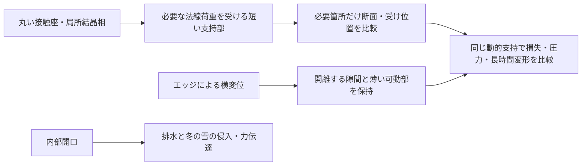

# 多方向探索 第113巡：50℃の実測物性から支持と滑走損失を分ける
2026-10-10 / Codex。開始時main: bfb86133b0250d8826ccc630341cb6b2a26ba831。

**UHMWPEの標準試料を30℃・50℃で同じ方法により測った一次資料を追加した。1Hzの実測値を使うと、50℃で支持剛性を戻すための増厚は、同じ変位振幅に対する変形損失も増やす。一方、この1Hzの値だけでは滑走に対応する高周波応答を一意に決められない。H113は、全面増量ではなく、必要な法線支持部の局所補強・短い受けと、横解放部を分けて比較する設計更新である。**

[実測値の転記・計算一式](実測動的物性と高周波推定の識別_20261010/README.md)／[Claudeへの検証依頼](実測動的物性と高周波推定の識別_20261010/claude_handoff.md)。

外部資料には実測があるが、本プロジェクトの物理試験は0件。設備・協力先未確保、success_probability=null。53件の数値確認は実験成功数ではなく、成功率15％→90％の根拠にはしない。

## 1. 今回確認できた実測値
TA Instrumentsの報告は、NIST SRM 8456 UHMWPEの動的測定を扱っている。条件は三点曲げ、1Hz、昇温3℃/分、報告振幅25µm・ひずみ0.03％。表1のうち今回の比較に用いる値は次のとおり。[一次資料、方法p.2・表1 p.4](https://www.tainstruments.com/pdf/literature/TA328.pdf)

| 温度 | 保存弾性率E′ | 損失弾性率E″ | E″/E′（今回計算） |
|---|---:|---:|---:|
| 30℃ | 1,076±68MPa | 76±12MPa | 0.0706 |
| 50℃ | 748±94MPa | 93±18MPa | 0.1243 |

これはメーカーが報告した特定試料のDMA値であり、50℃の値をNISTの認証済みDMA値とは表現しない。表の±は原記載のまま残し、95％信頼区間や設計安全率へ変更しない。湿潤条件は確認できていない。TIVAR1000、ISOSPORTの実ソール、成形した微細枝、LL/C8保持粒の値へも移植しない。

表の中心値で、50℃/30℃のE′比は0.6952。E″/E′は約1.760倍となる。±の端を単純に組み合わせたE′比は0.572〜0.835だが、これは算術上の端点比較で、確率区間ではない。[転記入力と適用範囲](実測動的物性と高周波推定の識別_20261010/measured_inputs.json)

実測から得た前進は、「耐熱温度や融点が高いから低損失」という選び方をやめ、**温度による支持と損失の変化を別に扱う具体値**を得たことである。

## 2. 50℃で硬さを戻す三つの方法と交換条件
同じ材料、1Hz、小変形、同じ境界条件の曲げ部材を仮定する。剛性は幾何係数CとE′の積。中央値を用いて30℃の保存剛性へ戻す条件を比較した。

| 方法 | 必要な比 | 材料・形状への影響 |
|---|---:|---|
| 円形枝の半径を増す | 半径1.0952倍 | 同じ長さの該当枝の体積1.1994倍 |
| 有効に曲がる長さを短くする | 長さ0.8859倍 | 受けを置く等の形状変更。全粒の質量減を意味しない |
| 同じ枝の支持経路を並列に増す | 有効本数1.4385倍 | 連続量としての剛性比。実際の整数本数・配向は別設計 |

これらは実粒の製作寸法ではない。特定の試料から得た低周波のE′を、単純な梁関係へ入れた条件計算である。粒の回転、支持位置、接触圧力、大変形、座屈、クリープ、加工公差を未評価のまま形を決定しない。

とくに半径を増す方法は、開口・排水路・横に逃げる隙間を狭め得る。短い受けは、支持を戻してもエッジによる開離距離を変え得る。支持経路を増す方法は、多方向の拘束を強めて砂状の硬さを作らないか調べる。

## 3. 同じ材料を幾何で硬くしても、損失角は改善しない
同じ一様な材料の線形曲げでは、k′=C E′、k″=C E″となる。断面を太くする等でCを変えても、比k″/k′=E″/E′は変わらない。

50℃で保存剛性k′を30℃と同じに戻すと、損失剛性k″の比は

```text
(E″50/E′50) ÷ (E″30/E′30) = 1.7603
```

となる。**同じ1Hz・同じ変位振幅なら、周期の変形損失も約1.76倍**になる。これはスキーの総摩擦が1.76倍、体感が1.76倍悪化するという意味ではない。力を一定に与える比較とも条件が違う。

したがって、増厚だけで「支え」と「軽い滑り」を同時に改善したとは言えない。材料相、荷重経路、接触座、横開離の幾何を分けて比較する。複数材料・接触の切替・慣性を含む構造一般について、幾何で損失を変えられないと断言したものでもない。

## 4. 実測1点に合うだけの高周波予測を採用しない
前巡は仮の緩和時間を置いた。今回は、50℃・1Hzの実測E′=748MPa、E″=93MPaに正確に一致する、正の係数を持つ三つの標準線形固体（SLS）を構成した。

| 同じ1Hz実測へ一致する数学的な模型 | 平衡弾性率E0 | 緩和時間τ | 5kHzのE″予測 |
|---|---:|---:|---:|
| A | 738.7MPa | 0.01592s | 1.8786MPa |
| B | 655MPa | 0.15915s | 0.03720MPa |
| C | 283MPa | 0.79577s | 0.01934MPa |

3つは同じ1Hzの値を再現するが、5kHzの損失予測は最大/最小で約97.1倍違う。**これは実材料のばらつきや信頼区間ではなく、入力だけでは模型を決められない反例**である。いずれも当該UHMWPEを高周波で再現した模型とは認めていない。

導出はx=2πf0τを自由に選び、E0=E′0−E″0 x、ΔE=E″0(1+x²)/xとする。0<x<E′0/E″0なら正の平衡弾性率を保ち、一つの複素測定値へ一致できる。[導出・別形式による照合](実測動的物性と高周波推定の識別_20261010/model.md)

温度を変えた1Hzの表を、同じ50℃で周波数を変えたデータとして扱わない。温度の異なる値を横にずらす場合も、その材料・相構造・含水状態で換算が成立する証拠が必要になる。1Hzでの温度に対する損失の山から、周波数に対する緩和時間を一意に決めてもいない。

## 5. 別の低摩擦資料との条件比較
今回見つかったUHMWPEの水・塩水潤滑の論文は、抄録の段階で約150〜170mL/hの滴下条件を明記している。未飽和潤滑という言葉を、給水不要で乾燥しても低摩擦という意味にはしない。本文の一部取得が失敗しているため、相手材・全温度条件等の未確認事項を補っていない。[Liら、2022、一次論文の公開抄録](https://pubmed.ncbi.nlm.nih.gov/36236086/)

| 経路 | 今回使える根拠 | そのまま目的へ転用できない部分 |
|---|---|---|
| UHMWPE系の支持部 | 特定試料の30/50℃・1Hzの動的物性 | 湿潤、微細枝、実ソールとの摩擦、高周波 |
| 水を使う低摩擦接点 | 水の供給条件を伴う別の摩擦研究 | 常時給水不可、50℃乾燥、初回の短時間接触、冬への接続 |
| LL/C8等の局所結晶相 | 第110/111巡の製造・保持・精製の評価 | 実ソール50℃の摩擦・摩耗と、同条件の動的物性は未取得 |

この表は比較可能性の整理であり、同じ試験で材料順位を決めた結果ではない。塩水潤滑は本計画へ採用しない。水和相も結晶相も、UHMWPEの表へ混ぜて架空の最良材を作らない。

## 6. H113：必要な支持部を補い、横解放部を太らせない
今回の更新案は、既存の開放粒・局所接触座に対して次のように役割を分けること。



これは機能配置の提案であり、実製作・新規性調査済みの発明ではない。半径1.0952倍を全ての枝へ適用する設計を採用していない。H109の多方向支持、H110/111の接触相の局所保持、H112の時間尺度評価と接続し、有限変位での横解放を壊さない範囲を検査する。

材料が均一な一つの梁なら前節の損失比は変わらない。H113の狙いは、荷重を受ける場所と大きく動く場所を区別して、不要な材料増量・拘束を避けること。必要な材料相の実測がないまま、構造を描けば低摩擦と安全が成立するとしない。

## 7. 全面増厚と局所補強の追加材料費
前巡群の仮基準である母粒133,650kgを使い、半径補償の対象となる曲げ部材が母粒重量の10％/30％/100％だと仮定する。該当部分のみ材料量が1.1994倍になる場合を計算した。

| 対象部分の仮重量割合 | 追加材料 | 仮500円/kgの場合 | 仮2,000円/kgの場合 |
|---|---:|---:|---:|
| 10％ | 約2.66t | 約133万円 | 約533万円 |
| 30％ | 約7.99t | 約400万円 | 約1,599万円 |
| 100％ | 約26.65t | 約1,332万円 | 約5,329万円 |

価格・対象割合は未測定の感度入力。特定グレードの見積、年額、総事業費ではない。成形、受けの追加、接着、検査、排水、回収、交換は含まない。短い受けの案で全体の材料費が減るとも計算していない。

この物量差を踏まえ、補強が必要な箇所を同定する価値がある。ただし10％だけで支えられるという根拠はまだなく、軽い仮定を採用して予算を合わせない。整地設備等2億円枠と材料費の暫定区分を維持する。

## 8. 次に必要な証拠
同じ材料・製法・含水状態の30/50℃で、まず1/10/100Hz等の複数周波数とひずみ振幅の依存を確認し、対応できる実測帯域を記録する。これら3周波数が揃えば高周波外挿が必ず正しくなるという設計ではない。複数緩和や接触離脱があれば別の構成則を要する。滑走に必要な帯域までの測定または検証済みの換算が必要になる。

同時に、接触座の実ソール摩擦・摩耗・移着、自由粒床の沈み込み、エッジ支持と短い解放、雨後の配合・表面・滑走感の回復を結び付ける。冬は雪→粒→床の力伝達と融解排水を確認する。[未実施の確認仕様](実測動的物性と高周波推定の識別_20261010/test_plan.json)

本巡は、1Hzの実測値を得たことを、高周波の予測・50℃滑走・人体/環境適合の完了へ拡張しない。温暖噴霧形成、分子結晶・鉱物・複合材の探索を維持し、材料限界が明確になれば別経路へ移る。

450mm床、300mm削れ代、約30°斜面、4〜5時間整地・約60分閉鎖、滑走面のマット等禁止を維持。油・塩・フッ素・シリコーン潤滑を使わず、固形パラフィン例外は未回答のまま。発注・購入・外部機関への照会は行っていない。

Claude物性台帳のLF SHA256は前巡と不変（054c9388de3be3bd251c395059a9e02c9d3b336885236683ba3f528ff819d71f）。公開共有するが、Claudeの受領・返答・稼働は未確認。
