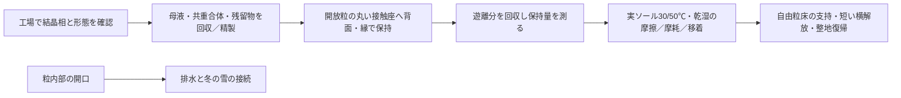

# 多方向探索 第114巡：グアニン板状結晶を少量接触相として比較する
2026-10-10 / Codex。開始時main: 8f353ee01499a9c3e6e5d9e99bd4c9907e498809。

**既存台帳にないグアニン系の分子結晶を追加調査した。板状の結晶を作った一次研究は存在するが、それは雪の滑走性能の証明ではない。今回の設計案H114は、開放粒の骨格全量を置き換えず、丸い接触座に保持する少量の結晶相として、LL系と同条件で比較するもの。晶析液が希薄なこと、薄板の保持・回収・摩耗が未解決であることを物量へ落とし込んだ。**

[入力・計算・出典](生体分子結晶の接触相と製造物量_20261010/README.md)／[Claudeへの検証依頼](生体分子結晶の接触相と製造物量_20261010/claude_handoff.md)。

実物試験0件、success_probability=null。設備・協力先未確保。候補追加と算術確認を成功率90％へ換算しない。前巡の仮ばねを増やす方向から、別の分子結晶と形成方法へ探索を広げた。

## 1. 実在する板状結晶と、まだない滑走証拠
RSCの一次論文は、水系・共重合体添加・アンモニア揮発を用いたβ型無水グアニンの双晶板を報告する。抄録の長さは約2µm、板全体の厚さは42±3nm。これは単なる樹脂ペレットを「結晶」と呼んだものではなく、結晶相と外形を報告した研究である。[Guoら、2023](https://pubs.rsc.org/en/content/articlelanding/2023/ce/d3ce00063j/unauth)

ただし、薄い板という外形も、分子の積層も、実スキー底面との低摩擦を保証しない。発表の主な評価は光学用途であり、50℃・湿潤・摩耗・エッジの応答を本計画へ移植しない。42nmは内部の複数層を含む板全体の厚さで、内部層の数をもう一度掛けて水増ししない。

別の「弾性的に曲がるグアニン系結晶」の一次論文は、グアニニウム塩化物二水和物等を対象にしている。これを中性の無水グアニンへ読み替えて「柔らかく戻る」とはしない。本計画の潤滑塩として採用もしない。[対象物質を区別する資料](https://doi.org/10.1021/acs.cgd.3c01003)

## 2. 中性pHの形成経路と、組成を変える方向
2025年の一次研究は、酵素によるグアノシンからグアニンへの変換を利用し、中性pHでの結晶形成を報告している。公開された本文・補足の検索可視部分には、リン酸緩衝液を用いる条件がある。強いpH変更だけに依存しない研究経路として注目するが、本巡で全文の詳細方法・全条件は照合できていない。[Tah Royら、2025](https://pubs.acs.org/doi/10.1021/acs.cgd.5c00205)

これを30℃以上の空中噴霧、短時間の現地補充、50℃の運転へ転用しない。酵素、緩衝成分、残留物、回収と費用を含む工場工程として比較する。標準材料一覧にある薬品を、全て同じ製造液へ投入しているとも推測しない。

また、生体由来のグアニン結晶が、グアニン・ヒポキサンチン等の固溶体になり得ることを示す一次研究がある。これは組成と結晶相を組み合わせる別の発明方向だが、添加すれば滑り・強度・安全性が改善するという証拠ではない。[Pinskら、2022](https://pubmed.ncbi.nlm.nih.gov/35255213/)

今回は、中性無水結晶、混合分子結晶、塩の結晶を区別した。天然物や核酸に関連する物質という説明を、吸入・摩耗物・排水の無害性の保証には使わない。

## 3. 希薄な晶析条件を、そのまま大量製造へ拡大しない
2023年論文の公開補足図S3には、グアニン0.66/1.32/1.98mMや共重合体濃度を変えた比較がある。本巡は0.66mM、共重合体1mg/mLを物量比較の基準に使う。これらは初期濃度であり、溶解度、収率、最適処方ではない。濃度変更で同じ板形状が得られるとも仮定しない。[公開補足 p.3](https://www.rsc.org/suppdata/d3/ce/d3ce00063j/d3ce00063j2.pdf)

計算用の丸めた分子量151.13g/molを置くと、0.66mMの初期グアニンは約0.09975kg/m³となる。前巡群の仮の結晶在庫1,350kgを、損失なしで得るだけでも、単回仕込みに換算した液量は約13,534m³になる。

共重合体1mg/mLを同じ液量へ使うなら、投入量は約13.53t。これは結晶に13.53t残るという意味ではなく、回収・洗浄・再使用先を決める必要がある工程投入量である。晶析収率を50％と仮定すれば必要仕込み量は2倍になる。

**この液量は累積の仕込み換算量であり、新水使用量、同時に必要なタンク容量、屋外散水量ではない。** 液を再使用する場合も不純物・添加剤・結晶形態の変化を別に確認する。第111巡の精製・製品損失の収支へ接続する。

補足には時間を変えた比較もあり、瞬間の噴霧で要求形状が完成する証明にはならない。本文の温度や最適条件を、レビューの記述だけで確定していない。

## 4. 少量の接触相に限定すると、必要物量を別の桁で比較できる
第110巡の仮基準を再利用する。母粒133,650kg、外部面積10m²/kg、その20％を接触相の対象とすれば、機能面積は267,300m²。

ここへ板全体の厚さ42nmに相当する一層分を置く、という体積換算を行った。密度は本巡で実測・同定できていないため、1,800/2,200kg/m³を仮入力とする。配置歩留まりも50/100％、重なりは板全体を1/3枚分という比較条件である。

| 仮の構成 | 保持したい結晶量 | 製造すべき結晶量 |
|---|---:|---:|
| 密度1,800・一層相当・配置100％ | 約20.21kg | 約20.21kg |
| 同じ一層相当・配置50％ | 約20.21kg | 約40.42kg |
| 密度1,800・三層相当・配置50％ | 約60.62kg | 約121.25kg |

一層相当20.21kgでも、0.66mM・晶析収率100％では仕込み液約203m³となる。薄くすることは比較に値するが、少量だから製造負担が無視できるとはしない。配置歩留まりと晶析収率は別で、両方が50％なら、保持したい質量に対する投入負担は4倍になる。

表は体積換算であり、粒の上に隙間のない単層が実際にできるという意味ではない。板の傾き、重なり、端面、凹凸、固定層、押込み・剥離・移着を含んでいない。最も薄い数字を採用して、摩耗寿命や価格を都合よく低く見積もらない。

## 5. H114の構成と比較対象

比較は、保持構造のみ、既存LL系、グアニン系の三つを同じ母粒・接触座で行う。結晶そのものが露出する面と、保持材が覆う面を区別する。グアニン粉末を斜面へ自由散布する方式は、雪状滑走・回収・安全の根拠を欠いたまま採用しない。

H114の具体的な追加点は、LLとは異なる中性分子結晶と形成経路を、保持接触相として比較対象へ入れたこと。工場で一度結晶化させ、精製した後に保持する順序を用いる。常温噴霧形成という最優先目標は維持するが、この案が達成したとは扱わない。

板がきれいに反射しても、滑走抵抗や夏の表面温度が改善するとは計算していない。どのような光学効果があっても、表面約50℃での性能確認を省かない。

## 6. 費用と採否を決める順序
原料の業者価格、酵素価格、晶析・洗浄・保持・回収の処理費、寿命は未取得であり、総価格は算出しない。先に次を確認する。

1. 中性の目的結晶相か。混合相・塩・添加剤残留を分析して区別する。
2. 実ソールに対する初回の摩擦が改善し、短い摩擦履歴で結晶が移着・消失しないか。
3. 50℃と濡れ乾きで形態・保持・摩擦が維持されるか。
4. 同じ材料量のLL系、保持構造だけの対照と比べ、追加工程を払う価値があるか。
5. 量産時の濃度・収率・配置歩留まりを確認し、回収・補充・洗浄を含む年額へする。

薄層が一回の滑走で失われるなら、初期材料費が小さくても採用しない。摩耗物と排水を分けて回収し、人・自然への影響を完成粒・添加剤・摩耗物ごとに確認する。雨後に山側へ材料を戻せても、失われた結晶相や組成は整地だけでは戻らない。冬は雪→粒→床の固着と排水を測る。

形状・結晶相・スキー感覚・安全・採算を別々に判定する[未実施仕様](生体分子結晶の接触相と製造物量_20261010/test_plan.json)を残した。少量の接触相で改善が見られなければ、骨格材や別の形成原理へ移り、この結晶へ固執しない。

450mm床、300mm削れ代、約30°斜面、4〜5時間整地・約60分閉鎖、表面マット等禁止、油・塩・フッ素・シリコーン潤滑禁止を維持。整地設備等2億円枠を、本巡の仕込み物量だけで満たしたとはしていない。

Claude物性台帳は前巡と不変。成果と検証依頼をGitHubで共有するが、受領・返答・稼働は未確認。
