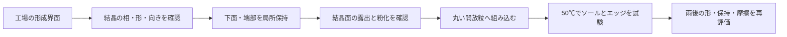

# 多方向探索 第116巡：結晶の形づくりと滑走面への保持を分ける
2026-10-10 / Codex。開始時main: 2a3f1496c0467378496d5df161d359402e761ca8。

**生体の薄板形成を支える足場の一次研究を追加した。一方、足場の化学組成・働きが全て解明されているわけではなく、同じものを量産できる処方ではない。本巡のH116は、工場での結晶形成用の足場と、スキーが触れる完成粒の保持構造を分ける設計である。薄板を少量使えば安く滑るという仮定を、露出・傾き・加工歩留まりから再点検した。**

[出典・再現計算](結晶足場と露出保持の幾何条件_20261010/README.md)／[Claudeへの検証依頼](結晶足場と露出保持の幾何条件_20261010/claude_handoff.md)。
自分たちの実物試験0。設備・協力先なし。成功確率null。30幾何条件と91数値確認は、接触・摩擦・安全の実証ではない。

## 1. 一次研究から借りられる原理と、借りられない性能
2022年のゼブラフィッシュ研究では、先にある繊維状足場に薄い結晶片が形成され、配向・合体する過程が示される。初期結晶は外周膜から離れて形成されるため、外周の狭さだけで形が決まる説明では足りない。本巡は一次本文の検索可視部分を照合した。全実験手順の再確認ではない。[Eyalら、2022](https://doi.org/10.1021/jacs.2c11136)

2023年のホタテ研究では、分子シートと結晶の形・向きの関係が報告される。ただし著者自身が、シートの化学組成、核形成機構の詳細、静止電子像から決められる因果の限界を述べている。該当する本文・Discussionをサーバーで取得して照合した。既知の安価な樹脂膜へ置き換えれば同じ効果が出るとはしない。[Wagnerら、2023](https://www.nature.com/articles/s41467-023-35894-6)

2020年のカイアシ類研究には、キチン系の区画とグアニン板の配列がある。一方、十分な水で結晶を溶かして枠を観察しており、乾燥による区画の収縮も記述される。生体内で板が整列していることは、屋外乾湿条件の寸法安定性や耐水性の証明ではない。本文の構造観察・実験方法を照合した。[Kimuraら、2020](https://pmc.ncbi.nlm.nih.gov/articles/PMC7010661/)

いずれも目的は主に光学機能の理解。スキー摩擦、摩耗、人体・環境安全、現地噴霧の成立を報告した論文として扱わない。観察用薬品を製品処方へ取り込まず、生体のタンパク質やキチンをそのまま採用しない。

## 2. 「作る足場」と「保持する足場」は別の仕事
生体原理から得た設計仮説は、分子を配向させる工場内の界面と、使用時に結晶を脱落させない支持部を別設計すること。

- 形成側：局所の界面と供給速度を制御して、形・相・向きをそろえられるか調べる。
- 使用側：結晶の下面または端部を保持し、ソールが触れる面を実際に露出させる。
- 粒床側：丸い開放枝、空隙、粒同士の接点で沈み・横支持・解放を作る。

全体を連続被膜で覆えば保持できても、ソールが触れるのは被膜となる。その方式を使うなら、被膜自体を滑走材料として評価する必要があり、内部結晶の低摩擦を理由にできない。逆に露出させた結晶が抜けて粉になるなら、保持に失敗している。どちらも同時に測る。

これは滑走面にシートやネットを敷く案ではない。形成用の工場治具や、個々の粒の局所保持部を検討する。連続マットを滑走面にする方法は採らない。

## 3. 薄板はわずかな傾きで高さが変わる
第114巡で照合した別の合成研究の長さ2µm・全厚42nmを、幾何の比較尺度だけに再利用する。今回の生体足場や第115巡の酵素法から、この寸法が作れるという意味ではない。

平板の長手方向を角度θだけ傾けた断面の上下寸法は、H=L sinθ+t cosθ。板の最下点を周囲よりd深く配置し、周囲の保持縁がr上がれば、突出高さはh=H−d−rとなる。

| 傾き | 板断面の上下寸法H | 広い面の水平投影比 |
|---|---:|---:|
| 0度 | 42.00nm | 1.00000 |
| 2度 | 111.77nm | 0.99939 |
| 5度 | 216.15nm | 0.99619 |

面積の投影比はほとんど変わらなくても、突出高さは大きく変わる。被覆面積だけの検査では、先端の突出や接触材料の変化を見落とす。

平置きの42nm板を最下点50nmの深さへ埋めれば、上端は周囲より8nm低い。深さ20nmでも、周囲の保持部が仮に30nm上がれば同じく8nm低くなる。30nmは測定した膨潤値ではなく、製造・乾湿変化への感度を示す入力である。

ここで「露出あり」は幾何的に上端が出ているという意味だけ。荷重を受ける面積、ソールの変形、鋭さ、摩擦、傷付きや人体への安全は計算していない。周囲より低い面も柔らかいソールなら触れる可能性があるため、非接触の物理的証明にも使わない。

## 4. 寸法ばらつきと経済性をつなぐ
仮の比較条件として、突出高さを0より大きく100nm以下に収めるとする。100nmは試験設計用の仮上限で、滑走や安全に必要と実証した値ではない。

高さの誤差が±δなら、名目高さはδより大きく、100−δ以下でなければ全範囲を満たせない。δ=30nmなら名目30超〜70nmの範囲があるが、δ=50nmなら範囲が消える。この計算は加工の実力値を与えない。実際の凹凸・濡れ変形・傾き分布を測って上限も含めて見直す。

次に、第114巡の20.20788kgという保持量を質量予算だけとして使う。仮に形状・保持条件を満たす製品への分配割合yを20％と置くと、累積適用工程量は約101.04kg、再加工対象は約80.83kgとなる。これは予測歩留まりではなく、加工費を見落とさないための条件計算である。

再加工対象の80％を性能を損なわず回収できると仮定した定常収支なら、新規投入は約36.37kg、最終損失は約16.17kg。ただし累積工程量約101.04kgは減らない。初回立上げ在庫、循環待ち時間、洗浄、乾燥、品質検査、再利用での形態劣化は別である。

一般式は、適用工程量M/y、新規投入M+(M(1−y)/y)×(1−r)。rは実際に再利用できる回収割合。単なる回収質量がrではない。料金を新規原料だけに掛けず、適用・回収・再処理の通過量にも掛ける。単価・実歩留まり未取得であり、設備2億円や安価な運営を達成した試算ではない。

## 5. H116の具体的な比較構成

比較は4系統に抑える。

| 系統 | 調べる問い | 選別の根拠 |
|---|---|---|
| A：局所保持構造のみ | 保持材だけで滑っているのではないか | 同じ形・同じ母粒の対照 |
| B：既存LL接触相 | 新しい結晶へ替える実利があるか | 乾湿摩擦・摩耗・費用の比較 |
| C：作製済み結晶を配向配置 | 形成工程と接着を分けると管理できるか | 露出面、傾き、剥離、再加工量 |
| D：局所界面で結晶を成長 | 転写を減らし保持と配向を同時に作れるか | 未解明の界面化学と、原位置成長の再現性 |

Cでは上面を接着材で覆わず、下面・端部を保持する候補を評価する。必要な接着強度・耐水性・50℃の変形は未測定。Dは分子テンプレートの研究案であり、既存のキチンや樹脂を選ぶだけで成立する処方ではない。工場で取り外す形成治具と、完成粒に残す支持部の残留・摩耗を別に検査する。

形成側を精密にしても、完成粒床が砂状に動くだけなら目的未達。結晶相の研究を無制限に続けず、母粒の開放形状・可逆接点の研究へ戻る。温暖環境で噴霧から結晶粒を新生する最優先経路も保持し、この工場案を目的達成の代替定義にはしない。

## 6. 次に必要な証拠
- 断面と表面の測定で、結晶面・保持材・空隙のどれがソールに接するか確認する。摩擦の前後で同じ場所を追う。
- 製造直後、水履歴、再乾燥、50℃、摩耗後の傾き・埋込み深さ・粉化量を測る。露出量だけでなく保持強度も必要。
- 同一母粒・実スキーソール・同じ負荷条件で4系統を比較し、天然の新雪圧雪の滑りとエッジ応答を参照する。
- 雨後の整地は高さ復元に加え、接触相の露出と組成・摩擦の復帰を確認。60分で処理できるかは工程時間へ戻して判定する。
- 冬の雪→粒→下地の接続、界面排水、人と環境への完成粒・残留成分・摩耗物の影響を独立に確認する。

本巡の成果は、生体足場の知見から作れる処方を過大推定せず、実際に露出する接触面と加工費へ発明案を具体化したこと。まだ製造・滑走・安全の実物証拠はない。Claudeに独立反証を依頼した。
