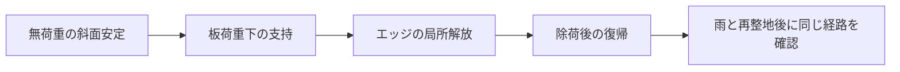

# 多方向探索 第118巡：容器の支えを素材の粘着力と混同しない
2026-10-10 / Codex。開始時main: e8b37598e08dfc203b33389d9d6b12a92d653e30。

**六脚粒の一次研究の本文を読むと、中程度の枝長で見える粘着力には容器壁の力が含まれていた。粒形を工夫して支持を作る方向は続けるが、試験器や整地機の拘束が消えた後の表面安定を別に確認する必要がある。H118は、第117巡の4形状を「無荷重で留まる／板の下で支える／エッジ後に解放する」の3場面で分けて選ぶ設計である。**

[再現計算と出典](境界力と見かけの粘着力の識別_20261010/README.md)／[Claudeへの検証依頼](境界力と見かけの粘着力の識別_20261010/claude_handoff.md)。
実物試験0、設備・協力先なし、success_probability=null。47数値確認は識別・力と面積の計算であり、滑走性能ではない。

## 1. 抄録だけでは見えなかった境界条件
Zhaoらの一次本文では、直径96mmのせん断器を0.1mm/sで駆動し、ポリプロピレン六脚粒を試験している。腕径3mm、粒の全長10/20/30mm。中程度の形状α=3.3の実験回帰は傾き1.78、切片290Paだが、壁の鉛直力が名目圧力に含まれていない。著者は局所応力を使った解析から、この形状の見かけの粘着力を境界の影響と解釈している。また球を連結したDEMは実験より強い応答を示し、表面形状に起因する摩擦の影響を指摘している。[原著v2、pp.2–4,6–7](https://arxiv.org/pdf/2002.09800v2)

本巡は上記と結論の本文を確認した。全ページの精読、図曲線の数値化、著者の生データ取得は行っていない。記載された試験材料・速度・装置での結果を、50℃・濡れ・人工フィルンの物性値として採用しない。

この結果を「全ての非凸粒には粘着がない」と一般化もしない。必要なのは、候補ごとにどこから支持力が来るかを識別すること。

## 2. 同じ測定曲線を、違う仕組みで説明できる
名目圧力をP、局所の圧力をP_local、壁の寄与をaP+bと置く診断模型を作る。

P_local=(1+a)P+b

τ=μP_local+c₀

見かけの傾きm=μ(1+a)、切片c_app=c₀+μb。

ここでμはこの模型の床内部の抵抗係数。スキー底面の摩擦係数でも、単粒同士の係数でもない。c₀も未測定。次の3組は、全てτ=1.78P+290Paという同じ曲線を与える。

| 構成した反例 | μ | c₀ | a | b |
|---|---:|---:|---:|---:|
| A：切片を粒床固有の項に置く | 1.78 | 290Pa | 0 | 0 |
| B：切片を壁の圧力に置く | 1.78 | 0 | 0 | 約162.92Pa |
| C：傾きにも壁の寄与を置く | 1.00 | 0 | 0.78 | 290Pa |

これは文献を再較正した結果ではない。公表回帰の中心値を使い、単一の曲線から仕組みが一意に決まらないことを示すための構成例である。文献のばらつきを含む統計推定や、粒配置の釣合いを解いたDEMではない。

壁の寄与を取り去り圧力をゼロへ近づけると、Aは290Pa、B/Cは0へ向かう。同じ試験曲線に合わせただけでは、無拘束時の支持を保証できない。仮想試験で雪に似た曲線が出たときにも、この識別問題を確認する。

## 3. 壁の寄与を検出するための寸法比較
直径D、力が作用する側壁高さH、平均鉛直壁せん断応力τwを仮定すると、壁の鉛直力はπDHτw。円断面で割った圧力相当は4Hτw/Dとなる。

H=50mm、τw=100Paという仮の例では：

| 器の直径 | 壁力の圧力相当 |
|---|---:|
| 96mm | 約208.33Pa |
| 192mm | 約104.17Pa |
| 384mm | 約52.08Pa |

壁力の合計は直径とともに増えるが、面積当たりの寄与はこの仮定では減る。直径を変えたときに測定が変わるか調べる理由になる。ただし実際には粒の配向・壁の応力・せん断帯も変わるため、直径を倍にすれば誤差が必ず半分になるという補正式ではない。

上面荷重・上側壁の鉛直力・対象領域の自重を分けて測り、準静的な鉛直釣合いからせん断面の力を見積もる試験を提案する。全試料の底荷重だけでは、せん断面付近の局所応力まで決まらない。動的な試験では慣性項も必要になる。

## 4. 上層の小さな自重に、見かけの切片を足さない
第105巡の仮の乾燥かさ密度150kg/m³を尺度に再利用し、30度斜面・斜面に垂直な層厚hを仮定すると、自重の法線応力はρgh cos30°。

| 仮の層厚h | 自重だけの法線応力 |
|---|---:|
| 5mm | 約6.37Pa |
| 20mm | 約25.46Pa |
| 450mm | 約572.88Pa |

これは実際の床応力ではなく、上載荷重・粒の力鎖・締固め履歴・含水・基盤拘束を除いた尺度比較。文献の名目切片290Paは、浅い層の自重応力より大きい。この切片を無条件に「材料の粘着力」として加えると、表層の安定を大幅に過大評価し得る。

第98巡の5/20/50kPaは単接点模型の仮の基準面積当たり荷重であり、ここでの層内応力と同じ量ではない。計算結果には桁の比較だけを記録し、相互に置換していない。

床が静止するための条件と、板やエッジが押したときの条件を一つの圧力で済ませない。埋設下地が安定していても、上の粒が結びついていなければ、その上層まで自動的に安定するわけではない。

## 5. H118：荷重経路を三場面で分ける
第117巡の「短枝／広い出口のC形／上下環6支柱／局所変形腕」を継続比較し、新しい形だけを増やさない。

1. **無荷重時の斜面**：スキーヤーや整地機が離れた状態で、表層が移動・分離しないか。自重・水・振動後の条件を確認する。
2. **板荷重下の支持**：局所拘束と接点が生む沈み、横支持を測る。試験器の壁反力を別に記録する。
3. **エッジ通過後の解放と復帰**：抵抗が上がり続ける、腕が破断する、大きな塊が残る案を識別する。荷重を戻したときの再接続も追う。

提案する改良の方向は、無荷重時に必要な保持と、荷重下の接触支持、解放経路を区別して設計すること。弱い再形成接点などを足す場合も、その強さと再形成時間を実測するまでc₀へ数値を入れない。冬の雪の定着を、その接点の証拠に代用しない。

## 6. 計算・試験・費用への具体的な変更
- せん断試験は上面荷重のみで比較せず、壁反力または境界条件を変えた試験を追加する。少なくとも器寸法・壁仕上げ・上載圧の違いを記録する。
- DEMは粒の輪郭を粗い球列にしたときの凹凸を点検する。同じ材料係数のまま形状解像度を変え、支持・解放が収束するか調べる。強すぎる計算を、摩擦係数を都合よく下げるだけで合わせない。
- 50℃・乾燥／濡れ／再乾燥で、法線支持・横抵抗・摩耗を同時に測る。公表PP実験の係数を温湿度違いの別材料へ代入しない。
- 整地直後だけ良い粒床では不十分。4〜5時間の運用、60分復旧の前後で、機械の拘束が消えた状態を評価する。
- 無害性、雪→粒→下地の冬の接続、排水、温暖噴霧形成は独立した未達条件のまま。形状研究だけで目的達成とはしない。

機材・購入・第三者連絡は未実施。壁反力の計測、試験器の変更、モデル精度の検証には費用がかかるが、未取得の単価で安価と判定しない。目的は、容器内だけで成立する材料へ設備2億円枠を使ってしまう判断を避け、現地で成立する候補を残すことにある。

今回の成果は、前巡の一次抄録を本文へ進め、見かけの粘着力の原因を修正し、同じ曲線でも異なる現地挙動になる反例を再現可能にしたこと。完成材料・50℃滑走・安全・成功率90％は未証明である。
