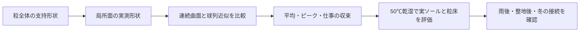

# 多方向探索 第119巡：計算上の凹凸を材料の摩擦と混同しない
2026-10-10 / Codex。開始時main: eb647a8f9ac0b0274c959d7b17634fc37d103d94。

**球を並べて滑らかな枝を近似すると、近似に由来する凹凸が抵抗を生む。本巡は材料の摩擦係数を変えずにその影響を分離した。平均抵抗の誤差が小さくても、瞬間的な抵抗の山が残る反例を得た。H119は、粒全体の支持形状を保ちながら、滑走・開離する局所面を連続した曲面として設計し、平均だけでなく力の変動も確認する案である。**

[計算・式・出典](球列近似の凹凸と接触仕事の監査_20261010/README.md)／[Claudeへの検証依頼](球列近似の凹凸と接触仕事の監査_20261010/claude_handoff.md)。
自分たちの実物試験0、設備・協力先なし、success_probability=null。48仮条件・608数値確認は拘束した接点模型の検算であり、材料の成功率ではない。

## 1. 既存の一次調査を再利用する
第118巡で読んだ六脚粒の一次本文は、連結球による形状近似が実験より強い応答へ影響することを指摘している。本巡は同じ資料を再取得せず、保存済みの出典範囲と第98巡の接点力の式を再利用した。[Zhaoら、原著v2](https://arxiv.org/pdf/2002.09800v2)

今回の計算はその論文のDEMを再現したものではない。問題の仕組みを切り分けるため、より単純な一接点の周期経路を解析した。実験の摩擦係数や50℃物性を推定していない。

## 2. 比較した模型
半径rの球の中心を間隔sで一直線に並べる。その上を、半径r_pの円形断面の試片が回転せずに進む。鉛直荷重Nを一定に保ち、前進速度を外部から制御する準静的な二次元比較である。

試片中心が必要とする高さは、隣接する球との接触幾何で決まる。R=r+r_pとすると、一周期の上下振幅はΔh=R−√(R²−s²/4)。高さの勾配qに対して、水平駆動力はF/N=(μ+q)/(1−μq)。第98巡の式を上り・下りへ拡張し、法線・接線の釣合いと照合した。

実際の粒の回転、三次元への逃げ、弾性接触、複数接点、摩耗、水、温度は含まない。球の切替点の尖った谷での慣性も解いていない。模型のピークを、スキーの振動や傷の大きさへ直接換算しない。

## 3. 平均の一致だけでは引っ掛かりを見落とす
仮入力を球半径r=0.5mm、試片半径r_p=0.5mm、材料接点のμ=0.2とする。μは実測した人工フィルンの値ではない。滑らかな直線面の同条件ならF/N=0.2となる。

| 球中心の間隔s | 試片経路の上下振幅 | 平均F/N | 最大F/N |
|---|---:|---:|---:|
| 1.000mm | 約134.0µm | 0.22067 | 0.87883 |
| 0.500mm | 約31.75µm | 0.20451 | 0.48315 |
| 0.250mm | 約7.84µm | 0.20109 | 0.33441 |
| 0.125mm | 約1.96µm | 0.20027 | 0.26595 |

最も細かい行では、平均は滑らかな面より約0.136％大きいだけだが、最大は約32.98％大きい。平均抵抗だけに合わせて「形状近似は十分」と判断すると、局所の抵抗変動が残る。

この差は材料を変更した結果ではない。数学的に固定した経路の幾何差であり、粒床の実応答を予測した増加率でもない。

## 4. 抵抗の山と、失われる仕事は別
材料接点を無摩擦μ=0とした対照でも、粗い球列上では上りに正の駆動力、下りに負の駆動力が必要になる。しかし高さが一周期で元に戻るため、符号を含む正味の外部仕事は0、接点の摩擦損失も0になる。

正の駆動仕事だけを足すと、回収可能な持上げ仕事まで損失として数えてしまう。現実の装置が下りのエネルギーを回収できるか、衝突・制動で失うかは別の問題であり、今回の模型では評価していない。

摩擦がある場合の一周期平均は、z=s√(1+μ²)/(2R)に対して平均F/N=μ atanh(z)/zという解析式で得られる。数値積分と独立に照合し、一周期の外部仕事＝摩擦散逸＋正味の持上げ仕事を確認した。これを材料固有の摩擦係数とは呼ばない。

## 5. ピークまで合わせると必要な近似の細かさが変わる
診断例として、上記μ=0.2の条件で最大F/Nを滑らかな面の5％増以内、すなわち0.21以下にする基準を仮置きした。必要な中心間隔は約19.19µm以下となった。**5％は計算誤差を比べるための仮基準であり、雪の滑りや安全の合格基準ではない。**

球を細かく重ねる方法は計算量が増える。滑らかな円柱・丸い端部を直接表現できる接触模型との比較を優先する。球列を使う場合は、平均・ピーク・力の仕事をそれぞれ収束確認し、接触係数を固定したまま近似を細かくする。

ただし今回の19.19µmは、この拘束経路の上限である。全DEMに必要な解像度や計算時間を示すものではない。質量・慣性・外形まで変わる近似では、表面の影響だけを比較できないので、それらも管理する。

## 6. H119：支持は粒の大きな形で作り、滑る局所面の凹凸を分離する
第117–118巡の4系統を維持し、丸い短枝・開放C形・上下環6支柱・局所変形腕の、実際に荷重を受ける部分と外れる部分を分けて設計する。

- 板や隣の粒が滑る局所面は、丸い連続面を基準とする。
- 横支持に必要な枝の向き・配置・開口は粒全体の形として残し、計算上の球列の谷に支えさせない。
- 意図して作った表面凹凸は、近似誤差とは別の設計変数として扱う。表面測定と一致する場合に限り、実物の凹凸として計算へ入れる。
- 平均摩擦が小さくても、抵抗の山が大きい案は、エッジの解放・粉化・繰返し荷重を再確認する。

面を滑らかにすると支持が減る可能性もある。その場合は支持形状へ戻り、摩擦係数を都合よく増やして帳尻を合わせない。無荷重の斜面安定、板荷重、エッジ解放は第118巡どおり別々に判定する。

製造面では、成形した枝のうねり・接合段差・摩耗後の凹凸を検査対象にする。数値模型の球の数は製造費ではない。金型・表面仕上げ・歩留まり・交換頻度の実価格は未取得で、安くなるという見積りは出していない。

温暖噴霧で結晶粒を形成する経路、人体・環境安全、50℃滑走、冬の定着、雨後60分復旧、採算は未達条件として残る。本巡は仮想試験の誤差を減らす進展であり、粒床の完成や成功率90％を示す成果ではない。
