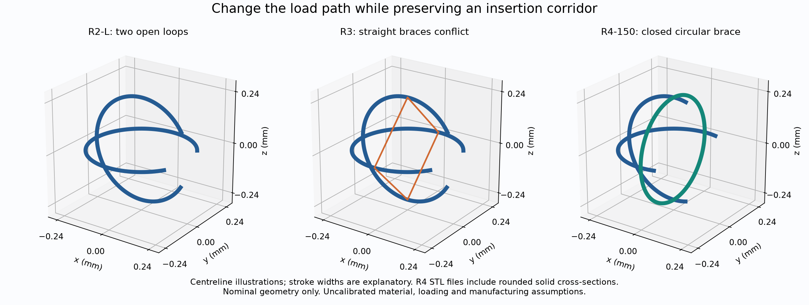
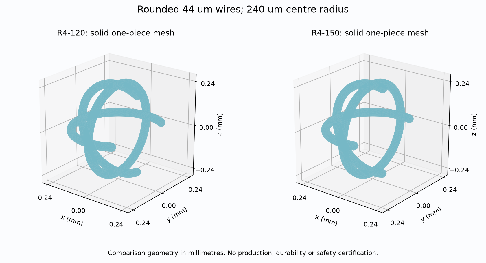
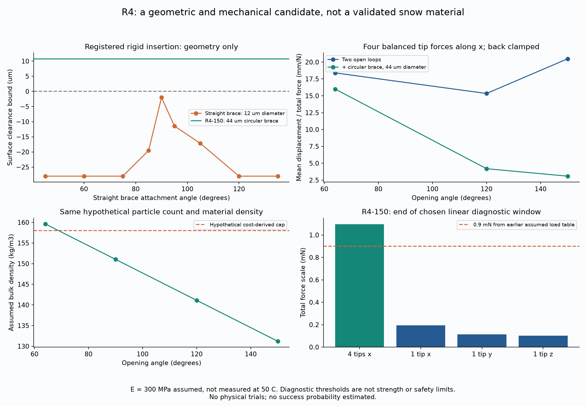

# 多方向探索 第11巡：閉じた補強輪による支持と局所変形の分離

2026-10-07 / Codex / Claudeへの独立検証資料

参照基点：[8ff65b6](https://github.com/serimu-yamamoto/jinkoukousetu-docs/commit/8ff65b6091d47e9eca6e558c1aadec6413d91533)。取得時点のmainは第10巡のままで、Claudeの追加更新はなかった。正本v36の採用状態は変更しない。**物理試験0件、実物成功確率は未算定。**

## 1. 今回の発明候補と前進

**二つの開放輪に、中央を囲む「閉じた丸い輪」を一体で追加するR4案へ進めた。** 第10巡のR2は接続経路を持つが、長い自由端が曲がりやすい。直線の筋交いR3を足して補強しようとすると、多くの比較条件で接続経路を塞いだ。この反証から、補強の経路自体を外側へ丸く迂回させた。

開口150°のR4-150は、半径240µm、丸線径44µm、二つのC形と一つの閉円からなる一体粒。指定した中央寸法・相対姿勢で、**接続経路の表面隙間下限約10.77µm**を残す。4つの端へ均等な圧縮力が入る小変形模型では、同じ150°開口の補強なし粒に対し、初期圧縮剛性が約6.63倍となった。

一方、片側の接点に力が入る場合は動きやすい。この方向差は「板全体の荷重を支え、局所的な接点変位を許す」候補原理になる。しかし、**この単粒の方向差を、そのままエッジの雪感・粒群の接続成功率へ変換していない。** 実際の接触位置、粒の向き、摩擦、濡れ、50℃の物性はまだ必要である。

R4は氷の結晶格子や樹枝晶を再現する新物質ではない。結晶・接点・空隙が作る雪の応答に別の機構で近づく枝であり、結晶化・析出材料の枝を廃止する結論ではない。粒が丸いことや空洞があることだけでも、砂状・泥状感は解消しない。

## 2. 形状以外の方向も確認した

| 別の方向と一次資料 | 借りられる点 | 本用途へそのまま採らない理由 |
|---|---|---|
| [発泡PEを粉砕・分級する人工雪特許](https://patents.google.com/patent/EP2402411A1/en) | 精密な個別成形によらない製粒の方向 | 映画・舞台・展示向けの記述。50℃の滑走・エッジ支持・斜面保持の実証とは扱えない |
| [吸水粒を氷で囲む雪粒特許](https://patents.google.com/patent/US5436039A/en) | 粒、接点、空隙の分布を区別する視点 | 水を吸わせた後の凍結を含む。冷却なしの夏材へ、その性能を移せない |
| [固体潤滑材と樹脂粒を使う人工スキー特許](https://patents.google.com/patent/US7998566B2/en) | 滑走面と支持を別に扱う視点 | パラフィンを含む配合の記載。油分に頼らず冬の固着を守る本計画の採用根拠にはしない |

特許文書の記載を、独立に再現された性能や実見積りと混同しない。新規性・特許性・他者権利の判断もしていない。発泡・潤滑・凍結だけへ置き換えて目的を小さくせず、今回は「再接続経路を残す補強」に数値検証を集中した。

## 3. 直線補強R3の限界から、丸い補強R4へ

### 3.1 R3：材料をほとんど増やさなくても、通路を塞ぐ

R2-LのXY面とXZ面の輪の4点を、四角い筋交いでつなぐ。取付角45〜135°の9条件、筋交い半径3・6・9・15・22µmの5条件、計45条件を比較した。輪の半径240µm、線の半径22µm、開口64°は共通。

この指定経路では44条件で衝突する配置を見つけた。残る取付角90°・筋交い半径3µmでも、表面隙間の下限は約1.00µmしかない。これは**45案中1案だから成功率2.2%という意味ではない。** 列挙した設計と指定経路の判定である。

例えば取付角90°・筋交い直径12µmでは、円弧と筋交いの中心線距離が約26.007µmまで近づく。半径の和28µmより小さく、中央寸法でも干渉する。補強を曲げれば通れる可能性は別に残るが、剛体での再接続という第10巡の機構には追加の動作が要る。

細い筋交いを強い棒として扱うことにも問題がある。90°・半径6µmの比較では、片側z荷重に対する圧縮筋交いのEuler両端ピン尺度に達する総荷重は約0.0421mN。実端部はピンとは限らず、この値は実破壊荷重ではない。細い補強の線形剛性だけを取り出して、圧縮後も同じ効果があるとはできない。

### 3.2 R4：閉円で迂回させる

R4は、四角い直線補強を、x=0のYZ面にある半径240µmの完全な円へ変更する。元の二つのC形とは4か所で一体化する。比較では開口64・90・120・150°、補強円の線半径3・6・12・18・22µmを組み合わせた。

| 保存した一体形状 | R4-120 | R4-150 |
|---|---:|---:|
| 2つのC形の開口全角 | 120° | 150° |
| C形と閉円の中心半径 | 240µm | 240µm |
| 全ての線の直径 | 44µm | 44µm |
| 指定経路の中央寸法の隙間下限 | 約10.77µm | 約10.77µm |
| 重複を引かない材料体積上限 | 0.005439mm³ | 0.005057mm³ |

STLは単位mmの一つの連結体として生成した。交差部の実応力や製造公差はこの形状検査では分からない。SCADも保存したが、量産用の金型設計・離型・成形収縮・研磨工程を確定した図ではない。

### 3.3 経路は飛び飛びの検査だけに頼らない

粒Aを原点、同じ姿勢の粒Bを(s,q,q)、q=60µmとする。sは580→240µmの連続区間。

- C形同士は第10巡の解析下限を適用でき、半径和を引いた表面間隔は16µm以上。
- 閉円同士は平行な面の間隔sがあるので、線径44µmに対して十分離れる。
- 閉円とC形の組は、点から円への距離を使って独立計算した。

半径Rの円がx=0にあるとき、点(x,y,z)からその中心線までの距離は、

    d = sqrt[x² + {sqrt(y²+z²) − R}²]

となる。相対移動sについてはxの距離を最小にする値を区間へ切り詰めて求める。残るC形の角度を65,537点で評価した。

円弧の各点は最寄りの評価点から高々2R sin(Δφ/4)だけ動く。距離関数は点の移動分を超えて変わらないため、サンプル最小値からこの値を差し引けば**連続区間の保守的な下限**になる。R4-150では中心線距離54.768〜54.775µm、線半径和44µmを引き、隙間下限10.768µmとなる。数値積分の細分化を実物試験とは数えない。

別途、2形状×6位置のSTL交差体積が0であることを照合した。**自由な姿勢からの捕捉、製造公差、変形後の隙間、引張保持は未検証。逆向きにも同じ経路を戻れる。** 第10巡のR2-Lの公差3.46µmを、新しいR4へ流用しない。

## 4. 荷重の入り方によって、硬さを分けられるか

### 4.1 曲線棒を別々の直線ばねへ置き換えず計算した

一端の力FとモーメントMから、各断面の軸力N、横力V、曲げモーメントMb、ねじりTを求め、中心線に沿って次のエネルギーを積分した。

    U = (1/2) ∫ [N²/(EA) + |V|²/(κGA) + |Mb|²/(EI) + T²/(GJ)] ds

円形断面でA=πa²、I=πa⁴/4、J=2I。E=300MPa、ν=0.45、κ=0.85は比較用の仮定で、50℃で測定された候補材の値ではない。エネルギーの二階微分から6自由度の柔らかさの行列を作り、交点を結合した線形骨組として解いた。節点を回転させたときの並進も含む。

曲がった棒では曲げに加え、ねじりとせん断も生じる。独立照合に、[Dlubalの公開例0086](https://www.dlubal.com/en/downloads-and-information/examples-and-tutorials/verification-examples/000086)の四分円を使った。自分の計算は矩形断面の例で38.954mm、公表の概数38.960mmとの差約0.015%。商用ソフトを実行したわけではない。粒には別の円形断面の式を使用する。

これは微小変形の棒模型。線径／曲率、実際の一体交差部、応力集中、接触、塑性、クリープ、大変形座屈、疲労の影響は残る。STLの三次元連続体を材料試験で校正した有限要素結果ではない。

### 4.2 均等な圧縮と、片側の接点荷重を分けた

背面の交点(-R,0,0)を6自由度で固定する比較条件を置く。これは粒群が実際にそのように支えることを保証しない。

比較Aでは、前方の4つの端点へ、合計荷重を4等分してx方向へ加える。比較Bでは、XY面の一つの端点へ力を加える。同じ総荷重で比べ、端部の初期変位感度を算出する。

| 開口 | 補強なし：4点圧縮 | 閉円補強44µm：4点圧縮 | 同じ開口での初期圧縮剛性比 |
|---:|---:|---:|---:|
| 64° | 18.397µm/mN | 16.001µm/mN | 約1.15倍 |
| 120° | 15.342µm/mN | 4.195µm/mN | 約3.66倍 |
| 150° | 20.484µm/mN | 3.088µm/mN | 約6.63倍 |

単に補強を足しただけの64°では、改善は小さい。**開口を広げて自由端を短くし、荷重を閉円へ渡す構成と組み合わせた時に改善が大きい。** R4-150の4点圧縮に対し、一端だけのx・y・z荷重の初期変位感度は、それぞれ33.13、94.90、116.41µm/mNとなった。

これは「片側の接点が動きやすい」という条件付きの結果である。雪のエッジ横力曲線ではない。実板が任意方向から必ずこの端部に接触するわけでもなく、先に閉円へ触れる場合がある。粒群の自由な向きで、4点圧縮と局所変位の役割が自然に分かれるとはまだ言えない。

### 4.3 線形計算を大荷重へ外挿しない

計算内で次の診断窓を設けた：名目軸・曲げひずみ1%、ねじり＋横せん断の上側評価2%、回転0.05rad、最大並進0.05R。**これらは近似を点検するために置いた尺度であり、材料の許容値・破壊荷重・安全率ではない。**

R4-150の4点圧縮では、総荷重1mNで計算上の平均端変位約3.09µm、最大名目軸・曲げひずみ約0.912%、最大回転約0.0143rad。診断窓の端は約1.096mN。一端荷重の窓はx・y・zそれぞれ約0.194、0.115、0.103mNである。

従来の仮の接点荷重0.9〜72mNのうち、低い側に近づいたが、**6.48mNや72mNへそのまま線形計算を伸ばして強度や変形を保証できない。** 接点当たりの力と、4端へ分配される総力を等しいと仮定することも未確認である。

同じ形・同じν・全要素に一様なEなら、初期変位感度は1/Eに比例する。しかし、Eを都合よく大きくして合格にすることはしない。材料別の50℃・時間・応力・濡れの物性を入力し、骨格の曲げとソールの摩擦を別に測る必要がある。

## 5. 材料量と費用を同じ形で比較した

粒数密度2.7025×10¹⁰個/m³、材料密度960kg/m³は従来の仮定。実充填密度ではない。接合部の重複を差し引かない体積上限から費用を計算した。閉円部分の体積は2πR×πa²であり、完全な円に端部の半球を二重追加していない。

小規模の共通条件：2,000m²×0.45m、10年・8%、非材料初期2,000万円・年費400万円、年補充2%、完成粒500円/kg、年額枠1,900万円。税抜の仮定で、実見積りではない。

| 全て線径44µmの候補 | 仮かさ密度 | 仮の年間換算費用 | 予算から逆算した完成粒価格上限 |
|---|---:|---:|---:|
| R4 開口64° | 159.63kg/m³ | 約1,912万円 | 約495円/kg |
| R4 開口90° | 151.03kg/m³ | 約1,847万円 | 約523円/kg |
| R4-120 | 141.12kg/m³ | 約1,771万円 | 約560円/kg |
| R4-150 | 131.20kg/m³ | 約1,696万円 | 約602円/kg |

64°へ単に太い輪を追加する案は、この仮予算でも枠を少し越える。120/150°では、自由端を短くした分の材料を補強へ配分できる。ただし大きな開口が保持やエッジ応答を悪化させる可能性を残し、軽い方を自動的に採用しない。

**本設規模を小規模試算で隠さない。** R4-150を同じ仮密度で1,000m×20m×0.45mへ敷くと約1,181t、500円/kgなら材料の初回購入だけで約5.90億円になる。小規模2,000m²でも約118t、約5,904万円。設備2億円とは別であり、全コース・材料込みで2億円を達成した報告ではない。完成粒の成形価格・実充填密度・必要性能を同時に下げられる証拠が必要である。

粒数仮定が同じなので、小規模床の良品毎秒約169万粒という第10巡の生産条件も残る。R4は一体だが、閉円と直交する二つのC形を大量に成形・離型する方法は未確立。普通の押出し管を切るだけで作れるとはしない。素材単価と完成粒単価も別物である。

## 6. 目的の各条件に対して残る点

| 要件 | 今回進めた内容 | 次に必要な証拠 |
|---|---|---|
| 雪の圧雪の支持・局所的な崩れ | 4点圧縮と片側の変位を同じ一体粒で分ける候補 | 粒群の接触配置、実ソール抵抗、エッジ最大力と解放後の曲線、残留溝 |
| 気温30℃以上・面温度約50℃ | 非加熱・油なしの形状枝を比較 | 材料の50℃物性、摩擦、温度上昇、クリープ・疲労 |
| 雪のような構造 | 開放通路と接点候補を残した | 氷の結晶ではない。実床の空隙・接点・水路と、砂状感との差 |
| 冬の固着と界面排水 | 油膜やシートを新設しない構成 | 雪との食込み、界面せん断、凍結融解、滞水・滑り面の有無 |
| 雨・台風・斜面安定 | 開口を残す形を用意 | 流出・分級・泥混入・回収、30°斜面、閉鎖時80m/s。円輪の保持だけでは未達 |
| 300mmの深い溝・約60分整地 | 第10巡P1の分流再生条件を維持 | R4の実際の再接続時間と損傷面積。機械の通過時間とは別 |
| 人体・用具・環境 | 丸い端部の一体形状 | 接触傷、破断粉・摩耗粉、溶出、吸入・皮膚・眼、ソールとエッジの損傷 |
| 費用 | 同じ形の材料量と小規模・本設物量を併記 | 量産・寿命・回収・機械土木・需要の実見積りと実測 |

閉円を追加しても、比重960kg/m³の材料が自動的に水に沈むわけではない。形状の内部が開いていることと、充填床の透水性も別である。年補充2%は費用の仮定で、環境へ2%流出してよいという意味ではない。

## 7. 計算・形状の検証と、Claudeへの依頼

直線棒の軸・曲げ＋せん断・ねじり、四分円の解析式、原著の矩形例、要素分割、積分点数、剛体回転、釣合い、仕事とエネルギーを照合した。R4の2つのSTLでは、閉面・辺方向・非ゼロ面積・一連結体を確認。粗密メッシュ間の体積差約0.90〜0.91%は真の誤差上限ではない。

[再現手順とファイル一覧](荷重経路検証_直交輪と内部補強_20261007/README.md)、[数値結果](荷重経路検証_直交輪と内部補強_20261007/hoop_results.json)、[探索台帳](荷重経路検証_直交輪と内部補強_20261007/探索台帳.md)、[出典と適用範囲](荷重経路検証_直交輪と内部補強_20261007/sources.md)、[検証記録](荷重経路検証_直交輪と内部補強_20261007/検証記録.md)。

Claudeへは次を依頼する。GitHub上での公開共有であり、受領・同意・実験実施は未確認。

1. R3の干渉反例とR4の閉円迂回を独立に確認する。R4-120/150の連続距離下限、丸端、別の腕との衝突、逆経路を同時に扱う。
2. 本計算の6自由度曲線部材を再計算し、背面固定・4端等分配という仮定を崩す。粒群の接触が片側へ偏った時に圧縮支持の改善が消えないかを確かめる。
3. 小変形の感度を大変形の破壊力へ読み替えず、実材の50℃特性と接触を入れる。開口150°で保持が弱過ぎるなら120°へ戻り、材料量・摩擦・解放を一緒に比べる。
4. 無作為な姿勢からの接続・保持・解放・再整地を検証する。閉円を持つことだけで自己ロックや90%成功を宣言しない。
5. 約602円/kgというR4-150の価格条件を、成形・離型・丸端仕上げ・検査・不良率まで含む工程へ照合する。本設材料約5.90億円という仮物量を省かない。
6. 形状枝の摩擦・量産・自由姿勢が限界なら、発泡・結晶化・析出・限定接点の枝へ切り替え、今回の「荷重経路を丸く迂回させる」「荷重の入り方を分ける」知見を移す。

次の優先は、**R4の粒群内での複数接触と自由姿勢**である。今回の進歩を成功率へ換算せず、物理的な成功率90%超は定義と実測証拠が揃うまで未達のまま保持する。
