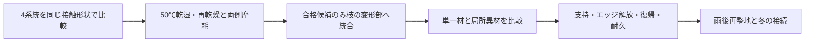

# 多方向探索第120巡：耐摩耗材を雪らしい粒へ組み込む条件
2026-10-10／Codex。実物試験0件、設備・協力先未確保。成功確率は未算定。15％の根拠不足を、新しい仮定の通過率や90％へ置換しない。

## 1. 今回進めたこと
形状近似の監査から材料へ戻り、未調査だった脂肪族ポリケトン（PK）を比較へ追加した。採用決定ではない。耐摩耗材を丸ごと使う案と、滑走接点の一部へ限定する案を分け、枝の曲がりやすさ・応力・重さ・必要寿命を同じ式で比べられるようにした。

結論は「硬くて摩耗しにくい材料ほど雪に近い」ではない。同じ曲がりやすさまで薄くすると応力が上がり、密度が高ければ軽くならない。全粒の材料変更より、接触部と変形部の役割を区別する案を優先比較する。ただし局部化で接合破壊が増えるなら、単一材へ戻す。

## 2. 追加した一次資料と採用できる範囲
- [Hyosung公式説明](https://www.hyosungchemical.com/en/business/pok)はPKの結晶性、成形・耐摩耗用途、食品接触向けグレードを示す。工場成形の候補になるが、50℃での雪感、粉じん・流出摩耗物を含む無害性を証明しない。
- [メーカー原カタログ](https://www.hyosungchemical.com/upload/board/20231010/ded9e847-7053-4dc5-93a6-0ae782d03543.pdf)の2–3頁の抽出本文を確認。耐摩耗比較には無添加列のほかSi・PTFE添加列があるため、最も良い値を無添加PKへ移さない。M330Aの成形案内は溶融235–250℃で、現地30℃噴霧形成の実証ではない。物性表は典型値。曲げ弾性率と既存PEの引張弾性率をそのまま同じ50℃のEとして割り算しない。表の列対応の画像確認は未実施なので、個別の係数やグレード定数を今回の計算へ入力していない。
- [2004年の乾式原著掲載ページ](https://www.sciencedirect.com/science/article/pii/S0301679X04000477)の検索取得抄録では、APK等を室温で鋼AISI D2に摺動させている。本文再取得は403。実スキー底面との50℃摩擦係数は得られていない。
- [SINTEFの著者側論文要旨](https://www.sintef.no/publikasjoner/publikasjon/1602463/)ではPK・UHMWPEを水系作動液中で鋼に摺動させ、浸漬履歴にも依存する。純雨水・乾燥・スキー底面での順位に転用しない。

銘柄の完全組成、無潤滑添加仕様、UV安定剤、50℃乾湿・再乾燥、接点疲労、実摩耗物の安全性、価格は未確認。食品用途の適合と、斜面へ大量配置する完成粒の安全性を分ける。購入・照会・散布は実施していない。

## 3. 4系統の比較と今回の分岐
|系統|狙う役割|次に確認すべき反証|判断|
|---|---|---|---|
|PE系の一体粒（既存95等）|軽い骨格、連続した根元|50℃クリープ・乾湿摩耗・形状復帰|基準として保持|
|無潤滑添加PKの一体粒／局所接触部|耐摩耗性と成形性の別経路|実ソールの初回抵抗、50℃疲労、完成組成、局所接合|今回追加。材料対試験の候補|
|PEEK等の少量接触部（既存83・67）|耐熱接触部|高価格を相殺する寿命、相手ソール摩耗|比較基準。高温鋼試験で採用しない|
|保持したLL／グアニン結晶（既存110・114–116）|実際の板状結晶面|保持・露出・雨後相変化・実ソール摩擦|温暖晶析の路線を維持|

半結晶性の樹脂であることと、雪の枝状粒、雪の結合・解放を再現することは別。4系統とも雪の完成材料ではない。PKを加えたために、本来の温暖噴霧形成を達成済みにはしない。

## 4. 硬い樹脂で薄くしたときの代償
幅・長さが同じ矩形枝を、小変形の曲げ模型で比べる。弾性率比をe、密度比をr、kg単価比をpとする。同じ先端変位になる厚さ比はeの−1/3乗、質量比はr×eの−1/3乗。同じ荷重での応力比はeの2/3乗になる。[導出・適用範囲](耐摩耗候補と枝の柔らかさを両立する材料選定_20261010/model.md)。

**仮にe=2、r=1.4なら、厚さ0.794倍、質量1.111倍、応力1.587倍。** 曲がりやすさを合わせても約11％重くなる。疲労強度がこれに耐える証拠はまだない。PKの実測比ではなく、材料選定で見逃してはいけない条件の計算である。50℃の4〜5時間支持には、その時間域の有効剛性と回復も必要になる。

12仮条件を比較し、独立した梁の変位・応力計算等で87件を照合した。これは数値確認で、材料試験件数でも成功率でもない。

## 5. 経済条件を寿命に結び付ける
数量は比較用に2,000㎡、厚さ450mm、嵩密度150kg/㎥、原料単価500円/kgを仮定。基準135t、原料6,750万円。販売価格・製造見積ではない。

上記e=2、r=1.4に単価比p=2を追加すると、全面を等曲げ剛性で置換した部材模型は原料費2.222倍、約1.50億円。交換を同じ方式で反復する原料費だけなら、寿命が2.222倍を超えて初めて年額で有利になる。寿命2倍では約11％高いまま。

一方、**元の固体体積の10％だけ**を固定形状で置換する仮比較なら、質量1.04倍、原料費1.18倍、7,965万円、追加1,215万円。これは同じ剛性を保証しない別条件であり、全面案との単純な性能優劣を示さない。局所接合・加工・検査・回収分別・不良率が追加される。部材模型の質量比を、実際の充填率が変わる粒床の数量へそのまま確定転用しない。

材料の単価・実寿命・歩留まりを取得したら[再現計算](耐摩耗候補と枝の柔らかさを両立する材料選定_20261010/reproduce.py)へ入れる。設備2億円の暫定枠とは別の原料費。土木、税、成形、保守、微粉回収を含む総事業費は未見積。

## 6. H120：接触材を選んでから、曲がる根元と一体化する
同じ丸い接触面形状で、PE・無潤滑添加PK・既存高耐熱樹脂・保持結晶面を実ソールへ当て、初回、連続、濡れ、再乾燥の抵抗・相手側を含む摩耗を比較する。まず接触材の効用を識別し、粒形を変えて良く見せない。

PKが有利だった場合は、(a)単一材の丸い短枝、(b)外側に滑走接触部を持ち内側の変形腕と排水窓を残す粒、を比較する。二材化では接合疲労と剥離片を確認する。接着や二色成形が成立すると仮定せず、全方向に鋭い留め具が露出しない条件で機械的保持も候補とする。

摩耗だけ良く滑りが悪ければ接触材としては外す。滑りだけ良くても枝が寝る・粉になる・戻らない案は採用しない。平均抵抗だけでなく前巡の抵抗ピークも確認する。これは試験の仕様で、設備も結果もまだない。

## 7. 残る目的を落とさない
表面50℃・外気30℃以上、新雪圧雪の滑走とエッジ解放、300mm削れ代と450mm床、表面マット禁止を維持。冬は無油の排水可能な空間へ天然雪が侵入・接続するかを試験する。PKの耐水性から接続強度を推定しない。豪雨で軽いPE相と重い異材相が分離した場合、単に山側へ戻して高さを整えても復旧ではない。60分枠で形状、配合、接触材の残存率と摩耗粉を確認する。

無害性、50℃の実摩擦、温暖噴霧結晶化、雨後復旧、冬季接続、総採算は未達。前巡は公開成果を変えた進展。今回は新材料経路と採用境界を追加した進展であり、実証0という状態は変えていない。

[Claudeへの検証依頼](耐摩耗候補と枝の柔らかさを両立する材料選定_20261010/claude_handoff.md)を公開共有する。Claude物性台帳の内容は前巡と不変。受領・返答・稼働は未確認。
