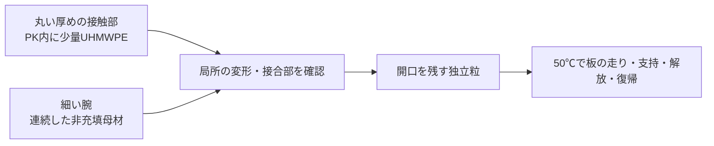

# 多方向探索第121巡：少量の内部潤滑相と細い枝を両立する条件
2026-10-10／Codex。こちらでの実物試験0件、設備・協力先未確保。成功確率は未算定。公表された他者の試験と自分たちの実証を分ける。

## 1. 新しい根拠と進展
前巡のPK候補について、高温乾式試験の具体例を見つけた。**PKの中へ少量のUHMWPEを分散した接触材**を、保持結晶・PE一体粒等と並べる候補へ追加する。配合そのものは既存の公開技術であり、こちらの新発明とはしない。

[US20210395453A1の実施例1–2](https://patents.google.com/patent/US20210395453A1/en)は、表面処理UHMWPE約5重量％を含むPKを、無潤滑の鋼対向で評価している。速度0.84m/s、公称圧力0.84MPa、定常温度54〜58℃。全試験の摩擦係数は未改質PKの0.412に対して複合材0.275で、計算上33.25％低い。摩耗係数の報告値の比は0.419、約58.08％低い。

これは出願人が記載した結果で、独立追試でもスキー試験でもない。自熱による定常温度と50℃に温調した乾湿試験を同一視しない。原文の鋼名にはD2と52100/100Cr6の混在があり、試験時間・定常区間・摩耗係数の当該段落での単位も不足している。絶対寿命には換算しない。

## 2. 「PK＋PE」だけでは再現仕様にならない
実施例のUH-1700には表面処理があり、普通の未処理粉体と同じではない。投入量はPK18.97kg/h、UHMWPE1.00kg/h、合計19.97kg/hなので、厳密な供給質量比は5.0075％。公開例には温度を上げる混練、冷却造粒、乾燥があり、現地30℃での噴霧結晶化ではない。

[Inhance公式資料入口](https://www.inhancetechnologies.com/ebooks-datasheets-and-more)にはUH-1000資料があるが、今回は資料本体を取得できず、処理内容・残留成分・当該銘柄の完全組成は未確認。名称やメーカー名からフッ素処理とも非フッ素とも決めない。本文の配合欄にPTFEが無いことだけでは、完成材の禁止添加剤不使用を証明できない。

比較用には、[三井化学の技術資料](https://jp.mitsuichemicals.com/en/special/uhmw-pe/technical_data/million_mipelon/)が添加剤なしと明記するXM-220Uを別候補に置く。ただしこれはUH-1700の代替実証ではなく、分散・保持・摩擦を測り直すための対照である。購入も照会も行っていない。

## 3. UHMWPEの融解と粉体形状を混同しない
特許の一般説明にはUHMWPEを不融とする表現がある。一方、[三井化学のメーカー説明](https://jp.mitsuichemicals.com/en/special/uhmw-pe/case/case06/)はMIPELONの融点136℃を示し、高い混練温度では凝集し得るとしている。この資料のゴム例には油も含まれるので、配合例や低摩擦効果は本件へ移植しない。

銘柄差を無視して特許の処理粉体の挙動を否定することも、UHMWPEなら高温で必ず元の粉体形状を維持すると仮定することもできない。**原料粒径ではなく、混練・成形後の分散相の寸法と界面の保持を調べる**。融解、流動のしにくさ、相分離、冷却後の結晶化は別の現象として扱う。

## 4. 微粒を混ぜるときに細い枝で起こる問題
供給粉体の代表寸法38µm、上限75µmを寸法比較に使うと、厚さ100µmの枝にはそれぞれ約2.63個分、1.33個分しか入らない。75µm球を中央に置いた理想幾何でも、両側の被覆は12.5µmずつ。これは強度予測ではないが、均質材料とみなす前に局所欠陥を調べる理由になる。

元粉体が成形後もこの寸法とは限らない。大きい凝集塊や界面剥離ができれば、細い根元の破断・摩耗粉・表面の凹凸へつながり得る。逆に小さくすれば自動的に滑りが良くなるとも限らない。表面に露出する相の面積と荷重割合は、混合重量％とは一致しない。

本巡の独自計算は組成・寸法・物量の整合であり、摩擦の混合則を作って合格にしていない。[模型](高温乾式PK複合材の実施例と局所配合設計_20261010/model.md)、[59件の数値確認](高温乾式PK複合材の実施例と局所配合設計_20261010/validation.json)。

## 5. H121：太い接触部に分散相、細い腕に連続母材
同一PK母材を使い、丸く厚い接触部へUHMWPE分散相を限定し、曲がる細い腕には非充填母材を残す案を追加する。従来のPE骨格へ複合接触部を保持する案も比較対象にする。

試片は4案までに絞る。PE一体基準、未改質PK、一様に分散したPK、局所に分散したPK。結晶接点路線は別の未達候補として維持する。PK内の分散相だけに研究全体を固定しない。

同じ母材でも、流れが合流した部分や二段成形界面の強度は保証されない。粒全体を回転させたときの接触位置、雪の保持空間、排水、エッジの抜けを同時に確認する。50℃のクリープと回復はまだ不明で、室温の引張値を入力して完成扱いしない。

## 6. 少量添加でも、材料量と工程量は軽視できない
理想的な体積加算に限れば、供給比と密度からUHMWPEは約6.53体積％、複合材密度は約1,220kg/㎥となる。UHMWPE密度935kg/㎥は公開範囲930〜940の中点を仮置きした。気泡・収縮・添加剤・成形後密度は未測定。

仮にPK基準135tの固体体積の10％を複合部に置き換えると、複合部は約13.28t、その中のUHMWPEは約0.665t。完成粒全体に5重量％入れる案とは違う。PK基準の質量と嵩密度は比較用で、実床充填率を実測した値ではない。

原料費の比較式は、残るPK121,500kg×その単価＋複合部約13,283kg×その完成原料単価。混練・局所成形・検査・回収費は別。複合部の加工単価が100円/kg変わるだけで約133万円変わる。供給19.97kg/hに単純換算すると複合部だけで約665時間だが、これは実施例と同じ流量を仮に連続維持した算術値で、生産能力・納期・現地60分復旧を示さない。

前巡との比較用にPE密度935kg/㎥を基準にした別計算も保存した。そこで複合部は約17.62tとなる。二つは基準の固体体積が違うので、数字だけで優劣を決めない。設備2億円の暫定枠と材料費を混ぜず、見積未取得を維持する。

## 7. 摩耗の初期と定常を分ける
複合材の全試験摩耗係数は定常値の約3.52倍。低い定常値だけで寿命を見積もると、初期の影響を落とす。この比から初期の継続時間や、雨・整地ごとの摩耗量は逆算できない。

[第89巡の両側履歴の識別](素材とスキー双方の履歴を分ける乾式接点検証_20261009/model.md)を再利用し、素材とスキー底面のどちらを慣らしたかを入れ替える。同一材の初回、慣らし後、純水湿潤後、再乾燥後を比較し、低抵抗が鋼上の移着膜にだけ依存していないか調べる。要旨しか取得できていない水系作動液研究から、純雨水と再乾燥の合格を補わない。

## 8. 完成判定へ残す条件
人体・自然環境に無害な完成組成と実摩耗物、50℃での実スキー摩擦・摩耗、支持とエッジ解放、長時間回復、結晶外形、30℃以上での噴霧形成は未達。融けない半結晶性樹脂だけで雪にはならない。

冬は天然雪の侵入と保持、排水と凍結閉塞を確認する。油や水の弱面を許さない。雨後は分散相の剥離と配合偏りを確認し、山側への引上げ・再圧密だけで性能が戻るとしない。450mm床、300mm削れ代、表面マット禁止、昼閉鎖60分を維持する。

前巡は公開状態を更新した進展。今回も高温乾式の新しい根拠と局所配合の成立条件を追加した進展だが、こちらの実物試験は0件、成功確率null。Claude台帳は前巡と不変。[独立検証依頼](高温乾式PK複合材の実施例と局所配合設計_20261010/claude_handoff.md)を公開共有し、受領・返答・稼働は未確認とする。
