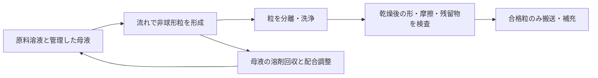

# 多方向探索第122巡：温暖形成の粒形を保つ母液再生条件
2026-10-10／Codex。実物試験0件、設備・協力先未確保。成功確率は未算定。

## 1. 今回の進展
材料の摩耗検討から、凍結を使わずに非球形の粒を作る経路へ戻った。既存の樹枝状粒研究は第27巡の評価を再利用し、新たにセルロースアセテート（CA）の微細流路形成の原著本文・方法・原表を確認した。

重要なのは、**同じ流量でも、再利用液に溶剤が蓄積すると出来上がる形が変わる**点である。形成装置のノズルだけでなく、母液の再生を粒形の管理へ含めるH122を追加した。温暖な空気中で雪結晶を作れたという成果ではない。

## 2. 新しい一次資料で確認できたこと
Mori、Watanabe、Ono、*Formation of Nonspherical Cellulose Acetate Microparticles under Microflow*、公開日2024-12-19、[DOI:10.1021/acs.langmuir.4c03430](https://doi.org/10.1021/acs.langmuir.4c03430)。[Europe PMC本文XML](https://www.ebi.ac.uk/europepmc/webservices/rest/PMC11697331/fullTextXML)から方法と表1・2を読んだ。

2重量％CA／酢酸メチル（MA）溶液を、1重量％PVA水溶液へ導入する液中析出。実験は20〜27℃で、30℃以上・50℃使用の実証ではない。分散相20µL/minの条件で、連続相100、200、700µL/minにより球、椀形、両凹形となる。球の形成例の42秒を、すべての形の形成時間や乾燥時間に使わない。

|連続相／分散相流量比|Pe|観察された形|
|---:|---:|---|
|5|91|球|
|10|178|椀形|
|35|563|両凹形|

流量比10で連続相のMA濃度を増やすと、0、5、8、10重量％に対してPeは178、131、106、89へ変わる。25重量％では流路内の収縮・粒形成が進まなかった。Pe約100の区分はこの研究系の観察で、別材料や30〜50℃へそのまま適用しない。

洗浄は3回、SEM用には一晩の凍結乾燥が使われる。乾燥写真から、常温自然乾燥後の形状保持や現地60分復旧を証明できない。枝状結晶ではなく、溶剤移動と表面層の変形による非球形粒である。

## 3. 既存研究との接続
[第27巡の一次資料記録](枝状粒形成検証_熱選別と回収収支_20261008/sources.md)には、せん断析出による枝状粒と、強い接着・不織布化、濡れ・着氷の競合が既にある。その知見は再利用し、新発見と数えない。微細な枝が多いほど、乾湿で粒どうしが貼り付く可能性も評価する。

[第105巡](温暖形成と開放環粒の製造監査_20261010/sources.json)の開放環形、今回の椀形・両凹形、既存の樹枝状粒、真正の板状結晶は区別する。凹面は貫通孔ではない。水を抱え込む形を排水する形と呼ばず、必要な開口加工と、その後の強度を別に確認する。

## 4. 母液を返すだけでは形がずれる
原著の2重量％仕込みを基準に、乾燥CA1kgあたり溶液50kg、そのうちMA49kgとなる。これは通過する総量で、全量を新しく購入・排出する意味ではない。

溶剤を回収せず、初期1,000kgの無MA浴へすべて移し、浴量増加を許す理想収支では、以下となる。

|浴のMA濃度|そこへ達する乾燥CA生産量|
|---:|---:|
|5重量％|約1.074kg|
|8重量％|約1.775kg|
|10重量％|約2.268kg|

完全移行・均一混合・粒の完全分離を仮定した計算で、実装置の実測ではない。粒に残る溶剤、水の粒内移動、溶解平衡と速度、PVAの吸着・濃度変化は未計算。高濃度で形成が止まる現象まで、同じ収支模型だけで予測したとは扱わない。

5重量％は原著で調べられた濃度を使った**比較用の管理値**で、所望の形を保証する製造規格でも安全濃度でもない。型崩れを防ぐには、濃度に加えて温度、PVA、粒の画像、残留物を確認する必要がある。

## 5. 回収と液交換を両方含める
一定量の浴を保つ模型で、製品1kgあたりのMA流入S=49kg、回収する流入負荷の割合η、浴濃度cとする。回収されないMAは(1−η)S。これを浴と同濃度の抜出し液で除くと、抜出し液量B=(1−η)S/c、補充する非MAの液量はB−(1−η)Sになる。

|流入MA負荷の回収割合（仮定）|回収MA kg/kg製品|5％浴からの抜出し液 kg/kg製品|補充する非MAの液 kg/kg製品|
|---:|---:|---:|---:|
|0％|0|980|931|
|99％|48.51|9.80|9.31|
|99.9％|48.951|0.98|0.931|

ηは流入した溶剤負荷に対する回収量の割合であり、分離機の一回通過効率ではない。99％や99.9％を実装置で達成した証拠はない。抜出し液も管理・処理する流れで、斜面への排出量ではない。PVAを含む非MA成分の配合維持はこの表だけでは解けない。

[模型・収支式](液中形状形成と母液循環の濃度管理_20261010/model.md)と[37件の数値確認](液中形状形成と母液循環の濃度管理_20261010/validation.json)を保存した。成功率の計算は行っていない。

## 6. 全量方式と局所方式の工程量
比較用の材料量135tをすべてこの2重量％方式で作ると、通過する原料溶液は6,750t、MAは6,615tになる。元の135tは仮の床材料量であり、CA粒の実充填率を測定した値ではない。液槽容量や全量新規購入量へ読み替えない。

完成粒の1質量％、1.35tだけを局所の形成相にする仮案では、通過溶液67.5t、MA66.15t。99％回収・5％浴の理想収支でも、抜出し液は約13.23tになる。1％で性能が足りるという証拠はなく、局所化の効果を勝手に合格扱いしない。

費用は原料だけでなく、溶剤の回収・洗浄・分離・乾燥・形状不良・再加工を含める。全量案で99％回収するMAは約6,548.85tなので、回収処理単価が1円/kg変わると約655万円変わる。これは感度係数で、実際の処理単価・省エネ効果・総見積ではない。設備2億円の暫定枠と材料工程費を分ける。

## 7. H122：形成と母液再生を閉じた工程で結ぶ
液中形成の候補は、密閉した形成部、粒の分離・洗浄、MA回収、PVA等の配合調整、粒形の検査を一組にする。工程が通った粒だけを、乾燥後の形と滑りを確認して供給する。

最初に比較する経路は4つ。今回のCA非球形粒、既存の短枝析出粒、溶融・固相加工した開放粒、保持した分子結晶。素材同士の長所を実測なしに足し合わせない。今回のCA粒も、形が砂粒より複雑というだけでは滑り・雪の切れ込みを再現しない。

H122は母液再生まで含む製造上の提案である。完成粒の噴霧搬送と、噴霧中の結晶化は別で、後者の目標を撤回しない。現地で溶剤を散布する案にはしていない。洗浄・乾燥・回収と常温形成の負担が大きい場合は、既存の固相・溶融経路との比較へ戻る。

## 8. 目的に対する現在位置
新しい原著は20〜27℃の形成を示すが、30℃以上の空気・50℃表面での形成や使用、真の雪結晶、人体・環境の無害性を保証しない。完成粒、残留MA/PVA、摩耗物、雨水への溶出を同じ候補で評価する。

雨後には粒の吸水、凹部の保水、粒間接着・凝集、乾燥後の変形を確認する。均して高さが戻るだけでは復旧としない。冬の天然雪との接続と排水、450mm床・300mm削れ代、表面マット禁止、昼閉鎖60分、総採算を維持する。

前巡は高温乾式の別材料証拠を増やした進展。今回は温暖形成へ戻り、粒形を変えてしまう母液循環の条件と工程量を追加した進展である。こちらの実物試験は0件、成功確率null。Claude物性台帳は前巡と不変。[独立検証依頼](液中形状形成と母液循環の濃度管理_20261010/claude_handoff.md)を公開共有し、受領・返信・稼働は未確認とする。
