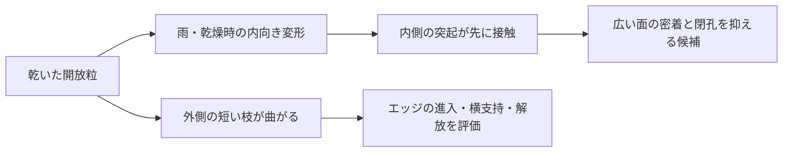

# 多方向探索第123巡：乾燥形状の保持と粒内ストッパーの設計
2026-10-10／Codex。実物試験0件、設備・協力先未確保、成功確率未算定。

## 今回変えた判断
「水に戻せば膨らむ」を、乾いた夏のバーンの形状保持と区別する。前巡のCA微細流路粒は凍結乾燥した観察像を含むため、自然乾燥への適用は未確認だった。新たに乾燥法を直接比較した原著を読み、**潰れた後の再膨潤に依存せず、粒内で面同士が密着する前に変形を止めるH123**を検討した。

[前巡の根拠](液中形状形成と母液循環の濃度管理_20261010/sources.json)、[第27巡の枝状粒と乾燥接着](枝状粒形成検証_熱選別と回収収支_20261008/sources.md)、[第91巡の薄枝と毛管閉鎖](多孔質焼結と緻密薄枝の製法比較_20261009/model.md)を再利用し、既存の梁計算を新規成果には数えない。

## 新しい一次資料
Hosseini・Spicer、*Significant size change during bacterial cellulose capsule drying*、2024年、[DOI](https://doi.org/10.1016/j.powtec.2024.120275)、[原著PDF](https://nonequilibrium.com/pdf/Hosseini%20Jelliyfish%20drying%202024.pdf)。

疎なセルロース繊維殻は、凍結乾燥と空気乾燥で形が異なる。空気乾燥で扁平化し、CMC処理は再給水時の復元を助けるが、乾燥中の扁平化は残る。無処理では復元しない。180℃の別実験では約10分の1の径まで収縮し、破裂例もある。これは30〜50℃の結果ではない。製法には2週間の培養、油相、NaOH処理を含むため、現地噴霧工程として採用しない。

これは細菌セルロースの結果で、CA、PK、PEの乾燥収縮率には転用しない。CMC浴濃度を完成粒の添加率・安全量・耐雨寿命へ置き換えない。本文の方法・結果・結論を確認した。図の画像取得は失敗しており、独自の画像寸法測定はしていない。

## 形状の評価を乾湿一往復で閉じる
完成候補は、同じ個体群について、製造直後の湿潤W0、常温乾燥D0、50℃乾燥D50、雨相当の再湿潤W1、再乾燥D1を追う。再膨潤W1だけの合格をやめ、D0・D50・D1で滑走に必要な形と支持が残ることを条件にする。物理的な合格幅は実雪との対応が未校正で、今回は数値を勝手に規格化しない。

仮想反例では、幅・長さが同じでも高さが0.1倍なら、上からの投影面積は100％のまま、同一形状係数での外形体積は10％になる。三方向が0.1倍なら外形体積は0.1％。これは計測の見落としを示す幾何例で、実測データではない。外形体積と樹脂そのものの体積、空隙率、床の充填率は別である。

## H123：内向きの潰れを止め、外向きの曲げを残す
自由な粒の内側に、対向する丸い突起を設ける。内側へ潰れると突起だけが先に当たり、広い面同士の密着を避ける。外側には短い開放枝を残し、エッジが入る際の曲げ・解放を担わせる。貫通する逃げ道を残し、袋状の閉空間を作らない。これは粒の構成案であり、滑走面をマット化する案ではない。

重要な反証条件は、突起が潰れる、横にずれて噛み合わない、突起自身が接着する、孔が目詰まりする、回転した粒で突起が滑走接点になる、枝の曲げまで早く止めて硬い砂の感触になる、という場合である。乾湿の接着を確実に防ぐと断定しない。

## 材料増と荷重集中の交換条件
まず対向する二枚の矩形片を局所構造の計算用代理にした。各600×600µm、厚さ30µm、初期間隙100µm。両面に高さ40µmの突起を4個ずつ置き、対応する4組が同時接触すると仮定する。間隙は理想的には80µmで止まり、接触前の閉じ量は20µm。80％は間隙の保持率で、粒全体の形状保持率でも成功率でもない。

|突起半径|二枚片に対する追加固体量|突起の名目圧力／面全体の基準圧力|
|---:|---:|---:|
|25µm|2.91％|45.84倍|
|50µm|11.64％|11.46倍|
|75µm|26.18％|5.09倍|

同じ総荷重を4組が均等に受ける幾何比較であり、実際の接触圧力、材料の許容応力、耐久性は未計算。小さい突起は材料を節約する一方、強い集中荷重を生む。配置のずれで1組だけが受ければ更に厳しくなる。開孔や曲率を含む最終形状では再計算が必要である。

135tの仮床材料のうち、上記二枚片に相当する部分を質量10％と仮定すると、追加量は約393／1,571／3,534kgとなる。これは10％で性能が足りるという意味ではない。材料単価が1円/kgなら追加原料費の係数は同じ数値の円。成形、型、検査、不良、乾燥、洗浄、廃棄は未見積で、設備2億円への適合を宣言しない。

## 四つの経路を比較する
|経路|残す利点・知見|今回の扱い|
|---|---|---|
|CA等の液中形成粒|流れによる形の作り分け|母液管理に加えて自然乾燥・雨後の形を確認|
|繊維殻＋再膨潤処理|繊維間の固着を弱める原理|水中復元を乾燥支持と同一視せず、外形保持の主機構にはしない|
|緻密な開放粒＋粒内突起|内部孔の潰れに依存しない幾何支持|H123として材料量と荷重集中を評価。50℃摩擦・摩耗は未実証|
|保持した分子結晶＋開放支持体|実際の結晶面を滑走接点に使う候補|支持体・結晶・接合部それぞれの乾湿変化と脱落を確認|

H123は既存の薄枝・開放粒と今回の乾燥固着の知見を結んだ未実証仮説で、特許上の新規性を調べた結果ではない。化学的な結晶成長を達成したものでもない。30℃以上で噴霧中に雪状粒が形成される目標は残す。

## 次の判別と目的への距離
最初の比較は同一母材の「突起なし／小突起／大突起」。寸法画像だけでなく、50℃の実ソール摩擦と双方の摩耗、エッジの貫入・横支持・抜け、粒間凝集を同時に判定する。枝・突起の湿潤時剛性、接着、50℃クリープが無いまま、幾何計算を力学保証へ進めない。

豪雨後は均した直後と再乾燥後の両方を見る。冬は雪との固着、床内部から下地までの荷重伝達、保水による弱層を確認する。完成材・添加物・残留物・摩耗粉の人体と環境への安全性、カビ、30°斜面、450mm床と300mm削れ代、表面マット禁止、60分復旧、年間費を引き続き満たす必要がある。

[32件の数値整合確認](乾湿で潰れない粒内ストッパーの成立条件_20261010/validation.json)は寸法・体積・荷重配分の計算だけで、滑走の実証ではない。成功確率はnull。前巡も今巡も進展ありと分類する。Claude台帳に更新は確認されず、[独立検証依頼](乾湿で潰れない粒内ストッパーの成立条件_20261010/claude_handoff.md)を共有する。受領・返信は未確認。
