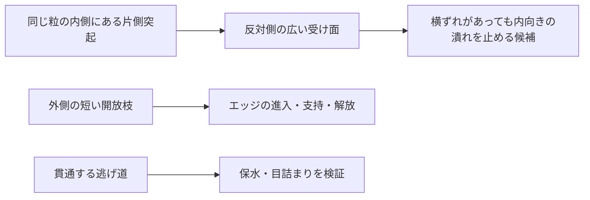

# 多方向探索第124巡：位置ずれに耐える粒内接点と付着の限界
2026-10-10／Codex。実物試験0件、設備・協力先未確保。成功確率未算定。

## 今回の変更
前巡の向かい合う突起は、相手の突起に正しく当たることを仮定していた。今回は微細可動部品の一次資料を参照し、**片側に突起を集め、反対側の広い受け面に当てるH124**へ展開する。位置ずれへの余裕と、突起を長くすることによる変形の増加を分けて計算した。

これは雪状材料の完成ではない。粒内の濡れ固着を減らす一つの機構案であり、滑走接点の材料、冬の接続、噴霧中の結晶形成は引き続き別の証拠を必要とする。

## 他分野の一次資料から分かったこと
Laborianteらの[多結晶シリコン接触研究（2010、DOI10.1163/016942410X508262）](https://doi.org/10.1163/016942410X508262)では、突起寸法を変えて測った付着力は、見かけの接触面積へ単純比例しなかった。少数の微小な凹凸が実接触を担うという解釈である。今回は出版社の検索索引にある抄録を確認し、本文直接取得は403で未読。高分子の付着力への数値転用はしない。

Michalikらの[CMOS-MEMS実験（2018、DOI10.3390/s18072111）](https://doi.org/10.3390/s18072111)では、低い突起に貼り付きが残り、残存酸化物を使う方法は工程条件に敏感だった。別方式の突起は改善したが、間隙ばらつきは残る。著者自身が実験規模から有意な製造歩留まりを結論できないとしている。[原著XML](https://www.ebi.ac.uk/europepmc/webservices/rest/PMC6069414/fullTextXML)の突起・関連結果・結論を確認した。

したがって、微細突起という既知の工学原理は参照できても、「面積を何％減らせば付着も同じ割合減る」「他分野で良かったから本粒の成功率90％」とはしない。半導体用の材質・薬液・被膜を人工フィルンへ採用したわけではない。

## 位置ずれの反例
[前巡の幾何模型](乾湿で潰れない粒内ストッパーの成立条件_20261010/model.md)を再利用する。600×600µmの基準面、半径25µmの円形平坦端面、4組の突起が均等に荷重を負担する仮条件。下表の圧力は、基準面全体の平均圧力に対する倍率であり、実測のMPa値ではない。

|中心の横ずれ|対向突起の重なり／元面積|対向突起の名目圧力倍率|片側突起＋広い受け面の倍率|
|---:|---:|---:|---:|
|0µm|100％|45.84|45.84|
|12.5µm|68.50％|66.91|45.84|
|25µm|39.10％|117.23|45.84|
|37.5µm|14.43％|317.66|45.84|
|50µm|0％|この接触経路を失う|45.84|

相手が同じ半径の突起なら、中心が直径分ずれると端面同士は支えられない。無限大の実圧力が生じると解釈せず、他の面への接触・塑性変形・崩れへ移るため、この模型の支持経路が終わると扱う。

片側案は、半径25µmの突起に対し、相手側に半径75µmの平坦な受け面を確保した場合。中心ずれ50µmまで突起の投影面積全体が受け面内に収まる。50µmは仮に設定した設計余裕で、製造公差や運転中の実測変位ではない。回転、傾き、摩耗、実接触面の変形は含まない。

4本のうち1本だけで同じ全荷重を受けるなら、名目倍率はさらに4倍。片側案でも約183.35倍となる。位置ずれへの改善と、荷重集中の解決は別である。

## H124の構成と材料量
内側に当たる突起を片側へ集め、反対側は排水用の開口を避けた受け面にする。外側の短い枝はエッジへの追従・解放を担う。受け面を全周へ広げて閉じた袋にせず、粒内から外へ通じる逃げ道を残す。

両側に高さ40µmずつあった突起を、片側の高さ80µmへまとめると、半径と本数が同じなら追加固体量は変わらない。ただし受け面が元の板部分に残っていることを仮定する。4つの受け面が占める投影面積は基準面の約19.63％で、そこを軽量化の穴として自由に抜くことはできない。

同じ材料量でも、長い突起は横へ曲がりやすくなる。そこで、下半分40µmの半径を50µm、上半分40µmの半径を25µmとした、根元だけ太い案を追加する。段差や付け根の丸み、製造誤差はまだ形状へ含めていない。

|局所案|突起の固体量／前巡|基準二枚片に対する追加固体量|梁模型での横変形量／前巡|
|---|---:|---:|---:|
|対向する半径25µm・高さ40µmの突起|1|2.91％|1|
|片側の半径25µm・高さ80µmの突起|1|2.91％|約2.60|
|片側・根元半径50µm／先端半径25µm|2.5|7.27％|約0.675|

最後の列は同じ材質・同じ横荷重を仮定し、曲げとせん断を合計した**理想的な梁成分の比較**。ポアソン比0.35、せん断補正係数0.9は仮定で、材料実測値ではない。両側案は二つの片持ち梁の直列変形、片側案は一つの段付き梁、板は剛体、荷重点の横滑りなしとする。

これらの突起は細長い梁とは言いにくい寸法なので、短い突起の三次元弾性、受け面のたわみ、接触、段差の集中応力を解くまで、この比を実物の剛性や寿命の保証に使わない。根元を太くした案を数値だけで合格にせず、詳細解析へ残す比較案とする。高い接触圧力と付着の未知は残っている。

## 採算と製造への含意
片側への集約だけなら突起の原料量は同じ。根元補強は突起部分を2.5倍にするが、局所構造全体への追加は7.27％という幾何比較になる。材料単価だけでなく、受け面の確保、段差・丸みの成形、型離れ、寸法検査、不良、摩耗後の再生を見積もる必要がある。

価格・生産能力・工程歩留まりの見積は未取得。半導体の微細加工コストを粒の量産費へ転用しない。整地設備2億円の暫定枠、60分復旧、年間運営費に適合したと宣言しない。

## 次の判別
1. 短い突起と受け面を含む三次元解析で、理想梁との差、傾き、一点荷重、根元集中を確認する。
2. 同一の完成母材で、突起なし・対向突起・片側一様・片側根元補強を比較する。接着と荷重集中を面積比だけから予測しない。
3. W0→D0→D50→W1→D1の乾湿履歴と、50℃の実ソール摩擦・双方の摩耗、エッジの貫入・支持・解放を同じ試料群で評価する。

これはPE/PK等の開放粒、CA等の温暖な液中形成粒、保持した分子結晶の各経路に対する機構検討であり、適用が証明されたという意味ではない。30℃以上の噴霧中に雪状粒を作る目標も維持する。安全・環境、カビ、冬の雪から床内部・下地への接続、雨後の組成と滑りの復旧、30°斜面、450mm床・300mm削れ代、表面マット禁止を引き続き満たす必要がある。

## 検証範囲
[共通部品](../計算部品/stop_misalignment.py)と[再現資料](粒内突起の位置ずれと片側受け面の比較_20261010/README.md)を保存した。円の重なりを独立した数値積分で照合し、細分化後の最大相対差は約5.58×10⁻⁷。梁の曲げエネルギーも別の積分で確認した。**59件は計算整合確認であり、実物試験や成功率ではない。**

前巡は位置ずれを未評価とした局所設計の進展、今巡はその制約を具体化し、受け面と根元補強の案を追加した進展。Claude台帳の更新は確認されず、[独立検証依頼](粒内突起の位置ずれと片側受け面の比較_20261010/claude_handoff.md)を公開共有した。受領・返信は未確認。成功確率null、実物試験0件。
