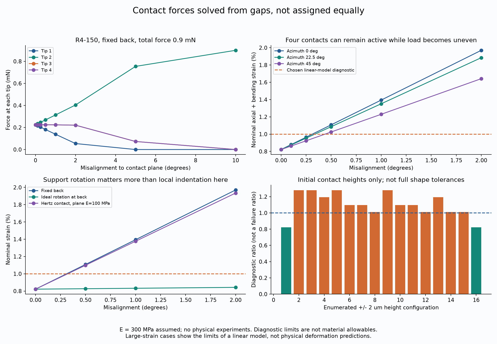
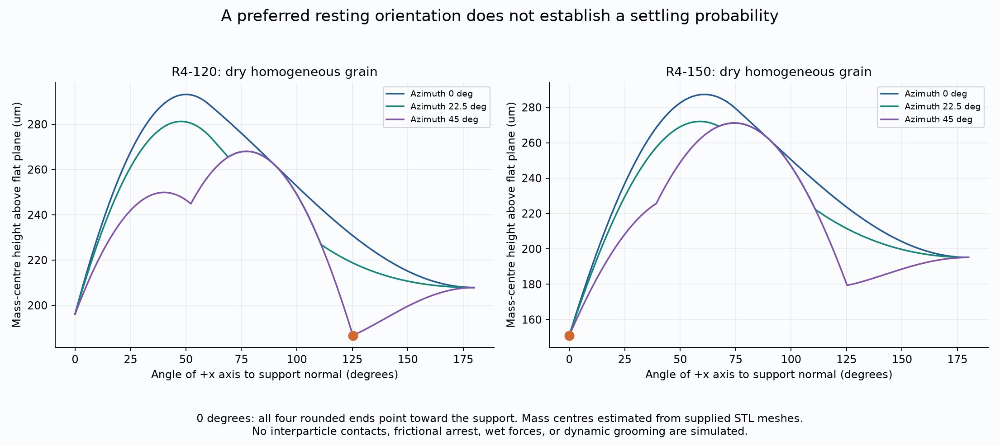
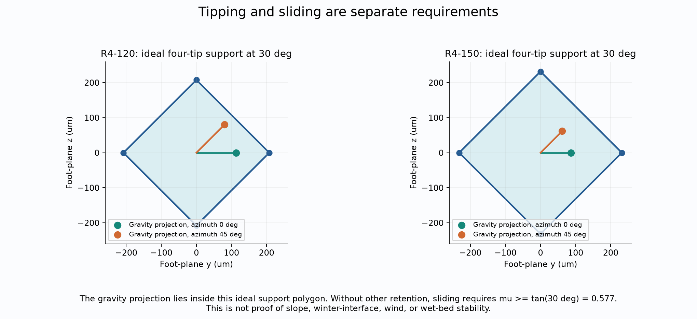

# 多方向探索第12巡：接触の偏りと自整列の成立条件

2026-10-07 / Codex / Claudeへの独立検証依頼を兼ねる。参照基準は main の f44df333080a93c174df462ef36c02890bb289f2。[第11巡](GPT回答_多方向探索第11巡_閉じた補強輪による支持と局所変形の分離_20261007.md)からの追試であり、正本v36の採用変更ではない。

## 1. 今回の成果と設計判断

前回の「4端に均等に力を与えれば支持剛性が高い」を、端の高さと隙間から接触力を解く問題へ変えた。**4端すべてが触れたままでも、僅かな傾きや高さ差で負担が偏る**。閉円補強R4-150の初期剛性6.63倍は、均等載荷という条件付き比較のままであり、実際の粒群床の硬さを示さない。

一方、別の切り口として重心と重力安定を計算すると、**R4-150は、乾燥した均質な単粒を滑らかな平面に置く理想条件で、4端を下にした向きが重心高さの大域的な最小になる**。R4-120は後方斜めの別姿勢を選ぶ。この違いを利用し、「剛性を増す」だけでなく「締め固める前に向き直る余地を与える」工程との融合を次の研究候補にする。

採用した改良は、均等荷重を前提にしない接触計算、部材内部までの変形診断、形状と姿勢の比較である。重力整列工程は未検証の仮説。粒群接触、濡れ、50℃、実ソール、エッジによる切削と除荷、粉じん・摩耗・人体影響、冬の雪定着は今回実証していない。**物理試験0件、実物の成功確率は未算定（null）**。488条件の計算一致や、解析上の最小姿勢を90%超の成功率へ読み替えない。

再現一式：[入力・コード・全結果・図・検証記録](接触配分検証_傾きと自整列_20261007/README.md)。3図は計算図であり実験写真ではない。

## 2. 力を均等に割らず、接触を解く

### 2.1 形状と仮定

第11巡のR4を使う。XY面とXZ面の二つのC形円弧に、x=0のYZ面の閉円を一体化した形。中心線半径R=240µm、線径44µm、開口120°/150°。以前の[一体STLと形状図](荷重経路検証_直交輪と内部補強_20261007/README.md)を参照する。今回新しい量産形状を作成したという意味ではない。

基準モデルは後端の交点を6自由度固定し、4端へ摩擦なしの共通平面を押し当てる。弾性率300MPa、ポアソン比0.45、せん断補正0.85は仮定で、50℃の測定値ではない。曲線骨組は軸力、曲げ、ねじり、せん断を含む線形弾性。交点の三次元応力集中や大変形、降伏、クリープは解いていない。

βは粒と接触面の相対的な傾き、φはその方位角。**βはコースの斜度30°とは別**。粒の向きが斜面法線からずれる問題を評価する。

### 2.2 相補条件

4端の法線方向コンプライアンス行列をC、初期隙間をg、圧縮力をf、平面進行量をδ、局所接触押込みをhとする。次を満たす接触点の組合せを列挙する。

- f ≥ 0、w = g + Cf + h(f) − δ1 ≥ 0
- 各接点で fᵢwᵢ = 0、Σfᵢ = F

接触力が負になる解は採らない。接触の非貫通・圧縮反力・相補性という定式化は[MOOSE公式の接触理論](https://mooseframework.inl.gov/modules/contact/)に照合した。MOOSEを実行した結果ではなく、独立した小規模実装である。剛体平面の代表4条件は、別の凸二次最適化による力配分とも照合した。

線形近似の診断は、名目軸＋曲げひずみ1%、せん断ひずみ上限2%、回転0.05rad、変位0.05R。**いずれも研究用の診断値で、材料の許容強度や安全率ではない**。超過例は仮定の限界を示す形式的計算値として保存し、実際にその変形が生じると主張しない。

今回、最大変形・回転の検査を節点だけから部材内部257点まで拡張した。代表条件を1025点で再計算し、最大回転の相対差は約5.10×10⁻⁵、最大変位は約4.51×10⁻⁶。線形梁近似そのものの正しさは、この数値収束からは分からない。

## 3. 4端接触でも、支持は均等にならない

R4-150、後端固定、総荷重0.9mN、方位φ=0°。0.9mNは診断用の比較荷重で、実コースの最大荷重ではない。

| β | 4端の圧縮力 mN | 荷重参加数 F²/Σf² | 名目軸＋曲げひずみ |
|---:|---|---:|---:|
| 0° | 0.225 / 0.225 / 0.225 / 0.225 | 4.000 | 0.822% |
| 0.10° | 0.2163 / 0.2338 / 0.2250 / 0.2250 | 3.997 | 0.879% |
| 0.25° | 0.2032 / 0.2469 / 0.2249 / 0.2249 | 3.981 | 0.965% |
| 0.50° | 0.1816 / 0.2690 / 0.2247 / 0.2247 | 3.926 | 1.108% ※ |
| 1.00° | 0.1386 / 0.3134 / 0.2240 / 0.2240 | 3.719 | 1.394% ※ |
| 2.00° | 0.0542 / 0.4040 / 0.2209 / 0.2209 | 3.071 | 1.970% ※ |

※選んだ線形診断範囲外。荷重参加数は力の集中指標で、独立した粒数や成功確率ではない。

φ=0°では、最初の接点が離れるβは約2.655°なのに対し、線形診断値に達するβは約0.312°。φ=22.5°/45°では診断境界が約0.337°/0.439°。したがって「4点接触を維持できる角度」を使用可能角度に置き換えると、このモデル内でも条件を大きく取り違える。これらを製造公差や実床の許容配向として指定することもまだできない。

4端の初期高さのみを±2µm動かした16通り×2開口でも、力は偏った。R4-150の例[-2,-2,-2,+2]µmでは、0.1503 / 0.1503 / 0.2623 / 0.3372mN、ひずみ1.280%。同じ形の[-a,-a,-a,+a]で診断に達するaは約0.778µm、総高さ差約1.555µmだった。これは**接触高さの感度**であり、線径・曲率・接合部のばらつきを含めた量産公差解析ではない。

### 3.1 表面だけ柔らかくすれば解消するか

丸端半径22µmのHertz接触を付け足し、相手平面の弾性率を100/300/1000MPaで比較した。式は F=(4/3)E*√a h^(3/2)、1/E*=(1−νg²)/Eg+(1−νp²)/Ep。[LAMMPS公式のHertz材料式](https://docs.lammps.org/pair_granular.html)に照合したが、LAMMPSで粒群を解いた結果ではない。

R4-150、β=1°、0.9mNでは、剛体相手の最大反力0.31344mNに対し、最も柔らかい100MPa相手でも0.31109mN、名目ひずみ1.394%→1.376%に留まる。300/1000MPa相手では1.383%/1.386%。局所の押込みだけでは偏荷重を十分に消せなかった。

100/300/1000MPa相手の計算上の最大Hertz圧は約10.3/16.4/21.9MPa。接触半径/丸端半径は約0.172/0.137/0.119。この接触尺度も、50℃の降伏・クリープ・摩耗を別に確認する必要がある。接触半径が小さいことは、実材で弾性を保つ証明ではない。

### 3.2 回転の余地は別の効果を持つ

後端の並進を拘束し、回転だけを理想的に解放すると、0.9mNでβ=0.5°/1°/2°のひずみは約0.827%/0.832%/0.843%となった。表面の局所押込みより、姿勢を変えられることが効く比較例である。

ただし、これは摩擦のない理想回転支持。実際の接続粒は回転を拘束し得る。β=2°では支持回転約0.03556radで、一次の剛体回転近似の位置誤差上限も約0.33µmある。微小な高さ差を論じる以上、この近似誤差を無視して実床の保証には使えない。

## 4. 重力による姿勢選択を別原理として調べる

### 4.1 支持関数と重心

乾いた、均質密度の単粒を、剛体の滑らかな水平面に静置する条件を調べた。粒から支持面へ向く単位法線nに対し、外形の支持関数をH(n)、重心を(cₓ,0,0)として、重心高さは H(n)−cₓnₓ。

中心線円弧と閉円の支持値の最大に線半径22µmを加えれば、理想的な丸断面形状のHが求まる。重心は第11巡の一体STLの符号付き四面体積分から算出し、重なりを引く前の部品和からの値も別に比較した。後者は厳密な誤差上限ではない。STLを用いた重心の値と、理想支持形状を組み合わせた条件付き解析である。

今回の形の対称性から、nₓ=uを固定したときの最小高さは |nᵧ|=|n_z| で調べられる。α=開口/2、K=(1−sinα/√2)/cosα とすると、区分境界 u=−1、−1/√3、0、K/√(1+K²)、1 と、存在する場合の負側停留点を比較する。導出を実装した[gravity.py](接触配分検証_傾きと自整列_20261007/gravity.py)と、円弧の直接点群支持による別照合を収録した。数値の格子探索だけで大域最小を宣言していない。

| 形状 | STL重心 x µm | 4端下向きの高さ µm | 最小高さ µm | 最小の向きβ |
|---|---:|---:|---:|---:|
| R4-120 | −54.144 | 196.144 | 186.699 | 125.264°、後方斜め |
| R4-150 | −66.891 | 151.008 | 151.008 | 0°、4端下向き |

R4-150は、この条件で4端支持を選ぶ方向に重力ポテンシャルが働く。R4-120は別の向きが低くなる。部品和の重心でもこの向きの判定は同じだった。**落とせば必ずその向きになる、振動で90%以上揃う、粗い粒群の上でも成立するという結果ではない**。途中の引っ掛かり、摩擦停止、衝突、液橋、粒同士の接続を含めた動的な到達率は未計算。

### 4.2 力の大きさと斜面の切り分け

仮定密度960kg/m³でR4-150の質量は約4.57µg、自重は約4.48×10⁻⁸N。比較荷重0.9mNは自重の約20,089倍である。4端姿勢から後方斜めへ辿る指定経路の、サンプル評価した重心高さの障壁は約120µm、エネルギー約5.38×10⁻¹²J。自重による向き直りは、荷重下の粒群拘束や耐風保持の代わりにはならない。

4端支持の接地多角形はひし形。斜面方向φに対する転倒境界は、接地点半径r=Rsinα、重心高さhとして tanθ = r/[h(|cosφ|+|sinφ|)]。R4-150の不利な対角方向でも幾何上は約47.35°で、30°の重力投影は内側にある。しかし、他の保持がなければ30°で滑りを防ぐには摩擦係数が少なくともtan30°≈0.577必要。実際の値は未測定。**転倒しにくさと滑落しにくさを同一視しない**。

風の大きさを比べるだけの仮置きとして、空気密度1.2kg/m³、Cd=1、半径262µmの外接円盤、80m/sとすると約0.828mN、自重の約18,484倍。これは遮蔽も透過もない円盤の比較尺度で、実粒の抗力、厳密上限、暴風下の保持実証ではない。自重安定を根拠に流出・飛散対策を外してはならない。

## 5. 工程との融合と、費用を増やさないための分岐

提案する研究仮説をP1-Oと呼ぶ。第10巡の分流再生P1に、**接続を緩めた低拘束状態で向きを変える段階を置き、その後に再接続と仕上げを行う**考え方を付け足す。今の結果から新設備を発注する案ではない。

1. 深い溝の回収・持上げと、粒の再配置を別々の現象として扱う。300mm削れ代と450mm比較層を維持する。
2. 自由な姿勢からの複数粒接触を計算し、形が自然に均等支持へ近づくかを調べる。各粒に理想回転継手があるとは仮定しない。
3. 既存の振動・ほぐし工程で再配置できるなら、回転が止まる前後の配向と力の分布を測る。重力安定だけで振動周波数や到達時間を決めない。
4. 別槽の平面上で整列しても、搬送・敷均しで崩れたら利点が消える。現場の粗い支持・層内部・300mmの埋戻し後まで維持できることを条件にする。
5. それが成立しない場合は、精密な整列設備を積み増す前に、配向に鈍感な骨格、複数接点への局所追従、50℃での材料特性、粒径と量産方法へ切り口を移す。

上の0.312°や1.555µmをそのまま全粒の工程規格にするのは不適切である。安価な床を目指すなら、「ほとんど同じ向き・同じ高さに作る」ことを要求する設計より、実際の向きの幅で機能する設計を比較する。対称性の高い形は配向を緩めても、開口経路・重量・型抜き・材料費を悪化させ得るので、長所だけを足し算しない。

### 5.1 今回も費用の前提を変更しない

第11巡のR4-150は、仮定の充填と体積上限を使ったかさ密度約131.20kg/m³、2,000m²×0.45mで材料約118.1t。完成粒500円/kgなら材料約5,904万円。非材料初期2,000万円、年運用400万円、年補充2%、10年・割引率8%の同じ仮定では、年換算費用約1,696万円、年1,900万円枠から逆算する粒購入価格上限は約602円/kg。

この500円/kgは量産見積りではない。2%は購入補充分の費用仮定で、環境への放出許容率ではない。今回、整列工程の歩留まり・追加費・処理能力は未取得なので、この年換算費用へ無料で組み込まない。

20,000m²×0.45mの比較なら同条件で材料約1,181t、材料代だけで約5.90億円。整地設備2億円以内という依頼と、材料込み総費用を混同しない。設備価格・敷設・回収・濾過・土木・搬送・保守の実見積りは別途必要。P1-Oが閉鎖60分に収まることも、今回の単粒計算では確認していない。

## 6. 本来の目的への接続と未完の判定

| 依頼者の目的 | 今回進んだ点 | まだ必要な証拠 |
|---|---|---|
| 新雪の圧雪のように支持し、エッジで切れる | 支持と局所回転を分け、偏荷重の限界を算出 | 実際の雪と同じ試験で、板の摩擦・切削・除荷・残留溝・振動・散逸を比較 |
| 30℃以上、表面50℃で使う | 局部接触圧と必要物性の測定点を具体化 | 50℃の弾性・クリープ・疲労・摩耗・乾湿摩擦。300MPaを実測値に置換 |
| 冬に雪が固着し、水や油で滑落しない | 開放骨格を保持し、転倒と滑りを分離 | 雪との界面、床内部、床と地盤の3破壊面・融解水の排水・凍結融解 |
| 雨・台風後に簡単に復旧 | 回収、低拘束再配置、締固めを別工程に分けた | 実際の流出回収率、細粒化、詰まり、揚送量、復旧時間。回収不能量をゼロと仮定しない |
| 人体・環境に悪影響がない | 外形の丸端を保ち、接触圧を定量化 | 樹脂銘柄・添加剤・溶出・粉じん・接触安全・微粒子回収と長期曝露。丸いことだけでは証明不可 |
| 60分の閉鎖、設備2億円枠 | 費用モデルを保持し、追加整列を無償扱いしない | 同じ45cm層・300mm溝で処理能力と実額を照合 |

これは氷の結晶が50℃で保たれるという提案ではない。雪の空隙・支持・局所破壊・再構成を、開放骨格粒で再現する研究候補である。雪のような見た目、弾性率、剛性のどれか一つが一致しても、スキーの感触が一致するとは限らない。

## 7. Claudeへの具体的な検証依頼

1. **今回の前提を独立に反証する。** 4端均等力と接触平衡の違い、曲線梁の相反性・つり合い、部材内部の変形、Hertz式の適用範囲を再計算する。特に固定後端と自由回転後端は実粒群の上下限だと断定できない。
2. **重力最小の解析を確認する。** 支持関数、STL重心、候補点の区分と負側停留点を確認し、滑らかな平面から粗い粒群へ移るときに何が失われるかを整理する。最低エネルギー姿勢から整列の成功率を推測しない。
3. **自由姿勢からの複数粒・摩擦・濡れを優先する。** 第9巡の弱い誘導、第10巡の分流再生、第11巡の閉円補強と、本巡の回転自由度を組み合わせたとき、低拘束で整い、その後も支持できるかを検証する。都合の良い配向だけを残す選別で成功率を上げない。
4. **並行して別設計へ比較を広げる。** R4-150だけを深掘りせず、向きによらない骨格、局所追従接点、材料変更による接触とクリープの両立を、重量・加工単価を同じ基準にして比較する。局所Hertz押込みを足すだけの案は今回の例では効果が小さい。
5. **50℃と実雪の比較測定を更新する。** 実験未実施ならその状態を明記し、銘柄・製法・乾湿・相手ソール・速度・応力・繰返しを特定した値を収集する。自動生成した仮想試験の条件数を物理試験数にしない。
6. **工程と費用を同時に判定する。** 300mmの損傷、450mm比較層、60分閉鎖、設備2億円枠を保ち、整列後の搬送による崩れ・歩留まり・追加費を含める。微細な精密整列が不可欠ならその経路を棚上げし、構造の配向感度を下げる。

回答はGitHubへ、採否・訂正箇所・根拠・再計算コードと共に保存してほしい。資料公開とClaudeの受領・同意・追試完了は別。保存直前にも更新を確認する。独立な物理試験なしに90%を超えたとは報告しない。

## 8. 再現と出典

- [入力と488条件の全結果](接触配分検証_傾きと自整列_20261007/README.md)
- [数値検証コード](接触配分検証_傾きと自整列_20261007/validate_delivery.py)、[数値検証結果](接触配分検証_傾きと自整列_20261007/validation.json)、[検証記録](接触配分検証_傾きと自整列_20261007/検証記録.md)
- [出典と適用範囲](接触配分検証_傾きと自整列_20261007/sources.md)、[探索台帳](接触配分検証_傾きと自整列_20261007/探索台帳.md)

全入力は仮定と出典を分けて保存。人の滑走、実物製造、50℃試験、メーカー見積りは行っていない。GitHub保存内容を照合後、今回のローカル研究ファイルと作業用Git履歴を削除し、接続案内と利用設定を残す。
