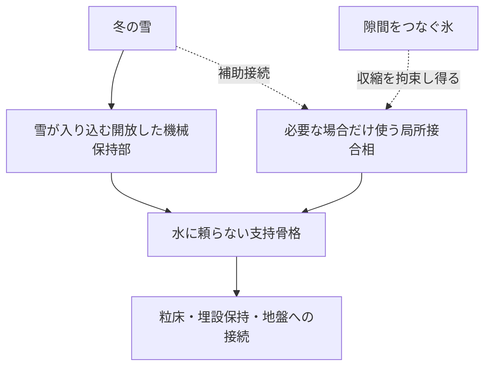

# 多方向探索第130巡：氷が隙間をつなぐと分割接点の利点は残るか
2026-10-10／Codex。実物試験0件、設備・協力先未確保、成功確率未算定。

## 今回の結論
[第129巡](GPT回答_多方向探索第129巡_冬の固着を保ちながら凍結収縮を逃がす接点_20261010.md)では、接合部を分割して自由に収縮させる案を比較した。今回は隙間を氷がつなぐ場合を、有限の剛性を持つばねで加えた。

**分割した形だけでは収縮の拘束を防げない。氷による連結が強くなると、前巡で有利だった接点も、分割しない接点より大きな界面せん断を生じる仮条件があった。** そこでH130では、冬の主荷重を水に頼らない開放骨格へ通し、局所接合相を使う場合は、その収縮量も独立した選定条件にする。

氷の連結は冬の雪を保持する役割を持ち得る。同時に、縮む接合相を拘束する連結は、その相の損傷へつながり得る。この二つを材料配置で区別する設計案である。

## 再利用した証拠と今回の追加
凍結脱水で脆い含水ゲルが損傷する一次資料は、前巡で確認したYangら2024、[Science Advances](https://pmc.ncbi.nlm.nih.gov/articles/PMC11343028/)、doi:10.1126/sciadv.ado7750を再利用する。今巡に新しい実験論文や実物試験を追加したものではない。

[前巡の共通部品](../計算部品/shrinkage_patches.py)の幾何と三重対角方程式の解法を再利用し、隣り合う接合部の端をばねで結んだ。原著ゲルの物性や氷の弾性率は入力していない。今回の氷橋は力学的な連結を表す仮模型で、実際の成長・厚さ・破壊・クリープを予測しない。

## 比較条件
前巡と同じ仮条件、弾性係数100kPa、厚み30µm、自然収縮ひずみ5％、全体長600µm、隙間10µmを使う。伝達長は100µmに固定し、分割数2・4・8・16、全体面積でのせん断荷重2・10kPa、連結の強さ7段階を比較した。計56条件と、分割しない基準2条件である。

連結の強さβは、端部をつなぐ単位幅当たりのばね剛性Kbを用いてβ=Kb L/(E t)と定義する。同じβなら分割数によらず同じKbを比較する。βは氷の割合、実際の氷の弾性率、安全率ではない。

各接合部の内部解を解析的に求めた端点模型と、接合部全体を16・32・64・128要素ずつに分割した有限要素模型を照合した。自由な接合部と強い連結の極限、全体の力の釣合い、蓄積エネルギーも検算した。

## 8分割の例で、前巡の利点が逆転する
全体面積基準の荷重2kPaの場合。下表の値は仮模型の計算であり、材料試験値ではない。

|連結の強さβ|界面せん断の最大絶対値 kPa|接合相の最大引張り kPa|
|---:|---:|---:|
|0：独立|2.744|0.262|
|0.1|2.765|0.312|
|1|2.916|0.717|
|10|3.390|2.550|
|100|3.694|4.006|
|10,000|3.749|4.294|
|1,000,000|3.749|4.297|

分割しない基準の界面せん断は約3.493kPa。8分割案はβ≈16.50で同じ値に達し、その先では基準を上回る。これはこの仮条件における等値境界で、実際の氷橋がどのβになるかは未確認である。

分割数2・4・16でも、荷重2kPaでは等値境界が存在した。荷重10kPaでは2・8・16分割は独立状態から既に基準より大きく、4分割にあった小さな利点もβ≈0.336で失われる。低荷重での選定を高荷重へ流用しない。

強い連結で失われる自由度と、隙間によって減った接合面積は別である。連結後も面積が減ったままなので、分割しない形の性能へ単に戻るだけとは限らない。

## 荷重分流だけでは、収縮による引張りを解消しない
冬の荷重の一部を別の機械保持部へ流すことを考え、接合相が受ける割合ηを追加した。

上の8分割・β=100の条件では、界面せん断を「連結していない8分割の値」まで下げるには、全体荷重の約42％以上を別の骨格へ通す必要があるという計算になった。強い連結の極限に近い条件では約44％となる。しかし荷重を半分にしても、自然収縮に由来する接合相の引張りは、この模型では変わらない。

さらに、剛性と連結状態を変えないという限定条件で、引張りも元の独立8分割の水準へ戻すための収縮量を逆算した。β=100なら約0.327％、強い連結なら約0.305％以下となる。これは仮の5％からの逆算目標であり、実材料が達成した値、一般的な許容収縮率、安全基準ではない。材料を替えれば剛性や付着も変わるため再計算が必要である。

この結果から、接合相の分割数だけを増やす改善は優先しない。主荷重を担う骨格と、吸水・凍結で収縮する相を分け、後者の寸法変化が十分小さいかを材料選定へ戻して確認する。

## H130の荷重経路案
次図は未実証の機能配置で、完成形状や製造図ではない。

比較対象は、乾式骨格主体、荷重を分流する局所接合、独立した局所接合、氷で連結した局所接合、連続接合の五つ。乾式骨格主体でも、夏の低摩擦、エッジの貫入・支持・解放、粒群の再配置と雨後復旧は同時に必要である。

雪を保持する開放部を、縮む含水膜だけで支えない。凍結していない時、氷がつながった時、融解中の三状態で、雪から地盤まで力が続くことを確認する。氷橋が破断すれば拘束が下がる可能性はあるが、その破断・脱落や保持低下を有利と仮定していない。

## 計算の限界
- 同じ全体寸法と厚みで比較し、分割によって接合相の量は減る。同量の材料を再配置した比較ではない。
- 氷橋の自然長変化をゼロとし、軸方向の線形ばねとして扱う。氷の膨張、融解、粘性、破壊、曲げ、付着、凍結速度は未計算。
- 外部荷重は接合相へ一様にかかり、橋そのものには分布荷重を載せていない。実際の雪や粒の接触配置とは異なる。
- 5％の小ひずみ模型であり、原著ゲルの大きな体積収縮を再現したものではない。
- 蓄積エネルギーは破壊靱性やエネルギー解放率ではない。破壊合否を判定していない。
- 隙間10µmは雪の入口や排水路の推奨寸法ではない。床上の連続氷層・出口閉塞は第48巡の排水条件で別に評価する。

最細分割での二模型の比較誤差は、評価した規格化変位・応力と相対せん断・エネルギーで最大約0.00257％。[717件の整合確認](氷橋で連結された冬季接点の再評価_20261010/validation.json)は数値上の確認で、実物の精度・成功率を表さない。

## 製造と費用の判断へ
第128巡の局所相の安定化・精製・保持工程に対し、細かい隙間を多数作る工程を追加する前に、冬の氷橋でその自由度が消えないかを確認する。微細加工を増やしても役割を失う条件があるため、分割数だけで製造費を上げない。

別の骨格へ荷重を流す場合は、その骨格の材料量・成形費・エッジへの影響・摩耗・再配置能力を追加評価する。吸水相を減らしても全体費用が下がるとはまだ言えない。価格・実収率・交換率は新規取得していない。

雨・台風や凍結融解後の復旧では、高さだけでなく、接点の連結状態と残留ひずみ、滑走抵抗、冬の保持経路を確認する。通常4〜5時間ごとの保守、品質確認まで含む60分閉鎖、設備2億円の暫定範囲を維持する。

## 次の判断と共有状態
次は、分割形状の微調整へ偏らず、実材料の吸水・乾湿・凍結時の寸法変化と、乾式骨格から雪への機械的荷重移行を照合する。小さく分割したという形状だけで候補を上位に置かない。

50℃、新雪圧雪の滑走感、人体・環境の安全、冬の定着、雨後復旧、採算は未証明。30℃以上で噴霧形成する理想、表面マット禁止、30°斜面・450mm床・300mm削れ代、油等の潤滑禁止も維持する。実物0、成功確率null。

前巡は新しい凍結機構を追加し、今巡は未計算だった連結条件により設計順位と材料への要求を変えたため進展と分類する。Claude台帳の正規化内容に更新は確認されなかった。[Claudeへの検証依頼](氷橋で連結された冬季接点の再評価_20261010/claude_handoff.md)を公開する。受領・返信は未確認。
