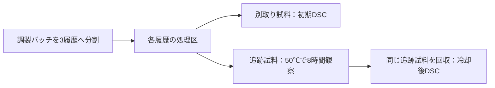

# 第135巡：雪状粒の50℃形状保持を実測へつなぐ試験仕様

2026-10-10 / Codex。実物試験0件、成功確率未算定、外部連絡・購入・発注0件。

**今回の成果は、国内の加熱観察の委託候補と、自由粒の50℃形状保持を確かめる具体的な照会仕様を結び付けたこと。** 試料の独立性を保ちながら3種類の熱履歴を同時観察できれば、8時間保持の合計を72時間から24時間にできる。ただし収容能力、温度むら、料金への反映、受託可否は未確認である。

[詳細仕様](雪状粒の加熱観察を依頼する仕様と試料割付_20261010/protocol.md)／[未送信の照会文](雪状粒の加熱観察を依頼する仕様と試料割付_20261010/inquiry_draft.md)／[割付と再現資料](雪状粒の加熱観察を依頼する仕様と試料割付_20261010/README.md)／[Claudeへの依頼](雪状粒の加熱観察を依頼する仕様と試料割付_20261010/claude_handoff.md)。

## 1. 既存成果を再利用し、欠けている測定へ進む

[第82巡](GPT回答_多方向探索第82巡_設備未確保から始める実証と試験費用_20261009.md)はKISTEC・JTL等の摩擦試験先と照会文を整理済み。今回、新規調査として数え直さない。第82巡の公開料金による基本試験費は履歴として残し、現時点の見積額として更新したとはしない。

[第133巡](GPT回答_多方向探索第133巡_PBSの樹枝状結晶を独立した雪状粒へつなぐ工程_20261010.md)ではPBSu/PEO樹枝状結晶と独立粒の間の工程が未確認。[第134巡](GPT回答_多方向探索第134巡_PBSの融点では決められない50度安定性と接点形成順序_20261010.md)では最終融点だけで加熱中の形状を判断できないと整理した。そこで今回の対象を「自由粒として作れるか、加熱中に枝を保つか」に置いた。

台帳にある第86巡の枝寸法・熱拡散尺度・未実施割付の計算は、今回の加熱観察の同時収容・DSC試料分割とは用途が異なる。既存資料を残し、割付部品のみ追加した。

## 2. 国内の具体的な照会先

第一候補は**山形県工業技術センター**。[公式機器資料](https://yrit.jp/wp-content/uploads/26_y-bake31.pdf)で、Nikon ECLIPSE LV100N POL、透過・反射観察、結晶性高分子等の観察、室温から400℃以上の加熱冷却ステージを確認した。機器を借りて自分で操作する区分は利用不可、委託分析の区分は顕微鏡写真・マクロ写真となっている。PDFの文字情報を確認。画像表示は取得エラーのため、写真の目視確認はしていない。

温度範囲に50℃は含まれるが、試料実温度の精度、8時間運転、3試料同時収容、自由粒の最小枝寸法・焦点深度、動画、荷重付加は未確認。倍率だけから微細な枝の測定可能性を決めない。

[委託利用案内](https://yrit.jp/mainwork/test/)では職員が試料を受け取って分析し、事前に方法・概算費用などを相談する。[料金案内](https://yrit.jp/mainwork/fee/)では技術相談は無料、委託試験等は有料、掲載料金は税込。今回の適用単価・数量・長時間加算・総額は未取得。機器掲載は当案件の受託承諾ではない。依頼者の所在地・利用資格も未確認。

補助候補の[日本サーマル・コンサルティング](https://therm-info.com/products/contract/)はDSC等の熱分析、クリープ等の受託を公表している。ただし同ページで自由粒の加熱光学追跡装置までは確認できない。DSCを同一機関で扱えるか、別機関へ分けるかは回答後に決める。

## 3. 結晶模様と独立した雪状粒を分ける

基板・希釈相に支えられた結晶膜の模様を、雪状の自由粒の実証としない。正確な品番・添加物・配合・形成/除去条件を先に確定する。PBSu/PEOの完全な配合と独立化条件はまだ未取得であり、分析機関に「完成試料がある」とは伝えない。試作支援の可否も別項目で相談する。

同一組成・原料ロットで比較する3履歴は、H1低温側形成、H2高温側で直接形成、H3低温形成後に熱調整。具体温度は予備観察後に固定し、80℃や100℃を無条件の推奨処理にしない。H1は研究用対照で、現地30℃以上の噴霧形成を達成したことにはならない。

観察は独立化の前後、30℃初期、50℃到達、0.5/1/5/8時間、30℃へ戻した後を対応させる。30→50℃を1 K/minで上げる案は照会用の初期設定であり、屋外昇温や粒の実温度を保証しない。

枝長・厚さ・分岐・融合・輪郭、同一点の位置と温度を追う。2D投影から3D空隙や支持力を断定せず、偏光の明暗だけで融解と決めない。焦点外への移動、方位、基材への付着、カバーや支持面による拘束を記録する。

## 4. 試料と実験の独立性

独立に調製する3バッチを、それぞれ3履歴へ分ける。計9処理区から、初期DSC用D0と加熱観察後DSC用HD1の2つを取る。

予定は18物理試料、9加熱追跡試料、初期9＋追跡後9＝18DSC測定。追跡粒を回収し必要質量を確保できるか、支持材混入がないかは未確認。別取りが必要なら追加し、「同じ粒の前後」とは言わない。

初期DSCは試料を加熱して熱履歴を変更するため、その試料を未処理のままの対照として再使用しない。追跡後DSCは50℃保持に加えて冷却・保管の履歴を含む。50℃での瞬間構造と同一とは扱わない。

7時点×9＝63の予定観察は繰返し測定であって、63回の独立した成功ではない。3調製バッチは3原料ロットでもない。試料・バッチ・装置運転の識別子を保持する。

## 5. 費用を抑える具体案と未確定額

各履歴の形成処理は別々に済ませ、その後の同一50℃保持を共通化する。

| 1運転に収容できる履歴数（仮定） | バッチを混ぜず必要な運転数 | 保持8時間だけの合計 |
|---|---:|---:|
| 1 | 9 | 72時間 |
| 2 | 6 | 48時間 |
| 3 | 3 | 24時間 |

3履歴同時なら保持だけで48時間減る。予約日数、技術員の作業、撮影数、総料金の66.7%削減を保証する値ではない。写真数課金なら運転共通化が減額に直結しない場合もある。

バッチごとに履歴の設置位置を循環させ、位置と処理履歴を固定的に重ねない。ただし温度むらそのものは解決しないので全位置の温度と分解能を確認する。同じ運転に由来する共通誤差も残す。

見積は、予備適合確認、試作/独立化、支持台と温度確認、保持、写真/動画と再焦点、DSC、回収/前処理、残留分析、原データ、報告、送料・税に分ける。料金単位が試料・視野・写真・運転のどれかを確認する。自由粒が作れ、画像が測定に使えると確かめる前に全18DSCを申し込まない。今回の総額は未算定で、既存の摩擦料金を転用しない。

## 6. 結果による発明の分岐

| 観測 | 次の設計判断 |
|---|---|
| 自由粒の枝が50℃で残る | 履歴を固定して荷重・クリープ・実底材/エッジへ。滑走成功とはまだ言わない |
| 高温形成又は熱調整だけが有効 | 形状歩留まり・費用と接点形成順序を比較 |
| 融点や偏光が有利でも枝が崩壊/融合 | 支持核上の局所成長、成形した開放骨格へ切り替える |
| 形状は残るが荷重で潰れる/粉化 | 支持部と有限の接点解放を分ける |
| 形状・荷重は通るが砂状又は濡れて泥状 | 滑り、再配列、微粉、排水へ戻す。結晶形だけで合格にしない |

現地30℃以上の噴霧形成、50℃で新雪圧雪の滑走とエッジ応答、雨・台風後の再配材、60分保守、冬の接続・排水、埋設下地の非露出、人体と環境、安全・費用は全て必須。この観察だけへ目的を縮めない。

## 7. 送信と共有の状態

[照会文](雪状粒の加熱観察を依頼する仕様と試料割付_20261010/inquiry_draft.md)は無料技術相談の内容で、試験申請や発注ではない。外部への連絡には人間からの明示の指示が必要なため未送信。会社名/個人区分・氏名・返信先メールアドレスも未入力で、公開文案に個人情報を含めていない。

Claude台帳のLF正規化SHA-256は前巡と同じ054c9388de3be3bd251c395059a9e02c9d3b336885236683ba3f528ff819d71f。新しい返答・受領・稼働は未確認。今回の仕様を共有正本へ置く。

次に必要なのは、自由粒の試作担当、観察適合性、DSCの接続、分割費用についての回答又は実測。公開機器の存在や仮物性の計算だけでは、この未確定部分を埋めない。
