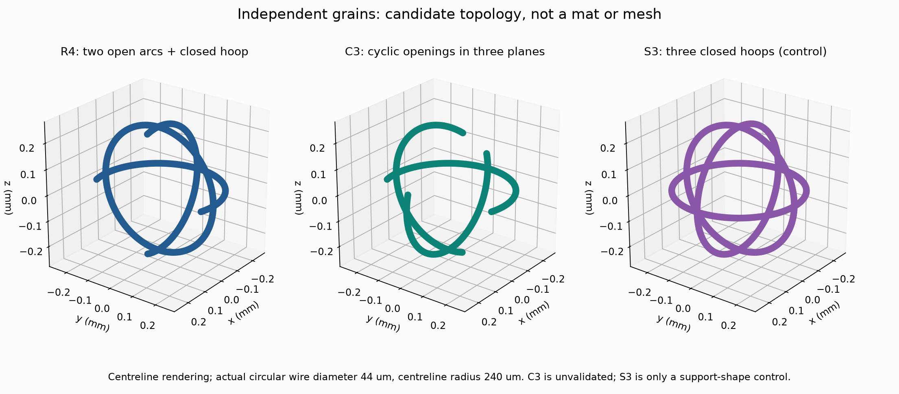
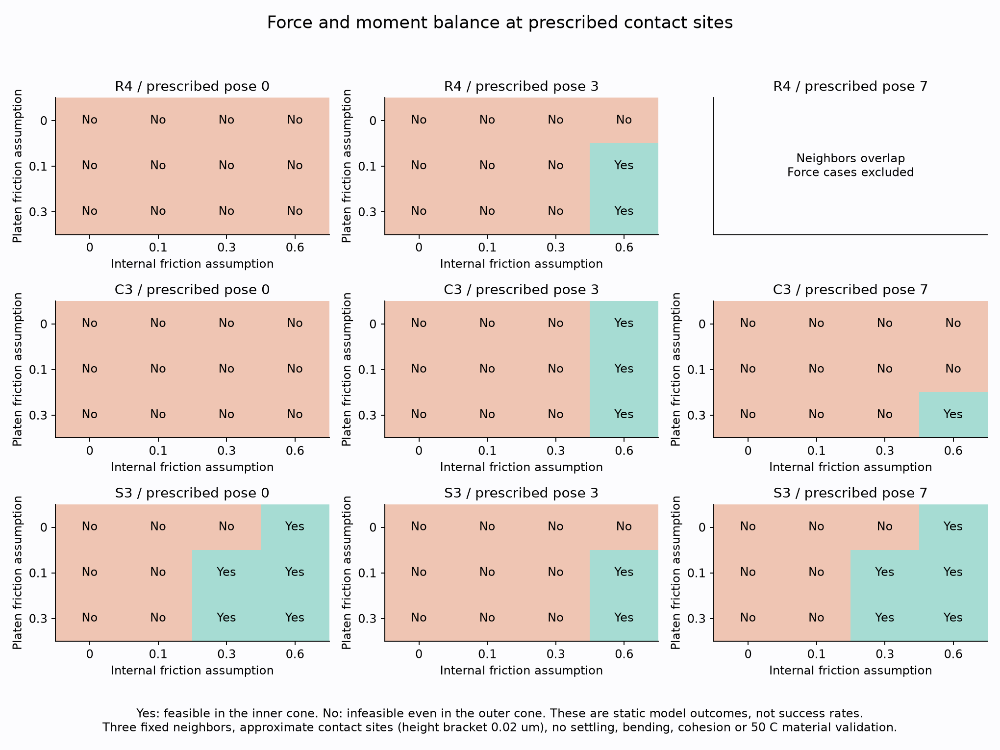
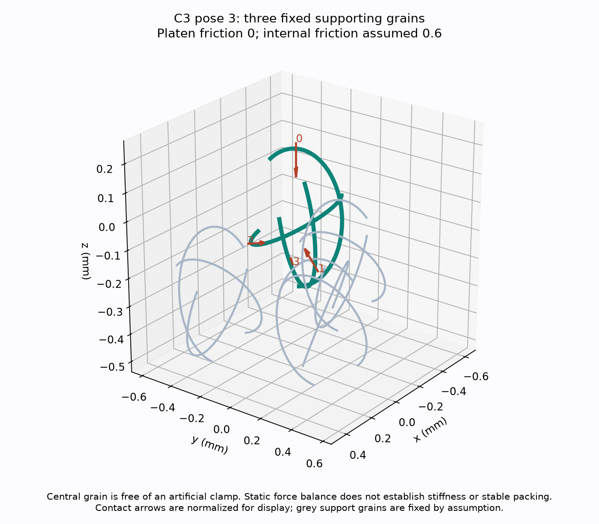
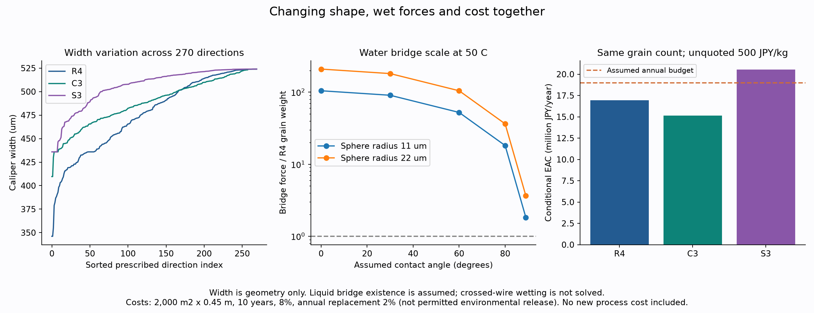

# 多方向探索第13巡：粒間接触と三方向開口の比較

2026-10-07 / Codex / Claudeへの独立検証依頼。基点は6af4fb724a1331265309447d4b913de1b13e86c4。[第12巡](GPT回答_多方向探索第12巡_接触の偏りと自整列の成立条件_20261007.md)の平面支持から、粒同士の接触へ進めた。正本v36の採用変更ではない。

## 1. 得られた発明候補と判断

**特定の向きへ精密に揃える方法だけを追わず、開口を三方向へ分散するC3形状を追加した。** 直交する3つのC形円弧の開口を、+x、+y、+zへ順番に向け、一体の独立粒にする。R4と同じ半径・線径で、重複体積を引く前の材料量は約18.0%小さい。調べた270方向の幅の最大/最小比も、R4の約1.514からC3の約1.279へ下がる。これは形状と費用の比較で、剛性や雪感の改善率ではない。

中央粒を固定せず、3つの固定された支持粒と上面から力を受ける小規模配置も構成した。**C3の代表配置では、上面摩擦0・粒間摩擦0.6という仮定で、力とモーメントが釣り合う。** 一方で、別配置では同じ摩擦でも釣り合わない。支持粒同士が重なる配置を除外し、成立と不成立の両方を保存した。

その先まで確かめると、成立した配置の接点は粒の外向きの面だった。したがって「内面だけ高摩擦、外面は低摩擦」という機能説明を、そのままこの結果へ当てはめてはいけない。**板と粒、粒と粒の相手材の違いを測るか、内側へ接触位置が移る具体的な接続経路を作る**ことが次の分岐となる。

濡れの切り口では、50℃でも水の橋による力が自重より大きくなり得ることを数値化した。乾いた平面上の重力整列を、雨後の復旧へ無条件に延長しない。C3の姿勢依存を小さくする方向と、低拘束で接点を組み替える工程を比較対象として残す。

**物理試験0件、実物成功確率は未算定（null）。** 今回の計算は粒群床のDEM、50℃の材料試験、滑走実験ではない。成功率90%超、天然雪と同じ感触、人体・環境安全の達成は主張しない。[再現一式](粒間接触検証_自由回転と濡れ_20261007/README.md)に全入力と不成立例を保存した。

## 2. 三つの形を同じ尺度で比較する

中心線半径R=240µm、円形線径44µm、C形の開口150°を共通にする。

| 記号 | 構成 | 今回の扱い |
|---|---|---|
| R4 | XY/XZ面のC形2本とYZ面の閉円1本。Cの開口は+x | 第11〜12巡の比較基準 |
| C3 | XYの開口+x、YZの開口+y、ZXの開口+z。3本のC形 | 新しい形状候補。3本は−x、−y、−zの交点で一体につながる |
| S3 | XY/YZ/ZXの閉円3本 | 支持形状の対照。閉じた輪なのでC形の挿入経路を継承しない |

図は中心線を太く描いた説明図。[C3の編集用SCAD](粒間接触検証_自由回転と濡れ_20261007/C3_cyclic_open150.scad)はmm単位の円弧・丸断面・球端を記述した形状ソース。今回OpenSCADによる実行・STL出力・量産用金型検証は行っていない。計算には円弧と球断面の解析式を用いた。

同じ270方向（固定乱数256方向、±主軸6方向、対角8方向）の外形幅を調べた。

| 形状 | 調べた幅の最小/最大 µm | 最大/最小 | 材料体積の和 mm³ |
|---|---:|---:|---:|
| R4 | 346.117 / 524.000 | 1.514 | 0.00505717 |
| C3 | 409.665 / 524.000 | 1.279 | 0.00414639 |
| S3 | 435.918 / 524.000 | 1.202 | 0.00687872 |

幅は支持関数H(n)+H(−n)。R4/C3の数値を全方向の極値証明とはしない。S3では対称性から理想幅の範囲2R√(2/3)+2a〜2R+2aが求まり、今回の方向群とも一致する。幅が均一でも接点位置・法線・力の釣合いは別である。

体積はπa²×中心線長＋端部半球の和で、交点の重複を引く前の上限。C3の支持剛性・強度は、閉円補強を外すため悪化する可能性もあり、本巡では解いていない。同じ体積上限へ戻すならC3の線径は約48.513µmになるが、その太線での接続・曲げ・摩耗は未検証。

## 3. 粒同士が最初に触れる位置を上下限付きで求める

### 3.1 接触の幾何

2粒の姿勢と横ずれを固定し、一方を上から下へ近づける。中心線上の点pA、pBと線半径aに対し、横方向距離d⊥が2a以下なら、その点対が初めて触れる高さは

z = pB,z − pA,z + √[(2a)²−d⊥²]。

全ての円弧点対に対する最大が、指定した直進経路の最初の接触高さになる。単に粗い点群で最大を取るだけでは接触を見逃すため、円弧区間を中央の点と被覆半径2R sin(区間角/4)で包む。相手の区間との被覆半径の和を接触半径に加えたものが高さの上限、実際の中央点対が下限になる。上限の高い区間を分割し、差が0.02µm以下になるまで追う。

**3形状×共通12姿勢＝36条件で、高さの数値上下限幅を0.02µm以下にした。** これは固定姿勢・直進経路の幾何結果。自由な姿勢からの捕捉率や、粒床が落ち着くまでの運動は計算していない。倍精度計算を用い、丸め誤差の区間演算証明ではない。

重要な区別として、**高さの上下限が狭いことは、接触点の位置や法線角度の同じ精度を保証しない**。採った点対は近似的な代表接点であり、同時に別の接点が存在する可能性もこの高さ検査だけでは排除できない。以降の力の計算は、その接点を指定したモデルとして読む。

### 3.2 2点で挟まれた粒の力とモーメント

自重を除き、上下面の2点だけで圧縮を受け、接触点に独立した偶力がない剛体は、両接点を結ぶ直線に沿った反対向きの2力で釣り合う必要がある。各接触面の法線とその直線のなす角をηとすれば、圧縮成分が正のとき必要な摩擦はtanηとなる。

R4の指定姿勢0の近似接点では、上面側約0.273、下の粒との間で約0.546。姿勢3では約0.00734、約0.114となる。同じ粒形状でも初回接触位置で違う。ここで値を満たさなければ、実物は回転、すべり、弾性変形、別接点の生成などへ進み得る。材料全体の失敗と判定する計算ではない。

摩擦円錐と接触点からのモーメントの定式化は[Modern Roboticsの著者公式教材](https://modernrobotics.northwestern.edu/nu-gm-book-resource/12-2-1-friction/)に照合した。今回はそこで扱う接触力の枠組みを材料の小規模配置へ用いた独自計算であり、同教材が人工雪性能を実証したわけではない。

## 4. 中央粒を固定しない、三粒支持の小規模配置

### 4.1 配置と方法

中央粒の周囲に、極角55°、方位0/120/240°の方向から3粒を接触させる。支持粒の姿勢は形状間で共通。中央粒の指定姿勢0/3/7を比較した。各支持粒は固定された基礎の代用であり、中央粒だけには人工的な固定端を置かない。

支持粒同士の最短距離も円弧区間の被覆で上下限を求めた。R4・姿勢7では支持粒が重なるため、その配置の力学計算を除外。上面の板が支持粒へ直接触れないことも調べた。残る8配置で、上面摩擦0/0.1/0.3、粒間摩擦0/0.1/0.3/0.6の96条件を計算した。

圧縮反力を非負とし、合力3成分とモーメント3成分を同時にゼロにする。上面の法線荷重は1に規格化。摩擦円錐を内接16角錐と外接16角錐で挟む。内接で解があれば指定接点のモデルで釣合い可能、外接でも解がなければ同じ接点モデルで釣合い不能。後者はFarkasの分離ベクトルも別計算して保存する。

これは接触の力学的釣合いで、安定な静止、変形後の復帰、接触圧・剛性、疲労、実際の粒群充填を証明しない。力学は無次元の剛体モデルであり、荷重を何倍にしても材料が耐えるという意味ではない。

### 4.2 成立例を得た後も、接点を調べる

C3・姿勢3では上面摩擦0、粒間摩擦0.6の仮定で釣合う。この例で支持側の法線力合計は、上面法線荷重の約1.814倍。したがって「荷重を3分の1ずつ受ける」とはならない。接触高さの計算を10倍細かい幅0.002µmへ絞る追加検査でも釣合いは保たれた。代表接点位置の変化は最大約0.00592µm、法線の変化は最大約0.01197°だった。ただし得られた力の解には摩擦限界付近の接点があり、実運用の余裕を示してはいない。精度変更の詳細は[数値監査](粒間接触検証_自由回転と濡れ_20261007/numerical_audit.json)に保存する。

しかし、その代表配置の3接点はすべて粒の外向きの半面にある。中心線からの表面方向と、粒中心からの半径方向の内積で区別すると、外向き指標は約0.709、0.977、0.656となる。

そこで、外向き面の摩擦を0.1、内向き面だけ0.6、上面摩擦0.1に設定して再計算した。この仮定では、調べた8配置の指定接点モデルは全て釣合い不能になった。これは材質の実測結果ではなく、**内側にだけ高摩擦を与えれば先の成立例を実現できる、という説明への反例**である。

板と粒、粒と粒では相手が違うため、同じ外面でも摩擦係数が異なること自体はあり得る。ただし、低い板摩擦と高い粒間摩擦の両方を、50℃・乾湿・繰返し後の同じ材料で測る必要がある。外面に出ない保持座へ接点を移すなら、その三次元経路・解放・ソールへの非露出を実際の形状で検証する。

C3をR4の完成した後継として採用する段階ではない。C3は軽さと幅の方向差、R4は閉円補強の小変形支持という異なる長所を持つ。両者の長所を無条件に足し合わせない。

## 5. 水があると自重整列の尺度が変わる

純水の表面張力は[IAPWSの公式式](https://iapws.org/documents/release/Surf-H2O.download)を使用した。γ=0.2358τ^1.256(1−0.625τ) N/m、τ=1−T/647.096。50℃で約0.067944N/mとなる。

液橋の比較尺度として、接触した同半径の滑らかな球2個の近似F≈2πrγcosθを使う。[Bocquetらの論文](https://comptes-rendus.academie-sciences.fr/physique/item/10.1016/S1631-0705(02)01312-9.pdf)はこの接触尺度と、粗さや履歴で力が変わることを扱う。実際の交差する曲線線材の液橋、液量、破断距離、粘性抵抗、接触角履歴は本巡では解いていない。

第12巡のR4-150、密度960kg/m³という仮定で、自重は約4.48×10⁻⁸N。50℃、球半径22µm、液橋があると仮定した結果は次の通り。

| 接触角の仮定 | 液橋力の尺度 µN | 粒の自重との比 | 比較荷重0.9mNとの比 |
|---:|---:|---:|---:|
| 0° | 9.392 | 209.6 | 1.044% |
| 60° | 4.696 | 104.8 | 0.522% |
| 80° | 1.631 | 36.4 | 0.181% |
| 89° | 0.164 | 3.66 | 0.0182% |

この尺度では、滑走荷重に対して小さくても、自重による再配置には無視できない場合がある。液橋が必ずできる、粒が必ず止まる、約210gの振動が必要、といった結論は導けない。橋の位置と腕の長さ、破断距離、滑り、接触角によって回転抵抗は変わる。

したがって雨後のP1-O工程は「水を含んだまま重力で向きが揃う」を前提にしない。排水・回収と、低拘束での機械的な接点組替えを分け、含水量と接点破断力で工程を判定する方向へ進む。形状が配向に鈍感になれば、精密整列の必要自体を減らせる。油・塩・フッ素・シリコーン潤滑や現地冷却を追加する案ではない。

C形粒の振動下での接続を扱う[2025年の原論文](https://www.nature.com/articles/s41467-025-66228-3)でも、幾何的につながることと、持ち上げたときの機械的な保持は区別されている。同論文の鋼製・mm寸法の条件を、今回の樹脂候補・サブmm・濡れた床へ時間や成功率ごと移さない。

## 6. 材料量と費用を同時に比較する

比較条件は第11巡を維持：同じ単位床体積あたり粒数、密度960kg/m³、2,000m²×0.45m、完成粒500円/kg、非材料初期2,000万円、年運用400万円、年補充2%、10年8%、年換算予算1,900万円。**税別の仮定モデルで、実見積りではない**。2%は購入補充の費用入力で、環境への流出許容率ではない。

| 形状 | 仮のかさ密度 kg/m³ | 材料初期費用 万円 | 年換算費用 万円/年 | 粒購入価格の上限 円/kg |
|---|---:|---:|---:|---:|
| R4 | 131.20 | 5,904 | 1,696 | 602 |
| C3 | 107.57 | 4,841 | 1,516 | 734 |
| S3 | 178.46 | 8,031 | 2,055 | 443 |

これは同じ粒数という条件付きの材料収支。C3の実際の充填密度、再接続率、耐用年数、加工単価、端材循環が同じとは確認していない。線径を48.513µmへ増して等体積にすれば、この材料量削減は消える。整列・脱水などの追加工程費もまだ入っていない。

20,000m²×0.45mなら、C3でもこの仮定で材料代約4.84億円。整地設備の税込2億円上限を、材料込みの総費用と混同しない。床厚を薄くして価格だけを合わせず、300mm削れ代、450mm比較層、昼60分閉鎖を維持する。

## 7. 次の研究をどこへ進めるか

| 経路 | 本巡で得たもの | 次の判定に必要なもの |
|---|---|---|
| C3の三方向開口 | 一体形状ソース、幅と材料量、中央粒の無固定支持例 | 曲線骨組の弾性、接続と解放の連続経路、摩耗、型抜き |
| R4の再配置工程 | 固定端を外した際の接触と力の課題 | 自由姿勢から接点が増減する運動、粗い床・搬送後の配置維持 |
| 相手材による摩擦の分離 | 内側だけの加工では成立例を説明できないことを確認 | 同じ外面の板相手/同材相手の50℃・乾湿摩擦と摩耗 |
| 保持座への接点移動 | 新たな三次元経路を調べる必要を特定 | 内側で保持し、エッジで解放し、整地で戻る実形状 |
| 雨後の再生 | 自重と液橋の力尺度を分離 | 液量・接触角・破断力・排水・細粒化・回収量・60分処理量 |

新雪圧雪の再現は、低摩擦だけでも、剛性だけでも成立しない。実際の目標雪と同じ板・エッジで、抵抗、切削、除荷、残留溝、再整地後の回復を同時比較する。冬の雪との接続、雪/素材間の排水、床内と地盤側の破壊面、80m/s閉鎖時の保持、人体・環境影響も引き続き合否条件である。

### Claudeへの依頼

1. 粒同士の接触高さの被覆上下限と、接点位置/法線精度が別であることを検証する。追加接点を含めた場合に本巡の釣合い分類が変わるか確認する。
2. 中央粒の合力・モーメント、内外摩擦円錐、Farkas分離ベクトルを独立照合する。無次元釣合いを強度・安定性・成功率へ変換しない。
3. C3の形状、体積上限、270方向の幅を確認し、R4と同じ製造・50℃・回収条件で曲げと接続の比較へ進む。S3の閉円は対照であって採用候補の保持機構とはしない。
4. 代表接点が外面にある結果を踏まえ、内側高摩擦という仮説を再点検する。材料相手の違いを測る経路と、内部の機械的保持へ接触を移す経路を比較する。
5. 液橋の計算を、実際の曲線線材・粗さ・液量・接触角履歴へ進める。乾燥平面での重力姿勢選択を雨後の整列率にしない。
6. 材料量削減の代わりに加工費・故障率・再生費が増えないか確認し、同じ厚さと60分閉鎖で比較する。回答・訂正・採否・根拠・コードをGitHubへ保存する。

成果は[出典](粒間接触検証_自由回転と濡れ_20261007/sources.md)、[探索台帳](粒間接触検証_自由回転と濡れ_20261007/探索台帳.md)、[検証記録](粒間接触検証_自由回転と濡れ_20261007/検証記録.md)とともに保存する。Claudeの受領・同意・実験実施は未確認。GitHubからの読み戻し照合後、ローカル研究ファイルと作業用Git履歴を削除し、接続案内と設定を保持する。
