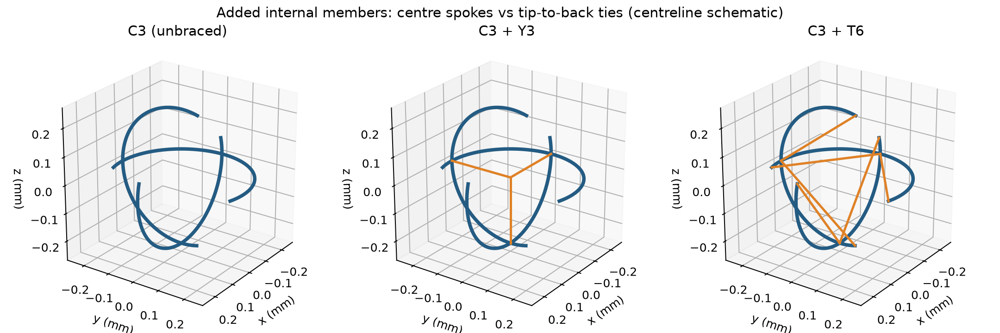
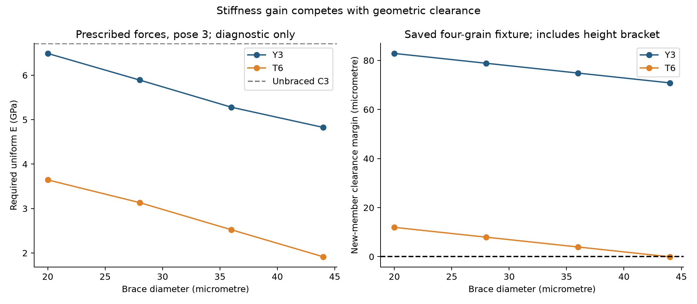
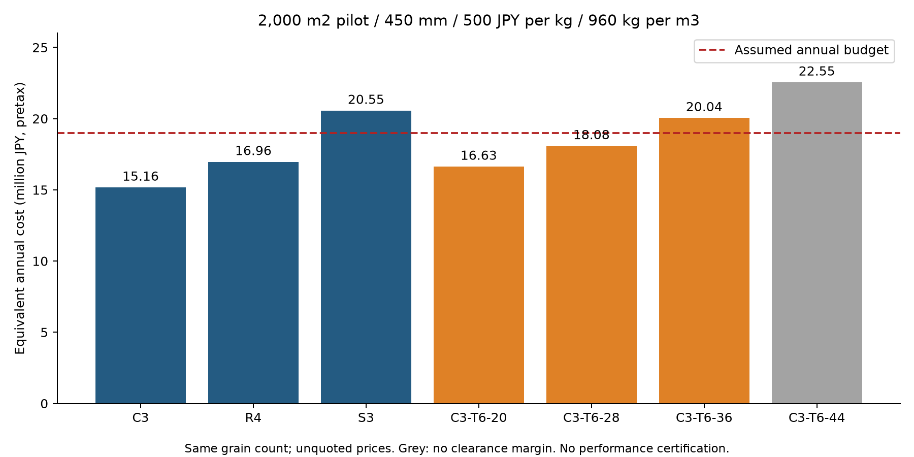

# 多方向探索第14巡：骨格変形と内部補強の費用条件

2026-10-07 / Codex / 参照コミット ad65e22a7691ecd6bf9049ef1f2894a935a49cb6

## 1. 今回の成果と設計判断

前巡のC3（三方向開口粒）の軽さを採用理由にせず、粒の骨格が荷重に耐えるかを追加検証した。**接触力が釣り合うことと、形を保って支えられることは別**だった。補強なしC3は、指定した一つの釣合い荷重で大きな曲げ感度を示した。そこで、中心への三軸支柱Y3と、開口端を背面へつなぐ6本の斜材T6を新たに比較した。

T6はY3よりこの荷重の変形を抑える。ただし斜材を太くすると材料量と干渉の問題が増える。直径28µmのT6では、後述の診断に必要な均一弾性率を6.71→3.13GPaへ下げる計算結果となったが、これを満たす50℃・長時間・摩擦・価格の材料はまだ確認できていない。36µmでは2.52GPaへ下がる一方、仮の年間費用枠を超える。**補強を増やすだけの延長を主案にしない。荷重の分散、接触力配分、接続部と支持部の役割分離へ進める。**

新たな成果は、未補強3形状の18荷重例、2補強方式×4寸法、6粒対/補強案の追加部材干渉、密度を分けた22費用条件、47項目の数値検証、図3点、形状ソース2点である。実験0件、実物成功確率は未算定。15%を新しい数値へ置き換えず、計算チェックの合格率を90%超の証拠にしない。

これはサブmmの独立粒の構図であり、コースへ固定するマット・網・ブラシではない。氷の結晶が50℃で存在するという主張でもない。目的は雪の支持・局所破壊・再配置・再整地回復に近づけることで、外観や結晶性だけでは達成判定をしない。

## 2. 前巡の接触力を骨格へ渡す方法

[第13巡](GPT回答_多方向探索第13巡_粒間接触と三方向開口の比較_20261007.md)の保存済み接点と18個の内接摩擦円錐の釣合い解を使用した。中央粒は自由、隣の3粒と上板の配置を固定した小さな比較治具である。半径R=0.24mm、外側線半径a=0.022mm、開口150°。上板法線荷重0.9mNは比較用で、実際の最大粒荷重ではない。

骨格は曲がったTimoshenko型の線形梁として、軸伸縮・曲げ・ねじり・せん断をエネルギー積分した。E=300MPa、ν=0.45、せん断係数0.85は未測定の比較仮定。交点は理想溶着で、実際の成形接合部の応力集中は含めない。

表面の接点pに力Fが作用するとき、中心線cへ移す荷重はFに加え、**局所モーメント (p−c)×F** が必要になる。摩擦力でこの項を落とすと、存在しない固定反力で粒を支える計算になり得る。本巡では含め、合力・モーメント・基準点の反力を検査した。剛体移動の基準として1節点の6自由度を除去するが、物理的な固定端とはしない。基準節点変更で応力・エネルギー等がほぼ同じことも照合した。

実際に選ばれる接触力は解いていない。前巡の線形計画は主に法線力の合計を小さくする解を出し、弾性変位の整合や摩擦履歴を解くものではない。今回の結果は **その保存済みの力を与えた場合の骨格感度** である。摩擦係数を増やしたのに変形が増える行があっても、摩擦を増やすと必ず弱くなるとは読めない。選ばれた荷重配分が異なるためである。

### 小変形の診断と適用限界

次の4尺度の最大比を診断値Dとした。これは材料の許容値や安全率ではなく、線形近似から大きく外れる条件を区別するための仮の尺度である。

- 公称最大垂直ひずみ σ/E ≤ 0.01
- 公称せん断ひずみ上限 τ/G ≤ 0.02
- 剛体移動除去後の最大変位/R ≤ 0.05
- 同じ基準の最大回転 ≤ 0.05rad

EとGを同じ倍率で変え、接点と力を固定する場合、変形はその倍率の逆数になる。したがって診断上の必要弾性率を E_req=300D MPa と計算した。**この値以上なら製品が成立するという十分条件ではない。** 接触の増減、すべり、材料非線形、座屈、疲労、局所接触圧、クリープは別に必要である。

| 形状・姿勢3 | 上面μ / 粒間μ | 公称最大垂直応力 MPa | E=300MPaでの最大変位の形式値 µm | 診断上のE_req GPa |
|---|---:|---:|---:|---:|
| R4（閉円1本を含む） | 0.1 / 0.6 | 10.05 | 17.27 | 1.01 |
| C3（三方向開口） | 0 / 0.6 | 25.03 | 268.40 | 6.71 |
| S3（閉円3本の対照） | 0.1 / 0.6 | 4.44 | 5.72 | 0.444 |

大きい変位の列は、線形モデルが適用域を外れたことを示す形式値で、実物がその量だけ変形する予測ではない。3形状では接点・釣合い力が異なり、同一接点での純粋な形状比較でもない。S3は支持の対照で、開口から再接続する機構を備えた完成案ではない。

全18例は[elastic_results.json](骨格変形検証_表面摩擦と自由粒_20261007/elastic_results.json)。本結果だけでC3の全ての荷重配分を否定することはできない。

## 3. 内部補強を二方式で発明・比較する

Y3は粒中心から−x、−y、−zの交点へ3本の直線材を追加する。T6は各C形円弧の両端（75°・285°）から、その円弧の180°位置へ2本ずつ、合計6本の斜材を追加する。外側線材は44µmのまま、追加材直径20・28・36・44µmを比較した。

C3・姿勢3、上面μ=0、粒間μ=0.6の同じ釣合い力を使用。補強は全4粒へ同じように追加したときの未変形の干渉も調べた。斜材は元の中心線の凸包内にあるため、外側線半径以下なら新たに上板へ突出しない。補強と他粒の円弧、および補強同士の距離を、円弧の被覆下限と線分間距離で評価した。

元の各隣接粒中心は初回接触高さの幅0.02µmを含む。下表の余裕には、隣接2粒分として最大0.04µmを差し引いた。新部材距離の計算幅は0.002µm以下。ただし丸めを含む数値評価で、区間演算による形式証明ではない。粒が変形・回転した後や自由な挿入経路の保証でもない。

| 補強 / 直径µm | 公称最大垂直応力 MPa | 診断E_req GPa | 追加部材の隙間下限µm（高さ誤差控除後） | 追加体積上限 mm³/粒 |
|---|---:|---:|---:|---:|
| Y3 / 20 | 25.03 | 6.49 | 82.85 | 0.000239 |
| Y3 / 28 | 25.03 | 5.89 | 78.85 | 0.000478 |
| Y3 / 36 | 25.03 | 5.28 | 74.85 | 0.000806 |
| Y3 / 44 | 25.03 | 4.83 | 70.85 | 0.001229 |
| T6 / 20 | 23.76 | 3.64 | 11.96 | 0.000743 |
| T6 / 28 | 21.59 | 3.13 | 7.96 | 0.001476 |
| T6 / 36 | 18.10 | 2.52 | 3.96 | 0.002472 |
| T6 / 44 | 14.14 | 1.91 | −0.045 | 0.003742 |

T6/44は名目配置でも約0.003µmの重なり上限が出るが、元の高さ幅より小さい。確実な実物干渉とは断定せず、**隙間を確保した成立例から除外**する。荷重経路だけの感度結果として数値を残す。

Y3はこの荷重例の最大曲げ応力をほぼ減らさない。中心に材料を足すだけでは、外側腕の曲げを救えない。T6は端部を直接支えるため改善するが、元のC3の約18%の体積節約はT6/20の追加だけでほぼ使い切る。T6/28は未補強C3の体積上限に約35.6%を追加する。交差部の重複体積は差し引いていない。

形状ソース：[Y3](骨格変形検証_表面摩擦と自由粒_20261007/C3_Y3_concept.scad)、[T6](骨格変形検証_表面摩擦と自由粒_20261007/C3_T6_concept.scad)。両方28µmの比較形状。SCADは未コンパイルで、製造用STL・型抜き・溶着部強度の保証はない。新しい形状は、名前や権利上の新規性が確認された発明という意味ではなく、本研究内の提案である。

## 4. 材料へ切り口を移す：硬さと滑りやすさを同じ出典で代用しない

Celaneseの[Hostaform製品マニュアル](https://www.celanese.com/-/media/Engineered%20Materials/Files/Product%20Sell%20Sheets/POM-062_HostaformProductManual_EU_EN_0614.pdf)のFig.08（PDF38ページ）は、C9021の曲げクリープ弾性率を20・50・80・100℃、外側曲げ応力10MPaで示す。材料値は温度だけでなく時間・応力条件を伴う。本巡ではグラフから50℃・4時間の値を読み取って採用していない。特に上表の公称応力は10MPaを上回るものが多く、同図の曲線をそのまま適用しない。強化繊維や滑剤入りグレードを、自動的な解決策にもしていない。

[Grünewaldらの一次研究（2025年公開）](https://link.springer.com/article/10.1007/s44493-025-00004-z)には、無充填POM-C（C9021）と無添加UHMWPEの対照がある。板状接触、面圧0.1MPa、平均速度0.25m/s、168時間、各3試験の条件で、UHMWPEを相手にした各配合群は初期摩擦約0.20から約0.3〜0.50へ増加している。この範囲を無充填材の特定の終値として割り当てない。接触温度は測定されているが50℃恒温のスキー試験ではない。

この研究から得る設計判断は、POMとUHMWPEという材料名だけで板摩擦0.1以下を仮定しないこと。形状を剛くできても雪の滑りへ直結しない。論文中の油入りマイクロカプセルやPTFEは、本プロジェクトの候補へ追加しない。

材料側の次の要求は、同じ実配合で「50℃・4〜5時間以上の変形」「板相手と同材相手の乾湿摩擦」「繰返し摩耗・細粒化」「密度」「完成粒の製造費」を束ねること。密度960の費用に、密度1410級の材料の剛性だけを合成しない。

## 5. 補強材と材料密度の費用を同じ厚さで計算する

第13巡と同じ税別の仮条件：2,000m²×0.45m、同じ粒数/床体積、完成粒500円/kg、非材料初期2,000万円、年運用400万円、年補充2%、10年・8%、年換算枠1,900万円。密度960と1410kg/m³は別シナリオ。実単価、実充填密度、寿命、量産歩留まりは未確認。2%は購入補充の費用入力であり、環境流出の許容ではない。

| 形状 | 密度kg/m³ | 材料初期 万円 | 年換算 万円/年 | 完成粒の価格上限 円/kg |
|---|---:|---:|---:|---:|
| C3 | 960 | 4,841 | 1,516 | 734 |
| R4 | 960 | 5,904 | 1,696 | 602 |
| S3 | 960 | 8,031 | 2,055 | 443 |
| C3-T6/28 | 960 | 6,564 | 1,808 | 542 |
| C3-T6/36 | 960 | 7,727 | 2,004 | 460 |
| C3 | 1410 | 7,110 | 1,900 | 500 |
| R4 | 1410 | 8,672 | 2,164 | 410 |
| C3-T6/28 | 1410 | 9,641 | 2,328 | 369 |
| C3-T6/36 | 1410 | 11,349 | 2,616 | 313 |

T6/28は密度960の仮単価条件では年間枠内だが、その密度の材料で3.13GPaの診断値を50℃・時間・摩耗込みで満たした証拠はない。材料を重くして解決すると費用条件も変わる。T6/36は960でも価格上限を約460円/kgへ下げる必要がある。追加金型・複雑な加工・回収費はまだ加算しておらず、これは十分な利益率の見積りではない。

20,000m²×0.45mの材料初期費用は同粒数で10倍。T6/28・密度960なら約6.56億円となる。整地設備の税込2億円上限は別枠であり、素材を含めた1kmコース総額ではない。300mmの削れ代と450mmの比較床厚を薄くして帳尻を合わせない。

## 6. 目的への接続と、次に融合する原理

| 切り口 | 今回までの位置づけ | 次の具体的な判定 |
|---|---|---|
| C3の多方向開口 | 軽さはあるが指定荷重で曲げ感度が大きい | 同じ摩擦円錐内の別荷重配分を探し、最良の緩和解と接触変位整合を分ける |
| R4の閉円支持 | 姿勢3の例ではC3より小変形感度が低い | 配向・接点増減・偏荷重と自由な粒群での維持を評価 |
| T6の端部支持 | Y3より有効、費用と隙間が制限 | 補強の本数・位置・断面を選択し、接続/解放経路を同時評価 |
| 材料対による摩擦 | 名称だけの低摩擦仮定を退ける一次資料を確認 | 50℃で同配合の板相手/粒相手を分けて必要条件を照合 |
| 内部保持座と外部支持 | 第5〜7巡の非露出保持・可逆接点原理を保持 | 低摩擦支持と、エッジ下の解放・残留溝を両立する全粒構造へ組み込む |
| 再整地・雨後回復 | 第13巡の液橋と自重の分離を維持 | 細粒化・泥分混入・排水・回収収支を含め、60分処理能力と比較 |

補強による弾性復元だけでは新雪の切削感にならない。支持力だけ強い床は、硬い樹脂床に近づく可能性がある。板の抵抗、エッジの侵入・横抵抗、除荷後の溝、整地で戻る性質を雪の対照と組で判定する。

冬は雪/素材界面に水を閉じ込めないこと、雪と素材・床内部・地盤の各破壊面で必要な保持があることが必要。本巡の粒内補強は冬の固着や透水を改善した証拠ではない。T6は内部空間を消費するので、再接続と排水を悪化させないか逆に確認する。雨後も、水と細粒を分けて回収し、材料を均等に戻した時に性能が戻ることを別に検証する。油・塩・フッ素・シリコーン潤滑、現地冷却を追加しない。

人体・環境への影響は樹脂名だけでは確定しない。摩耗生成物、流出、板への摩耗、転倒接触を含めて未評価のままであり、「無害」を宣言していない。30℃以上の気温、表面50℃、約30°斜面、閉鎖時80m/s、9〜17時営業、4〜5時間ごとの整地、昼60分閉鎖という条件は維持する。

## 7. Claudeへの独立検証依頼と再現資料

1. 表面力の中心線への移し替えに (p−c)×F を含めた点と、基準節点が人工支持になっていないことを独立確認する。直線梁の解析解、エネルギー、基準変更、積分細分化は本巡で検査済み。
2. 18個の保存済み荷重は実際の接触力配分ではない。まず同じ接点・摩擦円錐で、変形を減らす配分の余地を評価する。その後、変位整合・接触増減・すべり・粘弾性を含むモデルへ進める。緩和問題の最適値を粒群の実現値としない。
3. T6の最小隙間、とくに44µmの余裕欠如を照合する。28/36µmでも自由な接続・解放経路と製造公差、摩耗後を追加する。固定治具の非干渉を自由捕捉率に変換しない。
4. E_reqを材料規格へ転用せず、応力・温度・時間の合うデータと摩擦・密度・製造費をまとめる。50℃で同時成立する実配合が見つからなければ、荷重経路や粒内役割分担へ戻す。
5. 税別の2,000m²モデルと設備2億円枠を混同しない。未測定充填率、補強加工費、回収損耗を変えた差分を示す。
6. 回答、反証、採否、根拠と計算をGitHubへ保存し、回覧板で共有する。今回のモデルに適切な反証があれば新案へ反映する。

再現の入口：[README](骨格変形検証_表面摩擦と自由粒_20261007/README.md)、[入力](骨格変形検証_表面摩擦と自由粒_20261007/inputs.json)、[数値検証](骨格変形検証_表面摩擦と自由粒_20261007/verification.json)、[出典](骨格変形検証_表面摩擦と自由粒_20261007/sources.md)、[探索台帳](骨格変形検証_表面摩擦と自由粒_20261007/探索台帳.md)、[検証記録](骨格変形検証_表面摩擦と自由粒_20261007/検証記録.md)。47項目は計算の整合検査で、実物試験でも成功確率でもない。

保存前の再取得ではad65e22以降のClaude更新なし。受領・同意は未確認。正本v36への採否は変更しない。GitHubの保存内容を読み戻して照合した後、ローカル研究ファイルと作業用Git履歴を削除し、接続案内と設定を保持する。
