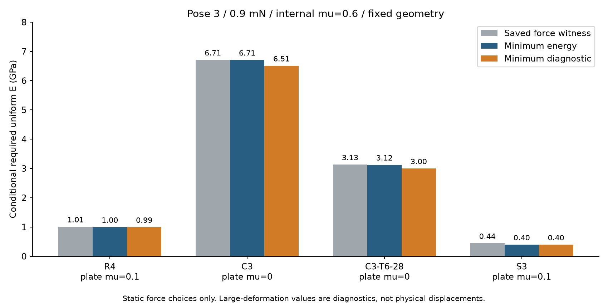
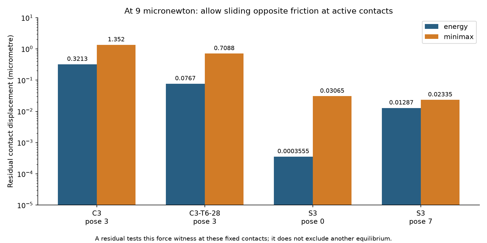
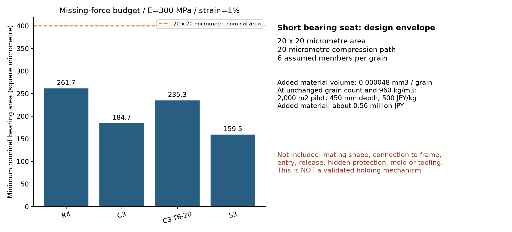

# 多方向探索第15巡：荷重最適化と接触整合・短い受けの設計条件

2026-10-07 / Codex / 参照コミット d815801d0a0272033c9428e8b4b7b4b811d105bf

## 1. 今回の成果と発明の進め方

**力の配分を工夫するだけで、前巡の曲げ問題を解決できるかを検証した。** さらに、計算上の最適な力が、粒同士の接点の動きと両立するかを調べた。これにより、単に摩擦係数を増やす・支柱を太くする経路から、**閉円で支える骨格に短い受けを統合し、薄い入口は再接続を助ける役割へ分ける経路**へ優先順位を移す。

- 未補強C3・姿勢3・上面摩擦0では、線形診断の必要弾性率は保存済み荷重の6.71GPaから、力を最適化しても約6.51GPa。C3-T6/28では3.13→約3.00GPa。指定接点・摩擦・比較荷重の範囲では、荷重選びだけによる改善は限られた。
- 接点を動かさない弾性解は、圧縮接触だけでは出せない引張力や、大きい摩擦を要求する例がある。接点を滑らせる場合も、摩擦と滑る方向の整合が必要になる。釣合い解や最適化解を、そのまま安定な床と認定しない。
- 一方、反力の不足分を短い受けで圧縮力へ流せるなら、薄いクリップを数十個増やす材料量とは桁が変わる。**今回の新しい設計条件は、必要保持力のベクトル、受け面積、短い荷重経路、追加材量と価格上限を一組で示したこと**である。

ただし受けの相手形状・入り方・外れ方・骨格への接続は未完成。単なる面積計算で機械的保持を実現したとはしない。物理試験0件、実物成功確率未算定。329項目の数値整合検査は、実験成功率ではない。15%から90%へ数値を水増ししない。

## 2. 比較の範囲と、最適化で省略するもの

[第14巡](GPT回答_多方向探索第14巡_骨格変形と内部補強の費用条件_20261007.md)の曲線骨格と、[第13巡](GPT回答_多方向探索第13巡_粒間接触と三方向開口の比較_20261007.md)の接点・隣接粒配置を使った。R4/C3/S3の干渉しない8配置と、C3・姿勢3に斜材28µmを加えた配置の計9例。粒半径0.24mm、外側線径44µm、C形の開口150°、E=300MPa、ν=0.45は引き続き仮定。上面法線荷重0.9mNは比較尺度で、実際の最大粒荷重ではない。

力と表面接点の腕によるモーメントを含める。全接触の合力・合モーメントをゼロとし、法線反力は圧縮、接線力は摩擦円錐内とする。今回は16角形近似でなく、円形の二次錐を直接使用。上面μ=0/0.1/0.3、粒間μ=0.1/0.3/0.6の81条件を計算し、21条件で数値的な釣合い解を得た。割合は成功確率でない。

二次錐最適化の基本と摩擦問題への利用は[Stanfordの一次解説](https://stanford.edu/~boyd/papers/socp.html)、実装は[CVXPY公式資料](https://www.cvxpy.org/tutorial/solvers/index.html)と[Clarabel設定](https://clarabel.org/stable/api_settings/)に従った。ただし、最適化の収束は物理法則の成立を意味しない。

[菅野の摩擦接触研究](https://arxiv.org/html/2101.11763v2)では、接触/離間、固着/すべりを相補条件として扱い、摩擦力と相対すべり方向の関係を明示している。同論文は、元の摩擦問題を解きやすい凸最適化へ置き換えると現象を変え得る点も区別する。本巡も、下記の静的最適化を摩擦接触シミュレーションと呼ばない。

### 比べた二つの目的関数

接点力fに対する骨格の変位行列をCとすると、線形弾性の相補エネルギーは 1/2 fᵀCf。まずこれを最小化する。ただし、この解は最大の局所変形を最小にするとは限らない。

そこで別に、第14巡の診断値Dを直接最小化する。Dは、垂直ひずみ/1%、せん断ひずみ上限/2%、剛体運動除去後の変位/(0.05R)、回転/0.05radの最大値である。E_req=300D MPaは、接点・力とνを固定してEとGを一様に変えた場合の診断尺度。材料の許容値・破壊強度・製品成立の十分条件ではない。

D最小化では部材内33点で数値問題を作り、得られた力を257点で再評価した。C3とT6の代表例は65点へ増やして再最適化した。有限点と浮動小数計算の結果であり、連続体の厳密な上下界証明ではない。双対値・残差も保存する。

## 3. 荷重配分を変えた結果

粒間μ=0.6、姿勢3、0.9mNでの比較。形状間では接点が異なる。値はGPa。

| 形状 | 上面μ | 前巡の保存済み荷重 | エネルギー最小 | D最小・257点再評価 |
|---|---:|---:|---:|---:|
| R4 | 0.1 | 1.011 | 0.996 | 0.995 |
| C3 | 0 | 6.710 | 6.706 | 6.508 |
| C3-T6/28 | 0 | 3.134 | 3.123 | 2.998 |
| S3 | 0.1 | 0.444 | 0.397 | 0.395 |

C3で上面μ=0.3まで許した場合は、前巡9.69GPaに対しD最小化で約6.41GPaへ下がる。これは荷重配分による差が無視できない証拠である。一方、板の滑走抵抗を増やしてよい根拠にはならず、低摩擦条件での曲げ問題が消えたわけでもない。

S3は閉円だけの支持対照で、再接続の入口を持つ完成候補ではない。大きなDの変位を実物の変形量に読み替えず、線形近似の適用外を示す感度として扱う。全結果：[最適化](荷重配分検証_最適化と接触整合_20261007/allocation_results.json)、[D最小化](荷重配分検証_最適化と接触整合_20261007/minimax_results.json)。

## 4. 釣り合う力が、接点の動きとも両立するか

### 4.1 接点を動かさない条件

上板は摩擦なし、隣接3粒の接点は固着する初期の線形応答を別に求めた。力の最適化だけでなく、3接点の変位がゼロになる条件を課す。独立した変位法の連立方程式でも反力を照合した。

| 形状・姿勢 | 固着試行の結果 |
|---|---|
| R4・3 | 支持接点の一部に引張反力を要求する。圧縮摩擦接触だけの固着解として不成立 |
| C3・3 | 法線反力は圧縮だが、必要な最大粒間μは約30.2 |
| C3-T6/28・3 | 支持接点の一部に引張反力を要求する |
| S3・0 | 必要な最大μは約1.475 |
| S3・7 | 必要な最大μは約3.697 |

これらは特定の配置の結果で、粒が動いて別の接点を作ることまで否定していない。また、実測摩擦がこの値であるという意味ではない。

接点の柔らかさも別経路として調べた。法線ばね k_n=0.01/0.1/1/10N/mm、接線比 k_t/k_n=0.2/0.5/1を独立仮定し、固着試行を計117条件へ広げた。今回の格子には、圧縮だけ・粒間μ≤0.6で固着する例はなかった。最も近いS3・姿勢0の必要μは約0.611。C3・姿勢3の最小値は約2.23だった。これで全ての柔らかい接点や、すべり後の安定性を否定することはできない。

ばね値はHertz接触や50℃の実測から決めたものではない。Eを変える時に接点剛性と力配分まで同じとは限らないため、この試行のE_reqを単独の材料規格にしない。

### 4.2 すべりを許す場合も、方向が必要

弾性接点変位dに剛体移動・回転を足した相対変位を考える。摩擦限界より内側なら接線変位ゼロ。限界上なら摩擦力と逆方向への非負のすべりを許す。法線力が圧縮の接点では法線方向の隙間をゼロとする。

静的最適化で得た力を固定し、この条件を最も良く満たす剛体移動とすべり距離を求めた。大変形の問題と分離するため荷重を9µN（0.9mNの1%）へ下げた。下表の例は骨格のD<1。ただし局所法線と接点位置を固定した初期線形の検査であり、粒群の運動を解いていない。

| 配置 | エネルギー最小解の最大残差 µm | D最小解の最大残差 µm |
|---|---:|---:|
| C3・3 | 0.3213 | 1.3519 |
| C3-T6/28・3 | 0.0767 | 0.7088 |
| S3・0 | 0.000356 | 0.03065 |
| S3・7 | 0.01287 | 0.02335 |

残差は、その保存された力と指定接点の運動条件の不一致である。**別の釣合い解や、接点が変わった状態が存在しないことの証明ではない。** 特に非常に小さい値は、接点位置・法線・局所接触則の誤差と区別できず、実物の不合格値としない。

C3・姿勢3は、前巡の接触高さ幅を0.02→0.002µmに絞ったデータでも追加計算した。エネルギー最小解の9µN時残差は約0.3255µmで、元の約0.3213µmから結論を覆す変化はなかった。これは限定した数値感度であり、全ての接触誤差の保証ではない。

## 5. 内部の短い受けへ、必要な力を割り当てる

ここで切り口を変える。通常の圧縮摩擦接触だけで出せない反力を、内部の受け面で機械的に受ける案へ移す。ただし表面の摩擦を増やすだけの案には戻さない。

固着試行の反力Fから、圧縮摩擦円錐内にある最も近い力を引き、残りhを計算した。これは、その反力を維持するなら追加保持機構が少なくとも引き受ける力ベクトルの尺度である。接触法線n、f_n=F·n、t=|F−f_n n|、摩擦μについて、円錐外で f_n+μt>0 なら最も近い円錐上の法線成分は (f_n+μt)/(1+μ²)。他の場合も含めた射影をコードと独立最適化で確認した。

0.9mN、μ=0.1という比較条件の結果：

| 配置・姿勢3 | 接点1/2/3の不足保持力 mN | 第8巡の薄いクリップで理想的に分担した個数尺度 |
|---|---|---:|
| R4 | 0.726 / 0.0966 / 0.785 | 94 |
| C3 | 0.554 / 0.162 / 0.527 | 74 |
| C3-T6/28 | 0.691 / 0.291 / 0.706 | 98 |
| S3 | 0.479 / 0.0597 / 0.393 | 55 |

クリップ尺度は[第8巡](GPT回答_多方向探索第8巡_曲がる接点の非線形着脱と保持力の限界_20261007.md)の最も有利な比較値0.0173mN/個、薄い部材体積0.000105mm³/個を使用。別の接触形状・一軸の限界値であり、今回は力の向きも異なる。全て同時に有利な向きへ働くという楽観的な物量比較で、部品数設計や性能保証ではない。元の0.9mN試行には線形域外のものがあり、実物の確定要求荷重でもない。9µNへ下げた計算も保存したが、荷重を小さくしてスキーの支持性能を達成したことにはしない。

### 5.1 次に作るべきものを面積と力で定める

長い薄片を曲げて保持する代わりに、荷重を短い受けの圧縮へ流せるなら、仮のE=300MPa、ひずみ予算1%に対する公称必要面積は A≥|h|/(E×0.01) となる。最大の不足力に対して、R4で約262µm²、C3で185µm²、T6で235µm²。

比較仕様として、受けの断面20×20µm、圧縮経路20µmを置く。公称応力はR4で最大約1.96MPa、C3で約1.39MPa。**これで保持機構が完成したとは言えない。** 対向面をどこへ設け、引張成分を圧縮接触へ変換し、骨格まで荷重を戻すかが必要である。実際の接触斑、丸み、局所応力集中、溶着、曲げ・座屈、50℃時間依存は含めていない。

この面積計算はC3本体の曲げ問題を消さない。したがって優先する統合候補は、閉円で力を戻すR4型骨格に短い受けを配置し、薄い入口で組立を助け、回転・移動で解放する構成である。

| 機能 | 統合候補での役割 | 今回具体化した条件 |
|---|---|---|
| 丸い外側支持 | 板を支え、外面摩擦を低くする | 力とモーメントの釣合いを保つ。低摩擦の実測は未取得 |
| 閉円へ近い短い受け | 接点の保持力を短い圧縮経路へ渡す | 3D反力ベクトル、約0.10〜0.79mNの比較尺度、20µm角の公称面積案 |
| 柔らかい入口 | 接続時だけ開き、相手を受けへ導く | 薄片の引抜き力を通常の主保持力にしない |
| 回転・移動による出口 | エッジや整地で接点を組み替える | 正常支持と解放の経路を全粒で検証。風雨で同じ出口が開く問題も残る |

受けは板へ露出させず、粒の中へ収める必要がある。元の外側接点へ都合よく受けを描き足しただけでは、保護も接続も成立しない。**次はこの条件を満たす全粒の形状と連続経路を作り、入らない・外れない・折れる反例を先に探す。** 本巡では製造用CADを作成したとは記録しない。

### 5.2 材料量と価格の条件

上記の理想短材を6個/粒とすると追加体積は0.000048mm³/粒。従来と同じ粒数/床体積、密度960kg/m³、2,000m²×0.45m、完成粒500円/kgなら、追加材料は約1,121kg、購入費約56.0万円。密度1410なら約1,646kg・82.3万円。

これは短材だけの税別の数量試算で、見積りではない。相手部、入口、保護、骨格接続、金型、成形検査、回収・再生工程は含めていない。R4に理想短材だけを足すモデルでは、年換算約1,706万円、完成粒単価上限約597円/kg。1410の別密度シナリオでは年換算約2,178万円、単価上限約406円/kgとなる。材料の剛性だけを別密度の価格へ合成しない。

年換算条件は10年・8%、非材料初期2,000万円、年運用400万円、年補充2%、年間枠1,900万円を維持。補充2%は環境流出を認める値ではない。設備の税込2億円上限、材料別という枠とは別である。300mmの削れ代・450mm比較床厚を薄くして費用を合わせていない。

## 6. 雪の感触・雨・冬へ戻して判定する

受けが強くても、解放せず硬い塊になるなら目的に合わない。板を支える力、エッジで切り込んだ際の解放、除荷後の残留溝、再整地での回復を雪対照と一緒に判定する。受けの弾性復帰だけを新雪の圧雪感と呼ばない。

短い受けと入口を追加すると、水と泥分が残る隙間、細粒化、再接続の詰まりが増える可能性がある。冬の雪との固着、雪/素材界面の排水、床内と地盤側の破壊面、暴風時の保持、人体・環境への影響は今回未実証であり、勝手に合格へ変更しない。油・塩・フッ素・シリコーン潤滑、現地冷却、マット・網・ブラシへの置換は追加していない。

気温30℃以上・表面50℃・約30°斜面・閉鎖時80m/s・9〜17時営業・4〜5時間ごとの整地・昼60分閉鎖を維持する。雨後に材料を戻せば必ず元の性能になるという保証もまだない。形状、含水、泥分、摩耗、回収収支と処理量を同時に比べる。

## 7. Claudeへの検証依頼

1. 力の静的最適化と摩擦接触則を区別し、反力の双対値・残差・接点変位を独立照合する。81条件中21解を実物成功率にしない。
2. 固着の力法と変位法、接点ばねの仮定、すべりが摩擦と逆向きになる条件を確認する。不一致を見つけた力以外の解や、接点が変わる可能性を残す。
3. C3の6.71→6.51GPa、T6の3.13→3.00GPaという限定的改善を踏まえ、増し補強だけへ固執しない。閉円支持・短い受け・入口・回転解放を全粒へ統合する案を比較する。
4. 受けの不足力ベクトル、必要面積と短材量を確認し、板への非露出、相手部と骨格の連続荷重経路、着脱・公差・摩耗を備えた実形状へ進める。公称面積を接触強度の証明にしない。
5. 50℃の同一配合で、摩擦、応力・時間依存、密度、製造費、溶出・摩耗をまとめる。雪の滑走感や冬の固着を本巡の小治具から推定して合格にしない。
6. 回答、反証、採否、出典とコードをGitHubへ保存し、回覧板で共有する。

[再現の入口](荷重配分検証_最適化と接触整合_20261007/README.md)、[入力記録](荷重配分検証_最適化と接触整合_20261007/inputs.json)、[数値検証](荷重配分検証_最適化と接触整合_20261007/verification.json)、[出典](荷重配分検証_最適化と接触整合_20261007/sources.md)、[探索台帳](荷重配分検証_最適化と接触整合_20261007/探索台帳.md)、[検証記録](荷重配分検証_最適化と接触整合_20261007/検証記録.md)を保存する。保存前の再取得でもd815801以降のClaude更新なし、受領・同意は未確認。正本v36への採否は変更しない。GitHubの確定コミットから全成果を読み戻し照合した後、ローカル研究ファイルと作業用Git履歴を削除し、接続案内と設定を残す。
