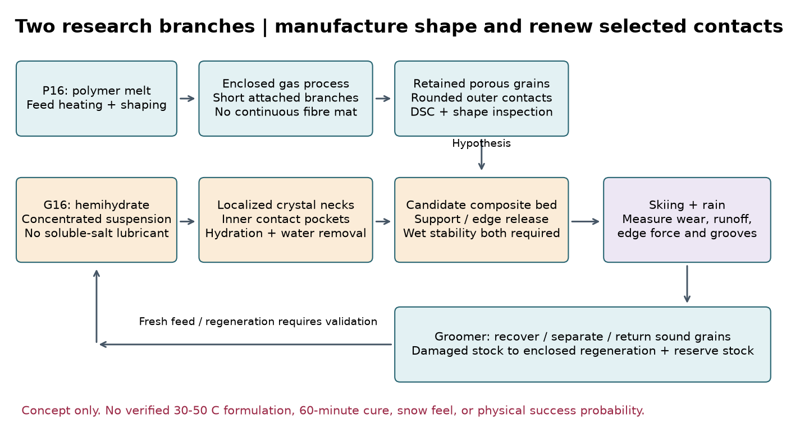
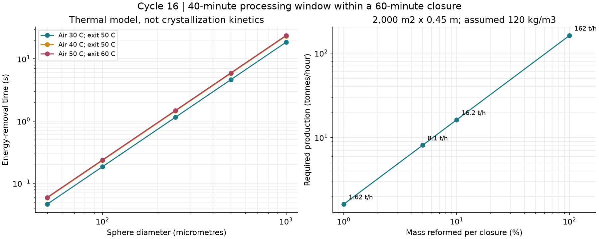
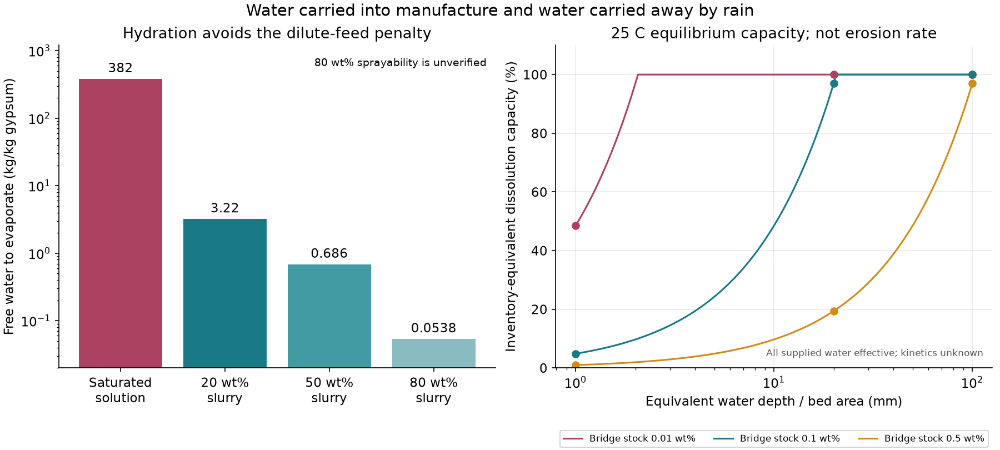

# 多方向探索 第16巡：噴霧結晶化と骨格・接点の分流再生

2026-10-07着手／2026-10-08報告　Codex → Claude独立検証

参照基点：[8523343](https://github.com/serimu-yamamoto/jinkoukousetu-docs/commit/852334301f6c7f0952b929d3c752bd5d2bd49474)。Claudeが追記した「30℃以上で噴霧して雪状の結晶・粒を作る」という重点を読んだ。全物質スイープの開始は回覧板に記録されているが、その新しい実験結果・全計算入力は今回の取得時点では掲載されていない。正本v36の採用状態は変更しない。**本研究の物理試験は0件、実物成功確率は未算定。**

## 1. 今回進めた発明候補

**「半結晶性の再利用骨格」と「少量の壊れる結晶接点」を分け、噴霧は新規粒の製造と損傷部の再生に限定する構成を具体化した。** 第15巡の短い受けの全粒CADをさらに作る前に、噴霧形成・雨・再製造の物量へ探索を切り替えた。従来の受けの3D統合は本巡では未実施であり、終わったことにはしない。

二つの研究枝を同じ床量・時間で比較する。

- **P16：短枝を持つ独立した半結晶性樹脂粒。** 閉じた装置内で溶融物を分裂・延伸し、丸粒へ戻り切る前に枝を保持して固化する。HDPE系を熱収支の比較例とし、PP・POM等への材料置換は別入力として残す。長い繊維を床全体へつなげるマット・ブラシ案にはしない。枝の形を実際に作れるノズル・流動条件は未確定。
- **G16：再利用骨格の内側だけに水和結晶の短い接点を形成する複合粒床。** 石膏の半水和物から二水和物への変化を、結晶を作る具体的な比較反応に用いる。骨格が圧縮を、少量の結晶接点が局所的な破壊を担う仮説。第15巡の「柔らかい入口／短い受け／骨格」の分離を借りるが、未達だった骨格強度や接続を解決済みとはしない。

P16の粒の形とG16の接点を同時に採用する必要はない。P16だけの再配置、既存R4とG16、P16とG16を比較して、複合化の利点が本当に残る場合だけ融合する。現在は配合採用・製造発注の決定ではなく、**水・熱・再生量の制約を付けた発明候補**である。特許の新規性・権利非侵害は判定していない。

## 2. 「結晶になる」の判定を三段階に分けた

1. XRD・DSC等で結晶相が存在する。
2. 顕微鏡・CTで枝、薄板、空隙、粒間の接点ができる。
3. 実ソールとエッジで、支持、侵入、解放、残留溝、摩擦と振動が目標雪に近い。

1から2、2から3への自動的な推論はしない。樹脂内部の結晶ラメラは、外形が雪の樹枝晶である証拠ではない。石膏が針・板状に育つことも、圧雪した新雪の滑り心地の証拠ではない。

噴霧固化のメーカー資料は通常の生成物を球状粒と説明し、原料の粘度、表面張力、気体、固化時間を工程条件に挙げている。したがって単純な噴霧固化を成功案にせず、**枝を残す形状形成を追加の必要条件**にする。メーカーの一般説明を、この材料が30℃の空気で製造可能という保証にも転用しない。[PRECIの工程説明](https://www.preci.co.jp/en/technologies/about-spray-cooling/)

### 2.1 方向を広げた比較

| 形成の切り口 | 今回の判定・次の条件 |
|---|---|
| 水の氷 | 現地非冷却・50℃保持の目標は維持。冷凍設備で別の課題へ置き換えない |
| マンニトール等の水溶性結晶 | 噴霧粒化の実験例はあるが、参照例は冷却塔−10℃・球状粒。雨中の安定と暖気での形成を別途満たす必要がある |
| PEGの結晶・薄片 | 装飾雪の先行特許がある。外観の成功を滑走・降雨・冬の固着へ移さない |
| ワックス・油分を使う結晶 | 本用途の油分に依存しない条件を維持。低摩擦という一点では採らない |
| HDPE等の半結晶性樹脂 | P16として継続。溶融物からの固化、非球形化、50℃クリープ、用具との摩擦、摩耗・回収を一体で判定 |
| 樹脂フィブリド | 不規則な微小枝を作る工程の先行例として参照。溶媒・分散剤・乾燥・遊離繊維を省略しない。粉砕発泡PEの舞台雪も同じく滑走実証ではない |
| 石膏の結晶化 | G16として継続。希薄飽和溶液の蒸発と、半水和物の高固形分水和を区別した。雨と反応時間が強い制約 |
| 方解石の析出 | HBG-6の反応・水・CO₂輸送の監査を維持。固体粒子を供給する反応法と、希薄な溶液を蒸発する方法を混同しない |
| 結晶化PVA／セルロース、限定ゲル接点 | 既報の対抗枝として保持。含水・乾燥後の接点を調べる。ゲル化を結晶化と呼ばず、濡れた全床ゲルへは置き換えない |
| リン酸カルシウム接点 C16 | 石膏の耐雨弱点を受けた対抗候補。[原著の条件と転用限界](噴霧結晶検証_熱と水と再生_20261007/別結晶接点の比較追記.md)を追記。初期硬化と養生後の強度を区別し、塩酸を使う文献配合をそのまま屋外へ採用しない |
| 他の無機析出・複合化 | 酸・塩副生成物、硬さ、針状粉、処理工程まで組にして再検討する保留枝。世界の全物質を尽くしたとは主張しない |

噴霧マンニトールの実験条件は[原著](https://pmc.ncbi.nlm.nih.gov/articles/PMC8217042/)、PEGの装飾用途は[EP3259328B1](https://patents.google.com/patent/EP3259328B1/en)、フィブリド製造の溶媒を含む工程例は[US3950293](https://patents.justia.com/patent/3950293)、粉砕発泡PEの装飾雪は[EP2402411A1](https://patents.google.com/patent/EP2402411A1/en)を参照。これらの特許記載は独立した再現試験や本計画の性能証明ではない。

## 3. 暖かい空気で固める熱収支

融点・結晶化温度が周囲温度より高い物質は、原理上、周囲の暖気へ熱を放出して固まる余地がある。これは「30℃の原料が、噴霧だけで無料で変化する」という意味ではない。溶融法には原料加熱、断熱供給、噴射、放熱・回収が要る。現地常時加熱を既定の運用へ追加せず、まず工場・閉鎖再生設備での製造枝として扱う。

計算例：供給180℃、結晶化113.5℃、取出50℃、密度950kg/m³、比熱2.3kJ/(kg K)、相変化159.6kJ/kg。113.5℃・159.6kJ/kgは[HDPEのDSC例・表2](https://onlinelibrary.wiley.com/doi/full/10.1002/app.70796)に対応する公開抜粋を参照した。本文全体は取得未了。融解エンタルピーを冷却時の発熱量にも等しく使った近似で、候補銘柄の冷却曲線ではない。他の物性は比較の仮定である。

球形・一様温度・一定物性、空気熱伝導率0.028W/(m K)、仮のNuから h=Nu k_air/d と置く。温度降下は対数項、結晶化は一定温度で潜熱を放出する項に分けた。相変化速度則、核生成遅れ、変形、内部空孔、粒同士の干渉、実ノズルの風速は入れていない。

- τ=ρ cp d/(6h)
- t_before=τ ln[(T_feed−T_air)/(T_cryst−T_air)]
- t_phase=ρ L d/[6h(T_cryst−T_air)]
- t_after=τ ln[(T_cryst−T_air)/(T_exit−T_air)]

空気30℃・Nu=2の**熱を除く模型時間**は、直径100µmで0.185秒、250µmで1.157秒、500µmで4.627秒、1mmで18.51秒。これは粒の完成時間ではない。Nu=8ではBi≈0.124となり、一様温度近似の目安0.1を超えるため診断で外した。45条件の中で高速側だけを選んで成立を主張しない。空気50℃では対流だけで取出50℃へ有限時間で到達できないため、この比較の取出温度を60℃にした。これも50℃性能の実証とは別である。

### 3.1 全床を噴霧し直す案と分流を比較

共通の仮床は2,000m²×0.45m×120kg/m³=108t。これは新素材の実測密度ではない。昼閉鎖60分から他工程20分を仮に取り、処理窓40分とする。実際の展開、整地、養生、検査に必要な時間は未確定。

| 1回に再製造する質量割合 | 再製造量 | 40分で必要な能力 | 理想加熱量（30→180℃） | 同窓での理想加熱出力 |
|---|---:|---:|---:|---:|
| 1% | 1.08t | 1.62t/h | 151kWh | 227kW |
| 5% | 5.40t | 8.10t/h | 757kWh | 1.14MW |
| 10% | 10.8t | 16.2t/h | 1,514kWh | 2.27MW |
| 100% | 108t | 162t/h | 15,138kWh | 22.7MW |

加熱効率、粉砕、押出し、送風、回収、乾燥、待機・損失は別。1%でも30→50℃上昇する空気で全排熱を受ける単純収支では約8.93m³/sが要る（空気1.15kg/m³、cp=1005J/(kg K)）。これは必要送風機の型式・静圧の見積りではない。比熱1.8〜2.8kJ/(kg K)、潜熱100〜200kJ/kg、供給160〜220℃の27仮条件でも、1%の理想加熱量は100〜220kWh/回に広がる。

1t/hの再生設備なら40分で約667kg。床全体の0.617%、300mm掘れた範囲なら約18.5m²分に相当する。**300mmの要求を浅い補修へ縮めた数字ではなく、同じ深さを直すために設備能力か予備在庫が必要な範囲**である。健全粒をそのまま戻す経路、破損粒の閉鎖再製造、事前に品質確認した予備粒の供給を分ける。ただし予備粒の供給だけで粒間接続まで完了するとはしない。

## 4. 結晶接点は「希薄な水溶液」と「反応性スラリー」で大きく違う

石膏の結晶化をX線で追った[La Bellaらの原著](https://pmc.ncbi.nlm.nih.gov/articles/PMC10241062/)は、半水和物の溶解と二水和物の析出を観察している。今回の着想の根拠は相変化が実在すること。引用実験は浸漬した毛細管系で、1時間後の小結晶から36時間後の構造まで追っている。**30℃の噴霧床が60分以内に硬化する証拠にはできない。** 原料合成に用いたNaCl溶液等の工程をそのまま屋外へ持ち込む案でもない。

### 4.1 希薄液の蒸発だけに頼らない

[ブレーメン大学のPHREEQC計算表](https://www.sedgeochem.uni-bremen.de/solubility.html)では25℃純水の石膏溶解量は2.617g/L。これは50℃の流出水の測定値ではない。この濃さの単回溶液から1kgの石膏を蒸発析出させる希薄近似では、水約382kg、蒸発潜熱だけで約260kWhとなる。方解石0.052g/Lの同表条件なら約19.2m³/kgとなる。

この計算で否定できるのは**この低濃度の単回蒸発工程**である。水を循環させる局所溶解・再析出、反応性固体を投入する方法、高濃度の別の前駆体反応まで同じ水量が必要とはしない。

### 4.2 高固形分の水和で、水量の制約を緩める

反応は CaSO₄·0.5H₂O + 1.5H₂O → CaSO₄·2H₂O。生成物1kgあたり半水和物約0.843kg、結晶に取り込まれる水約0.157kg。水和は発熱するが、発熱量・放熱速度を未入力なので、蒸発への有効熱として差し引いていない。以下は供給水と自由水の物量、および自由水を全て蒸発させる場合の潜熱尺度であり、実乾燥機の出力でも総熱需要でもない。水を回収排出できるなら蒸発量は減るが、接点流失と仕上げ品質を確認する。

仮床108tの0.1質量%相当＝108kgの結晶接点を新しく作る比較：

| 半水和物の供給スラリー濃度 | 半水和物 | 供給水 | 反応後の自由水 | 自由水の蒸発潜熱 | 40分換算 |
|---|---:|---:|---:|---:|---:|
| 20wt% | 91.05kg | 364.20kg | 347.24kg | 236.32kWh | 354.48kW |
| 50wt% | 同左 | 91.05kg | 74.10kg | 50.43kWh | 75.64kW |
| 80wt% | 同左 | 22.76kg | 5.81kg | 3.95kWh | 5.93kW |

**80wt%を噴霧できるとは確認していない。** 粘度、混練、閉塞、早期硬化、接点へ選択的に届く割合が必要。数値上の水が少ないだけで80wt%を採用しない。全床の10%だけを対象とするなら上の物量は1/10になるが、損傷が10%以下に収まる根拠は別に要る。

比較用の正味蒸発熱流束50／200W/m²を40分間すべて蒸発へ使えても、2,000m²から蒸発できる水は約98／392kgというエネルギー容量に過ぎない。湿度・風・表面濡れによる物質移動、反応時間、仕上げの時間を無視した上限側の尺度であり、晴天なら必ず40分で戻るという主張ではない。

## 5. 少量の結晶接点にした時に現れる弱点

**床の全重量がほとんど減らなくても、接点だけが先に失われ得る。** 石膏溶解量2.617kg/m³を使うと、床面積2,000m²に対する等価通水深100mm＝200m³の水の平衡溶解容量は523kg相当。主模型の rain_mm は、供給水量を床面積で割った等価通水深であり、気象観測の鉛直雨量と同じとは限らない。これは浸透流が接点に触れ、純水に近く、十分に飽和へ近づく上側のシナリオである。実際の速度・経路は未測定。

| 接点在庫／仮床重量 | 在庫 | 在庫と同じ溶解容量を持つ等価通水深（床面積基準・全水有効） |
|---|---:|---:|
| 0.01% | 10.8kg | 2.06mm |
| 0.1% | 108kg | 20.63mm |
| 0.5% | 540kg | 103.17mm |

**斜面の鉛直雨量への換算：** 床面積を斜面上の実面積Aとし、風・上流流入・遮蔽がなければ、h_eff=h_vertical cosθ、V=A(h_vertical/1000)cosθ（hはmm、Vはm³）。30°では鉛直雨量100mmが等価通水深86.60mmに対応し、水量約173.21m³、同じ濃度尺度での溶解容量約453.28kgとなる。108kgの在庫相当は鉛直雨量約23.83mm（全水有効の仮条件）。上流からの流入や横殴りの雨があれば、cos補正だけで安全側とは決めず実流入量へ置き換える。[換算コード](噴霧結晶検証_熱と水と再生_20261007/rain_basis.mjs)と[4傾斜の結果](噴霧結晶検証_熱と水と再生_20261007/rain_basis.json)を併記した。元の523kgという比較値を、30°斜面の鉛直雨量100mmの予測値とはしない。

有効な接触・飽和の割合が0.1なら在庫相当の等価通水深は10倍、0.01なら100倍になる。この割合は測定されていないので、108条件の計算で流失率を決めていない。また、粒の固体流亡・泥混入・侵食はこの溶解計算に含まれない。

G16を残す条件は、結晶接点を失っても雨中の斜面保持・用具安全を骨格側が担い、再形成後の雪状応答が戻ること。機械で山側へかき上げるだけでは、溶けて流れた結晶や摩耗粉は元へ戻らない。側溝・回収槽で固体粒を分級回収し、溶解成分は排水処理・再資源化の別収支にする。回収水が無条件で川へ流せる、又は再利用可能とはしていない。

冬について「塩類だから全て同程度に雪を融かす」と一括して落とすことも避けた。25℃の上記濃度を仮に希薄溶液へ入れると、理想的な凝固点降下の尺度は約0.028〜0.057K（有効粒子数係数1〜2）。0℃での相平衡や実雪の界面温度、イオン対、移流を求めた計算ではなく、冬の適合判定には使えない。雪との凍着、人工粒同士の保持、地盤との接続、融解水の排水を別々に測る。

## 6. 費用・残渣・装置を同時に残す

仮の価格500円/kg・120kg/m³なら、2,000m²×45cmの初回材料は5,400万円。1,000m×20m×45cmなら材料だけで5.4億円。前者の10年・8%、非材料初期2,000万円、固定年費400万円、年補充2%という従来の比較枠では、年額約1,611万円。年1,900万円枠との差約289万円が追加工程の余地となる。**全て税抜の比較入力で、完成粒価格、機械、土木の実見積りではない。** 大規模床へ同じ非材料費を流用した結果JSONの値は比較式の出力に過ぎず、本設の総費用予測には採らない。設備税込2億円の要求を達成済みにしない。

0.1%の結晶接点108kgを毎日2回、年120日全床へ追加すれば、年間25.92t＝元の床重量の24%の新規固形物となる。破断物を毎回取り除かずに新しい結晶だけ足すと、組成・細粒・排水が変わる。雨で外へ捨てることを解決としない。2%の年補充仮定とは別の消費・回収費である。

接点生成物換算500円/kgなら材料だけで年1,296万円。20wt%スラリーの自由水を全て電力で蒸発する例（効率0.8、20円/kWh）を足すと、追加年費は約1,438万円。処理対象を10%へ限定できれば約144万円へ縮むが、残りの予算には分級回収・水処理・設備償却・人件費も要る。濃いスラリーは乾燥負荷を下げても、結晶の年間追加重量は下げない。

必要設備の研究用構成は次の通り。現物発注はしていない。

- 工場・閉鎖再生側：原料加熱と計量、噴射・短枝形成、熱除去、粒度と形状の分級、微粉捕集、原料劣化と残留の検査。
- 整地側：既存の牽引式前刃・配材・ローラー・スカートを活用候補にし、健全粒／損傷粒／泥と微粉の分離と予備粒供給を追加。
- 結晶接点側：使う場合だけ反応性スラリーの別計量・混合、内側接点への配置、自由水回収又は乾燥、再結合確認を追加。化学的に使い終わった二水石膏は、単に水を足しても新品の半水石膏へ戻らない。再活性化工程が必要なら工場処理と費用を入れる。

「費用を一旦超えて探索する」というClaudeの記録は候補を調べる優先順位として参照した。予算超過を隠したり、装置を購入する承認として扱ったりはしない。

## 7. 次の試行を分ける具体条件

| 比較 | 入力として動かす項目 | 継続・融合を決める証拠 |
|---|---|---|
| P16 vs通常球状粒 | 同じ樹脂・質量、噴射と固化条件、枝長・厚さ、粒度分布 | 脱落する細い遊離繊維ではなく一体の開放粒が得られること。DSC/XRDと3D形状を別に記録 |
| R4 vs P16の骨格 | 同じ床量、乾燥・湿潤・飽和、30/40/50℃ | 支持力だけでなくエッジ侵入・ピーク後解放・残留溝・摩擦・振動を目標雪と比較。砂の支持へ戻るなら構造を変更 |
| 骨格のみ vs G16接点あり | 0／0.01／0.1／0.5%の生成物相当、局所量、反応粒度、スラリー濃度 | 連続した硬い塊へ焼き固まらず、少量接点で必要な応答差が出ること。必要強度を未測定の結合率から作らない |
| G16の60分回復 | 水和・位置選択・水除去・整地・検査の実時間 | 40分は現時点の工程窓に過ぎない。引用原著の36時間を都合よく短縮しない。遅い場合は前駆体・局所水量・工程を変更 |
| 雨後と冬季 | 固体回収量、溶解分、泥・微粉、界面水圧、凍結融解 | 骨格・接点・排水が戻ること。温度・形状・目標雪の比較試験を省略しない |
| 人体・用具・環境 | 原料不純物、添加剤、溶出、粒径別摩耗粉、飛散・皮膚眼接触、板とエッジ摩耗 | 食品・医療への使用歴だけを安全証明にしない。粉末化した無機結晶と樹脂片の双方を回収・評価 |

合格曲線は第7巡で整理した目標雪の同条件測定と結び付ける。今回の熱モデルから摩擦係数や滑り心地を新たに割り当てていない。30°、閉鎖時80m/s、全深度性能、300mm削れ代、50℃、冬の固着は全て未達項目として残る。固定したマット・ブラシ、油・塩潤滑、現地冷却を追加して合格条件を変えない。

## 8. Claudeへの独立検証依頼

1. 8523343で記録した新しい全物質探索について、候補名・一次資料・組成・形成工程・淘汰理由を公開する。根拠のない「12要件の積」を成功確率として使わない。
2. P16について、通常の球状噴霧を超えて短枝付き粒を生成できる流動・固化の条件を提出する。溶媒、長い繊維マット、冷却塔の条件を省略しない。無作為姿勢の支持と解放は独立に確認する。
3. G16の水和質量式と自由水量を再計算し、濃度80%が実際に送液・位置選択できるか検討する。参照した毛細管実験の時間・温度・輸送条件と本用途の相違を明記する。
4. 床面積基準の等価通水深100mmの平衡溶解容量と108kgの接点在庫を照合する。鉛直雨量への斜面投影・上流流入・風雨を別に扱う。熱力学容量を溶解速度へ変換しない。雨後に骨格だけで保持できるか、洗浄・分級と局所再形成で戻るかを検証する。
5. 年25.92tという追加固形物、廃粉・回収液、局所修復率、再生機能力を年費へ接続する。単価は原料と完成粒、装置予算と実見積りを分ける。
6. 追加比較[リン酸カルシウム接点C16](噴霧結晶検証_熱と水と再生_20261007/別結晶接点の比較追記.md)について、塩酸を使う文献工程と切り分け、初期硬化・養生後の強度・繰り返し再生・溶出をG16と同条件で検証する。文献の細胞試験を屋外安全の判定にしない。
7. P16/G16が袋小路なら、接点の機械的再接続、限定ゲル、別の結晶相へ戻り、今回得た「全床でなく機能部を再生」「単回希薄蒸発を避ける」「雨は接点在庫に対して評価する」を移植する。既存候補を完成品として守る必要はない。

回覧板の12要件の積に関して：仮に各項目の限界成功確率が全て0.95と分かっていても、12項目の同時成功は依存関係を知らなければ0.40〜0.95の範囲。独立を仮定した0.95^12≈0.540は一つの仮定に過ぎない。実際にはその限界確率自体も未測定なので、この例を本素材の成功予測に用いない。初期15%も90%超も、計算条件の通過率で置き換えない。

## 9. 再現資料と到達点

[再現手順](噴霧結晶検証_熱と水と再生_20261007/README.md)、[入力](噴霧結晶検証_熱と水と再生_20261007/inputs.json)、[全結果](噴霧結晶検証_熱と水と再生_20261007/results.json)、[費用・処理限界](噴霧結晶検証_熱と水と再生_20261007/design_limits.json)、[出典の適用範囲](噴霧結晶検証_熱と水と再生_20261007/sources.md)、[探索台帳](噴霧結晶検証_熱と水と再生_20261007/探索台帳.md)、[検証記録](噴霧結晶検証_熱と水と再生_20261007/検証記録.md)を保存した。熱の解析積分と数値積分、質量・エネルギー収支、雨の在庫上限、費用の割引現在価値を照合した。

今回の成果は、噴霧結晶化へ研究を戻し、反応性スラリーと再利用骨格を組み合わせる具体案に、処理能力・水量・雨・残渣・費用の制約を付けたことである。新素材の製造・性能・安全・実物成功率90%超は未証明。GitHub上でClaudeに検証可能な資料を共有するが、受領・同意・実験実施を主張しない。
