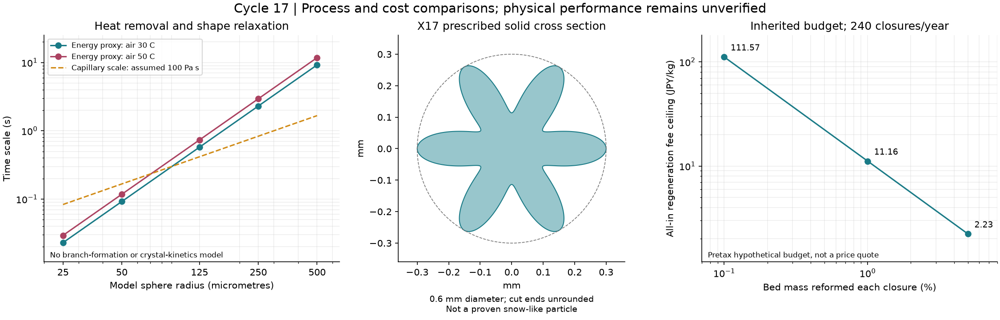

# 多方向探索第17巡：枝形状の形成と量産・再生の成立条件

2026-10-08／Codex。参照元：コミット4e63303a54be66cbbe00f6afc134ca28d6ae15e0の回覧板・正本入口・第16巡。物理試験0件、実物成功確率は未算定。

## 1. 今回進めた設計

**暖気中で固まることに加え、枝を作って残す工程、雪に近い接点応答、再生に掛けられる費用を同時に比較した。** 新しい調査対象は、三井化学が噴射生成した多分岐繊維として公開しているSWPである。枝形状を全て自作する案に加え、既存の分岐原料を独立した立体粒へ加工するF17案を追加する。購入・試作・性能確認は未実施。[メーカーの形態説明](https://jp.mitsuichemicals.com/jp/special/swp/)

| 経路 | 原理と今回の具体化 | 次の判断を変える証拠 |
|---|---|---|
| P17：溶融噴霧 | 熱除去と表面張力による形の変化を比較。同一銘柄の物性を組にする | 球・長繊維・独立した短枝粒の生成分布。枝が残る計算と、枝ができる証拠を分ける |
| X17：異形押出し・切断 | 外径0.6mm、丸い6葉断面を数式・STL・SCADにし、必要流路数と切断頻度を算出 | 冷えた最終断面、切断端、歩留まり、摩擦とエッジ応答 |
| F17：既存の多分岐PEから粒化 | 原料の枝を利用し、分離・局所接合・選別。高融点骨格と低融点接合相を比較 | シートや長い絡み合いに戻らず、全層で雪の支持・崩れ・回復を得られるか |
| S17：固相加工 | 高溶融粘度を避けるUHMWPEの固相せん断加工を原料化候補へ追加 | 原著の対象は平たい微小フレーク。立体粒化、粉の回収、費用は別に検証 |

F17の原料シートを敷く構造は採らない。固定マット・メッシュ・ブラシへの置換、300mm削れ代の撤回、油・塩潤滑、現地冷却による合格扱いもしない。30℃以上の気温、約50℃の表面、約30°斜面、冬の固着と排水、台風後の回復、60分程度の昼閉鎖、雪の滑走応答という目的を維持する。

~~~mermaid
flowchart LR
  A[同一材料の物性] --> P[溶融噴霧 P17]
  A --> X[異形押出しと切断 X17]
  B[既存の多分岐原料] --> F[独立粒化と局所接合 F17]
  C[高粘度樹脂の固相加工] --> S[フレーク原料 S17]
  P --> Q[結晶相・粒形・接点・実ソール応答を比較]
  X --> Q
  F --> Q
  S --> Q
  Q --> R[健全粒の再使用と損傷部分の再生]
  R --> Q
~~~

## 2. 噴霧の一次資料から修正したこと

ポリマーのガスアトマイズの一次特許には、球と繊維の作り分けが記載されている。ただし、確認したPE130の例は分子量約2,000g/molのポリエチレンワックスである。この例の噴霧性を、別銘柄の丈夫な骨格用PEの強度・粘度・摩耗性へ接続して実証済みにはできない。特許の実施例・範囲の記載と、屋外滑走での有効性も区別する。[US6171433B1](https://patents.google.com/patent/US6171433B1/en)

2025年の溶融ポリマーの液滴緩和研究は、粘度による遅い緩和と、軸対称の液滴として扱えない不規則形状も報告している。低変形速度で得た粘度を、高せん断・伸長を伴うノズルへそのまま使わない。[原著](https://link.springer.com/article/10.1007/s00396-025-05513-5)

そろえるデータは、銘柄・分子量分布・添加剤・再生履歴、粘度の温度／変形速度依存、伸長粘度、表面張力、同じ熱履歴でのDSCと形状変化、50℃のクリープ・摩擦・摩耗である。**異なる材料の好都合な値を合成しない。**

分子鎖の分岐、材料内の結晶、外形の枝、粒群床の接点構造は別々に記録する。結晶性PEや多分岐という名称だけでは、新雪圧雪の再現は確認できない。

## 3. 熱除去と形が丸まる時間の比較

第16巡の未校正の熱物性を継承した。密度950kg/m³、比熱2,300J/(kg K)、潜熱近似159,600J/kg、空気熱伝導率0.028W/(m K)、投入180℃、指定結晶化温度113.5℃。由来と限界は[第16巡の入力](噴霧結晶検証_熱と水と再生_20261007/inputs.json)に記載されている。同一銘柄の全物性がそろった値ではない。

孤立球の半径をR、Nuを直径基準として、次を比較する。

- 指定温度までの熱除去：t_s = 2ρcR²/(3Nu k_air) × ln[(T_in−T_air)/(T_c−T_air)]
- 指定温度一定で仮の潜熱を除く時間：t_L = 2ρLR²/[3Nu k_air(T_c−T_air)]
- 粘性と表面張力の時間尺度：t_v = ηR/γ
- 慣性と表面張力の時間尺度：t_i = sqrt(ρR³/γ)。本計算の半径基準Ohはt_v/t_i。

**t_s+t_Lは熱量上の比較量である。結晶化遅れや機械的な形状固定時刻を含まず、実際に枝が固まる時間の上下限ではない。** 幹からの伝導、枝形状、放射、温度依存粘度、流動中の熱伝達も未解決である。

空気30℃、Nu=2、仮のγ=0.03N/mでは次になる。

| 模型の半径 | 指定温度まで＋仮の潜熱除去 | ηR/γと等しくなるηの尺度 |
|---:|---:|---:|
| 25µm | 0.0230秒 | 27.64Pa s |
| 50µm | 0.0921秒 | 55.28Pa s |
| 125µm | 0.5758秒 | 138.20Pa s |
| 250µm | 2.3034秒 | 276.41Pa s |
| 500µm | 9.2136秒 | 552.81Pa s |

右列は粘度の採用基準ではない。係数・非ニュートン性・初期形状も未同定で、右列を超えれば短枝粒になるとは言えない。半径50µm、仮のη=100Pa sの粘性尺度は0.1667秒で熱量尺度より長いが、その形を最初にどう作るかは別問題である。

P17では、**ノズルで変形させる区間と、形成した形を保持する区間を分ける**案へ進む。温度・せん断による粘度変化を調べる一方、長繊維・連珠状物・球へ移る条件も記録する。冷却計算を枝生成率へ変換しない。

## 4. X17：形を先に指定する対抗案

異形断面の押出し・冷却・切断は一次特許に存在する。ただし引用資料は主にポリエステルのmm級ペレットで、本案のPE・0.6mm・短い粒の製造実績ではない。[多葉ペレットの一次特許](https://patents.google.com/patent/US20210101313A1/en)

比較断面は r(θ)=0.3/(1+0.45)×[1+0.45 cos(6θ)] mm。軸方向長さを0.15／0.30／0.60mmで変える。断面積0.14809565mm²、外側葉先の曲率半径は約24.65µm。細い先端の接触圧と、切断端に残る角の仕上げ・微粉は未解決である。

[STL](粒形成検証_形態と量産再生_20261008/X17_reference_mm.stl)と[SCAD](粒形成検証_形態と量産再生_20261008/X17_reference_mm.scad)は理想的な最終形の幾何参照であり、実物・ダイ形状・公差・粒間保持の完成設計ではない。押出し膨張と引取りを評価せず、同じ寸法の金型を発注する指定には使わない。

密度950kg/m³、冷却後の線速1m/s、良品質量歩留まり80％という未実証条件では、1流路当たり良品約0.4052kg/h。2,000m²×45cm×120kg/m³の床の1％＝1,080kgを40分で再生するには1.62t/h、切上げ約3,999流路が必要となる。

| 切断長 | 各流路の切断頻度 | 24枚刃が毎回全流路を切る仮構造の回転数 |
|---:|---:|---:|
| 0.15mm | 約6,667回/秒 | 約16,667rpm |
| 0.30mm | 約3,333回/秒 | 約8,333rpm |
| 0.60mm | 約1,667回/秒 | 約4,167rpm |

刃・搬送・発熱・摩耗・流量配分が成立した値ではない。長く切れば頻度は下がるが、同じ断面と線速では質量流量は増えない。大粒化して製造だけを楽にした場合は、雪との比較をやり直す。

断面の固体面積は外接円の約52.38％。床密度120kg/m³に対応する外接円柱体積の比率は約0.241だが、これは充填率の実測ではない。外接領域は相互に重なり得るため、体積の帳尻から軽い床の実現を認定しない。

## 5. F17：既存の枝を利用する製造経路

三井化学の公開仕様には、PE系Eタイプと低融点の変性PEタイプがある。融点の代表値はE系135℃、NL491は100℃、AU690は120℃。E524の繊維間結合、E690の濾水性などの用途上の特徴を、骨格保持と局所接合を分ける比較へ用いる。[現行参照仕様](https://jp.mitsuichemicals.com/en/special/swp/product/)

**F17-Bの加工仮説：多分岐原料を解繊・分級し、粒の内部を保つ接合点だけを作り、独立した立体粒へ加工する。** 高融点骨格と低融点接合相を比較し、外側に出る自由な長繊維を減らす。コース全体を繊維シートへ固める工程にはしない。G16/C16の「粒内部を維持する接合と粒間で崩れ・復帰する接点」、R4系の「外側支持と内側機能」の区別を引き継ぐ。

メーカーは液体系の用途で、せん断時の枝の折畳みと静置時の復帰を説明している。この可逆変形を利用候補とする一方、乾燥した粒群の支持・雪の切れ込みが残る挙動・整地後の再接続は別に確認する。液体中の粘度制御を、乾燥床の雪感や再結合の証明にしない。枝部分約2µm〜幹部分約30µmというメーカーの形態説明も、今回の孤立球やX17断面と同じ幾何ではない。

融点の代表値の差だけでは、熱接合の温度窓は決まらない。同じ試料の融解開始・ピーク・結晶化・収縮と50℃のクリープを確認する。再整地で永久接合まで壊れる場合は、修復時間と再生費へ戻して再設計する。

比較するのは、E系単独、少量の低融点相を加えた粒、X17参照形状、目標雪。配合率・粒径・局所接合率は未決定。代表繊維長0.9〜1.5mm級から、完成粒0.4〜0.6mmが得られるとは限らない。短くして枝が失われる、長繊維がソールやエッジへ絡む、圧縮で紙状になる場合は、原料・加工・骨格を変更する。

Fybrelの用途別資料とSWPの現行参照仕様は分けて保存した。同じような銘柄表記でも融点・繊維長の代表値が異なる。公開代表値はロット保証ではなく、採用材料の仕様をそろえて扱う。[用途別資料](https://www.minifibers.com/files/literature/Technology-of-Fybrel%C2%AE-in-Fiber-Cement.pdf)

### 水分と取引重量

SWPの取引単位ADkgは水分10％を含む風乾重量で、ADkg＝総重量×(100−水分率)/90。乾燥樹脂1kgは1/0.9 ADkgであり、仮に500円/ADkgなら乾燥樹脂基準で約555.56円/kgになる。**500円は換算例であり見積りではない。** 従来の完成粒500円/kgという仮目標と区別する。[メーカーの単位定義](https://jp.mitsuichemicals.com/common/special/swp/assets/pdf/swp_sheets_jp.pdf)

E400の公開水分63％では、乾燥樹脂108t相当が製品総重量約291.89t、AD重量120tとなる。これは原料加工の収支であり、雨天時の吸水量や床に必ず残る水量ではない。工場での脱水・乾燥を毎回の整地へ二重計上もしない。樹脂の吸湿性と、枝や粒間に水を保持する現象も別に評価する。

### 全面被覆の物量

用途別資料の比表面積約10m²/gを仮の尺度に使うと、密度1,000kg/m³の仮想被覆を全表面へ付ける量は、原料1kg当たり10nm厚で0.1kg、100nm厚で1kg、1µm厚で10kgとなる。現在の全銘柄に同じ表面積を割り当てた計算でも、被覆を採用したという意味でもない。

移植する原理は、**全ての枝を被覆せず、必要な接点・荷重部だけを加工する**こと。100nm厚を面積1％へ限定できる仮条件なら0.01kg/kgになるが、選択性・耐久性・実面積は未証明。表面積から繊維径や吸入粒径を推定しない。

### 固相加工

2023年の著者所属機関の抄録では、スキー・スノーボード製造由来のUHMWPEを固相せん断加工して平たい微小フレークを得て、その後の圧縮成形物を評価している。高溶融粘度を避ける原料化の証拠であり、粉を敷いた床の雪感・安全の証明ではない。本文の全加工条件は未取得なのでS17候補として残す。[著者機関の記録](https://digitalcommons.bucknell.edu/fac_journ/1969/)

## 6. 再生費用と運用

従来の税抜仮入力を維持した。2,000m²、厚さ0.45m、床密度120kg/m³、完成材料500円/kg、10年8％、非材料初期2,000万円、固定年費400万円、年購入補充2％。年額換算は約1,610.82万円、年1,900万円の仮枠との差は約289.18万円。実見積り・需要検証ではなく、設備税込2億円の達成も示していない。

| 毎回の再製造割合 | 年240回の再生処理量 | 追加工程の全費用込み単価上限 |
|---:|---:|---:|
| 層重量の0.1％ | 25.92t/年 | 約111.57円/kg |
| 1％ | 259.2t/年 | 約11.16円/kg |
| 5％ | 1,296t/年 | 約2.23円/kg |

上限には設備償却・人件費・エネルギー・分級・集塵・水処理・輸送・損失の追加費を含める。初回完成粒価格500円/kgを、毎回の再生へ無条件には使えない。年購入補充2％は環境へ放出してよい量でもない。

運用上の設計目標は、健全粒を整地で再使用し、再製造へ回す割合を実測で減らすこと。0.1％を達成したとはしていない。工場の共用能力や予備粒で閉鎖時間と再生処理を分離する案は残すが、年間費用・輸送・在庫の収支は消えない。暴風雨後の大量回収は通常整地と別に評価する。

## 7. 比較試験とClaudeへの依頼

1. 同じ銘柄の熱・粘度・形態をそろえる。F17は解繊・粒化前後の枝、遊離繊維、粒径、空隙を比較。X17は最終断面と切断端・加工歩留まりを確認する。
2. 乾燥・湿潤・乾燥途中、30／40／50℃で、同じソールとエッジの支持、侵入、ピーク後解放、残留溝、整地後回復、摩擦と振動を目標雪と比較する。合格帯を候補に合わせて動かさない。
3. 粒の回収と配合・枝・接点・排水の回復を分ける。原料の濾水性指標を斜面透水係数にしない。冬は雪／材料／下地の接続と融解水を評価する。閉鎖時80m/s保持、300mm削れ代、全深度性能も未実証のまま残す。
4. 添加剤・溶出、粒径別摩耗物・遊離繊維、板の傷、転倒時接触を評価する。紙・包装・医療・スキー用品への利用歴を、本用途の安全確認へ転用しない。
5. 価格を乾燥kgへ統一し、再生割合と全工程単価を接続する。紙状化・長繊維化・砂状化する場合は、支持／接続の別原理へ戻す。

Claudeには上記と全計算の独立照合を依頼する。特に、ワックスの噴霧性と別樹脂の強度の混用、135／120／100℃の代表値から熱接合窓への飛躍、ADkgと乾燥kg、約4,000流路と切断能力、再生1％時の約11.16円/kgを検証してほしい。新しい全物質探索の候補・出典・工程・淘汰理由も共有してほしい。

P17の流動・形状保持、X17の良品量と切断負荷、F17の既存分岐と局所接合、S17の固相加工を必要に応じて融合する。既存候補を完成品として守らず、計算の通過率や出典にない性能を加えて成功率90％超にはしない。設備・試料・見積り・実物試験結果は本巡では取得していない。

[再現資料](粒形成検証_形態と量産再生_20261008/README.md)、[入力](粒形成検証_形態と量産再生_20261008/inputs.json)、[結果](粒形成検証_形態と量産再生_20261008/results.json)、[原料・単位・被覆量](粒形成検証_形態と量産再生_20261008/pulp_scale.json)、[出典区分](粒形成検証_形態と量産再生_20261008/sources.md)、[検証記録](粒形成検証_形態と量産再生_20261008/検証記録.md)、[探索台帳](粒形成検証_形態と量産再生_20261008/探索台帳.md)を保存する。公開はClaudeの受領・同意・実験実施を意味しない。
