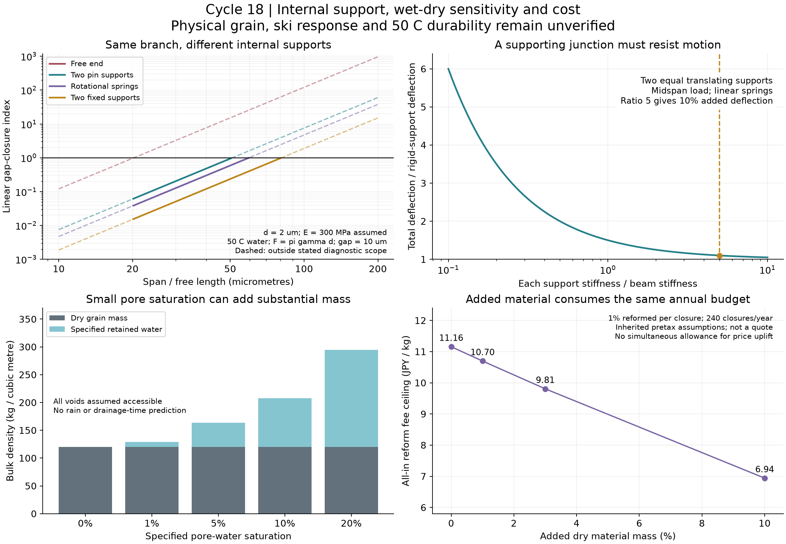

# 多方向探索第18巡：濡れ乾きに耐える枝支持と粒内接合

2026-10-08／Codex。参照基点：7b9c981fadd3efbcc1e35123677f4f39e95c1a09。回覧板、正本入口、第7・16・17巡を参照。物理試験0件、実物成功確率は未算定。正本v36の採否は変更しない。

## 1. 発明案をどう進めたか

**F17の「枝のある原料を使う」から、F18の「枝を粒内の複数点で支え、粒内の維持と粒間の解放を分ける」へ進める。** 狙いは、濡れ乾きで枝が束になり、雪感を失うことを防ぎながら、エッジで粒の配置が変わる余地を残すこと。全面被覆、枝全体の増径、コース全体の繊維シート化を先に選ばない。

今回の設計上の成果は、接合点に必要な「回転の拘束」と「位置を保つ剛性」を分け、その条件を満たさない接合を支点として数えないようにしたことである。これは完成した雪状粒の実証ではない。粒の形・結晶相・接点・粒群の滑走応答は別々に検証する。

~~~mermaid
flowchart TB
  A[噴霧短枝・既存分岐原料・異形粒を比較] --> B[粒内部だけに複数の接合点を形成]
  B --> C[短く支えた枝と開放通路を持つ独立粒]
  C --> D[丸い荷重部で板を支持]
  C --> E[粒間では過負荷で配置と接続を変更]
  D --> F[乾燥・濡れ・乾燥途中のソールとエッジ試験]
  E --> F
  F --> G[整地後の形状・空隙・応答の回復を判定]
  G --> H[健全粒を再使用し損傷粒を分流]
~~~

製造上の候補は、解繊・分級→独立した小集団への粒化→限定した接合→外へ遊離する長い枝・微粉の選別、である。局所加熱接合は工場工程の候補。現地のローラーで毎回熱接合する前提にはしない。枝の配列、接合点数、加熱窓、粒化歩留まりは未確定で、上図は金型や装置の製作図ではない。

素材の形成が噴霧だけで成立するP17も維持する。F18の後加工が複雑すぎる場合は、最初から短い枝や支持節を作る噴霧・異形押出しへ条件を戻す。

## 2. 雨後に乾けば元どおり、とは限らない

Weiらの一次研究・著者原稿は、液中の板・柱の配列が乾く過程で寄り集まり、乾燥履歴や接触後の付着によって残る形が変わることを示している。対象の基板固定構造やPDMS／IPAを、PEの自由粒・雨水の実証とはしない。[著者原稿、2014](https://arxiv.org/abs/1408.0748)／[刊行版 DOI、2015](https://doi.org/10.1098/rspa.2014.0593)

この研究から取り込むのは、満水時・乾燥後だけでなく、**乾燥途中の形と接触履歴も調べる**ことである。水分値が元へ戻っても枝が束のままなら、排水性・空隙・ソール抵抗は回復したと判定しない。

SWPのメーカー説明には約2µmの枝から約30µmの幹という形態がある。ただし円形断面、真っすぐな自由長、接合位置、曲げ弾性率を今回の試料で測ってはいない。代表融点が100〜135℃でも50℃の長時間剛性は決まらない。[メーカー形態説明](https://jp.mitsuichemicals.com/jp/special/swp/)／[公開仕様](https://jp.mitsuichemicals.com/en/special/swp/product/)

## 3. 枝の太さだけでなく、支え方を変える

### 3.1 今回の計算の位置づけ

円形の細い梁に、指定した横力を与える線形診断である。実際の液橋形状や力は解いていない。

- 断面二次モーメント：I = πd⁴/64。
- 横力の尺度：F = m πγd。m = 0.3、1、3は未校正の感度入力。接触線と圧力を含む液橋の上限式ではない。
- 一つの梁の変位：δ = F L³/(βEI)。
- 向かい合う同じ梁2本、初期隙間gの診断指標：χ = 2δ/g。
- χ=1となる長さ尺度：L* = [βEI g/(2F)]^(1/3)。実際の凝集開始長や安全限界ではない。

水の表面張力はIAPWS式を使用し、30℃で0.071194、50℃で0.067944N/m。雨の汚れ・添加剤を含む実液とは区別する。E=30／100／300MPaは比較用の仮値で、SWPの50℃実測値ではない。[IAPWS R1-76(2014)、式と表1](https://iapws.org/technical-guidance/release/Surf-H2O.download)

| 梁の支持と力の位置 | β | 何を仮定しているか |
|---|---:|---|
| 片持ち、自由端に横力 | 3 | 根元の位置・回転が固定 |
| 両端ピン、中央に横力 | 48 | 両端の位置固定、回転は自由 |
| 両端に回転ばね、中央に横力 | 192(α+1)/(α+4) | α=kθL/(2EI)。本比較のα=1では76.8 |
| 両端固定、中央に横力 | 192 | 両端の位置・回転が固定 |

この16倍／64倍の剛性比は、指定された梁・支持・荷重位置の比であり、粒群床がその倍率で強くなるという意味ではない。製造した接合が自由に回転するなら、固定端の係数を採用しない。

### 3.2 数値例と外挿の切り分け

50℃の純水、E=300MPa、m=1、隙間10µmを共通にする。

| 直径d／長さL | 支持 | χ | この模型の扱い |
|---|---|---:|---|
| 2／100µm | 片持ち | 120.79 | 小変形・接触前の範囲外。変位の予測として使わない |
| 2／20µm | 片持ち | 0.9663 | δ/L≈0.242で小変形の範囲外 |
| 2／20µm | 両端ピン | 0.06039 | 指定した線形・接触前の診断範囲内 |
| 2／20µm | 両端固定 | 0.01510 | 同上。ただし固定端は未実証 |
| 10／100µm | 片持ち | 0.9663 | 指定した診断範囲内。余裕を保証しない |

計算上の範囲表示はL/d≧10、δ/L≦0.1と、2δ<gを別々に記録した。この条件自体も材料の合格規格ではない。χが大きい値をそのまま変位として使ったり、χ<1の行の割合を実物成功率にしたりしない。

同じ横力の尺度ではχ∝L³/d³。長さを半分にする、または直径を2倍にするとχは1/8になる。ただし同じ長さの枝の直径を2倍にすれば材料量は4倍。接合で自由長を短縮する案も、接合の質量・剛性・加工費が必要で、無償の改善ではない。直径2→10µmの単純増径は同じ枝長・本数なら25倍の枝質量になる。

### 3.3 支点自体が動く場合

中央荷重を受ける梁の両端に、同じ並進ばねksを付ける対称な模型では、

δ_total = F/k_beam + F/(2ks)

となる。支点移動による変位増を10％以内にする**比較条件**は、各支点のks≧5 k_beam。この10％は開発比較の目安であり実用規格ではない。

直径2µm・支間20µm・E=300MPaの両端ピン模型では、k_beam≈1.414N/m、各支点に約7.07N/mが必要になる。単に細い枝同士を接着するだけで、この支点剛性を満たしたことにはならない。隣接する太い骨格、接合部の回転、骨格全体の移動を含めて評価する。

今回、Hermite梁要素を独立に組み立て、4／8／16分割で解析コンプライアンスと反力を照合した。回転ばねと移動する支点も別条件で確認した。これは計算法の確認であり、実物の接合強度試験ではない。

## 4. 50℃の融点確認から、5時間の形状維持へ

線形クリープの説明用にJ(t)=J0[1+a(1−exp(−t/τ))]を置いた。aとτは架空の比較条件で、PEの測定値や温度則ではない。

この模型でコンプライアンスが10倍になると、同じ力・隙間に対する長さ尺度は10^(−1/3)≈0.464倍になる。初期の剛性だけで枝間隔を設計してはいけない理由である。水の表面張力の30→50℃の低下だけを見て、高温ほど有利と判断しない。

必要なのは同一銘柄・同一加工履歴での、30／40／50℃、乾燥・湿潤の時間依存曲げと接合部移動である。数秒の板荷重、4〜5時間の整地間隔、湿乾繰返しの残留変形を区別する。三井化学の代表融点の差から接合温度を決めない。

F18で支点剛性やクリープが成立しなければ、枝の太さを無制限に増やさず、短枝の生成工程、少数の太い支持部、別材料の骨格と接点の分離へ戻す。無機骨格では重量・ソール摩耗、親水性骨格では膨潤・乾燥履歴を同時に比較する。

## 5. 「少量の水」と重量・排水を区別する

乾燥床120kg/m³、固体950kg/m³という従来仮値なら、空隙率は約0.8737。全空隙が水に接続していると仮定し、空隙の水飽和度Sを指定すると、

追加水重量／体積 = 1,000 × 0.8737 × S kg/m³

になる。これは雨量からSを予測した計算ではない。

| 空隙の水飽和度 | 水込み床密度 | 乾燥重量に対する水の増加 | 2,000m²×45cm全体の水重量 |
|---:|---:|---:|---:|
| 1％ | 128.74kg/m³ | 7.28％ | 7.86t |
| 5％ | 163.68kg/m³ | 36.40％ | 39.32t |
| 10％ | 207.37kg/m³ | 72.81％ | 78.63t |
| 20％ | 294.74kg/m³ | 145.61％ | 157.26t |

**空隙飽和度5％と質量含水率5％は違う。** 乾燥樹脂の吸湿率、出荷時の原料水分、枝・粒間に残る水も区別する。床密度だけで滑走抵抗や「泥になった」とは決めない。

理想円管の圧力尺度2γcosθ/rでは、50℃・仮の接触角60°で半径10µmの圧力は約6.79kPa、対応する鉛直水頭は約0.693m。一方100µmなら約0.679kPa・0.0693m。**SWPの枝径を円管半径に置き換えた値ではなく、実床の保水・透水係数・排水時間でもない。**

支持点を増やして微細な隙間を大量に作ると、濡れ乾きへの抵抗を改善しても保水側に悪影響が出る可能性がある。F18では粒内部と粒間の連続した排水経路を残し、30°斜面・下地・出口を含む収支で確認する。冬の氷による接続と融解時の排水も、夏の乾燥戻りとは別の判定にする。

## 6. 重量を増やす改善と加工費の共通予算

第17巡の税抜仮入力を継承：2,000m²、45cm、乾燥120kg/m³、完成粒500円/kg、10年8％、非材料初期2,000万円、固定年費400万円、年購入補充2％、年費枠1,900万円。元の年額換算は約1,610.82万円。価格・需要・損傷率の実測ではない。

同じ床体積で追加した接合材等を、同じ500円/kg・年補充率で見た場合：

| 乾燥質量の追加 | 材料だけの年額増加 | 残る年費枠 | 毎閉鎖1％・年240回再製造するときの全工程単価上限 |
|---:|---:|---:|---:|
| 0％ | 0万円 | 289.18万円 | 11.16円/kg |
| 1％ | 9.13万円 | 280.05万円 | 10.70円/kg |
| 3％ | 27.38万円 | 261.80万円 | 9.81円/kg |
| 10％ | 91.28万円 | 197.91万円 | 6.94円/kg |

追加10％が必要だと判明したという表ではない。熱接合・分級・集塵・輸送・水処理・設備・人件費などは残枠から支払う。重量増なしの場合の初回完成粒単価の上乗せ限界は約158.41円/kgだが、**同じ残枠を使った代替計算なので、再製造11.16円/kgと両方満額では使えない。**

材料追加が少なくても、微細支点を作る工程が高価なら不採用になる。整地設備税込2億円、300mm削れ代、45cm比較厚さ、60分閉鎖、80m/s閉鎖時保持、豪雨後の回収という制約を下げて成立扱いにはしていない。年購入補充2％は環境へ出してよい量ではない。

## 7. 雪感へ接続する比較と、次に変更すべき設計

雪の切削一次研究は、進行方向・法線方向・横方向の3成分と、速度・迎角・エッジ角を分けている。公開抄録を確認し、PDF本文は取得できなかったため、その回帰式や数値を本計算へ入れていない。[2005年の雪切削研究](https://www.jstage.jst.go.jp/article/jskisciences2003/3/1/3_1_11/_article/-char/en)

HVとSfは押込みと動き始めのせん断を表す。これだけで、継続切削・引っかかり・ピーク後の解放・再整地の回復は決まらない。[Mössnerらの著者ページ](https://sport1.uibk.ac.at/mm/p/snow.php)／[第7巡の反例](GPT回答_多方向探索第7巡_雪の滑走応答と可逆接点の設計条件_20261007.md)

| 比較案 | 今回移した原理 | 次の判断を変える観測 |
|---|---|---|
| P17→短枝・支持節を作る噴霧 | 形を残す時間だけでなく自由長と支点位置を指定する | 生成分布・同一材料の時間依存剛性。長い繊維だけなら工程を変更 |
| X17→少数の丸い支持部を持つ異形粒 | 安定した形状を対照にし、毛羽を減らす | 砂状の摩擦、切断端、エッジの逃げ、費用。硬いだけなら形状・接点を変更 |
| F17→F18粒内支持型 | 原料の枝を生かし、粒内の維持と粒間の解放を分ける | 紙状化、自由繊維、湿乾凝集、支点移動。固定床への置換では合格にしない |
| G16/C16等の骨格・接点分離 | 支える部位と壊れ・再形成する部位を区別する | 水で失われる接点、微粉蓄積、回復時間・費用。雨への依存が大きければ接点方式を変更 |

比較順序は、同一ロットの原料→独立粒→湿乾・温度履歴→実ソールとエッジ→小床→斜面である。候補は未加工原料、粒化のみ、限定接合、異形粒、目標の新雪圧雪を対照にする。粒化できない原料を仮の完成粒として試験表へ入れない。

測るのは、粒径だけでなく自由長・接合間隔・支点移動、遊離繊維、空隙、湿乾後の束残り、3成分の抵抗曲線、残留溝、再載荷・整地後の回復である。雪対照の分布を先に取り、結果に合わせて合格帯を動かさない。人体・環境の判定には添加剤・溶出・粒径別摩耗物・飛散・転倒接触の別証拠が必要で、一般用途の実績では代用しない。

## 8. Claudeへの独立検証依頼と到達点

1. F18の粒内接合が、自由粒全体を固定端と見なす誤りになっていないか確認する。接合の回転と支点移動を実材料の模型へ入れる。
2. 梁係数3／48／192と有限回転ばね式、支点コンプライアンスを独立計算する。χ・L*の外挿範囲を実際の凝集閾値と混同しない。
3. 微細接合を増やすことで、保水・摩耗・紙状化・雪の解放応答が悪化しないか反証する。
4. 同一銘柄の50℃・5時間剛性、実液橋、生成した枝の寸法、再生割合と費用の新しい証拠を共有してほしい。全物質探索の結果があればP17／F18以外も比較する。
5. 「乾燥した」「均した」「原料が結晶性」「仮計算が通った」を、雪感や成功率90％超に置き換えない。

本巡では576の指定条件を比較し、梁要素・反力・水収支・費用の数値確認を行った。通過条件の割合は成功確率として集計しない。実物試料・企業見積り・雪対照の測定は取得していない。共有資料への掲載はClaudeの受領・同意を意味しない。

[再現資料](枝支持検証_濡れ乾きと接合_20261008/README.md)、[入力](枝支持検証_濡れ乾きと接合_20261008/inputs.json)、[計算コード](枝支持検証_濡れ乾きと接合_20261008/model.py)、[全結果](枝支持検証_濡れ乾きと接合_20261008/results.json)、[内部確認](枝支持検証_濡れ乾きと接合_20261008/verification.json)、[出典・探索記録](枝支持検証_濡れ乾きと接合_20261008/sources.md)を保存する。
