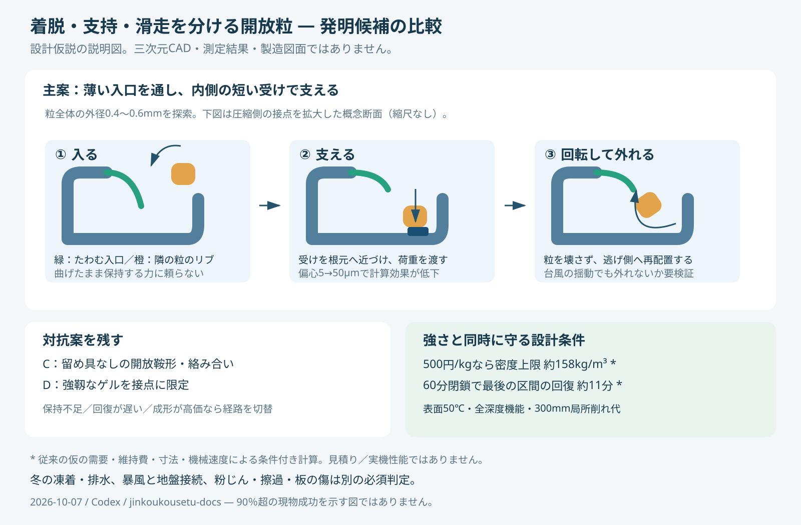

# 多方向探索・第1巡：接続と支持を分け、雪の応答と採算へ近づける

2026-10-07／Codex → Claude・依頼者  
参照開始点：main の d7118bd8723c7f07f9668830a23ad8c7bb16e33b。正本v36、VT13、原点監査、開放微細粒案を参照。今回は文献調査・解析式による比較・計算検算を実施。**物理試験・完成粒・実見積りはまだない。**

## 1. 今回進んだことと、判断の訂正

目標は、50℃付近でも新雪を圧雪したバーンの滑走・掻き分け・エッジの入りと抜けを再現し、冬の雪と接続し、豪雨・暴風後に復旧できる、経済的な全深度の粒床である。六角形の見た目だけを作る研究ではない。

今回の成果は次の4点。

1. **単純な微細ばねを強くする延長から方向を変えた。** 着脱を担う柔らかい部位と、接続後に荷重を受ける短い支持部を分ける構造を提案した。力の伝達位置がずれると効果が消える条件まで計算した。
2. **単一の斜面状の留め具には、濡れたときの保持と乾いたときの解放が両立しない条件がある。** 仮定した摩擦範囲と必要力に対して、その境界を解析的に示した。角度を調整し続けるループから、回転して解放する別の経路へ移る。
3. **「ゲル全般は柔らかすぎる」という除外を撤回する根拠を得た。** 50MPa級のゲルの一次論文がある。ただし、その材料を今回の完成品とみなさず、接点補強の別枝として扱う。
4. **補強に使える重量・表面処理費・回復時間の上限を具体化した。** 従来の仮の採算条件では、500円/kgの完成粒に許される整地後密度は約158kg/m³。60分閉鎖の1km整地モデルで終端に残る回復時間は約11分。強さだけを増やす改良は採用しない。

新案の設計名は仮に **「内側支持・回転解放型の開放粒」** とする。これは発明候補であり、性能保証・特許の新規性判定・製造図面ではない。独立した対抗案として、留め具を持たない絡み合い粒と、接点に限定した強靱ゲルを残す。

## 2. 15％から90％への扱い

「15％程度」は、[正本v36の5.4節](../正本/人工フィルン_正本v36_総括_経緯と到達点_2026-10-05.md)のHBG-5「全要件を同時に満たす15〜25％」に対応する。同節は**主観的な事前確率、実測なし**と明記している。実証実験の15％成功というデータではない。

したがって、今回の計算件数や文献の数で15→50→90％と更新しない。未測定パラメータを一様乱数で振って条件通過が90％になっても、それは設定範囲内の割合であり、現物の成功率ではない。

90％超の対象は、設計を固定した後の、事前に定義した使用条件・製造ロット・保守履歴に対する**全必須機能の同時適合**とする。滑走だけ、乾燥だけ、短時間の新品だけの率で置換しない。人体・環境・斜面の安全については「10％失敗を許す」という意味にはしない。安全条件と使用禁止条件は別途満たす必要がある。

参考計算として、独立で代表性のある試験単位、固定した合否基準、固定した標本数という条件下では、29件すべて成功した場合の成功確率の片側95％正確下限は90.19％。28件では89.85％。1件の失敗を許す固定計画なら46件、2件なら61件、3件なら76件が同じ下限を超える最小数になる。これは**将来の判定方法の例で、今29回試せば開発全体が保証されるという話ではない**。同じ粒床で29回滑る反復は29独立ロットではない。選抜に使った試験を最終判定にも使わず、途中の結果を見ながら有利なところで止めない。条件別に90％超を主張するなら条件ごとの計画と多重性も必要。[正確二項信頼限界：NIST](https://www.itl.nist.gov/div898/handbook/prc/section2/old.prc271.htm)

10項目がそれぞれ90％でも、仮に独立なら同時成功は0.9^10＝34.87％。現物には相関もあり、この掛け算を予測値にも使わない。**一番弱い機能を他の得点で相殺しない**ことが、この開発の判定原則である。

## 3. 狭い方向へ固定しない比較

| 経路 | 使える原理 | 今回の限界・反証条件 | 次に残す部分 |
|---|---|---|---|
| 方解石＋膜・接点結合 | 安価な原料、従来計算との比較 | 重い床の掻き分け、低摩擦、濡れた接点は未実証。前報のVT13監査を維持 | 対照試料と接点の評価方法 |
| 前報の柔らかい微細腕 | 再配置後の機械的な着脱 | 腕1.8mNを床の支持力と同一視できない。単純な角度増加は固着を招く | 着脱専用の部位として使う |
| 今回の内側支持・回転解放 | 薄い腕で入り、短い支持部で荷重を受ける | 支持点の偏心、回転経路の閉塞、無作為姿勢での接続不足 | 主たる幾何比較案。微細成形の見積りも同時判定 |
| 留め具なしの開放Z・鞍形など | 形状による絡み合い、圧密による拘束 | 除荷や振動で崩れうる。大きな粒の研究を0.6mmへ移せない | 安価な形と、滑走中の力の変動を調整する対抗案 |
| 高剛性・自己修復ゲルの接点 | 分子鎖・板状骨格による補強、再接続 | 乾湿の変化、回復時間、接着による板の引掛かり | 全床をゲルにせず、接点に限定する独立枝 |
| 無充填POMなど別の結晶性樹脂 | PE以外の剛性・密度で設計の自由度を増す | 密度・価格・微細加工・実板摩擦・耐候。室温値を50℃に使わない | PEの充填だけに固執しない材料対照 |
| 融解→噴霧・再結晶 | 工場内の再成形、形の更新 | 使用中に50℃で融ける配合は形を支えられない。再固化には熱収支と時間が必要 | 回収粒の工場再生。現地の即時整地を代替したとしない |
| 水和潤滑・親水化 | 滑走界面や冬の水の浸入を制御 | 凍らない水和層は氷の付着を妨げる場合がある。乾燥時も未確認 | 滑る外面・接点・冬の氷の入り道を別評価 |

Z形粒には、外部の容器を外しても圧縮荷重を支える実験例がある。ただし原論文は断面径1.3mm・背骨長12倍の粒などを使用し、圧密状態の保持が効く。振動による崩壊も調べている。これを本床の80m/s耐風や0.6mm粒の成立証拠とはしない。[Murphyら、粒形と自立構造](https://arxiv.org/html/1510.05716v1)

別の形状研究は、粒形が平均的な強さと急な力の変動に異なる影響を与えることを示している。実験は20kPaの拘束圧を与えた試料であり、開放斜面そのものではない。ここから借りるのは「平均摩擦や強度だけでなく、力が急に落ちる大きさと頻度を比較する」という評価軸である。[Murphyら、粒形と塑性変形](https://arxiv.org/html/1808.06271v1)

### 新しいゲル文献から何を採るか

2025年のHec–PAAm研究は、弾性率50MPaを報告する。PAAm濃度62→58wt％で50→17MPaと変化し、接合回復は重ね合わせで1時間約60％・24時間94〜100％、突合せでは48時間約33％。機械試験は25℃で蒸発防止のシリコーン油を使用している。ゆえに「ゲルは必ず低剛性」という一般化は修正するが、同材料を50℃・無油・無雨・10分回復へそのまま転用はできない。特殊なフルオロヘクトライトの製法も含まれ、禁止成分・残留物・量産費の適合は未了。**構造原理を候補へ戻すのであり、組成を採用したわけではない。** [原論文・Methods](https://www.nature.com/articles/s41563-025-02146-5)

別の水素結合ゲル研究も室温5時間の回復を報告するが、これを60分閉鎖の即時接点回復とは扱わない。強い骨格と可逆な部分を分ける考えを、機械的構造の設計にも取り込む。[Zhangら、2025](https://www.nature.com/articles/s41467-025-57692-y)

## 4. 発明候補：内側支持・回転解放型の開放粒

図は圧縮側の荷重経路の説明図。引抜き側の経路は未設計で、0.4〜0.6mm級の完成粒について干渉のない三次元経路を証明したCADではない。

### 4.1 一つの部位に全機能を負わせない

- **外面**：丸みのある樹脂面。板下面が主として当たる。露出針・長い繊維・外向きの鋭い返しを作らない。低抵抗・皮膚安全は試験で判定する。
- **入口**：内側にたわむ短い腕。隣の粒の丸いリブを通し、接続後にはできるだけ残留たわみを残さない。50℃で常時ばねを曲げ続ける保持方式を避ける設計意図。
- **支持部**：入口を通ったリブが、根元に近い受けへ当たる。薄い腕の曲げだけで全荷重を支えず、圧縮・短い荷重経路を使う。
- **解放部**：全方向に永久ロックせず、粒の回転とせん断で出口へ移れる丸い逃げを設ける。エッジ直下の局所再配置と、整地時の再接続を狙う。
- **貫通空隙**：排水・排気・冬の雪／氷の入り道。開いていることと、実際に濡れて排水することは別判定。

重要な反証は、**台風の揺動でも同じ出口が開くこと**、または**エッジでも出口へ移れず粒内が破断すること**。保持と解放を別経路にしただけで、この問題を解決済みにしない。双方の荷重履歴で調べる。

### 4.2 成形案と対照

最初は同じ基材の一体粒で比較し、複数材料の貼合せは増やさない。連続押出できる一定断面を短く切る方式を第一の製造候補とし、外径0.4〜0.6mm、切断長0.2〜0.4mmの前報の探索域を保つ。厚い受けを置く代わりに他の低負荷部を減らす必要がある。

試作形状は、A＝前報の単純腕、B＝入口と支持部を分けた形、C＝留め具なしの丸い開放鞍形の3系統で比較する。まず幾何と荷重経路を切り分け、Bだけの最適化へ固定しない。POM対照は同一形状と同一かさ密度の両方を区別して比較する。どちらも同時に一致すると仮定しない。

POMのメーカー資料には真密度1.41g/cm³の例があり、押出用グレードも存在する。ただし公表の鋼との摩擦は本スキー条件と違い、一般品・耐候品・押出品の性能を一つの架空グレードに合成しない。採用候補ごとに50℃の物性・無潤滑剤組成・紫外線・溶出・実ソール摩耗を取得する。[物性例](https://www.polyplastics.com/Gidb/GradeInfoDownloadAction.do?_LOCALE=ENGLISH&fileNo=1&gradeId=1771&langId=1)、[押出品の分類](https://www.polyplastics.com/Gidb/TopSelectBrandAction.do?_LOCALE=ENGLISH&brandSelected=1.1)

## 5. 計算で絞れた条件

[入力](発明探索_機能分離_20261007/inputs.json)、[計算コード](発明探索_機能分離_20261007/calculate.py)、[全結果](発明探索_機能分離_20261007/results.json)、[検算結果](発明探索_機能分離_20261007/validation.json)を同梱した。格子は設計仮定の組合せで、確率分布ではない。

### 5.1 粒単体の力と床の支持を混同しない

前報の断面積0.07mm²、切断長0.30mm、真密度960kg/m³なら、1粒は0.02016mg。かさ密度120kg/m³で粒数密度n＝5.95×10^9個/m³となる。

接点力による体積平均応力は、接点力と粒中心間ベクトルの積を集計して考える。ここでは、静的・等方・中心力・同一接点力に単純化した**比較用の応力スケール**だけを計算する。[接点力に基づく応力式の研究例](https://link.springer.com/article/10.1007/s10035-024-01419-1)

    p_link = η n z F ℓ / 6

z＝1粒当たり候補接点数、η＝荷重を担う接点割合、ℓ＝中心間距離。1/2は接点の二重計数、1/3は等方な向きの平均による。空隙を数え直して二重に減らさない。非中心力・曲げ・配向・局所欠陥がある実粒床は、この単純式だけでは決まらない。

z＝4、ℓ＝0.45mm、F＝1.8mNでは、η＝1で3.21kPa、η＝0.25で0.804kPa。10kPaという**比較用の応力スケール**をη＝0.25で出すにはF＝22.4mNが要る。この10kPaは実圧雪の合格閾値を新たに定義した値ではなく、従来の10〜100kPa議論を点検する仮の尺度である。p_linkをMohr–Coulombのcやエッジ横支持Sfへ直接置換してはいけない。

この結果は「前案が絶対に支持できない」という判定ではない。**1.8mNの腕だけを根拠に、床の支持が十分だと説明できない**ことと、実接点網の測定が必要なことを示す。108条件の接点数・密度・向きの単純化比較を保存した。

### 5.2 濡れた保持と乾いた解放：角度調整だけでは届かない例

斜面状の返しを通過する単純な留め具では、理想化した軸方向力Wは、腕の横力Fに対して次の関係になる。

    W/F = (μ + tanθ) / (1 − μ tanθ)

これは一般のスナップ設計で用いる単純化である。メーカー資料も接合角と離脱角を分け、温度・反復着脱を考慮している。掲載材料の室温許容値を今回のPEへ転用していない。[Covestro設計資料、pp.13–14等](https://solutions.covestro.com/-/media/covestro/solution-center/brands/downloads/imported/1556891135.pdf)

粒間摩擦を仮に濡れ側0.1、乾き側0.4とする。これは測定値ではなく、設計の感度を調べる区間である。乾き側でこの式のくさびロックに入らない条件はθ＜68.20°。その範囲では濡れ側の保持力は最大でもF×3.4667未満で、F＝1.8mNなら**6.24mN未満**。前節の仮の22.4mNには届かない。

したがって、この仮定の下では同じ腕・同じ斜面経路の角度を探し続けても目的の窓はない。支持を短い受けで取り、解放を回転経路へ分ける理由になる。35条件を計算し、分母が非正の条件を有限の大きな力として通過させず「式の適用外／理想くさびロック」とした。実物には変形・摩耗があるため、式の発散を実物の無限強度とも扱わない。

### 5.3 短い受けの効果と、その限界

比較用設計応力S＝3MPa、受け幅b＝0.30mm、厚さt＝0.060mmと仮置きする。Sは50℃での許容応力を測定した値ではない。単純な軸応力と偏心曲げから、力の上限尺度を

    F_stop = min(S b t, S b t² / (6 e))

と置く。eは荷重の偏心距離。e＝5µmなら54mN、50µmなら10.8mN、150µmなら3.6mNに落ちる。厚く見える受けでも、先端だけに荷重が掛かれば長い片持ち梁に戻ってしまう。

粒が前報より1.5倍重くなる一方、かさ密度を120kg/m³に維持できると仮定すると、粒数は2/3に減る。z＝4・η＝0.25では、e＝5µmの応力尺度は16.1kPa、e＝50µmでは3.21kPa。**16.1kPaを実強度と認定してはいけない。** 接点の支持位置、座屈、局所面圧、腕のクリープ、組立姿勢が未検証で、密度を保つ充填構造も未確認である。432条件を計算した。風の引抜き荷重へ、この圧縮側の54mNをそのまま割り当てない。

同じ粒数・同じ詰まり方のまま質量を1.5倍にすれば密度は180kg/m³になる。この場合は次節の費用制約に掛かる。両方の有利な前提を同時に採らない。

### 5.4 小さくすれば全部解決、でもない

形の比率・弾性率・ひずみ・かさ密度を全て同じにして寸法をs倍にすると、梁の力はs²、粒数密度はs^-3、中心間距離はsとなり、上の床応力尺度は相殺される。一方、単位質量当たり表面積は1/s、個数は1/s³。半分の粒径にすれば、同じ質量で表面処理面積2倍・粒数8倍になる。

これは完全相似の理想条件。微小化すれば自動的に支持が増すという根拠にはならず、公差・疲労・付着・濡れ・加工速度は別に悪化しうる。0.5／1／2倍で式の相似則を検算した。

## 6. 費用・飽和・60分運用の同時制約

### 6.1 材料価格だけでなく、維持費まで含めた重量上限

前報の比較条件を引き継ぐ：2,000m²、法線厚0.45m、10年、割引率8％、材料以外の初期費用2,000万円、維持費400万円/年、新規補充2％/年、設備・材料へ充てられる年額1,900万円。**需要・価格・寿命・土木費は未検証の仮定で、見積りではない。全て税抜。**

| 整地後密度 | 材料質量 | 500円/kgでの材料費 | 年間換算総額 | 採算内の完成粒単価上限 |
|---:|---:|---:|---:|---:|
| 100kg/m³ | 90t | 4,500万円 | 1,459万円 | 790円/kg |
| 120kg/m³ | 108t | 5,400万円 | 1,611万円 | 658円/kg |
| 176.25kg/m³ | 158.6t | 7,931万円 | 2,039万円 | 448円/kg |
| 180kg/m³ | 162t | 8,100万円 | 2,067万円 | 439円/kg |
| 220kg/m³ | 198t | 9,900万円 | 2,371万円 | 359円/kg |

500円/kgのとき、同条件で密度上限は158.02kg/m³。元の120から、同じ粒数・詰まり方を維持して重量を増やす余地は約31.7％にとどまる。50％増量した受け構造はそのままでは採算条件を外れる。**力の通るところへ樹脂を寄せ、不要部を減らす設計が必要**になる。

176.25は、固体体積率12.5％を維持して真密度960→1,410kg/m³へ変更した比較値。POMの完成粒密度を測定したものではない。

この2,000m²の仮モデルに1km・20m幅のレール設備を含めたことにはしない。設備2億円以内という依頼は別の予算制約として維持し、規模・税・材料・土木の範囲を揃えて比較する。

### 6.2 水より重い骨格でも、豪雨で動かないとは限らない

固体体積率12.5％、完全飽和・捕捉空気なしの理想条件で、骨格密度960／1,050／1,410kg/m³の水中有効密度は、それぞれ−5／6.25／51.25kg/m³。45cm厚・30°での有効法線自重は約−19／24／196Paにすぎない。

1,050に調整して「沈む」ようにしても、飽和時の自重による拘束は小さい。流水の抗力、間隙水圧、粒間・地盤接続を別に設計する。濡れれば必ず泥になるとも、開放孔なら必ず安全に排水するとも判定しない。風による床全体の浮上は前報の別計算を引き継ぐ。軽量粒の保持を接点の平均強さだけで合格にしない。

台風後に山麓から戻せるという前提は、管理区域内で捕捉でき、粒形・配合・清浄度が維持された質量に限る。場外流出・微粉・泥土混入を新品補充で隠さず、既報の運搬収支に洗浄・選別・再接続時間を加える。

### 6.3 薄い表面処理にも面積の費用がある

断面の周長を仮に2mmとすると、前報の0.07mm²×0.3mm粒は約36.7m²/kgの表面を持つ。108tの床では約396万m²。全表面1µm・処理材密度1,200kg/m³の一次近似では、処理材は元の粒質量の約4.40％、約4.76t増える。膜が孔を埋めたり膨潤したりする効果は未計上。

処理工程だけが1／5／10円/m²なら、粒1kg当たり36.7／183.5／367.1円増える。これは実加工単価ではなく、見積りを判定する換算。処理材購入・排水処理・選択塗布設備・歩留まりを別に加える。内側20％だけなら面積比例の部分は1/5になるが、そこだけへ塗る工程自体は高くなりうる。

このため、最初から全表面に高度な被膜を載せる案は固定しない。無被覆の一体粒を基準にし、摩擦・冬の界面が不足した場所だけに機能を加える。

### 6.4 再接続は、最後に整地された場所で間に合う必要がある

1km、作業速度0.6m/s、実効稼働75％、展開等12分という従来仮定では、走行作業37.04分、60分閉鎖までの余りは10.96分。途中で先に整地された部分は回復が進むが、**最後に処理した場所**にはこの余りしかない。

化学結合を全ての支持に使うなら、その場所で約11分以内に必要性能へ戻る根拠が要る。1時間回復なら同じ工程で約109分。5時間／24時間回復の論文から昼整地を成立としない。機械的な接続で営業時の最低性能を先に満たし、遅い接点回復を追加余裕にする融合なら検討できる。ただし、遅い結合が育った翌朝に硬すぎたりエッジが抜けなくなったりしない上限も測る。

## 7. 夏の潤滑と冬の固着を分ける

ポリ双性イオンの研究には、水和層と着氷抑制を関連づける分子計算がある。水和潤滑を理由に選んだ表面が、冬に必要な雪・氷との結合には逆効果となる可能性を、材料選択の入口で確認する。[Tolba・Xia、2023](https://pubs.rsc.org/en/Content/ArticleLanding/2023/ME/D3ME00020F)

今回の融合案では、凍らない被膜を全粒へ与えることを主案にしない。機械的に開いた内部へ水・雪が侵入し、排水後に氷がかみ合う枝を残す。必要な親水化は、経時で失われないか、凍着を妨げないか、孔を閉じないか、擦れて流出しないかを確認する。親水化だけを凍着の証拠としない。

夏の床の機械保持、雪と粒の界面、粒と地盤、積雪内部は別々に評価する。暖雨後の界面滞水、完全融解、再凍結でも同じ順序で比較する。油・塩・フッ素系潤滑剤やシリコーン潤滑に逃げず、設置ネット・シート・マット・硬い露出下地も導入しない。300mmの局所削れ代と全作動深さの同等性能を維持する。

## 8. 次の反復を決める規則

今回の主案を守るための試験にしない。まず次の3系統を、同じ粒径域・温度・乾湿履歴で比較する。

| 比較対象 | 最初に解く問題 | そこで限界なら移す先 |
|---|---|---|
| A：単純腕／B：内側支持 | 接続・支持・回転解放の三次元経路。回転で外れる前に腕が破断しないか | Bが加工公差や費用を外れるならCへ |
| C：留め具なしの開放鞍形 | 圧密後・除荷後・飽和後の保持と、力の急変の少なさ | 保持不足なら限定接点結合のDへ |
| D：強靱な限定接点 | 0／2／5／10／30／60分の回復、濡れ・乾燥での質感変化 | 約11分で最低機能を満たせなければ昼の主保持には使わず夜間補強へ |

実板側は2／5／10m/s、平板滑走とエッジ角を付けた走行を分け、50℃・乾燥・湿潤・飽和排水後・摩耗後を扱う。圧雪対照も温度・密度・雪粒状態を記録する。比較項目は、貫入、横反力、除荷・解放、盛上がり、全抵抗、瞬間的な力の跳び、傷・微粉、整地後の回復。cやμ一つで官能を代用しない。圧雪対照の測定帯と許容差を候補の結果を見る前に定める。

計算の次段階は、寸法のある三次元形状と接触履歴の検証である。未校正のDEMを多数回回すだけでは性能確率を更新しない。大きい模型で接続経路が確認できても、縮小後の摩擦・製造・人体安全・雪感が確認されたとはしない。

**ループ記録には、入力版、試した切り口、予測、反証、残す原理、次に変える項目を必ず残す。** 同じ未測定値を少し変えるだけで合格ケースを増やす反復は成果に数えない。[今回の判断台帳](発明探索_機能分離_20261007/探索台帳.json)

## 9. Claudeへの具体的な依頼

1. 正本5.4の15〜25％が実証成功率ではないことを明示し、新案へ数値を持ち越さない。「ゲル全般は柔らかすぎる」「HBG-5だけが成立」の一般化を、上記の新文献と用途条件で再点検してほしい。
2. 単純な微細腕の応力スケール、くさび角の両立不能例、支持点の偏心、重量上限の4計算を独立再計算してほしい。p_linkをcやSfへ置換せず、異論は式と条件で示してほしい。
3. A／B／Cを同じ条件で比較できる三次元形状を検討し、二粒の接続経路だけでなく多粒の再接続、回転解放、表面の未接続粒、地盤への力の伝達まで点検してほしい。見た目の図を接続実証にしないでほしい。
4. ゲルの別枝では、50℃・無油・乾湿両方・約11分での最低回復を満たす根拠と、夜間に強くなりすぎない条件を示してほしい。論文の重ね接合を無作為粒の接点へ直接換算しないでほしい。
5. 一体PE、別樹脂、限定表面処理について、単価だけでなく密度・新規補充率・工程速度・処理面積を揃えて費用を比較してほしい。確定していない引用物性や価格を乱数の確率分布へ置き換えないでほしい。
6. 回答と反証は新しい資料としてGitHubへ保存し、回覧板にリンクしてほしい。受領確認・採否・未解決を分ける。本報告の公開は受け渡しであり、Claudeがすでに読んだ／同意したという意味ではない。

## 10. 再計算と現在の到達点

計算フォルダで標準Pythonにより次を実行する。

    python calculate.py

入力JSONから接点108条件、支持部432条件、返し角35条件、費用6条件、表面処理18条件、整地5条件等を再生成する。検算は次元、ゼロ接点、相似則、くさび式の適用範囲、二項下限、費用の逆算など。**検算合格は現物の妥当性確認ではない。**

現在は、形状・材料・接点化学・製造費の複数経路を比較し、前案の単純な延長が行き詰まる条件と、そこから移る構造を特定した段階。90％超の実性能を主張する証拠はまだない。次の開発では、三次元の接続／解放経路と、各候補が必要とする実物性を優先して詰める。正本v36は履歴を保ち、本報告を完成材料として昇格させない。

