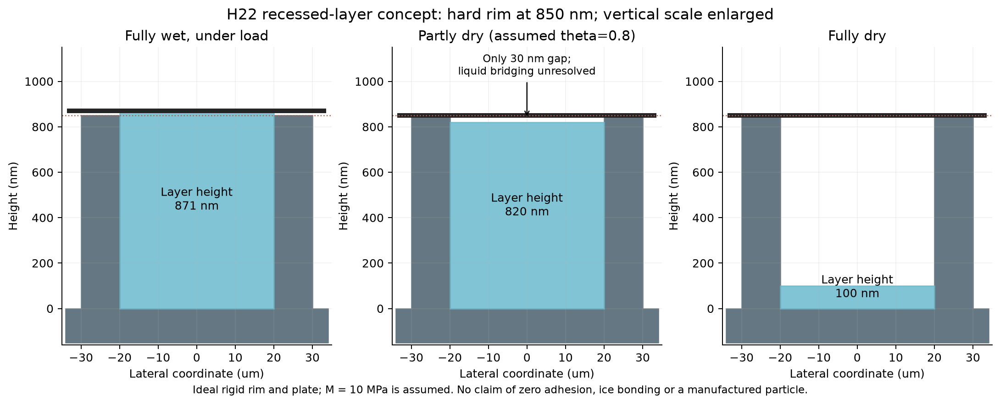
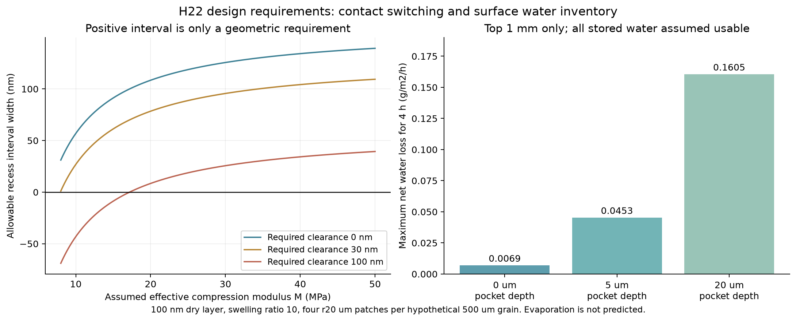

# 多方向探索第22巡：乾湿切替と局所水和層の成立条件

2026-10-08／Codex。開始時の main：f0452470358f47701650a38a59b34ae5c299b4a7。回覧板・第21巡・既存の水和案を参照。前巡後のClaudeによる追加結果は、取得時点ではなかった。

**今回の成果は、雨の水を潤滑へ使う候補を、硬い骨格・局所水和層・乾湿の接触切替・水の補給・再加工費まで分解し、H22案の成立条件を具体化したこと。** 全面を柔らかいゲルで覆う案を主案にせず、局所の薄い結合層と無処理面の対照を先に比較する。くぼみで半乾きの層を退避させる案も計算したが、荷重と水の橋を含めると条件は狭い。退避だけで摩擦急増を防げたとは扱わない。

**物理試験0件、実物成功確率は未算定。** 729在庫条件・540切替条件などは、未測定入力の設計感度であって、試料の成功件数ではない。90％超は未達である。正本v36は変更しない。

## 1. 発明案H22：骨格を残し、潤滑する部分と雪を留める部分を分ける

第18〜20巡の枝状・結晶性骨格と内部の保持座、第21巡の荷重分散を土台とする。水和層は骨格そのものにせず、必要な接触部だけに薄く結合する。保守も「水を戻す」「壊れた形を戻す」「化学層を作り直す」を区別する。

| 案 | 具体的な構成 | 今回の位置付け |
|---|---|---|
| H22-A：局所グラフト層 | PE系等の硬い接触面の一部に、PMPC系・SBMA系等の親水性鎖を結合。内部の保持部と雪の入り込む通路は覆わない | 最初に比較する材料候補。乾燥・半乾きでも高摩擦にならない組合せが必要 |
| H22-B：硬い外縁と退避する層 | 外半径30µmの硬い縁の内側に、半径20µmの水和層。乾くと縁より下へ、十分濡れた時だけ接触可能にする | 形状による接触切替の仮説。荷重・寸法誤差・水の橋に厳しい条件があり、直ちに量産案へ採用しない |
| H22-C：荷重から離した保水くぼみ | 接触部の近くに小さな水の在庫を持たせ、圧縮荷重を別経路へ流す | 無散水時間を延ばす比較枝。永久保水や4時間自立を意味しない |
| 比較基準：無処理の硬い接点 | 第21巡の丸面を同じ材料・荷重で評価 | これが乾燥時に目標を外すなら、水和層の退避で乾燥問題を解決したとは言えない |

これは新雪の圧雪の感触を狙う開放粒の局部設計であり、固定マット・ブラシ床・柔らかいゲル床への置換ではない。分子の結晶性、粒の枝形状、滑走感の一致は、引き続き別の確認が必要。

## 2. 新しく確認した一次証拠

| 一次資料 | 取り込める原理 | 本計画へそのまま移せない点 |
|---|---|---|
| [S1：PFHC、2026](https://www.nature.com/articles/s41467-026-69322-2) | 潤滑する表層と強い下層を分け、繰返し摩耗に耐える設計 | 約0.009・10万往復は金属球／体液模擬液での厚い被膜。100nm層や50℃乾燥粒の値ではない |
| [S2：保水孔を持つゲル、2025](https://www.nature.com/articles/s41467-024-55715-8) | 水を蓄える穴で少量水条件の潤滑時間を延ばす | 1mm厚のゲル同士等の試験。5µLの水で示した約2700秒を、微粒の4時間へ外挿しない |
| [S3：光グラフト水和層、2024](https://pubs.acs.org/doi/10.1021/acsabm.4c00156) | 架橋の弱い条件では、乾燥後の再水和で滑りが戻る例 | PDMS上の医療用試験。乾燥中の載荷・変形にも耐える保証ではない。今巡は検索索引の本文を確認し、直接全文取得は失敗 |
| [S4：乾燥途中の摩擦、2025オンライン／2026巻号](https://advanced.onlinelibrary.wiley.com/doi/10.1002/advs.202507827) | 乾湿の中間状態を独立の合否にする必要 | PAAm層は乾燥途中に摩擦が急増。室温・低速・小荷重の結果で、報告された極端な係数をスキーへ割り当てない |
| [S5：MPC系の着氷、2023](https://advanced.onlinelibrary.wiley.com/doi/10.1002/admi.202300347)／[S6：荷電層の氷付着、2024](https://orbit.dtu.dk/en/publications/ice-adhesion-to-cationic-anionic-zwitterionic-and-nonionic-polyme/) | 冬の氷・雪との接続は夏の低摩擦とは別に測る | 水和層は着氷を抑える方向にも働く。親水性だけで冬の固着を保証しない |
| [S8：PEへの親水性鎖の結合、2012](https://www.sciencedirect.com/science/article/abs/pii/S0142961212003158) | PE系の支持体にnm級の機能層を設ける比較経路 | 著者の関節用途の結果であり、50℃・実ソール・雨後の値は未取得 |

S1は厚い階層構造であり、強さと低摩擦を別々の材料表から拾って100nmへ縮めてよいとはしていない。本文の数百µmの層の説明と、Methodsの型深さ差0.4µmの記載には寸法の整合確認が必要な箇所があるため、その寸法を製造仕様には採らない。

冬だけ層を縮める温度応答も比較した。[S7のスルホベタイン系ブラシ](https://pubs.acs.org/doi/10.1021/acs.langmuir.9b00918)では、材料構造と水中の塩条件で膨潤の温度応答が異なる。名称にUCSTとあるだけで、天然雪の下で確実に退避すると仮定しない。塩を現地へ加える案は採らない。

## 3. 半乾きの層を露出したままにできるか

滑走の接触抵抗を、診断として次で分ける。

μ_total＝μ_other＋(1−w)μ_bare＋wμ_layer

wは**水和層が受ける法線荷重の割合**。処理した面積の割合ではない。毛管付着や掘り起こしが独立に増える場合は、この式へ追加が必要である。

未測定の比較入力として、μ_other＝0.02、裸面μ＝0.06、十分濡れた層μ＝0.02、半乾きの層μ＝0.50を置く。w＝0.8では、十分濡れた時の総係数は0.048だが、半乾きは0.432となる。これは実物の予測値ではなく、良い濡れ性能だけを採用する危険を示す反例。

総係数0.10以内を維持するため、この例では半乾きの層の荷重割合を約4.55％以下へ下げる必要がある。裸面μ＝0.08なら許される割合は0。裸面μ＝0.12では、水和層を完全に退避させても総係数0.14で目標を外す。

**H22の順序は、乾燥時に滑る支持面を先に確保し、雨天性能を局所層で補うこと。** 「濡れている時だけ良く滑るので、乾いたら引っ込めれば完成」とはならない。

## 4. H22-Bの構図と、退避だけでは残る問題

図は半径20µmの層と外半径30µmの硬い縁の断面。縦方向を大きく拡大している。黒い線が理想的な剛い相手面。スキーソールのたわみや粗さは含めていない。

### 4.1 成立するくぼみ深さの範囲を求める

乾燥厚h_d＝100nm、十分濡れた時の厚さ比λ＝10、くぼみ深さdの例を850nmとする。水和の状態を0〜1のθで表し、h(θ)＝h_d[1＋(λ−1)θ]という**仮の経路**を置いた。実材料の吸水曲線ではない。

仮にθ≤0.8までが高摩擦になり得る範囲なら、その上限厚さは820nm。相手面と縁の誤差を含む総高さ誤差u、層と板の間に必要な非接触余裕bを加えて、d＞820＋u＋bが必要となる。

4か所の層の面積は A＝4π(20µm)²＝5026.55µm²。第21巡の基準総荷重6.48mNの**少なくとも80％を、縁に当たる前に受けられるか**を調べる。必要圧力は1.031MPa。Mをその時間尺度での層の有効圧縮弾性率と置き、線形の診断では

d＜λh_d(1−p/M)−u

が必要。Mは拘束や水の排出も含む有効量であり、論文の柔らかいゲルのヤング率をそのまま入れる物性ではない。

u＝10nm、b＝0の楽観的条件では次の範囲となる。

| 仮のM MPa | 下限d nm | 上限d nm | 意味 |
|---|---:|---:|---|
| 1 | 830 | 適用外 | 線形圧縮が100％を超える。式で実物の潰れ方を断定しない |
| 5 | 830 | 診断範囲外 | 約20.6％圧縮で、今回の20％の線形診断限界を超える |
| 8 | 830 | 861.08 | 代数上の幅31.08nm。物性・製造が実在する保証なし |
| 10 | 830 | 886.87 | 幅56.87nm。850nmはこの仮定の範囲内 |
| 50 | 830 | 969.37 | 幅139.37nm。高剛性と膨潤・低摩擦の同時達成は未確認 |

M＝10でも、必要な非接触余裕bを100nmにすると下限は930nmとなり、範囲は消える。高摩擦になり得る範囲がθ＝0.95まで延びる場合も消える。荷重を3倍にすると同じ設計は維持できない。都合の良いθ・M・誤差を選んで成功率にしてはいけない。

### 4.2 荷重は80対20に固定されない

追加した理想剛縁モデルでは、縁へ到達するまでに層が受けられる力をF_layer,cap＝M A(h−d)/hとし、h>dでw＝min(1,F_layer,cap/F_total)、h≤dで圧縮荷重w＝0とした。縁の残りの荷重と合計して力を保存する。

十分濡れた状態、M＝10MPa、d＝850nmなら、この模型では層が全荷重を受け、載荷後厚さは約871nm。M＝8MPaでは途中から硬い縁も荷重を受ける。「80％」は能力の判定条件で、実際の分配を80％と仮定した完成解ではない。

### 4.3 幾何学的に離れても、水の橋は残り得る

半乾きの例の隙間は30nmしかない。水や鎖が板との間をつなぐなら、層への圧縮荷重が0でも付着抵抗は0にならない。したがって**退避する形状だけを主対策にせず、半乾きでの付着が小さい表面化学を先に測る**。必要なbは計算で勝手に決めず、実ソール・50℃・濡れ乾きで求める。

さらに本案の濡れた接触面積は、第21巡のHertz四点の901.38µm²の約5.58倍。曲面上の小接触から、面で支える別の局部へ変更している。前巡の摩擦熱や凝着の数値をそのまま流用しない。H22-Bは成形誤差・摩耗に敏感で、単純なH22-Aより先に量産へ進める根拠は現状ない。

## 5. 水はどこに、どれだけ残るか

### 5.1 薄膜の重量と、表面で使える水を分ける

比較床は2,000m²×0.45m×120kg/m³＝108t。粒の等価径500µm・見掛け密度300kg/m³、各粒に半径20µmの処理部4個という仮定で、処理面積は27,648m²となる。乾燥膜厚100nm、膜密度1200kg/m³なら膜は約3.318kg。厚さ比10に水和した時の層内水は全床で約24.883kg。

この計算では、局所層の吸水だけで全床が重い泥になる水量ではない。しかし**全床の水を、そのまま滑走表面の水在庫として使うことはできない**。表面1mmだけが直ちに補給に参加し、下層からの移動がない比較では、層内の水は床1m²当たり0.02765gにすぎない。

| 追加する仮の保水くぼみの深さ | 全床のくぼみ水 kg | 表面1mmにある層＋くぼみ水 g/m² | 4時間もたせるための最大純減少 g/(m² h) |
|---|---:|---:|---:|
| 0µm | 0 | 0.02765 | 0.00691 |
| 5µm | 138.24 | 0.18125 | 0.04531 |
| 20µm | 552.96 | 0.64205 | 0.16051 |

くぼみは理想円筒で、層と同じ総面積を仮置きした容量比較。全粒の強度・空間配置や、実際に満水になることを証明していない。表面1mmという補給深さも未測定。0.5／1／5mmを比較データに残した。層中の水をすべて潤滑へ使えるとした楽観的な在庫であり、強く結合した水のうち何割が有効かは不明。

### 5.2 蒸発時間を捏造せず、必要な補給量へ変換する

現地の蒸発速度は測っていない。仮に純減少が5g/(m² h)なら、上表の在庫だけが使える時間は約20秒・130秒・462秒。この値は実際の乾燥予報ではない。流出・蒸発・板への持出しと、下層や雨からの補給を測定して置換するための式である。

同じ5／50／500g/(m² h)の減少を床全体で補うと、8時間に必要な水は80／800／8000L。散布損失は別途必要となる。少量なら即座に泥状化するとは限らない一方、含水率・排水・摩擦を測らず常時散水へ切り替える案は採らない。50℃で成立する性能を、散水で温度を下げた実験だけで代用しない。

コードには熱流300W/m²、蒸発潜熱2.4MJ/kgという丸めた比較値で、熱の何割が蒸発に使われると在庫が減るかも残した。熱の配分割合は測定値ではなく、実際の蒸発係数・水の活量を決めたものではない。

### 5.3 保水穴があるだけで、荷重中も保持できるわけではない

完全に濡れる水、半径20µmの理想的な入口なら、2γ/rによる毛管圧の尺度は約6.79kPa。比較した層の圧力1.031MPaより約150倍小さい。入口へ同じ圧力が伝わるなら、水を保持する前提は成立しない。

この比較から、H22-Cの保水部は支持部の真下に一律配置せず、荷重を受ける縁・骨格とは別経路へ置く案を優先する。あるいは圧縮で水を供給するが、その場合は在庫の消費を数える。PEの穴が自然に完全濡れになると仮定しない。くぼみへ圧力が何割伝わるか、50℃でどれだけ水を出すかは未測定である。

## 6. 冬の固着・人体環境・再整地へ接続する条件

夏に水和潤滑が有利でも、冬はその層が雪との滑り面を作らないことが必要。S5は着氷成長・融解の研究であり、雪とのせん断強度を測った証拠ではない。S6の氷付着も電荷・架橋・温度で変化する。**親水性だから凍って固着する、とは結論しない。**

局所化して、雪が入り込む通路・保持部を無処理で残す案を比較する。ただし処理面積が小さくても、荷重の多くが処理部へ集中すれば界面が弱くなり得る。球の表面積に対する処理割合0.64％という本例の数字を、冬の安全率に換算しない。雪が通路へ入らず上面だけで橋渡しする状態も反証試験に含める。

粒を結晶化・形成する工程と、表面を結合・洗浄する工程は別である。水和材料の研究で生体適合の結果があっても、未反応成分・摩耗片・溶出を含むこの製品の人体環境適合を保証しない。まず工場で形成・洗浄した試料を比較し、現地に未反応液を撒いて再重合する運用は前提にしない。

雨・台風後は、回収・粒度の戻し・排水・再水和・荷重配分の回復を分ける。水を戻して摩擦が改善しても、削れた枝や剥がれた層は別の損傷である。整地で素材を上へ戻しただけで全性能が再生したとは扱わない。

## 7. 少量の膜でも、加工面積と繰返し処理が費用を決める

従来と同じ税抜の仮置き枠：材料500円/kg、108t、10年8％、非材料初期費2000万円、年固定費400万円、年購入補充2％、年費用上限1900万円。既存費用は年1610.82万円、残りは年289.18万円。整地設備2億円以内（税込）の要求や現地土木の成立を、この枠で証明したとはしない。2％は購入補充の仮定で、環境流出の許容量ではない。

初期の全処理と新品補充に加え、既存処理面の何割を年240回の保守ごとに作り直すかを入れる。許される総処理単価は

c_max＝残り年間予算／[処理面積×(資本回収係数＋0.02＋240×再処理割合)]

で比較する。膜原料だけでなく、表面処理・選択加工・洗浄・検査を含む総単価である。

| 各保守で作り直す既存面の割合 | 局所4面の処理単価上限 円/m² | 全表面を滑らかな球で近似した比較上限 円/m² |
|---|---:|---:|
| 0％ | 618.79 | 3.96 |
| 0.1％ | 255.71 | 1.64 |
| 1％ | 40.71 | 0.261 |
| 5％ | 8.60 | 0.055 |

全面比較の432万m²は滑らかな球を基準にした値で、実際の枝状粒の表面積でも、その下限保証でもない。局所化の選択加工が安くできるかも未確認。見積価格ではなく、工程の照会・比較に使う上限である。外縁の精密加工、水設備、補修在庫等へ予算を振れば上限は下がる。

**採用を進めるなら、日常保守は再水和と機械的整地、化学層の再形成は摩耗部分に限る構成が必要。** 少量の膜だから安いと決めず、少なくとも再処理割合1％／回でも必要費用を比較する。毎回全粒を再重合する前提にはしない。溶融再製粒で層が失われる場合も、この再加工費へ戻して評価する。

## 8. 次に進める材料比較と、Claudeへの依頼

今回の順序は、**H22-Aの材料界面の比較 → 必要ならBの接触切替 → Cの水在庫追加 → 全粒への統合**とする。Bの狭い寸法範囲に合わせて架空の材料を作ったことにはしない。

- 無処理PE系／POM-PE系、局所PMPC系、局所SBMA系を、実ソールで比較する仕様へ絞る。30℃・50℃で、十分湿潤・乾燥途中・乾燥・再水和を連続して測る。湿潤の最小摩擦だけで採用しない。
- θに対する厚さ、法線力、横力、付着力を同時に取る。Bを進める条件は、有効Mと非接触余裕b、膜・縁・板の誤差を実測しても許容範囲が残ること。水の橋が残るなら表面化学か構造を変更する。
- 水の試験では、全層水量・表面で使える水・下層からの供給・摩耗時の持出しを分ける。保水孔の高圧試験、50℃の乾燥回復と低温の雪接続を同じ候補に課す。
- 雪感は別に、新雪を圧雪した基準との載荷・除荷、破壊後の抵抗、エッジ溝、ざらつき、再滑走を比較する。柔らかい膜がよく滑っても、エッジが雪を切る感覚と一致しなければ全体は合格ではない。
- Claudeは切替式と荷重分配、在庫と処理費を独立検算し、新たな噴霧結晶化・材料候補の外面と組み合わせられるか回答する。M・λ・μ・θを独立に有利な値へ置かず、同じ配合・乾湿・温度の測定値をそろえる。回答・出典・計算をGitHubへ保存する。

製造・発注・物理試験は未実施。必要な施設・材料の手配済みとも扱わない。回覧板への掲載でClaudeと共有し、受領・同意は別に確認する。

300mmの削れ代、450mmの比較層、約30°斜面、閉鎖時80m/s、9〜17時営業、4〜5時間ごとの保守、60分程度の閉鎖、夏30℃以上・表面約50℃、冬の固着・界面排水、油・塩・フッ素・シリコーン潤滑に頼らない条件は維持する。常時散水でべしゃべしゃにする案へ目的を変更しない。

## 9. 再現資料と保存

[入力・計算・全結果・図・出典](水和検証_乾湿切替と局所層_20261008/README.md)。在庫729条件、切替540条件、仮の摩擦45条件、費用40条件。理想剛縁での荷重移行202点と、水損失の比較も保存。20項目の質量・力・極限・反例・費用の照合を通過した。これは数値計算の確認であり、実証実験ではない。

GitHubの不変コミットから保存内容を照合した後、今回のローカル研究ファイルとGit履歴を削除し、接続案内と利用設定を保護する。
