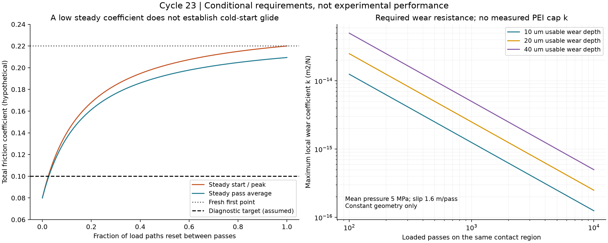
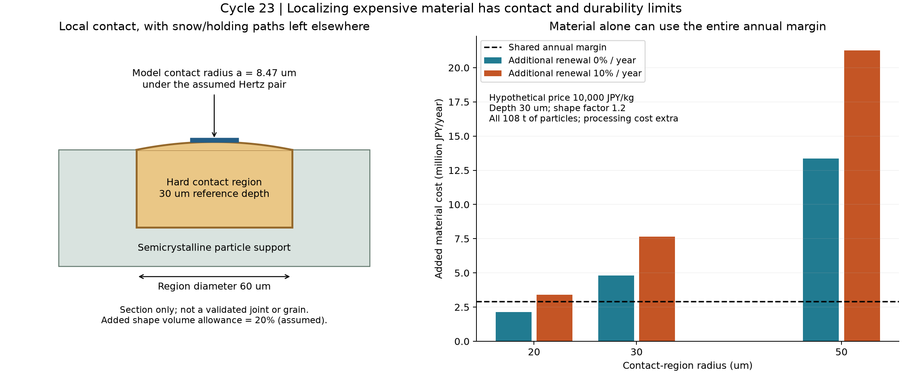

# 多方向探索第23巡：乾式異材接点と慣らし・摩耗の成立条件

2026-10-08／Codex。開始時の main：81d0d2658db019c0556ba85d4d36f63a5cdcdc1c。回覧板、正本v36、第3・21・22巡を参照。開始時点で第22巡後のClaude更新はなかった。

**今回の成果は、乾式で実ソール材と接する別材料を追加し、良い定常摩擦だけに依存しない採用条件を、初回滑走・整地による新面の露出・摩耗・製造速度・費用までつないだこと。** 水和層の延長だけへ固執せず、無充填PEIの局所接触部、配向PE、POM/PE、有限回転の別原理を比較する。

**物理試験0件、実物成功確率未算定。** 21項目の数値照合は実証実験ではない。正本第5.4節のHBG-5についての全要件同時達成15〜25％は、実測のない主観的な事前見込みであり、本巡の入力や計算ケースの通過割合で90％へ引き上げない。正本v36は変更しない。

## 1. 新案D23：乾式の接触部を粒内へ組み込む

対象は、枝状・開放形状を持ち、内部で保持・解放する人工粒である。固定マット、硬い床パッドやブラシを敷く案ではない。

| 比較枝 | 今回の具体化 | 続ける条件 |
|---|---|---|
| D23-A：半結晶性骨格＋局所PEI接触部 | PE等の骨格の丸い外側接点だけに、無充填のポリエーテルイミドを使う。雪と粒の接続通路・内部保持部は別に残す | 実ソールの新品面、雨後、乾燥途中、摩耗後も低抵抗。小接触部の脱落と全深度での性能を確認 |
| D23-B：同一PEの配向を利用 | 追加の水和膜を必須にせず、工場加工で接触部の分子配向を比較する | 配向方向、横滑り、逆方向、50℃、摩耗後のすべてで有利かを測る |
| D23-C：既存POM/PE系 | 第3巡を対照として保持。新しい実ソール相手の乾式比較へ接続 | 鋼相手や海水中の係数を移さない。初回と定常の両方を比較 |
| 別原理：接点を少し回して滑り距離を減らす | 有限回転が受け持てる距離を計算 | 小さな揺動だけでは長いソール通過の大半を受け持てないため、今回の主案へはしない |

PEIは非晶性材料であり、PEIが雪状の結晶へ変わると主張しない。Aの結晶性骨格、粒の枝形状、粒群の崩れ方は別の役割である。Aは乾燥滑走の比較枝で、30℃以上で噴霧すると結晶・枝状粒になるという優先課題の達成ではない。噴霧・結晶化の主枝は第16〜20巡として保持する。

## 2. 新しい証拠と、採用できない外挿

### 2.1 実ソール材UHMWPEに対する乾式の別材料

[S1の研究抄録](https://www.sciencedirect.com/org/science/article/abs/pii/S0036879225001271)は、UHMWPEピンと汎用PEIの乾式試験で、60N条件の摩擦係数0.0728、比摩耗量7.96×10⁻¹⁵m²/Nを報告し、移着膜の寄与を挙げる。

今回は索引上の出版抄録を確認できたが、直接ページ・DOI先の本文取得は失敗した。速度の具体値、温度、粗さ、慣らし履歴、ばらつき、樹脂銘柄は取得範囲では確定できない。この係数を50℃の人工粒へ代入せず、**乾式で比較する相手材を選ぶ証拠**に限定する。比摩耗量はUHMWPEピン側の値であり、PEI接触部の摩耗率ではない。

関連する[S7の著者所属大学の抄録](https://avesis.uludag.edu.tr/yayin/9d1cfe31-62bf-48ad-bc2e-1dfe8a346773/friction-and-wear-properties-of-uhmwpe-and-peek-polymers)には、PEIの展開名がPolyethylenimineと記載されている。S1のpolyetherimideと同一化せず、方法・樹脂名が確認できるまで独立再現の件数にも数えない。

### 2.2 銘柄と製造温度を分ける

[S2：SABICのULTEM 1000資料](https://materialfinder.sabic-specialties.com/material/ultem-resin-1000)は、非晶性PEI、代表密度1.27g/cm³、引張弾性率3200MPa、射出成形の溶融温度350〜410℃を示す。今回、物量計算には密度だけを採用した。S1のGP-PEIとこの銘柄が同一とは確認していない。

高温に耐える名称でも、50℃での摩擦・衝撃・疲労・微粒子の安全を証明しない。また、高温PEIを既存のPE微粒へそのまま溶融塗布する量産工程を成立済みとはしない。別工程で成形した接触相を低温側の骨格工程へ組み込む等、温度順序の検証が必要になる。

### 2.3 配向・形状だけへの期待を点検

[S3のPOM／UHMWPE接触研究](https://link.springer.com/article/10.1007/s40544-024-0887-2)は、変形抵抗と凝着抵抗、連続・不連続運動の違いを扱う。丸みで押しのけを減らしても、凝着が自動的に消えるわけではない。研究中のシリコーン油による成分分離試験を、採用潤滑へ持ち込まない。

[S4の延伸配向研究](https://scijournals.onlinelibrary.wiley.com/doi/10.1002/pi.4404)には乾式摩耗・散逸の改善例がある一方、[S5の圧縮配向研究](https://www.sciencedirect.com/science/article/pii/S1751616125000967)は、弾性限界を超える摩耗条件で、結晶配向が増えても摩耗粉が増えたと報告する。加工と荷重が異なるので、互いを同条件の再現と扱わない。**結晶化度が高いから雪らしく滑る、という採用基準を置かない。**

[S6のPOM／PE研究](https://www.sciencedirect.com/science/article/pii/S0043164826002255)は人工海水中であり、乾燥・雨水の証拠へ移さない。塩による潤滑は採用しない。各出典の取得範囲は同梱のsources.jsonに記録した。

## 3. 移着膜ができてから滑る素材は、初回も滑るか

### 3.1 反証可能な模型

慣らし済みの荷重経路の割合をcとする。これは顕微鏡で測った膜面積でも、成功確率でもない。慣らしに要する距離の尺度Lrを置き、滑り距離sに対して

- dc/ds＝(1−c)/Lr
- μ_total＝μ_other＋μ_fresh(1−c)＋μ_conditioned c

と仮定する。滑走の間に、慣らし状態のqが新しい状態へ戻るなら、次回の初期値はc_next＝(1−q)c_afterとなる。

1回の載荷滑り距離L＝1.6m、a＝exp(−L/Lr)とすると、定常の通過開始時は

c_before＝(1−q)(1−a)／[q＋(1−q)(1−a)]

となる。微粒が固定位置でソールの載荷長を通して滑る比較である。転動・間欠接触や圧力の時間変動がある実床では、実測した有効距離・荷重履歴へ置き換える。

qは**各滑走の間に失われる慣らし状態の荷重割合**であって、毎年の新品購入割合、整地による質量交換率、環境流出率ではない。整地や雨で一度に全面が未処理状態へ戻れば、定常計算ではなく初回からやり直す。雨が表面化学自体を変える場合も、この単純なqだけでは説明しない。

### 3.2 定常の良い数値だけでは落とすべき案が残る

反例用の未測定入力をμ_fresh＝0.20、μ_conditioned＝0.06、μ_other＝0.02、Lr＝10mとした。S1の0.0728を移植した値ではない。総係数0.10は研究用の比較目標であり、人体安全の閾値や雪感の完成条件ではない。

| 各通過間のリセットq | 定常の通過開始係数 | 定常の通過平均係数 |
|---|---:|---:|
| 0％ | 0.0800 | 0.0800 |
| 1％ | 0.0890 | 0.0883 |
| 10％ | 0.1401 | 0.1355 |
| 50％ | 0.2020 | 0.1927 |
| 100％ | 0.2200 | 0.2094 |

どの行でも、新品・全面リセット後の最初の一点は0.22、最初の通過平均は約0.2094である。この反例では、定常平均が0.09を切る案でも、利用開始時の必要性能は満たさない。

開始時にも0.10以下にするにはc≥0.85714が必要。定常について許せるリセットの上限を逆算すると、q≤0.02405（約2.4％）となる。これは実床の露出率を測った結果ではなく、測るべき上限条件を得たもの。

**採用の優先順は、慣らし前から乾式で低抵抗な組合せ → 工場での前処理が雨・摩耗後にも残る組合せ → 現場で再び慣らす必要がある組合せ。** 後者へ進むなら所要時間と削り粉を明示する。上の計算入力は失敗を点検するための範囲であり、PEI候補の初回摩擦が0.20と判明したわけではない。

### 3.3 60分閉鎖へ入れる場合の、楽観的な下限

上の比較入力では、cを0から必要値へ進める局所滑り距離はS＝1.94591 Lr。2,000m²の比較床を長さ100m・幅20mとし、全幅装置が0.6m/sで移動、接触長0.2m、局所の相対滑り速度10m/sと仮置きすると、1回の通過が与える距離は3.333mとなる。

| Lrの仮定 m | 必要な局所滑り m | 全幅装置の必要通過回数 | 移動だけの時間 分 | 必要距離までの摩擦仕事のみ kWh |
|---|---:|---:|---:|---:|
| 0.1 | 0.195 | 1 | 2.78 | 0.071 |
| 1 | 1.946 | 1 | 2.78 | 0.710 |
| 10 | 19.459 | 6 | 16.67 | 7.103 |
| 100 | 194.591 | 59 | 163.89 | 71.026 |

摩擦仕事は床の公称圧5.4kPaで、p×床面積×∫μ_contact dsを積分した下限。通過回数の切上げによる余分な仕事、効率、空転、転回、展開、回収、乾燥、床を崩す抵抗を含まない。時間も同じ面が保持される理想値で、再配置して次々に新面が出る場合には足りない。1kmコースをこの100m例の時間で処理できるという意味ではない。

60分閉鎖のうち処理へ40分を仮割当てした比較では、Lr＝100mは移動時間だけで超過する。Lr＝10mが計算上40分内でも、装置が粒を流さず全接点へ必要距離を与えることは未確認。牽引ローラーに高速の擦り合わせ機能が備わっているとはせず、追加装置費も未見積り。**慣らし工程を営業中の利用者へ肩代わりさせる案にはしない。**

## 4. 小さな接触部を厚くすると、何が増えるか

### 4.1 初期接触と、粒内の異材境界を分ける

第21巡と同じ診断例、4接点・総荷重6.48mN・曲率半径150µm・有効弾性率300MPaのHertz模型では、接触半径a＝8.47µm、平均接触圧7.19MPa、最大10.78MPa、押込み0.478µmとなる。300MPaは組合せ全体の仮定で、PEIのメーカー引張弾性率ではない。

仮の検査として、異材境界までの深さと接触部の半径を各3a以上と置くと、両方に約25.4µm必要になる。この倍率3は層状接触の精度保証ではない。20µm半径の安い案では、この検査にも入らず、骨格のたわみを含む解析が先になる。30µm半径・30µm深さも、その検査を満たすだけで接着・保持・疲労に合格したわけではない。

図の異材境界は配置の模式断面であり、接着や抜止め形状を設計済みとはしていない。全粒の3D形状、姿勢分布、端部露出、鋼エッジで切れた後の破片は次の統合条件である。硬い接触部が高温に耐えても、相手のソールや下の骨格の摩擦熱・クリープを同時に解決しない。

### 4.2 寿命を材料名から決めず、必要摩耗率を求める

比摩耗量kを使う局所の定圧・一定形状の診断では、摩耗深さh＝k p n Lとなる。pは局部接触圧、nはその接点が載荷された回数、Lは1回の有効滑り距離である。

p＝5MPa、L＝1.6m、使える厚さ10µmなら、1,000回へ耐える必要条件はk≤1.25×10⁻¹⁵m²/N、10,000回なら1.25×10⁻¹⁶m²/N。PEI側のkは未測定であり、S1のUHMWPEピンの摩耗率をここへ入れない。スキー側の摩耗も別に計測する。

10〜40µmの余裕、1〜10MPa、100〜10,000回を比較データに残した。皮むけ・割れ・異材接合の脱落・土砂の研磨・摩擦熱・形状の変化は、この深さ式だけでは予測しない。被膜を摩耗させて使う構成を採る場合は、失われた粒子の回収と曝露も質量収支へ入れる。

## 5. 高価な材料を局所化しても、加工は無料にならない

比較床は従来の2,000m²×0.45m×120kg/m³＝108t。等価径500µm・見掛け密度300kg/m³という粒数の仮定では約5.50兆粒、1粒4か所なら約22.0兆か所の接触部になる。

局所材料の体積を円柱πr²tで近似し、形状分の仮係数1.2、密度1270kg/m³、深さ30µmとすると次の物量となる。追加材料として数え、骨格を置換して軽くなる分の控除は置かない。

| 接触部半径 µm | 追加材料 kg | もとの108tに対する割合 | 床容積を固定した時の密度 kg/m³ |
|---|---:|---:|---:|
| 20 | 1,264.07 | 1.170％ | 121.405 |
| 30 | 2,844.15 | 2.633％ | 123.160 |
| 50 | 7,900.42 | 7.315％ | 128.778 |

小さな部品でも、全深度へ配置するとkg単位の少量ではない。表面だけ異材へ変え、300mmの掘削後に性能を失う案にすり替えない。

従来の税抜仮枠（材料500円/kg、10年8％、非材料初期費2000万円、年固定費400万円、年新品購入補充2％、年費用上限1900万円）では、基準年額1610.82万円、共通余裕289.18万円。2％は場外流出の許容値ではない。

接触部を年に追加で取り替える割合をαとすると、追加材料年額はm_contact×単価×(CRF＋0.02＋α)。以下は市場見積りではなく、この共通余裕を原料だけへ全部割り当てた単価上限である。

| 接触部半径 µm | 追加交換なしの上限 円/kg | 年10％追加交換の上限 円/kg | 年100％追加交換の上限 円/kg |
|---|---:|---:|---:|
| 20 | 13,534 | 8,504 | 1,957 |
| 30 | 6,015 | 3,779 | 870 |
| 50 | 2,166 | 1,361 | 313 |

仮に原料1万円/kgなら、20µm半径・追加交換なしでも年213.66万円を使い、加工・接合・検査・慣らし等に残る共通余裕は年75.52万円。30µm半径では原料年480.75万円となり、従来の余裕を超える。ただし依頼者の素材優先方針に従い、超過を隠さず比較枝として保持する。整地設備2億円以内（税込）の要求、現地土木・水処理などの未解決を、この材料計算で通過扱いしない。

逆に、半径30µm・深さ30µmで仮の原料3,000円/kg、年10％の追加交換なら、追加原料年額は約229.55万円、残る共通余裕は約59.63万円。この条件を工程側の照会境界として残す。実単価・寿命が確認でき、加工と回収等がその余裕に入れば比較を続ける。原料単価だけ安くして成立扱いしない。

さらに1000時間・歩留まり80％で全量を作る仮定では、毎秒約191万粒、接触部の個別作業に換算して毎秒約764万か所が必要になる。手作業の微小部品組付けを量産主案には置けない。

次の製造比較は、(a)同一材の接触部、(b)連続した多相前駆材から切断・形状形成する経路、(c)多数粒の外面へ同時に局所処理する経路とする。いずれも粒形の自由度・材料の温度差・選択性・歩留まり・再生後の相分離を評価する。連続工程の機械が既に存在する、PEIとPEを簡単に同時噴霧できる、という前提は置かない。

## 6. 有限回転による低摩擦化を主案にしなかった理由

中心が固定された接点を1回だけ角度θ回す場合、受け持てる距離の幾何上限はRθ。半径300µmを180°回しても0.942mmであり、載荷長1.6mの約0.059％しかない。今回の半径150〜300µm・角度30〜180°・載荷長0.2〜1.6mの12条件では、最も有利でも0.472％未満だった。

これは少し首を振る接点だけで、持続的な滑りを転がりへ変えたことにできないという反例。自由に回り続ける軸受や粒の並進は別原理だが、支持・横反力・脱落・維持費が別途必要になる。本巡では、有限揺動を雪感の補助へ限定し、低摩擦の主因へ数えない。

## 7. 雪感・冬・雨・安全の要件を残す

D23が乾式で良く滑っても、砂のような粒床であれば目的は未達。半結晶性の骨格と開放した粒内・粒間接続で、載荷・除荷、掻き分け、溝、横反力、解放後の抵抗、振動を新雪圧雪の基準と比較する。低いμを雪感の代わりにしない。

冬は、無処理の通路を雪が満たすこと、粒同士と地盤側も含めて荷重が伝わること、融解水の逃げ道が残ることが必要。局所PEI化による雪・氷の付着は未測定である。夏の移着膜が冬に残る影響も確認する。

豪雨後に山側へ回収して均すだけで、剥がれた接触部や失われた慣らし状態まで戻るとは扱わない。回収粒の健全率、付着土砂、処理面の状態、排水、再配置後の初回滑走を一緒に判定する。

無充填・非晶性・高耐熱・医療研究に登場するという名前は、完成品の人体環境安全の証明ではない。実際の配合、未反応物・添加剤、脱落片、ソール由来の移着物、日射・摩耗後の曝露を扱う。銘柄名だけの安全宣言をしない。油・塩類・フッ素・シリコーン潤滑、現地強酸処理を導入しない。

300mmの削れ代、450mmの比較層、約30°斜面、閉鎖時80m/s、9〜17時営業、4〜5時間ごとの保守、60分程度の閉鎖、夏30℃以上・表面約50℃、冬の固着・界面排水、常時散水でべしゃべしゃにしない条件を維持する。

## 8. Claudeへの具体的な次の依頼

1. **まずD23-Aの材料同定。** S1の全文でGP-PEIの銘柄、相手材、温度・速度・粗さ・初回曲線を確認し、S7のPEIの展開名の不一致を解消する。現時点のデータを50℃の実板の値へ付け替えない。
2. **同じ材料で初回から比較。** 無処理PE、配向PE、POM/PE、無充填PEIを実ソール相手の30／50℃、乾燥・湿潤・乾燥途中・再乾燥、停止再始動、正逆・横方向で比較する。製作と物理試験はまだ行っていない。摩擦曲線が得られたらLr・初期値・洗浄後の状態を同時に同定し、定常値だけを選ばない。
3. **接触部の比較と量産を接続。** 平らな試片で有利でも、20〜50µm半径・有限厚さ・柔らかい骨格上へ移した時の接触、脱落、両側の摩耗を別に評価する。原料費と加工費の上限、毎秒の等価作業数を使って連続形成の可否を判定する。
4. **雪状形成との融合。** 噴霧で形成する結晶性枝や既存の多分岐原料に、初回から低抵抗な接触部を付ける具体工程を比較する。PEIの非晶性や高い加工温度を隠さず、噴霧・結晶化への適合が弱ければ単一材の配向・多相構造へ戻す。
5. **独立検算。** cの荷重重み、qの意味、初回と定常、摩耗係数の相手側、追加材料密度、原料と加工費、慣らし装置の下限時間を点検し、反例・出典・計算をGitHubへ回答する。

次の採否を変えるのは「50℃の初回曲線が目標を外すか」「雨後に初期化されるか」「片側だけでなく両側の摩耗が収まるか」である。これが不明なまま微粒全体の精密製作へ進めることを優先しない。今回の報告は候補を増やすだけでなく、慣らし依存と量産費で先に切り分けるための条件を提供する。

## 9. 再現・共有

[入力・計算・全結果・図・出典](乾式接点検証_移着と摩耗予算_20261008/README.md)。物量18・費用162・慣らし180・処理時間4・摩耗108・接触12・製造6・有限回転12条件。21項目の質量・力・漸近挙動・逆算・費用・独立積分の照合を通過した。物理試験や統計的な成功確率ではない。

回覧板でClaudeと共有し、受領・同意は別に確認する。GitHubの不変コミットから全公開ファイルを照合した後、ローカルの研究ファイル・依存ライブラリ・Git履歴を削除し、接続案内と利用設定を保護する。
