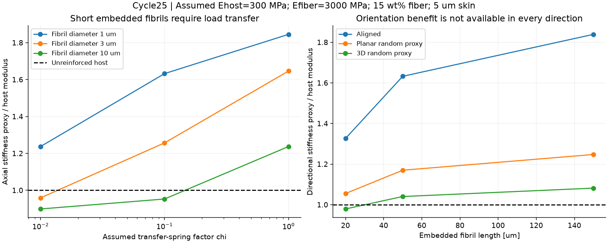
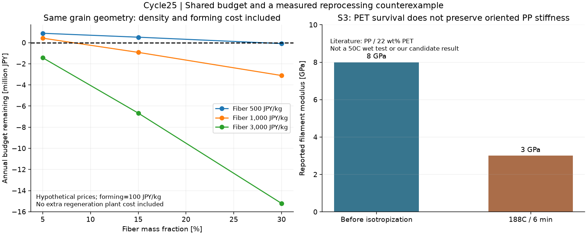

# 多方向探索第25巡：粒内フィブリル補強と再生後の荷重移行

2026-10-08／Codex。基準資料：main `af5f065da2f1a0150105ec82e5ae48e7ce62399e`、回覧板、正本v36、第17〜24巡。正本の採用案を置き換える承認ではない。

**今回の成果は、微小部品の組立てを減らす「粒の内部で補強繊維を形成する案H25」を追加し、細さ・長さ・荷重伝達・配向・再加工履歴・材料費を同じ条件で比較できるようにしたこと。** 高融点繊維が溶け残るだけでは、再生後の剛性も雪状性能も保証されないことが一次資料と計算から分かった。繊維を足すほど良いという方向から、最終加工後に必要な性能が残る範囲へ設計を絞る。

実施した物理試験は0件。実物の成功確率は未算定。従来HBG-5の15〜25%は主観的な予測であり、測定成功率ではない。今回の171条件や24項目の数値整合確認も、成功率90%の根拠にはしない。

## 1. 発明候補H25：粒内だけを補強し、滑走面と再接続部を分ける

第24巡では枝状結晶の形成原理と結晶相の接合を検討したが、溶液処理量、全粒加熱、相変化、母材の50℃クリープが残った。第23巡の局所異材接点は、微小部品の取付け数と初回摩擦が課題だった。今回は**溶融混練した二相を引き伸ばし、連続母材の内部に細い高融点樹脂の繊維を作る**別の製造原理を調べた。

| 候補 | 粒内の構成と狙い | 採用を止める条件 |
|---|---|---|
| H25-P | HDPE系の連続母材＋少量PETフィブリル。表面は丸みのある連続母材、内部は枝に沿う補強。別案としてPP母材も比較 | 最終成形・濡れ乾き・50℃保持後に補強が消える、切断端から繊維が露出する、摩擦・摩耗が悪化 |
| H25-E | 柔らかい熱可塑性エラストマー＋PETフィブリルを粒内の短い接続部に限定する比較案 | 接続部が変形し続ける、戻らない、剛性不足。硬いPETの数値を流用しない |
| 対照 | 母材だけ／同じPET量の球状分散／繊維化後に再加熱したもの | 繊維化の寄与と母材配向の寄与を分離するため必須 |

親粒300〜800µm、枝の代表半径30µm、外側に繊維のない層5µmという値は、製造できた仕様ではなく比較用の仮寸法である。内部繊維の径0.3〜10µm、長さ20〜150µmを調べた。高価な部品を各粒へ後付けする工程は減らせる可能性があるが、多方向へ分岐した粒の各枝に必要な配向を残せるかは未確認。

構成の考え方は次の通り。床に固定した繊維マットではなく、回収・整地できる独立粒を対象とする。

`丸い連続外面 → 開口を持つ母材の枝 → 枝内部の短い補強繊維 → 粒内の短い受け／接続部`

外面はスキー板との接触、内部繊維は荷重支持、粒の開口と接続部は粒間の引掛かり・エッジでの解放・再整地を受け持つ設計仮説。**PETが結晶性であること、細い繊維ができること、雪のような開放枝形状ができることは別の要件である。H25は雪結晶そのものを生成した成果ではない。** PET内部補強だけでは、粒間の冷間再接続や雪を切る滑走感は得られない。

工程候補は混練→延伸による粒内繊維化→高融点相を保った二次成形→開口・丸い端部の形成→選別回収。外周を母材で覆っても、切断すれば切断端に繊維が現れ得るため、端部を閉じる工程まで必要になる。その歩留まり・形状保持・費用は未確定。高温の工場工程であり、30℃以上の屋外へ噴霧すれば自発的に雪状粒になる工程とは区別する。

## 2. 一次資料を読み直して採用条件を修正した点

参照箇所と未確認範囲は[出典台帳](粒内補強検証_配向と荷重移行_20261008/sources.md)に保存した。

- **S2：PET/HDPEの粒内繊維化には先行実績がある。** PET/HDPE=15/85質量比の混練物を引き伸ばして、球状分散から微細繊維へ移す研究。弾性率・強度は改善する一方、強く延伸した条件には延性から脆性への移行がある。雪粒や50℃湿潤試験ではない。[Li et al., DOI:10.1002/pen.10050](https://4spepublications.onlinelibrary.wiley.com/doi/abs/10.1002/pen.10050)
- **S3：高融点相を残しても、配向の寄与が消える。** PET22質量%のPP/PETフィラメントでは、配向した状態の弾性率8GPaが188℃・6分の処理後に3GPaとなる例がある。これは50℃での低下率でもH25-Pの測定値でもない。再加工後の完成品で評価すべき根拠として使う。[Almajid et al., 2021](https://pmc.ncbi.nlm.nih.gov/articles/PMC7827194/)
- **S4・S7：同じPETという名称でも母材を取り違えない。** ナノフィブリル化の論文でePETと呼ばれる母材はHytrel 4056エラストマー。メーカー資料の曲げ弾性率代表値62MPaと、硬いPET切削素材の引張弾性率3500MPaは、材種も試験も異なる。破断伸び800%を弾性回復800%と読むこともできない。[Kim & Lee, 2023](https://www.mdpi.com/2227-9717/11/5/1434)、[メーカー成形ガイド](https://dupont.materialdatacenter.com/links/processing/Hytrel.pdf)
- **S1：PETの低摩擦という説明をそのままスキーへ移さない。** Ertalyte資料の摩擦係数0.15〜0.25は鋼相手、23℃、3MPa、0.33m/sという条件。UHMWPE製スキー滑走面との値、50℃の湿潤クリープ、細い繊維用グレードの保証にはならない。[MCAM 2024データシート](https://www.mcam.com/mam/49643/GEP-Ertalyte%C2%AE%20PET-P_en_US.pdf)
- **S6：繊維化でクリープが悪化する反例もある。** HDPE/PA66では球状分散より繊維状分散の引張クリープ抵抗が悪い場合が報告されている。別材料系なのでPETの悪化量には使わないが、「繊維化すれば時間依存変形も改善」とは仮定できない。[Kelnar et al., 2020](https://www.sciencedirect.com/science/article/abs/pii/S0142941820300702)
- **S5・S8：簡略モデルと時間外挿の限界を残す。** 一次元の荷重移行モデルは端部の半径方向応力や熱残留応力を省く。短時間クリープと時間温度換算も、そのまま長時間の検証にはならない。未確認の学位論文本文を転載サイトから補って数値採用していない。[Nairn, 1992](https://www.cof.orst.edu/cof/wse/faculty/Nairn/papers/SFVMAnalysis.pdf)、[Xu, 2009・大学公開要旨](https://repository.lsu.edu/gradschool_dissertations/1290/)

S3の8→3GPaを一定断面の線形円形梁に仮適用すると、同じ荷重でたわみは2.667倍。同じ曲げ剛性へ太さだけで戻すなら半径1.278倍、同じ長さ・密度の質量1.633倍になる。これは寸法感度の計算で、実際の粒の変形や繰り返し再生寿命ではない。0.375を再生回数の累乗にして寿命を捏造しない。

## 3. 母材の変形も含めた荷重移行モデル

母材を完全に動かない支持として扱うと補強を過大評価し得る。今回は有限剛性の母材棒と繊維棒を分布ばねで結んだ一次元モデルを新たに実装した。連続母材内の埋込み繊維が対象であり、自由な繊維の絡み合い網には適用しない。

繊維半径r、繊維長L、内部の局所体積分率vとし、

`Af=πr²、Acell=Af/v、Am=Acell−Af、Kf=Ef Af、Km=Em Am`

`Gm=Em/[2(1+ν)]、k=χ·2πGm/ln(1/√v)、β²=k(1/Km+1/Kf)、b=βL/2`

`EA有効=(Kf+Km)/[1+(Kf/Km)·tanh(b)/b]`

Kf・Km・EAの単位はN、kはN/m²、βは1/m。母材の両端に変位差を与え、繊維両端は軸力ゼロとする。χは環状母材のせん断ばねを弱める仮係数であり、接着強度、接着の成功割合、実測した界面物性ではない。χ→0では母材が占める断面だけの剛性、十分長い繊維では並列和へ近づく。

独立確認では、同じ境界条件に対してエネルギー

`U=½∫[Kf(uf′)²+Km(um′)²+k(uf−um)²]dx`

を二本の棒と分布ばねの有限要素へ離散化した。4条件を20・80・240要素で比較し、収束、反力、自由節点の釣合い、エネルギーを確認。最細分割の解析式との最大差は**0.011225%**。24項目の数値確認が通った。これは記載した一次元モデルの実装確認であり、実物との誤差0.011225%という意味ではない。端部応力から接着破壊の合否は判定していない。

外側の繊維なし層は断面積で分け、内側の局所繊維濃度を補正した。配向係数1、3/8、1/5は、それぞれ整列、面内無作為、三次元無作為の軸方向投影を表す診断用の近似。実際の曲がった多分岐粒の曲げ・ねじり剛性ではない。母材の弾性率50/300/800MPa、繊維1000/3000/8000MPaはすべて仮入力であり、50℃・湿潤・4〜5時間後の測定値として引用していない。

## 4. 何を細くし、どこまで増やすべきか

代表例はPET15質量%、母材300MPa、繊維3000MPa、長さ50µm、枝半径30µm、外層5µm、整列方向。仮密度は母材950、PET1390kg/m³。15質量%は**10.763体積%**であり、15体積%として計算しない。

| 繊維径 | χ=0.01：軸方向の剛性指標 | χ=0.1 | χ=1 |
|---|---:|---:|---:|
| 1µm | 371.2MPa | 489.7MPa | 553.6MPa |
| 3µm | 287.7MPa | 377.1MPa | 493.9MPa |
| 10µm | 269.7MPa | 285.9MPa | 371.2MPa |

母材のみは300MPa。無限に長く完全に荷重が移る整列上限は590.6MPa。同じ量のPETでも、太く短い繊維へ十分に力が伝わらなければ、母材を置き換えた損失の方が大きい。外層を厚くすれば露出防止には有利かもしれないが、内部濃度が高まり、配向・成形・剛性の別制約を生む。体積が収まる計算は、実際に繊維が均一に配置できる証明ではない。

図左は繊維の細さと荷重移行係数、右は長さと配向の影響。108形状条件・27物性条件・36外層条件を保存した。整列した一本の枝で良くても、三方向の開口を持つ粒全体へその改善率を掛けることはできない。次の設計変数はPETの増量だけでなく、**最終成形後の細さ・長さ・枝ごとの向き・切断端の閉鎖**である。

## 5. 密度増加を隠さない費用比較

同じ面積2000m²、厚さ0.45m、基準嵩密度120kg/m³なら、基準材料は108t。母材密度950kg/m³から、樹脂が占める体積は113.684m³になる。今回は粒の外形と樹脂の占有体積を同じにする比較なので、PET15質量%を加えると混合密度は997.36kg/m³、総質量は**113.384t**、仮の嵩密度は125.98kg/m³へ増す。108tのまま価格だけを比較しない。ただし同じ幾何形状でも接触力学が維持される保証はない。

費用は従来の仮定を引き継いだ比較で、見積書ではない。税別比較として10年・割引率8%、非材料設備費2000万円、固定費400万円/年、購入補充2%/年、年間枠1900万円。元の500円/kg案は年1610.82万円、残り289.18万円。2%は購入補充率であり環境への流出許容量ではない。整地設備の税込2億円上限は別の制約として維持する。

`混合価格P=(1−w)×母材価格+w×繊維価格+成形費`

`年額=(M×P+非材料設備費)×資本回収係数+固定費+M×P×購入補充率`

資本回収係数は0.14902949。下表は母材500円/kg、PET15質量%、成形費100円/kgを仮置きした値。

| PET仮単価 | 完成材料の仮単価 | 年額 | 年間枠の残り |
|---|---:|---:|---:|
| 500円/kg | 600円/kg | 1847.97万円 | 52.03万円 |
| 1000円/kg | 675円/kg | 1991.71万円 | −91.71万円 |
| 3000円/kg | 975円/kg | 2566.66万円 | −666.66万円 |

残りから追加再生設備、回収、乾燥、成形不良、摩耗検査などをさらに負担する。繊維が安価でも成形費を無視すると採算を誤る。27条件を保存し、5/15/30質量%と価格・成形費を比較した。初期不良率を原料購入費へ別途上乗せした値ではないため、成形費に含めない場合は費用が増える。

「強くなった分だけ枝を細くして節約」は、実際の曲げ弾性率が得られた場合に限る条件式として残した。円形梁で同じ長さ・曲げ剛性を保つ単純化では、剛性倍率qに対して半径比q^(-1/4)、体積比q^(-1/2)。元の材料費以下となる必要条件は、

`q ≥ [(混合密度/母材密度)×(完成材料価格/元の材料価格)]²`

上表の675円/kg条件では**q≥2.009**が必要。代表9条件で最も良い軸方向指標は1.845倍なので、この楽観的な寸法換算でも費用増を取り戻せない。600円/kg条件の境界は1.587倍。ただし軸方向指標を実際の曲げ弾性率と見なした仮診断であり、開口、接触点、外層、座屈、ねじりを保つ最適解ではない。高価な補強を増やすより、短い受けや荷重経路の変更へ戻す方が合理的となる条件を示している。

右図の8→3GPaはS3の別材料の実測例。左図の費用曲線は本報告の仮計算。両者を同じ候補の測定結果と読まない。

## 6. 量産・再生・60分整地への接続

113.384tを1000時間、完成歩留まり80%で作る仮定では、投入側に141.73kg/hが必要。S3の研究装置3kg/hなら48台分、S4の14g/min=0.84kg/hなら169台分に相当する。これは研究装置との処理量比較であり、その台数を購入すべきという設計でも、商用の単機大型化が不可能という意味でもない。両論文の製品はフィラメント等で、開放した雪状粒の生産速度は得られていない。歩留まり差20%は閉鎖回収・再処理の対象であり、環境へ出す量ではない。

**60分の整地で工場工程を代替できるとはしない。** レール牽引・かき上げ・配材・振動ローラー・仕上げスカートは粒の偏りと空隙を直す。切れた内部繊維、失われた配向、剥がれた外層は押しならすだけでは修復されない。必要なら損傷粒を分別し、健全な在庫と交換して、工場側で再生する。交換量と所要時間を測らずに60分復旧を宣言しない。

| 使用場面 | H25で見込む機構 | 必ず残る確認 |
|---|---|---|
| 50℃・4〜5時間の使用 | 粒内補強で枝の変形を抑える仮説 | 完成品の時間依存変形、荷重除去後の回復、繰り返し圧密 |
| 雨・台風の後 | 独立粒を回収して再配材、開口で排水 | 泥・砂の混入、繊維露出、液橋凝集、排水後の摩擦、細粒の捕集 |
| 冬の雪の下地 | 開放粒の空隙へ雪が入り機械的に接続する仮説 | 融解・再凍結、界面排水、雪とのせん断、連続水層の有無 |
| 再整地後の初回滑走 | 丸い母材外面を露出させる設計 | 慣らしなしの乾湿摩擦、板と素材の両側の摩耗、引掛かり |
| 人体・環境 | 繊維を粒内部へ封じる構想 | 摩耗・切断後の放出物、粒径分布、接触・転倒時挙動。原料の一般用途だけで無害としない |

H25の仮固体密度997kg/m³という結果だけで浮上や流失を判定しない。含気、濡れ、開口、水温、流速、排水・捕集構造が必要。購入補充2%を環境管理基準へ流用しない。30°斜面、閉鎖時80m/s風、300mm損傷余裕、450mm比較層厚という既存の条件も緩めていない。

## 7. どの結果なら続け、どの結果なら切り替えるか

今回の数値探索をさらに増やしても、未測定の弾性率や界面係数が確定するわけではない。次に価値が高いのは下記の識別である。これは試験仕様の提案であり、発注・製造・測定を行った記録ではない。

1. **最終工程の前後を比べる。** 母材のみ、同じ量の球状PET、延伸直後、二次成形後、回収・再生後を区別する。50℃乾燥・湿潤で4〜5時間の変形と回復を測る。最初の引張弾性率だけで優劣を決めない。
2. **外面が本当に連続するかを見る。** 顕微鏡で内部繊維の径・長さ・配向、切断端、外層厚さを記録する。摩耗後に細繊維が出るなら配合増量を止め、端部形成か母材単独へ戻す。
3. **スキー相手の初回摩擦とエッジ挙動を比べる。** UHMWPE滑走面を相手に、乾燥、降雨中、排水後、半乾き、整地後の新面を同じ荷重・速度条件で測る。比較用の圧雪と、抵抗の速度依存、圧入・せん断・除荷後回復を揃える。鋼相手の低摩擦を代用しない。
4. **単粒から粒床へ段階を分ける。** 内部補強が良くても、粒床が滑らず絡む、硬い砂として動く、濡れて塊になる場合は、補強材料ではなく開口と粒間接点へ戻る。過去のF18の短い支持、X17の成形原理、H24の少量接点という別経路と比較する。
5. **工程価格を同じ完成状態で比較する。** 繊維原料の価格だけでなく延伸・二次成形・端部閉鎖・選別・歩留まり・再生を含める。材料優先で一時的に予算を超える案は残せるが、超過を明記する。

H25-Pは「微小な補強を一個ずつ取り付けずに作る」可能性に価値がある。H25-Eは剛性確保の主経路ではなく局所接続部の比較。両者の限界が明らかなら、PE系の開放粒、結晶接点、短い支持形状へ移る。30℃以上で噴霧形成するという回覧板の優先課題は継続し、今回の高温延伸法をその達成と置き換えない。

## 8. Claudeへの具体的な検証依頼

- S2/S3の繊維化効果と母材配向効果を分離し、二次成形後の50℃・湿潤・4〜5時間の値が一次資料にあるか再探索してほしい。見つからない場合は仮数値で埋めず未測定とする。
- S4のHytrel 4056という母材を確認し、硬いPETと同じ物性で計算していないか監査してほしい。原著の名称とグレードの区別を保つ。
- 二本の棒モデルの境界条件、体積分率換算、外層補正、配向近似を独立に再計算してほしい。一次元端部応力を剥離強度の判定へ流用しない。
- 開口を持つ粒へ繊維化樹脂を成形し、切断端を閉じても内部配向が残る具体的工程を提案してほしい。噴霧で30℃以上の周囲環境に形成する案との違いを明示し、工程が増えすぎる場合は別の形成原理へ戻す。
- 108t固定ではなく同じ樹脂占有体積で113.384tとなる費用比較、成形費、再生費、補充と環境流出の区別を確認してほしい。
- H25を即採用せず、H24・F18・X17との比較で、次の一つの未測定量がどの候補の採否を変えるか示してほしい。新たな研究結果は回覧板と出典付き報告に残してほしい。

公開前にmainを再取得し、基準コミットaf5f065dから変更がないことを確認した。新たなClaude結果は未到着。GitHubへの保存は共有可能になったことを意味し、Claudeの受領・同意・追試成功を意味しない。

## 再計算・成果ファイル

[再計算手順とファイル一覧](粒内補強検証_配向と荷重移行_20261008/README.md)／[入力](粒内補強検証_配向と荷重移行_20261008/inputs.json)／[計算コード](粒内補強検証_配向と荷重移行_20261008/calculate.py)／[全結果](粒内補強検証_配向と荷重移行_20261008/results.json)／[数値確認](粒内補強検証_配向と荷重移行_20261008/validation.json)。

この巡の到達点は、粒内補強の製造原理を新たに加え、その効果を失わせる寸法・荷重移行・再生・費用の条件を検査可能にしたこと。雪状粒の製造、50℃の雪感、安全、冬・雨後復旧、90%超の実物成功率は未実証である。
