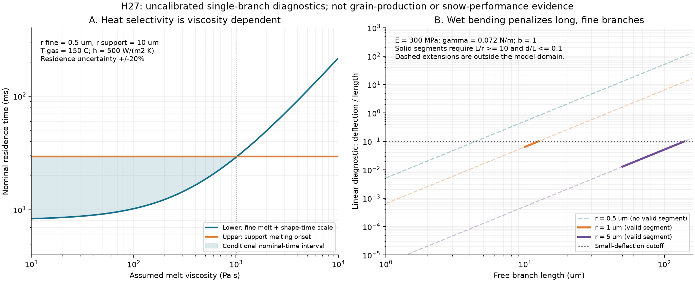
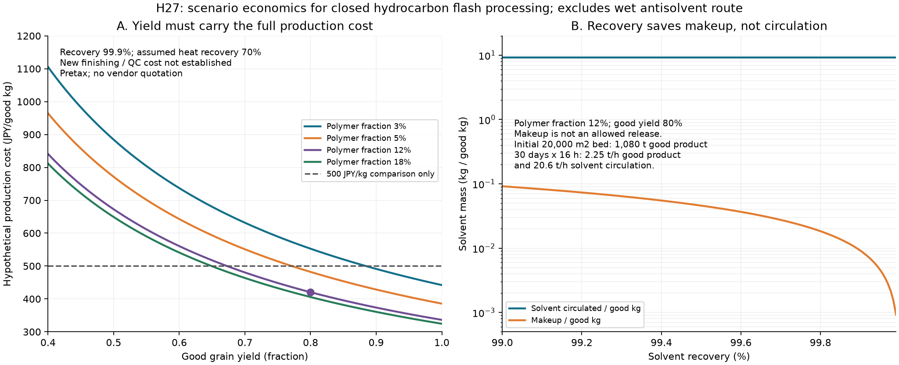

# 多方向探索 第27巡：枝状粒の形成と微細枝の熱仕上げ

2026-10-08／Codex。参照基点：f6dd5f8d373ea9eaf415bcfbe4b1ff4636d4c09d。現行正本v36は変更しない。H27は比較候補であり採用済み材料ではない。

## 1. 今回の成果と設計の変更

**本物の枝状高分子粒を作る実例を確認し、「細かい枝を最大限増やす」設計から、「支持する枝を残して、絡み過ぎる微細枝を抑える」製造案へ進めた。** 液中析出、フラッシュ紡糸、選択的な熱仕上げを比較し、H27を提案する。一次論文の顕微鏡写真・形成条件と、こちらの未実証の追加工程を分けた。

今回の成果は三点である。

1. 枝状粒の実在を確認した一方、枝が細かいほど強く接着して不織布化する競合を特定した。樹枝状の外形、分子の結晶性、圧雪の切れ方は別々に判定する。
2. 細枝だけを熱仕上げするために、融ける時間と形が変わる時間を分けた。ある仮定では加工可能な時間帯が存在するが、粘度1,000 Pa sでは約29 ms付近の狭い帯になる。加工条件の確定値ではなく、粘度と粒内熱伝導を先に測る理由を得た。
3. 溶剤回収率だけで安価とする見積りを改めた。追加仕上げ前の仮費用約420円／良品kgでも、歩留まり80%、大量の循環処理、追加仕上げ費を必要とする。2億円の整地設備枠とは分けて計算した。

**物理試験0件。実物の成功確率は未算定（null）。** 熱324条件、湿潤枝180条件、工場収支72条件はモデルの感度であり、実証件数や成功率へ換算しない。数値整合20項目の合格も、雪感の合格ではない。

参照：[第26巡](GPT回答_多方向探索第26巡_自己修復接点の保持時間と雪らしい解放_20261008.md)、[Claude自律ループv2](../バーチャル試験/自律ループv2_噴霧結晶化素材_第1〜4ラウンド_20261008.md)、[今回の計算一式](枝状粒形成検証_熱選別と回収収支_20261008/README.md)。

## 2. 「雪のような結晶構造」へどこまで近づいたか

| 経路 | 一次資料が実証したもの | 人工フィルンにまだ必要なもの |
|---|---|---|
| H27-A：せん断と貧溶媒析出によるSDC | 階層的に枝分かれした高分子微粒子 | 乾燥後も独立した粒であること、濡れて束にならないこと、50℃での支持と滑走 |
| H27-B：HDPEのフラッシュ紡糸 | 結晶性を持ち、細いフィブリルが連結する構造 | 連続した糸・シートから、必要な大きさの独立粒を高収率で得ること |
| H27追加工程：微細枝の熱仕上げ | 今回は時間尺度と熱収支のみ | 微細枝が短く丸まり、粉化・球化・粒同士の溶着を起こさない実物の確認 |
| 第24巡のPOM枝状結晶等 | 前巡で調べた結晶成長という別の形成原理 | 製造速度、残留物、粒群の雪感と再生の両立 |

SDCはSoft Dendritic Colloidsの略。高せん断の液中で高分子を析出させると、丸粒だけでなく枝分かれした形を得られる。[S1](https://www.nature.com/articles/s41563-019-0508-z) 一方、流れと析出速度等を変えると繊維やシートへも移る。枝は自動的に出来上がる形ではない。[S2](https://advanced.onlinelibrary.wiley.com/doi/10.1002/adma.202211438)

この枝状外形を「氷と同じ結晶」とは呼ばない。フラッシュ紡糸HDPEは結晶相を持つが、その事実だけで新雪の空隙・接点破断・低摩擦が揃うわけでもない。S4のTable 1では、濃度12→15 wt%で結晶化度65.3→66.6%に増えても、比弾性率は270.77→191.39 cN/texへ下がる。結晶化度一つで性能順位を決めない。[S4](https://www.ebi.ac.uk/europepmc/webservices/rest/PMC11991114/fullTextXML)

**利用者が感じる「砂の上を滑る」問題の判定対象は、粒の写真だけではなく、粒群の支え方とエッジによる短い解放である。** 枝を増やして強いフェルト状へ固めても、目的を達成したことにはならない。

## 3. H27：太い支持枝と、短く仕上げた外側の枝

### 3.1 構成と工程案

優先する製造候補は、結晶性骨格を持つH27-B。H27-Aは枝形成と乾燥凝集を比較する対照へ残す。どちらも**閉鎖された工場工程**を想定する。斜面上へ溶剤を噴霧する案ではない。暖気中へ噴霧するだけで、その場で雪状粒を作るClaude側の優先目標を達成済みとも扱わない。

工程案は次の順序である。

**枝構造を持つ半製品の形成 → 短い枝状片への分離と粗選別 → 細枝を狙う短時間の熱仕上げ → 閉鎖系で冷却・捕集・分級 → 独立粒・湿潤保持・50℃荷重の判定 → 少量の粒間接点を別に設計。**

微粉・溶着塊・不良粒は隔離する。原料へ戻す場合は枝の再形成が必要で、ローラー整地の延長ではない。

検討用の寸法は、全粒300〜800 µm程度を従来案との比較帯とし、支持枝の半径5〜20 µm、熱仕上げ対象の細枝の半径0.5〜3 µmを振った。**製造できた寸法分布ではない。** 連続糸を短い毛束にするだけなら、独立した雪状粒の形成とは判定しない。

第26巡の知見は、粒間接点を全面に増やさず、仮保持される少量の接点に分ける点で継承する。ただし、その接合材が今回のHDPE等へ接着すること、熱仕上げ後も働くことは未確認である。異なる論文の成功結果を足して一つの完成材料とはしない。

### 3.2 細枝を減らす理由

細枝は接触数を増やす利点と同時に、板への引っ掛かり、乾燥時の束化、摩耗片、粒同士の過剰接着を増やし得る。SDCを使う被膜の原著では、材料ごとに濡れ方が大きく違い、氷を剥がす際の被膜破壊も起きている。[S3](https://d-nb.info/126704456X/34)

枝を作れるコポリエステルエラストマーEcdel 9966にも、薄膜の摩擦係数が1.0超というメーカー値がある。相手材が違うためスキー摩擦値には使わないが、「柔らかい枝だから雪のように滑る」と選ぶ根拠にもならない。[S6](https://productcatalog.eastman.com/tds/ProdDatasheet.aspx?pn=Ecdel+9966+Elastomer&product=71001867)

H27は、支持に使う枝を保持しながら過剰な細枝を減らす仮説である。表面全体を溶かして丸い粒へ戻すと、最初の砂状粒の問題へ戻るため不採用とする。

## 4. 熱仕上げには本当に時間差があるか

円柱状の枝を集中熱容量で近似する。半径r、熱伝達率h、ガス温度Tg、初温T0、融点Tm、密度ρ、比熱cp、融解潜熱Hとする。

- 熱時定数：τ = ρ cp r / (2h)
- 融解開始：t_on = τ ln[(Tg−T0)/(Tg−Tm)]
- 全断面を融かす潜熱時間：t_lat = ρ r H / [2h(Tg−Tm)]
- 細枝の融解完了：t_melt = t_on + t_lat
- 形状変化の時間尺度：t_shape = K η r / γ

ηは溶融粘度、γは溶融体の表面張力、Kは仮に1。この最後の式は丸まりの目安であり、実際に望む形へ変わる時間の実測式ではない。細繊維には球への分裂という競合もある。[S7](https://pubs.acs.org/doi/abs/10.1021/acs.iecr.5b04472)

滞留時間のばらつきを±20%と仮定すると、公称時間tの条件は次になる。

**(t_melt,fine + t_shape) / 0.8 < t < t_on,support / 1.2**

左は「最短滞留でも細枝の処理に時間がある」、右は「最長滞留でも支持枝が融解を始めない」。融点未満でも支持枝の軟化やクリープは起こり得るため、この不等式は必要な診断の一部にすぎない。

代表仮定：ρ=950 kg/m³、cp=2,300 J/(kg K)、熱伝導率0.4 W/(m K)、H=200 kJ/kg、T0=50℃、Tm=130℃、Tg=150℃、h=500 W/(m² K)、細枝r=0.5 µm、支持枝r=10 µm、γ=0.03 N/m。

| 仮定したη | 細枝の融解完了 | 支持枝の融解開始 | 公称時間の下限〜上限 |
|---|---:|---:|---:|
| 100 Pa s | 6.508 ms | 35.166 ms | 10.219〜29.305 ms |
| 1,000 Pa s | 同上 | 同上 | 28.969〜29.305 ms |
| 10,000 Pa s | 同上 | 同上 | 下限216.469 ms、上限29.305 msで両立しない |

この例の粘度境界は約1,016 Pa s。材料一般の上限ではなく、この半径・熱伝達・ばらつきでの境界である。細枝のhを半分、支持枝のhを2倍にする条件も計算した。枝同士の熱伝導や気流遮蔽を無視した一様加熱の時間帯は、実機の工程保証に使えない。

溶融粘度を下げれば加工時間は短くなるが、分子量や結晶構造が変われば50℃の荷重保持にも影響する。**低粘度にするだけで解決したとしない。** 融解前後の粘度、加熱後の枝の長さ分布、冷却後の50℃クリープを同じロットで接続して評価する。

図1左の着色部は仮定内の時間帯。右の破線は線形梁の適用範囲外も示す診断値であり、実際の曲がり量ではない。半径0.5 µmの曲線には今回の条件で適用範囲を満たす区間がない。

解析解は、エンタルピーで積分した別計算と比較した。最細分割時の最大相対差は約1.1×10⁻⁹。式の実装整合を確認したもので、熱伝達係数や形状変化の妥当性を検証したものではない。

## 5. 雨で束にならない枝の長さ

液橋による仮の横荷重F=2πrγbを、片持ち枝の先端へ置く。水のγ=0.072 N/m、bは0.5または1の荷重係数とし、接触角から決定した値ではない。

I=πr⁴/4、δ=F L³/(3EI)。したがって、δ/L=8γb L²/(3Er³)。E=300 MPa、b=1の例は次の通り。

| 半径r | 自由長L | 線形式のδ | 判定 |
|---|---:|---:|---|
| 1 µm | 10 µm | 0.64 µm | L/r=10、δ/L=0.064で今回の診断範囲内 |
| 1 µm | 50 µm | 80 µm | δ/L=1.6で範囲外。80 µm曲がるとの予測には使わない |
| 5 µm | 50 µm | 0.64 µm | L/r=10、δ/L=0.0128で範囲内 |

同じr・E・荷重モデルなら、自由長50→10 µmで線形変位は1/125になる。細枝の長さ制御を調べる理由になるが、二つの粒が何本で接触するか、濡れて接着するか、粒内の空隙が維持されるかは別問題である。太くすれば重量も増える。今回のEは50℃の測定値ではない。

H27で雨後にローラー整地だけで戻ると言うには、少なくとも以下を同時に測る。

- 濡れた粒の束化と乾燥後の塊、再整地後の粒径・空隙・せん断応答。
- 排水量と流出粒・微粉の質量。下流で回収できた粒と、系外へ失われた粒を区別する。
- 回収粒の土砂混入・摩耗を含めた再使用可能量、ふるい分けと洗浄の時間。
- 雨後60分の復旧工程全体の処理量。工場で再製造が必要な粒を、その場でローラーが直したとは扱わない。

雪の下地としては、氷を剥がしやすくする被膜の研究をそのまま採用しない。雪との機械的な接続、排水、界面の滑り、凍結融解後の保持を目的にする。粒の間に水を閉じ込めず、接触面だけ低摩擦にすればよいという単純化もしない。

## 6. 製造費と処理量を同じ収支で計算する

### 6.1 工程の根拠と採用しない条件

S4の220℃・200 barでの枝状HDPE実験はCFC-11を使うので、工程として採用しない。ハロゲン系溶剤へ依存しない経路として、n-ペンタン／シクロペンタンを使う200℃の公開特許例を別に確認した。ただし、その目的物もシートであり、独立粒の収率を実証したものではない。[S5](https://patents.google.com/patent/WO2025006920A9/en)

以下は閉鎖工場の比較用収支であり、高温・加圧設備の製作仕様や操作手順ではない。相分離条件、溶剤回収、残留物管理、熱仕上げを一体で設計する必要がある。

### 6.2 税抜きの仮費用式

樹脂質量分率c、良品収率y、溶剤回収率R、熱回収率Rhとする。樹脂投入1 kg当たり、溶剤の循環質量s=(1−c)/c、溶液質量=1/c。

仮定単価は樹脂200円/kg、溶剤200円/kg、電力25円/kWh、基本加工100円/投入kg。溶剤の加熱・回収エネルギーを0.5 kWh/溶剤kg、樹脂側を0.2 kWh/投入kgと仮定。圧力20 MPa、溶液密度700 kg/m³、ポンプ効率0.7から、ポンプ動力も加える。

- e_pump = (1/c) ΔP / (ρ_solution η_pump 3.6×10⁶)
- e = 0.5s(1−Rh) + 0.2 + e_pump
- C_good = [200 + 200s(1−R) + 25e + 100] / y

**基本加工100円は未取得の仮置きであり、設備・人件費等を裏付ける見積りではない。新しい分離・熱仕上げ・品質保証の費用は未確定で、この式には追加していない。** 不良粒を無限に無料再生する控除もしていない。

c=12%、y=80%、R=99.9%、Rh=70%では、C_good≈420.4円/kg。仮の比較単価500円/kgとの差は約79.6円/kgしかない。この差に追加仕上げ等が収まる必要がある。追加費用をまだ含めない場合でも、500円/kg以内の必要収率は約67.3%。これを実際に得た歩留まりとは言わない。

### 6.3 コース規模を混同しない

比較層厚450 mm、かさ密度120 kg/m³を仮定する。H27粒でその密度を達成したわけではない。

| 初期製造に必要な量 | 2,000 m² | 20,000 m² |
|---|---:|---:|
| 良品材料 | 108 t | 1,080 t |
| 樹脂投入（収率80%） | 135 t | 1,350 t |
| 不良側の質量 | 27 t | 270 t |
| 溶剤の累積循環処理量 | 990 t | 9,900 t |
| 回収不足分の補給量（99.9%回収） | 0.99 t | 9.9 t |
| 仮の消費エネルギー | 約18.8万kWh | 約188万kWh |
| 上記式の材料製造費・税抜き | 約4,540万円 | 約4.54億円 |
| 良品100 kg/hの場合の製造時間 | 1,080 h | 10,800 h |
| 30日×16hで作るための良品能力 | 225 kg/h | 2,250 kg/h |
| 同期間の溶剤循環能力 | 約2.06 t/h | 約20.6 t/h |

累積循環量は一度に保管する槽容量ではなく、工程が処理する延べ質量。補給量は環境へ放出してよい量ではない。廃液・捕集・製品残留を含む収支で管理する。

この費用は初期材料の仮計算であり、年間補充費や整地設備費ではない。**整地設備の税込2億円上限と材料・造成を分離する。** 材料だけで2万m²は4.54億円という仮結果なので、「全体を2億円以内にした」とは表現しない。面積・層厚を無断で小さくして予算達成とも扱わない。

### 6.4 液中析出は別の水・溶剤収支が必要

SDC系で、溶液濃度c=3%、貧溶媒/溶液の質量比β=10を仮定すると、高分子1 kgに対して液体は(1−c+β)/c≈365.7 kg。追加洗浄は含まない。β=30なら約1,032 kgになる。原著の量産レシピではなく希釈の感度である。

この液を分離・洗浄・回収する費用へ、上のフラッシュ紡糸の式を流用しない。枝を作れるH27-Aを形態の対照へ残しつつ、量産の優先をH27-Bへ置いた理由である。

## 7. 短い試行で方向を切り替えるための判定

次の段階で必要なのは、仮の形状条件を増やして採点を上げることではなく、実物のどの測定値が案を反証するかを決めることである。実施前に同一ロット・対照と許容差を固定する。

| 順序 | 最小の比較 | 次へ進む条件と切替先 |
|---|---|---|
| 1. 形成 | H27-A、非ハロゲンH27-B、未加工原料の3対照。乾燥後の3D形状と粒度・質量歩留まり | 枝状独立粒が得られず毛束だけなら形成経路を切り替える。第24巡の結晶成長・粗い相分離形態も並行対象へ戻す |
| 2. 熱仕上げ | 未処理対照と、粘度・熱履歴を測定した複数条件。細枝、支持枝、球・粉・溶着塊を別計数 | 支持枝を保ったまま細枝を抑える余地がなければ、温度だけを上げ続けない。形成時に枝を粗く短くする経路へ戻す |
| 3. 乾湿と50℃ | 同じ粒を乾燥、半乾き、濡れ、乾燥復帰で反復。50℃で4〜5時間の荷重保持 | 球化や束化で空隙を失う場合、材料相・支持構造を再設計。室温の融点や弾性率で代替しない |
| 4. 雪感 | 天然の新雪圧雪を基準に、底面摩擦・エッジ力の変位曲線・除荷・再整地を比較 | 摩擦だけ合っても、長い引きずりや硬い粒の引っ掛かりが出れば不合格。粒間接点の位置と解放長を見直す |
| 5. 雨・冬・安全 | 斜面流出、回収再使用、冬の界面せん断・排水、摩耗片と残留物 | 油分・連続水膜へ依存せず成立すること。回収損失と追加洗浄を費用と60分復旧へ戻す |
| 6. 量産 | 良品kg基準の全費用と交換・再生率 | 初期製造費だけでなく、機能を戻す工程まで含めて比較する |

ポリマーを再溶融してペレットへ戻せても、枝構造は自動復元しない。DuPontの端材再利用事例も巻芯へ戻す例であり、元のフィブリル構造をそのまま再生する証拠ではない。[S8](https://www.dupont.com/news/recycled-tyvek-at-core-of-circular-solutions.html)

元材料の医療用途や樹脂の使用実績だけで、今回の細枝・摩耗粉・残留溶剤を含めて人体無影響と認定しない。分析は、工程後の実際の粒と、滑走・整地で生じる摩耗物を対象にする。

## 8. Claudeへの受け渡しと再現資料

GitHub公開前の再確認では、基点f6dd5f8d以降のClaude更新はなかった。自律ループv3の開始情報は参照済みだが、未共有の結果を読んだことにはしない。今回回答の受領・同意も未確認。

Claudeへ依頼する独立検証は以下とする。

1. v3の新物質候補を、本報告の「液中枝形成」「結晶性連結フィブリル」「細枝の選択仕上げ」と比較し、どの形成段階を改善できるか示してほしい。分子結晶性と粒の枝形状を別に評価してほしい。
2. H27の最大の未確定点は、連続糸から独立粒へ移る収率、連結枝間の熱伝導、溶融粘度と50℃クリープの両立である。ここを優先して反証してほしい。
3. 自律ループv2の六つの難所に対し、閉鎖工場による溶剤管理、枝の太さと接点の分離、微粉抑制、雨後の束化抑制をどう組み合わせるか検討してほしい。工場製法を、暖気中の現地噴霧の成功として採点しないでほしい。
4. v2/v3の入力、コード、乱数種、出力をGitHubへ格納してほしい。主観スコアを掛けた値を校正済み成功確率に変換せず、元の測定証拠・仮定・反証を分けてほしい。

入力、計算コード、全結果、数値確認、作図コード、2図、出典台帳を同じフォルダへ収録した。一次資料の取得範囲と未読部分も[出典台帳](枝状粒形成検証_熱選別と回収収支_20261008/sources.md)へ記録した。本文・入口・計算一式をGitHubへ保存し、同一コミットの実データとSHA-256を照合してからローカル研究ファイルとGit履歴を削除する。
