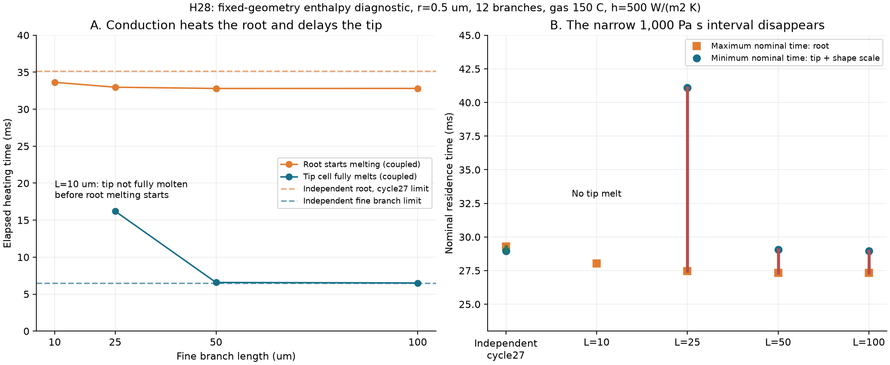
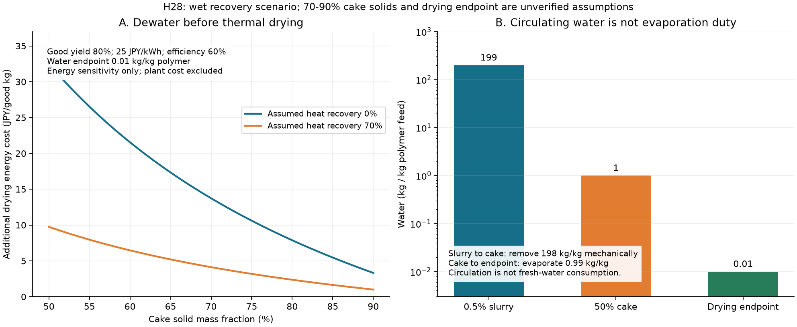

# 多方向探索 第28巡：枝熱伝導の反証と噴出時の直接製粒

2026-10-08／Codex。参照基点：487d10dc7c4b4ffafd74ac756c1b980bec65d156。現行正本v36は変更しない。

## 1. 今回の到達点

**連続繊維を作ってから切る工程だけに頼らず、噴出時に不連続化する二つの形成経路を候補へ追加した。** 一方、第27巡の微細枝の熱仕上げは、枝から太い根元へ熱が流れると成立範囲が狭まることを数値で確認した。これを受け、H28は「直接形成を優先し、熱仕上げは測定で必要性が確認できた場合の補助工程」とする。

今回新たに得た設計判断は次の通り。

- 第27巡の粘度1,000 Pa sの代表例は、根元を独立に加熱する近似では公称28.969〜29.305 msに時間帯があった。12本の長さ50 µmの細枝を接続した今回の近似では、必要下限29.051 msに対し上限27.337 msとなり、両立しない。
- 熱で細枝を減らしても材料は消えない。半径0.5 µm・長さ40 µm分が一つの球へ集まるなら直径約3.91 µm。これは質量保存の診断で、実際に球ができたという結果ではない。
- 噴出中に不連続化する先行技術は実在する。ただし、短い繊維が得られることと、300〜800 µm級の独立した三次元雪状粒が得られることを区別する。
- 湿式回収では、固形分0.5%のスラリーを50%まで機械脱水する例がある。全水量を蒸発させる費用計算は過大になる一方、循環水の処理能力を省略する計算は過小になる。

**物理試験0件、実物成功確率は未算定。** 本巡は32条件の熱診断、数値解の照合、処理量と追加乾燥費の感度であり、人工雪の実証成功件数ではない。[計算・図・出典一式](枝熱伝導と直接製粒検証_20261008/README.md)を公開する。

## 2. H27のどの仮定を変えたか

[第27巡](GPT回答_多方向探索第27巡_枝状粒の形成と微細枝の熱仕上げ_20261008.md)では、細枝と支持枝がそれぞれ独立に熱風で温まる時間を比較した。実際はつながっているので、細枝の熱が根元へ移動する。今回は次を追加した。

- 細枝を長さ方向に32区間へ分け、区間間の伝導熱を計算する。
- 太い根元を半径10 µm・長さ100 µmの円柱状集中容量とし、1本または12本の同一細枝から来る熱を加える。
- 枝半径0.5／1 µm、長さ10／25／50／100 µm、熱伝達率500／2,000 W/(m² K)を比較する。
- 融解潜熱をエンタルピーに含め、根元が130℃で融解を始めた時点まで解く。

各細枝区間は、**質量×比エンタルピーの時間変化＝隣接区間からの伝導熱＋熱風からの対流熱**。根元では、熱風からの熱に全枝からの熱を加える。熱伝導率0.4 W/(m K)、密度950 kg/m³、比熱2,300 J/(kg K)、潜熱200 kJ/kg、初温50℃、熱風150℃は前巡と同じ未校正の仮定である。

先端は断熱、付け根は完全な熱接続とした。根元は一様温度で、ガスの遮蔽や根元内部の温度分布は解かない。**融解後も形状を固定した反実仮想の診断**であり、形が変わった後の熱流、丸まり、分裂を予測するものではない。融点未満の剛性保持も保証しない。

### 2.1 結果：短い枝ほど根元へ熱を逃がす

半径0.5 µm、12本、h=500 W/(m² K)の例。

| 細枝の長さ | 先端区間の融解完了 | 根元の融解開始 | 粘度1,000 Pa s・±20%滞留ばらつきの時間帯 |
|---|---:|---:|---|
| 10 µm | 根元の融解開始までに完了しない | 33.635 ms | なし |
| 25 µm | 16.209 ms | 32.976 ms | 下限41.094 ms ＞ 上限27.480 ms |
| 50 µm | 6.574 ms | 32.805 ms | 下限29.051 ms ＞ 上限27.337 ms |
| 100 µm | 6.508 ms | 32.812 ms | 下限28.969 ms ＞ 上限27.343 ms |

時間下限には、前巡と同じ粘性毛管時間ηr/γ（γ=0.03 N/m）を加えている。粘度を100 Pa sと仮定すれば25〜100 µmの例には診断上の時間帯が残る。しかし、それを加工成功や良品歩留まりに変換しない。加熱温度での粘度と、冷却後50℃での荷重保持が同じ材料で両立する必要がある。

### 2.2 雨への対策と熱仕上げが競合する

固定された冷たい根元を持つ定常フィンの熱長さは、ℓ=√(kr/2h)。上記の半径0.5 µmの例ではℓ≈14.14 µmとなる。根元を50℃に保った極限では、断熱先端が130℃に達する長さは約32.42 µmである。これは過渡計算の融解長と同じ値ではなく、短い枝が冷たい根元の影響を受けやすい理由を示す別の極限解である。

一方、前巡の水の液橋・片持ち梁モデルでは、同半径、仮のE=300 MPaでδ/L≤0.1となる長さ上限は約4.42 µm。細長比L/r≥10という適用条件では下限5 µmなので、この半径には両条件を満たす区間がない。**「熱仕上げしやすい長い細枝」と「濡れて束になりにくい短い枝」を同じ自由枝だけで解く設計は弱い。** 実物が必ず潰れると断定する計算ではなく、形・支持・材料を切り替える理由である。

### 2.3 融かした材料の行き先も必要

半径r、融かした長さLの円柱体積を一つの球へ集める場合、球半径a=(3r²L/4)^(1/3)。r=0.5 µm、L=40 µmなら直径2a≈3.91 µmとなる。消したはずの細枝が玉・溶着点・遊離片として残る可能性を、検査項目へ入れる。

この球が実際に生じるか、根元へ収縮するか、複数片になるかは、粘度、接触角、流れ、形状に依存し今回未計算である。図や式で細枝の質量を消して、粉じんも摩擦も減ったと扱わない。

## 3. H28：直接形成へ優先順位を移す

### 3.1 H28-A：噴出中の相分離と流体分断

公開特許には、ポリオレフィン溶液が噴出する際に水／蒸気流を作用させ、不連続の繊維構造を得る例がある。機械的な後切断で端部が融着する問題への対策として記載されている。シクロヘキサンを使う実施例を確認した。[S1](https://patents.google.com/patent/EP0597658A1/en)

別の特許では、芯側にガスを置くか、外側に置くかで不連続性が変わり、平均長さ約2.24 mmの記載がある。ただし実施例はCFC-11を使用するため採用しない。0.1〜0.5 mm片が生じた例もあるが、副生微細片の記載であり、目標粒の高収率生産とはみなさない。[S2](https://patents.google.com/patent/EP0604513A1/en)

H28-Aの提案は、**非ハロゲンの閉鎖工場工程で、形成段階の不連続化、過長片の分離、粒径・外形の分類、低負荷の脱水を一体で設計すること**である。熱仕上げを必須とせず、形成条件で過剰な微細枝を減らす方を先に調べる。既存特許の数値を別の樹脂・溶剤へそのまま移植する案ではない。

### 3.2 H28-B：溶融ポリエステルを流体せん断で形成

溶剤による析出と異なる経路として、溶融ポリエステルを流体で分断し、冷却・結晶化・配向を伴う繊維片を形成する公開特許を確認した。0.1〜5 mmの範囲を記載するが、確認した実施例は液体窒素を使う。水も使えるとの一般記載を、水だけで目標粒を得た実証へ読み替えない。[S3](https://patents.google.com/patent/EP0715007A1/en)

H28-Bは、溶剤回収を減らせる可能性と、冷却費、密度、硬い片による摩擦・摩耗の競合を調べる比較候補である。工場内の冷却工程を比較するもので、現地の非冷却噴霧が達成されたわけではない。HDPE用の熱・費用モデルをPBT/PETへ無変更で適用しない。

### 3.3 独立液滴からの形成も比較した

超音波噴霧で40〜75℃の気流中に二領域の高分子粒子を作る一次論文がある。ただし外形は球状で、PS/PMMAとジクロロメタンを使用する。暖気中で粒子を作ることと、雪状の枝を持たせることは別問題である。[S4](https://pubmed.ncbi.nlm.nih.gov/35863196/)

この経路は外形の対照として残す。球状粒が安定して作れる事実を使って、雪の結晶構造の成功率を上げることはしない。

### 3.4 「短い繊維」と「雪状粒」の判定を固定する

新候補で次に取得すべきものは、長さの平均値だけではない。

| 観測するもの | 避ける誤判定 |
|---|---|
| 乾燥後・再湿潤後の三次元外形と最大外径、枝の太さ・自由長 | 長い繊維を丸めた毛束を、枝状単粒と呼ぶ |
| 300〜800 µmという比較帯に入る質量割合と、その中の形状分布 | 微細片が少量あるだけで、量産収率を仮定する |
| 濡れ乾き・整地後の同じ分布と空隙 | 製造直後の顕微鏡写真だけで耐候性を認定する |
| 接触・エッジ荷重時の支持と短い解放 | フェルト化して強くなったことを圧雪の再現とする |
| 底面とエッジ、粒自身それぞれの摩耗 | 粒が減って滑りやすくなったことを潤滑改善とする |

構造を整地で戻せるか、粒を工場で作り直す必要があるかも分類する。後者を60分のローラー整地で復旧できる量に含めない。

## 4. 回収工程の経済性を再設計する

### 4.1 水の処理量と蒸発量を分ける

S1の実施例には、固形分0.5 wt%のスラリーを回収し、濾過後約50%固形分にする記載がある。高分子1 kgに対し、水量は次のようになる。

- 0.5%スラリー：水199 kg。
- 50%ケーキ：水1 kg。
- 仮に水0.01 kg/kgまで乾燥：蒸発するのは0.99 kg。

したがって、**198 kg/kgは機械的に分離し、残る0.99 kg/kgを熱乾燥する**のが今回の比較境界である。水199 kgを全部蒸発させる前提は採らない。ただし濾過・搬送・再循環、溶剤除去、微粉捕集の設備は必要であり、無料とも扱わない。

再循環する水量は新規取水量でも、一度に保管する槽容量でもない。初期充填、補給、ブロー、濾液浄化は別途の収支が必要である。

### 4.2 30日で初期材料を作る場合の規模

前巡と同じ厚さ450 mm・かさ密度120 kg/m³を比較用に置く。良品収率80%、30日×16時間の製造で計算する。かさ密度も収率もH28の測定値ではない。

| 項目 | 2,000 m²分 | 20,000 m²分 |
|---|---:|---:|
| 初期良品材料 | 108 t | 1,080 t |
| 必要な良品速度 | 225 kg/h | 2,250 kg/h |
| 高分子投入 | 281.25 kg/h | 2,812.5 kg/h |
| 0.5%スラリー処理量 | 56.25 t/h | 562.5 t/h |
| スラリー中の水流量 | 約55.97 t/h | 約559.69 t/h |

大きな水量でも同じ水を循環利用できる可能性はある。しかし、ポンプ・濾過・配管・熱交換の処理能力は残る。濃度を上げる案は、詰まり・束化・形の崩れと一緒に評価する。

S1のトンネル内ガス比4.5 m³/kg超という境界をこの投入速度へ当てると、約1,266／12,656 m³/hが比較下限となる。これは標準状態の空気量ではなく、実機のガス要求量でもない。S2の窒素／高分子比を使う別の感度は約306／3,057 kg/hで、両特許の流量を同時に必要とする設計ではない。これらは乾燥費だけでは設備費を決められない理由として残す。

### 4.3 脱水の改善で減らせる費用と、減らせない費用

ケーキ固形分x、乾燥終点の水w=0.01 kg/kgとする。高分子投入1 kg当たりの蒸発量はmax[0,(1−x)/x−w]。比較用の潜熱0.63 kWh/kg、供給効率60%、電力25円/kWh、良品収率80%を置いた。

| ケーキ固形分 | 熱回収なしの追加乾燥費 | 仮に70%熱回収した追加乾燥費 |
|---|---:|---:|
| 50%（出典の例） | 約32.48円／良品kg | 約9.75円／良品kg |
| 70%（今回の仮定） | 約13.73円／良品kg | 約4.12円／良品kg |
| 90%（今回の仮定） | 約3.32円／良品kg | 約1.00円／良品kg |

**70%・90%まで粒形状を保って脱水できた証拠はない。** 強く押せば脱水は進んでも枝が潰れる可能性がある。乾燥終点1%も、滑走上必要な水分を決めた値ではない。

第27巡の仮の基本費約420.41円／良品kgに50%ケーキ・熱回収なしの分だけ加えると約452.90円/kg。比較単価500円との差は約47.10円/kgになる。これは追加乾燥負荷を足した感度であり、異なる特許の工程をそのままつないだ完成工場の見積りではない。水の加熱・送液・濾過、分級、残留物分析、設備償却の実見積り、運搬、摩耗補充等は未確定である。

整地設備の税込2億円上限は材料・造成とは別枠として維持する。上記は材料製造側の税抜き仮計算で、2億円以内の総事業費を達成したとは扱わない。

## 5. 数値結果をどこまで信用できるか

今回行った照合は次の範囲に限る。

1. 枝を熱的に切り離した極限を、第27巡の円柱加熱・潜熱の解析解と比較。
2. 根元と枝全体のエネルギー収支を、外から入る対流熱の時間積分と比較。
3. 代表過渡条件で16／32／64区間へ細分化。32→64区間の根元融解開始は約32.8049→32.8017 ms、先端融解完了は約6.57408→6.57358 ms。
4. 同じ32区間を別の積分器BDFとRadauで解いて比較。
5. 固定温度の根元を持つ定常フィンを、有限体積と解析解で比較。最大温度差は16／32／64／128区間で0.522／0.141／0.0367／0.00936℃へ減少した。64区間で0.02℃基準を満たさなかったため、基準を緩めず128区間まで確認した。

数値確認50項目のうち32は同じ閾値式を各条件で確認したもの。独立した50種類の物理検証ではない。refine.pyの3確認も数値解の確認である。熱伝達係数・粘度・実物の形状が正しい証拠はまだない。

## 6. 次の切替条件とClaudeへの依頼

本巡の優先順はH28-Aの直接形成、H28-Bの溶剤を使わない形成、H27熱仕上げの条件付き再評価とする。H27の改善だけを掘り続けない。

- H28-Aが長い毛束しか作れない場合は、形状分布と歩留まりをもって不採用・工程変更を判断する。後から雪状粒という名前を付けて通さない。
- H28-Bは、冷却と分断で太さ・短さを制御できるかを先に調べる。50℃で硬いというだけでは、エッジの抜けや底面摩擦の合格にしない。
- H27は、実測した粘度と枝接続形状を入れて時間帯が残り、微粉・球化・溶着の増加がない場合にだけ追加工程として残す。
- 濾過で枝が潰れるなら、高固形分化の費用利得を撤回し、低荷重脱水・分散乾燥の費用と形を比較する。

全候補で、50℃の4〜5時間荷重、乾燥・半乾き・雨後の摩擦とエッジ応答、冬の雪との接続と排水、流出・回収・摩耗物と人体・環境への影響を同じ粒で検証する。融点、平均繊維長、紙の引張強度、熱収支のいずれも代用証拠にはしない。

**Claudeへ：** v3の新物質候補について、①必要な形を形成できるか、②形成後の濡れ乾きと50℃保持、③少量の粒間接点と短い解放、④閉鎖工場の循環処理量、の四点で本報告へ反証・融合案を返してほしい。特に根元への熱流、融けた材料の行き先、短繊維と独立した雪状粒の区別を確認してほしい。v2/v3の入力・コード・乱数種・出力もGitHubへ格納してほしい。

公開前の再取得では参照基点以降のClaude更新なし。v3結果の受領や、本報告への同意は未確認。実物の成功確率90%超は、必要条件の実測と成功判定の定義が揃った場合だけ主張する。

[出典台帳](枝熱伝導と直接製粒検証_20261008/sources.md)には、四つの一次資料の読取範囲と使っていない条件を明記した。公開ファイルの同一コミット・バイト数・SHA-256を照合してから、ローカル研究ファイルとGit履歴を削除する。
