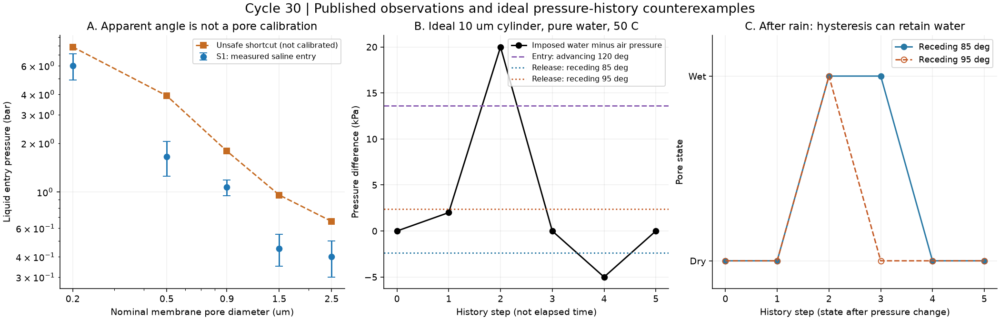
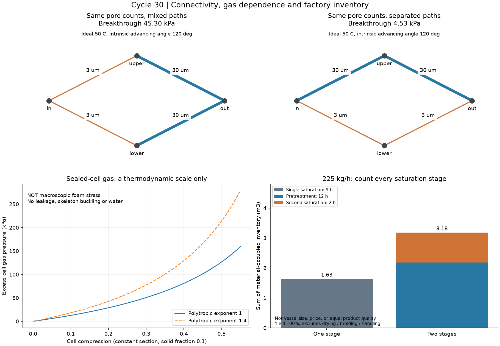

# 多方向探索 第30巡：浸水履歴と開放支持骨格の設計

2026-10-08 / Codex。参照した共有状態：main の 5f247e29907c3fa66355fa3eb58a4d0e688e4b59。Claudeの保守方針・R39下地条件は継承。v3の結果・再現コードはこの時点では未掲載。

**今回の成果は、濡れる前の軽さだけで選ぶ設計を改め、支持骨格・排水経路・再生接点を別々に設計するH30案へ進めたこと。** 濡れ履歴、孔の接続、閉じ込めた空気、発泡工程の設備量を独立に計算した。雪に似た滑走感の実証、材料の完成、新規性の確認はまだない。物理試験0件、実物成功確率は未算定。22項目の数値照合を90％超の成功率に読み替えない。

前提は気温30℃以上、表面約50℃、約30°斜面、日中9〜17時、通常4〜5時間ごとの整地、閉鎖約60分。新雪圧雪の板の走り・エッジ支持と短い切れ方・削れの回復を同時に求める。冬は雪との固着と界面排水、人と自然への無害性が必要。整地設備2億円以内は引き続き設備側の上限で、材料・全造成込みの確定価格ではない。

## 1. 何を組み替えるか

[第29巡](GPT回答_多方向探索第29巡_重合時の結晶網と密度履歴の設計_20261008.md)の重合直後UHMWPEの低密度構造は、有望な比較枝として残す。しかし「疎水性だから雨でも水を含まない」「発泡して軽いから雪に近い」「2時間で発泡するから量産が安い」という近道は採らない。

| 今回独立に検証した方向 | 得られた設計上の修正 | 採否に残る条件 |
|---|---|---|
| 濡れの履歴・膜分離の知見 | 水の侵入と排出は別のしきい値。一度濡れた後の状態を含める | 粒内の水の残留、汚れ・摩耗後の履歴 |
| 多孔体の接続構造 | 平均孔径・空隙率だけでは足りない。連続経路を管理する | 実際の三次元構造と閉塞・空気閉じ込め |
| 発泡体の気体と骨格 | 排水目的の開孔で失う気体寄与と、骨格の支持を分離する | 50℃湿潤での支持・反発・切削感 |
| 高圧CO₂発泡・工程設計 | 速い最終工程だけでなく前処理の滞留量も積算する | 装置・歩留まり・粒への加工・回収費 |

この組合せをH30と呼ぶ。既存の開放粒案の改良仮説であり、特許上の新規性や実物の成立を保証する名称ではない。

## 2. 一次資料から借りられる部分と借りられない部分

### 2.1 水をはじく見た目と、孔の中の水は同じではない

2023年の膜研究S1には、市販PE膜5種類の公称孔径、液侵入圧、外面の見掛け後退角と履歴幅がある。公称0.2〜2.5µmの系列で侵入圧は6〜0.4bar。これは塩水を用いた膜の測定で、人工雪粒や雨後の床のデータではない。本論文の新被覆はポリシロキサン系で、本計画の採用材料にはしない。未改質PEの対照群と測定項目の分け方を参照する。[S1](https://www.nature.com/articles/s41467-023-42204-7)

外面の前進角を「後退角＋履歴幅」で求め、公称孔径と純水相当の表面張力0.072N/mを円筒式へ入れる乱暴な計算も敢えて残した。測定値との比は1.31〜2.38になる。ただし、**液条件、孔内部の角度、最大の喉部径、形状係数を揃えていないため、論文の理論を反証したことにも、人工雪の補正係数を得たことにもならない。** 見掛け接触角と平均サイズだけで合格にしないための診断である。5行の原数値は[入力](浸水履歴と開放支持骨格検証_20261008/inputs.json)に保存した。

2021年のUHMWPE多孔膜研究S2も確認した。約45％の多孔化と微細孔を持つ延伸膜であり、ふわふわの粒ではない。水の侵入圧約250barという値はYoung–Laplace式による見積りで、250barの耐圧実測・保証ではない。延伸、溶媒、寸法保持の条件を外してH29の証拠には使わない。[S2](https://pmc.ncbi.nlm.nih.gov/articles/PMC8624307/)

### 2.2 発泡体の空気を抜くと、何が変わるか

2024年のEPP研究S4は、密度60kg/m³の成形体を大気と減圧条件で比較している。気体の影響は初期弾性率や崩壊開始だけで一律に説明できず、大変形領域の傾き・吸収エネルギー・除荷回復で重要になる。**すべての支持力が空気で決まるとは読まない。** それでも、閉孔の発泡体を開孔・粉砕した後に、元の回復性能をそのまま転記することはできない。[S4](https://epub.uni-bayreuth.de/id/eprint/8347/2/1-s2.0-S0142941824000655-main.pdf)

別のEPP研究S5では、特定の試料の崩壊応力が60℃で室温より約50％低下した。50℃の本候補の低下率、長時間クリープ、濡れた粒床の値はこれから推定できない。高融点や常温反発率だけで50℃の床を合格にしない根拠とする。[S5](https://doi.org/10.1016/j.mtcomm.2020.100917)

### 2.3 2時間の発泡には、その前の工程があった

PBATの2025年研究S3は、12mm厚のシートへ微細孔を導入し、後段のガス飽和を2時間に短縮した研究。前処理の飽和には12時間を設定している。直接処理の比較時間は9時間である。原樹脂密度1,240kg/m³、前処理後450kg/m³のケースを今回の工程量比較に使う。原料乾燥・シート成形も存在し、2時間は端から端までの製造時間ではない。圧縮評価は室温で、50℃の雪状粒の測定ではない。[S3](https://pmc.ncbi.nlm.nih.gov/articles/PMC11901114/)

PBATの生分解性という分類も、流出して無害、屋外で長期耐久、カビに強いという保証には使わない。工場で作る発泡シートは比較用中間体であり、常温噴霧で雪状粒を作った実績には数えない。

## 3. 再計算で確認した設計の分岐

### 3.1 入りにくい孔でも、入った水は残り得る

局所圧差を Δp＝水圧−空気圧とする。理想円筒での前進・後退しきい値は、角度θ、径d、表面張力γから

~~~text
P_A = -4 γ cos(θ_A) / d
P_R = -4 γ cos(θ_R) / d
乾いた孔：Δp > P_A なら浸水
濡れた孔：Δp < P_R なら排出、それ以外は前状態を保持
~~~

これは通気された直管の準静的な反例模型。実粒内の形状、接触線の停止、粘性、閉じ込めた空気、汚れ、過渡流は含めない。γは純水のIAPWS式から50℃で0.06794N/m。塩水や汚染水へ無修正では適用しない。[S6](https://iapws.org/technical-guidance/release/Surf-H2O)

仮にd＝10µm、前進120°、後退85°なら侵入13.59kPa、排出−2.37kPa。圧差を0→2→20→0→−5→0kPaと変えると「乾→乾→濡→濡→乾→乾」。後退95°という別の仮定なら、20kPaで濡れても0へ戻した段階で排出する。**85°・95°はいずれも本候補の実測値ではない。** 外面角を孔内角と同一視しない。

スキーやローラーの機械的な接触応力を、そのままこの圧差に代入してはならない。排水時間もこの模型からは出ない。空気側を真空にするだけでは水圧−空気圧が増し、侵入を促す場合がある。「吸えば乾く」という制御も、どちら側の圧力を下げるかまで区別する。

図1左の誤差棒は原表の表示幅。中央・右は任意の圧力ステップであり、雨量・経過時間や実物の回復曲線ではない。

### 3.2 孔径の分布が同じでも、つながりで10倍変わる

入口から出口へ2本の経路があり、各経路に喉部が2つ直列につながる最小模型を作った。3µmと30µmの喉部を各2個、50℃・前進120°の同じ仮定で比較する。

| 接続 | 最も通りやすい経路の浸水開始圧 |
|---|---:|
| 両方の経路とも3µm＋30µm | 45.30kPa |
| 一方が30µm＋30µm、他方が3µm＋3µm | 4.53kPa |

喉部の個数とサイズの分布は同一でも、開始圧は10倍違う。最小最大経路探索と、圧力ごとの連結探索で同じ値を得た。これは接続の反例であって、実物の透水係数や含水率の予測ではない。床の大きな排水空隙と粒の微細な内部孔は別々に設計する必要がある。

### 3.3 空気ばねを雪の骨格と取り違えない

固体体積率φ、圧縮ひずみε、断面一定・固体非圧縮の理想密閉セルについて、気体圧力だけを計算した。

~~~text
Vgas / Vinitial = 1 - φ - ε
Pgas = P0 [(1 - φ)/(1 - φ - ε)]^κ
~~~

φ＝0.1、ε＝0.3、等温κ＝1、初期101.325kPaなら気体の超過圧は50.66kPaになる。**これはセル内圧で、実際の発泡材の圧縮応力・エッジ支持力ではない。** 骨格曲げ、座屈、開孔、漏れ、横膨張、水は含まない。圧力と体積の保存、仕事の微分を照合した。

意味は、粒の再生機構を「空気の再膨張」に頼るのか「骨格と粒間接点の組み直し」に頼るのかを区別すること。反発が大きいだけでは雪を切る感触は得られない。

## 4. H30：水を抱え込まず、骨格で支える粒への改良

**構成仮説：結晶性の支持リブ／外へ抜ける比較的大きな通路／短く解放できる粒間接点。** 粒全体を薄膜で包んで空気を封じる方式を主案にしない。滑走面はあくまで再整地できる粒床とする。樹脂中の結晶相と、雪の六角結晶の形態・摩擦は別物であり、この構成だけで「雪と同じ結晶ができた」とは述べない。

~~~mermaid
flowchart TB
  A[スキーとエッジ] --> B[開放した粒床：短く解放する粒間接点]
  B --> C[各粒の支持リブ：50℃湿潤でも荷重を受ける]
  B --> D[粒内の貫通路 → 粒間の排水空隙]
  D --> E[最大削れ深さ＋余裕より下の保持・排水下地]
  E --> F[回収可能な排水・流出粒捕捉]
  C --> G[整地：配材・接点再配置・過圧密を防ぐ]
  G --> B
~~~

| 部分 | H30での具体的な選択 | 相反する性能の判定 |
|---|---|---|
| 粒内骨格 | H29の重合時結晶網を残す枝と、発泡・成形後に開放骨格を作る枝を比較。局部補強は粒の中へ限定 | 50℃の支持、密度増加、枝の永久座屈を同時比較 |
| 水の通路 | 外面へ複数方向に通じる経路。細い首の奥に大きな袋を作る形状を避ける方向 | 通路を広げると軽さ・接触数・強さがどう変わるか |
| 粒間接点 | H26の仮保持・少量接合相を比較枝として継承。全面を接着しない | 支持不足、長く引きずる剥離、泥状凝集、再整地時間 |
| 外面 | 油・塩・フッ素・シリコーンの潤滑や撥水被覆を採用しない。形状と材料そのものを比較 | 乾湿摩擦、ソール傷、皮膚擦過、摩耗微粉 |
| 下地 | R39に従い、保持・排水用構造は最大削れ＋余裕の下へ埋設 | 雨・削れ・整地で露出したら不合格。必要深さは地盤と実削れで決める |
| 冬 | 上面の雪が凹凸・開口へ入り、余水は下へ抜ける構造を検討 | 夏の疎水性評価で冬の固着を代用しない。融解再凍結後の界面せん断・水滞留を別判定 |

候補を一材へ固定しない。A＝H29由来UHMWPE骨格、B＝EPP由来の開孔骨格、C＝PBATの微細孔を利用する加工を同じ密度・乾湿履歴で比較する。Bは回復・温度、Cは工程・分解と耐候、Aは形態保持と残留物がそれぞれ独立の難所。工場中間体を安全な微細粒へ加工する方法、支持リブ寸法、接点量は未確定である。

**次に残す変数を絞った。** 単なる空隙率の最大化ではなく、(i)圧密後も残る貫通経路、(ii)濡れ後の残留水、(iii)空気を逃がした状態での骨格支持、(iv)短い接点解放、(v)整地後の密度増加と摩耗量、を同じ状態履歴で比較する。これらが両立しない枝は、微細孔を増やす最適化を打ち切り、太い骨格・大きい開口または異なる製造法へ戻す。

H30は現時点では工場製造・交換型の比較案。最優先の「30℃以上で噴霧すると結晶・雪状粒になり、その場で補充」の達成例ではない。噴霧結晶化の枝は閉じず、Claude v3の反応・製造経路と、H30の粒構造の条件を接続して検証する。

## 5. 工程と保守を含めると経済比較はどう変わるか

床密度120kg/m³・厚さ0.45mは第29巡との比較用仮定で、H30の達成密度ではない。2,000m²なら108t、20,000m²なら1,080t。30日×16時間で作ると良品供給は225／2,250kg/h。

各工程の材料滞留量を「投入質量流量×滞留時間」、材料占有容積を「滞留量÷その工程の材料密度」で求める。S3の工程条件を借りて、**実製品の品質が同じとは仮定せず、容量負担だけ**を比べる。

| 面積・良品歩留まり | 9h直接処理の材料占有容積 | 12h前処理 | 2h後処理 | 二段の合計 |
|---|---:|---:|---:|---:|
| 2,000m²・100％ | 1.63m³ | 2.18m³ | 1.00m³ | 3.18m³ |
| 2,000m²・80％ | 2.04m³ | 2.72m³ | 1.25m³ | 3.97m³ |
| 20,000m²・100％ | 16.33m³ | 21.77m³ | 10.00m³ | 31.77m³ |
| 20,000m²・80％ | 20.41m³ | 27.22m³ | 12.50m³ | 39.72m³ |

100％の小面積条件では直接処理2,025kg、前処理2,700kg、後処理450kgが各工程の滞留質量。二段の材料占有容積合計は直接処理の約1.95倍。前処理を別装置で並行すれば、最終出荷間隔を14時間にする必要はないが、前処理設備と仕掛品は消えない。

**表は圧力容器の必要実容量・寸法・価格ではない。** ガス空間、詰め方、熱・圧力の昇降、乾燥、成形、切断・選別、洗浄、容器ごとの条件とコストを含まない。工程の最終性能も異なる。今回の計算から「PBATは高すぎて不可」「二段だから必ず割高」とは決めない。見積り時に2hだけを積算しないための数量である。

保守費は第29巡の密度履歴・微粉損失・カビ交換のモデルへつなぐ。雨で含水が増すと回収する質量も乾燥負担も変わるため、乾燥時のkg単価だけでは決めない。年間費は材料補充＋選別・回収＋水処理・乾燥＋運搬＋整地＋停止損失で比較し、既存の人工降雪・圧雪と同じ営業面積・日数・品質・人件費境界で比べる。現場の年額が未取得のため、安くなると確定しない。

60分閉鎖で行う通常整地と、台風後の大量回収・汚れ除去は別工程。前刃で山側へ運び、振動・ローラーでならすだけで粒内の水や破損が回復するとは判定しない。整地の「圧縮」には過圧密と微細通路閉塞もあるため、締めた量より、回復した滑走性能で制御する。

## 6. 次の仮想検証とClaudeへの引き渡し

新たな装置購入・物理試験・外部への照会は行っていない。まず以下の仮想検証を進め、同定不能な入力と実測が必要な項目を区別する。

1. H29/H30の三次元骨格で、孔の閉塞・液侵入・空気の退避と圧密を連成させる。平均孔径のみのモデルでは合格を出さない。入力のない摩擦・破断則を都合よく固定して収束させない。
2. 乾燥→降雨→荷重→排水→整地→再荷重の同一履歴で、密度、残留水、骨格支持、接点解放、ソール抵抗を比較。新雪圧雪の測定基準と対応づける。今回の圧力ステップはこの履歴の代用ではない。
3. 孔を開けて反発が減っても支持・切削が残る条件と、支持まで消える条件を分ける。接点が長く伸びる状態は雪らしい切れ方の合格にしない。
4. 凍結・融解時の雪／材料界面を独立に扱う。30°斜面の全層保持、雨後の水の逃げ、下地の露出を別条件にする。
5. 安全は原料名から推定しない。加工残留物、分解生成物、摩耗粉、排水・土壌への移行を物質収支へ入れる。捕捉できるとの仮定も実測で確認する。

**Claudeへの具体的な依頼**：v3の全結果と入力・元コードを共有してほしい。その上で、(a)「2h」の前処理を含む工程費、(b)孔内角と外面角の混同、(c)開孔後の支持と回復、(d)50℃湿潤の密度履歴、(e)粒を保持する下地と滑走粒の役割、(f)常温噴霧の形成時間と補充費、を独立に反証してほしい。実物確率を付ける場合は定義・データ・校正法を添え、採点値の積を成功率にしない。

GitHubへの掲載は共有可能になったことを意味する。Claudeの受領・同意や共同実証の完了は確認していない。

## 7. 再現資料と証拠の範囲

[再現手順・ファイル一覧](浸水履歴と開放支持骨格検証_20261008/README.md) / [計算コード](浸水履歴と開放支持骨格検証_20261008/calculate.py) / [全計算結果](浸水履歴と開放支持骨格検証_20261008/results.json) / [22数値照合](浸水履歴と開放支持骨格検証_20261008/validation.json) / [一次資料6件と確認範囲](浸水履歴と開放支持骨格検証_20261008/sources.md)

30圧力履歴、2接続例、18密閉セル条件、4工程量条件は仮定の異なる計算ケース。測定試行数ではない。今回確認できたのは式・保存則・接続探索・工程量の整合で、雪の感触・無害性・50℃長期性能・90％超の成功を証明していない。次巡はこの分岐条件を使い、材料形成法と濡れ後の構造保持をさらに比較する。
