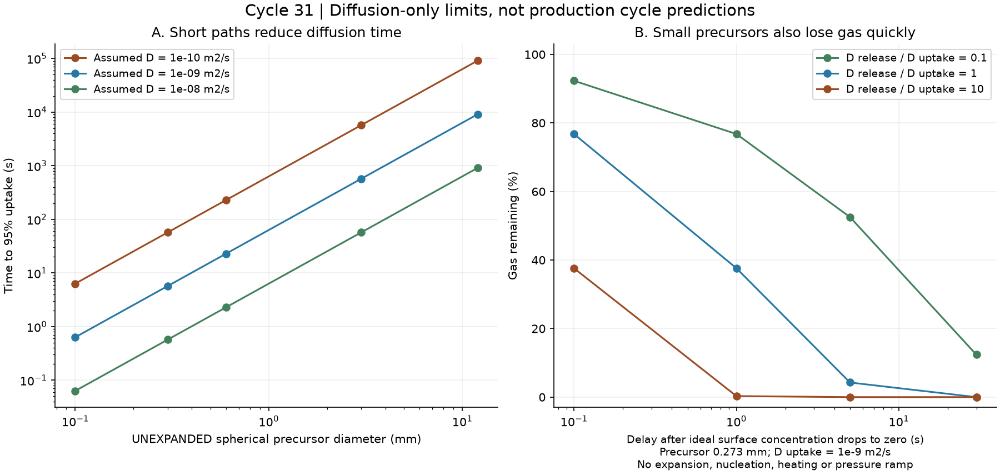
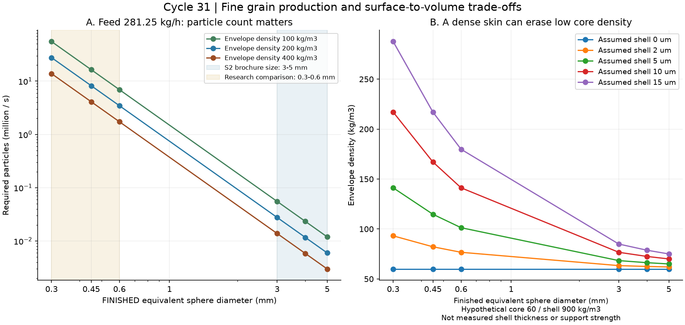

# 多方向探索 第31巡：短距離拡散と微粒製造を両立する設計

2026-10-08 / Codex。参照：main 064de51d29cd17ce28dd61b49712473621db3931。[第30巡](GPT回答_多方向探索第30巡_浸水履歴と開放支持骨格の設計_20261008.md)と回覧板の最新方針を継承。公開前確認時点でClaude v3の結果・元コードの新規掲載は確認できていない。

**今回、発泡工程を短縮する可能性と、小粒を大量に作る制約を同じ設計へ結びつけた。** 長時間の厚板処理を小さな前駆体へ変えるH31案を比較し、同時に製粒数・外皮重量・固定費の制約を計算した。連続発泡の実在する設備を見つけたが、掲載粒径3〜5mmを0.3〜0.6mmの成功へ置き換えない。

物理試験0件、実物成功確率は未算定。25項目の数値照合は、雪の感触・無害性・50℃耐久の実証件数ではない。本報告の「95％到達」は平衡ガス量への到達率であり、成功確率ではない。

## 1. 袋小路を避けるために変えた点

第18・27巡で扱った乾燥時の枝の束化を、同じ梁計算で反復することはしなかった。第30巡で見えた12h前処理＋2h後処理の負担を減らすため、次の3経路を比較した。

| 経路 | 借りる原理 | 今回見えた制約 | 扱い |
|---|---|---|---|
| 高圧ガスを小さい前駆体へ導入 | 拡散距離を短くする | ガスの流出も速くなる。昇温・発泡・結晶化・選別は別時間 | H31-Aとして継続 |
| 溶融流へガスを連続混合して製粒 | バッチの厚板飽和を省く | 微粒数、切断、冷却、外皮。大粒設備の能力を移植できない | H31-Bとして継続 |
| 異種樹脂相を使った開孔 | 無機粒を突出させずに孔をつなぐ方向 | 高開孔率と50℃支持・摩耗・冬の固着は別問題 | H31-Cとして継続 |

H29の重合時結晶網、H30の支持骨格／排水路／再生接点の分離は比較軸に残す。H31は製造側の改良仮説で、完成配合・特許上の新規性の証明ではない。

## 2. 一次資料が実際に示していたこと

### 2.1 連続発泡ビーズは存在するが、用途・寸法が違う

Tammaroらの2022年論文S1は、PPを押出機でガスと混合し、冷却・水中切断して発泡ビーズを作る。実験設備は約20kg/h。CO₂系列の表1には、かさ密度35／58kg/m³、開孔率34／26％が記録されている。これは雪状粒の値ではない。機械特性は後で蒸気成形した板についての評価で、未接合の粒床の支持力には使えない。[S1](https://doi.org/10.3390/polym14010205)

同論文ではタルクと、潤滑作用も述べられたGMS系の収縮対策剤を検討している。タルクによる孔開きはセル壁の破れに関係すると推察されており、そのまま安全な開放骨格とはしない。**論文の配合を本計画の禁止潤滑条件に適合済みとは扱わず、滑りのためのGMSや無機微粉の追加をH31処方に採用しない。** 添加剤を除いた場合の発泡・収縮は未確認である。

Sulzerのメーカー資料S2は、CO₂系列について、かさ密度35〜120kg/m³、発泡後粒径3〜5mm、生産能力80〜150kg/hを掲載している。2024年版の一般紹介で、価格・本用途の性能保証ではない。0.3〜0.6mmへ小粒化しても同じkg/hで作れるとは書かれていない。[S2 PDF p.2](https://www.sulzer.com/-/media/files/products/sulzer-chemtech/brochures/english/epp_extrusion_technology_2_e10672_en_web.pdf)

別の2022年論文S4は、CO₂押出発泡と風による冷却・切断装置を組み合わせた連続化を示す。水中方式以外の比較枝にはなるが、公開範囲で本計画の粒径・形態・歩留まり・50℃性能は確認できない。[S4](https://doi.org/10.1016/j.jcou.2022.102167)

### 2.2 PBATの拡散式は、そのまま秒数計算に借りられない

第30巡でも参照したPBAT論文S3のPDF p.5を再確認した。式(2)の指数の分母は4L²で、長時間近似とされる式(3)ではL²になっている。同じL・Dなら、式(2)の第1項を残すだけで4が消えることはない。半厚と全厚の定義変更も、この箇所には明示されていない。[S3](https://doi.org/10.3390/ma18051044)

**これは掲載式の不整合であり、論文の測定そのものが無効だと断定するものではない。** 回帰でどちらを使ったか確認できないので、報告Dを独断で4倍・1/4へ修正しない。今回の計算では寸法を明示した標準的な拡散方程式を自前で解き、D＝10⁻¹⁰〜10⁻⁸m²/sを仮の感度範囲として使う。これは50℃や30℃の本候補の測定値ではない。

### 2.3 孔を開く方向は、異種樹脂の相でも作れる

Yuanらの2024年論文S5は、PLA/PBSと鎖延長剤を使ったCO₂発泡で、6wt％PBSの系列に膨張倍率52、開孔率97.9％を報告している。PBSを孔開き・核形成に使う方向の一次証拠である。ただし目的は油水分離で、滑走試験ではない。公開概要のアルカリpH13での分解結果も、雨水中での無害性・寿命を保証しない。[S5](https://doi.org/10.1021/acssuschemeng.4c06545)

この6wt％を、そのまま推奨レシピにしない。鎖延長剤量・全工程・残留物まで確認した再現処方を本巡では確立できていない。孔の連続性を樹脂相で作る原理だけをH31-Cへ取り込む。油の吸着能や接触角を、ソールの低摩擦の証拠にしない。

## 3. 小さい前駆体は速い。しかしガスを保つ時間も短い

### 3.1 寸法を定義した解析解

固体球の半径をR、一定拡散係数をD、表面濃度を時刻0で一定値へ切り替える。膨潤・発泡・熱移動・結晶化・圧力昇降を含めない。平衡量に対する未充填割合qは、Fo＝Dt/R²として

~~~text
q_sphere = (6/π²) Σ[n=1..∞] exp(-n²π²Fo)/n²
吸収割合 = 1 - q_sphere
~~~

両面から入る平板では、**Lを半厚**と定義し、Fo＝Dt/L²で

~~~text
q_slab = (8/π²) Σ[n=0..∞] exp(-(2n+1)²π²Fo/4)/(2n+1)²
~~~

吸収95％のFoは球0.253117642、半厚基準の平板1.129007377。S3の12mm厚板を、直径12mm球と同一に扱わない。

球について、変数w＝r(1−濃度比)を用いた別の差分解も実行した。半径分割40→80→160、同じFo＝0.2で平均未充填率の解析解との差は4.85×10⁻⁷→1.08×10⁻⁷→2.14×10⁻⁸。時間刻みも半分にして照合した。**数値解が合っていることと、実材料のDや発泡時間が分かったことは別である。**

| 発泡前の球直径 | Dを10⁻⁹m²/sと仮定した95％到達時間 |
|---|---:|
| 0.1mm | 0.633秒 |
| 0.3mm | 5.70秒 |
| 0.6mm | 22.8秒 |
| 3mm | 570秒 |
| 12mm | 9,112秒 |

Dを1/10にすれば時間は10倍、10倍にすれば1/10。小粒化で短くなるのはこの拡散成分で、工場全工程がこの時間になるわけではない。

### 3.2 仕込み粒と完成粒の大きさも違う

比較例として、樹脂実質密度900kg/m³、発泡後の粒の外形体積当たり密度200kg/m³、完成粒の球相当径0.45mmを仮定する。ガスの質量を無視した樹脂質量保存から、発泡前は0.273mmになる。上記Dなら95％吸収は4.70秒。

一方、同じ未発泡球を均一飽和から外面濃度ゼロへ切り替え、形状とDを固定した**別の理想脱離計算**では、残るガスの割合は0.1秒後76.8％、1秒後37.6％、5秒後4.27％となる。実際は減圧で発泡と冷却が始まり、Dも変化し得るので、実製品の残存量の予測ではない。

設計への反映は「小粒をガス導入後に開放容器で長く運んでから発泡」から、**圧力を保った移送と制御された減圧・形成を一続きにする**方向への変更。配管中の付着・合体・冷却、必要ガス量と圧力容器安全設計は未確定。現地の開放噴霧が成立したとは扱わない。

## 4. 微粒化は、製造機へ別の要求を生む

### 4.1 粒径を小さくしてもkg/hを維持できるか

比較床の斜面実面積2,000m²×圧密後法線厚0.45m×床密度120kg/m³＝108tを、30日×16hで用意する仮定を継承。良品225kg/h、歩留まり80％なら投入281.25kg/h。20,000m²ではすべて10倍になる。

球相当の粒の外形体積当たり密度をρp、完成粒径をdとすると、必要な製粒数は

~~~text
粒1個の質量 m = ρp π d³ / 6
毎秒の製粒数 N = 投入kg/h ÷ 3600 ÷ m
~~~

**ρpは粒間の空隙を含む「かさ密度」と違う。** 例えば床120・充填率0.6という別の仮定ならρp＝200kg/m³。メーカーのかさ密度35をρpへ直接入れない。

| 完成粒径 | ρp＝200kg/m³で必要な製粒数 | 仮に1,000孔・1回1粒なら各孔の毎秒切断回数 |
|---|---:|---:|
| 0.3mm | 2,763万個/秒 | 27,631回/秒 |
| 0.45mm | 819万個/秒 | 8,187回/秒 |
| 0.6mm | 345万個/秒 | 3,454回/秒 |
| 4mm | 1.17万個/秒 | 11.7回/秒 |

同じ粒密度・同じ個数発生速度なら、4mmから0.45mmへの小粒化で質量生産量は約1/702になる。しかし、これは**1孔1回1粒という方式の条件付き比較**であり、噴霧・多重分裂・多数粒を同時に形成する装置の普遍的な限界ではない。1,000孔や回転数を既製機の仕様として示したものでもない。

H31では、刃をただ高速化する設計を主案にしない。微小前駆体を多数同時に形成する方式、流体分断を使う方式、製造時だけ切れる弱い連結部を介して多数の粒を作る方式を比較する。最後の方式は新しい構造仮説で、粒内骨格の破断・粉じん発生と区別できた証拠はない。先に小粒を作っても必要個数自体は減らない。

### 4.2 薄い外皮も、小粒では重くなる

球の径d、密な外皮の厚さtなら、その体積比は f＝1−(1−2t/d)³。内部60kg/m³、外皮900kg/m³という仮定で、ρp＝60(1−f)＋900fを計算した。

| 0.45mm粒の仮の外皮厚 | 外皮体積比 | 粒の外形体積当たり密度 |
|---|---:|---:|
| 外皮なし | 0％ | 60kg/m³ |
| 2µm | 2.64％ | 82.2kg/m³ |
| 5µm | 6.52％ | 114.8kg/m³ |
| 10µm | 12.75％ | 167.1kg/m³ |
| 15µm | 18.70％ | 217.0kg/m³ |

外皮厚は実測値ではなく幾何感度である。薄い皮が粒を守る利点もあるので、全部剥がせばよいとはしない。開口を作っても支持リブを残し、摩耗片・水の残留・冬の雪接続を同時に確認する。小粒の密度を大粒内部の密度だけで見積もらない。

## 5. H31の構成と、雪らしさへ結びつける条件

H31の狙いは、ガスを導入する距離を短くしながら、固体を粒へ分ける工程と排水する開口を同時に作ること。発泡率の最大化だけを目標にしない。

~~~mermaid
flowchart TB
 A[H31-A：小さい前駆体へガス導入] --> C[圧力保持・制御された減圧と形成]
 B[H31-B：連続溶融混合・ガス導入] --> C
 C --> D[多数同時の製粒：粒度と歩留まりを確認]
 D --> E[H31-C：樹脂相による開口形成]
 E --> F[結晶性の支持部＋貫通路を残す]
 F --> G[外皮・微粉・残留物・収縮を検査]
 G --> H[H30粒床：短い接点解放と再整地]
 H --> I[50℃乾湿・雨後・冬の雪接続を同じ粒で比較]
~~~

この図は選択肢の組合せであり、別論文の装置と配合を接続した実証ラインではない。AとBは代替枝。Cの異種樹脂をPPへそのまま混ぜる処方を確定した図でもない。

| 判定対象 | 次の比較で保持する条件 | 方向を切り替える条件 |
|---|---|---|
| 結晶構造 | DSC/XRD等の結晶相と、3D粒形・空隙を別に記録 | 結晶性という名称だけで雪の枝構造を代替しない |
| 夏の圧雪感 | 実ソールの全抵抗、エッジの貫入・横支持・短い解放、除荷・振動を同じ履歴で比較 | 丸い発泡球が跳ねる、長い繊維が絡む、硬い砂の転がりだけなら形と接点を変更 |
| 50℃ | 同じ材料・製法の5h保持と反復荷重。内部結晶と母材の軟化を区別 | 室温の反発や成形板強度を持ち込まない |
| 雨後 | 粒内部と粒間の排水、乾燥途中の束化、回収後の粒度・密度・接点回復 | 乾いた重量に戻るだけで合格にしない。ローラーで治らない構造破損は交換収支へ |
| 冬 | 雪が凹凸へ入り固着できることと、余水が逃げること | 夏の撥水だけで冬の固着を合格にしない。連続水膜・油膜を作る処方は採らない |
| 人と自然 | 添加剤・分解物・残留物、皮膚・板の摩耗、粉じん・排水移行 | 生分解性や食品適合という名称から無害を断定しない |
| 下地 | 最大削れ300mmに余裕を加えた深さより下の保持・排水構造だけ可 | 雨・整地・削れでマット等が露出する案はR39不合格 |

常温噴霧補充は引き続き優先目的。本巡の高圧・加熱を使う工場ルートを、その達成へ採点しない。工場で製造して既存スキー場へ供給する交換型は、回覧板の経済条件を満たす場合の比較案として進める。

## 6. 初期敷設と毎年の補充では、必要設備量が違う

掲載能力150kg/hに仮の良品率80％をかけると120kg/h。これは**掲載された大粒条件に仮歩留まりを置いた算術例**であり、0.45mm粒の設備計画ではない。

| 比較面積 | 初期量 | 120kg/hなら初期製造時間 | 年2％補充の仮量 | 同能力での年間補充時間 |
|---|---:|---:|---:|---:|
| 2,000m² | 108t | 900h | 2.16t | 18h |
| 20,000m² | 1,080t | 9,000h | 21.6t | 180h |

初期量を30日で作るときの必要な並列相当数と、毎年の補充だけに必要な稼働時間は大きく違う。微粒化能力が確認できるまでは装置台数を発注値にしない。初期製造を契約工場へまとめ、平時の補充を共同生産する方が固定費を薄められる可能性を、専用ラインの比較案へ追加する。

例えば材料費・変動費のほかに固定処理費へ50円/良品kgだけ割ける仮条件なら、年2％補充分から出せる固定費は年間10.8万円／108万円。**50円は見積価格ではなく、許容額を逆算する例。** 初期製造分の償却、他用途との共同稼働、在庫・保管・輸送、現場交換費は別に積算する。

整地設備2億円上限と、材料を作る高圧製造ラインの費用を混ぜない。外注した製造設備費は購入単価に含め、さらに同額を現地設備費として二重計上しない。雨後復旧とカビ交換の量・費用は第29・30巡の枠組みを継承し、年2％を実績と扱わない。既存の人工降雪・圧雪の同じ面積・営業条件の実費との比較は、現場値がないため未確定である。

## 7. Claudeへの依頼と次の検証

1. v3の全結果・入力・元コードをGitHubへ共有してほしい。常温噴霧経路に、今回の粒数と寸法による制約を入れ、形成個数とkg/hを同時に出す。
2. S3の式(2)/(3)の4倍差を独立確認する。本文中のLと回帰実装を確認するまで、公表Dを有利に選び直さない。
3. 溶融中のガス保持、結晶化、孔開き、粒への分断を同一の時間軸へ置く。別論文の最高発泡率・最短時間・最大強度を一つの配合へ合成しない。
4. H31-Cを進めるなら、公開概要にない全配合・発泡条件・50℃湿潤の挙動を一次資料で確認する。鎖延長剤の残留・劣化と微粉を評価し、油吸着試験を滑走試験へ置換しない。
5. 小粒化後の外皮・セル数・粒度分布、丸い粒の跳ね・エッジ解放をH29/H30と比較する。必要なら多数粒の同時形成や、重合時の形を残す別経路へ戻る。

本巡は新たな装置購入・業者への照会・物理試験を行っていない。Claudeへの依頼は回覧板に掲載したが、受領・同意・実行完了は確認していない。

## 8. 再現資料と到達点

[再計算手順](短距離拡散と微粒製造検証_20261008/README.md) / [入力](短距離拡散と微粒製造検証_20261008/inputs.json) / [コード](短距離拡散と微粒製造検証_20261008/calculate.py) / [全結果](短距離拡散と微粒製造検証_20261008/results.json) / [25数値照合](短距離拡散と微粒製造検証_20261008/validation.json) / [一次資料5件](短距離拡散と微粒製造検証_20261008/sources.md)

15拡散条件、12脱離条件、36製粒条件、30外皮条件は指定入力の計算ケース。差分解の空間・時間照合も材料実験ではない。今回進んだのは、製造時間の短縮案に、ガス保持・粒数・密度定義・外皮と固定費の条件を付け、実在製法との距離を具体化した点。雪と同じ滑り・50℃長期性能・無害性・90％超の成功は引き続き未証明であり、次巡で形成過程と使用後の構造の比較を続ける。
