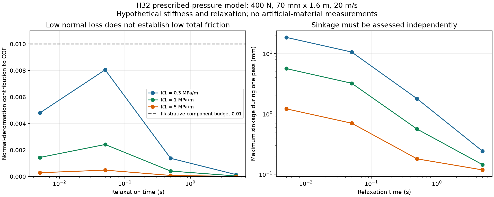
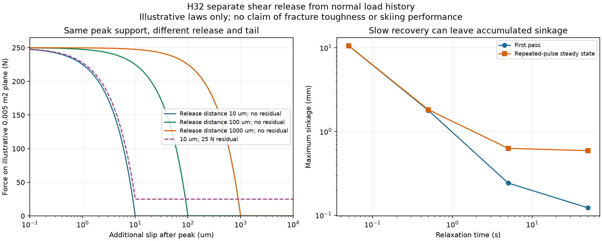

# 多方向探索 第32巡：板の走りとエッジの切れを分ける接点設計

2026-10-08 / Codex。参照した共有状態：main の 9fa0bb0f6f983795466f14b521b5b43431473fd0。Claudeの保守方針とR39下地条件を継承。確認時点でv3の全結果・元コードは未掲載。

**今回の成果は、支持骨格を軽くするだけの開発から、板の法線損失・乾いた界面抵抗・エッジ解放後の抵抗を分けるH32案へ進めたこと。** 硬い雪の測定結果を再確認し、単に「弾性がある」「よく締まる」「横方向の最大強度が高い」だけでは採否を決めない設計条件を具体化した。23の数値照合、2図、一次資料4件を保存する。

物理試験は0件、実物の成功確率は未算定。この報告の入力は、文献の算術例を除いて仮定である。H32は候補構成・検証方法の改良であって、材料の完成、特許上の新規性、人体・環境への無害性、90％超の達成を示すものではない。

## 1. 原点の「砂を滑る感じ」を三つの問題に分ける

目標は気温30℃以上・表面約50℃での、新雪を圧雪したバーンの板の走り、エッジの食い込み・横支持・短い解放。約30°斜面、日中9〜17時、4〜5時間ごとの整地、閉鎖約60分を保持する。冬の雪との固着・界面排水、雨後の回復、人と自然への無害性も同時条件である。

| 感じる問題 | 今回分けて扱う原因 | 改良する場所 |
|---|---|---|
| 板が重く走らない | 実ソールとの界面摩擦、押しのけ、法線変形による損失 | 接触面、床の支持、粒の再配列を別に評価 |
| 砂を押すようにザラつく | 粒の大きな再配列、せん断帯、抵抗の空間変動 | 大きな塊・長い絡みを抑え、局所的に解放させる |
| エッジが引っ掛かる／急に抜ける | 最大抵抗だけでなく、抵抗低下の距離と残留抵抗 | 短い接点の解放と、解放後に粒が逃げる空間 |

この三つは別の測定量である。平均の摩擦係数が合っても、振動やエッジ感覚が合うとは限らない。以下の計算は問題を分ける道具であり、それぞれの実際の係数を与えるものではない。

## 2. 雪の実測から、前提を修正する

### 2.1 弾性回復があるだけで候補を落とさない

S1は密度500kg/m³に圧縮・焼結した雪を、−6℃、約100msの法線負荷で調べた研究。初回の局部破壊と、その後の遅延弾性を区別している。**硬い焼結雪の繰り返し負荷の結果であり、新雪圧雪全般・大きく削るエッジ・樹脂粒へ同じ挙動を当てはめない。** ここから採るのは、回復の有無だけでなく、変形量・時間・仕事を測るという判断である。[S1](https://doi.org/10.1007/s11249-009-9476-9)

S2の斜面試験は貫入と横方向の初期破壊を分け、前者を押しのけ体積V、後者を深さeとエッジ長Lで整理する。HV、Sf、弾性率、破壊仕事は別の量である。小さな法線負荷の回復性と、大きな貫入・横破壊は矛盾なく別評価できる。[S2](https://doi.org/10.3189/2013JoG13J031)

### 2.2 「強く詰めれば雪になる」も採用しない

S3ではガラス粒の詰め方により、鋼板を引く抵抗の揺れとせん断帯が変わった。代表的な移動速度は4cm/s、粒径は約256µm。これは雪でも本候補でもない。**密度の増加だけでは滑らかな切削を保証しない**という反証の用途に限る。論文の臨界充填率や揺れを、スキー速度の人工床へ転記しない。[S3](https://doi.org/10.1103/PhysRevLett.105.128301)

S4の滑走計測から得た抵抗には、界面摩擦と雪の変形が含まれる。新雪を整地した条件の一例はμ約0.060で、その後の強い融解で約0.138まで増した。特定条件の参照値であり、μ=0.060を新しい一律合格値にはしない。従来の暫定μ上限だけで感覚まで合格と扱わず、目的の雪と同じ速度・荷重で測る。[S4](https://doi.org/10.3389/fmech.2021.728722)

## 3. 板の下で失う仕事は、どれだけの抵抗になるか

### 3.1 仕事から抵抗へ変換する

単位面積の法線負荷・除荷の仕事をU_A [J/m²]、板幅b、速度v、板一枚の荷重Nとすると、新しい面を通過する理想化では、

~~~text
変形で失う動力 P_def = b v U_A
等価な抵抗 F_def = b U_A
全抵抗係数への寄与 Δμ = b U_A / N
~~~

S1の掲載例860×10⁻⁶J／約1,000mm²からU_A=0.86J/m²。幅70mm、20m/s、400Nの算術を再計算すると1.204W、Δμ=0.0001505。μ=0.1での全体800Wに対して約0.15％で、論文の約1W・約0.1％という丸めと整合する。これはその硬い雪の参照例で、人工素材の係数ではない。初回の破壊や雪質の異なる深い貫入へ使わない。

説明用に法線変形へΔμ=0.01まで割り当てるなら、同じ荷重と幅でU_A≤57.14J/m²。**0.01は機構別の仮予算で、雪らしさ・安全の基準ではない。** 界面と押しのけの抵抗が別に残る。

### 3.2 変形損失が小さくても、沈みが大きいことがある

長さ1.6mの板に正弦形の圧力を指定し、瞬時ばねと遅延要素を直列にした模型を計算した。圧力分布・剛性・緩和時間は仮定。瞬時剛性K0=50MPa/m、荷重400N、幅70mm、速度20m/s、作用時間0.08秒。K1は面圧/変位で、バルク弾性率ではない。

| 仮K1 | 仮の緩和時間τ | 法線仕事U_A | Δμ | 一回の最大沈み |
|---:|---:|---:|---:|---:|
| 0.3MPa/m | 0.005s | 27.405J/m² | 0.004796 | 18.460mm |
| 0.3MPa/m | 0.05s | 46.020J/m² | 0.008053 | 10.552mm |
| 0.3MPa/m | 0.5s | 7.869J/m² | 0.001377 | 1.781mm |
| 0.3MPa/m | 5s | 0.834J/m² | 0.000146 | 0.242mm |
| 5MPa/m | 0.05s | 2.761J/m² | 0.000483 | 0.700mm |

全行で仮のΔμ予算は下回るが、18mmの沈みをよいバーンと判定できない。今回の式は、沈みに伴う粒の押しのけや永久破壊を計算していない。また遅い回復を選ぶと初回の沈みが小さくても、同じ場所の連続通過で残りが積み重なる。K1=0.3MPa/m、τ=50s、2秒ごとの仮条件では、最大沈みが初回0.122mmから反復定常0.589mmへ変わる。営業時の通過間隔や永久わだちの実測予測ではない。

**採用する考え方**：単純な反発率最大化・最小化から、実際の作用時間での仕事、沈み、残留変形、押しのけ抵抗を同時に制御する設計へ変える。後から形が戻っても、その時点で板が去っていれば板へのエネルギー返却にはならない。

## 4. エッジの支持力と、切れ味は別の設計量

代表面積0.005m²にピーク応力50kPaを仮定すると支持力は250N。ピーク後に抵抗がゼロまで直線低下する距離だけを変える。

| ピーク後の解放距離 | ピーク力 | 解放に要する仕事／面積 | 同じ面積での仕事 |
|---:|---:|---:|---:|
| 10µm | 250N | 0.25J/m² | 0.00125J |
| 100µm | 250N | 2.5J/m² | 0.0125J |
| 1mm | 250N | 25J/m² | 0.125J |

同じピークでも仕事は100倍違う。しかし、解放後に5kPa、すなわち25Nの残留抵抗があり、さらに5mm引きずるなら、10µm解放の例でも仕事は0.126375Jになる。**短い接点が切れても、その後に粒が大きな塊で引きずられる構造では利点が消え得る。**

この応力・距離は仮定で、実際の雪の破断距離ではない。ピーク前の仕事を含まず、材料固有の破壊靱性を計算したものでもない。S2のSfを凝集力へ置換した計算ではない。エッジ角、荷重、速度、粒床の拘束、接点分布を揃えた力–変位曲線が必要になる。

図2右の反復はK1=0.3MPa/m、20m/s、2秒周期の仮定。図の曲線は物理試験データではない。

## 5. H32：圧縮を受ける場所と、横へ解放する場所を分ける

[H29](GPT回答_多方向探索第29巡_重合時の結晶網と密度履歴の設計_20261008.md)の結晶性微細骨格、[H30](GPT回答_多方向探索第30巡_浸水履歴と開放支持骨格の設計_20261008.md)の貫通排水、[H31](GPT回答_多方向探索第31巡_短距離拡散と微粒製造を両立する設計_20261008.md)の形成法、[H23](GPT回答_多方向探索第23巡_乾式異材接点と慣らし摩耗の成立条件_20261008.md)の乾式接触候補を、以下の役割へ組み直す。

~~~mermaid
flowchart TB
 S[実ソールの接触面：乾湿・50℃・初回を測定] --> N[丸みのある支持部：浅い法線変形で荷重を分散]
 N --> F[粒内の結晶性支持骨格：長い絡みを外へ出さない]
 F --> C[粒間の短い接点：ピーク支持と短い解放を別調整]
 C --> V[局所の逃げ空間：切れた粒を塊で引きずらない]
 V --> D[連続した排水経路：残留水と閉塞を管理]
 D --> B[削れ深さ＋余裕より下の保持下地]
 C --> R[回収・選別・再配列・再接続]
 R --> C
~~~

これは機能の構図であり、完成配合や粒の加工図ではない。支持部を微細ばねに載せ、圧縮時には短い受け面で支え、横方向では少数の短い接点だけが外れる構成を優先比較する。ただし、ランダムに向く粒をすべて理想配置と仮定しない。接点が切れた後の粉じん、粒自身の破損、再接続の速さも成立条件である。

| 比較枝 | 具体的な変更 | 成立を確かめる量 | 限界なら切り替える先 |
|---|---|---|---|
| H32-A：受け面＋短い接点 | 圧縮の支持面と横の接合部を分ける。連続した長い繊維の絡みを減らす | 法線仕事、ピーク後距離、残留抵抗、向きによるばらつき | 接点の破断だけが増え粉化するなら、粒の可逆的な幾何解放へ |
| H32-B：開放骨格＋局所再配列 | H31の開孔を、排水だけでなく局所移動の余地として使う | 沈み、粒度変化、力の揺れ、整地後の再現 | 支持まで消えるなら支持リブ・受け面を増やす。全床を過圧密にしない |
| H32-C：接触材だけ変更 | H23候補を同じ骨格で比較し、機械特性の改良と界面摩擦を混同しない | 実UHMWPEソールの乾式初回・50℃・摩耗・雨後の抵抗 | 界面が支配的なら形の最適化を止め、接触材・表面形成へ戻る |

三枝の最高値を組み合わせた「仮想完成材料」は作らない。Aの接点化学、Bの孔・粒度と強度、Cの50℃乾式摩擦は未確定である。H23にある室温等の条件不明な低摩擦値や、金属相手の樹脂試験を、実ソールに対する採用根拠にしない。

**雪の結晶構造について**：高分子の結晶相、粒の枝状・開放形状、粒同士の接続は別に観察する。樹脂が結晶性であるだけで氷の六角結晶と同じとは記載しない。H32の狙いは滑走時の荷重応答と接点解放を再現することで、形状も分子結晶もすでに再現できたとの主張ではない。

## 6. 無駄な設備投資を避ける判別順と、保守への接続

最初から大量の微粒を作るより、同じ候補を次の順で判別する。費用を抑えるため、初段は小面積の交換式試料で行える仕様へ落とす。ただし**使用できる試験所・測定器・予算・納期を確保したという記録ではない**。実施前の試験仕様である。

1. **界面だけを切り分ける対照試験**：候補材料の平らな比較試料と実UHMWPEソールで、23・35・50℃、乾燥・濡れ・排水後、初回と慣らし後を区別。小型装置の低速値で5〜20m/sの実用を合格にしない。表面形成が粒と異なるため、平面試験を完成粒の摩擦値にも置換しない。
2. **同一粒床の法線パルスとエッジ試験**：荷重–変位の往復、除荷後の時間変化、横方向のピーク・低下距離・残留力を記録。新雪圧雪の対照と硬い焼結雪の参照は分ける。試料支持台の変形を差し引き、側壁や薄すぎる試料が支持した値で合格にしない。
3. **板での全抵抗と振動**：力の平均・変動、速度依存、貫入、摩耗を測り、1・2で見積もった成分と整合するか確認。全抵抗の実測へ分解計算を再加算しない。新雪のμの一例だけを目標にしない。
4. **同じ試料の履歴を続ける**：50℃での5h保持→反復荷重→降雨・排水→60分の整地に対応する処理→再測定。冬の雪の固着・融解時排水は別試験を組む。変形が戻るだけ、乾燥重量が戻るだけで合格にしない。

経済面で今回変えるのは投資順序である。界面摩擦だけで全抵抗の予算を使い切る候補には、微粒製造ラインやレール設備を先行しない。逆に法線変形だけが律速なら、接触材を高価なものへ全面交換せず、支持形状を改める。見積りの取得は行っていないので、この順序から試験費・事業費の確定削減額は出さない。

材料量は従来の比較条件、面積2,000m²／20,000m²、厚さ450mm、仮床密度120kg/m³なら108t／1,080tを保持する。H32でこの密度を達成したとはしない。**表面数mmだけ高性能化して安くする案は、300mmの削れで性質が失われるため採らない。** 使用可能な深さ全体で必要な性能を持たせ、接触材を少量化する場合も摩耗後に確認する。

通常の60分整地と台風後の大量回収・洗浄・選別は分ける。山麓から引き上げて同じ高さにならしても、粉化した骨格・閉塞した孔・失われた接点は必ずしも戻らない。H32では整地後の性能回復と良品回収率を費用へ入れる。年額は補充、交換、回収・選別、乾燥・排水処理、運搬、整地、停止損失で比較する。既存の降雪・圧雪との同条件実費は未取得。

整地設備2億円の上限は継承し、材料製造・全造成の費用と混同しない。常温噴霧補充は引き続き優先目的で、本巡の骨格・接点構想を、その製造方法の実証に採点しない。工場製造・交換型は経済条件が成立する場合の比較枝。油・塩・フッ素・シリコーン潤滑、現地強酸処理・冷却、連続的な泥状散水を導入しない。R39により保持下地は最大削れ＋余裕より下へ置き、露出を許さない。

## 7. Claudeへの独立検証依頼

- v3の全結果・入力・元コードを共有し、H32の「法線仕事・短い解放・残留抵抗」を目的関数へ追加してほしい。各指標の仮定を現実の達成値へ読み替えない。
- S1の硬い雪の小変形と、S2の貫入・横破壊を区別できているか反証する。「雪はすべて弾性」「雪はすべて塑性」と一括しない。
- H32-Aの圧縮受け面と短い接点が、ランダムな向き・乾湿・50℃で両立する機構を比較する。長い引きずりと粉化が残るならH32-Bへ戻す。
- H32-Cの材料対・速度・温度・表面履歴のそろった一次証拠を優先し、鋼やチタン相手の低摩擦値は別欄へ置く。
- 耐久後の同じ粒について、排水・冬の固着・添加剤／分解物・微粉の移行と年間回収費まで比較する。生分解性・食品適合・結晶性の名称を無害の判定に使わない。

GitHubへ掲載したことは共有可能になったことを意味する。Claudeの受領・同意・独立再計算の完了は確認していない。新たな購入・外部業者への連絡・物理試験は行っていない。

## 8. 再現資料と次の分岐

[再計算手順](法線損失とエッジ解放検証_20261008/README.md) / [式・導出](法線損失とエッジ解放検証_20261008/model.md) / [入力](法線損失とエッジ解放検証_20261008/inputs.json) / [コード](法線損失とエッジ解放検証_20261008/calculate.py) / [全結果](法線損失とエッジ解放検証_20261008/results.json) / [23数値照合](法線損失とエッジ解放検証_20261008/validation.json) / [一次資料4件](法線損失とエッジ解放検証_20261008/sources.md)

次は、H32の役割をどの形成機構で実現するかを比較する。乾式界面が支配するなら表面材料と結晶の配向、横の残留抵抗が支配するなら局所形状と接点配置、雨後に崩れるなら濡れ履歴と再生機構へ戻る。今回の数値照合は方程式の整合であり、実物の成功率は更新しない。
