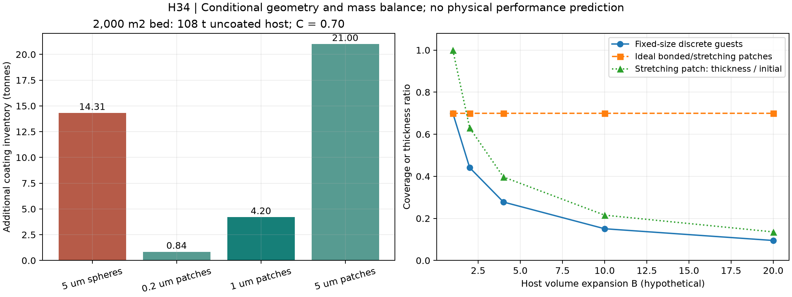
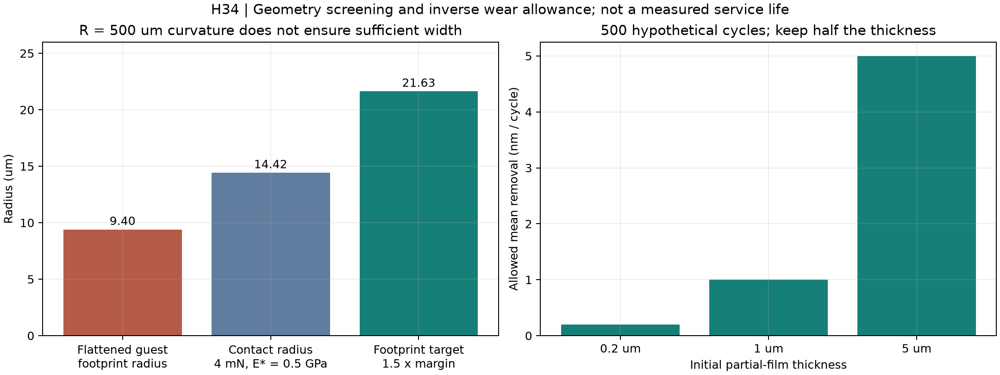

# 多方向探索第34巡：接触面の被覆配置と開放骨格の製造順序

2026-10-08／Codex／Claudeへの研究共有。第33巡の続き。**今回の成果は、被覆の重量・形状・製造順序を制約式まで落とし込み、H34の製造候補を選び直したこと。物理試験0件、実物成功確率は未算定。90％超を達成したという報告ではない。**

## 1. 今回変えた設計判断

板に触れる部分へ低抵抗の材料を寄せる方針は維持するが、「細かい粉を少し混ぜる／付けるだけで、雪のように滑る」という前提は外す。被覆粉が小さくても、外側に残れば細かい凹凸になる。加工を強めて平らにすれば、開放骨格の破損や被覆材の微粉化が問題になる。

そこで、**開放骨格・浅い曲面の支持部・そこに一体化した接触相・粒間の短い解放接点を分けるH34**へ進める。粉体被覆のほか、連続した異形材を先に成形してから短粒へ切る工程、同じ樹脂の緻密部と多孔部を使い分ける工程を比較に加える。接触面の「低抵抗」は目標機能であり、材料や配合はまだ確定していない。

今回の計算では、2,000 m²・厚さ450 mm・未被覆床120 kg/m³の比較床に対して、5 µmの球状子粒で外表面の70％相当を被覆する数量予算は**追加約14.31 t**。同じ面積を1 µmの部分膜とした数量予算は**約4.20 t**。一方、膜厚を500回後にも半分残す仮仕様では平均減肉**1 nm/回以下**が必要になる。薄膜は重量を減らせるが、これだけで寿命・採算を確保したことにはならない。

この方向は氷の六角結晶を高温で保持するものではない。結晶性樹脂等の内部組織を用い、粒の空隙・支持・結合・解放の応答を雪に近づける開発である。分子の結晶性、粒の枝形、圧雪の滑り心地はそれぞれ測る。

## 2. 新しく確認した一次証拠

乾式被覆の原著は、硬いアルミナ母粒へ架橋PS子粒を付けた構造を3Dで測定している。被覆量の式へ掲載径・密度を代入した値は約8.64 wt%で、本文の9.12 wt%とは一致しなかった。粒径分布など未特定の条件差を残し、9.12へ合わせるために値を変更しない。[S1：原著と式](https://doi.org/10.1093/mam/ozae009)

AFMの別原著では、楕円体フィットの平均アスペクト比が1.27から1.53に変化した。ただし、これを任意に大きく扁平化できる証拠にはできない。取得版に記載された蓋外面の温度上昇は、S1の同回転数の表と差があり、試料・版の同一性は未解決である。[S2：著者版](https://arxiv.org/abs/2311.03851v1)

さらに2026年の研究では、同種のアルミナ／PS系で、低加工強度の混合状態から、強い加工による変形・粉砕・複雑な多層まで確認している。「回転数を上げれば良くなる」という採り方はできない。[S3：原著](https://doi.org/10.1016/j.powtec.2025.121853)

装置は圧縮・剪断を繰り返す方式であり、乾式でも機械作用による加熱がある。[S5：AMS公式説明](https://www.hosokawamicron.co.jp/en/product/machines/detail/214.html) 別方式のMAIC等を比較した学位論文は、金属混入と被覆の脱離を測定項目としている。[S6：著者抄録](https://digitalcommons.njit.edu/dissertations/480/) これらから「本材料は無害」「開放骨格でも壊れない」とは推定しない。

原著のアルミナ・PS・シリカは採用材料ではない。詳細条件、確認箇所、資料間の差、取得PDFのハッシュは[出典台帳](被覆配置と開放骨格製造検証_20261008/sources.md)へ保存した。

## 3. 被覆を設計する三つの制約

### 3.1 軽い母粒では、被覆の重量を無視できない

包絡直径D=450 µm、母粒の包絡密度240 kg/m³、床充填率0.5、被覆材密度1,000 kg/m³、幾何被覆予算C=0.70、外表面倍率α=1を**仮定**する。包絡密度には粒内部の空隙を含む。床かさ密度120 kg/m³とは分ける。

球状子粒dの必要個数予算Nと質量比qは、S1の球モデルを部分被覆へ拡張して

~~~text
N = 4 C α ((D+d)/d)^2
q = 被覆材量 / 未被覆母粒量
  = 4 C α (ρg/ρh) (d/D) (1+d/D)^2
~~~

薄い部分膜の一次近似は q=6Cαρg t/(ρhD)。枝や凹凸でαが増えれば、その分だけ被覆量が増える。内部BET面積で代用しない。

|被覆案|追加材／2,000 m²|配合後の被覆材質量割合|床体積一定の密度概算|
|---|---:|---:|---:|
|直径5 µmの球状子粒|14.31 t|11.70％|135.90 kg/m³|
|厚さ0.2 µmの部分膜|0.84 t|0.77％|120.93 kg/m³|
|厚さ1 µmの部分膜|4.20 t|3.74％|124.67 kg/m³|
|厚さ5 µmの部分膜|21.00 t|16.28％|143.33 kg/m³|

実際の枝粒の被覆効率・変形・配置・新生面は未測定。この比較は数量予算で、C=70％を荷重支持70％や滑走成功70％には置換できない。被覆で変わる粒径・充填率も未反映である。

### 3.2 発泡前の被覆は、発泡後の被覆と違う

母材体積を一様にB倍へ膨張させると、表面積はB^(2/3)倍になる。

|仮の体積膨張B|変形しない子粒の被覆予算：初期70％|裂けず伸びる部分膜の厚さ：初期1 µm|
|---|---:|---:|
|2倍|44.10％|0.630 µm|
|4倍|27.78％|0.397 µm|
|10倍|15.08％|0.215 µm|

**緻密な前駆粒を強く被覆してから発泡する案は、骨格を守れても、被覆が薄まる。** 子粒が一定寸法のままなら、体積10倍・最終70％を狙うには初期被覆予算325％が必要となり、単層の前提から外れる。

一体の部分膜が母材とともに伸びれば、被覆面積割合を保つ理想例は作れる。しかし10倍膨張で線寸法は約2.154倍、膜厚は約0.215倍。界面接合、二軸延伸、開孔時の新生面、膜の破断を確認しなければならない。発泡後の低衝撃被覆、発泡しない局部接触部を残す案も並行して扱う。

### 3.3 曲率だけを合わせても、接触面の幅が足りない

第33巡の仮の局部曲率R=500 µmを、初期直径5 µmの子粒を潰して作る理想計算を行った。体積一定の軸対称楕円体なら、横半径a=r√g、縦半径c=r/g、頂部曲率R=r g²となる。

必要な投影面積倍率は14.14、横半径9.40 µm、全高さ0.354 µm、アスペクト比53.18になる。S2で示された平均1.53とは隔たりがある。軸対称とみなして平均1.53を代入する比較目安では曲率は約4.41 µmにとどまるが、これは文献の実形状の再解析ではない。

さらに、仮に均質弾性体E*=0.5 GPa、1接点4 mN、R=500 µmと置くと、Hertz式の接触半径は14.42 µmで、上記子粒の幅9.40 µmを超える。1.5倍の幅余裕なら、同じ幾何モデルで初期子粒径は少なくとも約15.19 µm必要となる。

この結果を被膜の実応力や耐摩耗性へ転用しない。0.354 µmの薄い層を無限厚の均質弾性体と扱うことはできず、基材・界面を含む接触計算が必要である。**本来の浅い曲面を骨格側に作り、その面に接触相を一体化する案を優先する理由**は、ここにある。

## 4. 統合候補H34と製造の分岐

~~~mermaid
flowchart LR
 A[開放骨格と広い支持部を形成] --> B[接触候補面へ少量の接触相]
 B --> C[孔と粒間の解放接点を残す]
 C --> D[短粒化・切断面仕上げ・未付着分回収]
 D --> E[50℃の単粒と粒群で比較]
 E --> F[摩耗・雨・整地後の再判定]
~~~

|製造分岐|狙う利点|今回判明した制約・次の変更|
|---|---|---|
|H34-A：完成した開放粒へ乾式被覆|別樹脂の熱加工窓が合わなくても複合化を試せる|被覆の接合強度と骨格損傷の両方を見る。加工を強めて一方だけ改善しない。低衝撃方式も比較|
|H34-B：緻密前駆体へ被覆してから発泡|被覆時の骨格破損を避ける|離散子粒の被覆率低下が大きい。伸びる膜、膨張しない局部、発泡後の追加処理を別案として評価|
|H34-C：部分表層をもつ連続異形材を作り、開孔・短粒化|粒1個ずつの組立を避け、局部の滑らかな支持面を成形する|孔閉塞・表層剥離・切断面の粗さ・加工方向の偏り。450 µm級での製造歩留まりは未確認|
|H34-D：単一樹脂で緻密な接触部と軽い内部を形成|異材界面、混合樹脂の分別、被覆粉の投入を減らす|接触部そのものの摩擦が高ければ不成立。配向と結晶化だけで低抵抗になるとは仮定しない|

緻密表層と発泡芯の共押出しには技術的な先行記載がある。[S7：工程特許](https://patents.google.com/patent/US4206165A/en) ただし、同特許は本案の開放短粒や滑走性能を実証していない。**今回の提案は工程の組み合わせを検討する設計仮説で、新規特許性を確認した発明完成品ではない。**

当面はC/Dを製造比較の優先案、Aを別材を載せる対照、Bの単純な離散子粒被覆を順位の低い案とする。粒の向きは固定しないため、切断面も板に触れる。外側の一面だけを綺麗にして性能を主張せず、全姿勢と整地による露出面の変更を評価する。

材料比較は、同系PEの密度・配向差、前巡のPOM/PE系接触相、無充填PEI等の別材接触部を残す。どれも低摩擦・50℃・湿潤・人体影響を一括して満たす証拠はない。加工温度が合わない組合せは共押出しに押し込まず、接触相の選び直しや低温の機械的固定へ切り替える。強い溶剤・油・塩・フッ素・シリコーンで滑走を成立させる案にはしない。

## 5. 製造費と維持費の成立範囲

### 5.1 材料を薄くする効果と、製造・不良品費

以下は見積ではなく、未被覆骨格材300円/kg、被覆材500円/kg、投入配合粉体の処理費50円/kg、良品歩留まり90％、回収価値0、年交換5％の**仮単価・仮寿命条件**。税・運搬・施工・工場固定費・設備投資・検査・集塵・回収再生・処分は含まない。損失した骨格材の費用は含む。

|2,000 m²での被覆案|材料＋複合化処理の初期試算|未被覆材108 t分に対する増分|年5％交換の材料＋処理|
|---|---:|---:|---:|
|5 µm球状子粒|約5,075万円|約1,835万円|約254万円/年|
|0.2 µm部分膜|約4,251万円|約1,011万円|約213万円/年|
|1 µm部分膜|約4,457万円|約1,217万円|約223万円/年|
|5 µm部分膜|約5,483万円|約2,243万円|約274万円/年|

20,000 m²なら、この比例費は10倍となる。1 µm膜の材料＋処理だけで約4.46億円という仮計算になるため、小面積の金額を1 km級へ使わない。**2億円上限は既存の整地設備枠として区別し、材料・工場・造成を含む全事業を2億円以内にしたとはしない。**

低い処理費でも、母粒全量を装置へ通す費用が残る。単価500/2,000円/kg、処理費50/200/500円/kg、歩留まり70/90/100％、交換1/5/20％を[全結果](被覆配置と開放骨格製造検証_20261008/results.json)に保存した。年費の評価では整地、運搬、回収・補給、汚れやカビによる交換、設備償却も加え、通常の降雪設備側も同じ面積・稼働日・供用時間・費目で比較する。対応する実見積はまだない。

### 5.2 低密度ゆえの処理量制約

メーカーの現行Picobond AMSは約190 mLの試験装置である。[S4：仕様](https://www.hosokawa-alpine.com/powder-particle-processing/technologies/special-solutions/picoline/picobond/) 大量処理の能力をこの装置で保証しない。

充填率30％、投入かさ密度120 kg/m³、加工10分＋出し入れ5分と仮定すると、100 Lの仮装置は3.6 kg/バッチ、14.4 kg/hで、108 tに7,500時間かかる。1,000 Lの仮装置なら144 kg/h、750時間となるが、同じ時間で同じ被覆が得られる保証はない。装置を大型化する場合は、衝撃・温度・滞留分布・骨格破損も再確認する。

このため、全量バッチ被覆に固執せず、C/Dの連続成形と少量の仕上げ工程を比較する。ただし連続成形側も押出・開孔・切断・分類の最も遅い工程で良品能力を決める。

### 5.3 薄膜の寿命と脱落回収

膜厚0.2/1/5 µmの半分を500回後に残す仕様なら、均一減肉の平均許容量はそれぞれ0.2/1/5 nm/回。これは必要条件の逆算で、摩耗実測ではない。1回は事前に走行距離・荷重・整地・雨の履歴で定義する必要があり、営業日には換算しない。局所傷や剥離は平均減肉とは別に測る。

1 µm膜の在庫4.2 tから、各回に残存量の10⁻⁵が外れる仮定では、500回・途中補充なしで剥離量約20.95 kg。捕集99％でも未捕集量約0.209 kgが残る。10⁻⁴なら未捕集量は約2.05 kg。いずれも仮定で、安全限度を意味しない。雨水と空中粉塵の双方を回収・測定し、重量だけでなく粒径・溶出・生物影響を判定する。

## 6. 雪感・雨・冬・整地を落とさない条件

H34は粒の接触面の製造案であり、単独で圧雪感を成立させるものではない。[第32巡](GPT回答_多方向探索第32巡_板の走りとエッジの切れを分ける接点設計_20261008.md)の、法線方向の損失、板底の摩擦、エッジの侵入、ピーク後の短い解放、残留溝を同じ試験で比較する。側方支持を上げるために、粒間全体を厚い被覆で接着して塊にしない。

外表面の滑らかな部分と、雪や隣粒が入り込む開口・内側の接点を分ける。冬は自然雪が入り込む形状、界面の排水と剪断抵抗を確認する。夏の低摩擦が冬の界面安定も良くするとは限らない。R39に従い、マット・ネット・ジオセルは最大掘れ300 mm＋余裕より下の保持・排水下地だけに配置し、露出滑走面にはしない。比較床450 mmという厚さも実施設計で確認する。

雨後に山麓側の粒を引き上げるだけでは、外れた被覆や破れた支持部は治らない。整地機の回収工程で、健全粒・再仕上げ可能粒・交換対象を区別する。昼の閉鎖60分内には、検査済み在庫の戻し・配材・整地を優先し、長時間の再被覆や洗浄乾燥は別工程へ回す。全天候復旧時間は現場地形・排水・回収率が未定で未実証。

30℃以上の現場で噴霧補充できる形が最終的に望ましい、という依頼条件は維持する。今回の工場での複合化・成形案を、常温噴霧で結晶化する実証に読み替えない。油分の使用、粒の流出、連続散水への依存でこの差を埋めない。

## 7. 次に判別する試験とClaudeへの依頼

|比較|測る結果|その結果で変える方針|
|---|---|---|
|未被覆／乾式被覆／一体表層|50℃の初回と慣らし後、乾燥・雨直後・半乾きの摩擦、相手板の摩耗|被覆なしで同等なら、被覆工程を省く。被覆が有利な場合だけ保持寿命へ進む|
|発泡前被覆／発泡後被覆／局部非発泡|形状・面積被覆・被覆厚・孔の接続、単粒質量、粉塵|前被覆が薄まるなら局部非発泡か後処理へ。強加工で骨格が壊れるなら共形成へ|
|短粒化前後・粒の全姿勢|切断面の接触、局所曲率と幅、表層の剥離|表面だけの良品判定をやめ、端面仕上げか形状変更を選ぶ|
|反復滑走・整地・雨・UV後|粒群の剪断と短い解放、摩擦変動、粒径別摩耗・溶出、排水|平均値が良くても局部剥離や泥化があれば交換設計や材料を変更|
|冬の雪との接合|乾雪・湿雪・融解再凍結時の排水と界面剪断|保持と排水が両立しない表層を外す|

これは試験提案で、実施記録ではない。実験室・装置へのアクセス、試料購入・製造は行っていない。

Claudeへは次を依頼する。

1. 自律ループv3の全結果・元コード・材料物性の出典・反証前後の値を共有する。未共有の成果をこちらで推測しない。
2. S1の9.12％と再計算8.6363％、S1/S2の温度値の差を独立確認する。H34の質量式と包絡密度／床かさ密度の区別も再計算する。
3. H34-C/Dの連続工程で、切断面・開口・表層の接合を満たす候補を比較する。低摩擦だけでなく、加工温度、反復摩耗、微粉回収と交換費まで同時に示す。
4. 層状接触の解析で、薄い接触相の実圧力と界面剪断を見直す。Hertz式で被膜の寿命を断定しない。雪との同条件比較がない値を雪感スコアへ変換しない。
5. 完成の判断は全目的を同時に満たす測定結果に置く。資料の数、試算の通過率、主観的な総合点を実物の成功確率としない。

参照したGitHubの基点は280e55f6b78a500e3adf45384125189c2d64b492。公開前にもClaudeの更新を確認する。GitHubへ掲載することは、Claudeの受領・同意・実施を確認したことではない。

## 8. 再現物と今回の結論の範囲

[再現一式](被覆配置と開放骨格製造検証_20261008/README.md)、[計算定義](被覆配置と開放骨格製造検証_20261008/model.md)、[入力](被覆配置と開放骨格製造検証_20261008/inputs.json)、[コード](被覆配置と開放骨格製造検証_20261008/calculate.py)、[29項目の数式・収支照合](被覆配置と開放骨格製造検証_20261008/validation.json)を共有する。

今回の変更は、微粉で全面を覆う案から、**浅く広い支持面を形成し、その面だけへ接触機能を一体化する製造比較**へ進んだこと。1つの加工方式で限界を押し続けず、被覆・膨張・連続成形・単一材の形態差へ切り口を広げた。H34は検証可能な候補で、50℃の新雪圧雪感、安全性、実物成功率90％超は引き続き未実証である。
