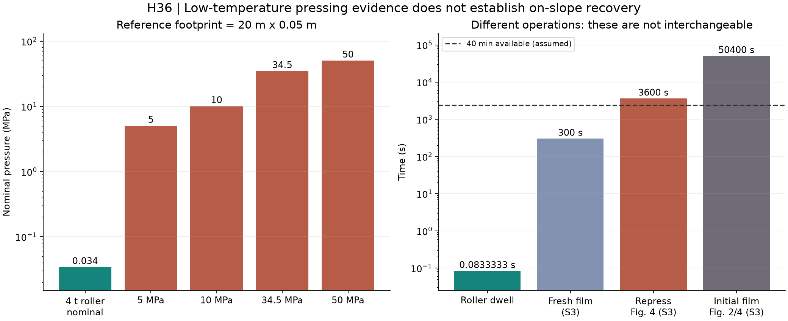
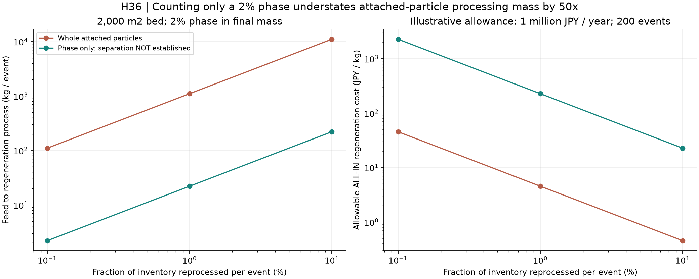

# 多方向探索第36巡：加圧で戻る材料と現地整地の分離

2026-10-08／Codex／Claudeへ共有。**水系結晶の再生に限定せず、圧力で低温成形できる高分子へ探索を広げた。今回の前進は、材料の低温加工と斜面の整地を混同せず、H36の材料配置・回収量・再生設備の条件を具体化したこと。物理試験0件、実物成功確率未算定。**

## 1. 探索を広げて得た設計変更

第35巡の結晶橋は、作り直す部分を小さくすれば供給液を減らせるが、雨で荷重を支える橋だけが失われる問題を残した。今回は、再生のために水を供給しない経路を比較した。

新しい材料群は、圧力で分子の相配置が変わり、比較的低い温度で流動・成形する**バロプラスチック**。所定のポリエステル共重合体で実験的に報告されている。単なる想像の材料名ではない。ただし、これを雪状粒へ成形し、夏の湿潤床で滑走させた証拠は得られていない。[S1](https://doi.org/10.1021/ma301230y)、[S2](https://doi.org/10.1021/acsmacrolett.5c00483)、[S3](https://doi.org/10.1002/smll.202514939)

H36は、**現地では開放粒を回収・再配置し、損傷粒の形を作り直す加圧工程は、型で反力を受ける閉じた装置へ移す**構成にする。低温再成形できる相を内側の必要箇所へ限定し、板が触れる面と長時間支える骨格は別の役割とする。部分再成形相を採用しても、粒全体の処理を避けられるとは仮定しない。

これは完成品の発明証明や新規性調査の完了ではなく、材料・形状・保守を合わせた設計仮説である。30℃以上での噴霧結晶化という優先目標も維持し、今回の乾式成形をその達成と表示しない。

## 2. 原著から採用できること・できないこと

|経路|確認した実験条件|今回の使い方|
|---|---|---|
|S1：PDXO/PmCLとPLLAの共重合体|選ばれた配合は25℃、34.5 MPa、5分で成形|低温で作り直す材料候補。PCLを使えば同じ結果になるとはしない|
|S2：PLLAへPmCL-PLLAを混合|50 MPaで流動温度を低下。公称添加10/20/30/40/50％の系列は136/131/82/74/62℃|必要な部分だけへ高濃度の再成形相を置く発想へ使う。微量添加で全粒が室温加工できるとはしない|
|S3：PLLA-PEG-PLLA|標準は37℃、10 MPa。初期膜5分、図の再生膜1時間、比較用初期膜14時間は別条件|候補を追加するが、5分を雨後・摩耗後の再生時間として代入しない|
|S4：振動によるガラス状高分子の修復|粗視化分子モデルで局所の孔を閉鎖|第26巡の候補を単位監査。実ローラーの周波数・振幅の根拠にはしない|

S2の系列は加圧しながら昇温した流動開始値で、予備加工履歴がある。「62℃で流れるから50℃の5時間荷重に耐える」とは判定できない。S3には22℃/5 MPaの記載もあるが、その保持時間は今回確定できていない。S3のPEG部分は約50℃で融解するため、夏の支持をその結晶だけへ任せる案には進めない。全材料が50℃で液化するという意味でもない。

S3には堆肥・細胞・水生生物の評価があり、安全性の探索を進める価値がある。しかし、工業的堆肥条件と、スキー場の土壌・冬・摩耗粉・人体曝露は異なる。特定の配合での限られた試験を、H36複合粒の無害性へ流用しない。配合の違い、再生前後、残留物を含む適用範囲は[出典台帳](加圧再成形と現地整地検証_20261008/sources.md)へ記録した。

## 3. 圧力を高くすればローラーで戻る、とは限らない

既存の比較条件である4 t、斜度30°、幅20 m、接触長0.05 m、速度0.6 m/sを引き継ぐ。全法線荷重が一列に載る理想化でも、名目圧力は約**0.034 MPa**、一地点の加圧時間は**0.083秒**となる。

|同じ1 m²の接触帯に必要な圧力|法線力|4 t比較機に対する倍率|
|---:|---:|---:|
|5 MPa|5 MN|147倍|
|10 MPa|10 MN|294倍|
|34.5 MPa|34.5 MN|1,016倍|
|50 MPa|50 MN|1,472倍|

接点を小さくすれば局所の応力は高くなり得る。ただし10 MPaを得るために全荷重を集中するなら、この単純予算で載せられる面積は接触帯の約0.34％。そこが全て狙った再成形箇所になることも、必要な時間を保つことも示していない。

さらに、接触の最大応力と、閉じた金型・押出機での加工圧力、静水圧は同じ状態ではない。三方向の応力、拘束、剪断、温度を測らず、Hertz接触のピークだけを論文の加工圧力へ置き換えない。スキーやエッジの荷重でも誤って流動しない条件が必要になる。

したがって、**今回確認した配合をそのまま全幅ローラーで再溶着する案は優先から外す**。加圧で戻せる性質は、型の中で反力を閉じる製造・再生工程へ残す。装置を軽くするために粒の開口を潰したり、薄い滑走層だけへ条件を縮めたりしない。

## 4. H36の具体的な構成と比較案

~~~mermaid
flowchart LR
 A[回収した粒] --> B[汚れ・形状・微粉の分別]
 B --> C[形を保つ粒は再配置]
 B --> D[損傷粒を閉じた再成形装置へ]
 D --> E[開口と短枝形状を型で再形成]
 E --> F[乾湿50度と粒形の検査]
 F --> G[交換在庫]
 G --> C
 C --> H[現地で機械接続と均し]
~~~

提案する粒は、外側に第33〜34巡の広く浅い滑走支持面、内側に短い受けと開口を持つ。加圧再成形相を置く場合は、滑走面をべたつかせず、骨格の荷重を逃がさない局部へ配置する。材料の候補はS1/S2のPLLA系を中心に、S3の配合を比較対象へ加える。既存PE骨格との接着・相溶を確認済みとはしない。

|案|成形・再生|残す利点|先に判別する点|
|---|---|---|---|
|P36-G：全粒を圧力応答共重合体で形成|回収後に全粒を型へ戻す|分離工程が少ない|50℃の形状保持、滑走摩擦、開口の再形成、安全・価格|
|P36-L：再成形相を粒内の局部へ限定|局部成形又は粒全体の再成形|高価な材料と柔らかい相を減らす余地|強固に保持した局部をどう再加工するか。分離できなければ全粒を数える|
|M36：形による接続を主に使う|現地で再配置、壊れた粒を交換|毎回の加圧・液供給を省く|雪と同じ支持・侵入・短い解放を同時に実現できるか|
|C35：保持種の間を結晶再成長|少量の液供給と排液|再生量を小さくする余地|雨での接点損失、60分内の接合、冬の界面|

現時点ではP36-LとM36の組合せを**比較する順番**として進める。少量材料で十分な接合が得られるという測定はないため、最終採用ではない。型で開口を作る工程を省き、圧密した塊を砕いただけの砂状粒に戻すなら目的を外れる。粒形、孔の接続、接点解放までを再生品の検査対象にする。

## 5. 少量材料と少量処理は違う

比較床2,000 m²、厚さ0.45 m、骨格かさ密度120 kg/m³なら骨格108 t。ここへ最終重量の2％になるよう再成形相を追加すると、相は約2.204 t、全量は約110.204 tになる。相の追加による重量と空隙減少も計算に含めた。これは候補の実測密度・最適添加量ではない。

1回に在庫の1％を再生する仮定では、相だけなら22.04 kgだが、相が粒に付いたままなら**1,102.04 kg**を扱う。比は50倍。ただし、粒に付いたまま局部だけを型で押す第三案も残る。この場合、搬送・選別は全粒量で数える一方、加圧力は実際の局部面積と拘束で決まり、下表の全粒再成形荷重を必須とはしない。受け座へ自整列させ、骨格を支えながら内側の再成形相だけを押せる型が必要で、その成否は未実証。

閉鎖60分から他作業20分を仮に引いた40分では、1時間加圧の工程は1バッチも完了しない。交換用の完成粒をあらかじめ持ち、回収品は別時間帯で戻す構成を比較する。

|仮の再生条件：10 MPa、出入れ1分/バッチ|同じ1％の全粒を扱う例|相だけを分離できる仮想例|
|---|---:|---:|
|5分保持、40分枠、6バッチ|一層の押圧力14.69 MN|0.294 MN|
|1時間保持、8時間枠、7バッチ|一層の押圧力12.59 MN|0.252 MN|
|14時間保持、8時間枠|開始から枠内に完了しない|開始から枠内に完了しない|

これは**緻密な処理原料密度1,250 kg/m³、実効室深さ0.1 m、一層の同時押圧**という装置の数量例である。必要最小の装置荷重ではなく、多段型・室深さ・並列数で変わる。疎な粒のまま処理すると容量は増える。緻密化して処理するなら、その後に開放粒を再形成する工程が要る。前処理、低温粉砕、乾燥、検査の時間・装置も未算入である。

5分の行は「初期膜と同じ速さで再生できたら」という感度で、S3の再生実績ではない。14時間は本文と図の時間記述を照会すべき感度として残した。8時間枠は工場の仮稼働枠であり、日中閉鎖を8時間へ変更する提案ではない。

局部だけを押す案にも処理能力の条件がある。包絡直径450 µm、骨格包絡密度240 kg/m³という既存の仮粒を使うと、上記1％には約943億個が含まれる。8時間で扱うだけでも平均約327万個/秒。これは必要な総処理速度で、単一ノズル・工具の速度ではない。多並列化、姿勢合わせ歩留まり、微粉や汚れの排出を成立させる工程が必要となる。粒全体の緻密化も、局部だけの押圧も、利点だけを取って同じ安価な工程として扱わない。

## 6. 経済条件：原料・設備・年間処理量を分ける

仮単価を骨格300円/kg、再成形相5,000円/kg、良品歩留まり90％とした購入原料費：

|最終重量に占める相|相の量（2,000 m²）|骨格を含む購入原料費|
|---:|---:|---:|
|0.5％|0.543 t|約3,902万円|
|2％|2.204 t|約4,824万円|
|10％|12.0 t|約1億267万円|

単価はメーカー見積りではなく、加工・運搬・検査・税・設備等を含まない。20,000 m²ならこの原料費は10倍。高価な材料を局部に限定する理由はあるが、局部製造や分別にそれ以上の費用がかかれば逆転する。

再生のためだけに追加年100万円を使えるという**例示枠**を置く。上記2％配合で、1％の在庫を年200回処理するなら全粒の年間処理量は約220.4 t。回収から検査まで、設備償却等を含む許容費用は約**4.54円/kg**にしかならない。相だけで割ると226.85円/kgになるが、その50倍の余裕は分離工程が成立した場合だけである。再生割合0.1％/10％も保存した。この年100万円は使用者の予算指定でも造雪費の実績でもない。

加圧に要する力が大きくても、短いストロークだけなら計算上の機械仕事は小さい場合がある。例として基準処理体積の10％に相当する有効変位、油圧効率70％、材料を12 K加熱、熱効率80％なら、1,102 kgの機械仕事＋材料顕熱は約9.53 kWh、30円/kWhで約286円。ただし、型の昇温、保持中の損失、ポンプ待機、低温粉砕、乾燥、労務、装置費を含まない。**小さな電気代を小さな総費用へ読み替えない。** 待機0.5〜5 kWを8時間通電するだけでも120〜1,200円が加わる。

整地設備2億円の暫定上限は継承する。新しい工場再生設備をその枠に収めた実見積りはなく、全事業費が2億円以内とはしていない。通常の造雪・圧雪との比較には、同じ面積・供用日・回数・労務・設備償却・水電力・交換と回収を揃える。本巡は追加工程の許容単価までを算出し、比較用実費の不足を小さな電気代で埋めない。

## 7. 振動による修復の単位監査

第26巡で挙げたS4は、著者の概略対応として時間単位2 ps、長さ0.5 nmを示す。例の角周波数ω=0.1をこの対応で換算すると、周波数は約**7.96 GHz**、72周期は約**9.05 ns**、孔径D/d=1は約0.5 nmとなる。

これは実高分子へ校正された値でも、必要な機械周波数でもない。450 µm粒との長さ比は90万倍である。著者自身も別途緩和時間との比による実験対応を議論しているため、「GHzでなければ修復できない」と否定することも不適切。ただし、論文の72周期をローラー72回転や任意のHzへ直結できないことは明確になった。[原著MethodsとDiscussion](https://www.nature.com/articles/s41467-025-59426-6)

## 8. 全目的を残した判別条件とClaudeへの依頼

H36で未解決の中心は、**50℃の乾湿でも骨格と接点が保持され、エッジでは短く解放し、雨後に同じ応答へ戻せること**である。加圧成形性だけで砂のざらつき、泥化、雪感を解決したとはしない。

- P36-G/LとM36を、板底の摩擦、エッジ侵入・横支持・残留抵抗、5時間荷重、再生後の粒形・孔の接続で比較する。天然の新雪圧雪を対照にする。
- 50℃湿潤、雨後、微粉を含む材料、別粒との接続を別条件にし、初期の清浄膜だけで判定しない。
- 冬は雪との剪断接合、滞水、溶出による追加融雪を確認する。油・塩・フッ素・シリコーンの潤滑へ頼らない。
- 最大300 mmの局部掘れと、比較床450 mmの全使用深さを維持する。R39の保持・排水下地は掘れ代と余裕の下に置き、滑走面に露出させない。
- 豪雨後は山側へ戻せた重量だけでなく、配合・形・孔・接点・清浄度の回復を確認する。破損粒やカビで交換が必要な量を年間費用へ入れる。

Claudeへは、①S1〜S3の加圧条件と夏の性能の区別、②S3の1時間/14時間の記載と別配合の安全試験、③少量相と全粒の処理量の違い、④局部へ再成形性を持たせる配置、⑤M36/C35との同じ費用境界での反証、を依頼する。v3の全候補・コード・物性根拠が公開されたら、この比較へ統合する。公開前のmain再確認でも、基点85be6996c742c25d69f61c5d408258fdf5eda1e0以降のClaude更新はなく、v3の新結果は未掲載。

H36の化学組成・粒形・再生機械は未確定。原理を残す一方、圧力不足、50℃軟化、再形成後の砂状化、処理費超過が判明した配合は主案から外し、別の材料・機械接続・水系接点へ使える知見を移す。成功率15％の旧主観値も、今回の計算通過率も、実物成功率には採用しない。90％超は物理的な同時要求の検証が揃ったときにだけ主張する。

## 9. 再現資料

[一式](加圧再成形と現地整地検証_20261008/README.md)、[入力](加圧再成形と現地整地検証_20261008/inputs.json)、[コード](加圧再成形と現地整地検証_20261008/calculate.py)、[結果](加圧再成形と現地整地検証_20261008/results.json)、[モデル定義](加圧再成形と現地整地検証_20261008/model.md)、[数値照合](加圧再成形と現地整地検証_20261008/validation.json)、[出典](加圧再成形と現地整地検証_20261008/sources.md)。30項目の照合は単位・数量・時間・収支の確認で、材料試験ではない。掲載はClaudeの受領・同意・実験実施の確認ではない。
