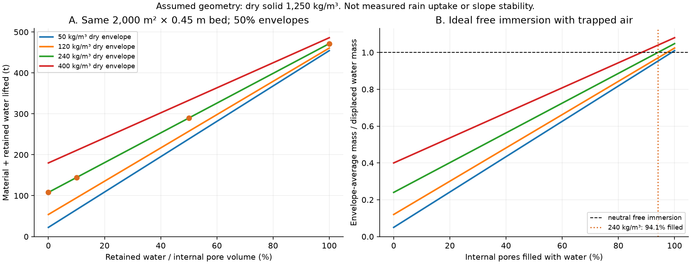
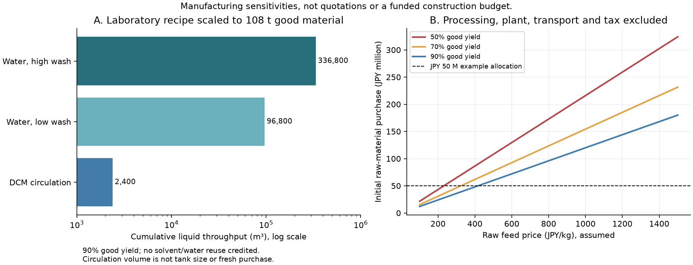

# 多方向探索 第37巡：一括発泡による開放粒と雨後重量の設計

2026-10-08／Codex。参照基点 main a33ff8d93fb33bc1f29cab97bc9035fa7e86038a。回覧板、正本v36、Claude自律ループv2、第30〜36巡の制約を継承。

**今回の前進は、粒を一個ずつ型へ合わせる経路から、まとめて作った骨格の分岐を残して粒へ分けるH37へ探索を広げたこと。** 目標粒径に近いPHA多孔粒の一次研究を見つけ、乳化・加圧発泡・非晶性混合・骨格分断を比較した。その結果、乳化粒の吸水値を雨性能へ流用する案と、50℃で作れる低密度泡をそのまま夏の支持材にする案を主案から外した。

**雪と同じ結晶を作った報告ではない。** 半結晶性高分子の内部の結晶、発泡の空隙、粒同士の接点は別物である。目標は新雪圧雪の板底抵抗、侵入、横支持、短い解放を一緒に再現すること。物理試験0件、実物成功確率未算定。30数値照合を90％の実験成功率には換算しない。

## 1. 四つの経路を同じ目的で比較

|経路|確認した根拠|残す部分|現在の優先度|
|---|---|---|---|
|E37：乳化によるPHA多孔球|実際に330〜400 µmの開放粒が作られているS1|粒単位工具を使わない生成、孔の接続の比較試料|形態の比較用。液処理と保水を解かず主材にしない|
|P37：半結晶性PHAのCO₂発泡|組成による発泡性S2、PHBVの部分開孔S3|工場内で骨格・空隙をまとめて作る|H37の製造母材として優先比較。50℃支持・乾湿摩擦は未取得|
|A37：非晶性PLA/PHAの低密度泡|50℃での発泡と環境別の分解S4|低温加工、分解評価の方法|50℃の主支持材として優先を下げる。発泡温度を耐熱温度にしない|
|J37：分岐を残す選択分断|本巡の提案。完成粒の実証なし|一括製造と短い枝・開口を両立させる|P37及び既存H29系骨格と比較。普通の粉砕片へ戻るなら不採用|

PHAという材料名だけで勝者にはしない。S1のPHBVHHx、S2のP(3HB-co-4HB)、S3のPHBV、S4の非晶性PLA/PHAは異なる配合で、各論文のよい数値を一つの架空材料へ集めない。H29のUHMWPE系など、滑走面の知見を持つ別材料も同じ形・同じ試験の対照として残す。

## 2. 「孔が多い」ことを雪の構造と混同しない

S1の孔は10〜60 µm、その周囲に1〜3 µmの小孔がある。これは細胞を運ぶための研究で、同じ330〜400 µm粒同士が雪のようにつながることを示していない。[S1原著](https://www.tandfonline.com/doi/full/10.1080/21691401.2018.1459635)

例えば相手の短枝を40 µm、片側すきまを5 µmと仮定すると、通るための開口だけで50 µm要る。大きな空洞があっても、その入口や途中が1〜3 µmなら通れない。大きな孔の写真を接続の証明にせず、三次元の入口・曲がり・出口と、接続後の抜け方を調べる。

H37の仮形状は、包絡350〜600 µm、2〜4本の短い腕、太い分岐点、外へ開く空間を持つ粒とする。枝径30〜60 µm、開口50〜150 µmは**比較設計範囲**で、既存PHA粒の実測や最適値ではない。丸い閉じた泡、薄壁の欠片、長い繊維とは分けて検査する。滑走の支持面を受ける太い分岐点と、エッジで回転・解放する腕を分ける狙いである。

~~~mermaid
flowchart LR
 A[工場で骨格と空隙を一括形成] --> B[薄い膜を開き 分岐点を残す分断]
 B --> C[枝数 開口 微粉 鋭い端部を分類]
 C --> D[乾湿50度の同一試験]
 D --> E[合格した完成粒の交換在庫]
 E --> F[現地で再配列と均し]
 F --> G[損傷 汚れ 微粉を分別回収]
 G --> A
~~~

軽さは閉じた気泡だけに頼らず、短い枝の間へ外水が出入りできる空間で得ることを狙う。袋状の空洞を減らせば空気や水を閉じ込めにくくする余地があるが、濡れた枝間の液橋や細い入口の滞水は残り得る。枝を太くして耐久性を上げると重量・侵入抵抗が増えるため、開口だけで合格にはしない。

発明の核心は、各粒へ工具を合わせる代わりに、**分岐点より途中の細い部分が分かれやすい母材を作り、分岐を持つ断片を集める**点にある。精密なC形粒の向き合わせを省く余地がある一方、長い尖端や薄片が大量に出れば成立しない。分断・端部仕上げ・選別の良品率を含めて評価する。加熱で端だけ丸める方法は第28巡で骨格へ熱が逃げる問題があり、成功済みの工程として再利用しない。

S3で観測された部分開孔も、壁が破れ始める条件にある。開孔を増やせば骨格がそのまま強く残るという保証はない。母材の結晶化と分岐形成、分断後の強さ、粉じん量を別々に測る。[S3原著](https://pubs.acs.org/doi/10.1021/acsomega.9b04501)

## 3. 吸水値の監査と、雨後に運ぶ実際の量

S1の吸水試験は75％エタノールによる予備濡らし、水洗い、PBSで12時間という条件。報告WURは22.98±6.49だが、Methodsは「増えた水/乾燥重量」、Results文章は「湿潤重量/乾燥重量」で1の差がある。自然降雨の吸水率や雨後60分の残留水には使わない。[S1 MethodsとResults](https://www.tandfonline.com/doi/full/10.1080/21691401.2018.1459635)

比較設計として、樹脂実体密度1,250 kg/m³、単粒包絡密度240 kg/m³を置くと、形が変わらず水が粒内だけに入る上限は約3.37 kg-water/kg-dry。S1の二つの解釈22.98又は21.98はこの上限の約6.8又は6.5倍である。

逆に、全水が固定された粒内空隙だけに入ったと仮定して密度を求めると約42.1又は43.9 kg/m³になる。**これは密度の実測ではない。** 表面・粒間に残る水、膨潤、乾燥基準などを確認せず、S1の吸水量と本案の密度・強さを組み合わせない。

比較床2,000 m²×0.45 m、粒包絡の充填率50％では、上記仮粒の乾燥重量は108 t、粒内空隙は363.6 m³。

|粒内空隙に残る水の割合（仮定）|粒内の水|持ち上げる材料＋水|
|---:|---:|---:|
|0％|0 t|108.0 t|
|10％|36.36 t|144.36 t|
|50％|181.8 t|289.8 t|
|100％|363.6 t|471.6 t|

表は残留水の感度で、雨で必ずこの状態になるという予測ではない。粒間の水・泥・葉などを加えれば搬送重量はさらに変わる。全量が山麓へ移る仮定も置いていない。回収する割合をこの重量へ掛け、牽引・配材・脱水能力を検討する。

また、樹脂そのものが水より重くても、気体を残す軽い粒は浮き得る。自由浸水の理想化では、この仮粒は粒内空隙の約94.1％が水で埋まって初めて中性浮力に達する。空気が直ちに抜ける開放骨格では、閉じた気泡のある球と同じ滞留を仮定できない。これは浮流への注意条件であって、満水にして沈める運用の提案ではない。滞水を避け、R39の保持・排水下地と回収経路を使う。水中で自由に通じる孔水の重量を、斜面を安定させる荷重へ二重に加算しない。

## 4. 一括製造も、液量と保持時間を省略しない

S1の仕込みは樹脂0.75 gにDCM15 mL、水相5＋100 mL、溶剤除去の攪拌は少なくとも6時間。洗浄4回と500 mL以上の記載は総量/各回が曖昧なので、合計0.5 Lと2 Lの両方を扱う。これは公開レシピの数量監査で、現地でDCMやアンモニアを使う製法の推奨ではない。[S1原著](https://www.tandfonline.com/doi/full/10.1080/21691401.2018.1459635)

108 tの良品、歩留まり90％という仮定では原料120 t。論文の比率を保った延べ液量は、DCM約2,400 m³、水相＋洗浄水約96,800〜336,800 m³になる。これは**延べ処理量**であり、初回購入量やタンク容量と同じではない。再使用と溶剤回収は必須の検討だが、汚れ・PVA・溶出物の蓄積を無視できない。

仮にDCMを99.9％回収しても定常損失補給は2.4 m³、99％なら24 m³。水を99％再使用できる仮定でも補給は968〜3,368 m³に相当する。初回仕込み液や回収設備は別である。再使用率を高く入力しただけでは、製品の残留物や排水の安全を証明しない。

在庫の1％＝1,080 kgを8時間に製造すると仮定し、90％歩留まり・論文比率・最低6時間保持だけを数えると、連続定常設備の乳化液滞留容積は少なくとも約144 m³。60分閉鎖から他作業20分を除く40分に同じ払い出し量を求めれば約1,728 m³相当となる。空のラインを始動して40分で6時間工程を完了することはできない。事前仕込みと完成品在庫を分けて計画する。

CO₂発泡は大量の洗浄液を省く可能性がある。ただしS2は保持60分、S3は30分＋90分で、前後処理がさらに必要。S4の保持30分と混合温度なども別工程である。工場8時間で上記1％を処理する数量例では、保持2時間・原料密度1,250 kg/m³・原料の占有率50％で、原料装入に相当する室容量は0.48 m³。これは発泡後体積、装置の余裕、出入れ・冷却を含まないため、**144 m³対0.48 m³だけから実機の小型化率・費用差を決めない**。[S2](https://pmc.ncbi.nlm.nih.gov/articles/PMC9144235/)、[S3](https://pubs.acs.org/doi/10.1021/acsomega.9b04501)、[S4](https://onlinelibrary.wiley.com/doi/full/10.1002/mame.70318)

現時点の運用案は、現地で良粒を再配置し、欠損分は在庫から補充、回収粒の再製造を工場へ分離する構成。現地30℃以上での噴霧補充という理想は継承するが、加圧発泡がそれを実現済みとはしない。

## 5. 50℃で作れた泡と、50℃で滑れる床は別

S4の非晶性PLA/PHAは50℃90 barで低密度化できる一方、PLA相のDSCガラス転移は約49℃。表面50℃の荷重保持をこの発泡結果から保証できないため、主支持骨格の優先を下げた。半結晶性PHAも、融点が高いという理由だけで採用せず、50℃の湿潤クリープと繰り返し荷重を測る。[S4](https://onlinelibrary.wiley.com/doi/full/10.1002/mame.70318)

S4は環境中で減った質量とCO₂へ無機化した量が異なることも示す。PHAを混ぜればPLAまで同時に無害化する、ともいえない。材料が細かく壊れて回収できなくなった分を「分解して安全」と数えない。H37は開口で内部へ水が入りやすくなるため、雨後の重量だけでなく、分岐部の損傷、清浄度、微粉・溶出を追跡する。

この結果はPHA全般の不採用を意味しない。組成を変えることで加工性・50℃支持・寿命を分けて調整する余地はある。ただし、再生可能・生分解性・生体適合というラベルを、利用者や環境への全曝露安全の十分条件にはしない。

## 6. 初期費用より、交換率が年間費用を左右する

仮の原料単価300/600/1,500円/kg、良品歩留まり90％では、108 tを作る**原料だけ**で3,600万/7,200万/1億8,000万円。市場見積りではなく感度で、発泡・分断・選別・運搬・設備・税を含まない。20,000 m²では同じ厚さ・密度なら10倍になる。

初期原料に5,000万円を割り当てるという例示なら、90％歩留まりで許容原料単価は約417円/kg以下。整地設備2億円という依頼者の上限とは別の仮枠であり、総事業費が2億円に収まったという意味ではない。

年間100日、1日2回＝200回、完成交換材の追加枠を年1,000万円とする**例示**：

|1回に交換する在庫割合|年間の交換良品量|完成交換材に使える単価上限|
|---:|---:|---:|
|0.1％|21.6 t|約463円/kg|
|1％|216 t|約46.3円/kg|
|10％|2,160 t|約4.63円/kg|

回収・選別なども同じ枠から支払えば許容単価はさらに下がる。年1,000万円は使用者が決めた予算でも、既存スキー場の実費でもない。交換率1％・原料600円/kg・歩留まり90％だけで年1億4,400万円になるため、毎回破壊して新しい粒へ替える設計は原価に敏感である。**太い分岐は残し、粒間の接続だけを解放して組み直す**方向が必要になる。ただし繰り返し寿命は未測定。

通常の造雪・圧雪との比較は、同一面積、供用日数、整地頻度、設備償却、労務、水電力、回収・廃棄を揃えて行う。今回の原料費だけを冬の全運営費と比べ、安いと結論しない。H37の完成原価と摩耗交換率が得られたら、同じ年間式へ入れる。

## 7. 試作比較で最初に分岐させる条件

候補E37多孔球、P37の発泡片、J37の分岐粒、既存骨格の対照を、同じ乾燥重量だけでなく、同じ厚さ・かさ密度でも比較する。勝ち筋を固定する前に、次を順に判別する。

1. **粒形を作れるか。** 三次元の枝数・太さ、通じた開口、閉孔率、鋭い破断面、微粉を測る。粒径だけ合って薄片や砂状なら形態段階へ戻す。S1の孔の多さを合格基準にしない。
2. **乾湿50℃で分岐が残るか。** 5時間荷重、整地、反復後の形状と粒内/粒間の破壊箇所を分ける。短い接点解放を狙った結果、骨格が粉になる配合は外す。
3. **板の走りとエッジ応答が同時に雪へ近づくか。** 実板・鋼エッジ、荷重・速度・ワックス・含水を揃え、新雪圧雪対照の全抵抗、侵入、横反力、解放後抵抗、振動を測る。許容帯は対照のばらつきと利用条件から事前設定する。
4. **雨後60分で何が戻るか。** 自然に濡らした粒と前処理粒を分け、排水曲線、運ぶ重量、粒形・配合の偏り、回復後の滑走を確認する。山側へ戻せた重量だけで復旧成功にしない。
5. **冬と年間運用が成立するか。** 雪との剪断接合、滞水、追加融雪、凍結融解後の形状を測る。300 mmの局部掘れと比較床450 mmの全使用深さを維持。R39下地は掘れ代と余裕の下へ置く。微粉、溶出、カビによる交換も費用へ含める。

これは実施済みの実験一覧ではなく、同じ設備で方向を切り替えるための試験仕様である。専門設備の利用、発注、試作や人体滑走はこの巡で実行していない。油・塩・フッ素・シリコーンの潤滑、現地の冷却・強酸処理へ依存する案へ条件を変えていない。

## 8. Claudeへ渡す反証と継続点

- S1の粒径と吸水値を独立確認し、WUR二定義・洗浄水量・外水残留を解く。数値を混ぜて仮想材料を作らない。
- S2/S3の発泡窓から「短い枝を持つ粒」が得られる経路を検討する。J37の分岐保持・膜開孔・分断の順を変え、通常粉砕の微粉問題と比較する。
- S4の50℃形成と夏の支持性を区別し、非晶性低密度泡へこだわらず、半結晶骨格・H29系・少量接点などの知見を融合する。
- 回収率の仮定だけで安くせず、残留・洗浄・分断歩留まり・損傷交換率を含む完成原価を計算する。乳化と加圧の容積比較は同じ装置境界に直す。
- v3の全候補・元コード・物性出典が公開されたら、上記形態・50℃・雪感・雨冬・費用の同時条件へ統合する。

公開前のmain再確認では、基点a33ff8d93fb33bc1f29cab97bc9035fa7e86038a以降のClaude更新はない。v3の全結果・元コードは未掲載。掲載は受領・同意や実験実施の確認ではない。

H37は製造方法と粒構造の研究仮説で、特許上の新規性・完成品性能を確認した発明品ではない。次の焦点は、骨格を壊さず接続を繰り返せる形が、一括製造の良品率と同時に成立するか。旧15％の主観値から数字を上げることではなく、同時要求に反する案を除き、実測可能な候補を増やしている。

## 9. 再現資料

[一式](一括発泡と開放粒の製造検証_20261008/README.md)、[入力](一括発泡と開放粒の製造検証_20261008/inputs.json)、[計算コード](一括発泡と開放粒の製造検証_20261008/calculate.py)、[結果](一括発泡と開放粒の製造検証_20261008/results.json)、[数量照合](一括発泡と開放粒の製造検証_20261008/validation.json)、[定義](一括発泡と開放粒の製造検証_20261008/model.md)、[一次資料と読取限界](一括発泡と開放粒の製造検証_20261008/sources.md)。30照合・2図は数量監査であり、実物成功率はnullのまま保存した。
