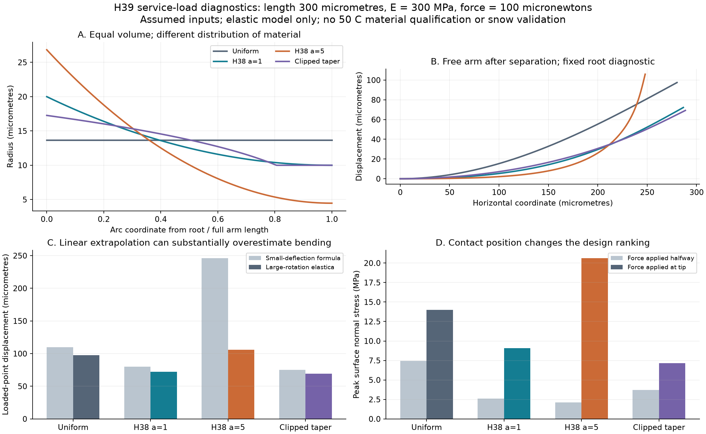
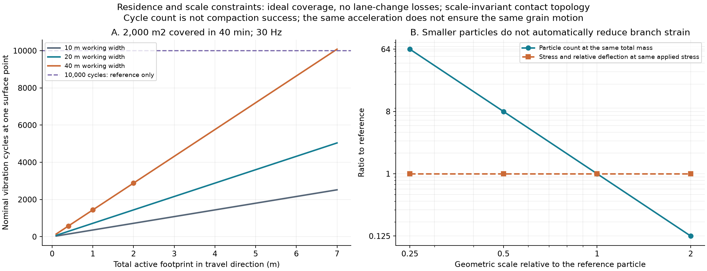

# 多方向探索 第39巡：分断後の枝支持と拘束を切り替える整地

2026-10-09／Codex。参照基点 main a2497f3384170053dc3343e005cf594212be48bd。回覧板・正本v36・Claude自律ループv2、第32・36・38巡を継承。

**今回の改良H39は、製造時に切りやすい骨格と、使用時に曲がり過ぎない枝を分けて設計し、整地装置へ「局部の拘束を変える機構」を加える案である。** 材料を細かくする、枝を長くする、振動を強くする、のいずれも一方向に増やせば目的へ近づくとは限らないことが分かった。粒の製造・滑走時の支持・整地で戻す条件を同じ設計へ接続する。

**物理試験0件、実物成功確率未算定。** 96条件の枝計算、27条件の整地時間、35項目の数値照合を保存した。これらは雪感や安全の合格件数ではなく、成功率90％超の証拠ではない。HBG-5の15〜25％という主観予測から、実測で改善率を得た報告でもない。

## 1. 「枝が残る」と「雪のように切れる」の間にある問題

第38巡は、一括形成した骨格を、膜開孔・枝分断・選別へ分けた。分断位置を中央へ揃えると形態の歩留まりが良くなるという条件を示したが、その粒がスキーの荷重でどう動くかは未確定だった。

今回の一次研究は、形による保持の利点と限界を具体的に示す。

- 六本腕のPP粒を使った実験では、長い腕の集合体で、剪断に伴う硬化と腕の曲がりが観測されている。これは斜面の保持には利用可能な機構だが、短くエッジが抜けることとは別である。ミリ級の六本腕であり、四又微粒の閾値には使わない。[S1](https://doi.org/10.1103/PhysRevE.101.062903)
- 接触数と摩擦を別々の固定値にすると、形状を変えた効果を誤り得る。同じ整地履歴・拘束で接触網まで比べる必要がある。[S2](https://pubs.rsc.org/en/content/articlehtml/2024/sm/d3sm01762a)
- 少量の接着と長い腕の引掛かりを組み合わせた数値研究では、圧縮強度が大きく増幅される。**粒間接点を追加すれば雪らしい解放になる、とは言えない。** 強度と解放後の抵抗をセットで評価する。[S4](https://doi.org/10.1016/j.apt.2025.104780)

したがってH39は、枝の長さ・数・絡みを最大化する案にしない。粒内の耐久性と、粒間が切れて逃げる応答を分ける第32巡の方針を、分断後の粒へ適用する。

## 2. 切れやすくした部分が、使用時の弱い先端になる

第38巡の節点間隔600 µmを中点で分ける理想化では、1本の自由腕は300 µm。製造母材の両端拘束をそのまま使わず、今回は根元を固定し、腕の先端又は途中に横荷重をかける**局部診断**へ変更した。実際の粒の根元が床に固定されるという仮定ではなく、粒全体の回転・支持はまだ別に必要である。

同じ枝体積で4形状を比較した。E=300 MPa、F=100 µNは比較用の仮入力。50℃の完成材料から得た値ではない。

|半径の配分|根元／先端半径|先端荷重の変位：小変形式|大回転を含む変位|大回転モデルの表面最大法線応力|
|---|---:|---:|---:|---:|
|一様な太さ|13.66／13.66 µm|109.62 µm|97.53 µm|13.99 MPa|
|第38巡 a=1|20.00／10.00 µm|80.12 µm|72.23 µm|9.07 MPa|
|第38巡 a=5|26.83／4.47 µm|246.10 µm|105.95 µm|20.62 MPa|
|H39の太さ配分対照|17.27／10.00 µm|75.10 µm|69.24 µm|7.14 MPa|

a=5は、前巡で中央付近へ曲げ応力を寄せる候補だった。分断後はその細さが自由端側に残り、上の仮条件では先端角度が約76.6°となる。小変形式をそのまま使うと変位を大きく読み違える。逆に、大回転で変位が小さく計算されたことを、材料が壊れない証明にはできない。

H39の太さ配分対照は、最小半径10 µm・同じ体積という制約で、先端荷重に対する**小変形のたわみを最小化**した一枝の形。sを根元からの長さ割合とすると、

**r(s)=10 µm × max[1,{5.14848(1−s)}^(1/3)]**

となる。先端側約19.4％は半径10 µm。極端に細い先端へせず、曲げモーメントに合わせて根元側へ材料を配分する。これは全粒の最適設計、製造済みの形、端の安全設計ではない。接続の滑らかな丸み、端キャップ、節点、摩耗余裕を入れると体積・応力が変わるため、この式をそのまま型図にしない。

同じ荷重を腕の中間へ移すと、a=1の応力は約2.62 MPa、H39対照は約3.71 MPaへ逆転する。**どこに力がかかるかを無視して、一つの太さ配分を全面採用できない。** また上表のσ/EはH39対照でも約2.38％、a=5では約6.87％となる。材料の弾性範囲は未測定であり、この領域は粘弾性・塑性・疲労を含めて再評価する。

図は材料中の中心線と仮モデルの応答。雪状の粒が完成した画像でも、50℃で測った曲線でもない。96行は4形状×3弾性率×2接触位置×4荷重である。

## 3. 小さくすれば枝が壊れなくなる、という近道を外す

幾何形状と接触配置が相似で、同じ床の応力を受けるなら、寸法倍率aに対し一粒の力Fはa²、枝長はa、断面二次モーメントはa⁴に比例する。従って大変形を支配するF L²/(E I)と応力は変わらず、変位／枝長も変わらない。

|寸法倍率|同じ応力で一粒にかかる力|枝応力・相対変位|同じ質量を作る粒数|
|---|---:|---:|---:|
|1|1倍|基準|1倍|
|1/2|1/4倍|基準と同じ|8倍|
|1/4|1/16倍|基準と同じ|64倍|

これは接触数・方向・材料が相似である条件式。実粒で同じと判定した結果ではない。一粒の力を一定のまま粒径を動かす計算とも区別する。重力と毛管橋は異なる寸法則になるので、小型化によって濡れの影響まで相対的に減るとは限らない。

費用にも影響する。枝4本の体積和、仮密度1250kg/m³、固定比較量108tという単純な帳簿では、基準粒は約1.23×10¹⁴個。百万粒当たり僅か1円でも計数依存の加工費は約1.23億円、相似に半寸法へすると約9.82億円になる。**実見積りではなく、個別加工を安易に追加しないための費用感度である。** 節点・重複・端キャップを省き、床の充填も未計算なので、108tを新形状に必要な材料量と認定していない。

対策は、各粒の微小部品を一個ずつ加工する工程から、まとめて形成・処理・選別する工程へ寄せること。第38巡の一括骨格と直接分岐粒の両経路を残し、H39形状に近づける加工が、得られる耐久性以上に費用を増やさないかを比較する。基本処理100円/kgという仮枠では、基準粒の計数工程に配れる金額は百万粒当たり約0.088円にしかならない。材料代、捕集、検査、設備費を含めた採算は別に必要である。

## 4. 整地装置を「振動すれば締まる」から変更する

2026年の金属ステープル集合体の研究は、箱内で振動させて絡みを増やす一方、側壁を外した状態の振動で集合体を分解する例を示す。形成と分解では加振条件も違うので、拘束だけの効果量とは読まない。採る原理は、**拘束と振動を一組で調整すること**である。金属針や論文の低摩擦面をスキー材へ採用する趣旨ではない。[S3・著者公開PDF](https://www.colorado.edu/lab/barthelat/sites/default/files/2026-04/JAP2026.pdf)

H39の装置案は、依頼者のレール牽引式へ、閉鎖中だけ使用する可変側板付きの局部処理ヘッドを加えるもの。

~~~mermaid
flowchart LR
 A[前刃で回収・山側へ配材] --> B[外側の回収囲いで逸散を捕集]
 B --> C[内側の側板位置と押圧を調整]
 C --> D[局部の振動で再配置]
 D --> E[後部ローラーとスカートで高さを仕上げ]
 E --> F[支持・解放・密度と残留塊を確認]
 F --> G[装置を格納して営業]
~~~

- 材料を寄せる工程、絡みをほどいて配り直す工程、適度な接続を作る工程で、同じ拘束・加振設定を強制しない。
- 内側の拘束を弱める場合も、外側の回収囲いで飛散・斜面下方への流出を捕集する。側板の角度・押圧・振動を変える実機機構と、粒への効果は未実証。
- 側板は移動装置の一部で、営業中に敷き詰めて粒を支える床ではない。R39の禁止された滑走面へ置き換えない。
- 押し固めた直後だけ高い強度が出ても、機械を離した後の床・エッジ解放・雨後が合わなければ採用しない。

## 5. 60分閉鎖で、一地点には何秒の振動が届くか

比較用に50m×40m=2000m²、閉鎖60分のうち20分を展開・格納・確認、40分を走行に割り当てる。全幅を一回で覆う理想なら速度は約0.0208m/s。振動する部分の進行方向長さl、周波数fに対して、各地点の名目回数は**N=f l/v**。

|全幅40mの仮ヘッドの作用長|一地点の時間|30Hzの名目回数|
|---|---:|---:|
|0.4m|19.2秒|576回|
|1m|48秒|1440回|
|2m|96秒|2880回|

全幅40mの機械が既に成立するという仮定ではない。幅20mなら同じ時間で二列、幅10mなら四列を覆う必要があり、上の回数はそれぞれ半分・四分の一になる。折返し・横移動・加減速・重複・終端の余走も無視した楽観的な計算である。

S3の強度が飽和へ向かう参考履歴の10,000回を、そのまま要求すると、30Hz・全幅40mでも作用長の合計約6.94mが必要になる。0.4mの作用長のままなら、全域の走行だけで約11.6時間。**この10,000回は本素材の必要回数ではない。** 文献の「よく絡む」を、短いローラーで60分以内に実現したことにしないための比較である。

報告振幅2.5mmを片振幅として30Hzへ換算するとピーク加速度は約9.06gになるが、これも採用設定ではない。表面の名目回数と、深さ450mmの粒が受ける変位・衝撃は別。Γという加速度比だけで実験室の束と実斜面が相似になるとはしない。

H39で優先して探すのは、機械を際限なく大きくする案ではなく、短い滞在時間でも必要な再配置が得られる粒形・拘束・押圧の組合せである。名目回数を減らせたように見えても、エッジでの解放が悪化したり、膜・細片が増えるなら採用しない。設備2億円の枠には、可変側板・回収囲い・駆動・保守を追加計上する必要があり、追加費の見積りは未取得。

## 6. バーチャル試験を有利に見せる二つの誤差を除く

**壁が支えた力を粒の結合力にしない。** S1では、外から与えた荷重だけで求めた見掛けの粘着力と、壁の影響を含む局所応力からの評価が一致しない。小型箱だけで合格にせず、壁反力、自由側面、周期境界、試験幅を比較する。H39の側板も整地中の補助であり、営業中の保持力へ加算しない。[S1・公開原稿](https://arxiv.org/pdf/2002.09800)

**球をつないだ枝の数値的な凹凸を、実物の雪状接続にしない。** 半径Rの球列を二次元の円で診断すると、ピッチ／直径η=0.25で外包絡線の最大傾きは約0.258、η=0.05では約0.0501。入力摩擦が小さくても、離散形状による引掛かりが残り得る。これは摩擦係数の予測ではない。

次の粒床DEMでは、外形・質量を保った球ピッチの細分化と、滑らかな枝形状による対照を要求する。本巡で粒床全体のDEMを実行したとはしない。先の96行は一本の枝であり、斜面の安定・滑走抵抗・せん断硬化を直接出すモデルではない。

## 7. H39の比較経路と、雪の要件へつなぐ順序

|経路|今回具体化した変更|採否を分ける点|
|---|---|---|
|H39-P：一括骨格→分断|a=1/a=5を製造側だけで選ばず、分断後の自由腕を比較。先端を極細にしない太さ配分を追加|切断歩留まりと、50℃・湿乾・反復荷重後の粒内破損を同時に満たすか|
|H39-D：直接分岐形成|形成時から使用時の肉厚を狙い、後の個別加工を減らす|丸い有限先端、開口、寸法分布を大量に得られるか。形の精密化費が耐久便益を上回らないか|
|H39-C：短い支持部＋限定した粒間接点|長い腕の絡みだけで支える案と、既出の機械接点・結晶接点を組み合わせる案を並行比較|最大支持力に加え、解放距離、残留抵抗、再形成時間、雨・冬の安定を満たすか|
|H39-G：拘束を変える局部整地|可変側板・回収囲いと局部加振を、既存の牽引・ローラー・スカートへ組み込む|60分・全幅・全深さの処理、装置を離した後の性能、材料回収と追加費|

材料はPHA系、H29系の結晶性PE骨格などを比較のままにし、仮の弾性率に合わせて銘柄を合格扱いしない。常温での噴霧補充という理想も維持する。工場の一括成形が進んだことを、30℃以上の現地で噴霧結晶化が達成されたことにしない。

雪対照との比較は、乾湿50℃の実ソール抵抗、侵入・横支持、ピーク後の解放距離、残留抵抗と振動、5時間荷重・反復整地の後へつなぐ。雪感の許容帯は、目的の新雪圧雪を測って先に固定する。梁の最小たわみだけを合格条件へ格下げしない。

雨後は、回収量・粒径分布・損傷・土砂・カビ・保水重量を分け、再配置だけで戻らない分を工場再生と交換在庫へ計上する。冬は雪との剪断接続、滞水・排水、凍結融解と追加融雪を確認する。比較床450mm、局部掘れ300mm、R39下地は掘れ代＋余裕より下を維持する。

人体・自然環境への無害性は未証明。細い枝と摩耗片、残留物・溶出・飛散・転倒接触を含む証拠が必要であり、生分解性・結晶性・医療用途の呼称では代用しない。油・塩・フッ素・シリコーンの潤滑、現地冷却や強酸に依存しない。年間費用は材料・交換・再製造・回収・整地設備を含め、従来の造雪・圧雪と同じ面積・供用日・費用境界で比較する。

## 8. Claudeへの独立検証依頼

1. 分断後の枝に、実際の粒全体の回転と複数接触を加える。固定根元・先端荷重に都合のよい支持条件がないかを反証する。H39の太さ配分を全粒の最適解にしない。
2. a=1/a=5/太さ配分対照を、同じ50℃物性、同じ粒内材料量、実際の端部と節点で比較する。塑性・クリープ・破損を弾性計算で代替しない。
3. 小型化について、一定の一粒荷重と一定の応力を区別する。接触配置が変わる場合は、その変化を計算してから相似則を外す。
4. 可変拘束・加振・再配置を粒床で比較する。全閉鎖時間を各地点の加振時間にしない。450mmへの作用と、装置を離した後の短い解放を確認する。
5. 側壁反力と、球列近似の数値的な凹凸を監査する。支持が過大になる設定を、素材の結晶接続と呼ばない。
6. v3の新物質・工程の全結果と元コードが公開されたら、H39の形・接点・材料・整地の比較へ入れる。成功確率には実物と対応した根拠を添える。

公開前確認では、基点a2497f3384170053dc3343e005cf594212be48bd以降のClaude更新はない。v3の全結果・元コードは未掲載。GitHubで共有するが、Claudeの受領・同意・物理試験の実施は未確認。

## 9. 再現資料

[一式](使用時の枝変形と整地拘束検証_20261009/README.md)、[入力](使用時の枝変形と整地拘束検証_20261009/inputs.json)、[コード](使用時の枝変形と整地拘束検証_20261009/calculate.py)、[結果](使用時の枝変形と整地拘束検証_20261009/results.json)、[35数値照合](使用時の枝変形と整地拘束検証_20261009/validation.json)、[モデル定義](使用時の枝変形と整地拘束検証_20261009/model.md)、[一次資料](使用時の枝変形と整地拘束検証_20261009/sources.md)。数値表・図生成・依存バージョンを保存。物理試験0件、実物成功確率は未算定のまま。
