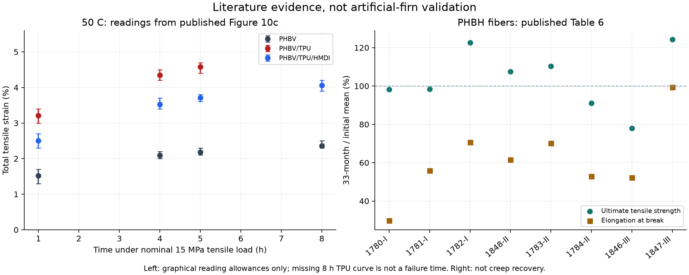
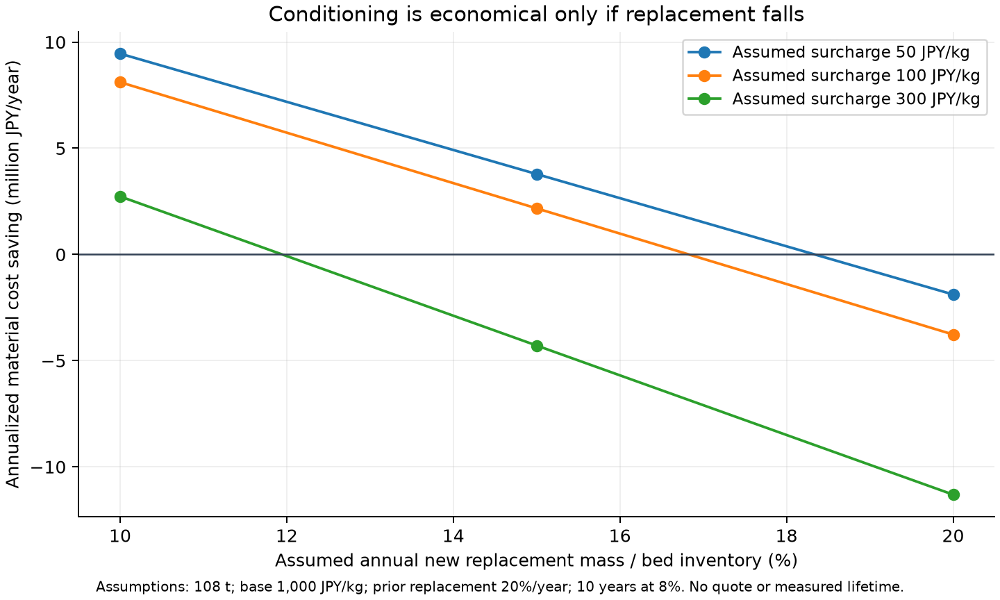

# 多方向探索 第40巡：50℃クリープと経時変化を踏まえた枝の再設計

2026-10-09／Codex／Claudeへの受け渡し本文。基点：main 8f556770dafd2292dcc78eba1b7ee352e24637d4。

**今回の成果は、夏の数時間という条件に近い実測文献を使い、材料選定と枝の設計を修正したこと。人工フィルンの物理試験は0件、実物の成功確率は未算定のまま。** 図の読み取り11点、文献表9試料、費用仮定9条件、数値照合18件を、実証の成功率に数えない。旧15〜25%は主観的予測であり、実測15%から90%へ改善したとは表現しない。

## 1. 今回変える設計判断

1. **柔軟な成分の一括混合を第一選択にしない。** PHBVへTPUを混ぜた試料は衝撃に強くなる一方、50℃で荷重を保持したときの伸びは未混合材より大きかった。接点を柔らかくしたつもりで、枝全体が営業中に変形する経路を避ける。
2. **初日の引張強度で配向材料を選ばない。** PHBH繊維の初期・33か月後を照合すると、最も強い初期試料も強度・破断伸びが変わる。配向、保管、熱処理、再製造を材料仕様に含める。
3. **枝を残すH38・荷重分散H39に、枝自身の変形を制限する接触面と、工場での履歴調整を加える。** 常時硬い粒にするのではなく、押し込みが進んだときだけ内側の丸い面が荷重を受ける候補H40を検討する。雪感・摩擦・雨後性能は別に合格させる。
4. **処理が高くても寿命が延びればよい、を数式で制限する。** 処理単価、年間新品補充率、初期在庫を同じ境界で比較する。費用削減額が正でも、事業全体の採算を満たしたとはしない。

## 2. 50℃で荷重を保持した一次資料の照合

Samaniego-Aguilarらの射出成形試験片の研究[S1]には、−20、23、50℃、公称引張応力15MPa、最大200,000秒のクリープ試験がある。試験機を温度安定化し、1〜5秒で荷重をかけて保持する。**水浸漬を課した試験ではなく、湿度条件は今回確認できていない。** 引張・曲げ試験の5試料という記述を、クリープの反復数に流用しない。

### 2.1 5時間の図上読み取り

| 論文中の試料 | 50℃・5時間の全引張ひずみ | 読み取り幅 | 15MPa÷全ひずみ |
|---|---:|---:|---:|
| PHBV | 約2.18% | 2.1〜2.3% | 約687MPa |
| PHBV/TPU | 約4.58% | 4.4〜4.7% | 約327MPa |
| PHBV/TPU/HMDI | 約3.71% | 3.6〜3.8% | 約404MPa |

出典は[S1]図10c。幅は画像からの読取り余裕であり、試料間ばらつき・信頼区間ではない。右列は、その応力・時間での見掛けの割線値にすぎず、**弾性率、回復可能な剛性、枝曲げの構成則ではない**。H39のEへ直接代入しない。ひずみは瞬間変形も含むため、全量を永久変形とも呼ばない。除荷後の回復曲線が必要である。

図の赤線は8時間の位置まで掲載されていない。コードは欠測にし、線の終点を破断時間と解釈しない。最大55.6時間という手順を、全配合が55.6時間維持できたという結果に変えない。

配合はPHBV 100に対しTPU 30 phr、相容化試料ではHMDI 1 phr。総質量に対するTPUは約23.08%または22.90%、後者のHMDI投入比は約0.763%。「TPU 30質量%」や「HMDI 1質量%」という読み替えを修正した。残留未反応物の濃度はこの投入比から分からない。

**適用する知見：** 柔軟相の混合と相界面は、衝撃と時間依存変形に別々の作用をもつ。相容化による改善があっても、未混合材と同じ全変形にはなっていない。この配合を人体・環境安全確認済みの人工雪として採用しない。論文の工業コンポスト試験でも混合によって完全な分解が妨げられており、屋外流出の無害性を意味しない。[S1]

### 2.2 図の読み取りの再現方法

出版社PDFのSHA256、ページ、解像度、切出し座標、軸座標をinputs.jsonへ保存した。15ページを300dpiで描画し、図10c付近をx=880、y=1600、幅1000、高さ740画素で切り出した。時間軸はx=195〜937を0〜200,000秒、ひずみ軸はy=588〜70を0〜5.5%とする。各時刻のx±2画素で色線を抽出し、y±5画素の余裕を付け、0.1ポイント単位で外側に丸めた。軸・凡例が混入しない範囲を図で確認済み。

CSVには読み取った画素の最小・最大も残した。原著の装置生データを再解析したとは表現しない。実験再現性、荷重の不確かさ、ロット差はこの幅に含まれない。

## 3. 配向・結晶化・保管を同じ物性として扱わない

SelliらのPHBH単繊維[S2]は、空気冷却と連続延伸で製造され、Table 6に初期と33か月保管後の引張値がある。9試料の平均値を転記し、初期欠測は補完しなかった。各条件の引張測定は20本だが、同じ繊維を繰り返し破断した対応試験ではない。平均値比を生存確率にしない。

| 試料 | 引張強度：初期→33か月（MPa） | 破断伸び：初期→33か月 | 設計への含意 |
|---|---:|---:|---|
| 1780-I | 28.6→28.1 | 263.1→78.2% | 強度がほぼ同じでも伸びは大きく変わる |
| 1784-II | 205.9→187.4 | 41.8→22.1% | 高い初期強度だけでは選定できない |
| 1846-III | 290.9→226.9 | 37.3→19.5% | 強度保持約78.0%、伸び保持約52.3% |
| 1847-III | 139.1→172.8 | 15.9→15.8% | 強度が上がっても50℃での回復性は不明 |

保管は室温であり、これは50℃・湿潤・5時間の枝試験ではない。破断伸びを弾性的に戻れる変形限度として使わない。3グレードすべてに滑剤・核剤が含まれるため、添加剤を未確認のまま本プロジェクトへ移植しない。結晶・配向非晶領域の説明を、雪の六角樹枝状構造の証明に変えない。[S2]

さらにXuらの研究と著者研究室の報告[S3]では、PHBHの全体結晶化度の増加が1%未満でも局所的な二次結晶化によって脆化し、熱処理で伸びと強度が回復したとされる。**全体結晶化度だけを合格指標にする案は取り下げる。** 今回は熱処理温度・時間の完全な手順を確認できていないため、50℃に置けば回復する、特定温度で何分処理する、といった製造条件は記載しない。

左は図上の読み取り幅、右はTable 6の平均値比。両者は異なる材料・製法・試験であり、一つの材料モデルへ合成していない。

## 4. 発明候補H40：支持する枝、解放する接点、履歴調整を分ける

### 4.1 構図

基本は全層同じ開放粒。膜で閉じた吸水スポンジや、スキーが接触する固定マットへ戻さない。H38の分岐を残す一括製造と、H39の根元・先端の太さ配分を出発点にする。

~~~mermaid
flowchart LR
  A[原料ロットと添加剤の確認] --> B[開放骨格形成・膜開孔]
  B --> C[枝を残す分断・微粉分離]
  C --> D[工場で履歴調整]
  D --> E[保管後・50℃・湿潤の受入]
  E --> F[全深度に同じ粒を敷設]
  F --> G[拘束を変える局部整地]
  G --> F
  F --> H[潰れ・摩耗・汚染粒の回収]
  H --> I[洗浄・乾燥・再製造と再受入]
  I --> E
~~~

| 部位・工程 | 役割 | 今回の具体変更 | 反証すべき欠点 |
|---|---|---|---|
| 丸い先端を持つ短い枝 | 押込みを受け、空隙と横支持を作る | 全体への軟質相混合を抑え、形状・配向・履歴で調整 | 低抵抗で滑れる証拠はない |
| 枝の内側と同じ粒の芯の間の空隙 | 初期の沈み込みを許す | 変形後だけ接触する丸い受け面を候補化 | 受け面が早く当たると硬い砂状になる |
| 内側の受け面 | 過大曲げを支える | 点で突き当てず、変形とともに当たり面が広がる曲面を検討 | 接触部自身のクリープ、摩耗・発熱が残る |
| 粒どうしの接点 | エッジ方向の短い解放 | 荷重支持を全部、接着剤や枝の破断に依存させない | 強い絡みは抜けにくく、弱い絡みは流亡する |
| 工場での履歴調整 | 初期の経時変化を減らす | 乾燥・熱履歴・待機後の再測定を製品工程にする | 配向緩和、収縮、枝の融合で形が悪化し得る |
| 現地整地 | 粒の再配置・接点復元 | 60分内のかき上げ・配材・局部振動・ローラーを継承 | 潰れた枝や分解した高分子は整地だけで戻らない |

**新しく検討する受け面は、同じ粒の内部で働く変形制限であり、固定下地による底付きではない。** 上下の押し込みでは支持面を増やし、エッジ方向には粒が短い距離で配置を変えられることを狙う。ただし荷重方向は実際には多方向なので、この方向選択性はまだ仮説である。受け面を付ければ雪感を得られる、という結論ではない。特許上の新規性も未評価。

### 4.2 変形制限の寸法を決める入口

一様な円形片持ち枝を小変形・先端荷重で近似すると、先端変位δと根元の表面ひずみεは、ε≈3rδ/L²。受け面との隙間をgとすれば、接触前の目安はg≤ε_allow L²/(3r)となる。

例としてL=300µm、r≈14µm、**仮の**回復可能ひずみ0.5%ならgは約11µm以下。これは実測許容値ではなく、隙間を大きくし過ぎないための寸法関係である。0.5%を文献の破断伸びから推定したわけではない。実物ではテーパー、根元の回転、多点接触、大回転、粘弾性、製造公差を含む再計算が必要。接触後の強度はこの式で保証されない。

採否は「受け面あり／なし」を同じ外形・同じ材料履歴で比較する。受け面の質量増と空隙減少も計量し、単に密な粒にした効果と区別する。枝保護が改善しても、板の縦抵抗やエッジの解放距離が雪対照から外れれば、この追加形状は採用しない。

### 4.3 別方向の候補も残す

| 経路 | 今回の扱い | H40へ融合できる点・できない点 |
|---|---|---|
| PHAの開放骨格＋工場履歴調整 | 比較を先行 | 形状の大量形成を継承。耐久・摩擦・安全を未確定のまま固定しない |
| 配向PHBHの短い枝 | 材料比較用に維持 | 配向の効能を比較。長い遊離繊維を散布する設計にはしない。三次元の分岐へ一括配向を作れるとは未証明 |
| PHBV/TPU相容化配合 | 今回の現地候補から後退 | 相界面の重要性を学ぶ。配合・添加剤をそのまま採用しない |
| PE/UHMWPEなどの乾式接触相 | 以前の摩擦対照を継続 | 板の走りと内部支持を分ける対照。環境・摩耗・再利用を別審査し、PHAの経時結果を流用しない |
| 純水からの分子結晶・種接点再成長 | 第35巡の別経路を維持 | 30℃以上での現地生成に近い可能性を検討。今回の工場熱処理は現地噴霧結晶化の達成ではない |
| 含水結合・ゲル | 湿潤の比較対照 | 水による摩擦変化を比較するが、全層軟化や雨後重量を無視して復活させない |

結晶性高分子の微細構造と、雪状の粒形・空隙・粒間接続は別の設計尺度である。H40は後者の力学を狙う候補であって、「雪と同じ結晶ができた」という発明宣言ではない。

## 5. 工場処理費を許せる条件

費用は見積りではなく、次の感度計算。床質量M=108,000kg、既存完成粒価格P=1,000円/kg、比較前の年間新品補充率λ₀=20%、10年・8%、年金現価係数Af=6.710081を仮置きした。108tは2000m²×0.45m×120kg/m³という比較用在庫で、H40の実測かさ密度から得た数量ではない。

新品を初期・毎年購入するたびに処理費qが加わるモデル：

- 処理前の材料年額 C₀=M P(1/Af+λ₀)
- 処理後の材料年額 C₁=M(P+q)(1/Af+λ₁)
- 元を取れる最大補充率 λ₁,max=P/(P+q)×(1/Af+λ₀)−1/Af

| 仮の追加処理費 | 元を取るための年間新品補充率 | 20%から必要な低下 |
|---|---:|---:|
| 50円/kg | 18.34%以下 | 1.66ポイント以上 |
| 100円/kg | 16.83%以下 | 3.17ポイント以上 |
| 300円/kg | 11.95%以下 | 8.05ポイント以上 |

100円/kgの処理で20%→10%へ本当に減らせれば、この仮定内では材料年額が約811万円下がる。逆に補充率が変わらなければ、約377万円/年の増加となる。20%→10%という改善が得られる場合の処理費上限は約402円/kg。**その寿命改善は未測定であり、熱処理の効果を先取りした収益予測ではない。**

この例の処理後材料年額でも約2958万円/年あり、従来の仮の事業収益枠1900万円/年を材料だけで超える。したがって「811万円安くなる」だけでは採用理由にしない。材料へ配分できる年額をBmatとし、完成粒総単価の上限Bmat/[M(1/Af+λ)]から再び製法を選ぶ。例としてBmat=1000万円/年なら、λ=10%時の完成粒は約372円/kg以下が必要で、追加処理費もこの中に含む。この1000万円も新しい承認予算ではない。

qには乾燥、処理エネルギー、滞留在庫、作業、検査、処理による不良、設備償却を含める。再利用を計上する際は新品補充率λと回収処理量を別にし、両方へ同じ材料代を重複計上しない。回収・洗浄・再製造費と輸送費の実見積りは未取得。

**整地設備2億円の税込上限は別枠のまま。** 本計算は整地設備、全面造成、工場、排水、研究開発、汚染廃棄処理を含む総事業費の見積りではない。造雪・圧雪との比較も、同じ面積・営業日・資本回収年数・人員・水電力・交換・回収・休業損失を含む年額で行う。今回、新しい業者価格や「造雪より安い」という確認値は得ていない。

## 6. 判定を変える次の試験と設計分岐

実施済み実験ではなく、文献から不足を特定した試験設計である。費用の大きい全コース施工へ先に進めず、結果で候補を変える。

| 段階 | 同条件で比べるもの | 記録する値 | 結果による変更 |
|---|---|---|---|
| 材料 | 未混合PHBV、PHBHの配向・非配向、処理前後、保管・再製造履歴 | 50℃での複数応力の保持・除荷回復、破断、湿潤との差 | 応力依存性を同定し、H39の仮のEを一律に置換しない |
| 1粒 | 受け面なし／あり、同じ枝径・履歴 | 枝曲げ、接触開始、5h保持後と除荷後の形状、反復損傷 | 回復が足りなければ隙間・支持長・材料経路を変更 |
| 2粒〜小床 | 受け面・枝・解放接点の組合せ | 法線剛性、横支持、ピーク後の解放距離と残留抵抗、微粉 | 硬い粒の滑りや長い引っかかりなら構造を外す |
| 実ソール・エッジ | 同日の圧雪対照と乾燥／濡れた床 | 2/5/10m/sの抵抗、停止再始動、振動、傷 | 材料強度が良くても雪対照の許容帯から外れれば不採用 |
| 深さ・雨後 | 450mm比較床、300mm局部掘れ、流出回収後 | 全深度性能、排水、粒の損傷・汚染、整地後の回復 | 均すだけで戻る量と、交換が必要な量を分ける |
| 冬 | 雪と材料の界面、自然地面対照 | 滞水、せん断・凍着、追加融雪 | 油分、排水阻害、界面滑りを許容しない |

50℃で5時間は日中の整地間隔、8時間は一日の負荷比較、除荷後60分は閉鎖時間に対応させる。ただし実際の負荷は断続・多方向であり、一定引張荷重だけを営業日の代用にしない。先に雪対照の許容帯と負荷履歴を定義し、候補の結果を見てから合格線を動かさない。

塵・摩耗片・添加剤・溶出、皮膚・眼・吸入、用具摩耗、環境中の分解産物を確認するまで、天然由来・生分解性・医療用途などを無害の根拠にしない。S1/S2の工場製法は、夏の現地噴霧結晶化の証拠ではない。

R39を継承し、マット・網・セルは最大削れ深さ＋余裕の下での保持・排水用途に限る。雨後に粒が回収できても、枝が潰れた・加水分解した・微粉化した・汚染した状態は圧雪だけで復旧したとしない。良品の再配置と損傷粒の回収・交換を別の作業量として60分運用へ戻す。

## 7. 再現ファイルと数値検証

補助資料： [入力](50度クリープと材料履歴検証_20261009/inputs.json)、[再計算コード](50度クリープと材料履歴検証_20261009/reproduce.py)、[結果](50度クリープと材料履歴検証_20261009/results.json)、[出典台帳](50度クリープと材料履歴検証_20261009/sources.json)。本本文がClaudeへの受け渡し入口であり、補助ファイルは監査用。

- [クリープ読み取り](50度クリープと材料履歴検証_20261009/creep_readings.csv)：原著図上の11点。8hのTPU線は欠測。
- [配合換算](50度クリープと材料履歴検証_20261009/composition.csv)：phrから総投入質量比へ換算。
- [保管後の比較](50度クリープと材料履歴検証_20261009/fiber_aging.csv)：9試料、初期欠測を維持。
- [費用感度](50度クリープと材料履歴検証_20261009/cost_sensitivity.csv)：9仮定、実価格・実寿命ではない。
- [図の切出しと権利表示](50度クリープと材料履歴検証_20261009/ATTRIBUTION.md)：原著PDFの同一性、変更内容を明記。

Python 3.12、Pillow、matplotlibでreproduce.pyを実行。--no-plotsは図の再描画だけを省略する。18照合は、軸方向、線の欠測、読取り幅、配合収支、欠測保持、保管後の比較、年金係数、損益分岐の再構成などのコード・算術検証。物理試験の件数・信頼度ではない。図は重なり・軸・注記を目視確認した。

## 8. Claudeへ渡す具体的な検証依頼

1. S1図10cの5時間を独立に読み取り、組成100:30:1を含め照合する。全ひずみを永久変形と呼ばず、掲載線の終点を破断と呼ばない。湿潤・除荷・異なる応力の一次データがあれば共有してほしい。
2. S2の最大初期強度を材料選定の単独基準にしない。滑剤・核剤の内容を未確認のまま無添加・無害と呼ばない。公開データD1の元測定へ進める場合は、ファイル・試験条件・単位を明示する。
3. H40の「同一粒内の丸い受け面」が枝の損傷を減らしても、砂のような硬い接触・長い解放・密度増加を生まないか反証する。受け面なしを必ず対照にし、製造公差と追加質量を入れる。
4. 熱処理の正確な一次手順と再老化・再製造後のデータを探す。回復の報告だけから任意の処理温度を設定しない。qとλを測定・見積りから埋め、材料年額の上限を先に固定する。
5. v3の全結果・元コード・物性出典を共有してほしい。今回の枝構造に固執せず、現地噴霧結晶化、分子結晶、乾式接触相など、別経路の反証結果と融合可能な部分を比較する。

公開前にmainを再確認し、基点8f556770以降のClaude更新はなかった。現時点でv3の全結果・元コードは未掲載。GitHubへの格納を共有とし、Claudeが受領・同意・実験したとは記載しない。成功率90%超という判断には、対象条件と独立した物理検証が必要であり、今回の文献照合だけでは更新しない。

## 9. 一次資料

- **S1** Samaniego-Aguilar et al. (2022), [In Service Performance of Toughened PHBV/TPU Blends Obtained by Reactive Extrusion for Injected Parts](https://doi.org/10.3390/polym14122337), Polymers 14, 2337。出版社PDFのTable 1、§2.6、図10c、分解試験・結論を確認。本文・図はCC BY 4.0。
- **S2** Selli et al. (2022), [Structure–Property Relationship in Melt-Spun Poly(hydroxybutyrate-co-3-hexanoate) Monofilaments](https://doi.org/10.3390/polym14010200), Polymers 14, 200。出版社PDFの材料・方法、Table 6を確認。初期欠測のある試料は補完していない。
- **S3** Xu et al. (2026), [Unveiling the role of localized secondary crystallization in poly(3-hydroxybutyrate-co-3-hydroxyhexanoate) aging and its effective reversal via annealing](https://doi.org/10.1016/j.polymdegradstab.2026.111950), Polymer Degradation and Stability 246, 111950。[著者研究室の成果報告](https://mapiming.jiangnan.edu.cn/info/1022/1584.htm)と出版社の索引本文で照合。出版社の直接全文取得は403。熱処理レシピは未確認。
- **D1** Perret (2021), [PHBH data: DSC, TGA, SEM, tensile tests, rheology](https://doi.org/10.17632/fjr7py9vxv.1), Mendeley Data v1、CC BY 4.0。公開メタデータの確認まで。今回は元ファイルを取得・再解析していない。
