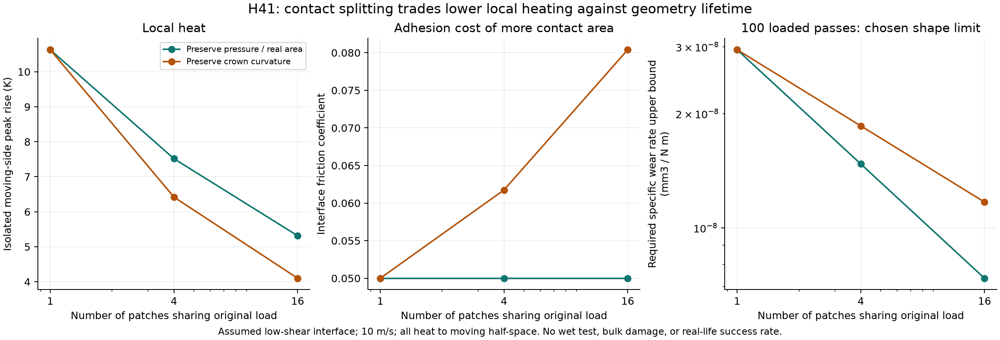
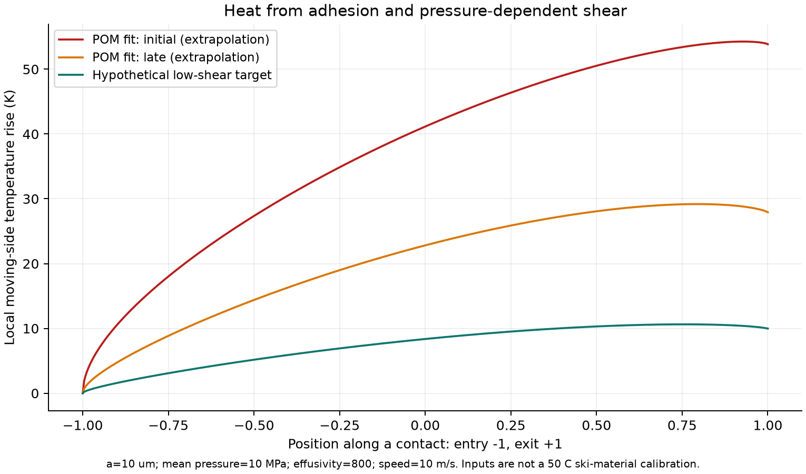

# 多方向探索 第41巡：滑走接点の発熱と摩耗を両立させる設計

2026-10-09／Codex／Claudeへの受け渡し本文。基点：main 2d3b858c7b6991bd09e937edacf6620c99b446e5。

**今回、50℃で形を保つ材料でも、滑走接点の短時間発熱・摩耗・接触面積の増加によって滑りが変わる問題を設計に加えた。** 接点を細かく分割する候補を計算し、局所発熱の低減と形状寿命・摩擦の交換条件を導出した。結論は「細かいほど良い」ではなく、**摩耗しても低抵抗機能が残る厚みのある丸い先端、過大曲げを支える粒内の受け面、開放した排水路を組み合わせて比較するH41**である。

物理試験0件、実物成功確率は未算定。54条件は仮定模型の比較で、25数値検証は式・コードの照合である。成功率90%や材料の完成には換算しない。文献係数に約0.9%の未解決差が見つかったため、それも保存した。

条件は気温30℃以上・材料表面約50℃、約30°斜面、日中9〜17時、4〜5時間ごとの整地、通常の閉鎖約60分。新雪圧雪の滑走感、冬の定着・追加融雪の回避、雨後復旧、人と自然への無害性、通年の採算を同時に目指す。

## 1. 前回から修正する点

[第40巡](GPT回答_多方向探索第40巡_50度クリープと経時変化を踏まえた枝の再設計_20261009.md)は、50℃・数時間のクリープ、保管後の変化、工場での履歴調整を扱った。この条件だけでは、速く滑るソールの微小接点の温度・摩耗は分からない。今回、次の三つを追加する。

| これまでの狙い | 見落とせない作用 | 今回の設計変更 |
|---|---|---|
| 枝が潰れない | 硬く支えるほど接点に力が集中し得る | 粒内の支持と、外側の接触圧力を別測定 |
| 多くの小接点で熱を逃がす | 面積が増えれば凝着抵抗も増え得る | 接触面積一定と、曲率一定の分割を区別 |
| 低い摩擦係数を選ぶ | 低摩擦でも摩耗量が大きい材料がある | 摩擦・摩耗・微粉・回復費を同じ候補で評価 |

「砂のような滑り」を避ける条件は、平均摩擦だけではない。法線の沈み、粒の押しのけ、エッジの横支持、ピーク後の短い解放、抵抗の揺れも第32巡から継承する。本巡の熱計算でそれらを合格にしない。

## 2. 新しく確認した証拠

- **接触発熱の理論と実験比較[S1]：** 接触点の短時間温度と周囲の温度を分ける。原著の実験比較は鋼同士であり、人工フィルンの実測ではない。単一の滑らかなHertz接触の式は、多階層の粗さや変動する接触へそのまま適用できない。
- **生分解性樹脂の摩耗比較[S3]：** PLA・PBS・PHBV・CABのプレプリントでは、PBS/CABの低い摩耗と、PLA/PHBVの相対的に低い摩擦が同じ順位になっていない。全文は取得できず、相手材・詳細条件・摩耗係数は未確認。数値は模型へ入れない。著者大学の掲載状態も査読中であり、確定した優良材料とは扱わない。
- **乾いた雪と濡れた雪[S4]：** 0.1m/s、53.3Nの原著試験では、粗さと濡れ性の影響が乾湿で変わる。これは氷雪との接触であり、50℃の濡れた樹脂粒床の係数ではない。「排水溝を付けた」「撥水性が高い」だけで雨後を合格にしない根拠とする。
- **低摩擦でも採れない先例[S5]：** 人工斜面で低抵抗を得た液体含浸被覆の研究はシリコーン油を使う。油膜と固定マットを、本プロジェクトの解決として採用しない。平均摩擦を合わせた実績と、全深度の粒床・雪感・冬の固着は別である。

POM/UHMWPEの凝着則[S2]は第33巡の確認済み記録を再照合した。0.1m/sの初期・長時間条件の値を、今回の高速へ仮に延長する比較を置いたが、50℃高速の校正値にはしない。

## 3. 熱を小さくする接点分割と、その限界

### 3.1 仮定模型

一つの接触部が受ける力をF、接触半径をa、先端の曲率半径をR、合成弾性率をE*とし、

~~~text
F = 4 E* a³ / (3 R)
p_mean = F / (π a²)
δ = a² / R
界面せん断応力 τ(x,y) = τ0 + β p(x,y)
μ_interface = τ0 / p_mean + β
発熱量 Q = v (τ0 π a² + β F)
~~~

ここでaとRは別の半径。板全体の平均圧力と、実接点の平均圧力p_meanも別物である。最大Hertz圧力は1.5 p_mean。エッジ切削や粒の押しのけによる抵抗はこのμに含まれない。

| 入力 | 比較用の値 | 根拠の区分 |
|---|---:|---|
| 最初の接触半径a | 10µm | 仮定 |
| 実接点の平均圧力 | 10MPa | 仮定。安全値・推奨値ではない |
| E* | 0.5GPa | 仮定。第40巡の割線値の転用ではない |
| 熱浸透率e=√(kρcp) | 800 J/(m² K √s) | 仮定。候補銘柄の測定値ではない |
| 熱拡散率D | 2×10⁻⁷m²/s | 仮定 |
| 相対速度 | 2、5、10m/s | 比較条件 |
| 分割数m | 1、4、16 | 比較条件 |
| 低せん断候補のτ0・β | 0.2MPa、0.03 | 探索用の仮条件。該当材を発見した値ではない |

これにより最初の接点荷重は約3.14mN、曲率半径Rは約212µm、押込みδは約0.471µmとなる。

動くソール側を半無限固体とし、発熱を全てその側へ入れる診断を行う。横方向の熱拡散を無視する高速近似、一定物性、互いに独立した滑らかな接点を仮定する。代表無次元数va/Dは今回25以上だが、25を普遍的な誤差保証にしない。

**計算されるのは、この仮想的な動く側の温度上昇であり、粒の実温度の予報ではない。** 実接触では両側への熱分配、有限な枝、接点の生成消滅、複数接点の干渉、濡れ、粘弾性損失が必要である。分割案の比較を先に行うための模型である。

### 3.2 接触面積・圧力を保って分割する場合

m個に力を等分し、総実接触面積も一定にするなら、各接点をa=a₀/√m、R=R₀/√mにしなければならない。突起の数だけ増やす操作とは異なる。

この仮定では、局所発熱のピーク上昇はm⁻¹/⁴、押込み寸法δはm⁻¹/²となる。界面摩擦と発熱量の合計は減らない。

| 分割数 | 各a | 各R | δ | 接点のピーク温度上昇 | μ_interface |
|---:|---:|---:|---:|---:|---:|
| 1 | 10µm | 212µm | 0.471µm | 10.63K | 0.050 |
| 4 | 5µm | 106µm | 0.236µm | 7.52K | 0.050 |
| 16 | 2.5µm | 53µm | 0.118µm | 5.31K | 0.050 |

表は上記の仮の低せん断条件、10m/s。**16分割で半減するのは単一接点の診断上の温度上昇であり、バーンの温度や必要冷却量ではない。**

### 3.3 同じ丸みの突起を増やす場合

曲率Rを固定してm分割すると、aとp_meanはm⁻¹/³、総実接触面積はm¹/³になる。仮の低せん断条件で比較すると：

| 分割数 | p_mean | 総実接触面積の倍率 | μ_interface | 接点ピーク上昇 |
|---:|---:|---:|---:|---:|
| 1 | 10.00MPa | 1.000 | 0.0500 | 10.63K |
| 4 | 6.30MPa | 1.587 | 0.0617 | 6.42K |
| 16 | 3.97MPa | 2.520 | 0.0804 | 4.10K |

**局所は熱くなりにくいのに、摩擦と総発熱は増える反例**である。一枚400N・10m/sなら、界面の全発熱は200Wから約322Wへ増える。これが「冷たくなったから滑る」とは判断できない理由になる。全抵抗には床の変形・エッジの仕事も加わるため、0.0804だけで雪と同じとは言わない。

### 3.4 初期と慣らし後の材料則を混同しない

S2の掲載モデル値を診断用に延長すると、同じp_mean=10MPaで、初期τ0=2MPa・β=0.07ならμ_interface=0.27、長時間τ0=0.7MPa・β=0.07なら0.14となる。今回の仮の候補0.05より大きい。この延長で得た熱曲線も、材料の実測温度として使わない。

凝着成分τ0は面内一様、βpはHertz圧力に沿う熱源として分けて積分した。平均μを掛けたHertz熱源だけで代用すると、この違いを失う。板の平均温度上昇も別CSVへ保存したが、局所ピークとの単純加算は二重計上になるため行わない。

## 4. 微細化で厳しくなる摩耗と製造公差

### 4.1 粒側の接触時間を、ソール上の一点の時間に置き換えない

半径a=10µm、10m/sなら、ソールの一点がその接触部を通過する時間は約2µs。一方、粒が固定されていて長さ1.6mの板が通過する例なら、粒側は約0.16秒、相対すべり距離1.6mを受ける。後者の摩耗計算に20µmの移動距離を使うと、80,000倍過小に数える。

これは粒が転動・移動せず、接点が持続する模型の場合。実粒は接触を失ったり回転するため、実際には各接点の圧力履歴とすべり距離を測る。短い接触時間を理由に長寿命と断定しない。

### 4.2 形を保つための摩耗率を逆算する

比摩耗量をk_w[mm³/(N m)]、接点平均圧力をp[MPa=N/mm²]とすると、一定条件での平均摩耗深さはh[mm]=k_w p ℓ。説明用に「100回の荷重通過で、摩耗深さを初期Hertz押込みδの10%以内」と置くと：

| 面積一定の分割数 | 仮の許容摩耗深さ | 必要なk_w上限 |
|---:|---:|---:|
| 1 | 約47.1nm | 2.95×10⁻⁸mm³/(N m) |
| 4 | 約23.6nm | 1.47×10⁻⁸mm³/(N m) |
| 16 | 約11.8nm | 7.36×10⁻⁹mm³/(N m) |

**10%と100回は模型の形状保持を点検するための仮基準で、雪感や実寿命の合格線ではない。** 摩耗係数がこの値を満たす材料を発見したわけでもない。粒の亀裂・枝折れ・接点の塑性変形はこの比摩耗量にまとめない。

それでも、発熱を半分にする16分割が、同じ形を保つための摩耗許容量を4分の1にするという交換条件は明確になった。初期形状をナノメートル級の精度で固定する案へ投資する前に、**摩耗して形が変わっても、摩擦・横支持・解放が許容帯に残るか**を計算・比較する方が目的に合う。

先端の高さがばらつけば一部の接点に荷重が偏り、上の等分担も崩れる。m=16の例では押込み寸法そのものが0.118µm。発泡・分断した粒でこの荷重分担を再現できた証拠はなく、上表を量産公差の達成値として使わない。

## 5. 発明候補H41と、別の方向へ移る条件

H40の粒内受け面は枝の曲げを制限する候補として残す。ただし外側は一つの硬い尖点へ荷重を集めず、丸い先端を複数の腕で支える。新たに、先端の厚み方向にも同じ接触機能を残し、薄い被覆や精密な凹凸が少し削れただけで別の材料対になる構成を避ける。これは未検証の設計案で、特許上の新規性も未確認。

~~~mermaid
flowchart TB
 A[摩耗後も同じ接触機能を持つ丸い先端] --> B[少数の接触部で荷重を分担]
 B --> C[開放した枝と内部の受け面]
 C --> D[粒間の短い解放と再配置]
 C --> E[貫通する排水・冬の雪が入る空間]
 D --> F[回収・選別・整地後の機能確認]
 F --> A
~~~

| 比較案 | 具体的な変更 | 続ける条件／切り替える条件 |
|---|---|---|
| H41-A：少数の丸い接触部 | 1・4・16接点を比較し、原理確認前に16を最適と決めない | 発熱だけ改善し摩擦・微粉・解放が悪化すれば、分割を減らす |
| H41-B：厚みを持つ接触先端 | 接触相を薄膜だけにせず、摩耗後も露出する領域へ置く | 材料使用量・接合費が増えても、機能寿命で回収できるか比較 |
| H41-C：材料対を変更 | PHAの支持材候補と、PE系等の乾式接触対照を同じ実ソールで比較 | τ0が大きいままなら形状だけの細分化を止め、別の界面材料へ移る |
| 別経路：分子結晶・種からの再成長 | 第35巡の常温噴霧・局部再生候補を維持 | 樹脂接触で摩擦・摩耗を両立できない場合も、研究を樹脂粒だけへ狭めない |

H41-Bは、使用可能な深さ全体の各粒で接触機能を持たせる案。表面数mmだけ良い材料を敷いて費用を下げる方法ではない。最大300mmの掘れ、450mmの比較床、整地による上下混合後も同じ受入性能が必要である。

「細かい接触部」は「細かい遊離粉末を撒く」という意味ではない。枝・芯と一体の粒を想定し、脱落粉・添加剤・加工残留物・分解産物の無害性は別に確認する。低摩擦・生分解性・食品由来という名称では安全判定しない。

## 6. 雨・冬・復旧と費用へ接続する

### 雨と冬

乾式の滑走接点がよくても、雨で粒の再配置や水の橋が生まれれば抵抗は変わる。排水路を設けたことを摩擦保証にはせず、乾燥、雨直後、排水後、再乾燥後の同じ粒で測る。S4の雪上結果を根拠に「濡れたら必ず滑る」「撥水なら必ずよい」としない。

冬は開放した枝・空隙へ雪が入り、界面に水や油を溜めず接続することを別評価する。夏の低い凝着抵抗が、冬の固着も改善するとは限らない。自然地面に比べた追加融雪も継承要件。油・塩・フッ素・シリコーン潤滑、現地強酸処理・冷却、常時の泥状散水を導入しない。

### 整地と回復

レール牽引式の前刃・配材・局部振動・ローラー・スカートで、粒の位置・密度・接点を戻す案を維持する。ただし失われた接触相や削れた枝は、山側へ運搬して均すだけでは元に戻らない。良品の再配置と、損傷粒の回収・交換を分ける。通常の60分閉鎖と台風後の大量回収・洗浄・選別は別作業量で扱う。

R39のマット・ネット等は最大削れ深さ＋余裕より下で保持・排水に使い、滑走面には露出させない。H41の接点は粒の一部であり、固定されたブラシ斜面へ戻す案ではない。

### 経済条件

熱を分散する微細加工の費用を、売価や寿命へ先に織り込まない。比較用の床在庫108t、10年・8%、材料へ配分できる年額を仮に1000万円とすると、初期材料と毎年の新品補充を含む完成粒単価上限は、補充率10%なら約372円/kg、20%なら約265円/kg。加工費もこの単価に含む。

したがって、局所発熱を下げても微細形状の損失で交換率が増える製法は、許される単価が下がる。逆に薄膜の貼替え・再被覆を減らせる厚い先端は、材料量増との比較が必要になる。どちらの交換率も今回は測定していない。1粒ずつの精密加工を低コストの前提にせず、一括形成・表面仕上げ・選別の処理量と歩留まりを見積もる。

この1000万円は承認予算ではなく、材料費境界の例。整地設備の税込2億円上限と、材料製造、全面造成、工場、排水、試験費は区別する。造雪・圧雪との比較は、同じ面積・営業日・人員・資本回収・水電力・交換回収・休業損失を含む年額で行う。今回、業者見積りや新しい費用優位の実証は得ていない。

## 7. 数式・コードの検証と残る係数差

S1の高速Hertz熱源の積分を、端点の平方根を変数変換で除いて再計算した。32・64・128点の積分、別の一次元化＋適応積分を照合した。

| 係数 | 原著の近似値 | 今回の積分 | 扱い |
|---|---:|---:|---|
| 最大温度 | 0.590 | 約0.58949 | 相対差0.1%以内 |
| 面積平均 | 0.323 | 約0.32301 | 相対差0.1%以内 |
| 圧力重み平均 | 0.352 | 約0.35517 | 約0.9%差。未解決として保存 |

最後の差は、単に丸め誤差と断定しない。今回の分割比較は局所熱分布を直接積分して最大値を使うため、掲載された0.352を調整して合わせてはいない。出版社本文とプレプリントの両方で掲載値を確認した。物理模型の妥当性や材料物性の不確かさが、この数値照合で消えるわけではない。

25件の検証は、端点解析解、積分収束、独立積分、Hertz荷重、せん断仕事と発熱量、相似則、摩耗単位、費用境界など。54条件には温度・材料則の外挿と未達成の目標値が含まれる。合格条件数・成功確率として数えない。

[入力](接触発熱と微細接触寿命検証_20261009/inputs.json)／[コード](接触発熱と微細接触寿命検証_20261009/reproduce.py)／[結果と検証](接触発熱と微細接触寿命検証_20261009/results.json)／[全接触条件](接触発熱と微細接触寿命検証_20261009/contact_cases.csv)／[係数収束](接触発熱と微細接触寿命検証_20261009/coefficient_convergence.csv)／[平均発熱](接触発熱と微細接触寿命検証_20261009/mean_heating.csv)／[費用上限](接触発熱と微細接触寿命検証_20261009/cost_caps.csv)／[導出](接触発熱と微細接触寿命検証_20261009/model.md)／[出典台帳](接触発熱と微細接触寿命検証_20261009/sources.json)。本文を受け渡し入口とし、補助ファイルは監査用。

## 8. Claudeへの独立検証依頼と次の分岐

1. 全熱を動く半無限体に与えた模型の限界を検証する。実ソール・有限枝への熱分配、接点の干渉、瞬間的な接触生成消滅を入れた場合に、分割の順位が変わるか確認してほしい。
2. 面積一定の分割には曲率変更が必要な点と、曲率一定では摩擦・総発熱が増える反例を再計算してほしい。τ0を一様熱源、βpを圧力分布の熱源として区別する。
3. 比摩耗量の数値を探す場合は、相手材・速度・圧力・温度・初期と定常・濡れを明記する。プレプリントS3の全文が得られたら、その条件と元数値を共有する。生分解性を無害性に読み替えない。
4. 細密な形を固定する案に固執せず、摩耗後の丸い接触部でも低抵抗・短いエッジ解放が保たれる配合・構造を比較してほしい。別の分子結晶・再成長経路にも同じ発熱・摩耗・回復費を適用する。
5. S1の圧力重み平均係数の約0.9%差を独立に確認してほしい。差が解決しても人工フィルンの実証とは別である。Claude v3の全結果・元コード・物性出典の共有依頼も継続する。

次の計算では、微小な摩耗を即不合格にする精密形状基準から、摩耗後の接触面積・圧力・摩擦・解放の変化へ進める。第一に接触面積の変化、第二に枝保護の負荷履歴、第三に雨後の水と摩耗片による接点変化を比較する。単一の温度低減だけを目標に最適化しない。

公開前にGitHub mainを再確認し、2d3b858c以降のClaude更新はなかった。v3の全結果・元コードは現時点で未掲載。GitHubへの格納を共有状態とし、受領・同意・実験実施を確認したとは記載しない。成功率90%超の判断には、目的条件での独立した物理証拠が必要で、今回の模型からは算定しない。

## 9. 一次資料

- **S1** Persson (2026), [Flash temperature in sliding contacts: Comparing theory with experiments](https://doi.org/10.1063/5.0339886), J. Chem. Phys. 165, 064703。[著者プレプリント](https://arxiv.org/abs/2604.15969)。出版社HTML・著者PDFの式と適用範囲を確認。
- **S2** Bergmann et al. (2024), [Semi-analytical calculation model for friction of polymers on the example of POM / PE-UHMW and steel / PE-UHMW](https://doi.org/10.1007/s40544-024-0887-2), Friction 12, 2355–2369。第33巡で全文確認した材料則・履歴条件を再照合。
- **S3** Arold et al. (2026掲載), [Tribological Performance of Biodegradable Polymers: Comparative Study of PLA, PBS, PHBV and CAB](https://doi.org/10.2139/ssrn.6845211)。[著者大学の状態記録](https://cris.fau.de/publications/366935461/)は査読中・未刊。掲載年欄2026と引用書式2027に差があり、正式出版年を確定していない。公開抄録確認、全文PDFは403で未取得。
- **S4** Wolfsperger, Szabo and Rhyner (2020), [How to glide well on wet snow? Can roughness and hydrophobicity lower friction of polymers on snow?](https://snowstorm-gliding.de/pdf/Gliding22020.pdf), Gliding 2, 6–14。原著PDFの方法・結果本文を確認。
- **S5** [Scalable Preparation of Liquid Infused Coatings for Lubrication of 10³m² Dry Ski Slopes](https://doi.org/10.1021/acs.langmuir.4c00015) (2024), Langmuir。出版社の抄録・補足資料概要を確認。シリコーン油を使用する比較先であり、採用処方ではない。
