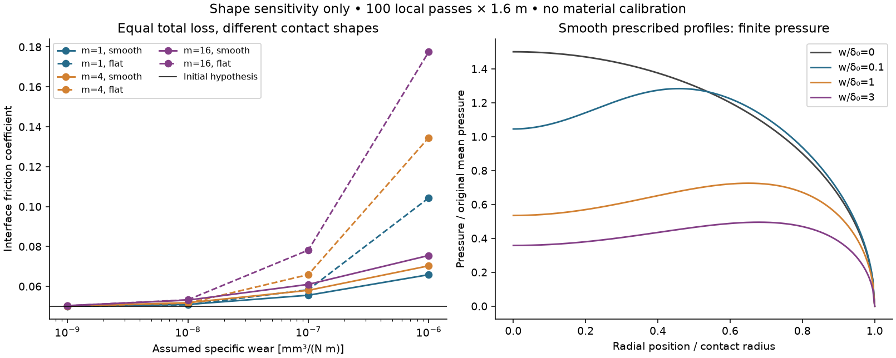
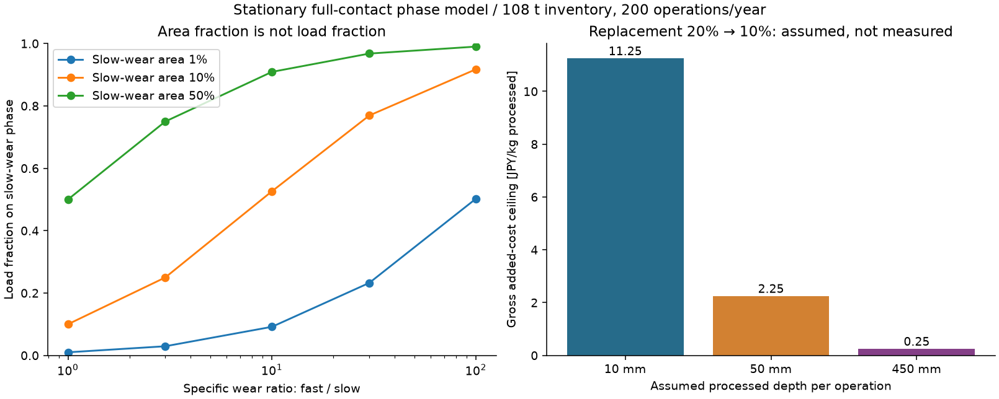

# 多方向探索 第42巡：摩耗後も滑りを保つ先端と接触相の配置

2026-10-09／Codex／Claudeへの受け渡し本文。基点：main bd5e0c8852b7a6190a02e2620a9554a90d30950d。

**今回の前進は、微細形状を固定する設計から、削れた後の接触面積・圧力・材料の露出を管理する設計へ変更したこと。** 同じ体積を失っても削れ方で摩擦が変わり、摩耗しにくい成分を混ぜるだけでは、その成分へ荷重が集中する条件を確認した。これを踏まえて、**接触面の厚み方向にも同じ機能を残し、補強相を内側へ置き、鋭い摩耗縁を作りにくい先端H42**を比較候補とする。

物理試験0件、実物成功確率未算定。今回の30接触条件、25混合相条件、9再配置条件、24数値照合は材料の実証ではない。特に、滑らかな摩耗形は与えた比較形で、実際にその形へ摩耗した結果ではない。成功率90%超や寿命向上を達成したとはしない。

## 1. 目的と今回の位置

気温30℃以上・材料表面約50℃、約30°斜面で、新雪圧雪の沈み、板の走り、エッジの横支持と短い解放、振動を再現する。砂状・泥状・露出した人工芝にはしない。日中9〜17時、4〜5時間ごとの整地、通常閉鎖約60分、最大300mmの局所削れ・450mmの比較床・使用深度全体の同一性能を維持する。

冬の天然雪との固着・界面排水・自然地面に対する追加融雪の回避、人と自然への無害性、雨・台風後の回復と採算も同時要件。油・塩・フッ素・シリコーン潤滑、現地強酸処理・冷却、常時のべしゃべしゃな散水は用いない。R39のネット・マット等は削れ深さ＋余裕より下の保持・排水下地に限り、滑走面へ露出させない。

[第41巡](GPT回答_多方向探索第41巡_滑走接点の発熱と摩耗を両立させる設計_20261009.md)では、16分割による局所発熱低減と、細かい形状を保つ摩耗許容の厳しさを扱った。その「100回で初期押込みの10%以内」は形状固定の仮基準だった。今回はその線を合否基準にせず、**形が変わった後にどの機能が変わるか**へ進む。

## 2. 新たに確認した証拠

| 一次資料・理論資料 | 確認できたこと | 今回の使い方 |
|---|---|---|
| S1：軸対称接触の解 | 先端が平らになるとHertz球面の式では足りず、鋭い接続部に圧力の特異性が生じる | 摩耗前の接触半径を固定せず、形状ごとに荷重から解き直す |
| S2：異なる摩耗率の環状二相モデル | 同じ速度で後退する定常形では、比摩耗量×圧力が相間で揃う | 摩耗しにくい成分への荷重集中を独立計算。定常形を摩耗停止としない |
| S3：UHMWPEの多方向摩擦実験 | 同じ材料でも、直線と方向の変わる経路で摩擦が異なる | 整地で向きを変えることを、無条件の表面再生としない |
| S4：圧力依存の高分子摩擦則 | 接触面積と荷重に比例する成分を分ける枠組み | τ=τ0+βpを使用。今回の係数は仮定で、S4の測定値ではない |

S3はUHMWPE対研磨CoCr、平均速度0.0508m/sの研究。表2では乾式の直線0.118、複雑なchirp経路0.270、水潤滑では0.034と0.047。これは**実ソール・50℃・雪状粒床の値ではない**。本文・表で温度の記載に差があり、各行の温度は確定しない。摩擦の比を摩耗率の比へ読み替えず、今回の材料係数にも入れていない。

## 3. 同じ量が削れても、接触抵抗は同じにならない

### 3.1 二つの形を比較

最初の先端を丸い放物面とし、次を比べる。

1. **平らな切頭形**：先端が平らに削れ、元の曲面と鋭く接続する。
2. **滑らかな除去形**：中心で多く、周囲へ連続的に少なく削れる形。今回定義した仮想形で、自己研磨を実証したものではない。

同じ除去体積Vで比較する。曲率半径R、中心摩耗深さwなら、前者はV=πRw²、後者はV=2πRw²。軸対称弾性接触を解き直し、接触面積Aから μ_interface=β+τ0 A/F を求める。式と独立照合は[導出](摩耗形状と接触相配置検証_20261009/model.md)に記載した。

| 仮入力 | 値 |
|---|---:|
| 初期接触半径 | 10µm |
| 初期の実接点平均圧力 | 10MPa |
| 合成弾性率 | 0.5GPa |
| 計算から決まる曲率半径 | 約212µm |
| 界面の仮係数 | τ0=0.2MPa、β=0.03 |
| 比摩耗量の感度 | 0、10⁻⁹〜10⁻⁶mm³/(N m) |
| 接点を固定した仮の滑走距離 | 100回×1.6m=160m |

板の一点が微小接点を通過する距離と、粒が板の下で受ける距離は異なるため、前巡の区別を継承した。表の物性・摩耗量は未測定。非凝着の法線接触、線形弾性、小傾斜、半無限体、一定荷重を仮定し、実粒の有限厚さ・回転・50℃クリープ・雨水は解いていない。

### 3.2 分割した先端は、同じ総摩耗量でも機能が変わりやすい

前巡の「総面積一定」の分割、すなわち荷重を1/m、初期接触半径と曲率半径を1/√mにする条件を比較する。比摩耗量10⁻⁷、滑らかな除去形の場合：

| 接点数m | 総接触面積／初期 | 平均圧力 | μ_interface | 接点単体の増分剛性／初期 |
|---:|---:|---:|---:|---:|
| 1 | 1.278 | 7.82MPa | 0.0556 | 1.131 |
| 4 | 1.400 | 7.14MPa | 0.0580 | 1.183 |
| 16 | 1.550 | 6.45MPa | 0.0610 | 1.245 |

初期μは全て0.050。**全接点で失う体積の合計は同じ**だが、細かい接点ほど面積の増え方が大きい。圧力低減と摩擦低減は同義ではない。

剛性比は接点単体のK=2E*aからの値で、粒床の硬さやエッジ支持の向上ではない。支持枝・粒間接続・押しのけを含めなければ、雪を切る感触は判定できない。局所発熱は非Hertz形状で再計算が必要なので、前巡の熱曲線をそのまま流用していない。

### 3.3 摩擦が増えてよい範囲から逆算する

説明用に、初期0.050から0.070への変化を診断境界とする。雪の合格値ではない。100回の仮通過でこの境界に達する比摩耗量は：

| 接点数 | 平らな切頭形 | 滑らかな除去形 |
|---:|---:|---:|
| 1 | 2.61×10⁻⁷ | 1.92×10⁻⁶ |
| 4 | 1.31×10⁻⁷ | 9.58×10⁻⁷ |
| 16 | 6.54×10⁻⁸ | 4.79×10⁻⁷ |

単位はmm³/(N m)。この約7.3倍の差は**二つの仮想的な削れ方の感度**で、H42材料の寿命向上率ではない。現物がどちらの形になるか、別のえぐれ・剥離・微粉化になるかは未確認である。

平らな形の鋭い周縁には理想解で圧力の特異性がある。平均圧力が低いことを無傷の証明にしない。滑らかな形では有限の圧力分布が得られ、最大位置は中心から外へ移る。摩耗縁の連続性を評価対象に加える根拠になった。

## 4. 強い成分を混ぜるだけでは、滑走接点が強い成分へ偏る

接触面に、摩耗しにくい相1と、摩耗しやすい相2があるとする。相1の面積割合をφ、比摩耗量の比をr=k2/k1とする。両相が常に接触し、同じ速度で削れながら形を保つ理想条件では：

~~~text
相1の荷重割合 = φr / (φr + 1 - φ)
相1の圧力／平均圧力 = r / (φr + 1 - φ)
~~~

例えばφ=10%でも、r=10なら相1が荷重の52.6%を受け、圧力は平均の5.26倍。r=100なら荷重91.7%、圧力9.17倍になる。**10%配合だから接触影響も10%という扱いはできない。** φは露出面積であり、重量配合率でもない。

これは環状二相・同等の弾性応答・一定面積・定常摩耗からの比較で、ランダム混合材の実測ではない。それでも、硬い鉱物や補強繊維を外面へ出して低摩耗化する案には、傷・凝着・局所応力を再確認する必要がある。外面の均質性と内部の補強を分けるH42を優先比較する。

## 5. H42：摩耗後の状態まで指定する先端

H41の「厚みのある丸い先端」に、次の設計条件を追加する。これは未検証の候補で、特許上の新規性も未確認。

~~~mermaid
flowchart TB
 A[摩耗前後で同じ接触相が露出する先端] --> B[鋭い周縁を作らない連続した曲面]
 B --> C[短い支持腕と粒内の変形制限面]
 C --> D[内部の補強相・粒間の短い解放]
 C --> E[開放した排水路・雪が入る空間]
 A --> F[摩耗後の面積と圧力を再評価]
 F --> G[合格粒の再配置と損傷粒の回収を分ける]
~~~

| 路線 | 具体的な変更 | 他の路線へ移る判断 |
|---|---|---|
| H42-A：接触部を厚み方向にも同じ相にする | 薄膜が削れると鉱物・異種相が出る構成を避け、骨格の補強は内側へ置く | 接触相そのもののτ0・摩耗が高いなら、形状細分化を止めて材質を変える |
| H42-B：曲面を残す工場仕上げ | 丸い先端を一括形成し、初期の尖点・薄皮・抜けやすい相を工場で除去・回収する工程を比較 | 仕上げ後も滑走で平坦面や鋭い肩が成長するなら、再仕上げ費も含めて不利と判定 |
| H42-C：接触面の再配置 | 通常整地の中で良品粒の向きと接点を再配分する | 新たな面の露出より方向変更摩耗が大きければ、強い攪拌を止めて選別交換へ移る |
| 別原理：分子結晶・局部再成長 | 第35巡の常温噴霧・種間再生にも、摩耗後形状と溶解後の露出条件を課す | 樹脂の低摩擦・無害性・費用が両立しない場合も、樹脂の微細加工だけに探索を限定しない |

材料候補は、支持用PHA類、接触対照用PE系、分子結晶系を並列に置く。PHAという名前で無害・高耐久を保証せず、PE系の低抵抗例を自然中への放出許可にしない。硬い粒が抜け落ちる処方、油・フッ素等の禁止潤滑を加える処方は、この候補の成功扱いにしない。

a0=10µmやR≈212µmは計算比較の接点寸法で、量産用図面の確定寸法ではない。実粒の丸い先端の厚さ、枝、接点数、製造公差を合わせる必要がある。接点が大きくなっても排水路や短い解放経路を塞がないこと、エッジが外面を擦るだけの砂状応答にならないことを、全粒群の別判定へ残す。

## 6. 再配置は再生ではない。保守費も条件になる

### 再配置の成立条件

理想的にM個の別の面へ均等に接触を分散でき、方向変更によって比摩耗量がχ倍になるなら、各面が受ける摩耗量は元のχ/Mになる。M=4でもχ=4なら分散の利点は消える。全ての面を合わせた失われる量はχ倍であり、素材は増えない。

χは未測定で、S3の摩擦倍率を代入していない。実際には粒の姿勢を変えられる割合、再接続、粒の破断、方向履歴、雨後の汚れを含む。ピステンの前刃・配材・振動ローラー・スカートで山側へ戻して均すことは、失った曲面・接触相・枝の復元と別である。

### 処理する量に応じた費用上限

床在庫108t、完成粒500円/kg、年間新品補充率が20%から10%へ下がると**仮定**すると、購入材料の粗節約は540万円/年。100営業日、昼1回＋営業終了後1回の計200回を処理すると：

| 毎回処理する厚さ | 1回の処理量 | 年間処理量 | 追加処理費の粗上限 |
|---:|---:|---:|---:|
| 10mm | 2.4t | 480t | 11.25円/kg |
| 50mm | 12t | 2,400t | 2.25円/kg |
| 450mm全層 | 108t | 21,600t | 0.25円/kg |

ここから追加設備償却、作業、人員、回収・洗浄乾燥、休業損失等を払う。補充率半減は未実証なので、節約は現時点の確定便益ではない。50mmだけ良い素材を敷く提案でも、300mmの掘れを浅い整地で直せるという意味でもない。

したがって、全層を毎回研磨・再被覆する案より、**通常の整地で行える再配置と、損傷粒だけの回収・交換を比較する**。一方、選別精度や粒径維持が悪ければ良品損失も費用に入れる。整地設備の税込2億円上限は継承し、材料・工場・全面造成・試験費を混ぜて総事業2億円と表示しない。

同じ10年・割引率8%で初期材料の年額換算も加えると、500円/kgの材料年額は補充20%で約1885万円、10%でも約1345万円。前巡の仮の材料枠1000万円/年をなお超えるため、540万円の粗節約だけで採算達成とはしない。

### 雨・冬・安全への接続

雨後は摩耗片や土砂が接点・排水路に残るため、乾燥だけで新品性能へ戻るとはしない。回収して材料量を戻した後に、粒形状、接触相、摩擦・横支持・解放、排水まで戻るかを判定する。台風後の大量回収と通常60分閉鎖の処理量は別にする。

冬は雪が枝と空隙に入り、界面に水や油の滑り面を作らないことを確認する。夏の低凝着を追求した外面が、冬の付着に有利とは限らない。自然地面に比べた追加融雪を含めて判定し、摩耗・添加剤・分解生成物の人体・生態への影響も別試験に残す。造雪・圧雪との年額比較は同じ面積・営業日・人員・資本回収・水電力・回収交換・休業費で行う。今回、実見積りや新たな運用費優位は得ていない。

## 7. 検証結果と出典の監査

24項目で、Hertz極限、独立のMDR変換、導関数、除去体積、荷重積分、積分収束、接触剛性、摩擦、相の荷重釣合い、単位、費用を照合した。

S2プレプリントのp.8には、荷重式22の半径因子と式25の係数に不整合がある。今回の荷重は独立に F=2π∫p(r)r dr で確認した。正式出版版も同じかは未確認。S3の2007年の先行PDFと2008年の最終掲載年も区別した。文献の式や名称をそのまま正しい入力としない。

[入力](摩耗形状と接触相配置検証_20261009/inputs.json)／[計算コード](摩耗形状と接触相配置検証_20261009/reproduce.py)／[結果と数値照合](摩耗形状と接触相配置検証_20261009/results.json)／[接触全条件](摩耗形状と接触相配置検証_20261009/wear_contact_cases.csv)／[摩擦変化の境界](摩耗形状と接触相配置検証_20261009/friction_drift_limits.csv)／[混合相](摩耗形状と接触相配置検証_20261009/heterogeneous_phase_cases.csv)／[再配置](摩耗形状と接触相配置検証_20261009/redistribution_cases.csv)／[費用](摩耗形状と接触相配置検証_20261009/maintenance_cost_limits.csv)／[導出](摩耗形状と接触相配置検証_20261009/model.md)／[出典・取得状況](摩耗形状と接触相配置検証_20261009/sources.json)。

## 8. Claudeへの独立検証と次の分岐

1. 与えた摩耗形と、局所摩耗則を時間積分して得る形を区別し、同じ総摩耗体積での比較を再計算してほしい。滑らかな形の約7.3倍の境界差を寿命実績にしない。
2. 接触相の面積割合と重量配合率を分け、摩耗しにくい相の突出・剥落・荷重集中を検証してほしい。相の摩耗率と摩擦則は、同一相手材・50℃・乾湿・方向履歴を揃える。
3. 摩耗後の接点を、既存の枝支持・粒間解放模型へ接続し、板の平均摩擦だけでは分からないエッジの支持・短い抜け・抵抗変動を比較してほしい。
4. 再配置による接触分散Mと、方向変更による摩耗倍率χを独立に扱ってほしい。補充率改善を実証する前に、保守費削減を確定便益にしない。
5. 樹脂接点が摩耗・安全・費用で行き詰まれば、分子結晶・局部再成長にも同じ評価を行う。Claude v3の全結果・元コード・物性出典の共有依頼を継続する。

次は、摩耗縁を滑らかに残せるかを局所の摩耗・塑性・粒の回転へ接続し、雨後の摩耗片が摩擦と排水を変える影響を比較する。現物の入力がない段階で精密な寿命値へ進まず、材料・製造の一次証拠を増やして候補間の順位が変わる条件を絞る。

GitHub確認時点でbd5e0c88以降のClaude更新はなく、v3の全結果・元コードは未掲載。格納を共有状態とし、受領・同意・実験実施を確認したとは扱わない。旧15〜25%は主観予測であり、今回の計算件数から90%へ更新しない。

## 9. 参照資料

- **S1** Popov, Heß and Willert (2019), [Normal Contact Without Adhesion](https://link.springer.com/chapter/10.1007/978-3-662-58709-6_2), Handbook of Contact Mechanics。出版社公開本文2.3・2.5.10を確認。
- **S2** Li et al. (2018), [Wear Analysis of a Heterogeneous Annular Cylinder](https://doi.org/10.3390/lubricants6020028), Lubricants 6, 28。[2017年著者プレプリント](https://arxiv.org/abs/1712.01022)を本文確認。プレプリントと最終版で著者順・構成が異なり、今回の式監査はプレプリントが対象。
- **S3** Dunn et al. (2008), [Spatial geometric effects on the friction coefficients of UHMWPe](https://research.me.udel.edu/~dlburris/papers/JA18.pdf), Wear 264, 648–653、DOI 10.1016/j.wear.2007.05.012。[著者の業績一覧](https://research.me.udel.edu/~dlburris/publicationsRefereed.html)で最終掲載年を照合。
- **S4** Bergmann et al. (2024), [Semi-analytical calculation model for friction of polymers on the example of POM / PE-UHMW and steel / PE-UHMW](https://doi.org/10.1007/s40544-024-0887-2)。第33・41巡の確認記録を継承。今回の仮の低せん断係数を同論文の測定値としない。
