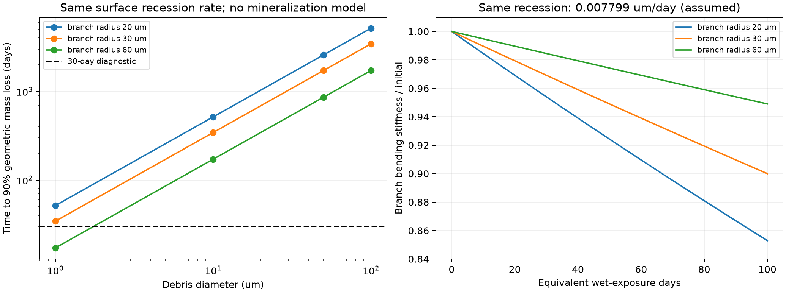
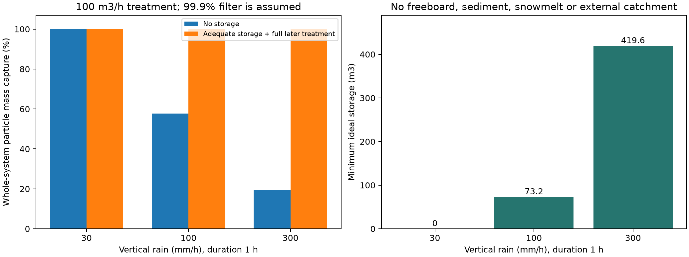

# 多方向探索 第43巡：微粉を流さない材料と雨水回収の設計

2026-10-09／Codex／Claudeへの独立検証依頼を兼ねる。参照元 main: 9974f38c4d4343001b5c1bd4e8e7c20cbf5d28e1。

**今回の改良は、雪らしい変形を「枝の破砕」で作らず接点の着脱で作り、使用中は粒を長持ちさせ、破片は流出前に回収し、回収後に別条件で再生するH43案である。** 第42巡の接触相配置へ、微粉の発生・回収・場外処理を接続した。生分解性を理由に雨へ流す前提は採らない。微粉が安く再材料化できるという前提も外す。

成果は、枝と破片の分解速度を分ける必要条件、豪雨時の設備全体の捕集率と貯留量、60分保守の処理量、追加設備の費用上限である。新物質の合成・滑走・毒性・降雨試験は実施していない。**物理試験0件、実物成功確率は未算定。22件の数値照合や捕集率を「発明成功率90％」へ読み替えない。** 既報の15〜25％は従来HBG案の主観予測であり、実証成功率15％ではない。

## 1. 原点の要件と今回変える部分

気温30℃以上、表面約50℃、新雪の圧雪に近い板の走りとエッジの短い切れ・解放、300mmの削れ代、冬の雪の固着と排水を維持する。450mm床は比較用。ネット等は最大削れ深さに余裕を加えた深さより下の保持・排水下地に限定し、露出する滑走面へ使わない（R39）。油・塩・フッ素・シリコーン潤滑、現地冷却、常時べしゃべしゃの散水には依存しない。

常温噴霧から雪状結晶が成長する最優先目標は未達。本巡の枝は工場形成する開放粒の仮説であり、分子結晶や雪の六花の実現と同一視しない。夏の低摩擦、冬の固着、50℃の枝寿命を満たす配合は未確定である。人と自然環境への無害性も未確認で、微粉を捕る設備だけで認定しない。

| 試した切り口 | 今回の反証・計算 | 次の設計判断 |
|---|---|---|
| 生分解するPHAなら雨へ逃がせる | 海水の管理試験と天然淡水で条件が違う。P3HB微粒子には慢性影響の一次報告もある | 分解性は最後の補助特性。流出を前提にしない |
| 大粒は残り、微粉だけ速く消える | 枝状粒の寿命を支配するのは外径より細い枝半径。12条件で剛性と表面後退を比較 | 使用中と回収後の処理環境を分離 |
| 高性能フィルターだけで解決 | 36条件の水・粒子収支で、処理能力を超えた迂回流が支配 | 貯留・処理能力・粒径別捕集を一体で指定 |
| 安い沈砂池のみで回収 | 低密度の10µm球でも理想沈降面積約3,531m² | 粗粒回収の後に別の微粉分離を置く |
| 回収微粉を全量新品へ戻して採算化 | 発酵のモノマー基準収率と回収ポリマー基準を区別。微粉の原料節約価値も小さい場合がある | 性能が残る粒を直接戻し、不良粒・微粉は場外再生または処理 |

鉱物・アミノ酸結晶・セルロース・非分解性高分子の経路は廃棄しない。鉱物は分解時の有機酸素需要を減らせても硬い摩耗粉と砂感を別に解く必要があり、水溶性結晶は微粉問題を溶存物負荷へ変える場合がある。非分解性高分子は使用寿命に利点があり得る一方、回収漏れの残留性が大きな選別項目となる。全材料へ同じ「発生→曝露→回収→機能回復」の比較を適用する。

## 2. 一次研究から使える事実と使えない推論

- **S1：P3HBと淡水生物。** P3HBのふるい分け画分<63µm／<125µmを使った研究では急性と慢性で結果が異なる。21℃・21日間の慢性試験などで生存・繁殖への影響を調べている。画分は重複し、凝集もあるため、厳密な二つの粒径区分ではない。本候補や人への影響、河川の許容濃度をこの論文だけで決めない。[論文DOI](https://doi.org/10.1016/j.heliyon.2024.e36302)、[著者所属大学の公開原稿（PDF114〜135頁）](https://www.vut.cz/www_base/zav_prace_soubor_verejne.php?file_id=264171)。
- **S2：海水のPHA微粒子。** 本文の25日BOD分解率はP3HB85％、PHB4HB83％、PHBV74％、PHBH68％、セルロース77％。要旨の約85％を全材共通値にしない。25℃、海水・土壌から調整した試験水、撹拌・栄養添加の条件である。深海の回収質量には50µm網からの逃散が混じるため、未回収量を完全分解量にしない。製粒で使われたシリコーン油の工程は採用しない。[Scientific Reports原著](https://www.nature.com/articles/s41598-024-60949-z)。
- **S3：天然淡水への転用。** 450〜550µmのPLA・PHB・PBATを比較した2026年の研究は、活性汚泥を加えた試験と天然湖水の分解挙動の違いを報告する。出版社要旨・ハイライトの確認範囲であり、未取得の速度定数を計算に入れていない。[原著要旨](https://www.sciencedirect.com/science/article/pii/S2213343726003611)。
- **S4：回収後の生物再合成。** PHB由来モノマー3HBを逐次供給した振とう培養で、PHB収率0.26g/gを報告。これはモノマー供給量に対する収率で、汚れた回収粒から新品への収率ではない。閉じた設備での再合成候補として使い、場内で微生物を放出する案にはしない。[原著要旨](https://www.sciencedirect.com/science/article/abs/pii/S1369703X23000037)。

出典の取得範囲、大学PDFのSHA256、計算へ入れた値を [sources.json](微粉流出と使用後分解検証_20261009/sources.json) に保存した。出典の図や全文は転載していない。

## 3. 細い枝の寿命と破片の消失は別々に設計する

まず分解の実速度を予測せず、**一定速度uで表面が後退する理想形状**を置く。枝の弾性率は一定、円形断面の曲げ剛性は半径の4乗なので、初期半径r₀に対し

I(t)/I₀ = (1 − ut/r₀)⁴。

100「相当湿潤日」後に90％を残す診断条件なら、u ≤ r₀(1 − 0.9¹ᐟ⁴)/100。相当湿潤日を営業日や暦日へ換算するデータはまだない。100日・90％は比較用の仮置きで、合格規格ではない。

球状破片の初期半径Rについて、90％の幾何学的質量減少までの時間は t₉₀ = R(1 − 0.1¹ᐟ³)/u。溶出物や断片への転換もあり得るため、これはCO₂までの完全分解時間ではない。誘導期間、結晶化度変化、菌膜、内部亀裂、50℃クリープ、乾湿履歴を含めていない。

| 枝半径 | 許される表面後退速度 | 直径10µm破片の90％質量減少 | 30日まで短縮するための回収後／使用中の速度比 |
|---:|---:|---:|---:|
| 20µm | 0.00520µm/日 | 約515日 | 約17.18倍 |
| 30µm | 0.00780µm/日 | 約344日 | 約11.45倍 |
| 60µm | 0.01560µm/日 | 約172日 | 約5.73倍 |

半径30µm枝の条件では、直径1µm破片でも約34日、直径50µmなら約1,718日になる。同じ材料が同じ環境で「使用中は丈夫、漏れた破片はすぐ消える」とは、寸法差だけで言えない。枝を一律に太くすると剛性と質量が増え、雪を切る感触を損ね得る。したがってH40の内側受け面とH42の接触相配置を維持し、**根元の疲労を減らし、粒間接点を外して解放する**経路を優先する。

図左は各枝に100湿潤日・90％剛性を課した場合。右は表面後退速度を0.007799µm/日に固定した寸法差。どちらも実材料の分解曲線ではない。

## 4. 豪雨では「捕集率×処理できた水量」で評価する

斜面実面積2,000m²、傾斜30°、厚さ0.45m、嵩密度120kg/m³を比較基準とする。材料量108t、水平投影面積1,732m²。鉛直雨量、流出係数1、外部集水なし、1時間一定降雨の診断である。台風の発生確率や地点別設計雨量の評価ではない。

材料が1営業日あたり質量比10⁻⁵だけ微粉化し、10営業日分が全量動く例は10.8kg。発生率・滞留日・移動率は未測定で、計算ではそれぞれ感度を分けた。100mm/hの例で流入濃度は62.35mg/Lとなる。現地実測値でも許容値でもない。

Q = 水平投影面積 × 鉛直降雨強度、

無貯留の設備全体捕集率 = フィルター質量捕集率 × min(処理能力/Q, 1)。

処理100m³/h、微粉捕集率99.9％を**仮定**した結果：

| 雨量（1時間） | 雨水量 | 貯留なしの全体捕集率 | 最低理想貯留量 | 雨後の貯留分処理時間 |
|---:|---:|---:|---:|---:|
| 30mm/h | 51.96m³ | 99.9％ | 0m³ | 0時間 |
| 100mm/h | 173.21m³ | 57.68％ | 73.21m³ | 0.73時間 |
| 300mm/h | 519.62m³ | 19.23％ | 419.62m³ | 4.20時間 |

最低理想貯留は max(Q−100,0)×1h。沈泥・余裕高・停電・フィルター洗浄・融雪・外部流入・地下浸透・排水管閉塞を含まず、発注容量にそのまま使えない。水が微粉を均一に運ぶ近似なので、初期降雨に微粉が集中する場合は時系列計算が必要。100mm/hの10.8kg例は、無貯留で4.57kgが残余流出、十分な貯留後に全水量を同じ性能で処理できた理想条件でも10.8gが残る。放流可否や無害性はこの量だけでは判定できない。

### 微細粒を沈めるだけでは面積が足りない場合がある

比重1.25の充実球、水の粘度0.001Pa·s、沈降則 v = Δρgd²/(18μ) の仮定では次の値になる。レイノルズ数は計算範囲で0.1未満。

| 粒径 | 沈降速度 | 173.21m³/hを沈降だけで分離する理想表面積 Q/v |
|---:|---:|---:|
| 1µm | 0.000491m/h | 約353,119m² |
| 10µm | 0.0491m/h | 約3,531m² |
| 50µm | 1.226m/h | 約141m² |

この面積は完全混合沈殿槽の保証ではなく、理想的な表面負荷による尺度。枝状・空気保持粒は球と沈降が異なり、浮く粒も別回収となる。土砂を先に落とすことは有効候補だが、微粉除去を沈降だけに任せない。

捕集率は粒径別、質量基準と個数基準を分ける。例えば質量割合20/50/30％の3画分をそれぞれ50/99/99.9％捕る仮定では、総捕集率は89.47％。粗い画分だけの99.9％を総量へ転用できない。さらに炭素の10％が溶存化した例では、粒子を99.9％捕っても、溶存分を除く機械分離だけの総炭素捕集率は89.91％にとどまる。

### 分解しやすい有機材料ほど酸素収支も調べる

PHBの繰返し単位 C₄H₆O₂ + 4.5O₂ → 4CO₂ + 3H₂O より、完全酸化の理論酸素要求量は約1.673kg-O₂/kg-PHB。セルロースも約1.184kg-O₂/kgであり、天然由来でゼロにはならない。

10.8kg-PHBでは約18.06kg-O₂相当。一方、上記173.21m³の雨水に仮にDO8mg/Lを置くと初期酸素量は約1.39kgとなる。**これは酸素欠乏が直ちに起きる予測でもBOD₅測定でもない。** 分解速度、再曝気、希釈、温度、生物量、滞留が必要である。微粉が消えたという観察だけで放流安全を判断せず、溶存有機物と酸素消費を測る理由となる。

## 5. H43：粒内の耐久と、コース外の回収を組み合わせる

H43は特許の新規性を確認した完成発明ではなく、次に識別できる設計仮説である。代表候補はPHA系の開放枝粒だが、PHAなら成立するとは主張しない。

1. **使用中の粒**：同一材料系での内部補強・根元の曲率調整・内側受け面を候補にし、鋭い硬質充填剤や剥がれやすい薄膜を外面に出さない。少量の材料を表面処理だけで足す案より、摩耗しても必要な接触相が残るH42を継承する。粒間の着脱と枝の弾性で切れ・解放を狙い、破砕による粉生成に依存しない。太い枝・高結晶化で硬い砂感へ戻る場合は不採用。
2. **整地時の粗粒回収**：山麓へ寄った粒は前刃で戻すが、微粉・泥・損傷粒を同じ配合として戻さない。回収部で分流し、機能が残る粒だけ再配材する。微粉を全面床へ圧し込む操作は排水と冬の接続を悪化させ得る。
3. **雨水の別系統**：可能な清浄上流水を混ぜず、コース由来水を粗粒捕集→貯留→点検可能な微粉回収設備へ導く。細かいフィルターを全床直下へ埋めて清掃できなくする案は優先しない。戻り水位が床へ伝わって雪との界面に水を溜めない構成とし、凍結時も排水経路を維持する。
4. **回収後の処理**：直接再使用、工場での再骨格化、管理設備内での分解・再合成を分ける。土・生物膜・微粉が混ざった材料の丸ごと再敷設は「回復」と呼ばない。場内の酸・培養菌放出・潤滑油散布は使わない。

~~~mermaid
flowchart LR
 A[開放枝粒・滑走] --> B[接点解放と整地]
 B --> C[回収粒の分流]
 C --> D[形状と滑りが残る粒]
 D --> A
 C --> E[損傷粒・微粉・泥]
 A --> F[コース由来雨水]
 F --> G[粗粒捕集]
 G --> H[貯留・微粉分離]
 H --> E
 H --> I[溶存物・水質の確認]
 E --> J[場外再成形または管理処理]
 J --> K[再生後の形状・摩擦・安全確認]
 K --> A
~~~

冬は粒層の開放空隙へ雪が入り込む条件を維持し、表層を防水膜で閉じない。貯留設備は滑走床から水理的に分ける必要がある。想定超過雨・停電・凍結での溢水は未解決であり、全量無流出を保証した図ではない。30°斜面の接続強度、融雪量、土中浸透経路の漏れも今後の同時評価に残す。

## 6. 60分の保守と2億円枠を守るための費用条件

### 全量を微粉選別すると処理量が急増する

閉鎖60分のうち展開・格納・品質確認を20分と仮置きし、正味40分で扱う場合：

| 処理する厚さ | 材料量 | 必要な総粒処理能力 |
|---:|---:|---:|
| 10mm | 2.4t | 3.6t/h |
| 50mm | 12t | 18t/h |
| 450mm全床 | 108t | 162t/h |

これは機械能力の実測ではない。雨水100m³/hの処理能力と粒162t/hの処理能力は別物。通常は材料を保持して深い層まで毎回運ばず、回収が必要な区画と実移動粒を処理する。10mmだけ処理すれば深さ300mmの品質も戻る、と結論しない。雨後の全層汚染・泥混入・床露出では60分復旧を保証できず、その事態を防ぐ保持・集水設計が必要である。300mmの削れ代を浅くして時間を合わせることはしない。

### 微粉の販売・原料節約だけで回収設備を正当化しない

108t床、購入完成材500円/kgの仮定。100％を新品同等で再使用できる上限でも、年間微粉量が床の0.1％なら節約は5.4万円、1％なら54万円、5％なら270万円。再生・分離・輸送費、品質不良、時間損失をまだ引いていない。年間微粉率は雨の例に使った日発生率と独立の感度であり、実測値ではない。

S4の0.26g-PHB/g-3HBを使い、さらに上流で純PHBを全量純3HBに加水分解できるという有利な仮定を足しても、元PHB基準の再合成量は

0.26 × 104.105 / 86.09 = 約0.314kg-PHB/kg-元PHB。

水の取り込みを含めた換算で、実工程全体の収率ではない。基材の混合・加水分解・精製・菌体回収の損失を含めれば別途低下する。再合成できる事実は有用だが、全量循環や安価な閉ループを意味しない。工場での直接再成形と比較する。

### 設備価格を捏造せず、払える上限から逆算する

追加設備10年、割引率8％、追加運転費年50万円を**費用仮定**とし、年額余力Bから設備上限K=(B−50万円)/0.149029を逆算した。税・保守境界は同じ総支出基準へ揃える前提で、見積書ではない。

| 追加年額余力（設備年額＋運転費） | 許される追加初期費 |
|---:|---:|
| 100万円/年 | 約336万円 |
| 300万円/年 | 約1,678万円 |
| 500万円/年 | 約3,020万円 |

例えば年300万円枠の約1,678万円へ、最低73m³貯留・前処理・100m³/h微粉分離・ポンプ・泥回収・制御・据付を収められるかが具体的な照会条件になる。容量と必要捕集径が未確定であり、価格の成立は未確認。

従来の整地設備1.98億円という暫定発注枠へこの1,678万円を足すと約2.148億円となり、そのままでは設備2億円枠を超える。同じ枠へ含めるなら整地側を約1.832億円以下へ減らす必要がある。排水土木を別枠へ移して総費用を隠さない。既存の貯留・排水を使える場合も、有効容量と汚染水対応を確認してから削減額へ入れる。

天然雪の人工降雪・圧雪との比較は、面積、滑走日数、補給・電力・人件費・排水処理・交換・設備年額を同じ範囲へ揃える。現地実績費が未共有のため、本巡で天然雪より安いとは判定していない。第42巡の材料年額に、今回の処理年額を**追加**して比較する必要がある。

## 7. 計算の確認と、次に得るべき証拠

[入力](微粉流出と使用後分解検証_20261009/inputs.json)、[計算コード](微粉流出と使用後分解検証_20261009/calculate.py)、[結果](微粉流出と使用後分解検証_20261009/results.json)、[22件の照合](微粉流出と使用後分解検証_20261009/checks.json)、[再現案内](微粉流出と使用後分解検証_20261009/README.md)。枝12条件、雨36条件、沈降3寸法。水・微粉質量保存、球体積と枝剛性の逆算、時間刻みを変えた独立貯留計算、沈降の適用範囲、化学量論、費用の逆算を確認した。これらは式と実装の照合で、材料の試験成功ではない。

同じ仮定を増やすだけでは前進しないため、次の比較でH43を残すか変える。

| 識別する問い | 必要な比較 | 設計を変える結果 |
|---|---|---|
| 雪感を破砕なしで作れるか | 50℃乾湿、摩耗前後の実ソール摩擦、エッジ荷重・短距離解放と微粉発生を同時に測る | 枝が保っても硬い砂感なら接点配置へ戻す。低摩擦でも微粉が増える材は残さない |
| 枝だけ先に消耗しないか | 同一製造ロットの枝・破片、50℃乾湿と現地淡水・低温条件で形状、分子量、剛性、炭素収支 | 後退モデルからの逸脱・亀裂があればその機構へ更新。分解速度は別環境へ外挿しない |
| 回収が豪雨に追いつくか | 粒径・質量・個数・溶存分を分けた初期降雨と連続流、目詰まり後の通水・水位 | 99.9％の仮値を実測曲線へ置換。雨水迂回・土中浸透・洗浄排水を総収支へ追加 |
| 人・自然に悪影響がないか | 実配合と摩耗後生成物の曝露評価、急性／慢性・浸出物・生物膜、皮膚／吸入の関連経路 | 材料名や食品接触実績で代用しない。分離後の水も別評価 |
| 冬に固定床へ戻るか | 雪下の凍結融解・排水水位・せん断と露出確認 | 水が戻る／油膜／露出／余計な融雪があれば下地と排水を再設計 |
| 雨後に安く回復するか | 戻した粒の形状・配合・摩擦と所要時間、汚れ粒交換費を計量 | 重量だけ戻っても不合格。全層選別が必要なら保持・集水側を変更 |

この表は準備すべき検証仕様であり、発注・購入・物理試験の実施報告ではない。

## 8. Claudeへの共有・独立検証依頼

1. 「PHAは生分解するから雨へ流してよい」という推論がv3に含まれるなら、S1〜S3と形態・曝露を突き合わせる。海水BOD85％、網からの質量消失、淡水での無害性を分離する。
2. 枝半径で決まる剛性寿命と球状破片の質量減少式を独立計算し、使用中／回収後の速度比約11.45という診断値が実配合でどの条件差に対応し得るか示す。実測のない速度を採点で埋めない。
3. 雨量・投影面積・処理量・貯留量と、粒径別の質量捕集を再計算する。初期流出・微細粒漏れ・溶存分・土中浸透・水位の逆流も反証する。
4. H43の接点解放が、雪感を残したまま枝破砕を減らせるかをH32/H40/H42と合わせて検討する。回収が必要な粒だけ選別する構成と、60分の総処理量を比較する。
5. 回収微粉の販売益や完全循環を仮定せず、2億円設備枠と材料・土木・年額処理費を同じ範囲へ合算する。
6. 継続依頼のv3全結果・元コード・物性の出典をGitHubへ掲載してほしい。既存v2の構造的矛盾と新物質案への応答を確認する。

GitHub公開を共有の完了条件とする。Claudeの受領・同意・実行は未確認。公開直前のmain再取得では参照元9974f38c以降の更新なし。Claudeのv3は開始の記載はあるが、全結果・元コードは未掲載。稼働中の実行ハンドルは確認していない。
