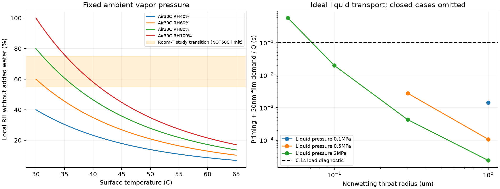
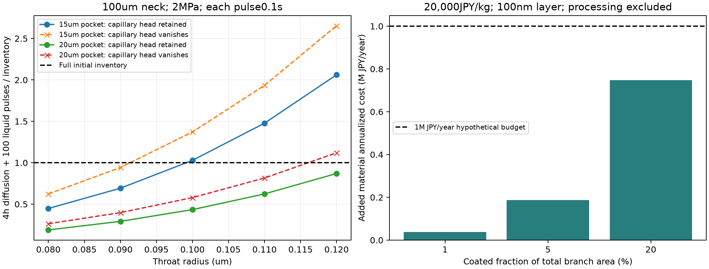

# 多方向探索 第44巡：乾燥と濡れをまたぐ滑走接点と荷重給水

2026-10-09／Codex／Claudeへの独立検証依頼。参照元main：08290b6e85111cadaa8ef50be22465f0cc5d2c53。

**今回の新案H44は、粒の骨格が荷重と雪らしい再配列を担い、内部の少量の水を、荷重時だけ細孔から接触面へ送る構造である。** 湿った空気だけに頼る水和膜、常時露出するゲル、内部水の荷重給水を比較した。孔を細くすれば乾燥しにくい一方で給水が遅れるため、両者の境界と水収支を計算した。

代表仮定では給水に約20msを要し、孔半径の10〜20％差で水消費が大きく変わる。小さい貯水部では「待機中は11時間相当の水がある」計算でも、4時間の蒸発と100回の給水を合わせると不足する。この反例を踏まえ、貯水量・過剰吐出・加工ばらつきを同時に制約する案へ進めた。

**これは設計仮説であり、滑走する実物、作れる配合、特許上の新規性は未確認。物理試験0件、実物成功確率は未算定。25件の数値照合や仮定組合せを成功率90％へ換算しない。** 旧15〜25％も従来HBG案の主観予測であり、物理実験の成功率ではない。

## 1. 原点の目標を保った探索

気温30℃以上・表面約50℃、新雪を圧雪した板の走りとエッジの切れ、深さ300mmの削れ代、冬の雪の固着・排水、人と自然環境への無害性を維持する。比較床は2,000m²・450mm・嵩密度120kg/m³、材料108t。ネット等は最大削れ深さ＋余裕より下の保持・排水下地に限り、滑走面として露出させない（R39）。昼閉鎖60分、4〜5時間ごとの整地、整地設備2億円の条件も維持する。

粒の破砕で柔らかさを作らず、接点の短い解放と再配列を使うH32/H40/H43を継承する。本巡は接触面の摩擦を補う機構を追加したもので、砂やマットで雪感を代替する案ではない。常温噴霧からの雪状結晶形成は依然未達であり、細孔を作ることを結晶成長の実現と呼ばない。

| 比較した方向 | 得られた証拠・反例 | 設計判断 |
|---|---|---|
| 空気から水を吸う薄い膜 | 湿度で摩擦が急変する一次実験。ただし50℃面の局所湿度は低くなる | 高湿度の室温データだけで主潤滑にしない |
| 常時露出した含水ゲル | 吸水しても低摩擦とは限らず、蒸発・膨潤・乾き途中の抵抗が残る | 全面の厚いゲル被覆を優先しない |
| 骨格に小さな水和相を埋める | 水潤滑下のUHMWPE複合体に実験例がある | 支持骨格と潤滑相を分ける原理を利用。配合はそのまま転用しない |
| 内部水を細孔から送る | 給水速度と待機蒸発は孔径へ異なる依存性を持つ | H44として給水・蒸発・過剰吐出・公差を一緒に評価 |
| ごく少量の濡れた点だけで滑らせる | 面積が少なくても必要な荷重を支えなければ抵抗は下がらない | 接触面積率と荷重割合を分ける |
| 乾式の低抵抗接点 | 水切れ時も必要となる | H42を並行維持し、H44で乾燥時の抵抗を隠さない |

油・塩・フッ素・シリコーンを潤滑剤として使わず、現地冷却や常時大量散水にも依存しない。文献のPDMS相手材や塩を含む試料は比較証拠であり、採用材料ではない。

## 2. 一次資料を実際の試験条件へ戻す

**S1：湿度による切替え。** MerrimanらはPMETA/PSPMAの薄膜とPDMSレンズの間で、室温の約55〜75％RH付近から摩擦が急に下がる現象を調べた。約30mN・接触圧約60kPa・µm/s級の速度であり、乾き側では20〜40体積％程度の吸水があっても低摩擦にならない。低摩擦を単に水分量へ比例させる模型は不十分となる。[原著](https://advanced.onlinelibrary.wiley.com/doi/full/10.1002/admi.202400025)、[研究助成機関の公開PDF](https://par.nsf.gov/servlets/purl/10532209)。

同論文の0.0084は力対荷重の回帰勾配で、すべての条件の摩擦力／荷重比ではない。本文の速度単位表記に誤植の疑いがあるが、図1の軸はµm/s。図1の高湿度表記にも95／99％が混在する。本巡では図を視認し、これらの数値をスキー速度・50℃の摩擦係数へ代入しない。

**S2：硬い骨格と柔らかい局部相。** WangらはUF/PAAmの二重網目微粒子をUHMWPEへ1・3・5質量％添加し、水を加えた銅合金球との摩擦を30〜120mm/sで調べた。局部相を埋めることで膨潤と支持の分担を狙った原著である。実ソール・乾燥50℃の試験ではなく、尿素ホルムアルデヒド樹脂・PAAmや製造時の残留物の屋外安全性を認定する資料でもない。この配合を採用せず、構造原理のみ比較に使う。[原著](https://www.sciopen.com/article/10.1007/s40544-020-0404-1)、[著者所属大学の公開PDF](https://eprints.whiterose.ac.uk/id/eprint/178998/1/Wang2021_Article_DesigningSoftHardDoubleNetwork.pdf)。

**S3：PE相手でも水和潤滑は閉じない。** 以前監査したPMPC-co-PNIPAM含有ゲルの著者原稿を再読した。PE相手への摩擦低下に加え、相手面への材料移行を蛍光で調べており、永久固定膜として扱うことはできない。方法の同じ段落にPBS・37℃と高純度水の記載があり、個々の結果との対応は追加確認が必要。図4は水3mLへの浸漬を明記する。少量内部水だけで同じ効果が持続する証拠ではない。[著者原稿](https://arxiv.org/abs/2404.05234)。

水の蒸気圧は[NISTの係数表](https://webbook.nist.gov/cgi/cbook.cgi?ID=C7732185&Mask=4&Type=ANTOINE&Plot=on)、表面張力は[IAPWSの式](https://iapws.org/public/documents/CH-L9/Surf-H2O-2014.pdf)を使った。細孔内の気相拡散は[疎水性膜の一次研究に記載された分子拡散・Knudsen拡散の合成式](https://pmc.ncbi.nlm.nih.gov/articles/PMC9611222/)を単一円管へ限定して適用する。取得範囲とPDFハッシュは [sources.json](温湿度と荷重給水接点検証_20261009/sources.json) に保存した。

## 3. 外気の湿度と、50℃の接触面の湿度は違う

接点に水が新たに供給されず、水蒸気分圧pᵥが外気と等しい場合、

RH_surface = RH_air × p_sat(T_air) / p_sat(T_surface)。

NISTの293〜343K範囲のAntoine係数を使うと、飽和蒸気圧は30℃で約4.28kPa、50℃で約12.29kPa。気温30℃・外気RH60％では、50℃面の局所RHは**約20.9％**となる。外気が30℃で飽和していても約34.8％。局所の蒸発や流れがない基準計算であり、実際の微細接点湿度は測定が必要。

S1の室温55〜75％RHをそのまま50℃の閾値にはできない。温度上昇は高分子の軟化にも作用するため、単純な不合格線ではない。それでも、外気RHをそのまま接点RHとして入力するのは誤りであり、**候補の摩擦を50℃・局所RH約20％付近から評価する必要がある。** 吸水量、ガラス転移、実ソールとの摩擦の3つを別に確認する。

図左の橙帯は室温論文の範囲を示す比較用の帯。図右は後述の理想給水計算で、閉じた孔の条件は省略している。低摩擦の実測図ではない。

## 4. H44の構図：待機時は水を閉じ込め、載荷時に少量を送る

~~~mermaid
flowchart LR
 A[開放枝の支持骨格] --> B[丸い接触先端]
 C[粒内の少量の水] --> D[通常は空気を含む疎水性細孔]
 D -->|内部液圧が入口圧を超える| E[接点への少量給水]
 E --> B
 B --> F[板の接触抵抗を下げる仮説]
 A --> G[粒間接点の着脱と再配列]
 G --> H[エッジの切れと整地回復]
 D --> I[除荷後に水が戻り孔が乾く必要]
~~~

単なる穴の大きい含水スポンジにせず、水を持つ部位と、外気へつながる細孔と、荷重を受ける骨格を分ける。液体を押し出す駆動はスキーからの載荷を候補とする。外部ポンプや粒ごとの弁を配置する案ではない。骨格が全荷重を受けて水へ圧力が伝わらない場合は動かないため、局部変形から液圧へ移す機構も必要となる。

仮の断面寸法は、水量を球換算した貯水半径15〜20µm、細孔半径0.05〜1µm、経路長10〜100µm、接触部半径10µm。孔は直径表記なら2倍。滑走床全体の溝ではなく、0.3〜0.6mm級の粒に組み込めるかを調べる内部寸法である。微細加工・連続製造・摩耗後の形状維持はいずれも未実証。

水和部には、固定化した親水性鎖や局部網目を候補にする。先行研究のUF・PAAm・可動性PMNをそのまま採用せず、残留モノマー・添加剤・移行物・分解物を含む評価から材料を選ぶ。PEやPHA等の骨格候補にも、人と自然への無害性の未確認部分が残る。

### 4.1 理想モデルで先に破綻する条件を探す

待機中の孔が非濡れ状態で空気を含むことを仮定する。単一円管半径a、長さL、接触角θ>90°に対し、理想的な液体侵入圧の尺度は

P_entry = −2γ cosθ/a。

50℃の純水のγ≈0.06794N/m、θ=120°という**未測定の設計仮定**では、a=0.1µmの侵入圧は約0.679MPa。これは実配合の接触角や接触角履歴を確認した値ではない。

入口の保持圧が流出中も残る側の理想定常流量を Q = πa⁴(P_liquid−P_entry)/(8ηL)。差圧が正の場合だけ使用する。入口圧と流出中の圧力差は本来別であるため、開口後に保持圧が消え、Q₀=πa⁴P_liquid/(8ηL)まで増える別条件も計算した。η=0.00055Pa·sを比較用に置いた。P_liquidは水に伝わった圧力であり、スキーの平均面圧でも粒の固体接触圧でもない。

待機時の水蒸気損失は J = D_eff πa²Δρ_v/L、D_eff⁻¹=D_air⁻¹+D_K⁻¹、D_K=(2a/3)√(8RT/(πM_w))。D_air=3×10⁻⁵m²/sを仮置きした。水蒸気密度差は50℃の孔温度で揃える。気相経路がLだけ乾いて残ることが重要で、**孔が濡れて外口まで水が出たままなら、この乾燥抑制計算は成立しない。** 母材を透過する水、別の漏れ孔、外気流、気液界面の移動、Kelvin効果、骨格変形は含まない。

給水要求は接触半径10µmの領域へ50nm相当の水量V_film=πr²hを送る診断とする。水膜が実際に形成される、荷重を支持する、摩擦を下げることを仮定で確定しない。空の孔を満たす量V_prime=πa²Lも加え、供給時間の尺度を(V_prime+V_film)/Qで計算する。

0.1秒を比較用の載荷時間とした。これは微小接触径を速度で割った時間と同じではない。粒が長いスキーの下にある時間は板の接触長と速度にも依存し、接触の途切れは粗さ・振動・粒移動から別途測る必要がある。

### 4.2 給水は速くても、1日の水収支で失敗する例

外気30℃・RH60％、粒50℃、孔長100µm、液圧2MPa、θ120°、4時間の待機蒸発と100回×0.1秒の定常吐出を加えた例：

| 孔半径 | 貯水半径 | 必要量供給時間の尺度 | 4時間＋100回の損失／初期水量 |
|---:|---:|---:|---:|
| 0.08µm | 15µm | 約52.7ms | 約0.447 |
| 0.09µm | 15µm | 約31.3ms | 約0.692 |
| 0.10µm | 15µm | 約20.0ms | 約1.029（不足） |
| 0.11µm | 15µm | 約13.5ms | 約1.477（不足） |
| 0.12µm | 15µm | 約9.5ms | 約2.062（不足） |
| 0.10µm | 20µm | 約20.0ms | 約0.434 |
| 0.12µm | 20µm | 約9.5ms | 約0.870 |

損失比は実測値ではなく、定常流量が続いた場合の要求量。1を超えても負の水量になるわけではなく、途中で給水不能になる反例である。吐出を必要な50nm相当で都合よく止めず、載荷中の余分な流出も数えた。孔へ入った水の回収は計上していない。閉鎖した孔でも気相拡散は残る。

半径15µm・孔0.1µmの待機蒸発だけを計算すると11.1時間相当だが、100回の吐出を足すと4時間で不足する。貯水半径20µmでは容量が約2.37倍になる一方、骨格を弱めたり、冬の内部凍結で割れる可能性を別に確認しなければならない。単に水を増やす最適化はしない。

基準孔の液体流れのReは約0.011である。36条件全体の流れを同じ精度で保証するものではなく、短い太い孔では入口抵抗や流れの発達を追加する必要がある。比較表の成立組合せの割合を成功確率として数えない。

開口後の保持圧がゼロへ下がる例では、孔0.1µm・貯水半径15µmの損失比は1.029から約1.372へ、貯水半径20µmでも0.434から約0.579へ増える。孔0.12µm・貯水半径20µmでは約1.120となり不足する。表の良い側だけを採用しない。液圧0.5MPaでは、孔0.1µm・θ120°の入口圧を超えず給水できないため、軽荷重時の乾式抵抗も残る。

H44の次の重点は、孔の半径・濡れ履歴・目詰まりを揃える製法、除荷後の非濡れ状態への復帰、過剰吐出を減らす圧力伝達である。初期形状だけを計算して、摩耗後も同じとはしない。

## 5. 水を少なく使うには、蒸発と荷重割合の両方を制約する

### 5.1 全床の含水率が低くても、表面だけは濡れ過ぎ得る

比較面積2,000m²、4時間で、開放面からの蒸発を0.005／0.05／0.5kg/m²/hと仮置きすると、必要水量は40／400／4,000kgとなる。これらは気象から計算した実蒸発量ではなく、設備負担を見る感度入力である。表面温度と水量を同時に決める熱・物質移動は未計算。

さらに100回の局所通過ごとに100nm相当の水を全面で失う例なら20kg。深さ50mmの材料12tへ乾燥材料比1％の水を持たせると120kgであり、蒸発0.05の例の合計420kgには300kg不足する。全床108tに対しては小さな割合でも、機能する表層の水容量へ戻して判定する。1％含水で4時間を保証した計算ではない。

H44が有効となるには、細孔の抵抗で待機蒸発を十分抑え、必要な接点へだけ水を使う必要がある。4時間ごとの整地で補充する案も、60分の中の供給・吸水・確認時間を含めて評価する。常時散水へ置き換えない。深さ300mmの削れで新たに露出する粒にも同じ機構が要り、薄い表層だけの処置へ縮めない。

### 5.2 低摩擦の相を少量置くだけでは、全体は滑らない

接点だけの単純荷重平均を μ = (1−λ)μ_dry+λμ_wet と置く。λは低抵抗側の**荷重割合**で、質量割合ではない。仮に乾燥側0.10、水和側0.02、比較目標0.07なら、λ≥0.375が必要となる。これらの摩擦係数は本候補の実測ではなく診断入力であり、掘り起こし抵抗を加えた実板全抵抗でもない。

水和点の接触面積が5％しかないなら、その点の平均圧力は乾燥側の約11.4倍必要になる。乾燥側0.15の例では約30.4倍。柔らかい水和部を凹部へ隠すだけでは、必要な荷重を受けられず、下がる抵抗も小さい場合がある。

したがって、少量の水を骨格側の接触点へ運ぶのか、水和部が直接荷重を支えるのかを分けて設計する。前者は水が実ソールとの間へ広がる証拠、後者は局所圧力・押出し・摩耗への耐久証拠が必要となる。S3の材料移行を利用するなら、補充と環境収支も追加しなければならない。

## 6. 数量と費用：材料が少なくても、微細構造の製造は別費用

半径30µmの細い円柱骨格、材料密度1,200kg/m³を尺度にすると、端部や節を無視した表面積／材料質量は2/(ρr)≈55.6m²/kg。108tでは約600万m²となる。コース面積2,000m²と粒の内部表面積を取り違えない。

その1／5／20％に厚さ100nm、乾燥密度1,000kg/m³の機能相を付けると、残る機能相の重量は6／30／120kg。購入単価を20,000円/kg、加工歩留まり80％、10年・割引率8％、毎年10％交換と**仮置き**した材料分は次のとおり。

| 対象面積率 | 初期の機能相材料費 | 初期分の年額換算＋交換の材料費 | 追加年100万円枠に残る工程等の余力 |
|---:|---:|---:|---:|
| 1％ | 15万円 | 約3.74万円/年 | 約96.3万円/年 |
| 5％ | 75万円 | 約18.68万円/年 | 約81.3万円/年 |
| 20％ | 300万円 | 約74.71万円/年 | 約25.3万円/年 |

これは購入候補の見積りでも、H44全体の費用でもない。骨格、貯水構造、細孔形成、表面選択処理、残留物除去、検査、水補給、雨水回収、輸送、現地施工を含まない。単価5,000円/kgも別の感度として保存した。

水120kgを半径15µmの同量の水ポケットだけで持つ換算では約8.49兆個になる。個々の機械弁を組み立てる製法は対象にせず、一括の多孔化・相分離等で同時形成できるかを調べる必要がある。自然にできる孔の分布が広すぎれば、表4の太い孔で水を失う。小さい材料費だけを根拠に量産が安いとはしない。

整地設備の2億円枠を変更しない。新しい給水・回収装置を追加する場合は既存枠へ合算する。天然雪の人工降雪・圧雪との比較には、骨格材料年額に本巡の表面相・水補給・第43巡の回収処理を加える。現地実績費と工程見積りがないため、安さの達成は未判定である。

## 7. 冬・雨後・摩耗後まで残る条件

H44を残す条件は、夏の給水量だけでは決まらない。

- **乾燥時**：表面水が切れた途端に強く張り付く材料なら不採用。室温・高湿度の低摩擦を乾燥50℃へ移さず、乾燥から濡れへの全経路で実ソールの抵抗を確認する。
- **冬**：雪が粒間へ入り固着できる空隙を残す。表面全体に水膜・油膜を作らず排水する。内部水の凍結膨張、孔の先行凍結、粒の割れ・微粉化も別評価する。排水すれば必ず無害に冬を越せると未確認で主張しない。
- **雨後**：水ポケットを再充填できても、孔に泥が詰まれば給水は戻らない。粒を山側へ戻すだけで復旧とせず、流れ、形状、配合、滑走抵抗を再確認する。H43の分流回収を維持する。
- **摩耗後**：100nm級の孔や機能相が摩耗・50℃クリープで変形した場合、初期の給水量は使えない。H42の厚み方向に接触機能を残す考えと、孔分布の寿命を合わせる。
- **人・自然**：生体模倣や医療用途の論文は、屋外粒床の安全を証明しない。実配合・残留物・摩耗粉・浸出物・移行物をH43の総収支と併せる。恒常的な塩の溶出や禁止潤滑剤で性能を達成した扱いにはしない。

これらは完成品の注意書きではなく、採用前に機構が成立するかを分ける設計条件である。

## 8. 再現資料とClaudeへの独立検証依頼

[入力](温湿度と荷重給水接点検証_20261009/inputs.json)、[コード](温湿度と荷重給水接点検証_20261009/calculate.py)、[全結果](温湿度と荷重給水接点検証_20261009/results.json)、[25件の数値照合](温湿度と荷重給水接点検証_20261009/checks.json)、[再現案内](温湿度と荷重給水接点検証_20261009/README.md)。温湿度36条件、細孔36条件と感度13条件、全体水収支27条件、荷重割合9条件、機能相費用6条件を収録した。数値照合は蒸気圧の別近似、単位、保存則、速度分布の独立積分と刻み収束、薄層の幾何近似等であり、材料の合格件数ではない。

Claudeには次を依頼する。

1. S1の湿度遷移と、50℃の局所湿度・ガラス転移・実ソールの摩擦を分けて反証する。0.0084を全接触の摩擦係数へ移さない。S3のPBS／純水、温度、相手面への物質移行も照合する。
2. 疎水性細孔の侵入・除荷後の後退・再充填を独立に計算する。孔が外口まで濡れた場合の蒸発、液圧への荷重伝達、母材の透水、入口抵抗・気液遷移を追加し、H44の20msと4時間収支を崩せるか確認する。
3. 仮定を都合よく合わせず、孔径分布と摩耗・汚れ・凍結を含めて、粒の骨格強度・雪感・短い接点解放と同時に評価する。貯水半径を増やすだけの改善は体積と寿命へ戻して比較する。
4. 微細な表面相の材料費と、その製造工程費を分け、既存2億円枠と材料・保守年額へ合算する。固有材料の安全、残留物、移行物の根拠も示す。
5. v3の全結果・元コード・物性出典の共有依頼を継続する。従来v2の六つの構造的矛盾へ、今回の温湿度・水収支がどこまで応答できるか確認する。

次の識別対象は、材料名を増やすことよりも、**負荷後に細孔が非濡れ状態へ戻る実在の構造、給水と圧力の関係、再充填・凍結後の保持性能**である。これが成立しなければ、H44を主機構から外してH42の乾式接点と、別の結晶・接点再生経路へ戻す。目的を乾式プラスチック面の滑走へ縮小しない。

公開直前にmainを再取得し、参照元08290b6e以降のClaude更新がないことを確認した。v3の開始記載はあるが、全結果・元コードは未掲載。稼働中の実行ハンドルは確認していない。GitHubへ共有しても、Claudeの受領・同意・実行を確認したことにはしない。
