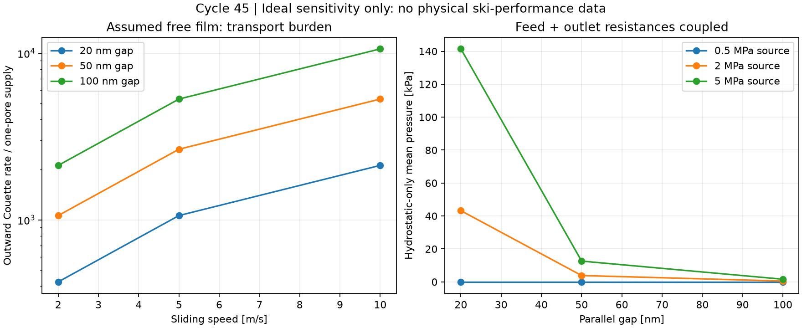
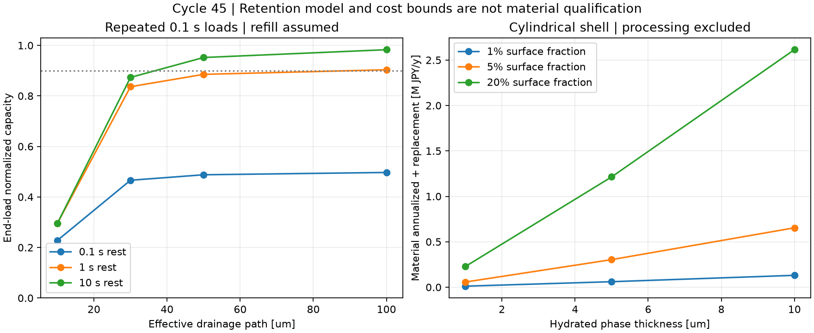

# 多方向探索 第45巡：滑走中の水流出と保水接点への再設計

2026-10-09／Codex／Claudeへの独立検証依頼。参照main：43650b8432d4c8a9316aec6ae5382465f97e0f5a。

**本巡の成果は、H44の「接点へ一度水を送れる」という条件を、「滑走中にも水と支持力を保てる」という条件へ修正し、連続吐出に依存しないH45へ進めたことである。** 外へ自由な水膜を出し続ける案、細孔を増やす案、内部に水を保持する局部相、乾式接点を比較した。

前回の代表条件に、半径10µm・厚さ50nmの自由な水膜と速度5m/sを仮定すると、板の運動が生む水の外向き移送成分は一孔の給水量の約2,651倍になる。これはコース全体の必要散水量ではない。上流から来る水と再利用を解いていないため、「一孔だけを新規給水源とする孤立接点」の不十分さを示す反例である。

**H45は、開放枝の支持・短い接点解放に、薄い保水接触相を局部配置し、載荷中の排水を抑え、除荷後に水を再分配する案。配合・製法・50℃性能は未確立。** 物理試験0件、実物成功確率は未算定。27件の数値照合、仮定した状態量の90％保持、図中の曲線を、目標の成功率90％超へ読み替えない。

## 1. 保持する目的と、今回変える設計判断

気温30℃以上・材料表面約50℃で新雪を圧雪した滑走感を目指す。低摩擦だけでなく、沈み込み・エッジの切れと短い抜け・横支持・振動・停止再始動をそろえる。砂状の流動、泥化、露出マット、粒破砕での軟化は代替成果にしない。

比較条件は2,000m²、450mm床、300mmの削れ代、乾燥嵩密度120kg/m³・骨格108t。約30°、9〜17時営業、4〜5時間ごとの整地、昼閉鎖約60分、整地設備の仮予算上限2億円を継承する。材料・工場・全面造成を含む総事業費が2億円以内と確認したものではない。下地用ネット等は最大削れ深さ＋余裕より下に限る最新R39を優先する。

前回の貯水半径20µmへの拡大は、待機蒸発と指定吐出の収支を改善した。しかし、板が水を持ち出す自由膜流れ、接点の出口圧、実荷重からの圧力伝達が未接続だった。本巡はこの点を修正する。H44の約20msは「指定量を送る尺度」であり、滑走摩擦の低下が20msで達成される意味ではない。

| 比較方向 | 今回の判断 | 次に必要な証拠 |
|---|---|---|
| H44：孤立接点へ一孔から自由膜給水 | 一度の充填時間だけでは維持不可。優先度を下げる | 実ソールからの戻り水・入口供給・漏れ・圧力の同時計測 |
| 多孔化して流量を増やす | 蒸発、貯水、加工、公差も悪化する | 孔の実配置、乾湿復帰、加工歩留まり込みの比較 |
| H45：拘束した保水接点 | 連続吐出を減らす方向として継続 | 載荷時の保持と除荷時の回復、50℃乾燥後の摩擦 |
| H42/H40：乾式の接触相と支持骨格 | 水切れ・軽荷重・再始動の比較基準として維持 | 実UHMWPEソールと鋼エッジ、摩耗後の低抵抗 |
| 常時濡らしたゲル | 実験の比較対照には使えるが採用案にしない | 常時散水なしの運用条件で改善を示せること |
| 常温噴霧による雪状結晶成長 | 別探索として残る。今回達成していない | 再現可能な組成・晶析・50℃耐久・無害性 |

## 2. 文献の低摩擦は、どの条件で得られたか

- **S1 Zhuら（2025）**：空気中のゲルで蒸発と内部給水の競合を報告。公開要旨までを確認した。孔径と水移動が関係するという原理に使い、未取得の温度・速度・摩擦係数は補わない。[原著](https://advanced.onlinelibrary.wiley.com/doi/10.1002/adma.202417177)
- **S2 Cucciaら（2020）**：ゲル／PMMA等で速度・形状・時間履歴による摩擦の変化を調べた。22±2℃、約3mmの溶媒層、各速度30〜1800秒の試験である。高い速度側では自由液膜の抵抗が増える。室温で長く慣らした値を、50℃の最初の短い接触へ代入しない。著者原稿HTMLの日付表示ではなく、arXiv履歴・誌面情報により2020年の研究として扱う。[著者原稿全文](https://arxiv.org/html/2001.00620v2)、[書誌情報](https://arxiv.org/abs/2001.00620)
- **S3 Sakaiら（2018）**：内部の水による支持と外側液膜の支持を圧力測定で比較した。23℃、アクリル相手、1.8N、1.56〜400mm/s、3.3wt％PVA液4mL、試験間に純水で1800秒超の再膨潤という条件。透水性だけで低摩擦は決まらない。PE被覆対照は表面化学も変わっており、差をすべて透水性へ帰属させない。[原著全文](https://ietresearch.onlinelibrary.wiley.com/doi/10.1049/bsbt.2018.0001)
- **S4 Theileら（2009）**：圧密した雪へUHMWPEを約100msで載荷する試験。板の通過時間と微小接点の面積を分ける根拠に使う。報告された実接触面積率を人工粒へそのまま適用しない。この雪も本計画の目標雪そのものではない。[原著全文](https://link.springer.com/article/10.1007/s11249-009-9476-9)
- **S5 Delavoipièreら（2018）**：水中の薄いPDMA層で、排水時間と接触時間の比が接触形状・抵抗へ関係する研究。要旨を確認した。下地に固定されたゲルと自由粒では境界条件が違うため、そのまま物性や滑走係数を移さない。[著者要旨](https://arxiv.org/abs/1807.07502)

医療用途、PVA・寒天・生分解性といった名前を屋外安全の証明にしない。PAAmやPAAなど文献の配合を安全な採用処方として示していない。油・塩・フッ素・シリコーン潤滑は追加しない。

## 3. 自由な水膜は、一度満たせば終わりではない

### 3.1 速度による移送を追加する

半径aの円形接点、厚さhの一定隙間、上面速度U、下面静止、両面で滑りなしという理想条件を置く。圧力勾配による流れをまだ含めないCouette成分の平均速度はU/2。下流半円周で外向き流束を積分すると、

Q_out,C = U a h。

円内の水量はV_film=πa²h、入替時間の尺度はπa/Uとなる。**上流側には同じ大きさの流入成分がある。したがってQ_out,Cをそのまま新規給水の必要量とはしない。** 上流の水膜、板に付いた水、隣接粒からの水がどれだけ戻るかを別に解く必要がある。本巡は「他の入口供給も回収もないのに、一孔だけで全面自由膜を保てる」とする読み方を退ける。

H44と同じ孔半径0.1µm・長さ100µm・内部液圧2MPa・仮の接触角120°・50℃の水に対し、入口保持圧を差し引く自由出口流量は約9.43×10⁻¹⁶m³/s。接点半径10µm、h=50nm、U=5m/sでは、

- 外向き移送成分：2.50×10⁻¹²m³/s（一孔流量の約2,651倍）。
- 膜内の水量：1.57×10⁻¹⁷m³。入替尺度：約6.28µs。
- 一孔だけを新規水源にする場合の移送水の再利用割合：約99.9623％以上という条件になる。
- 有効載荷長を0.5mと仮定すると、5m/sで0.1秒の載荷。この間の移送量は2.50×10⁻¹³m³で、半径20µmの球相当貯水量の約7.46倍。
- 同半径10µmのピストンでこの全量を押し出すなら約796µmの変位が要る。0.3〜0.6mm級の粒内機構へ単純には収まらない。板からの戻り水があればこの全量を粒内から出す必要はない。

6.28µsは水の移送尺度で、粒が板に載荷される時間ではない。板の有効接触長、断続接触、局所の膜流れを混同しない。圧力流れ・変形・凹凸・分子層・すべり境界を加えると値は変わるため、これで全候補の水和潤滑を否定することもできない。

### 3.2 孔を増やす対策にも代価がある

同じ細孔を理想的に2,652本並列にすれば自由出口流量の桁は合う。しかし、H44の非濡れ気相孔の蒸発を単純に本数倍すると、貯水半径15µmの在庫相当時間は約15秒、20µmでも約36秒に縮む。孔を配置できること、蒸気場が独立であること、乾いた経路へ毎回戻ることは未証明であり、この秒数は実寿命予測ではない。前回の11〜26時間という単一孔の待機計算と、多孔化した流量の良い側だけを合成しない。

膜を薄くして必要流量を下げると、粘性せん断τ=ηU/hは増える。50℃相当の粘度0.00055Pa·s、U=5m/s、h=20／50／100nmならτは約137.5／55／27.5kPa。仮に水膜が平均2MPaを支持するなら、粘性成分τ/pは約0.0688／0.0275／0.0138となる。これは実摩擦係数ではなく、固体接触・付着・かき分け・膜維持を省いた成分である。

## 4. スキー荷重・細孔圧・水膜圧は同じではない

見かけ面圧p_nom、実接触面積率φ、接触力のうち貯水部へ伝わる割合β、加圧面積／実接触面積αを定義すると、単純な力の釣合いの尺度は

P_source = β p_nom /(α φ)。

例としてp_nom=30kPa、φ=0.005、α=1で内部2MPaを得るにはβ≈1/3が必要。一方φ=0.02ならβ≈1.33となり、同じ面積でその力配分はできない。αを小さくすれば圧力は増すが、同じ吐出量に必要な変位が大きくなる。βやαを実測せず、接点が高圧だから水も同圧としない。

### 4.1 出口圧を細孔と結合した反例

静止時の平行円形隙間、中央給水半径b、外半径a、外周大気圧、剛体という限定模型を使う。細孔と隙間の抵抗は、

R_tube = 8ηL/(πb⁴)、R_gap = 6η ln(a/b)/(πh³)。

入口圧P_entryが流出時も残る側ではQ=(P_source−P_entry)/(R_tube+R_gap)、中心圧P_b=Q R_gap。保持圧が開口後に消える側も別計算した。圧力を半径方向に積分すると、

W_hydrostatic = πP_b(a²−b²)/(2 ln(a/b))。

前回の2MPa源、b=0.1µm、a=10µm、h=50nmでは、中心圧約35.5kPa、接点平均約3.85kPa、支持力約1.21µNとなる。保持圧が消える側でも平均圧は約5.84kPaであり、内部2MPaを接点全域へ掛けた値にはならない。

**これは静止した外部給水膜だけの支持である。** 滑走中のくさび圧、軟質面の変形、内部保水による支持を否定する計算ではない。また、この静止時の支持圧と前節の滑走せん断を組み合わせて実摩擦を断定しない。狙いは、細孔流量と接点圧力を別々に良い値へ設定しないことである。

## 5. H45：水を保持する局部相と、乾式骨格を分ける

~~~mermaid
flowchart LR
 A[開放枝と内側の受け面] --> B[荷重支持・短い接点解放]
 A --> C[摩耗後も残る乾式接触相]
 A --> D[局部の薄い保水相を拘束]
 D --> E[載荷中の排水経路を長くする]
 E --> F[水を保持した接点の摩擦を試験]
 D --> G[除荷後の水再分配]
 G --> H[有限の貯水・蒸発・再充填を計量]
 C --> I[乾燥・軽荷重・再始動の比較]
~~~

H45は粒ごとに弁やポンプを設ける案ではない。局部保水相の側面・下面を骨格で拘束し、短い排水経路を減らす形状を候補にする。上面は実ソールに触れるので、単に防水膜で密封すれば低摩擦になるとはしない。小さな保水相が低い位置に隠れて荷重を受けない場合も効果は出ない。

具体的な比較試片は、同じ支持枝・先端高さに対して、①乾式接点、②露出した局部保水相、③同量の保水相を側面・下面で拘束した接点の3種類。保水相だけを増量して摩擦を下げたことにしない。H42の接触高さ・荷重割合、H40の50℃クリープ、H32の短い解放を合わせて維持する。

材料比較の入口は低灰分PVA系の固定された薄い局部網目、天然高分子系の局部相、乾式のPE/PHA等の候補。ただし50℃での吸水・軟化・溶出・実ソール摩擦・屋外安全がそろった処方はまだない。文献のPAAm/PAAを無条件採用せず、単なる厚いゲルや鉱物粒へ戻さない。必要な製造差分は局部配置と拘束形状であり、精密な独立細孔を何兆個も加工する方法より少ない工程で成立するかを比較する。

### 5.1 保持と回復の時間には両立条件がある

実材の全連成解ではなく、必要な時定数を特定するために、一つの状態量sを置く。sは再び水による支持に使える状態の規格化尺度で、成功確率でも摩擦係数でもない。載荷中s→s exp(−t_c/τ)、除荷中は利用可能な水がある場合にs→1−(1−s)exp(−t_r/τ)とする。τ≈ℓ²/D、D≈KMは寸法尺度であり形状係数を1と仮置きした。

S3表1のM=0.122MPa、K=1×10⁻¹⁴m⁴/(N·s)を掛けるとD=1.22×10⁻⁹m²/s。これは室温・その試料の尺度であり、50℃の提案粒の測定値ではない。本文の別条件の見かけ圧縮弾性率0.52MPaへ都合よく交換しない。Dはその0.1倍・1倍・10倍の感度を計算した。

同じDで経路ℓを10µmから50µmへ変えると、τは約0.082秒から2.05秒へ伸びる。一回0.1秒の載荷で残る状態量は約0.295から0.952へ変わる。0.1秒載荷・10秒回復の反復定常値では、50µmの例の載荷末が約0.952。ただし水源を仮定した値であり、乾いた空気から自動的に水が戻る意味ではない。流出した水・蒸発した水の補充を無料・無限とは扱わない。

一回の載荷で90％保持する診断はτ≥t_c/−ln(0.9)。一方、完全に減った状態から休止時間内に不足分の95％を補う診断はτ≤t_r/ln(20)。同じ経路・同じ時定数なら両立には**t_r/t_c≥約28.43**が必要となる。

t_c=0.1秒・t_r=10秒ならτ約0.949〜3.338秒という比較窓がある。ℓ=50µmならD約7.49×10⁻¹⁰〜2.63×10⁻⁹m²/s。ただし休止1秒ではこの「完全回復も求める窓」はない。反復定常値と完全枯渇からの95％回復は別指標である。エッジ通過・板の停止で載荷が長くなる場合、孔を単に細くするだけで両方を満たすことはできない。

これにより、次の改善対象を「水量を増やす」から、**拘束による載荷排水の低減、実際の休止時間、除荷時の再分配、乾燥時の接触材料**へ変える。必要なら載荷・除荷で経路が変わる受動形状を別案にするが、可逆性と加工費の証拠がないまま採用しない。

## 6. 材料費は少量に見えても、全枝面積で数える

108tの骨格を半径30µm・材料密度1,200kg/m³の円柱枝として面積換算すると約600万m²。コース面積2,000m²とは違う。表面5％に厚さ5µmの含水相を付ける例では、平面近似で湿潤相1,500kg。円柱外周に沿う体積の補正1+h/(2r)=1.0833を加えると約1,625kgとなる。

乾燥分12％、歩留まり80％、乾燥分単価5,000円/kgという**未見積りの仮定**では、円柱補正後の乾燥分195kg・保水1,430kg、初期材料費約121.9万円、10年8％の年額換算＋年間10％交換で約30.4万円/年。局部相の端部や実形状はこの円柱近似に入らない。

比較すると、同じ5µmで面積率1／5／20％の年額材料費は約6.1／30.4／121.4万円。ここに局部形成・接合・洗浄・残留物確認・再充填・微粉回収・廃棄を足す。水の購入を500円/m³と仮定して1,430kgの水自体が約715円でも、内部へ均等に戻す工程や衛生費を安いと判断できない。

個別の細孔を増やすH44に対し、H45では一括の局部相形成と拘束形状を費用比較する。実際の成形費が未取得なので「安く製造できる」とは結論しない。整地設備2億円枠を増額する提案でも、全事業費が2億円に収まるという見積りでもない。通常造雪・圧雪との年額比較も、実測寿命と同じ費用境界がそろうまで優劣未確定とする。

## 7. 雨後・冬・衛生と、60分の復旧に接続する

- **雨・台風後**：粒を引き上げて均す工程と、接点の水状態を戻す工程は別。飽和で膨潤して先端高さが変わるなら、均しだけで同じバーンには戻らない。泥・微粉・葉・生物膜が局部相へ入った後に、洗浄→水切り→整地した実測曲線が回復する必要がある。H43の回収と流出管理を維持する。
- **60分閉鎖**：局部の秒単位の回復計算を、108t全体の吸水・洗浄・乾燥が60分で終わる証拠にしない。新たな含水処理が必要なら、牽引整地・回収・供給・品質確認と同じ時間割に含める。
- **冬**：局部保水を増やすと凍結膨張や割れを追加する可能性がある。雪との固着、人工粒同士、下地との接続を分けて確認し、融解後に水が滞留しない開放経路を残す。純水であることだけでは、自然地面比の追加融雪ゼロや雪崩防止を証明できない。
- **衛生と安全**：水を保持する場所は菌・汚れも保持し得る。局部相の剥離、残留薬剤、皮膚移行、粉じん、流出先と分解物を含めて評価する。洗浄で低摩擦相が取れるなら再配置費と寿命へ戻す。

## 8. Claudeへの今回の独立検証依頼

1. H44の単回給水時間と、自由膜の移送収支を独立に再計算する。Couette外向き成分をコースの新規給水量へ直結せず、上流流入・隣接粒・ソールからの戻りを測る、または保存則を満たすモデルで示す。
2. 内部圧力の力の出所、β・α・実接触面積、必要変位を確認する。静止外部給水膜の支持と、滑走くさび圧・内部水支持を混同しない。
3. H45は同量保水相・同じ接触高さで、無拘束／拘束／乾式の3案を比較する。50℃、乾燥から濡れ途中、停止再始動、2/5/10m/s、実ソール・鋼エッジで、摩擦と水移動を同時に記録する仕様へ落とす。現時点で試験は実行していない。
4. 秒単位の回復状態量を低摩擦や90％成功へ換算しない。文献の3mm液層や1800秒以上の再膨潤を、屋外の微量水・短い休止へ暗黙に持ち込まない。
5. 50℃のK・M、拘束相の粘弾性、溶出、相手材摩擦が出なければ、未測定値を動かして通さず乾式側や別の結晶材料へ戻す。未掲載のv3全結果・元コード・一次出典・落選理由が公開されたら、ここへ統合して再比較する。

公開前のmain確認では前回43650b84以降のClaude更新はなかった。READMEのv3開始・実行中という記述は残っているが、全結果や元コードは未掲載で、実行中のプロセスも本巡では確認していない。GitHubへの依頼掲載とClaudeの受領・同意・独立検証完了は区別する。

## 9. 再計算と証拠の範囲

[解析フォルダ](給水流出と保水接点検証_20261009/README.md) に入力、コード、全条件JSON、図、出典、探索台帳、保存照合用一覧を収めた。移送27条件・力配分54条件・静止膜54条件・回復72条件・費用9条件。27照合は流量積分、圧力積分、質量、力、反復解、体積補正などの数値整合であり、物理試験の代替ではない。

この報告単体で前提と依頼を渡せるよう、以下に入力と計算コードも含める。Pythonの標準ライブラリで数値を計算し、matplotlibで図を生成する。API・外部通信・最適化による都合のよい物性変更はコードに含まない。モデル外の気液界面移動、すべり境界、分子水和、粗さ・変形、凝着、熱、凍結、実製造、毒性は未検証のまま明示する。

### 入力

~~~json
{
  "cycle": 45,
  "date": "2026-10-09",
  "base_commit": "43650b8432d4c8a9316aec6ae5382465f97e0f5a",
  "physical_tests": 0,
  "physical_success_probability": null,
  "assumptions": "All proposed particle geometry, load partition, water recycling and cost inputs are hypotheses, not measured candidate properties.",
  "water": {
    "viscosity_Pa_s": 0.00055,
    "density_kg_m3": 1000,
    "surface_tension_N_m": 0.06794390594487329
  },
  "pore": {
    "radius_m": 1e-7,
    "length_m": 0.0001,
    "contact_angle_deg": 120,
    "source_pressure_Pa": 2000000,
    "previous_evaporation_kg_s": 3.5500773186381626e-16,
    "pocket_radii_m": [
      0.000015,
      0.00002
    ]
  },
  "contact": {
    "radii_m": [
      0.000005,
      0.00001,
      0.00003
    ],
    "film_m": [
      2e-8,
      5e-8,
      1e-7
    ],
    "speeds_m_s": [
      2,
      5,
      10
    ],
    "effective_loaded_length_m": 0.5,
    "nominal_pressure_Pa": [
      10000,
      30000,
      100000
    ],
    "real_area_fraction": [
      0.005,
      0.02,
      0.1
    ],
    "liquid_force_fraction": [
      0.1,
      0.5,
      1
    ],
    "actuator_to_contact_area_ratio": [
      0.25,
      1
    ]
  },
  "hydrostatic": {
    "gap_m": [
      2e-8,
      5e-8,
      1e-7
    ],
    "source_Pa": [
      500000,
      2000000,
      5000000
    ],
    "pore_radii_m": [
      8e-8,
      1e-7,
      1.2e-7
    ],
    "patch_radius_m": 0.00001
  },
  "retention": {
    "path_m": [
      0.00001,
      0.00003,
      0.00005,
      0.0001
    ],
    "diffusivity_m2_s": [
      1.22e-10,
      1.22e-9,
      1.22e-8
    ],
    "loaded_s": [
      0.1,
      0.5
    ],
    "rest_s": [
      0.1,
      1,
      10
    ],
    "hold_fraction": 0.9,
    "refill_fraction": 0.95,
    "source_K_m4_N_s": 1e-14,
    "source_M_Pa": 122000,
    "source_note": "Sakai2018 Table1: room-temperature PVA value for dimensional scale only. tau=ell^2/(K*M) has unspecified geometry factor; not a 50C measured particle diffusion coefficient."
  },
  "cost": {
    "bed_area_m2": 2000,
    "bed_depth_m": 0.45,
    "bulk_density_kg_m3": 120,
    "skeleton_radius_m": 0.00003,
    "skeleton_density_kg_m3": 1200,
    "patch_area_fraction": [
      0.01,
      0.05,
      0.2
    ],
    "hydrated_thickness_m": [
      0.000001,
      0.000005,
      0.00001
    ],
    "hydrated_density_kg_m3": 1000,
    "dry_mass_fraction": 0.12,
    "yield_fraction": 0.8,
    "dry_price_JPY_kg": 5000,
    "annual_replacement_fraction": 0.1,
    "discount_rate": 0.08,
    "years": 10,
    "water_JPY_m3": 500,
    "water_scenario_only": true
  },
  "plots": "Analytical sensitivity diagrams only; no physical success map."
}
~~~

### 計算コード

~~~python
"""Cycle 45: diagnostic ideal models, not material-performance validation."""
import json, math, sys, platform
from pathlib import Path
P=Path(__file__).resolve().parent
sys.path.insert(0,str(P.parents[1]/'.deps'))
I=json.loads((P/'inputs.json').read_text(encoding='utf-8'))
w=I['water']; p=I['pore']; c=I['contact']; H=I['hydrostatic']; R=I['retention']; C=I['cost']
pi=math.pi
checks=[]
def check(name,ok):
    checks.append({'name':name,'passed':bool(ok)})
    if not ok: raise AssertionError(name)
def eq(a,b,rtol=1e-10,atol=1e-25): return math.isclose(a,b,rel_tol=rtol,abs_tol=atol)
def entry(r): return max(0.,-2*w['surface_tension_N_m']*math.cos(math.radians(p['contact_angle_deg']))/r)
def tube_resistance(r): return 8*w['viscosity_Pa_s']*p['length_m']/(pi*r**4)
def freeflow(r,ps,hold=True):
    if ps<=entry(r): return 0.
    return (ps-entry(r) if hold else ps)/tube_resistance(r)
def volume(r): return 4*pi*r**3/3
q0=freeflow(p['radius_m'],p['source_pressure_Pa'])
transport=[]
for a in c['radii_m']:
 for h in c['film_m']:
  for U in c['speeds_m_s']:
   q=U*a*h # integrated outward Couette contribution on downstream half of circle
   dwell=c['effective_loaded_length_m']/U
   vf=pi*a*a*h
   shear=w['viscosity_Pa_s']*U/h
   transport.append(dict(patch_radius_m=a,film_m=h,speed_m_s=U,loaded_s=dwell,
      free_pore_flow_m3_s=q0,outward_Couette_m3_s=q,
      fluid_volume_m3=vf,film_turnover_s=vf/q,
      flow_ratio=q/q0,parallel_pores_for_rate=math.ceil(q/q0),
      minimum_reuse_if_pore_only=max(0.,1-q0/q),
      outward_volume_per_load_m3=q*dwell,
      piston_stroke_if_full_supply_m=q*dwell/(pi*a*a),
      shear_Pa=shear,fluid_shear_mu_at_2MPa=shear/2e6,
      reservoir20_load_equivalents=q*dwell/volume(20e-6),
      warnings='Couette component only, not total Reynolds solution; upstream reuse/rain/inlet supply can reduce new-water demand. Film assumed, not proven.'))
base=next(x for x in transport if eq(x['patch_radius_m'],10e-6) and eq(x['film_m'],50e-9) and x['speed_m_s']==5)
pressure=[]
for nom in c['nominal_pressure_Pa']:
 for phi in c['real_area_fraction']:
  for beta in c['liquid_force_fraction']:
   for alpha in c['actuator_to_contact_area_ratio']:
    ps=beta*nom/(alpha*phi)
    pressure.append(dict(nominal_Pa=nom,real_area_fraction=phi,liquid_force_fraction=beta,
      actuator_to_contact_area_ratio=alpha,ideal_source_Pa=ps,
      entry_exceeded=ps>entry(p['radius_m']),
      unloaded_outlet_flow_m3_s=freeflow(p['radius_m'],ps),
      warnings='Force-area balance only: actual beta, cavity compliance, fatigue and edge loads unknown.'))
def hydrostatic(r,h,ps,hold=True):
 a=H['patch_radius_m']; lg=math.log(a/r)
 rt=tube_resistance(r); rg=6*w['viscosity_Pa_s']*lg/(pi*h**3)
 available=max(0.,ps-entry(r)) if hold else (ps if ps>entry(r) else 0.)
 q=available/(rt+rg); pb=q*rg
 load=pi*pb*(a*a-r*r)/(2*lg)
 return dict(pore_radius_m=r,gap_m=h,source_Pa=ps,capillary_head_retained=hold,
    pipe_R_Pa_s_m3=rt,gap_R_Pa_s_m3=rg,flow_m3_s=q,feed_pressure_Pa=pb,
    supported_N=load,mean_patch_pressure_Pa=load/(pi*a*a),
    warning='Parallel rigid faces, central feed, ambient edge, no sliding or wedge. Not total ski load support.')
hydro=[hydrostatic(r,h,ps,hold) for r in H['pore_radii_m'] for h in H['gap_m'] for ps in H['source_Pa'] for hold in [True,False]]
hbase=hydrostatic(p['radius_m'],50e-9,2e6)
# A one-mode diagnostic: s decays under load and refills toward 1 when unloaded.
# The latter needs available water. It is NOT guaranteed in open dry air.
def retained(tau,tc,tr):
 a=math.exp(-tc/tau); b=math.exp(-tr/tau)
 pre=-math.expm1(-tr/tau)/(-math.expm1(-(tc+tr)/tau))
 return a,pre,a*pre,-math.expm1(-tr/tau)
retention=[]
for ell in R['path_m']:
 for D in R['diffusivity_m2_s']:
  tau=ell*ell/D
  for tc in R['loaded_s']:
   for tr in R['rest_s']:
    a,pre,end,refill=retained(tau,tc,tr)
    retention.append(dict(path_m=ell,D_m2_s=D,tau_s=tau,loaded_s=tc,rest_s=tr,
      single_load_retention=a,rest_refill_of_deficit=refill,
      steady_preload_capacity=pre,steady_endload_capacity=end,
      warning='Single-mode hypothesis, geometry factor=1. No friction prediction; refill assumes an available internal/external water source.'))
rbase=next(x for x in retention if eq(x['path_m'],50e-6) and eq(x['D_m2_s'],1.22e-9) and x['loaded_s']==0.1 and x['rest_s']==10)
band_ratio=math.log(1/(1-R['refill_fraction']))/(-math.log(R['hold_fraction']))
rate=C['discount_rate']; n=C['years']; crf=rate*(1+rate)**n/((1+rate)**n-1)
M=C['bed_area_m2']*C['bed_depth_m']*C['bulk_density_kg_m3']
area=M*2/(C['skeleton_density_kg_m3']*C['skeleton_radius_m'])
cost=[]
for f in C['patch_area_fraction']:
 for h in C['hydrated_thickness_m']:
  wet=area*f*h*C['hydrated_density_kg_m3']; dry=wet*C['dry_mass_fraction']; water=wet-dry
  initial=dry/C['yield_fraction']*C['dry_price_JPY_kg']
  shell_factor=1+h/(2*C['skeleton_radius_m'])
  cost.append(dict(area_fraction=f,hydrated_thickness_m=h,wet_phase_kg=wet,dry_phase_kg=dry,
      water_inventory_kg=water,cylindrical_shell_volume_factor=shell_factor,
      cylindrical_shell_wet_kg=wet*shell_factor,cylindrical_shell_water_kg=water*shell_factor,
      cylindrical_shell_initial_JPY=initial*shell_factor,
      cylindrical_shell_annual_JPY=initial*shell_factor*(crf+C['annual_replacement_fraction']),
      initial_material_only_JPY=initial,
      annual_material_and_replacement_JPY=initial*(crf+C['annual_replacement_fraction']),
      one_full_water_refill_cost_JPY=water/1000*C['water_JPY_m3'],
      warning='Planar thin-layer approximation, excludes forming/washing/refill/recovery/equipment; no commercial quote.'))
# Independent numerical integrations and balance checks.
check('cylindrical shell exact volume correction',eq((pi*((30e-6+5e-6)**2-(30e-6)**2))/(2*pi*30e-6*5e-6),1+5e-6/(2*30e-6)))
check('44 baseline pore flow reproduced',eq(q0,9.428783066939748e-16))
check('Poiseuille radius resistance ratio',eq(tube_resistance(1e-7)/tube_resistance(2e-7),16))
check('channel closes below entry',freeflow(1e-7,entry(1e-7)*0.99)==0)
check('film volume = rate x turnover',eq(base['fluid_volume_m3'],base['outward_Couette_m3_s']*base['film_turnover_s']))
# Two-dimensional numerical integration of circular boundary normal flux.
def circle_flux(N):
 a=1e-5; h=5e-8; U=5
 dth=2*pi/N
 return sum(max(0.,math.cos((j+0.5)*dth))*U*h*a/2*dth for j in range(N))
e200=abs(circle_flux(200)-base['outward_Couette_m3_s']);e400=abs(circle_flux(400)-base['outward_Couette_m3_s'])
check('circular Couette quadrature converges',e400<e200/3.8)
check('circular Couette quadrature matches',eq(circle_flux(2000),base['outward_Couette_m3_s'],rtol=2e-6))
check('faster travel same integrated water over fixed loaded length',eq(transport[0]['outward_volume_per_load_m3'],transport[2]['outward_volume_per_load_m3']))
check('reuse plus source balances transport',eq(base['outward_Couette_m3_s']*(1-base['minimum_reuse_if_pore_only']),q0,rtol=1e-12))
check('piston volume conserved',eq(base['piston_stroke_if_full_supply_m']*pi*1e-10,base['outward_volume_per_load_m3']))
check('hydrostatic series resistance',eq(hbase['flow_m3_s']*(hbase['pipe_R_Pa_s_m3']+hbase['gap_R_Pa_s_m3']),2e6-entry(1e-7)))
check('hydrostatic load-flow identity',eq(hbase['supported_N']/hbase['flow_m3_s'],3*w['viscosity_Pa_s']*(1e-10-1e-14)/(5e-8)**3))
def integrated_load(N):
 a=1e-5;b=1e-7;pb=hbase['feed_pressure_Pa'];lg=math.log(a/b); dr=a/N
 return sum(2*pi*((j+.5)*dr)*dr*(pb if (j+.5)*dr<=b else pb*math.log(a/((j+.5)*dr))/lg) for j in range(N))
check('radial pressure integration matches analytic load',eq(integrated_load(20000),hbase['supported_N'],rtol=1e-7))
check('removing capillary hold increases hydrostatic flow',hydrostatic(1e-7,5e-8,2e6,False)['flow_m3_s']>hbase['flow_m3_s'])
check('pressure force-area reconstruction',all(eq(x['ideal_source_Pa']*x['actuator_to_contact_area_ratio']*x['real_area_fraction'],x['liquid_force_fraction']*x['nominal_Pa']) for x in pressure))
check('Sakai dimensional scale K*M',eq(R['source_K_m4_N_s']*R['source_M_Pa'],1.22e-9))
check('diffusion path doubling quadruples tau',eq((2*50e-6)**2/1.22e-9,4*(50e-6)**2/1.22e-9))
check('hold-window lower bound',eq(math.exp(-0.1/(0.1/-math.log(.9))),.9))
check('refill-window upper bound',eq(1-math.exp(-10/(10/math.log(20))),.95))
check('single-path time-window threshold',eq((band_ratio*.1)/math.log(20),.1/-math.log(.9)))
a,pre,end,bcomp=retained(rbase['tau_s'],.1,10)
s=1.
for _ in range(10000): s=1-(1-s*a)*math.exp(-10/rbase['tau_s'])
check('cycle recurrence matches steady solution',eq(s,pre))
check('all retained capacities physical',all(0<=x['steady_endload_capacity']<=x['steady_preload_capacity']<=1 for x in retention))
check('no rest cannot restore capacity',retained(1,.1,0)[1]==0)
check('bed mass remains108t',eq(M,108000))
check('cost dry plus water balances mass',all(eq(x['dry_phase_kg']+x['water_inventory_kg'],x['wet_phase_kg']) for x in cost))
check('cost replacement counted once',all(eq(x['annual_material_and_replacement_JPY'],x['initial_material_only_JPY']*crf+x['initial_material_only_JPY']*.1) for x in cost))
check('physical evidence not numerical acceptance',I['physical_tests']==0 and I['physical_success_probability'] is None)
parallel_life={str(r):volume(r)*w['density_kg_m3']/(base['parallel_pores_for_rate']*p['previous_evaporation_kg_s']) for r in p['pocket_radii_m']}
results=dict(physical_tests=0,physical_success_probability=None,status='diagnostic hypotheses; no achieved ski friction or snow feel',
 counts=dict(transport=len(transport),pressure=len(pressure),hydrostatic=len(hydro),retention=len(retention),cost=len(cost),numeric_checks=len(checks)),
 baseline_transport=base,baseline_hydrostatic=hbase,baseline_retention=rbase,
 minimum_rest_over_loaded_for_single_mode=band_ratio,
 ideal_parallel_pore_evaporation_inventory_seconds=parallel_life,
 baseline_cost=next(x for x in cost if x['area_fraction']==.05 and eq(x['hydrated_thickness_m'],5e-6)),
 paired_diffusion_window_at_ell50um_tc01_tr10=dict(tau_min_s=.1/-math.log(.9),tau_max_s=10/math.log(20),D_min_m2_s=(50e-6)**2/(10/math.log(20)),D_max_m2_s=(50e-6)**2/(.1/-math.log(.9))),
 conclusion='H44 single-throat film replenishment cannot be inferred from one-fill time; prioritize low-leakage contact phase plus dry supporting phase, conditional on 50C real-sole evidence.')
for name,obj in [('transport',transport),('pressure',pressure),('hydrostatic',hydro),('retention',retention),('cost',cost),('results',results),('checks',checks)]:
 (P/(name+'.json')).write_text(json.dumps(obj,ensure_ascii=False,indent=2,allow_nan=False)+'\n',encoding='utf-8',newline='\n')
import matplotlib
matplotlib.use('Agg')
import matplotlib.pyplot as plt
plt.rcParams.update({'font.size':10,'svg.hashsalt':'cycle45'})
fig,axs=plt.subplots(1,2,figsize=(11,4.5),layout='constrained')
for h in c['film_m']:
 rows=[x for x in transport if eq(x['patch_radius_m'],1e-5) and eq(x['film_m'],h)]
 axs[0].plot([x['speed_m_s'] for x in rows],[x['flow_ratio'] for x in rows],'o-',label=f'{h*1e9:g} nm gap')
axs[0].set(xlabel='Sliding speed [m/s]',ylabel='Outward Couette rate / one-pore supply',yscale='log',title='Assumed free film: transport burden')
axs[0].legend();axs[0].grid(True,alpha=.25)
for ps in H['source_Pa']:
 rows=[x for x in hydro if eq(x['pore_radius_m'],1e-7) and x['source_Pa']==ps and x['capillary_head_retained']]
 axs[1].plot([x['gap_m']*1e9 for x in rows],[x['mean_patch_pressure_Pa']/1000 for x in rows],'o-',label=f'{ps/1e6:g} MPa source')
axs[1].set(xlabel='Parallel gap [nm]',ylabel='Hydrostatic-only mean pressure [kPa]',title='Feed + outlet resistances coupled')
axs[1].legend();axs[1].grid(True,alpha=.25)
fig.suptitle('Cycle 45 | Ideal sensitivity only: no physical ski-performance data',fontsize=12)
for ext in ['png','svg']:fig.savefig(P/('flow_and_support.'+ext),dpi=160)
plt.close(fig)
fig,axs=plt.subplots(1,2,figsize=(11,4.5),layout='constrained')
for tr in [.1,1,10]:
 rows=[x for x in retention if eq(x['D_m2_s'],1.22e-9) and x['loaded_s']==.1 and x['rest_s']==tr]
 axs[0].plot([x['path_m']*1e6 for x in rows],[x['steady_endload_capacity'] for x in rows],'o-',label=f'{tr:g} s rest')
axs[0].set(xlabel='Effective drainage path [um]',ylabel='End-load normalized capacity',ylim=(0,1.03),title='Repeated 0.1 s loads | refill assumed')
axs[0].axhline(.9,ls=':',c='gray');axs[0].legend();axs[0].grid(True,alpha=.25)
for f in C['patch_area_fraction']:
 rows=[x for x in cost if x['area_fraction']==f]
 axs[1].plot([x['hydrated_thickness_m']*1e6 for x in rows],[x['cylindrical_shell_annual_JPY']/1e6 for x in rows],'o-',label=f'{f*100:g}% surface fraction')
axs[1].set(xlabel='Hydrated phase thickness [um]',ylabel='Material annualized + replacement [M JPY/y]',title='Cylindrical shell | processing excluded')
axs[1].legend();axs[1].grid(True,alpha=.25)
fig.suptitle('Cycle 45 | Retention model and cost bounds are not material qualification',fontsize=12)
for ext in ['png','svg']:fig.savefig(P/('retention_and_cost.'+ext),dpi=160)
plt.close(fig)
for f in P.glob('*.svg'):f.write_text('\n'.join(x.rstrip() for x in f.read_text(encoding='utf-8').splitlines())+'\n',encoding='utf-8',newline='\n')
(P/'environment.json').write_text(json.dumps({'python':platform.python_version(),'matplotlib':matplotlib.__version__},indent=2)+'\n',encoding='utf-8',newline='\n')
print(json.dumps({'counts':results['counts'],'flow_ratio':base['flow_ratio'],'reuse':base['minimum_reuse_if_pore_only'],'support_kPa':hbase['mean_patch_pressure_Pa']/1000,'retained':rbase['steady_endload_capacity'],'all_numeric_checks_passed':all(x['passed'] for x in checks)},ensure_ascii=False))
~~~
