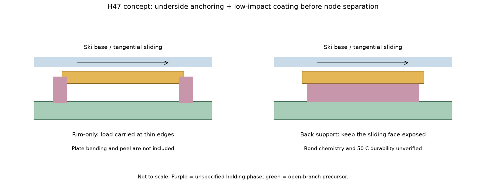
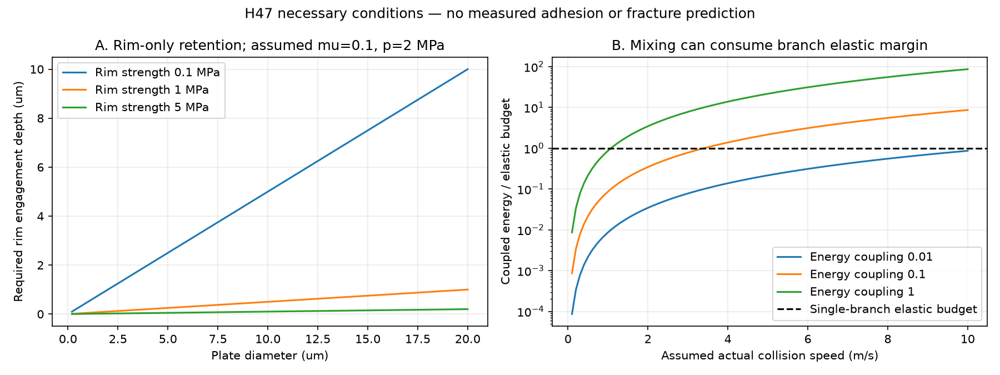

# 多方向探索 第47巡：結晶の裏面保持と枝を壊さない被覆工程

2026-10-09／Codex／Claudeへの独立検証依頼。基準main：a835ce4c172ecc47e0e43fb4a891b09f6b399a90。

**H46の板状結晶案を、裏面で荷重を支え、支持された母材へ工場で被覆し、最後に節点を分けるH47へ展開した。** 新たに実在の被覆製法とLL（Nε-ラウロイル-L-リシン）の触感原著を調べ、保持の面積、製造衝撃、有限変位、全床へ使う費用を同時に検討した。

得た成果は、①粉体表面へのLL付着は既存技術なので、その実在と本案の未成立部分を区別できたこと、②縁だけの保持から裏面支持へ荷重経路を追加したこと、③高速撹拌を完成した細枝へ適用する前に、枝の弾性余裕と製造順序を評価する条件を得たこと。柔らかい接点を動かす別案も比較し、それだけでは長距離の低摩擦にならない範囲を計算した。

**物理試験0件、実物成功確率は未算定。26数値照合は材料の合格率ではない。** LLの初回ソール摩擦・50℃寿命・安全性・雪感は未実証。特許資料を技術開示として参照し、権利状態、実施自由、今回の特許性は判定していない。

## 1. 目的と比較条件

気温30℃以上・表面約50℃、現地非冷却、常時散水なしで、新雪圧雪の走り・沈み・横支持・短いエッジ解放・振動・停止再始動を再現する。砂泥化、露出マット、粉の破砕による柔らかさを成果の代わりにしない。

共通比較は2,000m²、450mm床、乾燥嵩密度120kg/m³、骨格108t、300mm削れ代、約30°。9〜17時、整地間隔4〜5時間、昼の閉鎖約60分を継承する。下地ネット等は最大削れ深さ＋余裕より下に置くR39を優先。整地設備の仮上限2億円と、材料・工場・全面造成の費用は区別する。人・自然環境への無害性、冬の排水と雪固着、自然地盤を超える融雪を生まないことが同時条件である。

| 方向 | 今回の扱い |
|---|---|
| H46の結晶縁保持 | 脱落に必要な保持深さを計算。板厚・接着・剥離の根拠不足を具体化 |
| H47の結晶裏面保持 | 滑走面を露出させ、背面の面積で力を受ける比較案へ追加 |
| 自由粉の転がり／層すべり | 粉を失いながらだけ滑る場合は採用しない。機構判別の密閉対照 |
| 柔らかい接点の有限移動 | 1回の短いストロークで稼げる距離は小さい。エッジの感触調整へ利用 |
| H45の保水接点 | 乾式材料が成立しない場合の別機構として比較を維持 |
| 常温噴霧による枝状結晶 | 今回の微細LL製造は低温・溶剤等を使う。常温水噴霧の達成例には数えない |

## 2. 新しく確認した一次資料

### 2.1 被覆はできても、枝と滑走が保つとは限らない

US20250136541A1には、微細LLをセルロース・デンプン等へ混ぜる例がある。Table 5-3の例は撹拌翼周速40m/s、10分で、本文は混合中80℃未満の管理を記す。デンプンへ基材100質量部当たりLL5部を加えた例で、20粒の投影画像の被覆面積が平均67％と報告される。これは接着耐力・スキー摩擦・荷重分担の67％ではない。[S1：製法特許](https://patents.google.com/patent/US20250136541A1/en)

同資料Table 2-1の微細晶析例では、個数基準D90=0.20µmでも体積基準平均径は1.80µmまたは0.37µm。個数の90％を質量の90％へ読み替えない。晶析は低温等を使い、現地の真夏の噴霧で同じ形が得られる証拠ではない。比較例2-2の温度に本文25℃／表10℃の不一致があるため、勝手に統一して最適温度に使わない。

別のEP3928837A1は、LL4gとコーンスターチ16gを100rpm・15時間のボールミル処理で表面付着させた例を示す。LLは混合物の20wt％、基材100部当たりなら25部であり、S1の20部／100部とは異なる。付着の顕微鏡確認は、化学結合・耐摩耗寿命の証明ではない。粒圧縮から得たデンプンの弾性率を濡れた50℃の枝の弾性率へ使わない。[S2：粉体被覆特許](https://patents.google.com/patent/EP3928837A1/en)

さらにEP2825180A1には、基材上へのLL析出と物理混合の表面状態の違いがある。ただし取得HTMLではTable 18の数値画像が欠けており、摩擦係数の数値を補わなかった。合成雲母等の基材を本案へ採用したという意味でもない。[S4：板状基材への被覆](https://patents.google.com/patent/EP2825180A1/en)

これらから、H46の「結晶を基材に保持する」一般論自体は既存技術と整理する。本計画で未成立なのは、開放枝の形状を壊さず、実ソールに対して低摩擦で、摩耗粉を抑えて50℃・雨・冬を通せる保持と製造である。

### 2.2 しっとり滑らかな触感と、スキーの初回摩擦は別

Kikegawaらの原著ではLLは粉体B（粒径表記23µm）。25±1℃、相対湿度51±2％、ウレタン指モデル、人工皮膚上の乾燥粉5mg、荷重0.98N、最大速度の記載30mm/sで評価されている。LLの静摩擦と動摩擦の差は0.15。本文の静摩擦0.73は別の粉体Aであり、LLへ転記しない。補足Table S4は未取得なのでLLの絶対値を復元していない。[S3：原著](https://doi.org/10.1098/rsos.190039)、[取得した原著PDFの公開コピー](https://upload.wikimedia.org/wikipedia/commons/2/2c/Physical_origin_of_a_complicated_tactile_sensation_-_%E2%80%98shittori_feel%27.pdf)

滑らかな触感でも動き始めの抵抗差があり得るため、スキーのグラブ確認を初回・停止再始動まで広げる。0.15をPEソールの係数差には使わない。速度式のDを片振幅30mmと読むと63mm/s、全ストロークと読むと31.5mm/sになり、後者が記載約30に近い。これは振幅の定義の曖昧さとして残し、測定値の誤りと断定しない。

## 3. H47：裏面保持にして、滑る面は残す



図は荷重経路を示す概念図で製作寸法ではない。紫の保持相は未選定。骨格の表皮を用いる方法と、少量の別保持相を用いる方法を比較する。50℃での強度、残留物・摩耗物の安全性が満たされなければ採用しない。

直径Dの円板投影面へ均一圧p、摩擦係数μが作用する模型では、横力T=μpπD²/4。縁全周を深さeまで留める模型の抵抗上限をτ_a πDeとすれば：

**必要な縁保持深さ e ≧ μpD/(4τ_a)。**

仮にμ=0.1、p=2MPa、τ_a=1MPaなら、D=20µmでe=1µm、D=2µmでe=0.1µm。τ_a=0.1MPaならそれぞれ10µm・1µmが必要になる。LLの実板厚や接着強度は未取得であり、必要深さが実板厚を超えるならその配置は成り立たない。μも強度も測定値ではない。

裏面のβだけが接合するなら面積はβπD²/4なので：

**必要な平均裏面せん断耐力 τ_back ≧ μp/β。**

同じμ=0.1・p=2MPaでβ=0.5なら0.4MPa。接合面積を使って力を受けるため、この単純模型では直径が消える。小粒化だけで裏面の必要強度を減らすことはできない。

これらは均一せん断の容量計算。端部剥離、板の曲げ、欠陥、濡れ、温度、繰返しを含まない。裏面が保持されても結晶内部で上層が剥がれる場合があり、粒全体の付着と表層の摩耗を別に測る。低摩擦の面まで保持材で覆えば効果を失う可能性もある。

## 4. 粉体用の高速被覆を、細い枝へ移してよいか



S1の40m/sは撹拌翼の周速で、粒子衝突速度ではない。実際の衝突速度をv=α×40、枝へ入るエネルギー割合をηとして未知のまま比較した。

半径r・長さL・弾性率Eの丸い片持ち枝なら、I=πr⁴/4、k=3EI/L³、表面応力の限界σまでの荷重F=σI/(Lr)。そのときの変位はδ=σL²/(3Er)、弾性エネルギーはU=σ²πr²L/(24E)。

例として6本の枝、r=30µm、L=150µm、密度1,200kg/m³、E=1GPa、仮の弾性限界σ=10MPaを置いた。1枝の限界変位2.5µm、U=1.767nJ、6枝合計質量3.054µg。中央部質量・隣接粒・減衰は省略している。

衝突速度4m/s（α=0.1）、エネルギーの10％が1枝へ入る仮定（η=0.1）では入力2.443nJ、上記弾性予算の1.382倍。**これは破壊したという結果でも、その確率でもない。** 予算超過分が塑性・摩擦・反発・他の枝へ流れる経路を解いていない。予算以下でも欠陥・疲労・応力集中による損傷は否定できない。

6枝の質量もr²Lに比例するとした模型では、入力／弾性予算=12nρEv²η/σ²となり、rとLが消える。単に枝を太くすれば同じ運動での余裕が必ず増えるとは言えない。ただし中央部質量、枝数、同時支持本数、衝突経路が変わればこの相殺も変わる。

この代表枝はr/L=0.2で細長い梁の近似にも限界がある。ポアソン比0.3・せん断補正係数0.9を仮定してせん断変形を追加すると、同じ曲げ応力で変位・エネルギーが約8.67％増え、代表比は約1.27となる。これはモデル感度であり、衝撃・塑性の解析に置き換わるものではない。

ここからH47の工程案を具体化する：

1. 工場でLL結晶と開放骨格母材を別々に用意し、それぞれの形態・残留物を確認する。
2. 枝がまだ母材で支持されている段階で、裏面保持を狙う低衝撃の接触塗工・付着・余剰粉回収を行う。
3. 保持と表面の露出を確認してから、H38の節点を選ぶ分断へつなげる。分断が被覆を剥がさないことも確認する。
4. 母材を濡らす析出法を使う場合は、基材の耐薬品性・洗浄・乾燥・残留物・30〜50℃での形状寿命を別評価する。

「低衝撃なら十分付く」「分断しても全部残る」は未実証。少量の保持相で付着が足りなければ、工程を強くするだけでなく、結晶面積・表皮組成・接触配置を変える。S1の高回転10分やS2の15時間処理を、そのまま現地60分整地へ入れない。

## 5. 別案：接点を少し動かすだけで摩擦を逃がせるか

柔らかい裏打ち、曲がる首、有限に回る接点を比較した。これは表面化学以外の切り口だが、連続的な長距離滑走と、短いエッジの解放を分ける必要がある。

一度だけ動ける距離をs₀、載荷時間t、速度Uとする。最初のs₀の間だけ摩擦が完全にゼロになり、その後は元と同じ抵抗になるという楽観的な仮定でも、対象経路の仕事削減割合はs₀/(Ut)まで。5m/s・0.1秒ならUt=0.5mで、s₀=100µmは20µs分、距離割合は0.02％である。弾性変形自体の抵抗・戻りの散逸はここに含めていない。

これは回転軸を持つ連続回転、接触の入れ替わり、繰返し除荷で戻る機構の否定ではない。そちらは接触履歴・支点摩擦・製造費が別途必要。**有限の首振りだけを乾式潤滑の代用にはせず、H32の短いエッジ解放と形状回復に使う。** 結晶界面の低摩擦は依然として必要になる。

## 6. 全床への直接配合と、少量裏面保持の費用

骨格108t、比表面積を半径30µmの円柱で近似した600万m²、LL価格1万円/kg、良品歩留まり80％、10年・8％を仮定する。価格・歩留まりは見積りではない。以下の「部」は基材100質量部当たりで、混合物中の百分率と区別する。

| LLの投入比 | 保持LL量 | 購入量 | 初期LL費 | 初期費の年額化 |
|---:|---:|---:|---:|---:|
| 3部/100部 | 3.24t | 4.05t | 4,050万円 | 約604万円/年 |
| 5部/100部 | 5.40t | 6.75t | 6,750万円 | 約1,006万円/年 |
| 20部/100部 | 21.60t | 27.00t | 2億7,000万円 | 約4,024万円/年 |

5部/100部は混合物の4.7619wt％。前巡H46の仮配置（骨格表面20％へ等価堆積厚0.5µm）の保持LL720kgに対して7.5倍になる。全床へ化粧品配合を移すだけでは、年500万円という前巡の結晶相用の仮枠を初期費の年額化だけで超える。**この年500万円は診断用の仮枠で、依頼者の確定予算ではない。** 配合が床全体で同じ効果を出すとの根拠もない。

H47の保持相の数量は、被覆対象面積Aφ、裏面接合率β、等価厚h_b、密度ρ_bに対してm_b=Aφβh_bρ_b。A=600万m²、φ=20％、β=50％、h_b=0.2µm、ρ_b=1,200kg/m³なら保持相144kg、歩留まり80％なら購入180kg。仮単価1,000円/kgなら18万円、5,000円/kgなら90万円である。

これは材料だけの差分。実板の配向・重なり・表面粗さによる必要量、保持相の化学組成、均一施工の機械、洗浄、余剰粉回収、歩留まり、交換を含まない。0.2µmの連続した均一接合が実現したわけでもない。保持相が安く少量でも、LLを全体へ大量に混ぜる費用を帳消しにはしない。

したがって経済面で優先するのは、結晶の利用効率を上げて必要な接触面だけへ残すこと、滑らかさを保ったまま粉の損失を減らすこと、母材支持中の工程で形態歩留まりを上げること。保持相を薄くし過ぎてすぐ剥がれる案は前巡の摩耗補充費で比較する。

骨格・工場・全面造成・整地設備・交換・回収・環境対策・税の整合を含む総額は未見積り。設備上限2億円の達成や、人工降雪より安いとの結論は出していない。同じ面積・深さ・営業期間・復旧性能へそろえて比較する。

## 7. 雨後、冬、60分整地と接続する

| 条件 | H47へ追加する確認 |
|---|---|
| 50℃乾燥・停止再始動 | 実UHMWPEソールで初回抵抗、定常、停止後の静動差を測る。LLの指触感を代用にしない |
| 濡れ・半乾き・再乾燥 | 裏面接合と表層剥離を分け、化学的に不溶でも保持が失われないか確認 |
| 豪雨・山麓回収 | 同じ配合・粒形・保持状態が戻るかを測る。回収して上へ運ぶだけで結晶脱落は修復されない |
| 60分の通常整地 | 枝の再配置・接点復帰と部分交換を行う構成。工場の晶析・洗浄・長時間乾燥を現地工程へ含めない |
| 冬の雪固着 | 撥水性の連続弱面を作らず、雪が入り込む非被覆空隙と排水路を残す。凍結融解後のせん断と追加融雪を自然地盤対照で確認 |
| 安全・環境 | 細かい結晶を含む実摩耗粉で粒径別曝露・溶出・水生影響を評価する。固定化は放出ゼロの証明ではない |

S1の微細化を進めるほど滑りも安全も良くなる、とはしない。個数・体積・表面積・空気力学的な粒径は用途が異なる。原料LLだけでなく保持相・骨格との組合せ、摩耗後・紫外線後の状態が対象になる。油・塩類・フッ素・シリコーンによる潤滑、現地強酸処理は採用しない。工場処理の残留物もコースへ持ち込まない条件を確認する。

## 8. 次の比較とClaudeへの独立検証依頼

回覧板・README・正本v36・Claudeのv2と方針を再確認した。基準a835ce4c以降の新しいClaude結果は確認できていない。v3の全結果・元コード・稼働中プロセスも未確認。公開共有を受領・同意とみなさない。

次の比較は同じ骨格・同じLL量で、無被覆、自由粉の密閉対照、H46縁保持、H47裏面保持、保持相のみ、H45保水接点を並べる。平板での摩擦と保持が残った案だけを、同じ床厚・乾燥質量・削れ代の枝状粒床へ進める。合格は低摩擦だけでなく、雪対照の沈み・横支持・解放距離・振動・ソール損傷を含む。購入・発注・物理試験はしていない。

Claudeには以下を独立に反証してほしい。

1. S1/S2の配合単位、個数と体積基準、処理時間・温度を確認する。付着写真を化学結合や摩耗寿命へ読み替えない。
2. S3のA/Bの区別と静動差0.15の適用範囲を確認する。30mm/sの指モデルを50℃・実ソール2/5/10m/sへ外挿しない。
3. 縁保持と裏面保持へ剥離・結晶内部の層破壊を追加し、保持相が滑走面を覆わずに耐える条件を調べる。
4. 撹拌翼速度から実衝突速度・エネルギー分配を決める根拠を示す。1.382倍やせん断補正後1.27を破壊確率にしない。
5. 母材支持中の低衝撃被覆→節点分断という工程の実現性と、粉回収・洗浄・乾燥・交換を含む年額費を比較する。
6. 冬の弱面と安全性を同時に監査し、v3の候補・入力・元コード・出典をGitHubへ共有してほしい。

目標の成功率90％超は、事前に定義した運用条件と独立な実物試験の証拠が必要。旧15〜25％は従来案の主観予測。今回の接合率50％、画像被覆67％、粒径D90、数値照合26件は成功率の代わりにしない。

## 9. 再現資料

- [入力](結晶裏面保持と被覆工程検証_20261009/inputs.json)／[全コード](結晶裏面保持と被覆工程検証_20261009/calculate.py)／[結果](結晶裏面保持と被覆工程検証_20261009/results.json)。縁保持27・裏面9・衝撃27・有限変位9・配合費3・保持相費6条件。
- [26数値照合](結晶裏面保持と被覆工程検証_20261009/numerical-validation.json)：力・質量・梁の独立式・尺度相殺・費用・引用速度の解釈。実物合否ではない。
- [一次資料4件の台帳](結晶裏面保持と被覆工程検証_20261009/sources.json)：取得範囲、原資料ハッシュ、未取得と矛盾。
- [再現案内](結晶裏面保持と被覆工程検証_20261009/README.md)／[公開マニフェスト](結晶裏面保持と被覆工程検証_20261009/publication-manifest.json)。図2点は独自作成。第三者PDF・原図は再配布していない。

GitHubの固定コミットから全成果を読み戻し照合した後、ローカルの研究成果・取得資料・依存ライブラリ・作業用Git履歴を削除する。接続案内と利用設定は保持する。

## 付録A：完全な入力

```json
{
  "cycle": 47,
  "date": "2026-10-09",
  "base_commit": "a835ce4c172ecc47e0e43fb4a891b09f6b399a90",
  "physical_tests": 0,
  "physical_success_probability": null,
  "note": "Hypothesis-level necessary conditions; no fitted material property and no candidate success probabilities.",
  "retention": {
    "mu": 0.1,
    "plate_diameters_m": [
      2e-7,
      0.000002,
      0.00002
    ],
    "contact_pressures_Pa": [
      500000,
      2000000,
      10000000
    ],
    "anchor_shear_strength_Pa": [
      100000,
      1000000,
      5000000
    ],
    "back_bonded_area_fraction": [
      0.25,
      0.5,
      1
    ],
    "note": "Circular platelet projection; uniform pressure and interface strength; peel, bending, defects and roughness excluded. Rim area=pi*D*e; backside area=beta*pi*D^2/4."
  },
  "impact": {
    "branch_count": 6,
    "branch_radius_m": 0.00003,
    "branch_length_m": 0.00015,
    "density_kg_m3": 1200,
    "E_Pa": 1000000000,
    "elastic_limit_Pa": [
      5000000,
      10000000,
      20000000
    ],
    "mixer_tip_speed_m_s": 40,
    "collision_speed_fraction": [
      0.01,
      0.1,
      1
    ],
    "energy_coupling_fraction": [
      0.01,
      0.1,
      1
    ],
    "simultaneous_supports": 1,
    "note": "Tip speed cited from S1 Table5-3; collision speed, coupling, branch model and elastic limit are assumptions. Energy comparison is neither fracture prediction nor fatigue life.",
    "poisson_ratio": 0.3,
    "shear_correction_factor": 0.9
  },
  "finite_motion": {
    "available_stroke_m": [
      0.00001,
      0.00003,
      0.0001
    ],
    "speeds_m_s": [
      2,
      5,
      10
    ],
    "loaded_time_s": 0.1,
    "note": "Single forward stroke with no reset. Optimistic fraction of travel with zero friction; not whole-cycle energy proof."
  },
  "cost": {
    "bed_area_m2": 2000,
    "bed_depth_m": 0.45,
    "bulk_density_kg_m3": 120,
    "skeleton_density_kg_m3": 1200,
    "skeleton_radius_m": 0.00003,
    "LL_density_kg_m3": 1200,
    "LL_price_JPY_kg": 10000,
    "yield_fraction": 0.8,
    "discount_rate": 0.08,
    "years": 10,
    "patent_LL_parts_per_100_base": [
      3,
      5,
      20
    ],
    "target_LL_deposit_kg": 720,
    "patch_area_fraction": 0.2,
    "bonded_back_fraction": 0.5,
    "holding_layer_eq_thickness_m": [
      5e-8,
      2e-7,
      0.000001
    ],
    "holding_layer_density_kg_m3": 1200,
    "holding_layer_price_JPY_kg": [
      1000,
      5000
    ],
    "note": "Unquoted marginal material costs. Holding phase chemistry, fabrication equipment and extra processing remain unchosen/unpriced. Patent ratios are not recommended ski composition."
  },
  "source_kinematics": {
    "D_reported_m": 0.03,
    "omega_rad_s": 2.1,
    "reported_max_speed_m_s": 0.03,
    "note": "S3 eq2.1 gives |D|*omega but supplied D=30mm would give63mm/s. Half-stroke interpretation gives31.5mm/s. Retain discrepancy, do not silently correct source."
  }
}
```

## 付録B：完全なコード

```python
"""H47 necessary-condition calculations. No physical test or success estimate."""
from pathlib import Path
import json, math, sys
ROOT=Path(__file__).resolve().parent
if (ROOT.parents[1]/'.deps').exists(): sys.path.insert(0,str(ROOT.parents[1]/'.deps'))
I=json.loads((ROOT/'inputs.json').read_text(encoding='utf-8'))
R=I['retention']; P=I['impact']; C=I['cost']; F=I['finite_motion']
def save(name,data):
 (ROOT/name).write_text(json.dumps(data,ensure_ascii=False,indent=2,allow_nan=False)+'\n',encoding='utf-8',newline='\n')
rim=[]
for D in R['plate_diameters_m']:
 for p in R['contact_pressures_Pa']:
  for tau in R['anchor_shear_strength_Pa']:
   area=math.pi*D*D/4
   force=R['mu']*p*area
   e=force/(tau*math.pi*D)
   rim.append(dict(D_m=D,p_Pa=p,tau_Pa=tau,friction_force_N=force,minimum_engaged_edge_depth_m=e,e_over_D=e/D))
back=[]
for p in R['contact_pressures_Pa']:
 for beta in R['back_bonded_area_fraction']:
  back.append(dict(p_Pa=p,bonded_fraction=beta,required_uniform_shear_Pa=R['mu']*p/beta))
def beam(radius,length,E,sigma,rho,arms):
 inertia=math.pi*radius**4/4
 stiffness=3*E*inertia/length**3
 limit_force=sigma*inertia/(length*radius)
 delta=limit_force/stiffness
 elastic_energy=limit_force*delta/2
 mass=arms*rho*math.pi*radius**2*length
 return dict(inertia_m4=inertia,stiffness_N_m=stiffness,force_N=limit_force,delta_m=delta,elastic_energy_J=elastic_energy,grain_mass_kg=mass)
impact=[]
for sig in P['elastic_limit_Pa']:
 b=beam(P['branch_radius_m'],P['branch_length_m'],P['E_Pa'],sig,P['density_kg_m3'],P['branch_count'])
 for alpha in P['collision_speed_fraction']:
  speed=alpha*P['mixer_tip_speed_m_s']
  for eta in P['energy_coupling_fraction']:
   coupled=.5*b['grain_mass_kg']*speed**2*eta
   capacity=b['elastic_energy_J']*P['simultaneous_supports']
   impact.append(dict(sigma_Pa=sig,collision_speed_fraction=alpha,collision_speed_m_s=speed,coupling=eta,coupled_energy_J=coupled,elastic_budget_J=capacity,budget_ratio=coupled/capacity,meaning='single ideal impact budget only, not fracture outcome'))
finite=[]
for stroke in F['available_stroke_m']:
 for speed in F['speeds_m_s']:
  travel=speed*F['loaded_time_s']
  finite.append(dict(stroke_m=stroke,speed_m_s=speed,loaded_travel_m=travel,one_stroke_time_s=stroke/speed,optimistic_zero_friction_distance_fraction=min(1,stroke/travel)))
mass=C['bed_area_m2']*C['bed_depth_m']*C['bulk_density_kg_m3']
area=2*mass/(C['skeleton_density_kg_m3']*C['skeleton_radius_m'])
r=C['discount_rate'];n=C['years'];crf=r*(1+r)**n/((1+r)**n-1)
cost=[]
for parts in C['patent_LL_parts_per_100_base']:
 deposit=mass*parts/100
 initial=deposit*C['LL_price_JPY_kg']/C['yield_fraction']
 cost.append(dict(LL_parts_per_100_base=parts,LL_fraction_of_total=parts/(100+parts),deposit_kg=deposit,purchase_kg=deposit/C['yield_fraction'],initial_JPY=initial,annualized_JPY=initial*crf,equivalent_full_skeleton_thickness_m=deposit/(C['LL_density_kg_m3']*area),ratio_to_previous_target=deposit/C['target_LL_deposit_kg']))
binder=[]
for h in C['holding_layer_eq_thickness_m']:
 for price in C['holding_layer_price_JPY_kg']:
  deposit=area*C['patch_area_fraction']*C['bonded_back_fraction']*h*C['holding_layer_density_kg_m3']
  initial=deposit/C['yield_fraction']*price
  binder.append(dict(h_m=h,price_JPY_kg=price,deposit_kg=deposit,purchase_kg=deposit/C['yield_fraction'],initial_JPY=initial,annualized_JPY=initial*crf))
bref=beam(30e-6,150e-6,1e9,10e6,1200,6)
G=P['E_Pa']/(2*(1+P['poisson_ratio']))
delta_shear=bref['force_N']*P['branch_length_m']/(P['shear_correction_factor']*G*math.pi*P['branch_radius_m']**2)
shear_factor=1+delta_shear/bref['delta_m']
source_speed=I['source_kinematics']['D_reported_m']*I['source_kinematics']['omega_rad_s']
checks=[]
def check(name,passed):
 checks.append(dict(name=name,passed=bool(passed)))
 if not passed: raise AssertionError(name)
def near(a,b):return math.isclose(a,b,rel_tol=1e-10,abs_tol=1e-14)
check('bed mass 108t',near(mass,108000))
check('branch lateral area 6million m2',near(area,6000000))
rr=next(x for x in rim if x['D_m']==20e-6 and x['p_Pa']==2e6 and x['tau_Pa']==1e6)
check('rim depth 1um representative',near(rr['minimum_engaged_edge_depth_m'],1e-6))
check('rim shear capacity equals applied tangential force',near(math.pi*rr['D_m']*rr['minimum_engaged_edge_depth_m']*rr['tau_Pa'],rr['friction_force_N']))
check('rim dimensionless depth independent diameter',near(rim[0]['e_over_D'],rim[9]['e_over_D']))
check('backside half area needs 0.4MPa at 2MPa',near(next(x['required_uniform_shear_Pa'] for x in back if x['p_Pa']==2e6 and x['bonded_fraction']==.5),.4e6))
check('backside full area halves required stress',near(back[1]['required_uniform_shear_Pa']/back[2]['required_uniform_shear_Pa'],2))
check('beam delta stress relation',near(bref['delta_m'],10e6*(150e-6)**2/(3*1e9*30e-6)))
check('beam energy independent formula',near(bref['elastic_energy_J'],(10e6)**2*math.pi*(30e-6)**2*150e-6/(24*1e9)))
check('reference delta 2.5um',near(bref['delta_m'],2.5e-6))
check('grain mass six branches',near(bref['grain_mass_kg'],6*1200*math.pi*(30e-6)**2*150e-6))
ref=next(x for x in impact if x['sigma_Pa']==10e6 and x['collision_speed_fraction']==.1 and x['coupling']==.1)
check('impact ratio 1.3824',near(ref['budget_ratio'],1.3824))
check('impact ratio alternate analytical cancellation',near(ref['budget_ratio'],12*6*1200*1e9*4**2*.1/(10e6)**2))
b2=beam(60e-6,150e-6,1e9,10e6,1200,6)
check('thickening changes mass and energy together',near(b2['grain_mass_kg']/bref['grain_mass_kg'],b2['elastic_energy_J']/bref['elastic_energy_J']))
check('doubling limit stress quadruples elastic budget',near(beam(30e-6,150e-6,1e9,20e6,1200,6)['elastic_energy_J']/bref['elastic_energy_J'],4))
check('100um stroke at5m/s lasts20us',near(100e-6/5,20e-6))
check('100um stroke accounts for .02percent of .5m travel',near(100e-6/(5*.1),.0002))
check('5 parts per100 gives 5400kg',near(cost[1]['deposit_kg'],5400))
check('5 parts is4.7619 percent total not5percent',near(cost[1]['LL_fraction_of_total'],1/21))
check('5parts price is67.5million JPY',near(cost[1]['initial_JPY'],67500000))
check('5parts uses7.5times720kg',near(cost[1]['ratio_to_previous_target'],7.5))
br=next(x for x in binder if x['h_m']==.2e-6 and x['price_JPY_kg']==1000)
check('holding phase144kg and180000JPY',near(br['deposit_kg'],144) and near(br['initial_JPY'],180000))
check('source speed equation gives63mm/s',near(source_speed,.063))
check('shear correction increases displacement by8.6667percent',near(shear_factor,1+13/150))
check('shear energy correction lowers impact budget ratio',ref['budget_ratio']/shear_factor<ref['budget_ratio'])
check('physical probability not estimated',I['physical_tests']==0 and I['physical_success_probability'] is None)
results=dict(cycle=47,physical_tests=0,physical_success_probability=None,rim_conditions=rim,back_conditions=back,impact_conditions=impact,beam_reference=bref,impact_reference=ref,shear_sensitivity=dict(extra_deflection_m=delta_shear,capacity_factor=shear_factor,corrected_reference_ratio=ref['budget_ratio']/shear_factor,note='Timoshenko shear compliance added at same bending-stress limit; still not impact/fracture simulation'),finite_motion=finite,coating_cost=cost,holding_phase_cost=binder,capital_recovery_factor=crf,source_speed_diagnostic=dict(literal_equation_m_s=source_speed,half_stroke_m_s=source_speed/2,stated_max_m_s=.03,interpretation='documented ambiguity, not a measured correction'),counts=dict(rim=len(rim),back=len(back),impact=len(impact),finite=len(finite),coating_cost=len(cost),holding_cost=len(binder)),numerical_checks=len(checks))
save('results.json',results);save('numerical-validation.json',dict(status='passed',checks=checks,scope='Equations and implementation only. No material validation.'))
import matplotlib
matplotlib.use('Agg')
import matplotlib.pyplot as plt
from matplotlib.patches import Rectangle,FancyArrowPatch
plt.rcParams.update({'font.size':10,'svg.fonttype':'none'})
fig,axs=plt.subplots(1,2,figsize=(12,4.5))
for tau in R['anchor_shear_strength_Pa']:
 ds=[.2+i*.2 for i in range(100)]
 axs[0].plot(ds,[.1*2e6*d/(4*tau) for d in ds],label=f'Rim strength {tau/1e6:g} MPa')
axs[0].set(xlabel='Plate diameter (um)',ylabel='Required rim engagement depth (um)',title='A. Rim-only retention; assumed mu=0.1, p=2 MPa');axs[0].legend();axs[0].grid(alpha=.25)
vs=[.1+i*.1 for i in range(100)]
for eta in P['energy_coupling_fraction']:
 ratios=[.5*bref['grain_mass_kg']*v*v*eta/bref['elastic_energy_J'] for v in vs]
 axs[1].plot(vs,ratios,label=f'Energy coupling {eta:g}')
axs[1].axhline(1,color='black',ls='--',label='Single-branch elastic budget')
axs[1].set(xlabel='Assumed actual collision speed (m/s)',ylabel='Coupled energy / elastic budget',title='B. Mixing can consume branch elastic margin',yscale='log');axs[1].legend();axs[1].grid(alpha=.25)
fig.suptitle('H47 necessary conditions — no measured adhesion or fracture prediction')
fig.tight_layout();fig.savefig(ROOT/'constraints.svg');fig.savefig(ROOT/'constraints.png',dpi=150);plt.close(fig)
fig,axs=plt.subplots(1,2,figsize=(12,4.5))
for ax in axs:ax.set(xlim=(0,1),ylim=(0,1));ax.axis('off')
for ax,mode in zip(axs,['rim','back']):
 ax.add_patch(Rectangle((.12,.72),.76,.07,facecolor='#c9dbe8'));ax.text(.5,.85,'Ski base / tangential sliding',ha='center')
 ax.add_patch(Rectangle((.24,.6),.52,.09,facecolor='#e5b655',edgecolor='#876521'))
 ax.add_patch(Rectangle((.12,.34),.76,.13,facecolor='#a7ccb8',edgecolor='#37644b'))
 ax.add_patch(FancyArrowPatch((.3,.75),(.7,.75),arrowstyle='->',mutation_scale=15))
 if mode=='rim':
  for x in [.2,.74]:ax.add_patch(Rectangle((x,.46),.06,.19,facecolor='#c796aa'))
  ax.text(.5,.22,'Rim-only: load carried at thin edges',ha='center');ax.text(.5,.12,'Plate bending and peel are not included',ha='center',fontsize=9)
 else:
  ax.add_patch(Rectangle((.26,.47),.48,.13,facecolor='#c796aa'))
  ax.text(.5,.22,'Back support: keep the sliding face exposed',ha='center');ax.text(.5,.12,'Bond chemistry and 50 C durability unverified',ha='center',fontsize=9)
fig.suptitle('H47 concept: underside anchoring + low-impact coating before node separation',fontsize=12)
fig.text(.5,.02,'Not to scale. Purple = unspecified holding phase; green = open-branch precursor.',ha='center',fontsize=9)
fig.tight_layout(rect=(0,.05,1,.95));fig.savefig(ROOT/'concept.svg');fig.savefig(ROOT/'concept.png',dpi=150);plt.close(fig)
for name in ['concept.svg','constraints.svg']:
 p=ROOT/name;p.write_text('\n'.join(s.rstrip() for s in p.read_text(encoding='utf-8').splitlines())+'\n',encoding='utf-8',newline='\n')
print(json.dumps({'counts':results['counts'],'checks':len(checks),'reference_beam':bref,'reference_impact':ref,'cost5parts':cost[1],'binder_example':br},ensure_ascii=False))
```
